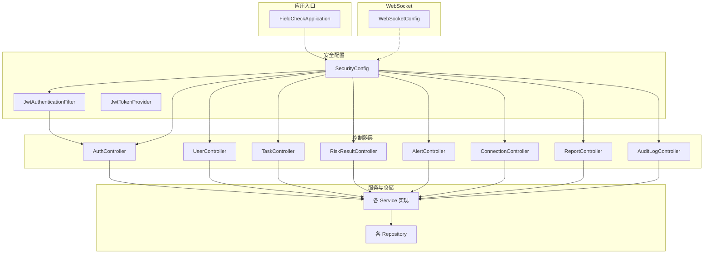
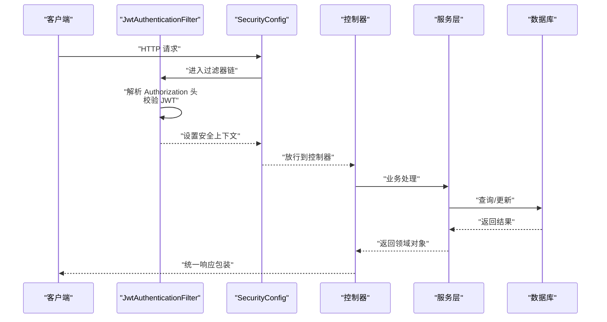
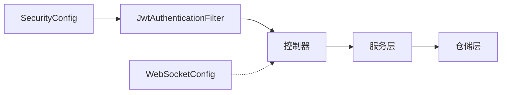

# API接口文档

<cite>
**本文引用的文件**
- [FieldCheckApplication.java](file://backend/src/main/java/com/fieldcheck/FieldCheckApplication.java)
- [SecurityConfig.java](file://backend/src/main/java/com/fieldcheck/config/SecurityConfig.java)
- [WebSocketConfig.java](file://backend/src/main/java/com/fieldcheck/config/WebSocketConfig.java)
- [JwtTokenProvider.java](file://backend/src/main/java/com/fieldcheck/security/JwtTokenProvider.java)
- [JwtAuthenticationFilter.java](file://backend/src/main/java/com/fieldcheck/security/JwtAuthenticationFilter.java)
- [AuthController.java](file://backend/src/main/java/com/fieldcheck/controller/AuthController.java)
- [UserController.java](file://backend/src/main/java/com/fieldcheck/controller/UserController.java)
- [TaskController.java](file://backend/src/main/java/com/fieldcheck/controller/TaskController.java)
- [RiskResultController.java](file://backend/src/main/java/com/fieldcheck/controller/RiskResultController.java)
- [AlertController.java](file://backend/src/main/java/com/fieldcheck/controller/AlertController.java)
- [ConnectionController.java](file://backend/src/main/java/com/fieldcheck/controller/ConnectionController.java)
- [ReportController.java](file://backend/src/main/java/com/fieldcheck/controller/ReportController.java)
- [AuditLogController.java](file://backend/src/main/java/com/fieldcheck/controller/AuditLogController.java)
- [ApiResponse.java](file://backend/src/main/java/com/fieldcheck/dto/ApiResponse.java)
- [LoginRequest.java](file://backend/src/main/java/com/fieldcheck/dto/LoginRequest.java)
</cite>

## 目录
1. [简介](#简介)
2. [项目结构](#项目结构)
3. [核心组件](#核心组件)
4. [架构总览](#架构总览)
5. [详细组件分析](#详细组件分析)
6. [依赖分析](#依赖分析)
7. [性能与安全](#性能与安全)
8. [故障排查指南](#故障排查指南)
9. [结论](#结论)
10. [附录](#附录)

## 简介
本文件为 MySQL 风险字段检查平台的完整 API 接口文档，覆盖认证与授权、RESTful API 端点、请求与响应格式、错误码、版本管理与兼容性策略、测试与调试方法、速率限制与安全建议，以及 WebSocket 实时 API 的使用方式。平台采用 Spring Boot 构建，基于 JWT 进行无状态认证，通过统一响应包装类返回标准结构。

## 项目结构
后端采用分层架构：controller 层负责暴露 REST API；service 层封装业务逻辑；repository 层访问数据库；security 层处理认证与鉴权；config 层配置 CORS、安全策略与 WebSocket；dto 定义传输对象；entity 定义持久化模型；websocket 提供实时通信能力。

图表来源
- [FieldCheckApplication.java](file://backend/src/main/java/com/fieldcheck/FieldCheckApplication.java#L1-L17)
- [SecurityConfig.java](file://backend/src/main/java/com/fieldcheck/config/SecurityConfig.java#L1-L60)
- [WebSocketConfig.java](file://backend/src/main/java/com/fieldcheck/config/WebSocketConfig.java#L1-L26)
- [JwtAuthenticationFilter.java](file://backend/src/main/java/com/fieldcheck/security/JwtAuthenticationFilter.java#L1-L59)
- [JwtTokenProvider.java](file://backend/src/main/java/com/fieldcheck/security/JwtTokenProvider.java#L1-L95)
- [AuthController.java](file://backend/src/main/java/com/fieldcheck/controller/AuthController.java#L1-L56)
- [UserController.java](file://backend/src/main/java/com/fieldcheck/controller/UserController.java#L1-L136)
- [TaskController.java](file://backend/src/main/java/com/fieldcheck/controller/TaskController.java#L1-L99)
- [RiskResultController.java](file://backend/src/main/java/com/fieldcheck/controller/RiskResultController.java#L1-L146)
- [AlertController.java](file://backend/src/main/java/com/fieldcheck/controller/AlertController.java#L1-L67)
- [ConnectionController.java](file://backend/src/main/java/com/fieldcheck/controller/ConnectionController.java#L1-L82)
- [ReportController.java](file://backend/src/main/java/com/fieldcheck/controller/ReportController.java#L1-L123)
- [AuditLogController.java](file://backend/src/main/java/com/fieldcheck/controller/AuditLogController.java#L1-L66)

章节来源
- [FieldCheckApplication.java](file://backend/src/main/java/com/fieldcheck/FieldCheckApplication.java#L1-L17)
- [SecurityConfig.java](file://backend/src/main/java/com/fieldcheck/config/SecurityConfig.java#L1-L60)
- [WebSocketConfig.java](file://backend/src/main/java/com/fieldcheck/config/WebSocketConfig.java#L1-L26)

## 核心组件
- 统一响应包装：所有 API 均以统一结构返回，包含状态码、消息与数据体，便于前端一致处理。
- 认证与授权：基于 JWT 的无状态认证，支持角色权限控制（ADMIN/USER），部分公开端点无需认证。
- WebSocket：提供 STOMP over SockJS 的实时订阅通道，用于推送任务执行状态等事件。

章节来源
- [ApiResponse.java](file://backend/src/main/java/com/fieldcheck/dto/ApiResponse.java#L1-L44)
- [SecurityConfig.java](file://backend/src/main/java/com/fieldcheck/config/SecurityConfig.java#L1-L60)
- [WebSocketConfig.java](file://backend/src/main/java/com/fieldcheck/config/WebSocketConfig.java#L1-L26)

## 架构总览
下图展示从客户端到控制器、服务与数据库的整体交互流程，以及 JWT 过滤器在请求链中的位置。

图表来源
- [SecurityConfig.java](file://backend/src/main/java/com/fieldcheck/config/SecurityConfig.java#L44-L58)
- [JwtAuthenticationFilter.java](file://backend/src/main/java/com/fieldcheck/security/JwtAuthenticationFilter.java#L27-L49)
- [AuthController.java](file://backend/src/main/java/com/fieldcheck/controller/AuthController.java#L25-L36)

## 详细组件分析

### 认证与授权
- 认证方式：基于 JWT 的 Bearer Token，客户端在请求头中携带 Authorization: Bearer <token>。
- 角色权限：ADMIN（管理员）、USER（普通用户）；部分端点仅 ADMIN 可用，部分端点对两类角色开放。
- 公开端点：/api/auth/** 与 /ws/** 不需要认证。
- 安全策略：禁用 CSRF，使用无状态会话。

章节来源
- [SecurityConfig.java](file://backend/src/main/java/com/fieldcheck/config/SecurityConfig.java#L44-L58)
- [JwtAuthenticationFilter.java](file://backend/src/main/java/com/fieldcheck/security/JwtAuthenticationFilter.java#L51-L57)
- [JwtTokenProvider.java](file://backend/src/main/java/com/fieldcheck/security/JwtTokenProvider.java#L32-L54)

### 用户管理 API
- 获取用户列表（ADMIN）
  - 方法与路径：GET /api/users
  - 查询参数：username、role、enabled、page、size
  - 返回：分页用户列表
- 获取单个用户（ADMIN）
  - 方法与路径：GET /api/users/{id}
  - 路径参数：id
  - 返回：用户详情
- 创建用户（ADMIN）
  - 方法与路径：POST /api/users
  - 请求体：用户信息（密码将被加密存储）
  - 返回：创建成功的用户
- 更新用户（ADMIN）
  - 方法与路径：PUT /api/users/{id}
  - 路径参数：id
  - 请求体：用户更新信息
  - 返回：更新后的用户
- 删除用户（ADMIN）
  - 方法与路径：DELETE /api/users/{id}
  - 路径参数：id
  - 返回：删除结果
- 重置密码（ADMIN）
  - 方法与路径：PUT /api/users/{id}/password
  - 路径参数：id
  - 请求体：newPassword
  - 返回：操作结果
- 获取当前用户信息
  - 方法与路径：GET /api/users/me
  - 返回：当前登录用户信息

章节来源
- [UserController.java](file://backend/src/main/java/com/fieldcheck/controller/UserController.java#L26-L122)

### 任务管理 API
- 获取任务列表
  - 方法与路径：GET /api/tasks
  - 查询参数：name、status、connectionId、page、size
  - 返回：分页任务列表
- 获取单个任务
  - 方法与路径：GET /api/tasks/{id}
  - 路径参数：id
  - 返回：任务详情
- 创建任务（ADMIN/USER）
  - 方法与路径：POST /api/tasks
  - 请求体：任务定义
  - 返回：创建的任务
- 更新任务（ADMIN/USER）
  - 方法与路径：PUT /api/tasks/{id}
  - 路径参数：id
  - 请求体：任务更新
  - 返回：更新后的任务
- 删除任务（ADMIN）
  - 方法与路径：DELETE /api/tasks/{id}
  - 路径参数：id
  - 返回：删除结果
- 手动运行任务（ADMIN/USER）
  - 方法与路径：POST /api/tasks/{id}/run
  - 路径参数：id
  - 返回：执行记录
- 停止任务（ADMIN/USER）
  - 方法与路径：POST /api/tasks/{id}/stop
  - 路径参数：id
  - 返回：停止结果
- 获取任务执行历史
  - 方法与路径：GET /api/tasks/{id}/executions
  - 路径参数：id
  - 查询参数：page、size
  - 返回：分页执行记录

章节来源
- [TaskController.java](file://backend/src/main/java/com/fieldcheck/controller/TaskController.java#L30-L97)

### 风险结果 API
- 获取风险结果列表
  - 方法与路径：GET /api/risks
  - 查询参数：executionId、databaseName、tableName、riskType、status、page、size
  - 返回：分页风险结果
- 获取单个风险结果
  - 方法与路径：GET /api/risks/{id}
  - 路径参数：id
  - 返回：风险结果详情
- 风险统计
  - 方法与路径：GET /api/risks/stats
  - 返回：风险统计信息
- 更新风险状态（ADMIN/USER）
  - 方法与路径：PUT /api/risks/{id}/status
  - 路径参数：id
  - 请求体：status、remark
  - 返回：更新后的风险结果
- 导出风险结果（Excel）
  - 方法与路径：GET /api/risks/export
  - 查询参数：executionId、databaseName、tableName、riskType、status
  - 返回：Excel 文件流

章节来源
- [RiskResultController.java](file://backend/src/main/java/com/fieldcheck/controller/RiskResultController.java#L38-L144)

### 报警配置 API
- 获取报警配置列表
  - 方法与路径：GET /api/alerts
  - 查询参数：name、type、enabled
  - 返回：报警配置列表
- 获取启用的报警配置
  - 方法与路径：GET /api/alerts/enabled
  - 返回：启用的报警配置
- 获取单个报警配置
  - 方法与路径：GET /api/alerts/{id}
  - 路径参数：id
  - 返回：报警配置详情
- 创建报警配置（ADMIN/USER）
  - 方法与路径：POST /api/alerts
  - 请求体：报警配置
  - 返回：创建的配置
- 更新报警配置（ADMIN/USER）
  - 方法与路径：PUT /api/alerts/{id}
  - 路径参数：id
  - 请求体：报警配置
  - 返回：更新后的配置
- 删除报警配置（ADMIN）
  - 方法与路径：DELETE /api/alerts/{id}
  - 路径参数：id
  - 返回：删除结果
- 测试报警（ADMIN/USER）
  - 方法与路径：POST /api/alerts/{id}/test
  - 路径参数：id
  - 返回：测试消息发送结果

章节来源
- [AlertController.java](file://backend/src/main/java/com/fieldcheck/controller/AlertController.java#L19-L65)

### 数据库连接 API
- 获取连接列表
  - 方法与路径：GET /api/connections
  - 查询参数：name、enabled、page、size
  - 返回：分页连接列表
- 获取单个连接
  - 方法与路径：GET /api/connections/{id}
  - 路径参数：id
  - 返回：连接详情
- 创建连接（ADMIN/USER）
  - 方法与路径：POST /api/connections
  - 请求体：连接定义
  - 返回：创建的连接
- 更新连接（ADMIN/USER）
  - 方法与路径：PUT /api/connections/{id}
  - 路径参数：id
  - 请求体：连接更新
  - 返回：更新后的连接
- 删除连接（ADMIN）
  - 方法与路径：DELETE /api/connections/{id}
  - 路径参数：id
  - 返回：删除结果
- 测试连接
  - 方法与路径：POST /api/connections/test
  - 请求体：连接定义
  - 返回：连接测试结果

章节来源
- [ConnectionController.java](file://backend/src/main/java/com/fieldcheck/controller/ConnectionController.java#L25-L80)

### 报告 API
- 生成执行报告
  - 方法与路径：POST /api/reports/execution/{executionId}
  - 路径参数：executionId
  - 返回：报告生成结果（含报告路径）
- 生成任务报告
  - 方法与路径：POST /api/reports/task/{taskId}
  - 路径参数：taskId
  - 返回：报告生成结果（含报告路径）
- 获取报告列表
  - 方法与路径：GET /api/reports
  - 返回：报告文件元信息列表
- 下载报告
  - 方法与路径：GET /api/reports/download/{fileName}
  - 路径参数：fileName
  - 返回：Markdown 内容或 404
- 预览报告
  - 方法与路径：GET /api/reports/preview/{fileName}
  - 路径参数：fileName
  - 返回：Markdown 文本
- 删除报告
  - 方法与路径：DELETE /api/reports/{fileName}
  - 路径参数：fileName
  - 返回：204 或 500

章节来源
- [ReportController.java](file://backend/src/main/java/com/fieldcheck/controller/ReportController.java#L22-L121)

### 审计日志 API
- 获取审计日志列表（ADMIN）
  - 方法与路径：GET /api/audit-logs
  - 查询参数：username、action、startTime、endTime、page、size
  - 返回：分页审计日志
- 获取指定用户的审计日志（ADMIN）
  - 方法与路径：GET /api/audit-logs/user/{userId}
  - 路径参数：userId
  - 查询参数：page、size
  - 返回：分页审计日志
- 获取可用操作类型（ADMIN）
  - 方法与路径：GET /api/audit-logs/actions
  - 返回：操作类型数组

章节来源
- [AuditLogController.java](file://backend/src/main/java/com/fieldcheck/controller/AuditLogController.java#L23-L64)

### 认证与个人信息 API
- 用户登录
  - 方法与路径：POST /api/auth/login
  - 请求体：用户名与密码
  - 返回：登录响应（包含 JWT 令牌）
- 获取当前用户
  - 方法与路径：GET /api/auth/me
  - 返回：当前用户信息
- 用户登出
  - 方法与路径：POST /api/auth/logout
  - 返回：登出结果

章节来源
- [AuthController.java](file://backend/src/main/java/com/fieldcheck/controller/AuthController.java#L25-L54)
- [LoginRequest.java](file://backend/src/main/java/com/fieldcheck/dto/LoginRequest.java#L1-L15)

### WebSocket 实时 API
- 连接地址：/ws（支持 SockJS）
- 应用前缀：/app
- 消息代理：/topic
- 使用方式：客户端通过 STOMP 协议订阅 /topic/* 或向 /app/* 发送消息，后端可推送任务执行状态等事件。

章节来源
- [WebSocketConfig.java](file://backend/src/main/java/com/fieldcheck/config/WebSocketConfig.java#L13-L24)

## 依赖分析
- 控制器依赖于服务层，服务层依赖于仓储层与实体模型。
- 安全配置与 JWT 过滤器贯穿请求链，确保受保护端点的认证与授权。
- WebSocket 配置独立于 HTTP 安全配置，但同属应用配置层。

图表来源
- [SecurityConfig.java](file://backend/src/main/java/com/fieldcheck/config/SecurityConfig.java#L44-L58)
- [JwtAuthenticationFilter.java](file://backend/src/main/java/com/fieldcheck/security/JwtAuthenticationFilter.java#L27-L49)
- [WebSocketConfig.java](file://backend/src/main/java/com/fieldcheck/config/WebSocketConfig.java#L13-L24)

## 性能与安全
- 性能特性
  - 分页查询广泛使用，建议合理设置 page/size 参数，避免超大分页。
  - 导出与报告生成可能产生较大内存占用，建议在后台异步执行并提供下载链接。
- 速率限制
  - 当前未实现内置限流策略，建议在网关或反向代理层配置限流规则。
- 安全建议
  - 严格管理 JWT 密钥与过期时间，定期轮换密钥。
  - 对敏感操作（删除、修改密码）增加二次确认或更严格的审计。
  - 对外暴露的端点应尽量最小化权限，遵循最小权限原则。
- 版本管理与兼容性
  - 当前未实现显式的 API 版本号（如 /api/v1/...），建议引入版本前缀以保证未来变更的向后兼容。
  - 新增字段时保持向后兼容，移除字段需提供迁移指引。

[本节为通用指导，不直接分析具体文件]

## 故障排查指南
- 认证失败
  - 确认 Authorization 头是否为 Bearer <token>，且 token 未过期。
  - 检查用户是否存在且启用。
- 权限不足
  - 某些端点需要 ADMIN 或 USER 角色，请确认当前用户角色。
- 导出/报告异常
  - 检查生成目录权限与磁盘空间。
  - 查看服务端日志定位具体异常堆栈。
- WebSocket 无法连接
  - 确认 /ws 端点可达，浏览器控制台查看 SockJS 与 STOMP 初始化日志。

章节来源
- [JwtAuthenticationFilter.java](file://backend/src/main/java/com/fieldcheck/security/JwtAuthenticationFilter.java#L30-L46)
- [SecurityConfig.java](file://backend/src/main/java/com/fieldcheck/config/SecurityConfig.java#L50-L57)

## 结论
本平台提供了完善的认证授权体系、丰富的业务 API 与实时通信能力。建议尽快引入 API 版本化与限流策略，并完善错误码与文档示例，以提升可维护性与用户体验。

[本节为总结，不直接分析具体文件]

## 附录

### 统一响应结构
- 成功响应：code=200，message="success"，data 为实际数据
- 错误响应：code 为错误码（如 401/500），message 为错误描述
- 示例参考：各控制器返回均使用 ApiResponse 包装

章节来源
- [ApiResponse.java](file://backend/src/main/java/com/fieldcheck/dto/ApiResponse.java#L17-L42)

### API 调用示例（步骤说明）
- 登录获取令牌
  - POST /api/auth/login
  - 请求体：用户名与密码
  - 成功后保存返回的 token
- 使用令牌访问受保护资源
  - 在请求头添加 Authorization: Bearer <token>
  - 例如：GET /api/tasks?page=0&size=10
- WebSocket 订阅
  - 连接到 /ws，订阅 /topic/execution-{id} 接收任务执行状态

章节来源
- [AuthController.java](file://backend/src/main/java/com/fieldcheck/controller/AuthController.java#L25-L36)
- [TaskController.java](file://backend/src/main/java/com/fieldcheck/controller/TaskController.java#L74-L79)
- [WebSocketConfig.java](file://backend/src/main/java/com/fieldcheck/config/WebSocketConfig.java#L20-L24)