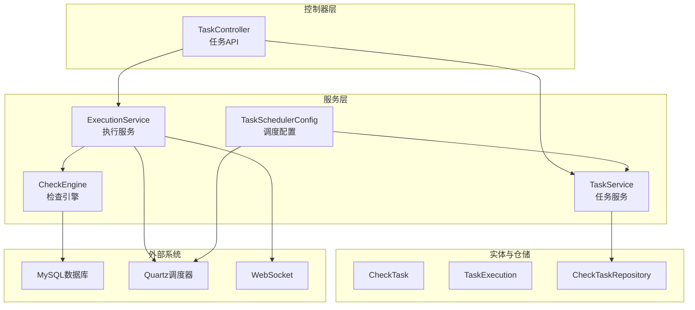
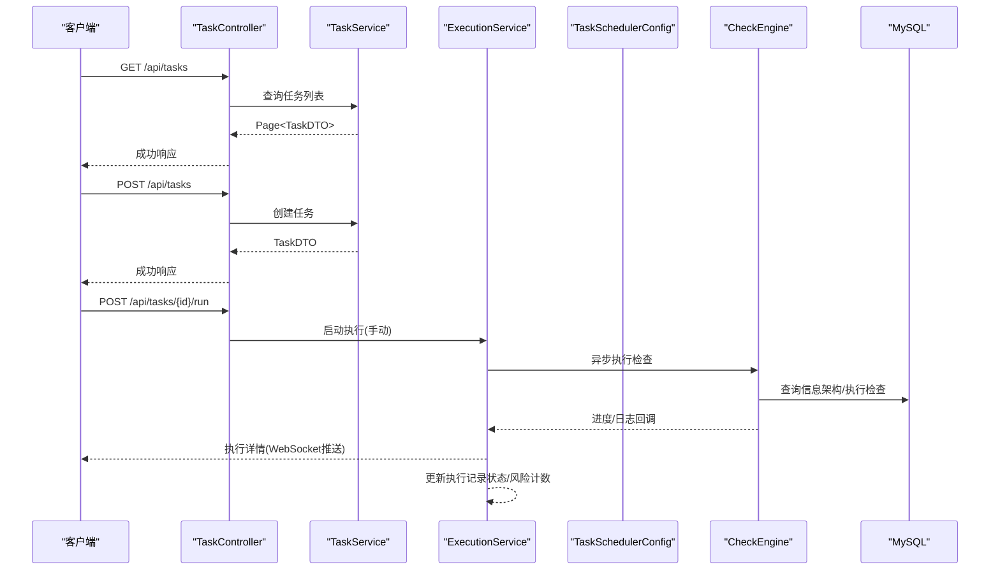
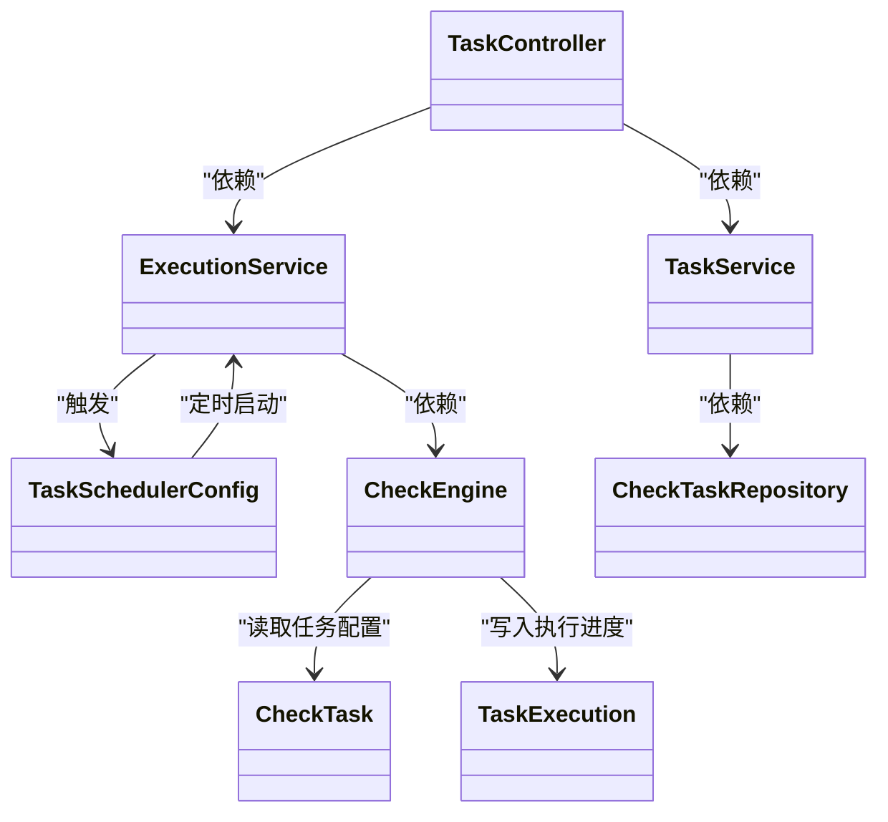
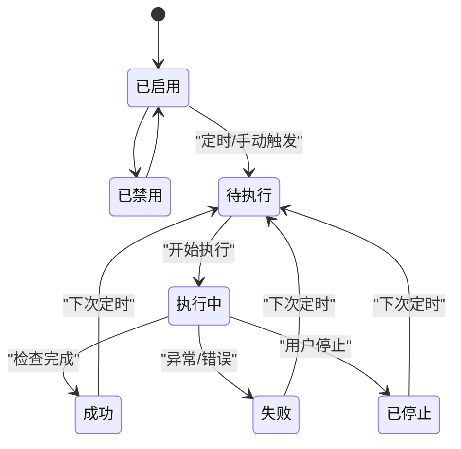
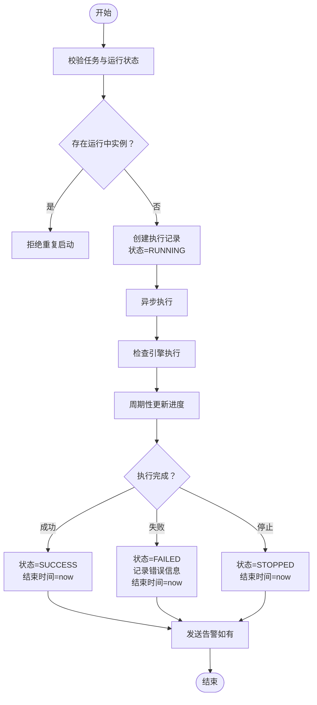

# 任务管理API

<cite>
**本文档引用的文件**
- [backend/src/main/java/com/fieldcheck/controller/TaskController.java](file://backend/src/main/java/com/fieldcheck/controller/TaskController.java)
- [backend/src/main/java/com/fieldcheck/service/TaskService.java](file://backend/src/main/java/com/fieldcheck/service/TaskService.java)
- [backend/src/main/java/com/fieldcheck/service/ExecutionService.java](file://backend/src/main/java/com/fieldcheck/service/ExecutionService.java)
- [backend/src/main/java/com/fieldcheck/scheduler/TaskSchedulerConfig.java](file://backend/src/main/java/com/fieldcheck/scheduler/TaskSchedulerConfig.java)
- [backend/src/main/java/com/fieldcheck/engine/CheckEngine.java](file://backend/src/main/java/com/fieldcheck/engine/CheckEngine.java)
- [backend/src/main/java/com/fieldcheck/entity/CheckTask.java](file://backend/src/main/java/com/fieldcheck/entity/CheckTask.java)
- [backend/src/main/java/com/fieldcheck/entity/TaskExecution.java](file://backend/src/main/java/com/fieldcheck/entity/TaskExecution.java)
- [backend/src/main/java/com/fieldcheck/entity/TaskStatus.java](file://backend/src/main/java/com/fieldcheck/entity/TaskStatus.java)
- [backend/src/main/java/com/fieldcheck/entity/ExecutionStatus.java](file://backend/src/main/java/com/fieldcheck/entity/ExecutionStatus.java)
- [backend/src/main/java/com/fieldcheck/dto/TaskDTO.java](file://backend/src/main/java/com/fieldcheck/dto/TaskDTO.java)
- [backend/src/main/java/com/fieldcheck/dto/ExecutionDTO.java](file://backend/src/main/java/com/fieldcheck/dto/ExecutionDTO.java)
- [backend/src/main/java/com/fieldcheck/repository/CheckTaskRepository.java](file://backend/src/main/java/com/fieldcheck/repository/CheckTaskRepository.java)
- [backend/src/main/resources/application.yml](file://backend/src/main/resources/application.yml)
</cite>

## 目录
1. [简介](#简介)
2. [项目结构](#项目结构)
3. [核心组件](#核心组件)
4. [架构总览](#架构总览)
5. [详细组件分析](#详细组件分析)
6. [依赖关系分析](#依赖关系分析)
7. [性能考量](#性能考量)
8. [故障排查指南](#故障排查指南)
9. [结论](#结论)
10. [附录](#附录)

## 简介
本文件面向任务管理API的使用者与维护者，系统性梳理任务的全生命周期管理能力：创建、查询、更新、删除；任务配置参数（数据库连接、检查规则、执行计划）；任务状态管理与调度机制；任务列表查询、任务详情获取、手动启动/停止、任务历史记录等。同时提供任务创建的请求体与响应结构示例，以及状态转换与错误处理机制说明。

## 项目结构
后端采用Spring Boot分层架构，主要模块如下：
- 控制器层：对外暴露REST接口，负责参数接收、鉴权与返回封装
- 服务层：业务编排，协调仓储与引擎
- 实体与仓储：持久化模型与数据访问
- 调度与引擎：基于Quartz的任务调度与具体的检查逻辑执行
- 配置：数据库、JPA、Quartz、日志、应用参数等

图表来源
- [backend/src/main/java/com/fieldcheck/controller/TaskController.java](file://backend/src/main/java/com/fieldcheck/controller/TaskController.java#L22-L98)
- [backend/src/main/java/com/fieldcheck/service/TaskService.java](file://backend/src/main/java/com/fieldcheck/service/TaskService.java#L21-L176)
- [backend/src/main/java/com/fieldcheck/service/ExecutionService.java](file://backend/src/main/java/com/fieldcheck/service/ExecutionService.java#L34-L306)
- [backend/src/main/java/com/fieldcheck/scheduler/TaskSchedulerConfig.java](file://backend/src/main/java/com/fieldcheck/scheduler/TaskSchedulerConfig.java#L20-L94)
- [backend/src/main/java/com/fieldcheck/engine/CheckEngine.java](file://backend/src/main/java/com/fieldcheck/engine/CheckEngine.java#L26-L453)
- [backend/src/main/java/com/fieldcheck/repository/CheckTaskRepository.java](file://backend/src/main/java/com/fieldcheck/repository/CheckTaskRepository.java#L14-L29)

章节来源
- [backend/src/main/java/com/fieldcheck/controller/TaskController.java](file://backend/src/main/java/com/fieldcheck/controller/TaskController.java#L22-L98)
- [backend/src/main/resources/application.yml](file://backend/src/main/resources/application.yml#L1-L75)

## 核心组件
- 任务控制器：提供任务列表、详情、创建、更新、删除、手动运行、手动停止、执行历史查询等接口
- 任务服务：封装任务CRUD、关联告警配置、条件查询、任务状态控制
- 执行服务：封装执行记录创建、异步执行、进度更新、日志推送、停止执行、读取日志
- 调度配置：基于Quartz的Cron调度，加载启用且配置了Cron表达式的任务
- 检查引擎：具体执行数据库检查逻辑，按配置进行抽样/全量扫描、阈值判断、风险识别
- 实体与DTO：CheckTask、TaskExecution、TaskDTO、ExecutionDTO等

章节来源
- [backend/src/main/java/com/fieldcheck/controller/TaskController.java](file://backend/src/main/java/com/fieldcheck/controller/TaskController.java#L22-L98)
- [backend/src/main/java/com/fieldcheck/service/TaskService.java](file://backend/src/main/java/com/fieldcheck/service/TaskService.java#L21-L176)
- [backend/src/main/java/com/fieldcheck/service/ExecutionService.java](file://backend/src/main/java/com/fieldcheck/service/ExecutionService.java#L34-L306)
- [backend/src/main/java/com/fieldcheck/scheduler/TaskSchedulerConfig.java](file://backend/src/main/java/com/fieldcheck/scheduler/TaskSchedulerConfig.java#L20-L94)
- [backend/src/main/java/com/fieldcheck/engine/CheckEngine.java](file://backend/src/main/java/com/fieldcheck/engine/CheckEngine.java#L26-L453)
- [backend/src/main/java/com/fieldcheck/entity/CheckTask.java](file://backend/src/main/java/com/fieldcheck/entity/CheckTask.java#L13-L74)
- [backend/src/main/java/com/fieldcheck/entity/TaskExecution.java](file://backend/src/main/java/com/fieldcheck/entity/TaskExecution.java#L12-L57)
- [backend/src/main/java/com/fieldcheck/dto/TaskDTO.java](file://backend/src/main/java/com/fieldcheck/dto/TaskDTO.java#L11-L46)
- [backend/src/main/java/com/fieldcheck/dto/ExecutionDTO.java](file://backend/src/main/java/com/fieldcheck/dto/ExecutionDTO.java#L11-L29)

## 架构总览
任务管理API通过控制器统一入口，调用服务层完成业务处理，服务层再与仓储、引擎、调度器交互。执行过程支持手动触发与定时触发两种方式，执行结果通过WebSocket实时推送日志，最终持久化到执行记录。

图表来源
- [backend/src/main/java/com/fieldcheck/controller/TaskController.java](file://backend/src/main/java/com/fieldcheck/controller/TaskController.java#L30-L97)
- [backend/src/main/java/com/fieldcheck/service/TaskService.java](file://backend/src/main/java/com/fieldcheck/service/TaskService.java#L43-L84)
- [backend/src/main/java/com/fieldcheck/service/ExecutionService.java](file://backend/src/main/java/com/fieldcheck/service/ExecutionService.java#L107-L210)
- [backend/src/main/java/com/fieldcheck/engine/CheckEngine.java](file://backend/src/main/java/com/fieldcheck/engine/CheckEngine.java#L57-L139)

## 详细组件分析

### 任务控制器（TaskController）
- 接口职责
  - 列表查询：支持按名称、状态、数据库连接筛选，分页排序
  - 详情获取：按ID获取任务详情
  - 创建任务：校验DTO并创建任务，写入告警配置关联
  - 更新任务：可更新连接、规则、Cron、状态等
  - 删除任务：禁止在有运行中的执行时删除
  - 手动运行：创建执行记录并异步执行
  - 手动停止：标记运行中执行为停止
  - 执行历史：按任务分页查询执行记录
- 安全控制：基于角色的权限控制
- 返回封装：统一ApiResponse包装

章节来源
- [backend/src/main/java/com/fieldcheck/controller/TaskController.java](file://backend/src/main/java/com/fieldcheck/controller/TaskController.java#L30-L97)

### 任务服务（TaskService）
- 查询能力：多条件查询、按Cron表达式非空筛选启用任务
- 创建流程：校验用户与连接存在性，构建任务实体，保存并建立告警配置关联
- 更新流程：可选更新多项配置，重新建立告警配置关联
- 删除保护：若存在运行中执行则拒绝删除
- DTO映射：从实体转为DTO，包含连接名与告警配置ID集合

章节来源
- [backend/src/main/java/com/fieldcheck/service/TaskService.java](file://backend/src/main/java/com/fieldcheck/service/TaskService.java#L30-L140)
- [backend/src/main/java/com/fieldcheck/repository/CheckTaskRepository.java](file://backend/src/main/java/com/fieldcheck/repository/CheckTaskRepository.java#L17-L26)

### 执行服务（ExecutionService）
- 执行启动：校验任务状态，清理异常运行记录，创建执行记录并开启异步执行
- 异步执行：加载任务上下文，调用检查引擎，更新状态与结束时间，发送告警
- 停止执行：标记运行中执行为停止
- 进度更新：批量更新总表数、已处理表数、风险计数
- 日志推送：解析日志级别，通过WebSocket推送，同时写入本地文件
- 日志读取：根据执行记录读取本地日志文件内容

章节来源
- [backend/src/main/java/com/fieldcheck/service/ExecutionService.java](file://backend/src/main/java/com/fieldcheck/service/ExecutionService.java#L107-L282)

### 调度配置（TaskSchedulerConfig）
- 初始化：启动时加载所有启用且配置了Cron表达式的任务并注册到Quartz
- 任务调度：为每个任务创建Job与CronTrigger
- 取消调度：按任务ID移除Quartz作业
- 触发执行：Quartz内部触发时调用执行服务以“定时”方式启动

章节来源
- [backend/src/main/java/com/fieldcheck/scheduler/TaskSchedulerConfig.java](file://backend/src/main/java/com/fieldcheck/scheduler/TaskSchedulerConfig.java#L25-L93)

### 检查引擎（CheckEngine）
- 数据源：根据任务绑定的数据库连接信息构造JDBC URL并解密密码
- 扫描范围：按数据库/表匹配模式筛选目标对象
- 抽样策略：超过大表阈值且未强制全量扫描时使用随机抽样
- 风险检测：
  - 整型溢出：计算使用率并对比阈值
  - Y2038问题：检测TIMESTAMP最大值是否达到预警年份
  - 小数溢出：基于精度与标度计算允许范围并对比
- 结果持久化：将风险结果写入风险结果表
- 进度与中断：周期性保存进度，支持中途停止

章节来源
- [backend/src/main/java/com/fieldcheck/engine/CheckEngine.java](file://backend/src/main/java/com/fieldcheck/engine/CheckEngine.java#L57-L139)
- [backend/src/main/java/com/fieldcheck/engine/CheckEngine.java](file://backend/src/main/java/com/fieldcheck/engine/CheckEngine.java#L258-L384)

### 数据模型与DTO
- CheckTask：任务基本信息、规则参数、Cron表达式、状态、创建人
- TaskExecution：执行记录、进度、风险计数、日志路径、错误信息、触发类型
- TaskDTO：任务请求/响应载体，包含连接ID/名称、规则参数、Cron、状态、告警配置ID集合
- ExecutionDTO：执行详情载体，包含进度百分比计算

章节来源
- [backend/src/main/java/com/fieldcheck/entity/CheckTask.java](file://backend/src/main/java/com/fieldcheck/entity/CheckTask.java#L13-L74)
- [backend/src/main/java/com/fieldcheck/entity/TaskExecution.java](file://backend/src/main/java/com/fieldcheck/entity/TaskExecution.java#L12-L57)
- [backend/src/main/java/com/fieldcheck/dto/TaskDTO.java](file://backend/src/main/java/com/fieldcheck/dto/TaskDTO.java#L11-L46)
- [backend/src/main/java/com/fieldcheck/dto/ExecutionDTO.java](file://backend/src/main/java/com/fieldcheck/dto/ExecutionDTO.java#L11-L29)

## 依赖关系分析
- 控制器依赖服务层
- 服务层依赖仓储、引擎、告警服务、任务服务自身（自调用）
- 执行服务依赖Quartz、WebSocket、检查引擎、任务服务
- 调度配置依赖Quartz与任务仓储
- 检查引擎依赖连接服务、白名单服务、风险结果仓储、事务模板

图表来源
- [backend/src/main/java/com/fieldcheck/controller/TaskController.java](file://backend/src/main/java/com/fieldcheck/controller/TaskController.java#L27-L28)
- [backend/src/main/java/com/fieldcheck/service/TaskService.java](file://backend/src/main/java/com/fieldcheck/service/TaskService.java#L23-L28)
- [backend/src/main/java/com/fieldcheck/service/ExecutionService.java](file://backend/src/main/java/com/fieldcheck/service/ExecutionService.java#L37-L47)
- [backend/src/main/java/com/fieldcheck/scheduler/TaskSchedulerConfig.java](file://backend/src/main/java/com/fieldcheck/scheduler/TaskSchedulerConfig.java#L22-L23)
- [backend/src/main/java/com/fieldcheck/engine/CheckEngine.java](file://backend/src/main/java/com/fieldcheck/engine/CheckEngine.java#L28-L32)

## 性能考量
- 抽样与阈值：对大表默认采用抽样检查，可通过参数调整样本量与阈值，平衡准确性与性能
- 批量进度保存：每处理若干张表才保存一次执行进度，降低数据库写入压力
- 并发与异步：执行服务使用异步线程池执行，避免阻塞主线程
- 连接池：数据库连接池参数已在配置中设置，建议结合实际负载调优
- 日志落盘：执行日志同时推送WebSocket与写入文件，注意磁盘空间与IO开销

章节来源
- [backend/src/main/java/com/fieldcheck/engine/CheckEngine.java](file://backend/src/main/java/com/fieldcheck/engine/CheckEngine.java#L274-L277)
- [backend/src/main/java/com/fieldcheck/service/ExecutionService.java](file://backend/src/main/java/com/fieldcheck/service/ExecutionService.java#L227-L235)
- [backend/src/main/resources/application.yml](file://backend/src/main/resources/application.yml#L13-L22)

## 故障排查指南
- 任务不存在/连接不存在：创建/更新任务时会校验资源存在性，若抛出异常请确认ID有效性
- 正在执行中无法删除：删除任务前会检查是否存在运行中执行，需先停止或等待执行完成
- 手动运行冲突：若同一任务已有运行中实例，将拒绝重复启动
- 异常中断恢复：启动时会清理数据库中残留的运行中记录并标记为失败，内存缓存也会同步清理
- 日志查看：通过执行历史接口获取日志路径，或直接读取本地日志文件
- 告警发送：执行完成后若存在风险或失败，会尝试按任务关联的告警配置发送告警

章节来源
- [backend/src/main/java/com/fieldcheck/service/TaskService.java](file://backend/src/main/java/com/fieldcheck/service/TaskService.java#L43-L50)
- [backend/src/main/java/com/fieldcheck/service/TaskService.java](file://backend/src/main/java/com/fieldcheck/service/TaskService.java#L131-L140)
- [backend/src/main/java/com/fieldcheck/service/ExecutionService.java](file://backend/src/main/java/com/fieldcheck/service/ExecutionService.java#L107-L131)
- [backend/src/main/java/com/fieldcheck/service/ExecutionService.java](file://backend/src/main/java/com/fieldcheck/service/ExecutionService.java#L113-L126)
- [backend/src/main/java/com/fieldcheck/service/ExecutionService.java](file://backend/src/main/java/com/fieldcheck/service/ExecutionService.java#L270-L282)
- [backend/src/main/java/com/fieldcheck/service/ExecutionService.java](file://backend/src/main/java/com/fieldcheck/service/ExecutionService.java#L192-L206)

## 结论
该任务管理API提供了完整的任务生命周期管理能力，支持手动与定时两种执行方式，具备完善的进度与日志推送、风险告警机制。通过清晰的分层设计与实体/DTO分离，既保证了易用性也便于扩展与维护。

## 附录

### API定义与示例

- 获取任务列表
  - 方法与路径：GET /api/tasks
  - 查询参数：
    - name：任务名称（模糊）
    - status：任务状态（ENABLED/DISABLED）
    - connectionId：数据库连接ID
    - page：页码（默认0）
    - size：每页大小（默认10）
  - 响应：分页的TaskDTO列表

- 获取任务详情
  - 方法与路径：GET /api/tasks/{id}
  - 路径参数：id（任务ID）
  - 响应：单个TaskDTO

- 创建任务
  - 方法与路径：POST /api/tasks
  - 请求头：需要认证
  - 请求体（TaskDTO）关键字段：
    - name：任务名称（必填）
    - connectionId：数据库连接ID（必填）
    - dbPattern：数据库匹配模式（可选）
    - tablePattern：表匹配模式（可选）
    - fullScan：是否强制全表扫描（可选）
    - sampleSize：抽样条数（可选）
    - maxTableRows：大表阈值（可选）
    - thresholdPct：风险阈值百分比（可选）
    - y2038WarningYear：Y2038告警年份（可选）
    - whitelistType：白名单类型（可选）
    - customWhitelist：自定义白名单（可选）
    - cronExpression：Cron表达式（可选）
    - status：任务状态（可选，默认启用）
    - alertConfigIds：告警配置ID集合（可选）
  - 响应：创建成功的TaskDTO

- 更新任务
  - 方法与路径：PUT /api/tasks/{id}
  - 路径参数：id（任务ID）
  - 请求体：同创建任务（可选字段更新）
  - 响应：更新后的TaskDTO

- 删除任务
  - 方法与路径：DELETE /api/tasks/{id}
  - 路径参数：id（任务ID）
  - 响应：删除成功

- 手动运行任务
  - 方法与路径：POST /api/tasks/{id}/run
  - 路径参数：id（任务ID）
  - 响应：执行详情（ExecutionDTO）

- 手动停止任务
  - 方法与路径：POST /api/tasks/{id}/stop
  - 路径参数：id（任务ID）
  - 响应：停止成功

- 获取任务执行历史
  - 方法与路径：GET /api/tasks/{id}/executions
  - 路径参数：id（任务ID）
  - 查询参数：page、size
  - 响应：分页的ExecutionDTO列表

章节来源
- [backend/src/main/java/com/fieldcheck/controller/TaskController.java](file://backend/src/main/java/com/fieldcheck/controller/TaskController.java#L30-L97)
- [backend/src/main/java/com/fieldcheck/dto/TaskDTO.java](file://backend/src/main/java/com/fieldcheck/dto/TaskDTO.java#L11-L46)
- [backend/src/main/java/com/fieldcheck/dto/ExecutionDTO.java](file://backend/src/main/java/com/fieldcheck/dto/ExecutionDTO.java#L11-L29)

### 任务状态与转换

图表来源
- [backend/src/main/java/com/fieldcheck/entity/TaskStatus.java](file://backend/src/main/java/com/fieldcheck/entity/TaskStatus.java#L3-L6)
- [backend/src/main/java/com/fieldcheck/entity/ExecutionStatus.java](file://backend/src/main/java/com/fieldcheck/entity/ExecutionStatus.java#L3-L8)

### 任务配置参数说明
- 数据库连接：connectionId（必填），用于选择目标数据库
- 匹配模式：dbPattern、tablePattern（支持通配符与逗号分隔的多个模式）
- 检查策略：
  - fullScan：是否强制全表扫描
  - sampleSize：抽样数量
  - maxTableRows：大表阈值
  - thresholdPct：风险阈值百分比
  - y2038WarningYear：Y2038告警年份
  - whitelistType/customWhitelist：白名单策略
- 执行计划：cronExpression（Cron表达式），配合调度器实现定时执行
- 状态：status（ENABLED/DISABLED）

章节来源
- [backend/src/main/java/com/fieldcheck/entity/CheckTask.java](file://backend/src/main/java/com/fieldcheck/entity/CheckTask.java#L22-L69)
- [backend/src/main/java/com/fieldcheck/dto/TaskDTO.java](file://backend/src/main/java/com/fieldcheck/dto/TaskDTO.java#L15-L46)
- [backend/src/main/java/com/fieldcheck/scheduler/TaskSchedulerConfig.java](file://backend/src/main/java/com/fieldcheck/scheduler/TaskSchedulerConfig.java#L38-L65)

### 任务调度机制
- 启动初始化：加载所有启用且配置了Cron表达式的任务，注册到Quartz
- 作业创建：为每个任务创建Job并绑定CronTrigger
- 触发执行：Quartz按Cron表达式触发，执行服务以“定时”方式启动
- 取消调度：按任务ID移除对应作业

章节来源
- [backend/src/main/java/com/fieldcheck/scheduler/TaskSchedulerConfig.java](file://backend/src/main/java/com/fieldcheck/scheduler/TaskSchedulerConfig.java#L25-L73)

### 任务执行流程（手动/定时）

图表来源
- [backend/src/main/java/com/fieldcheck/service/ExecutionService.java](file://backend/src/main/java/com/fieldcheck/service/ExecutionService.java#L107-L210)
- [backend/src/main/java/com/fieldcheck/engine/CheckEngine.java](file://backend/src/main/java/com/fieldcheck/engine/CheckEngine.java#L57-L139)