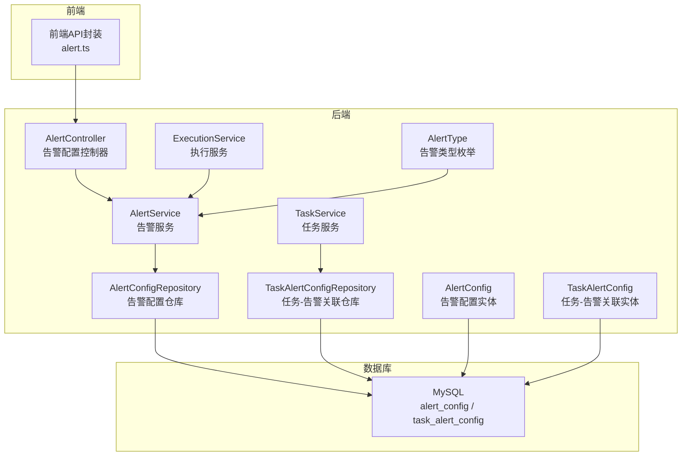
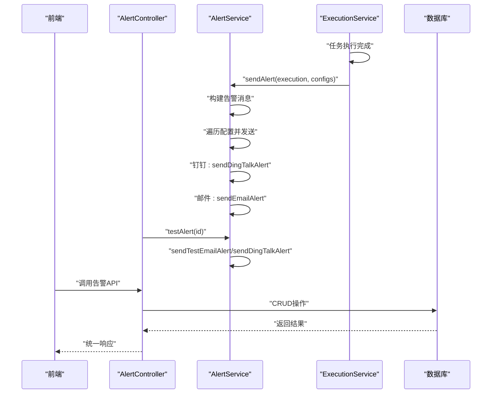
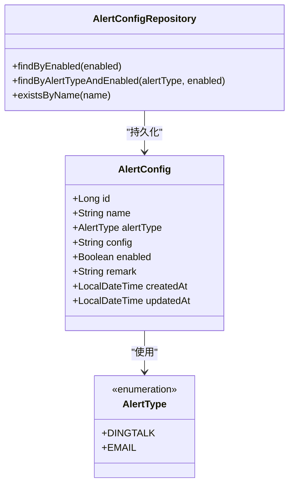
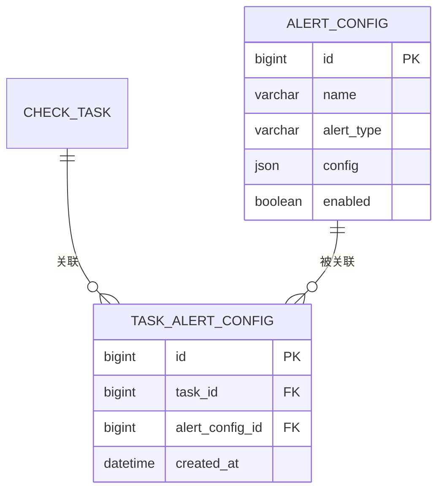
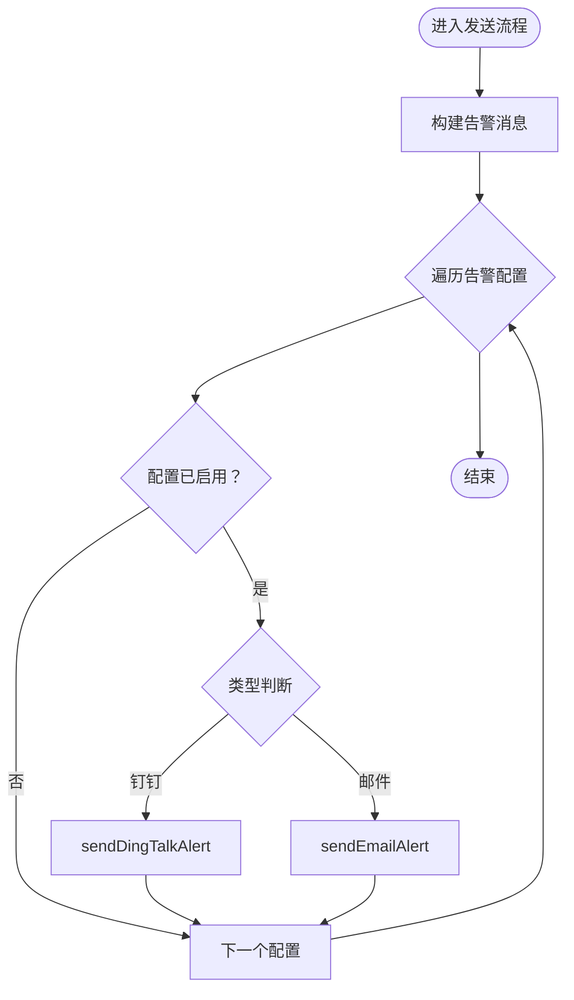
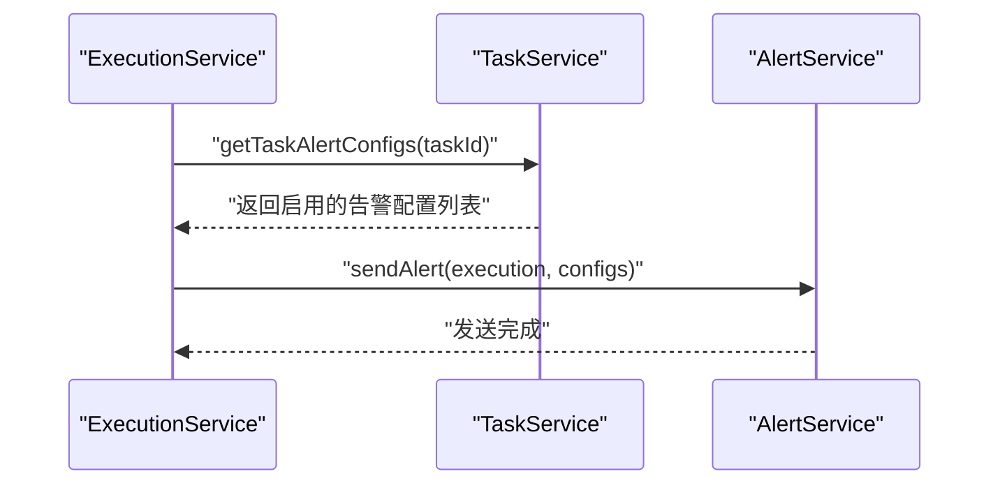
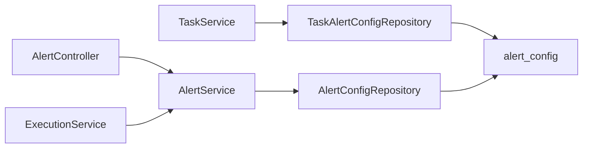

# 告警通知API

<cite>
**本文档引用的文件**
- [AlertController.java](file://backend/src/main/java/com/fieldcheck/controller/AlertController.java)
- [AlertService.java](file://backend/src/main/java/com/fieldcheck/service/AlertService.java)
- [AlertConfig.java](file://backend/src/main/java/com/fieldcheck/entity/AlertConfig.java)
- [AlertType.java](file://backend/src/main/java/com/fieldcheck/entity/AlertType.java)
- [AlertConfigRepository.java](file://backend/src/main/java/com/fieldcheck/repository/AlertConfigRepository.java)
- [TaskAlertConfig.java](file://backend/src/main/java/com/fieldcheck/entity/TaskAlertConfig.java)
- [TaskAlertConfigRepository.java](file://backend/src/main/java/com/fieldcheck/repository/TaskAlertConfigRepository.java)
- [ExecutionService.java](file://backend/src/main/java/com/fieldcheck/service/ExecutionService.java)
- [TaskService.java](file://backend/src/main/java/com/fieldcheck/service/TaskService.java)
- [alert.ts](file://frontend/src/api/alert.ts)
- [01_init_schema.sql](file://mysql/init/01_init_schema.sql)
- [application.yml](file://backend/src/main/resources/application.yml)
- [ApiResponse.java](file://backend/src/main/java/com/fieldcheck/dto/ApiResponse.java)
</cite>

## 目录
1. [简介](#简介)
2. [项目结构](#项目结构)
3. [核心组件](#核心组件)
4. [架构总览](#架构总览)
5. [详细组件分析](#详细组件分析)
6. [依赖关系分析](#依赖关系分析)
7. [性能考虑](#性能考虑)
8. [故障排除指南](#故障排除指南)
9. [结论](#结论)
10. [附录](#附录)

## 简介
本文件为“告警通知API”的权威技术文档，覆盖告警配置、通知管理、告警历史与统计分析等能力。系统支持多种告警渠道（如钉钉机器人、邮件），并提供告警规则的创建/更新/删除、告警配置查询、告警历史查询、通知发送测试等功能。同时，系统具备任务级告警配置关联能力，并在任务执行完成后自动触发告警通知。

## 项目结构
后端采用Spring Boot分层架构，主要模块包括：
- 控制器层：对外暴露REST API
- 服务层：业务逻辑与通知发送
- 实体与仓库层：数据模型与持久化
- 配置与资源：应用配置、数据库初始化脚本

**图表来源**
- [AlertController.java](file://backend/src/main/java/com/fieldcheck/controller/AlertController.java#L1-L67)
- [AlertService.java](file://backend/src/main/java/com/fieldcheck/service/AlertService.java#L1-L274)
- [AlertConfigRepository.java](file://backend/src/main/java/com/fieldcheck/repository/AlertConfigRepository.java#L1-L19)
- [TaskAlertConfigRepository.java](file://backend/src/main/java/com/fieldcheck/repository/TaskAlertConfigRepository.java#L1-L18)
- [AlertConfig.java](file://backend/src/main/java/com/fieldcheck/entity/AlertConfig.java#L1-L37)
- [TaskAlertConfig.java](file://backend/src/main/java/com/fieldcheck/entity/TaskAlertConfig.java#L1-L29)
- [AlertType.java](file://backend/src/main/java/com/fieldcheck/entity/AlertType.java#L1-L7)
- [01_init_schema.sql](file://mysql/init/01_init_schema.sql#L10-L21)
- [01_init_schema.sql](file://mysql/init/01_init_schema.sql#L169-L180)

**章节来源**
- [AlertController.java](file://backend/src/main/java/com/fieldcheck/controller/AlertController.java#L1-L67)
- [AlertService.java](file://backend/src/main/java/com/fieldcheck/service/AlertService.java#L1-L274)
- [AlertConfigRepository.java](file://backend/src/main/java/com/fieldcheck/repository/AlertConfigRepository.java#L1-L19)
- [TaskAlertConfigRepository.java](file://backend/src/main/java/com/fieldcheck/repository/TaskAlertConfigRepository.java#L1-L18)
- [AlertConfig.java](file://backend/src/main/java/com/fieldcheck/entity/AlertConfig.java#L1-L37)
- [TaskAlertConfig.java](file://backend/src/main/java/com/fieldcheck/entity/TaskAlertConfig.java#L1-L29)
- [AlertType.java](file://backend/src/main/java/com/fieldcheck/entity/AlertType.java#L1-L7)
- [01_init_schema.sql](file://mysql/init/01_init_schema.sql#L10-L21)
- [01_init_schema.sql](file://mysql/init/01_init_schema.sql#L169-L180)

## 核心组件
- 告警配置实体：存储告警名称、类型、配置JSON、启用状态与备注
- 告警类型枚举：当前支持“钉钉机器人”和“邮件”
- 告警配置仓库：提供按名称、类型、启用状态等条件查询
- 任务-告警关联实体：建立任务与告警配置的多对多关系（通过中间表）
- 告警服务：负责构建告警消息、发送钉钉与邮件通知、测试发送
- 执行服务：在任务执行完成后根据关联的告警配置发送通知
- 控制器：提供告警配置的增删改查与测试接口

**章节来源**
- [AlertConfig.java](file://backend/src/main/java/com/fieldcheck/entity/AlertConfig.java#L18-L36)
- [AlertType.java](file://backend/src/main/java/com/fieldcheck/entity/AlertType.java#L3-L6)
- [AlertConfigRepository.java](file://backend/src/main/java/com/fieldcheck/repository/AlertConfigRepository.java#L11-L18)
- [TaskAlertConfig.java](file://backend/src/main/java/com/fieldcheck/entity/TaskAlertConfig.java#L19-L28)
- [AlertService.java](file://backend/src/main/java/com/fieldcheck/service/AlertService.java#L38-L140)
- [ExecutionService.java](file://backend/src/main/java/com/fieldcheck/service/ExecutionService.java#L192-L206)
- [AlertController.java](file://backend/src/main/java/com/fieldcheck/controller/AlertController.java#L19-L65)

## 架构总览
告警通知流程从任务执行结束触发，系统根据任务关联的告警配置逐个发送通知。支持钉钉机器人与邮件两种渠道，配置信息以JSON形式存储，便于扩展新的通知渠道。

**图表来源**
- [ExecutionService.java](file://backend/src/main/java/com/fieldcheck/service/ExecutionService.java#L192-L206)
- [AlertService.java](file://backend/src/main/java/com/fieldcheck/service/AlertService.java#L124-L245)
- [AlertController.java](file://backend/src/main/java/com/fieldcheck/controller/AlertController.java#L60-L65)

## 详细组件分析

### 告警配置实体与仓库
- 实体字段：名称、类型、配置JSON、启用状态、备注；继承审计基类
- 仓库接口：提供按启用状态、类型+启用状态查询，以及名称唯一性校验

**图表来源**
- [AlertConfig.java](file://backend/src/main/java/com/fieldcheck/entity/AlertConfig.java#L18-L36)
- [AlertType.java](file://backend/src/main/java/com/fieldcheck/entity/AlertType.java#L3-L6)
- [AlertConfigRepository.java](file://backend/src/main/java/com/fieldcheck/repository/AlertConfigRepository.java#L11-L18)

**章节来源**
- [AlertConfig.java](file://backend/src/main/java/com/fieldcheck/entity/AlertConfig.java#L18-L36)
- [AlertConfigRepository.java](file://backend/src/main/java/com/fieldcheck/repository/AlertConfigRepository.java#L11-L18)

### 任务-告警关联
- 中间表：task_alert_config，维护任务与告警配置的多对多关系
- 查询：按任务ID获取关联的告警配置列表，并过滤启用状态

**图表来源**
- [TaskAlertConfig.java](file://backend/src/main/java/com/fieldcheck/entity/TaskAlertConfig.java#L19-L28)
- [TaskAlertConfigRepository.java](file://backend/src/main/java/com/fieldcheck/repository/TaskAlertConfigRepository.java#L10-L17)
- [01_init_schema.sql](file://mysql/init/01_init_schema.sql#L169-L180)

**章节来源**
- [TaskAlertConfig.java](file://backend/src/main/java/com/fieldcheck/entity/TaskAlertConfig.java#L19-L28)
- [TaskAlertConfigRepository.java](file://backend/src/main/java/com/fieldcheck/repository/TaskAlertConfigRepository.java#L10-L17)
- [01_init_schema.sql](file://mysql/init/01_init_schema.sql#L169-L180)

### 告警服务与通知发送
- 构建告警消息：基于任务执行结果生成Markdown格式消息
- 发送策略：
  - 钉钉：解析配置中的webhook与可选secret，计算签名，发送Markdown消息
  - 邮件：动态创建SMTP客户端，支持多种前端命名兼容字段，发送纯文本邮件
- 测试发送：针对指定配置发送测试消息

**图表来源**
- [AlertService.java](file://backend/src/main/java/com/fieldcheck/service/AlertService.java#L124-L140)
- [AlertService.java](file://backend/src/main/java/com/fieldcheck/service/AlertService.java#L159-L199)
- [AlertService.java](file://backend/src/main/java/com/fieldcheck/service/AlertService.java#L201-L245)

**章节来源**
- [AlertService.java](file://backend/src/main/java/com/fieldcheck/service/AlertService.java#L124-L245)

### 执行服务与告警触发
- 在任务执行完成后，若存在风险或执行失败，则根据任务关联的告警配置发送通知
- 通过TaskService获取任务关联的启用告警配置

**图表来源**
- [ExecutionService.java](file://backend/src/main/java/com/fieldcheck/service/ExecutionService.java#L192-L206)
- [TaskService.java](file://backend/src/main/java/com/fieldcheck/service/TaskService.java#L169-L175)

**章节来源**
- [ExecutionService.java](file://backend/src/main/java/com/fieldcheck/service/ExecutionService.java#L192-L206)
- [TaskService.java](file://backend/src/main/java/com/fieldcheck/service/TaskService.java#L169-L175)

### 前端API封装
- 提供告警配置列表、详情、创建、更新、删除、测试等HTTP请求封装

**章节来源**
- [alert.ts](file://frontend/src/api/alert.ts#L3-L27)

## 依赖关系分析
- 控制器依赖服务层进行业务处理
- 服务层依赖仓库层进行数据访问
- 执行服务在任务完成后调用告警服务
- 任务服务提供任务-告警配置关联查询

**图表来源**
- [AlertController.java](file://backend/src/main/java/com/fieldcheck/controller/AlertController.java#L17-L18)
- [AlertService.java](file://backend/src/main/java/com/fieldcheck/service/AlertService.java#L35-L36)
- [AlertConfigRepository.java](file://backend/src/main/java/com/fieldcheck/repository/AlertConfigRepository.java#L11-L18)
- [ExecutionService.java](file://backend/src/main/java/com/fieldcheck/service/ExecutionService.java#L59-L66)
- [TaskService.java](file://backend/src/main/java/com/fieldcheck/service/TaskService.java#L160-L175)
- [TaskAlertConfigRepository.java](file://backend/src/main/java/com/fieldcheck/repository/TaskAlertConfigRepository.java#L10-L17)

**章节来源**
- [AlertController.java](file://backend/src/main/java/com/fieldcheck/controller/AlertController.java#L17-L18)
- [AlertService.java](file://backend/src/main/java/com/fieldcheck/service/AlertService.java#L35-L36)
- [AlertConfigRepository.java](file://backend/src/main/java/com/fieldcheck/repository/AlertConfigRepository.java#L11-L18)
- [ExecutionService.java](file://backend/src/main/java/com/fieldcheck/service/ExecutionService.java#L59-L66)
- [TaskService.java](file://backend/src/main/java/com/fieldcheck/service/TaskService.java#L160-L175)
- [TaskAlertConfigRepository.java](file://backend/src/main/java/com/fieldcheck/repository/TaskAlertConfigRepository.java#L10-L17)

## 性能考虑
- 异步执行：任务执行采用异步方式，避免阻塞主线程
- 连接池与超时：数据库连接池参数与超时配置已在应用配置中设定
- 日志与监控：统一响应包装，便于日志追踪与错误上报

**章节来源**
- [ExecutionService.java](file://backend/src/main/java/com/fieldcheck/service/ExecutionService.java#L165-L169)
- [application.yml](file://backend/src/main/resources/application.yml#L13-L22)

## 故障排除指南
- 告警配置不存在：查询单个配置时若不存在会抛出异常
- 配置名称重复：创建配置时校验名称唯一性
- 配置未启用：测试或发送通知前需确保配置处于启用状态
- 钉钉签名错误：当配置包含secret时需正确计算签名并拼接到URL
- 邮件发送失败：检查SMTP配置、用户名与密码、网络连通性

**章节来源**
- [AlertService.java](file://backend/src/main/java/com/fieldcheck/service/AlertService.java#L70-L73)
- [AlertService.java](file://backend/src/main/java/com/fieldcheck/service/AlertService.java#L77-L80)
- [AlertService.java](file://backend/src/main/java/com/fieldcheck/service/AlertService.java#L101-L103)
- [AlertService.java](file://backend/src/main/java/com/fieldcheck/service/AlertService.java#L164-L173)
- [AlertService.java](file://backend/src/main/java/com/fieldcheck/service/AlertService.java#L247-L272)

## 结论
本告警通知API提供了完整的告警配置管理与通知发送能力，支持钉钉与邮件两大渠道，并通过任务-告警关联实现灵活的通知策略。系统具备良好的扩展性，便于后续接入更多通知渠道与增强告警规则。

## 附录

### 接口定义与使用说明

- 获取所有告警配置
  - 方法：GET
  - 路径：/api/alerts
  - 查询参数：name（名称模糊匹配）、type（类型）、enabled（启用状态）
  - 返回：统一响应对象，data为配置列表
  - 权限：任意认证用户
  - 响应封装：参考统一响应类

- 获取启用的告警配置
  - 方法：GET
  - 路径：/api/alerts/enabled
  - 返回：启用的配置列表
  - 权限：任意认证用户

- 获取单个告警配置
  - 方法：GET
  - 路径：/api/alerts/{id}
  - 返回：配置详情
  - 权限：任意认证用户

- 创建告警配置
  - 方法：POST
  - 路径：/api/alerts
  - 请求体：配置对象（含名称、类型、配置JSON、启用状态、备注）
  - 返回：创建成功的配置
  - 权限：ADMIN或USER

- 更新告警配置
  - 方法：PUT
  - 路径：/api/alerts/{id}
  - 请求体：配置对象
  - 返回：更新后的配置
  - 权限：ADMIN或USER

- 删除告警配置
  - 方法：DELETE
  - 路径：/api/alerts/{id}
  - 返回：空
  - 权限：ADMIN

- 测试告警发送
  - 方法：POST
  - 路径：/api/alerts/{id}/test
  - 返回：测试消息发送提示
  - 权限：ADMIN或USER

- 统一响应结构
  - 字段：code（状态码）、message（消息）、data（数据）
  - 成功：code=200，message="success"
  - 错误：使用error静态方法构造

**章节来源**
- [AlertController.java](file://backend/src/main/java/com/fieldcheck/controller/AlertController.java#L19-L65)
- [ApiResponse.java](file://backend/src/main/java/com/fieldcheck/dto/ApiResponse.java#L12-L42)

### 告警类型与配置示例

- 钉钉机器人
  - 配置字段：webhook（必填）、secret（可选）
  - 发送内容：Markdown消息，标题与正文
  - 签名：当secret存在时，按规范计算签名并附加到URL

- 邮件
  - 配置字段：smtpHost、smtpPort、smtpUsername、smtpPassword、senderEmail、senderPassword、emailRecipients或recipients
  - 发送内容：主题包含任务名称，正文为清理后的纯文本消息

- 任务-告警关联
  - 通过中间表将任务与多个告警配置关联，仅启用的配置会被触发

**章节来源**
- [AlertType.java](file://backend/src/main/java/com/fieldcheck/entity/AlertType.java#L3-L6)
- [AlertService.java](file://backend/src/main/java/com/fieldcheck/service/AlertService.java#L159-L199)
- [AlertService.java](file://backend/src/main/java/com/fieldcheck/service/AlertService.java#L201-L245)
- [TaskAlertConfigRepository.java](file://backend/src/main/java/com/fieldcheck/repository/TaskAlertConfigRepository.java#L10-L17)

### 告警去重与频率控制
- 当前代码未实现显式的去重与频率控制机制
- 建议在实际部署中结合业务需求引入：
  - 去重：基于任务ID与告警类型的时间窗口去重
  - 频率控制：同类型告警在固定周期内只允许发送一次
  - 可通过在AlertService中增加缓存与定时任务实现

**章节来源**
- [AlertService.java](file://backend/src/main/java/com/fieldcheck/service/AlertService.java#L124-L140)

### 告警统计与趋势分析
- 后端提供风险统计DTO，包含总数、各类别数量与近30天趋势
- 前端仪表盘展示趋势图与类型分布饼图
- 统计数据来源于风险结果表的聚合查询

**章节来源**
- [RiskStatsDTO.java](file://backend/src/main/java/com/fieldcheck/dto/RiskStatsDTO.java#L15-L31)
- [RiskResultService.java](file://backend/src/main/java/com/fieldcheck/service/RiskResultService.java#L58-L90)
- [Dashboard.vue](file://frontend/src/views/Dashboard.vue#L99-L158)