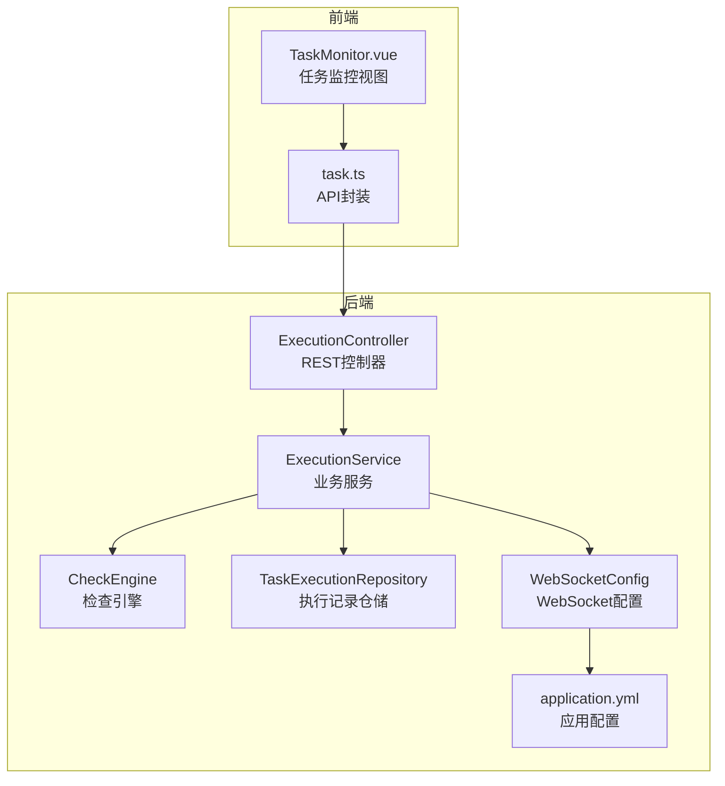
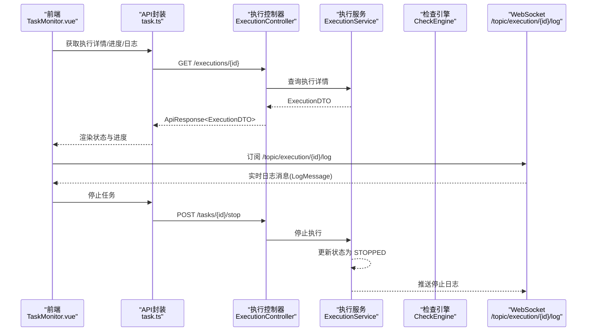
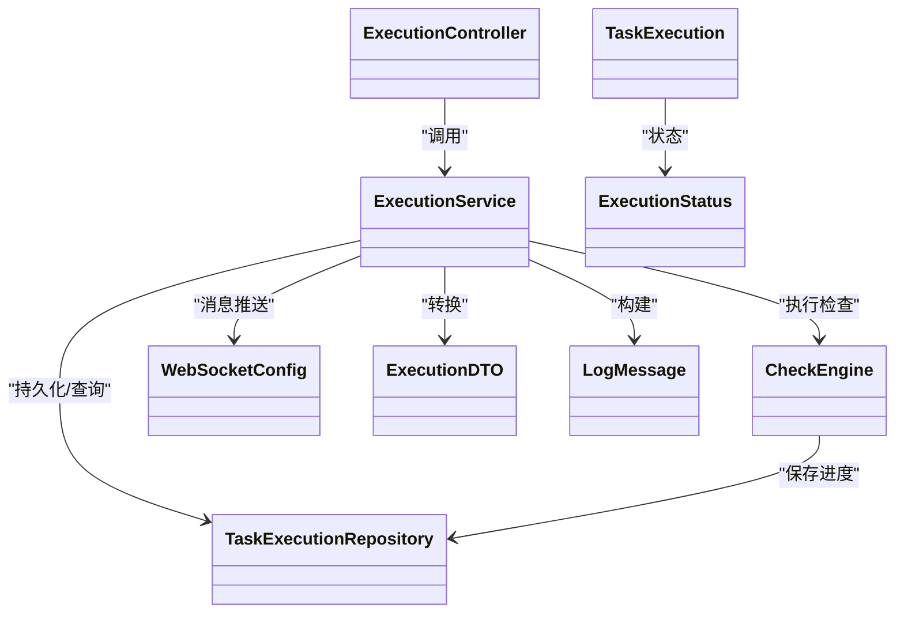

# 执行监控API

<cite>
**本文引用的文件**
- [ExecutionController.java](file://backend/src/main/java/com/fieldcheck/controller/ExecutionController.java)
- [ExecutionService.java](file://backend/src/main/java/com/fieldcheck/service/ExecutionService.java)
- [TaskExecution.java](file://backend/src/main/java/com/fieldcheck/entity/TaskExecution.java)
- [ExecutionStatus.java](file://backend/src/main/java/com/fieldcheck/entity/ExecutionStatus.java)
- [ExecutionDTO.java](file://backend/src/main/java/com/fieldcheck/dto/ExecutionDTO.java)
- [LogMessage.java](file://backend/src/main/java/com/fieldcheck/dto/LogMessage.java)
- [WebSocketConfig.java](file://backend/src/main/java/com/fieldcheck/config/WebSocketConfig.java)
- [CheckEngine.java](file://backend/src/main/java/com/fieldcheck/engine/CheckEngine.java)
- [TaskExecutionRepository.java](file://backend/src/main/java/com/fieldcheck/repository/TaskExecutionRepository.java)
- [application.yml](file://backend/src/main/resources/application.yml)
- [TaskMonitor.vue](file://frontend/src/views/task/TaskMonitor.vue)
- [task.ts](file://frontend/src/api/task.ts)
- [ApiResponse.java](file://backend/src/main/java/com/fieldcheck/dto/ApiResponse.java)
</cite>

## 目录
1. [简介](#简介)
2. [项目结构](#项目结构)
3. [核心组件](#核心组件)
4. [架构总览](#架构总览)
5. [详细组件分析](#详细组件分析)
6. [依赖关系分析](#依赖关系分析)
7. [性能考量](#性能考量)
8. [故障排查指南](#故障排查指南)
9. [结论](#结论)
10. [附录：API清单与数据模型](#附录api清单与数据模型)

## 简介
本文件面向执行监控API，覆盖任务执行过程的监控能力，包括：
- 执行状态查询与进度跟踪
- 实时日志推送（WebSocket）
- 历史日志获取与下载
- 执行历史查询、执行详情获取、执行停止控制
- 异常处理与错误状态管理
- WebSocket 使用说明与消息格式

该系统采用 Spring Boot 后端 + Vue 前端，后端通过 STOMP over SockJS 提供 WebSocket 实时通道，结合分页查询与异步执行，实现高效的任务执行监控。

## 项目结构
后端模块关键路径：
- 控制器层：/backend/src/main/java/com/fieldcheck/controller
- 服务层：/backend/src/main/java/com/fieldcheck/service
- 实体与DTO：/backend/src/main/java/com/fieldcheck/entity 与 /backend/src/main/java/com/fieldcheck/dto
- 配置：/backend/src/main/java/com/fieldcheck/config
- 引擎与仓库：/backend/src/main/java/com/fieldcheck/engine 与 /backend/src/main/java/com/fieldcheck/repository
- 资源配置：/backend/src/main/resources

前端模块关键路径：
- 视图与监控页面：/frontend/src/views/task/TaskMonitor.vue
- API封装：/frontend/src/api/task.ts

图表来源
- [ExecutionController.java](file://backend/src/main/java/com/fieldcheck/controller/ExecutionController.java#L20-L79)
- [ExecutionService.java](file://backend/src/main/java/com/fieldcheck/service/ExecutionService.java#L34-L307)
- [CheckEngine.java](file://backend/src/main/java/com/fieldcheck/engine/CheckEngine.java#L24-L454)
- [TaskExecutionRepository.java](file://backend/src/main/java/com/fieldcheck/repository/TaskExecutionRepository.java#L16-L41)
- [WebSocketConfig.java](file://backend/src/main/java/com/fieldcheck/config/WebSocketConfig.java#L9-L26)
- [application.yml](file://backend/src/main/resources/application.yml#L64-L68)
- [TaskMonitor.vue](file://frontend/src/views/task/TaskMonitor.vue#L54-L266)
- [task.ts](file://frontend/src/api/task.ts#L1-L88)

章节来源
- [ExecutionController.java](file://backend/src/main/java/com/fieldcheck/controller/ExecutionController.java#L20-L79)
- [ExecutionService.java](file://backend/src/main/java/com/fieldcheck/service/ExecutionService.java#L34-L307)
- [WebSocketConfig.java](file://backend/src/main/java/com/fieldcheck/config/WebSocketConfig.java#L9-L26)
- [application.yml](file://backend/src/main/resources/application.yml#L64-L68)
- [TaskMonitor.vue](file://frontend/src/views/task/TaskMonitor.vue#L54-L266)
- [task.ts](file://frontend/src/api/task.ts#L1-L88)

## 核心组件
- 执行控制器：提供执行历史分页、执行详情、进度查询、日志查询与下载等接口。
- 执行服务：负责执行记录创建、异步执行、进度更新、日志推送、停止控制、告警触发与状态收尾。
- 检查引擎：执行数据库扫描、风险检测、进度持久化与日志回调。
- WebSocket 配置：启用 STOMP 简单消息代理与 SockJS 支持。
- 数据模型：执行记录实体、状态枚举、DTO、日志消息模型。
- 前端监控视图：实时订阅日志、展示状态与进度、支持停止任务与历史日志加载。

章节来源
- [ExecutionController.java](file://backend/src/main/java/com/fieldcheck/controller/ExecutionController.java#L20-L79)
- [ExecutionService.java](file://backend/src/main/java/com/fieldcheck/service/ExecutionService.java#L34-L307)
- [CheckEngine.java](file://backend/src/main/java/com/fieldcheck/engine/CheckEngine.java#L24-L454)
- [WebSocketConfig.java](file://backend/src/main/java/com/fieldcheck/config/WebSocketConfig.java#L9-L26)
- [TaskExecution.java](file://backend/src/main/java/com/fieldcheck/entity/TaskExecution.java#L12-L58)
- [ExecutionStatus.java](file://backend/src/main/java/com/fieldcheck/entity/ExecutionStatus.java#L3-L9)
- [ExecutionDTO.java](file://backend/src/main/java/com/fieldcheck/dto/ExecutionDTO.java#L11-L30)
- [LogMessage.java](file://backend/src/main/java/com/fieldcheck/dto/LogMessage.java#L10-L24)
- [TaskMonitor.vue](file://frontend/src/views/task/TaskMonitor.vue#L54-L266)
- [task.ts](file://frontend/src/api/task.ts#L1-L88)

## 架构总览
后端通过 REST 接口提供执行历史与详情，通过 WebSocket 主题推送实时日志；前端在任务运行期间订阅对应主题，同时定时轮询执行详情以刷新进度与状态。

图表来源
- [TaskMonitor.vue](file://frontend/src/views/task/TaskMonitor.vue#L99-L170)
- [task.ts](file://frontend/src/api/task.ts#L62-L83)
- [ExecutionController.java](file://backend/src/main/java/com/fieldcheck/controller/ExecutionController.java#L40-L77)
- [ExecutionService.java](file://backend/src/main/java/com/fieldcheck/service/ExecutionService.java#L212-L224)
- [WebSocketConfig.java](file://backend/src/main/java/com/fieldcheck/config/WebSocketConfig.java#L13-L24)
- [LogMessage.java](file://backend/src/main/java/com/fieldcheck/dto/LogMessage.java#L14-L23)

## 详细组件分析

### 执行控制器（ExecutionController）
职责：
- 分页查询执行历史（支持按任务名、状态、触发类型过滤）
- 获取执行详情
- 获取执行进度（复用执行详情DTO）
- 获取历史日志文本
- 下载执行日志文件

关键点：
- 分页默认按创建时间倒序
- 日志下载基于执行记录中的日志路径，若路径为空或文件不存在则返回未找到

章节来源
- [ExecutionController.java](file://backend/src/main/java/com/fieldcheck/controller/ExecutionController.java#L27-L77)

### 执行服务（ExecutionService）
职责：
- 创建执行记录并启动异步执行
- 进度更新（processedTables、totalTables、riskCount）
- 日志推送（解析“级别|消息”格式，推送到 WebSocket 主题）
- 历史日志读取与文件写入
- 停止执行（根据任务ID标记停止并更新状态）
- 结束时发送告警（若有风险或失败）

异步执行流程：
- startExecution 创建执行记录并标记为 RUNNING
- executeAsync 加载任务并调用检查引擎
- 引擎回调 sendLog 推送实时日志并写入文件
- 最终根据结果设置 SUCCESS/FAILED/STOPPED 并保存

章节来源
- [ExecutionService.java](file://backend/src/main/java/com/fieldcheck/service/ExecutionService.java#L107-L210)
- [ExecutionService.java](file://backend/src/main/java/com/fieldcheck/service/ExecutionService.java#L226-L282)
- [ExecutionService.java](file://backend/src/main/java/com/fieldcheck/service/ExecutionService.java#L237-L268)
- [ExecutionService.java](file://backend/src/main/java/com/fieldcheck/service/ExecutionService.java#L212-L224)

### 检查引擎（CheckEngine）
职责：
- 扫描匹配的数据库与表
- 对列进行风险检测（整型溢出、Y2038、小数溢出）
- 定期保存进度（totalTables、processedTables、riskCount）
- 通过回调 sendLog 输出日志
- 支持中途停止（stopCheck 回调）

章节来源
- [CheckEngine.java](file://backend/src/main/java/com/fieldcheck/engine/CheckEngine.java#L57-L139)
- [CheckEngine.java](file://backend/src/main/java/com/fieldcheck/engine/CheckEngine.java#L141-L153)

### WebSocket 配置（WebSocketConfig）
- 启用简单消息代理到 /topic
- 应用前缀 /app
- 注册 /ws 端点并允许跨域

章节来源
- [WebSocketConfig.java](file://backend/src/main/java/com/fieldcheck/config/WebSocketConfig.java#L13-L24)

### 数据模型与状态
- 执行记录实体（TaskExecution）：包含任务关联、起止时间、状态、表统计、风险计数、日志路径、错误信息、触发类型等
- 状态枚举（ExecutionStatus）：PENDING、RUNNING、SUCCESS、FAILED、STOPPED
- DTO（ExecutionDTO）：对外暴露的执行详情，含进度百分比
- 日志消息（LogMessage）：包含执行ID、时间戳、级别、消息及可选的表/进度信息

章节来源
- [TaskExecution.java](file://backend/src/main/java/com/fieldcheck/entity/TaskExecution.java#L19-L57)
- [ExecutionStatus.java](file://backend/src/main/java/com/fieldcheck/entity/ExecutionStatus.java#L3-L9)
- [ExecutionDTO.java](file://backend/src/main/java/com/fieldcheck/dto/ExecutionDTO.java#L15-L29)
- [LogMessage.java](file://backend/src/main/java/com/fieldcheck/dto/LogMessage.java#L14-L23)

### 前端监控视图（TaskMonitor.vue）
功能：
- 展示执行状态、开始/结束时间、进度条、风险数量
- 订阅 WebSocket 实时日志
- 加载历史日志文本
- 定时轮询执行详情（仅在 RUNNING/PENDING 时）
- 提供停止任务按钮

章节来源
- [TaskMonitor.vue](file://frontend/src/views/task/TaskMonitor.vue#L99-L170)
- [TaskMonitor.vue](file://frontend/src/views/task/TaskMonitor.vue#L182-L204)
- [TaskMonitor.vue](file://frontend/src/views/task/TaskMonitor.vue#L206-L228)

### 前端 API 封装（task.ts）
- 提供执行历史、执行详情、进度、日志、日志下载等方法
- 统一使用 ApiResponse 包裹响应

章节来源
- [task.ts](file://frontend/src/api/task.ts#L66-L87)
- [ApiResponse.java](file://backend/src/main/java/com/fieldcheck/dto/ApiResponse.java#L12-L43)

## 依赖关系分析
- 控制器依赖服务层
- 服务层依赖仓储、引擎、WebSocket 模板与配置
- 引擎依赖连接服务、白名单服务、风险结果仓储与事务模板
- 前端通过 SockJS/STOMP 订阅后端 /topic 路由

图表来源
- [ExecutionController.java](file://backend/src/main/java/com/fieldcheck/controller/ExecutionController.java#L20-L79)
- [ExecutionService.java](file://backend/src/main/java/com/fieldcheck/service/ExecutionService.java#L34-L67)
- [CheckEngine.java](file://backend/src/main/java/com/fieldcheck/engine/CheckEngine.java#L24-L32)
- [TaskExecutionRepository.java](file://backend/src/main/java/com/fieldcheck/repository/TaskExecutionRepository.java#L16-L41)
- [WebSocketConfig.java](file://backend/src/main/java/com/fieldcheck/config/WebSocketConfig.java#L9-L26)
- [TaskExecution.java](file://backend/src/main/java/com/fieldcheck/entity/TaskExecution.java#L19-L57)
- [ExecutionStatus.java](file://backend/src/main/java/com/fieldcheck/entity/ExecutionStatus.java#L3-L9)
- [ExecutionDTO.java](file://backend/src/main/java/com/fieldcheck/dto/ExecutionDTO.java#L15-L29)
- [LogMessage.java](file://backend/src/main/java/com/fieldcheck/dto/LogMessage.java#L14-L23)

## 性能考量
- 异步执行：通过 @Async 与自调用代理避免阻塞主线程
- 进度批量保存：每处理若干张表统一保存一次，降低数据库写入压力
- 日志写入：实时写文件，注意磁盘IO与日志路径权限
- 分页查询：后端当前为内存过滤，生产环境建议在仓储层实现条件查询
- WebSocket：轻量级消息推送，避免频繁轮询

章节来源
- [ExecutionService.java](file://backend/src/main/java/com/fieldcheck/service/ExecutionService.java#L165-L169)
- [CheckEngine.java](file://backend/src/main/java/com/fieldcheck/engine/CheckEngine.java#L125-L131)
- [TaskExecutionRepository.java](file://backend/src/main/java/com/fieldcheck/repository/TaskExecutionRepository.java#L76-L100)

## 故障排查指南
常见问题与定位：
- 执行记录不存在：服务层抛出异常并被全局异常处理器捕获
- 日志文件不存在：下载接口返回未找到
- WebSocket 连接失败：确认 /ws 端点与跨域配置
- 停止任务无效：确认任务是否仍在 RUNNING 状态且内存缓存存在

建议排查步骤：
- 查看后端日志（ExecutionService/CheckEngine）
- 确认日志路径配置与目录权限
- 检查 WebSocket 配置与前端订阅主题
- 核对执行状态流转（PENDING/RUNNING/SUCCESS/FAILED/STOPPED）

章节来源
- [ExecutionService.java](file://backend/src/main/java/com/fieldcheck/service/ExecutionService.java#L102-L105)
- [ExecutionController.java](file://backend/src/main/java/com/fieldcheck/controller/ExecutionController.java#L58-L77)
- [WebSocketConfig.java](file://backend/src/main/java/com/fieldcheck/config/WebSocketConfig.java#L19-L24)
- [application.yml](file://backend/src/main/resources/application.yml#L64-L68)

## 结论
执行监控API通过 REST 与 WebSocket 协同，提供了完整的执行生命周期管理能力：从执行创建、进度与日志的实时推送，到历史查询与下载，再到停止控制与告警联动。前端以简洁的方式集成订阅与轮询，后端以异步与批量保存优化性能。建议在生产环境中完善仓储层查询与日志归档策略，确保可观测性与稳定性。

## 附录：API清单与数据模型

### REST API 列表
- GET /api/executions
  - 功能：分页查询执行历史
  - 查询参数：taskName、status、triggerType、page、size
  - 返回：分页的 ExecutionDTO
- GET /api/executions/{id}
  - 功能：获取执行详情
  - 返回：ExecutionDTO
- GET /api/executions/{id}/progress
  - 功能：获取执行进度（复用执行详情）
  - 返回：ExecutionDTO
- GET /api/executions/{id}/log
  - 功能：获取历史日志文本
  - 返回：String
- GET /api/executions/{id}/log/download
  - 功能：下载日志文件
  - 返回：文件流（text/plain），若无日志文件返回未找到

章节来源
- [ExecutionController.java](file://backend/src/main/java/com/fieldcheck/controller/ExecutionController.java#L27-L77)

### WebSocket 实时监控
- 端点：/ws（SockJS + STOMP）
- 主题：/topic/execution/{id}/log
- 消息格式：LogMessage
  - 字段：executionId、timestamp、level、message、currentTable、processedTables、totalTables、progressPercent
- 前端订阅示例：TaskMonitor.vue 中使用 SockJS 与 Stomp 订阅主题并渲染日志

章节来源
- [WebSocketConfig.java](file://backend/src/main/java/com/fieldcheck/config/WebSocketConfig.java#L19-L24)
- [LogMessage.java](file://backend/src/main/java/com/fieldcheck/dto/LogMessage.java#L14-L23)
- [TaskMonitor.vue](file://frontend/src/views/task/TaskMonitor.vue#L99-L119)

### 执行记录数据结构与状态
- 实体：TaskExecution
  - 关键字段：taskId、startTime、endTime、status、totalTables、processedTables、riskCount、logPath、errorMessage、triggerType
- 状态枚举：ExecutionStatus
  - 取值：PENDING、RUNNING、SUCCESS、FAILED、STOPPED
- DTO：ExecutionDTO
  - 关键字段：id、taskId、taskName、startTime、endTime、status、totalTables、processedTables、riskCount、logPath、errorMessage、triggerType、progressPercent

章节来源
- [TaskExecution.java](file://backend/src/main/java/com/fieldcheck/entity/TaskExecution.java#L19-L57)
- [ExecutionStatus.java](file://backend/src/main/java/com/fieldcheck/entity/ExecutionStatus.java#L3-L9)
- [ExecutionDTO.java](file://backend/src/main/java/com/fieldcheck/dto/ExecutionDTO.java#L15-L29)

### 执行时间计算与进度
- 执行时间：endTime - startTime（最终状态时填充）
- 进度百分比：processedTables / totalTables * 100（totalTables > 0 时计算）

章节来源
- [ExecutionService.java](file://backend/src/main/java/com/fieldcheck/service/ExecutionService.java#L284-L305)
- [CheckEngine.java](file://backend/src/main/java/com/fieldcheck/engine/CheckEngine.java#L81-L82)

### 执行停止控制
- 前端：POST /tasks/{id}/stop（task.ts 中 stopTask）
- 后端：ExecutionService.stopExecution 根据任务ID查找 RUNNING 状态执行并标记为 STOPPED，同时移除内存缓存

章节来源
- [task.ts](file://frontend/src/api/task.ts#L62-L64)
- [ExecutionService.java](file://backend/src/main/java/com/fieldcheck/service/ExecutionService.java#L212-L224)

### 告警与异常处理
- 告警：执行结束后若存在风险或失败，根据任务告警配置发送告警
- 异常：执行过程中捕获异常并标记为 FAILED，记录错误信息与结束时间

章节来源
- [ExecutionService.java](file://backend/src/main/java/com/fieldcheck/service/ExecutionService.java#L183-L209)