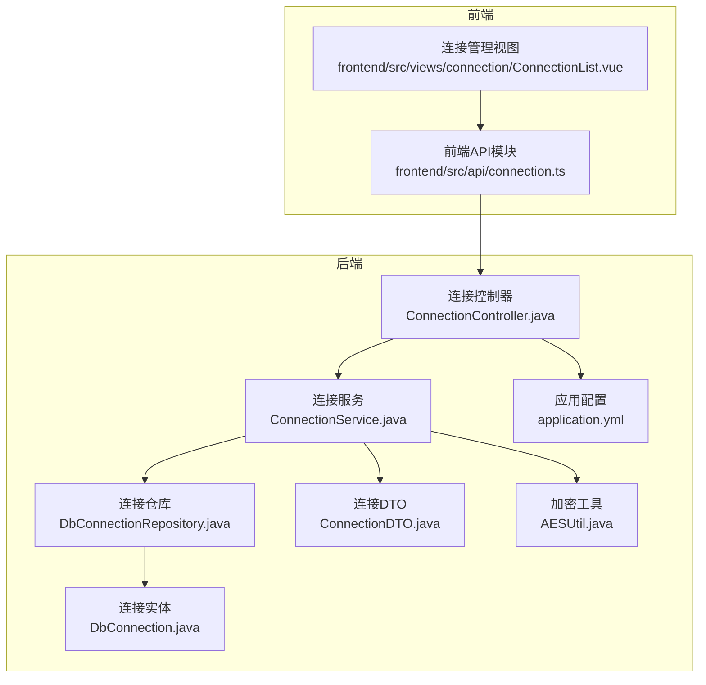
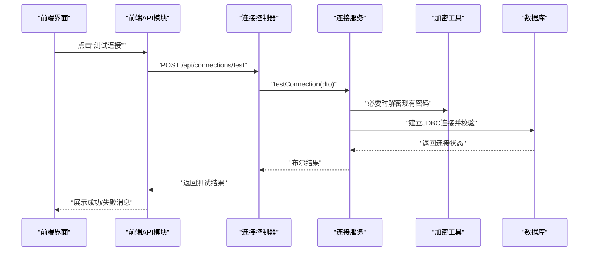
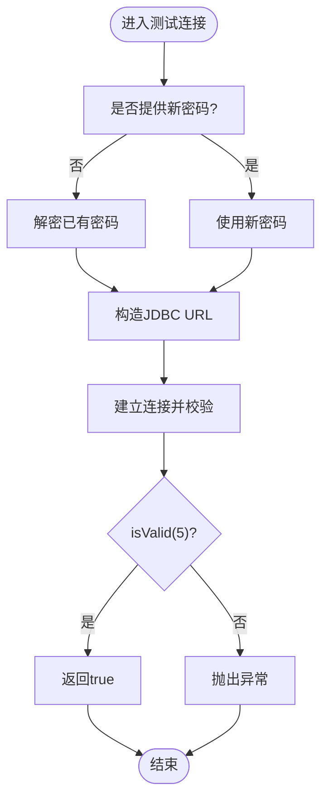
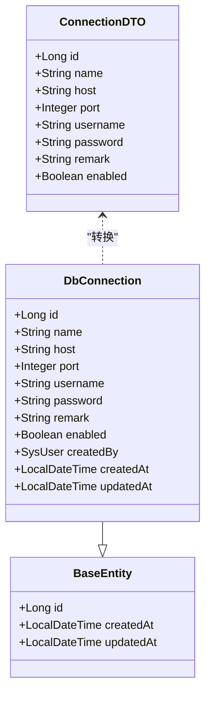
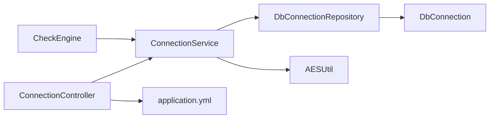

# 数据库连接API

<cite>
**本文档引用的文件**
- [backend/src/main/java/com/fieldcheck/controller/ConnectionController.java](file://backend/src/main/java/com/fieldcheck/controller/ConnectionController.java)
- [backend/src/main/java/com/fieldcheck/service/ConnectionService.java](file://backend/src/main/java/com/fieldcheck/service/ConnectionService.java)
- [backend/src/main/java/com/fieldcheck/entity/DbConnection.java](file://backend/src/main/java/com/fieldcheck/entity/DbConnection.java)
- [backend/src/main/java/com/fieldcheck/dto/ConnectionDTO.java](file://backend/src/main/java/com/fieldcheck/dto/ConnectionDTO.java)
- [backend/src/main/java/com/fieldcheck/repository/DbConnectionRepository.java](file://backend/src/main/java/com/fieldcheck/repository/DbConnectionRepository.java)
- [backend/src/main/java/com/fieldcheck/util/AESUtil.java](file://backend/src/main/java/com/fieldcheck/util/AESUtil.java)
- [backend/src/main/resources/application.yml](file://backend/src/main/resources/application.yml)
- [frontend/src/api/connection.ts](file://frontend/src/api/connection.ts)
- [frontend/src/views/connection/ConnectionList.vue](file://frontend/src/views/connection/ConnectionList.vue)
- [backend/src/main/java/com/fieldcheck/engine/CheckEngine.java](file://backend/src/main/java/com/fieldcheck/engine/CheckEngine.java)
- [backend/src/main/java/com/fieldcheck/service/ExecutionService.java](file://backend/src/main/java/com/fieldcheck/service/ExecutionService.java)
- [backend/src/main/java/com/fieldcheck/entity/BaseEntity.java](file://backend/src/main/java/com/fieldcheck/entity/BaseEntity.java)
- [backend/src/main/java/com/fieldcheck/config/JpaConfig.java](file://backend/src/main/java/com/fieldcheck/config/JpaConfig.java)
</cite>

## 目录
1. [简介](#简介)
2. [项目结构](#项目结构)
3. [核心组件](#核心组件)
4. [架构总览](#架构总览)
5. [详细组件分析](#详细组件分析)
6. [依赖关系分析](#依赖关系分析)
7. [性能考虑](#性能考虑)
8. [故障排查指南](#故障排查指南)
9. [结论](#结论)
10. [附录](#附录)

## 简介
本文件面向数据库连接管理API，系统性梳理后端控制器、服务层、数据模型与前端交互的完整实现，覆盖连接配置参数、连接测试、连接状态验证、连接列表查询、连接详情获取、连接创建/更新、连接删除、连接测试等能力，并提供安全存储与敏感信息加密说明，以及连接池管理与性能优化建议。

## 项目结构
后端采用Spring Boot分层架构，前端基于Vue 3 + Element Plus构建管理界面。数据库连接实体与仓库负责持久化，服务层封装业务逻辑与加密处理，控制器暴露REST接口；前端通过API模块调用后端接口并展示结果。

**图表来源**
- [backend/src/main/java/com/fieldcheck/controller/ConnectionController.java](file://backend/src/main/java/com/fieldcheck/controller/ConnectionController.java#L1-L82)
- [backend/src/main/java/com/fieldcheck/service/ConnectionService.java](file://backend/src/main/java/com/fieldcheck/service/ConnectionService.java#L1-L127)
- [backend/src/main/java/com/fieldcheck/repository/DbConnectionRepository.java](file://backend/src/main/java/com/fieldcheck/repository/DbConnectionRepository.java#L1-L27)
- [backend/src/main/java/com/fieldcheck/entity/DbConnection.java](file://backend/src/main/java/com/fieldcheck/entity/DbConnection.java#L1-L47)
- [backend/src/main/java/com/fieldcheck/dto/ConnectionDTO.java](file://backend/src/main/java/com/fieldcheck/dto/ConnectionDTO.java#L1-L34)
- [backend/src/main/java/com/fieldcheck/util/AESUtil.java](file://backend/src/main/java/com/fieldcheck/util/AESUtil.java#L1-L54)
- [backend/src/main/resources/application.yml](file://backend/src/main/resources/application.yml#L1-L75)
- [frontend/src/api/connection.ts](file://frontend/src/api/connection.ts#L1-L37)
- [frontend/src/views/connection/ConnectionList.vue](file://frontend/src/views/connection/ConnectionList.vue#L1-L223)

**章节来源**
- [backend/src/main/java/com/fieldcheck/controller/ConnectionController.java](file://backend/src/main/java/com/fieldcheck/controller/ConnectionController.java#L1-L82)
- [frontend/src/api/connection.ts](file://frontend/src/api/connection.ts#L1-L37)
- [frontend/src/views/connection/ConnectionList.vue](file://frontend/src/views/connection/ConnectionList.vue#L1-L223)

## 核心组件
- 控制器层：提供REST接口，负责请求参数接收、权限控制与响应封装。
- 服务层：实现业务逻辑，包括连接CRUD、连接测试、密码加解密、DTO转换。
- 数据访问层：基于JPA仓库，支持条件查询、分页排序与唯一性校验。
- 实体与DTO：定义连接字段、约束与传输结构。
- 加密工具：提供AES对称加密与解密，确保敏感信息在数据库中的安全存储。
- 配置中心：集中管理数据源连接池参数与加密密钥。

**章节来源**
- [backend/src/main/java/com/fieldcheck/service/ConnectionService.java](file://backend/src/main/java/com/fieldcheck/service/ConnectionService.java#L1-L127)
- [backend/src/main/java/com/fieldcheck/repository/DbConnectionRepository.java](file://backend/src/main/java/com/fieldcheck/repository/DbConnectionRepository.java#L1-L27)
- [backend/src/main/java/com/fieldcheck/entity/DbConnection.java](file://backend/src/main/java/com/fieldcheck/entity/DbConnection.java#L1-L47)
- [backend/src/main/java/com/fieldcheck/dto/ConnectionDTO.java](file://backend/src/main/java/com/fieldcheck/dto/ConnectionDTO.java#L1-L34)
- [backend/src/main/java/com/fieldcheck/util/AESUtil.java](file://backend/src/main/java/com/fieldcheck/util/AESUtil.java#L1-L54)
- [backend/src/main/resources/application.yml](file://backend/src/main/resources/application.yml#L60-L62)

## 架构总览
下图展示了从前端到后端的典型调用链路，包括连接测试流程与密码解密流程。

**图表来源**
- [frontend/src/views/connection/ConnectionList.vue](file://frontend/src/views/connection/ConnectionList.vue#L186-L195)
- [frontend/src/api/connection.ts](file://frontend/src/api/connection.ts#L34-L36)
- [backend/src/main/java/com/fieldcheck/controller/ConnectionController.java](file://backend/src/main/java/com/fieldcheck/controller/ConnectionController.java#L72-L80)
- [backend/src/main/java/com/fieldcheck/service/ConnectionService.java](file://backend/src/main/java/com/fieldcheck/service/ConnectionService.java#L92-L108)
- [backend/src/main/java/com/fieldcheck/util/AESUtil.java](file://backend/src/main/java/com/fieldcheck/util/AESUtil.java#L31-L45)

## 详细组件分析

### 连接控制器（ConnectionController）
- 接口职责
  - 列表查询：支持按名称与启用状态过滤，分页与排序。
  - 详情获取：按ID查询连接并转换为DTO。
  - 创建连接：校验权限与名称唯一性，保存连接。
  - 更新连接：支持部分字段更新，密码为空则保持不变。
  - 删除连接：仅管理员可操作。
  - 测试连接：构造URL并尝试建立连接，验证有效性。
- 权限控制：创建/更新需要普通或管理员角色，删除需要管理员角色。
- 响应封装：统一使用通用响应包装类。

**章节来源**
- [backend/src/main/java/com/fieldcheck/controller/ConnectionController.java](file://backend/src/main/java/com/fieldcheck/controller/ConnectionController.java#L25-L80)

### 连接服务（ConnectionService）
- 查询与详情：根据条件与分页查询，按需转换为DTO。
- 创建流程：校验名称唯一性，解析当前用户，加密密码后保存。
- 更新流程：支持更新所有字段，若未提供新密码则保留原加密值。
- 删除流程：按ID加载并删除。
- 连接测试：根据是否提供新密码决定是否先解密旧密码；构造JDBC URL并使用isValid进行快速校验。
- 密码解密：对外提供解密方法供引擎使用。
- DTO转换：将实体转换为DTO，避免直接暴露敏感字段。

**图表来源**
- [backend/src/main/java/com/fieldcheck/service/ConnectionService.java](file://backend/src/main/java/com/fieldcheck/service/ConnectionService.java#L92-L108)

**章节来源**
- [backend/src/main/java/com/fieldcheck/service/ConnectionService.java](file://backend/src/main/java/com/fieldcheck/service/ConnectionService.java#L33-L126)

### 数据模型与DTO
- 实体（DbConnection）：包含连接名称、主机、端口、用户名、加密后的密码、备注、启用状态及审计字段。
- DTO（ConnectionDTO）：用于传输，包含必填校验与端口范围约束。
- 基类（BaseEntity）：提供审计字段（创建时间、更新时间）。

**图表来源**
- [backend/src/main/java/com/fieldcheck/entity/DbConnection.java](file://backend/src/main/java/com/fieldcheck/entity/DbConnection.java#L18-L46)
- [backend/src/main/java/com/fieldcheck/dto/ConnectionDTO.java](file://backend/src/main/java/com/fieldcheck/dto/ConnectionDTO.java#L10-L33)
- [backend/src/main/java/com/fieldcheck/entity/BaseEntity.java](file://backend/src/main/java/com/fieldcheck/entity/BaseEntity.java#L14-L27)

**章节来源**
- [backend/src/main/java/com/fieldcheck/entity/DbConnection.java](file://backend/src/main/java/com/fieldcheck/entity/DbConnection.java#L1-L47)
- [backend/src/main/java/com/fieldcheck/dto/ConnectionDTO.java](file://backend/src/main/java/com/fieldcheck/dto/ConnectionDTO.java#L1-L34)
- [backend/src/main/java/com/fieldcheck/entity/BaseEntity.java](file://backend/src/main/java/com/fieldcheck/entity/BaseEntity.java#L1-L28)

### 数据访问层（DbConnectionRepository）
- 条件查询：支持按名称模糊匹配与启用状态过滤，返回分页结果。
- 启用状态查询：按启用状态查询列表。
- 唯一性校验：按名称判断是否存在。

**章节来源**
- [backend/src/main/java/com/fieldcheck/repository/DbConnectionRepository.java](file://backend/src/main/java/com/fieldcheck/repository/DbConnectionRepository.java#L16-L25)

### 加密工具（AESUtil）
- 加密：使用AES/CBC/PKCS5Padding，密钥长度归一化至32字节，IV取前16字节。
- 解密：与加密对应，输出明文。
- 安全性：密钥通过配置注入，避免硬编码。

**章节来源**
- [backend/src/main/java/com/fieldcheck/util/AESUtil.java](file://backend/src/main/java/com/fieldcheck/util/AESUtil.java#L15-L52)
- [backend/src/main/resources/application.yml](file://backend/src/main/resources/application.yml#L60-L62)

### 前端集成
- API模块：封装连接列表、详情、创建、更新、删除、测试等HTTP请求。
- 视图组件：提供连接列表、搜索、分页、弹窗表单、测试按钮与删除确认。

**章节来源**
- [frontend/src/api/connection.ts](file://frontend/src/api/connection.ts#L14-L36)
- [frontend/src/views/connection/ConnectionList.vue](file://frontend/src/views/connection/ConnectionList.vue#L136-L206)

## 依赖关系分析
- 控制器依赖服务层，服务层依赖仓库与加密工具，仓库依赖实体。
- 应用配置集中管理数据源连接池参数与加密密钥。
- 执行引擎在实际检查任务中会解密连接密码并建立连接，体现服务层解密能力的使用场景。

**图表来源**
- [backend/src/main/java/com/fieldcheck/controller/ConnectionController.java](file://backend/src/main/java/com/fieldcheck/controller/ConnectionController.java#L23-L23)
- [backend/src/main/java/com/fieldcheck/service/ConnectionService.java](file://backend/src/main/java/com/fieldcheck/service/ConnectionService.java#L27-L28)
- [backend/src/main/java/com/fieldcheck/repository/DbConnectionRepository.java](file://backend/src/main/java/com/fieldcheck/repository/DbConnectionRepository.java#L14-L14)
- [backend/src/main/java/com/fieldcheck/util/AESUtil.java](file://backend/src/main/java/com/fieldcheck/util/AESUtil.java#L10-L10)
- [backend/src/main/resources/application.yml](file://backend/src/main/resources/application.yml#L8-L22)
- [backend/src/main/java/com/fieldcheck/engine/CheckEngine.java](file://backend/src/main/java/com/fieldcheck/engine/CheckEngine.java#L63-L63)

**章节来源**
- [backend/src/main/java/com/fieldcheck/engine/CheckEngine.java](file://backend/src/main/java/com/fieldcheck/engine/CheckEngine.java#L28-L65)
- [backend/src/main/java/com/fieldcheck/service/ExecutionService.java](file://backend/src/main/java/com/fieldcheck/service/ExecutionService.java#L169-L178)

## 性能考虑
- 连接池配置
  - 最大池大小、最小空闲、空闲超时、连接超时、最大生存时间、连接测试查询、空闲/借用时验证、验证超时等参数已在配置中集中设置，确保连接复用与健康检查。
- 连接测试
  - 使用isValid进行快速有效性校验，避免复杂SQL带来的额外开销。
- 分页与排序
  - 列表查询默认按创建时间倒序，结合分页减少一次性数据量。
- 执行引擎中的连接使用
  - 在执行任务时按需建立连接，避免长连接占用资源；同时注意日志与告警的异步发送，降低阻塞。

**章节来源**
- [backend/src/main/resources/application.yml](file://backend/src/main/resources/application.yml#L13-L22)
- [backend/src/main/java/com/fieldcheck/service/ConnectionService.java](file://backend/src/main/java/com/fieldcheck/service/ConnectionService.java#L99-L107)
- [backend/src/main/java/com/fieldcheck/controller/ConnectionController.java](file://backend/src/main/java/com/fieldcheck/controller/ConnectionController.java#L29-L38)

## 故障排查指南
- 连接测试失败
  - 检查主机、端口、用户名、密码是否正确；若更新密码，确保新密码有效；若使用旧连接ID但未提供新密码，服务层会解密旧密码，确认旧密码是否仍有效。
  - 关注异常日志，定位网络连通性、认证失败或超时问题。
- 创建/更新失败
  - 名称重复会导致异常；检查是否存在同名连接。
  - 用户不存在也会导致异常；确认当前登录用户有效。
- 删除失败
  - 非管理员角色无法删除；确认权限。
- 密码解密异常
  - 确认加密密钥配置正确且未被更改；密钥长度归一化策略需一致。

**章节来源**
- [backend/src/main/java/com/fieldcheck/service/ConnectionService.java](file://backend/src/main/java/com/fieldcheck/service/ConnectionService.java#L44-L49)
- [backend/src/main/java/com/fieldcheck/controller/ConnectionController.java](file://backend/src/main/java/com/fieldcheck/controller/ConnectionController.java#L66-L70)

## 结论
本API围绕数据库连接的全生命周期管理提供了完善的接口与安全保障：通过DTO与实体分离、AES对称加密、严格的参数校验与权限控制，确保了连接配置的安全与稳定；配合连接池配置与快速连接测试，满足生产环境的性能与可靠性要求。执行引擎在真实任务中复用此连接管理能力，形成从配置到执行的一体化闭环。

## 附录

### 接口定义与参数说明
- 列表查询
  - 方法：GET
  - 路径：/api/connections
  - 查询参数：name（可选）、enabled（可选，true/false）、page（默认0）、size（默认10）
  - 返回：分页的连接DTO列表
- 连接详情
  - 方法：GET
  - 路径：/api/connections/{id}
  - 返回：连接DTO
- 创建连接
  - 方法：POST
  - 路径：/api/connections
  - 请求体：ConnectionDTO
  - 权限：ADMIN或USER
  - 返回：创建成功的连接DTO
- 更新连接
  - 方法：PUT
  - 路径：/api/connections/{id}
  - 请求体：ConnectionDTO
  - 权限：ADMIN或USER
  - 返回：更新成功的连接DTO
- 删除连接
  - 方法：DELETE
  - 路径：/api/connections/{id}
  - 权限：ADMIN
  - 返回：成功消息
- 测试连接
  - 方法：POST
  - 路径：/api/connections/test
  - 请求体：ConnectionDTO
  - 返回：布尔结果（成功/失败）

**章节来源**
- [backend/src/main/java/com/fieldcheck/controller/ConnectionController.java](file://backend/src/main/java/com/fieldcheck/controller/ConnectionController.java#L25-L80)
- [backend/src/main/java/com/fieldcheck/dto/ConnectionDTO.java](file://backend/src/main/java/com/fieldcheck/dto/ConnectionDTO.java#L14-L32)
- [frontend/src/api/connection.ts](file://frontend/src/api/connection.ts#L14-L36)

### 连接配置参数清单
- 必填项
  - 连接名称：非空
  - 主机地址：非空
  - 端口：1-65535
  - 用户名：非空
- 可选项
  - 密码：更新时可留空以保持不变
  - 备注：文本
  - 启用状态：布尔，默认true

**章节来源**
- [backend/src/main/java/com/fieldcheck/dto/ConnectionDTO.java](file://backend/src/main/java/com/fieldcheck/dto/ConnectionDTO.java#L14-L32)
- [backend/src/main/java/com/fieldcheck/entity/DbConnection.java](file://backend/src/main/java/com/fieldcheck/entity/DbConnection.java#L20-L41)

### 安全存储与敏感信息加密
- 存储策略
  - 密码字段在数据库中以加密形式存储，避免明文泄露。
- 加密算法
  - AES/CBC/PKCS5Padding，密钥长度归一化至32字节，IV取前16字节。
- 密钥管理
  - 密钥通过配置注入，建议在生产环境使用安全的密钥管理服务或环境变量注入。
- 访问控制
  - 创建/更新接口要求具备相应角色；删除接口要求管理员角色。

**章节来源**
- [backend/src/main/java/com/fieldcheck/util/AESUtil.java](file://backend/src/main/java/com/fieldcheck/util/AESUtil.java#L15-L52)
- [backend/src/main/resources/application.yml](file://backend/src/main/resources/application.yml#L60-L62)
- [backend/src/main/java/com/fieldcheck/controller/ConnectionController.java](file://backend/src/main/java/com/fieldcheck/controller/ConnectionController.java#L48-L67)

### 连接池管理与性能优化建议
- 连接池参数
  - 最大池大小、最小空闲、空闲超时、连接超时、最大生存时间、连接测试查询、空闲/借用时验证、验证超时等已在配置中集中设置。
- 建议
  - 根据并发与负载调整最大池大小与连接超时；
  - 合理设置验证查询与验证超时，平衡健康检查与性能；
  - 对于高并发场景，考虑引入连接池监控与告警。

**章节来源**
- [backend/src/main/resources/application.yml](file://backend/src/main/resources/application.yml#L13-L22)