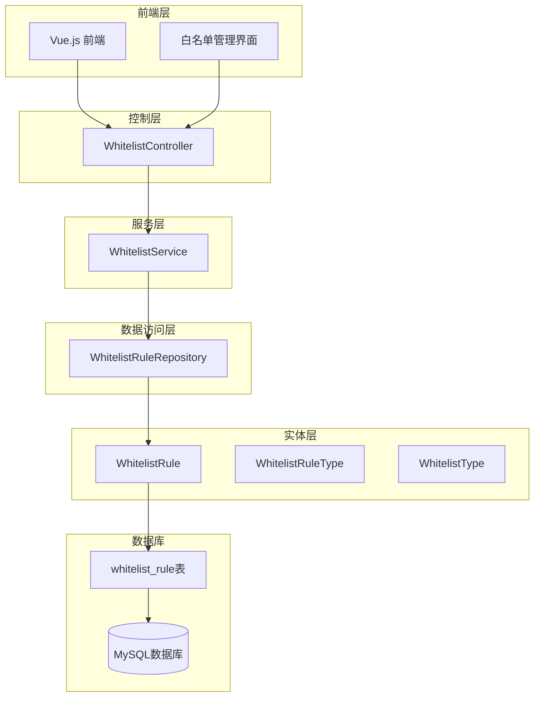
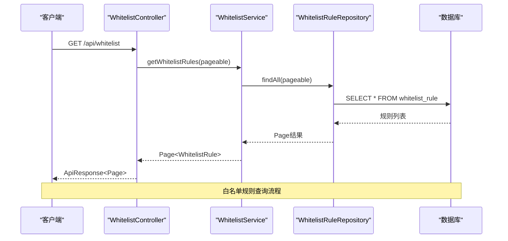
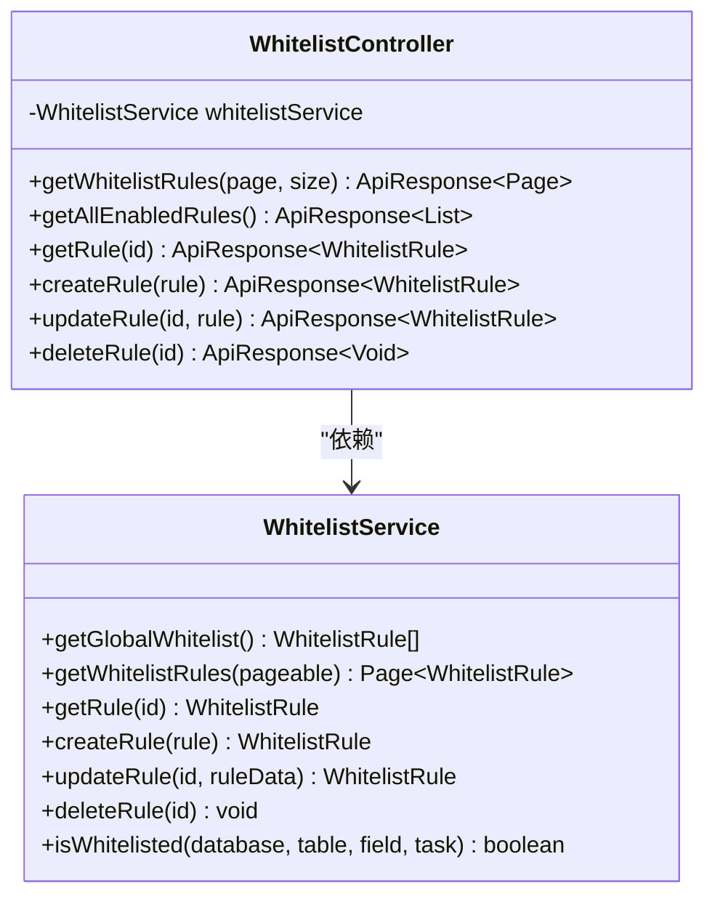
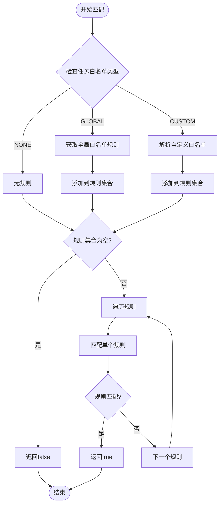
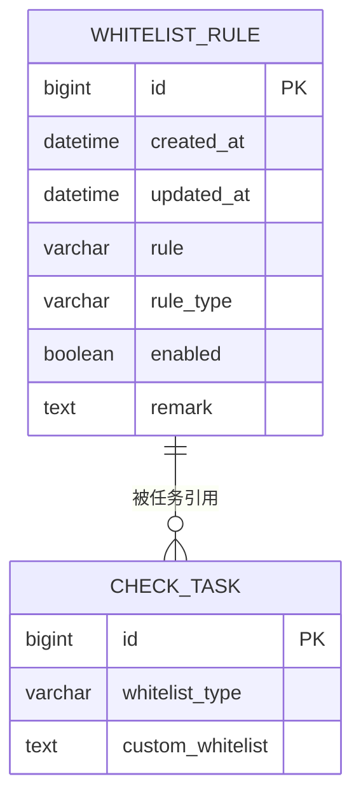
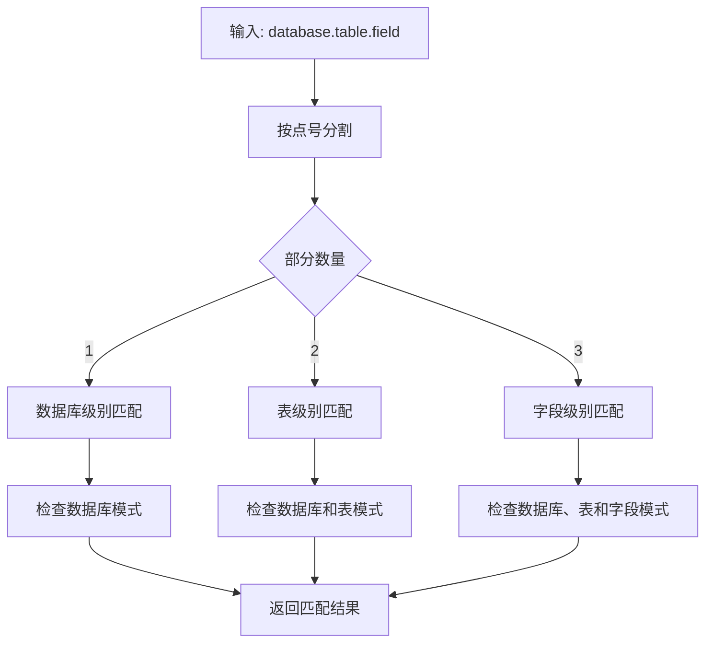

# 白名单管理API

<cite>
**本文档引用的文件**
- [WhitelistController.java](file://backend/src/main/java/com/fieldcheck/controller/WhitelistController.java)
- [WhitelistService.java](file://backend/src/main/java/com/fieldcheck/service/WhitelistService.java)
- [WhitelistRule.java](file://backend/src/main/java/com/fieldcheck/entity/WhitelistRule.java)
- [WhitelistRuleType.java](file://backend/src/main/java/com/fieldcheck/entity/WhitelistRuleType.java)
- [WhitelistType.java](file://backend/src/main/java/com/fieldcheck/entity/WhitelistType.java)
- [WhitelistRuleRepository.java](file://backend/src/main/java/com/fieldcheck/repository/WhitelistRuleRepository.java)
- [BaseEntity.java](file://backend/src/main/java/com/fieldcheck/entity/BaseEntity.java)
- [CheckEngine.java](file://backend/src/main/java/com/fieldcheck/engine/CheckEngine.java)
- [ApiResponse.java](file://backend/src/main/java/com/fieldcheck/dto/ApiResponse.java)
- [01_init_schema.sql](file://mysql/init/01_init_schema.sql)
- [WhitelistList.vue](file://frontend/src/views/whitelist/WhitelistList.vue)
</cite>

## 目录
1. [简介](#简介)
2. [项目结构](#项目结构)
3. [核心组件](#核心组件)
4. [架构概览](#架构概览)
5. [详细组件分析](#详细组件分析)
6. [API接口规范](#api接口规范)
7. [白名单规则类型与匹配机制](#白名单规则类型与匹配机制)
8. [批量导入导出功能](#批量导入导出功能)
9. [有效性验证与冲突检测](#有效性验证与冲突检测)
10. [性能考虑](#性能考虑)
11. [故障排除指南](#故障排除指南)
12. [结论](#结论)

## 简介

白名单管理API是MySQL字段容量风险检查平台的重要组成部分，用于管理系统中需要跳过的数据库对象（数据库、表、字段）。该系统通过白名单机制允许用户定义规则来排除特定的数据库对象，避免对这些对象进行风险检查。

系统支持三种级别的白名单规则：
- **数据库级别**：排除整个数据库
- **表级别**：排除特定表
- **字段级别**：排除特定字段

白名单匹配采用通配符模式，支持星号(*)和问号(?)通配符，并且具有大小写不敏感的特性。

## 项目结构

后端采用Spring Boot架构，主要分为以下层次：

**图表来源**
- [WhitelistController.java](file://backend/src/main/java/com/fieldcheck/controller/WhitelistController.java#L15-L58)
- [WhitelistService.java](file://backend/src/main/java/com/fieldcheck/service/WhitelistService.java#L22-L24)
- [WhitelistRuleRepository.java](file://backend/src/main/java/com/fieldcheck/repository/WhitelistRuleRepository.java#L12-L22)

**章节来源**
- [WhitelistController.java](file://backend/src/main/java/com/fieldcheck/controller/WhitelistController.java#L1-L59)
- [WhitelistService.java](file://backend/src/main/java/com/fieldcheck/service/WhitelistService.java#L1-L153)

## 核心组件

### 控制器层
WhitelistController提供RESTful API接口，负责处理HTTP请求和响应。

### 服务层
WhitelistService实现业务逻辑，包括：
- 白名单规则的增删改查
- 规则匹配算法
- 自动规则类型检测
- 有效性验证

### 数据访问层
WhitelistRuleRepository继承JPA Repository，提供数据持久化操作。

### 实体层
WhitelistRule实体定义了白名单规则的数据结构，包括规则字符串、规则类型、启用状态和备注信息。

**章节来源**
- [WhitelistController.java](file://backend/src/main/java/com/fieldcheck/controller/WhitelistController.java#L15-L58)
- [WhitelistService.java](file://backend/src/main/java/com/fieldcheck/service/WhitelistService.java#L22-L152)
- [WhitelistRuleRepository.java](file://backend/src/main/java/com/fieldcheck/repository/WhitelistRuleRepository.java#L12-L22)

## 架构概览

系统采用经典的三层架构设计，各层职责清晰分离：

**图表来源**
- [WhitelistController.java](file://backend/src/main/java/com/fieldcheck/controller/WhitelistController.java#L22-L28)
- [WhitelistService.java](file://backend/src/main/java/com/fieldcheck/service/WhitelistService.java#L30-L32)
- [WhitelistRuleRepository.java](file://backend/src/main/java/com/fieldcheck/repository/WhitelistRuleRepository.java#L12-L22)

**章节来源**
- [WhitelistController.java](file://backend/src/main/java/com/fieldcheck/controller/WhitelistController.java#L15-L58)
- [WhitelistService.java](file://backend/src/main/java/com/fieldcheck/service/WhitelistService.java#L22-L64)

## 详细组件分析

### WhitelistController 分析

控制器层实现了完整的CRUD操作，提供了以下接口：

**图表来源**
- [WhitelistController.java](file://backend/src/main/java/com/fieldcheck/controller/WhitelistController.java#L18-L58)
- [WhitelistService.java](file://backend/src/main/java/com/fieldcheck/service/WhitelistService.java#L22-L64)

**章节来源**
- [WhitelistController.java](file://backend/src/main/java/com/fieldcheck/controller/WhitelistController.java#L15-L58)

### WhitelistService 分析

服务层是系统的核心，实现了复杂的匹配算法和业务逻辑：

**图表来源**
- [WhitelistService.java](file://backend/src/main/java/com/fieldcheck/service/WhitelistService.java#L66-L89)

**章节来源**
- [WhitelistService.java](file://backend/src/main/java/com/fieldcheck/service/WhitelistService.java#L22-L152)

### 实体模型分析

**图表来源**
- [WhitelistRule.java](file://backend/src/main/java/com/fieldcheck/entity/WhitelistRule.java#L18-L33)
- [01_init_schema.sql](file://mysql/init/01_init_schema.sql#L157-L167)

**章节来源**
- [WhitelistRule.java](file://backend/src/main/java/com/fieldcheck/entity/WhitelistRule.java#L1-L34)
- [BaseEntity.java](file://backend/src/main/java/com/fieldcheck/entity/BaseEntity.java#L14-L27)

## API接口规范

### 基础路径
所有API请求的基础路径为：`/api/whitelist`

### 接口列表

#### 获取白名单规则列表
- **方法**：GET
- **路径**：`/api/whitelist`
- **参数**：
  - `page`：页码，默认0
  - `size`：每页大小，默认20
- **权限**：无需特殊权限
- **响应**：分页的白名单规则列表

#### 获取所有启用的规则
- **方法**：GET
- **路径**：`/api/whitelist/all`
- **权限**：无需特殊权限
- **响应**：所有启用的白名单规则列表

#### 获取单个规则详情
- **方法**：GET
- **路径**：`/api/whitelist/{id}`
- **参数**：id（路径参数）
- **权限**：无需特殊权限
- **响应**：指定ID的白名单规则

#### 创建新规则
- **方法**：POST
- **路径**：`/api/whitelist`
- **权限**：需要ADMIN或USER角色
- **请求体**：WhitelistRule对象
- **响应**：创建成功的规则

#### 更新现有规则
- **方法**：PUT
- **路径**：`/api/whitelist/{id}`
- **参数**：id（路径参数）
- **权限**：需要ADMIN或USER角色
- **请求体**：WhitelistRule对象
- **响应**：更新后的规则

#### 删除规则
- **方法**：DELETE
- **路径**：`/api/whitelist/{id}`
- **参数**：id（路径参数）
- **权限**：需要ADMIN角色
- **响应**：删除成功消息

**章节来源**
- [WhitelistController.java](file://backend/src/main/java/com/fieldcheck/controller/WhitelistController.java#L22-L57)
- [ApiResponse.java](file://backend/src/main/java/com/fieldcheck/dto/ApiResponse.java#L12-L43)

## 白名单规则类型与匹配机制

### 规则类型定义

系统支持三种级别的白名单规则：

| 规则类型 | 示例 | 说明 |
|---------|------|------|
| DATABASE | `db*` | 匹配以db开头的数据库 |
| TABLE | `db.table` 或 `db.*` | 匹配指定表或数据库下所有表 |
| FIELD | `db.table.field` | 匹配指定字段 |

### 匹配规则算法

规则匹配采用分层匹配策略：

**图表来源**
- [WhitelistService.java](file://backend/src/main/java/com/fieldcheck/service/WhitelistService.java#L106-L123)

### 通配符支持

系统支持以下通配符：
- `*`：匹配任意字符序列
- `?`：匹配单个字符
- `.`：匹配字面量点号

匹配算法将通配符转换为正则表达式进行匹配，且匹配过程大小写不敏感。

### 优先级处理机制

白名单匹配遵循以下优先级顺序：

1. **精确匹配优先于通配符匹配**
2. **具体规则优先于通用规则**
3. **规则在规则集合中的顺序不影响匹配结果**

匹配过程采用线性扫描方式，一旦找到匹配规则立即返回true。

**章节来源**
- [WhitelistRuleType.java](file://backend/src/main/java/com/fieldcheck/entity/WhitelistRuleType.java#L3-L7)
- [WhitelistService.java](file://backend/src/main/java/com/fieldcheck/service/WhitelistService.java#L106-L151)

## 批量导入导出功能

### 导出功能

系统支持通过以下方式导出白名单规则：

1. **API导出**：调用`/api/whitelist/all`接口获取所有启用的规则
2. **页面导出**：前端界面提供导出功能，可将表格数据导出为CSV格式

导出的数据包含以下字段：
- 规则字符串
- 规则类型
- 启用状态
- 备注信息

### 导入功能

系统支持通过以下方式导入白名单规则：

1. **自定义白名单导入**：在任务配置中使用`custom_whitelist`字段
2. **批量创建**：通过循环调用创建接口批量添加规则

导入时的注意事项：
- 支持注释行（以#开头的行会被忽略）
- 每行一个规则
- 自动去除空白字符

**章节来源**
- [WhitelistService.java](file://backend/src/main/java/com/fieldcheck/service/WhitelistService.java#L91-L104)
- [WhitelistList.vue](file://frontend/src/views/whitelist/WhitelistList.vue#L67-L72)

## 有效性验证与冲突检测

### 规则唯一性验证

系统确保每个白名单规则的唯一性：
- 同一规则字符串不能重复存在
- 创建新规则时会检查规则是否已存在
- 如果存在重复规则，将抛出异常

### 规则类型自动检测

系统根据规则字符串中的点号数量自动检测规则类型：
- 0个点号：DATABASE类型
- 1个点号：TABLE类型  
- 2个点号：FIELD类型

### 冲突检测机制

系统提供以下冲突检测：

1. **重叠规则检测**：系统不会主动检测重叠规则，但可以通过规则设计避免
2. **无效规则检测**：规则必须符合格式要求
3. **权限冲突检测**：删除操作需要ADMIN权限

### 错误处理

系统采用统一的错误处理机制：
- 规则不存在：抛出"白名单规则不存在"异常
- 重复规则：抛出"规则已存在"异常
- 权限不足：Spring Security拒绝访问

**章节来源**
- [WhitelistService.java](file://backend/src/main/java/com/fieldcheck/service/WhitelistService.java#L34-L48)
- [WhitelistRuleRepository.java](file://backend/src/main/java/com/fieldcheck/repository/WhitelistRuleRepository.java#L21)

## 性能考虑

### 查询优化

1. **分页查询**：默认每页20条记录，支持自定义大小
2. **索引优化**：数据库表包含必要的索引
3. **缓存策略**：全局白名单规则会缓存到内存中

### 匹配算法优化

1. **早期退出**：匹配到第一个符合条件的规则立即返回
2. **规则预处理**：规则在创建时就确定其类型
3. **正则表达式缓存**：系统会缓存编译后的正则表达式

### 并发处理

1. **事务管理**：关键操作使用@Transactional注解
2. **线程安全**：服务层方法都是无状态的
3. **连接池**：数据库连接使用连接池管理

## 故障排除指南

### 常见问题及解决方案

1. **规则不生效**
   - 检查规则格式是否正确
   - 确认规则类型是否匹配
   - 验证通配符使用是否正确

2. **权限问题**
   - 确认用户角色是否包含ADMIN或USER
   - 检查Spring Security配置

3. **数据库连接问题**
   - 验证数据库连接信息
   - 检查网络连通性

### 调试建议

1. **启用日志**：查看WhitelistService的日志输出
2. **检查数据库**：确认规则已正确存储
3. **测试匹配**：使用简单的规则测试匹配功能

**章节来源**
- [WhitelistService.java](file://backend/src/main/java/com/fieldcheck/service/WhitelistService.java#L19-L22)

## 结论

白名单管理API提供了完整的企业级白名单管理功能，具有以下特点：

1. **功能完整**：支持CRUD操作、批量导入导出、权限控制
2. **灵活匹配**：支持多级规则和通配符匹配
3. **易于使用**：提供直观的API接口和前端界面
4. **性能优秀**：采用多种优化策略确保高效运行
5. **安全可靠**：完善的权限控制和错误处理机制

该系统能够有效帮助用户管理需要跳过的数据库对象，提高风险检查的准确性和效率。