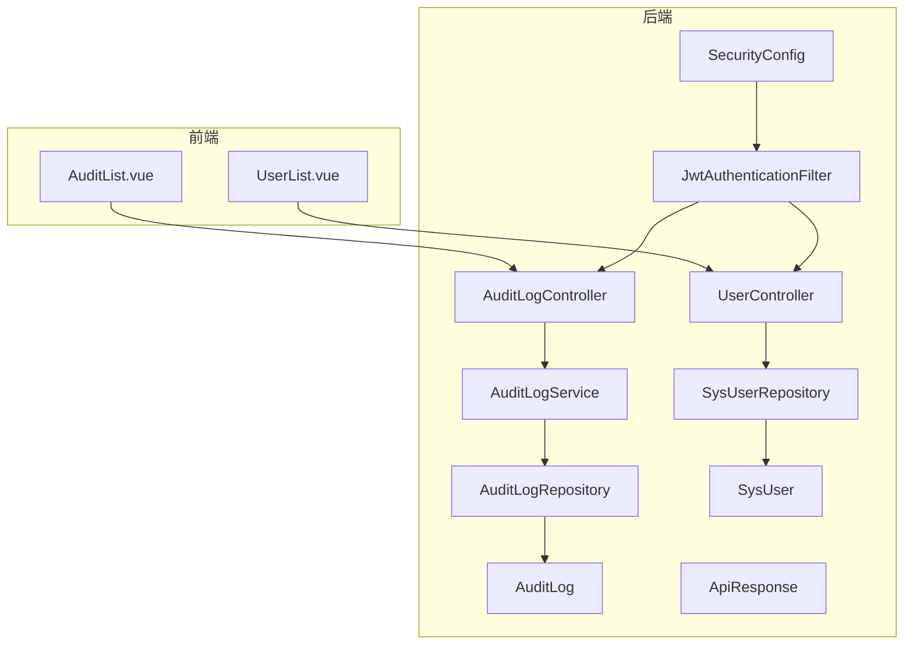
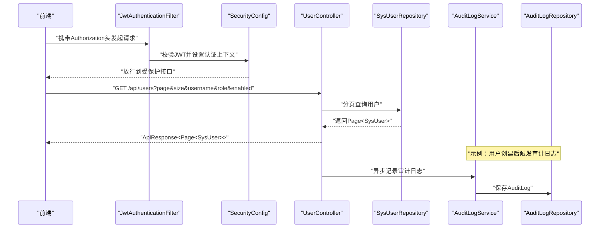
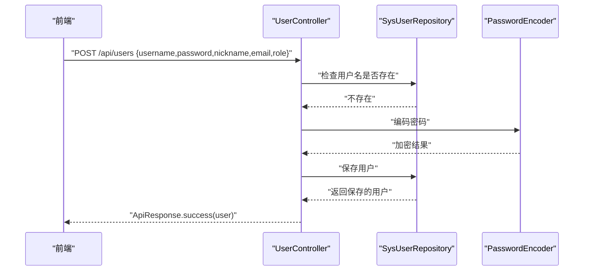
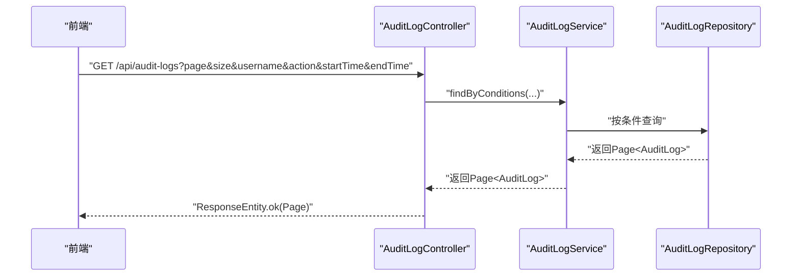
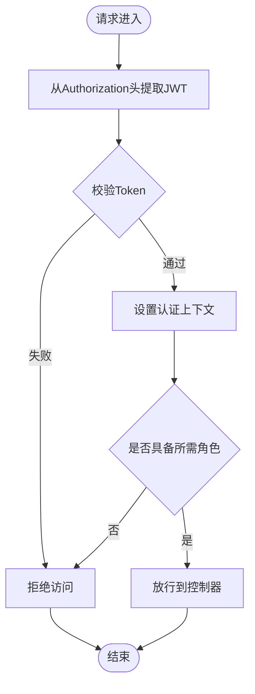
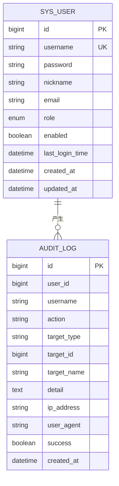
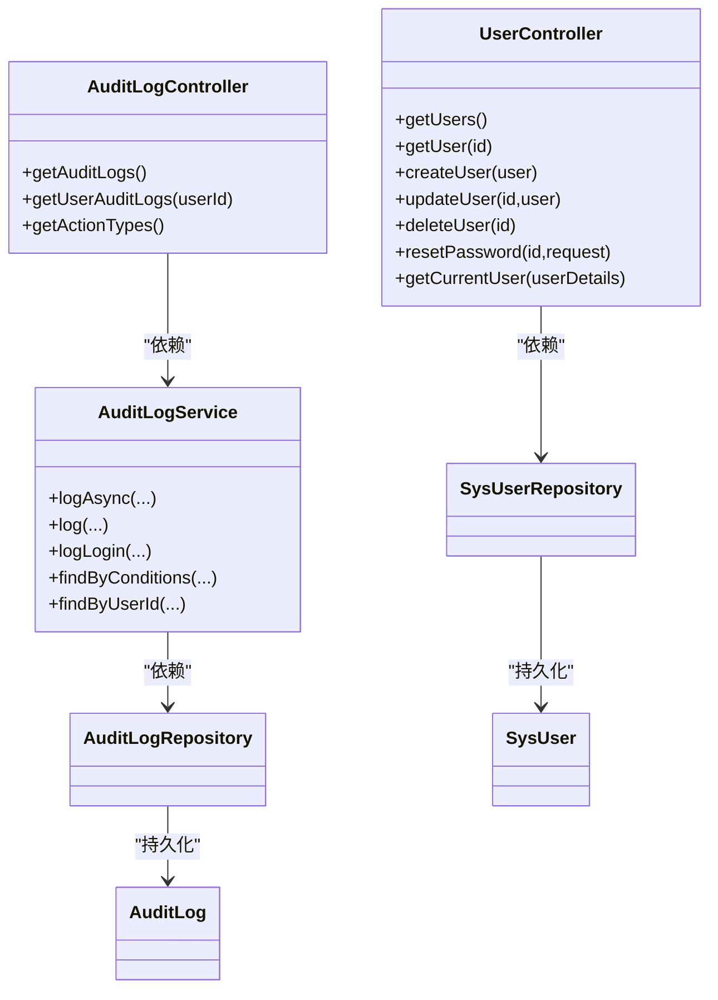

# 系统管理API

<cite>
**本文档引用的文件**
- [UserController.java](file://backend/src/main/java/com/fieldcheck/controller/UserController.java)
- [AuditLogController.java](file://backend/src/main/java/com/fieldcheck/controller/AuditLogController.java)
- [SysUser.java](file://backend/src/main/java/com/fieldcheck/entity/SysUser.java)
- [UserRole.java](file://backend/src/main/java/com/fieldcheck/entity/UserRole.java)
- [SysUserRepository.java](file://backend/src/main/java/com/fieldcheck/repository/SysUserRepository.java)
- [AuditLog.java](file://backend/src/main/java/com/fieldcheck/entity/AuditLog.java)
- [AuditLogRepository.java](file://backend/src/main/java/com/fieldcheck/repository/AuditLogRepository.java)
- [AuditLogService.java](file://backend/src/main/java/com/fieldcheck/service/AuditLogService.java)
- [Auditable.java](file://backend/src/main/java/com/fieldcheck/aspect/Auditable.java)
- [SecurityConfig.java](file://backend/src/main/java/com/fieldcheck/config/SecurityConfig.java)
- [JwtAuthenticationFilter.java](file://backend/src/main/java/com/fieldcheck/security/JwtAuthenticationFilter.java)
- [ApiResponse.java](file://backend/src/main/java/com/fieldcheck/dto/ApiResponse.java)
- [application.yml](file://backend/src/main/resources/application.yml)
- [user.ts](file://frontend/src/api/user.ts)
- [UserList.vue](file://frontend/src/views/system/UserList.vue)
- [AuditList.vue](file://frontend/src/views/system/AuditList.vue)
</cite>

## 目录
1. [简介](#简介)
2. [项目结构](#项目结构)
3. [核心组件](#核心组件)
4. [架构总览](#架构总览)
5. [详细组件分析](#详细组件分析)
6. [依赖关系分析](#依赖关系分析)
7. [性能考虑](#性能考虑)
8. [故障排除指南](#故障排除指南)
9. [结论](#结论)
10. [附录](#附录)

## 简介
本文件面向系统管理员与开发人员，系统性梳理后端管理API，覆盖用户管理、审计日志、系统配置等后台功能。重点包括：
- 用户信息管理：创建、修改、删除、重置密码、状态管理、当前用户信息获取
- 审计日志查询：按用户、操作类型、时间范围分页查询，支持用户维度日志查询
- 系统配置：数据库连接、JPA配置、JWT密钥、AES加密密钥、应用参数等
- 权限与安全：基于角色的访问控制（RBAC），JWT认证流程，跨域与CORS配置

## 项目结构
后端采用Spring Boot + Spring Security + JPA架构，控制器层负责REST接口，服务层处理业务逻辑，仓库层负责数据持久化，实体层定义模型。

图表来源
- [UserController.java](file://backend/src/main/java/com/fieldcheck/controller/UserController.java#L18-L136)
- [AuditLogController.java](file://backend/src/main/java/com/fieldcheck/controller/AuditLogController.java#L16-L66)
- [AuditLogService.java](file://backend/src/main/java/com/fieldcheck/service/AuditLogService.java#L18-L133)
- [SysUserRepository.java](file://backend/src/main/java/com/fieldcheck/repository/SysUserRepository.java#L11-L19)
- [AuditLogRepository.java](file://backend/src/main/java/com/fieldcheck/repository/AuditLogRepository.java#L13-L29)
- [SysUser.java](file://backend/src/main/java/com/fieldcheck/entity/SysUser.java#L12-L44)
- [AuditLog.java](file://backend/src/main/java/com/fieldcheck/entity/AuditLog.java#L11-L54)
- [SecurityConfig.java](file://backend/src/main/java/com/fieldcheck/config/SecurityConfig.java#L23-L60)
- [JwtAuthenticationFilter.java](file://backend/src/main/java/com/fieldcheck/security/JwtAuthenticationFilter.java#L22-L59)
- [ApiResponse.java](file://backend/src/main/java/com/fieldcheck/dto/ApiResponse.java#L8-L44)

章节来源
- [UserController.java](file://backend/src/main/java/com/fieldcheck/controller/UserController.java#L18-L136)
- [AuditLogController.java](file://backend/src/main/java/com/fieldcheck/controller/AuditLogController.java#L16-L66)
- [SecurityConfig.java](file://backend/src/main/java/com/fieldcheck/config/SecurityConfig.java#L23-L60)

## 核心组件
- 用户管理控制器：提供用户列表、详情、创建、更新、删除、重置密码、当前用户信息等接口，并通过角色注解限制访问
- 审计日志控制器：提供审计日志分页查询、按用户维度查询、操作类型枚举获取
- 审计日志服务：异步/同步记录审计日志，解析请求IP与UA，封装统一日志对象
- 数据模型与仓库：用户实体与仓库、审计日志实体与仓库，支持条件查询与分页
- 安全配置：JWT过滤器、密码编码器、跨域与CORS、方法级鉴权开关
- 响应封装：统一响应体结构，便于前后端交互

章节来源
- [UserController.java](file://backend/src/main/java/com/fieldcheck/controller/UserController.java#L26-L122)
- [AuditLogController.java](file://backend/src/main/java/com/fieldcheck/controller/AuditLogController.java#L23-L64)
- [AuditLogService.java](file://backend/src/main/java/com/fieldcheck/service/AuditLogService.java#L25-L131)
- [SysUser.java](file://backend/src/main/java/com/fieldcheck/entity/SysUser.java#L19-L43)
- [AuditLog.java](file://backend/src/main/java/com/fieldcheck/entity/AuditLog.java#L21-L53)
- [SysUserRepository.java](file://backend/src/main/java/com/fieldcheck/repository/SysUserRepository.java#L12-L18)
- [AuditLogRepository.java](file://backend/src/main/java/com/fieldcheck/repository/AuditLogRepository.java#L14-L28)
- [SecurityConfig.java](file://backend/src/main/java/com/fieldcheck/config/SecurityConfig.java#L44-L58)
- [JwtAuthenticationFilter.java](file://backend/src/main/java/com/fieldcheck/security/JwtAuthenticationFilter.java#L27-L58)
- [ApiResponse.java](file://backend/src/main/java/com/fieldcheck/dto/ApiResponse.java#L12-L43)

## 架构总览
系统采用前后端分离，前端通过HTTP调用后端REST接口；后端通过JWT进行认证，基于角色授权访问受保护资源；审计日志通过服务层异步写入数据库。

图表来源
- [JwtAuthenticationFilter.java](file://backend/src/main/java/com/fieldcheck/security/JwtAuthenticationFilter.java#L27-L58)
- [SecurityConfig.java](file://backend/src/main/java/com/fieldcheck/config/SecurityConfig.java#L44-L58)
- [UserController.java](file://backend/src/main/java/com/fieldcheck/controller/UserController.java#L26-L53)
- [SysUserRepository.java](file://backend/src/main/java/com/fieldcheck/repository/SysUserRepository.java#L15-L17)
- [AuditLogService.java](file://backend/src/main/java/com/fieldcheck/service/AuditLogService.java#L28-L52)
- [AuditLogRepository.java](file://backend/src/main/java/com/fieldcheck/repository/AuditLogRepository.java#L16-L27)

## 详细组件分析

### 用户管理API
- 接口概览
  - GET /api/users：分页查询用户，支持按用户名、角色、启用状态筛选
  - GET /api/users/{id}：获取用户详情
  - POST /api/users：创建用户（自动启用，密码加密）
  - PUT /api/users/{id}：更新用户信息（昵称、邮箱、角色、启用状态）
  - DELETE /api/users/{id}：删除用户（禁止删除admin账号）
  - PUT /api/users/{id}/password：重置指定用户密码
  - GET /api/users/me：获取当前登录用户信息
- 关键特性
  - 统一响应体：使用ApiResponse封装code、message、data
  - 密码加密：使用BCryptPasswordEncoder
  - 角色限制：所有用户管理接口需ADMIN角色
  - 分页排序：默认按创建时间倒序
- 前端集成
  - 前端通过user.ts封装请求，UserList.vue实现用户列表、搜索、状态切换、重置密码、删除等操作

图表来源
- [UserController.java](file://backend/src/main/java/com/fieldcheck/controller/UserController.java#L63-L74)
- [SysUserRepository.java](file://backend/src/main/java/com/fieldcheck/repository/SysUserRepository.java#L13-L14)
- [ApiResponse.java](file://backend/src/main/java/com/fieldcheck/dto/ApiResponse.java#L17-L31)

章节来源
- [UserController.java](file://backend/src/main/java/com/fieldcheck/controller/UserController.java#L26-L122)
- [SysUserRepository.java](file://backend/src/main/java/com/fieldcheck/repository/SysUserRepository.java#L12-L18)
- [ApiResponse.java](file://backend/src/main/java/com/fieldcheck/dto/ApiResponse.java#L12-L43)
- [user.ts](file://frontend/src/api/user.ts#L3-L31)
- [UserList.vue](file://frontend/src/views/system/UserList.vue#L295-L427)

### 审计日志API
- 接口概览
  - GET /api/audit-logs：分页查询审计日志，支持按用户名、操作类型、起止时间过滤
  - GET /api/audit-logs/user/{userId}：按用户ID分页查询其审计日志
  - GET /api/audit-logs/actions：获取可用操作类型枚举
- 关键特性
  - 统一响应：直接返回Page<AuditLog>
  - IP与UA解析：从请求头或代理头提取客户端IP，兼容多级代理
  - 成功/失败标记：根据业务逻辑标记success字段
- 前端集成
  - AuditList.vue实现日志列表、搜索、分页、详情展示与操作类型标签映射

图表来源
- [AuditLogController.java](file://backend/src/main/java/com/fieldcheck/controller/AuditLogController.java#L23-L36)
- [AuditLogService.java](file://backend/src/main/java/com/fieldcheck/service/AuditLogService.java#L73-L86)
- [AuditLogRepository.java](file://backend/src/main/java/com/fieldcheck/repository/AuditLogRepository.java#L18-L27)

章节来源
- [AuditLogController.java](file://backend/src/main/java/com/fieldcheck/controller/AuditLogController.java#L23-L64)
- [AuditLogService.java](file://backend/src/main/java/com/fieldcheck/service/AuditLogService.java#L73-L131)
- [AuditLogRepository.java](file://backend/src/main/java/com/fieldcheck/repository/AuditLogRepository.java#L14-L28)
- [AuditList.vue](file://frontend/src/views/system/AuditList.vue#L211-L277)

### 安全与权限控制
- 认证机制
  - JWT过滤器从Authorization头提取Bearer Token，校验后设置认证上下文
  - 密码编码器使用BCrypt
- 授权机制
  - 方法级鉴权开启，用户管理接口均要求ADMIN角色
  - 全局安全配置允许特定路径匿名访问，其余/api/**需认证
- 配置要点
  - CORS与CSRF关闭，会话策略无状态
  - 放行/ws/**与/actuator/**等路径

图表来源
- [JwtAuthenticationFilter.java](file://backend/src/main/java/com/fieldcheck/security/JwtAuthenticationFilter.java#L31-L43)
- [SecurityConfig.java](file://backend/src/main/java/com/fieldcheck/config/SecurityConfig.java#L44-L58)
- [UserController.java](file://backend/src/main/java/com/fieldcheck/controller/UserController.java#L27-L28)

章节来源
- [JwtAuthenticationFilter.java](file://backend/src/main/java/com/fieldcheck/security/JwtAuthenticationFilter.java#L27-L58)
- [SecurityConfig.java](file://backend/src/main/java/com/fieldcheck/config/SecurityConfig.java#L44-L58)
- [UserController.java](file://backend/src/main/java/com/fieldcheck/controller/UserController.java#L10-L13)

### 数据模型与仓库
- 用户实体
  - 字段：username、password、nickname、email、role、enabled、lastLoginTime
  - 约束：username唯一，role为枚举，enabled布尔值，默认true
- 审计日志实体
  - 字段：userId、username、action、targetType、targetId、targetName、detail、ipAddress、userAgent、success
  - 索引：user_id、action
- 仓库能力
  - 用户：按用户名、角色、启用状态模糊匹配与精确匹配
  - 审计：按用户ID与多条件组合查询

图表来源
- [SysUser.java](file://backend/src/main/java/com/fieldcheck/entity/SysUser.java#L19-L43)
- [AuditLog.java](file://backend/src/main/java/com/fieldcheck/entity/AuditLog.java#L21-L53)
- [SysUserRepository.java](file://backend/src/main/java/com/fieldcheck/repository/SysUserRepository.java#L12-L18)
- [AuditLogRepository.java](file://backend/src/main/java/com/fieldcheck/repository/AuditLogRepository.java#L14-L28)

章节来源
- [SysUser.java](file://backend/src/main/java/com/fieldcheck/entity/SysUser.java#L12-L44)
- [UserRole.java](file://backend/src/main/java/com/fieldcheck/entity/UserRole.java#L3-L7)
- [AuditLog.java](file://backend/src/main/java/com/fieldcheck/entity/AuditLog.java#L11-L54)
- [SysUserRepository.java](file://backend/src/main/java/com/fieldcheck/repository/SysUserRepository.java#L11-L19)
- [AuditLogRepository.java](file://backend/src/main/java/com/fieldcheck/repository/AuditLogRepository.java#L13-L29)

### 系统配置
- 数据源与连接池：MySQL地址、用户名、密码、HikariCP连接池参数
- JPA：DDL自动更新、SQL显示、方言与格式化
- Quartz：JDBC作业存储、初始化模式
- 邮件：SMTP主机、端口、认证属性
- Jackson：日期格式与时区
- JWT：密钥与过期时间
- AES：数据库密码加密密钥
- 应用参数：日志目录、并发任务上限
- 日志：根级别与包级别日志输出格式

章节来源
- [application.yml](file://backend/src/main/resources/application.yml#L8-L75)

## 依赖关系分析

图表来源
- [UserController.java](file://backend/src/main/java/com/fieldcheck/controller/UserController.java#L23-L24)
- [AuditLogController.java](file://backend/src/main/java/com/fieldcheck/controller/AuditLogController.java#L21-L22)
- [AuditLogService.java](file://backend/src/main/java/com/fieldcheck/service/AuditLogService.java#L23-L23)
- [SysUserRepository.java](file://backend/src/main/java/com/fieldcheck/repository/SysUserRepository.java#L12-L18)
- [AuditLogRepository.java](file://backend/src/main/java/com/fieldcheck/repository/AuditLogRepository.java#L14-L28)
- [SysUser.java](file://backend/src/main/java/com/fieldcheck/entity/SysUser.java#L19-L43)
- [AuditLog.java](file://backend/src/main/java/com/fieldcheck/entity/AuditLog.java#L21-L53)

章节来源
- [UserController.java](file://backend/src/main/java/com/fieldcheck/controller/UserController.java#L18-L136)
- [AuditLogController.java](file://backend/src/main/java/com/fieldcheck/controller/AuditLogController.java#L16-L66)
- [AuditLogService.java](file://backend/src/main/java/com/fieldcheck/service/AuditLogService.java#L18-L133)

## 性能考虑
- 分页查询：用户与审计日志均支持分页，建议前端传入合理页大小，避免一次性加载过多数据
- 异步审计：审计日志写入采用异步事务，降低主流程阻塞风险
- 连接池参数：根据并发量调整最大池大小、空闲超时、连接超时等参数
- 索引优化：审计日志对user_id与action建立索引，有利于高频查询
- JWT无状态：无会话存储，适合水平扩展，但需注意令牌泄露与撤销策略

## 故障排除指南
- 用户名重复：创建用户时若用户名已存在，抛出异常提示
- 用户不存在：查询或更新用户时如未找到，抛出异常
- 管理员账号保护：禁止删除内置admin账号
- 审计日志保存失败：服务层捕获异常并记录错误日志，不影响主流程
- 跨域与CORS：安全配置中已关闭CSRF并启用CORS，确保前端可正常访问
- JWT无效：过滤器在解析与校验失败时会记录错误并拒绝访问

章节来源
- [UserController.java](file://backend/src/main/java/com/fieldcheck/controller/UserController.java#L66-L102)
- [AuditLogService.java](file://backend/src/main/java/com/fieldcheck/service/AuditLogService.java#L35-L51)
- [SecurityConfig.java](file://backend/src/main/java/com/fieldcheck/config/SecurityConfig.java#L44-L58)
- [JwtAuthenticationFilter.java](file://backend/src/main/java/com/fieldcheck/security/JwtAuthenticationFilter.java#L44-L46)

## 结论
该系统管理API围绕用户管理与审计日志两大核心模块构建，配合JWT认证与基于角色的访问控制，提供了清晰的后台管理能力。通过统一响应体、分页查询与异步审计等设计，兼顾了易用性与性能。建议在生产环境中进一步完善令牌撤销、审计日志归档与监控告警机制。

## 附录

### API清单与说明
- 用户管理
  - GET /api/users：分页查询用户，支持按用户名、角色、启用状态过滤
  - GET /api/users/{id}：获取用户详情
  - POST /api/users：创建用户（ADMIN）
  - PUT /api/users/{id}：更新用户（ADMIN）
  - DELETE /api/users/{id}：删除用户（ADMIN，不可删除admin）
  - PUT /api/users/{id}/password：重置密码（ADMIN）
  - GET /api/users/me：获取当前用户信息
- 审计日志
  - GET /api/audit-logs：分页查询审计日志（ADMIN）
  - GET /api/audit-logs/user/{userId}：按用户ID查询审计日志（ADMIN）
  - GET /api/audit-logs/actions：获取操作类型枚举（无需认证）

章节来源
- [UserController.java](file://backend/src/main/java/com/fieldcheck/controller/UserController.java#L26-L122)
- [AuditLogController.java](file://backend/src/main/java/com/fieldcheck/controller/AuditLogController.java#L23-L64)