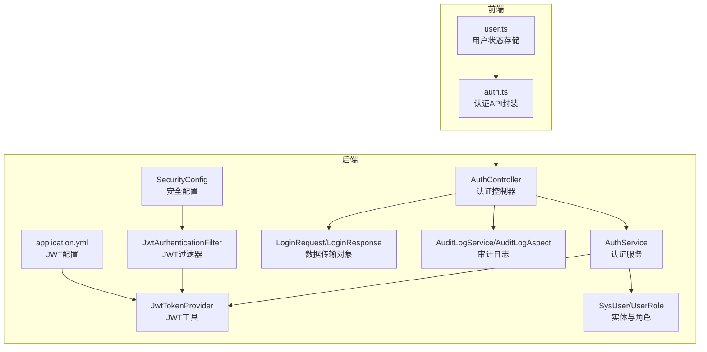
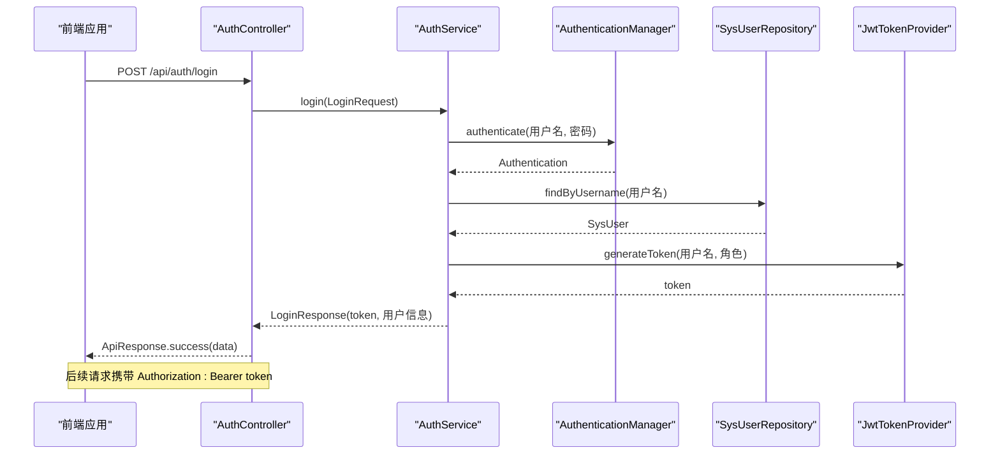
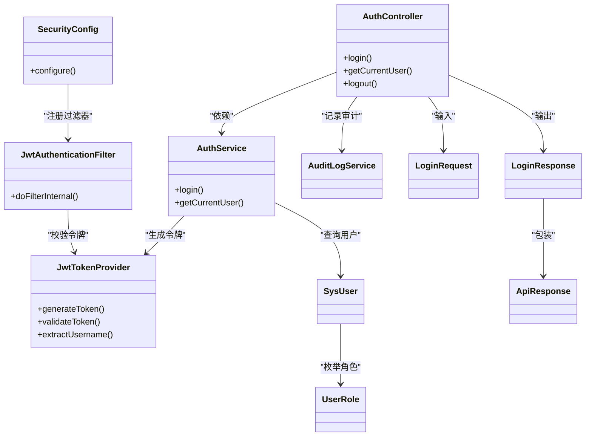

# 认证API

<cite>
**本文引用的文件**
- [AuthController.java](file://backend/src/main/java/com/fieldcheck/controller/AuthController.java)
- [AuthService.java](file://backend/src/main/java/com/fieldcheck/service/AuthService.java)
- [JwtTokenProvider.java](file://backend/src/main/java/com/fieldcheck/security/JwtTokenProvider.java)
- [JwtAuthenticationFilter.java](file://backend/src/main/java/com/fieldcheck/security/JwtAuthenticationFilter.java)
- [SecurityConfig.java](file://backend/src/main/java/com/fieldcheck/config/SecurityConfig.java)
- [LoginRequest.java](file://backend/src/main/java/com/fieldcheck/dto/LoginRequest.java)
- [LoginResponse.java](file://backend/src/main/java/com/fieldcheck/dto/LoginResponse.java)
- [ApiResponse.java](file://backend/src/main/java/com/fieldcheck/dto/ApiResponse.java)
- [SysUser.java](file://backend/src/main/java/com/fieldcheck/entity/SysUser.java)
- [UserRole.java](file://backend/src/main/java/com/fieldcheck/entity/UserRole.java)
- [AuditLogService.java](file://backend/src/main/java/com/fieldcheck/service/AuditLogService.java)
- [AuditLogAspect.java](file://backend/src/main/java/com/fieldcheck/aspect/AuditLogAspect.java)
- [application.yml](file://backend/src/main/resources/application.yml)
- [auth.ts](file://frontend/src/api/auth.ts)
- [user.ts](file://frontend/src/stores/user.ts)
</cite>

## 目录
1. [简介](#简介)
2. [项目结构](#项目结构)
3. [核心组件](#核心组件)
4. [架构总览](#架构总览)
5. [详细组件分析](#详细组件分析)
6. [依赖分析](#依赖分析)
7. [性能考虑](#性能考虑)
8. [故障排查指南](#故障排查指南)
9. [结论](#结论)
10. [附录](#附录)

## 简介
本文件为认证API的权威技术文档，覆盖用户登录、获取当前用户信息、用户登出等认证相关接口。内容包括：
- 接口定义与请求/响应格式
- 登录流程与JWT令牌生成、校验机制
- 错误处理与审计日志记录
- 前端调用示例与会话管理建议
- 令牌刷新机制说明与最佳实践

## 项目结构
后端采用Spring Boot分层架构，认证相关代码集中在controller、service、security与dto包；前端通过独立的API模块与后端交互。

图表来源
- [AuthController.java](file://backend/src/main/java/com/fieldcheck/controller/AuthController.java#L1-L56)
- [AuthService.java](file://backend/src/main/java/com/fieldcheck/service/AuthService.java#L1-L80)
- [JwtAuthenticationFilter.java](file://backend/src/main/java/com/fieldcheck/security/JwtAuthenticationFilter.java#L1-L59)
- [JwtTokenProvider.java](file://backend/src/main/java/com/fieldcheck/security/JwtTokenProvider.java#L1-L95)
- [SecurityConfig.java](file://backend/src/main/java/com/fieldcheck/config/SecurityConfig.java#L1-L60)
- [LoginRequest.java](file://backend/src/main/java/com/fieldcheck/dto/LoginRequest.java#L1-L15)
- [LoginResponse.java](file://backend/src/main/java/com/fieldcheck/dto/LoginResponse.java#L1-L20)
- [SysUser.java](file://backend/src/main/java/com/fieldcheck/entity/SysUser.java#L1-L44)
- [UserRole.java](file://backend/src/main/java/com/fieldcheck/entity/UserRole.java#L1-L8)
- [AuditLogService.java](file://backend/src/main/java/com/fieldcheck/service/AuditLogService.java#L1-L133)
- [AuditLogAspect.java](file://backend/src/main/java/com/fieldcheck/aspect/AuditLogAspect.java#L1-L241)
- [application.yml](file://backend/src/main/resources/application.yml#L55-L58)
- [auth.ts](file://frontend/src/api/auth.ts#L1-L27)
- [user.ts](file://frontend/src/stores/user.ts#L1-L60)

章节来源
- [AuthController.java](file://backend/src/main/java/com/fieldcheck/controller/AuthController.java#L1-L56)
- [SecurityConfig.java](file://backend/src/main/java/com/fieldcheck/config/SecurityConfig.java#L1-L60)

## 核心组件
- 认证控制器：提供登录、获取当前用户、登出三个接口，统一返回标准响应体。
- 认证服务：负责用户认证、令牌签发、当前用户查询。
- JWT工具：负责令牌生成、解析、校验。
- 安全配置：启用无状态会话策略，放行认证接口，对其他接口进行鉴权。
- 数据传输对象：LoginRequest、LoginResponse、ApiResponse。
- 实体与角色：SysUser、UserRole。
- 审计日志：登录/登出异步记录，支持按条件查询。

章节来源
- [AuthController.java](file://backend/src/main/java/com/fieldcheck/controller/AuthController.java#L17-L56)
- [AuthService.java](file://backend/src/main/java/com/fieldcheck/service/AuthService.java#L23-L80)
- [JwtTokenProvider.java](file://backend/src/main/java/com/fieldcheck/security/JwtTokenProvider.java#L16-L95)
- [SecurityConfig.java](file://backend/src/main/java/com/fieldcheck/config/SecurityConfig.java#L23-L59)
- [LoginRequest.java](file://backend/src/main/java/com/fieldcheck/dto/LoginRequest.java#L7-L14)
- [LoginResponse.java](file://backend/src/main/java/com/fieldcheck/dto/LoginResponse.java#L8-L19)
- [ApiResponse.java](file://backend/src/main/java/com/fieldcheck/dto/ApiResponse.java#L8-L43)
- [SysUser.java](file://backend/src/main/java/com/fieldcheck/entity/SysUser.java#L12-L43)
- [UserRole.java](file://backend/src/main/java/com/fieldcheck/entity/UserRole.java#L3-L7)
- [AuditLogService.java](file://backend/src/main/java/com/fieldcheck/service/AuditLogService.java#L21-L133)

## 架构总览
认证流程由前端发起登录请求，后端通过认证管理器验证凭据，成功后生成JWT令牌并返回；后续请求由JWT过滤器从请求头解析令牌并注入安全上下文，实现无状态鉴权。

图表来源
- [AuthController.java](file://backend/src/main/java/com/fieldcheck/controller/AuthController.java#L25-L36)
- [AuthService.java](file://backend/src/main/java/com/fieldcheck/service/AuthService.java#L51-L73)
- [JwtTokenProvider.java](file://backend/src/main/java/com/fieldcheck/security/JwtTokenProvider.java#L32-L41)
- [SecurityConfig.java](file://backend/src/main/java/com/fieldcheck/config/SecurityConfig.java#L44-L57)

## 详细组件分析

### 认证控制器（AuthController）
- 登录接口：接收用户名、密码，调用认证服务生成令牌，记录登录成功/失败审计日志，返回标准响应。
- 获取当前用户接口：基于已认证的UserDetails查询用户信息，返回用户标识与角色。
- 登出接口：记录登出审计日志，返回成功响应。

章节来源
- [AuthController.java](file://backend/src/main/java/com/fieldcheck/controller/AuthController.java#L25-L54)

### 认证服务（AuthService）
- 初始化默认管理员账户（若不存在则创建，若存在则重置密码）。
- 登录流程：使用AuthenticationManager校验用户名/密码；更新最后登录时间；生成JWT令牌并封装响应。
- 当前用户查询：根据用户名查询用户实体。

章节来源
- [AuthService.java](file://backend/src/main/java/com/fieldcheck/service/AuthService.java#L30-L78)

### JWT令牌提供者（JwtTokenProvider）
- 配置项：密钥与过期时间来自application.yml。
- 令牌生成：支持从UserDetails或用户名+角色生成令牌，默认含角色声明。
- 令牌解析与校验：提取主题、过期时间，校验签名与有效期；提供通用校验方法。

章节来源
- [JwtTokenProvider.java](file://backend/src/main/java/com/fieldcheck/security/JwtTokenProvider.java#L19-L93)
- [application.yml](file://backend/src/main/resources/application.yml#L55-L58)

### 安全配置（SecurityConfig）
- 无状态会话策略（STATELESS）。
- 放行认证接口与WebSocket、监控接口。
- 在UsernamePasswordAuthenticationFilter之前添加JWT过滤器。

章节来源
- [SecurityConfig.java](file://backend/src/main/java/com/fieldcheck/config/SecurityConfig.java#L44-L57)

### 请求/响应数据模型
- 登录请求：用户名、密码（必填）。
- 登录响应：token、tokenType（固定为Bearer）、用户标识、用户名、昵称、角色。
- 统一响应：code、message、data。

章节来源
- [LoginRequest.java](file://backend/src/main/java/com/fieldcheck/dto/LoginRequest.java#L8-L13)
- [LoginResponse.java](file://backend/src/main/java/com/fieldcheck/dto/LoginResponse.java#L12-L18)
- [ApiResponse.java](file://backend/src/main/java/com/fieldcheck/dto/ApiResponse.java#L12-L38)

### 实体与角色
- SysUser：包含用户名、密码、昵称、邮箱、角色、启用状态、最后登录时间等字段。
- UserRole：ADMIN、USER、READONLY三种角色。

章节来源
- [SysUser.java](file://backend/src/main/java/com/fieldcheck/entity/SysUser.java#L19-L43)
- [UserRole.java](file://backend/src/main/java/com/fieldcheck/entity/UserRole.java#L3-L7)

### 审计日志
- 登录/登出：AuthController显式记录登录成功/失败与登出事件。
- 全局审计：通过AOP拦截控制器方法，自动记录操作类型、目标类型、IP、UA、耗时等。

章节来源
- [AuthController.java](file://backend/src/main/java/com/fieldcheck/controller/AuthController.java#L30-L34)
- [AuditLogService.java](file://backend/src/main/java/com/fieldcheck/service/AuditLogService.java#L57-L68)
- [AuditLogAspect.java](file://backend/src/main/java/com/fieldcheck/aspect/AuditLogAspect.java#L33-L61)

### 前端集成
- 认证API封装：提供登录、登出、获取当前用户方法。
- 用户状态存储：Pinia Store持久化token与用户信息，登录成功后写入本地存储。

章节来源
- [auth.ts](file://frontend/src/api/auth.ts#L16-L26)
- [user.ts](file://frontend/src/stores/user.ts#L18-L48)

## 依赖分析
认证相关组件之间的依赖关系如下：

图表来源
- [AuthController.java](file://backend/src/main/java/com/fieldcheck/controller/AuthController.java#L22-L23)
- [AuthService.java](file://backend/src/main/java/com/fieldcheck/service/AuthService.java#L25-L28)
- [JwtTokenProvider.java](file://backend/src/main/java/com/fieldcheck/security/JwtTokenProvider.java#L32-L41)
- [JwtAuthenticationFilter.java](file://backend/src/main/java/com/fieldcheck/security/JwtAuthenticationFilter.java#L27-L49)
- [SecurityConfig.java](file://backend/src/main/java/com/fieldcheck/config/SecurityConfig.java#L25-L26)
- [LoginRequest.java](file://backend/src/main/java/com/fieldcheck/dto/LoginRequest.java#L8-L13)
- [LoginResponse.java](file://backend/src/main/java/com/fieldcheck/dto/LoginResponse.java#L12-L18)
- [ApiResponse.java](file://backend/src/main/java/com/fieldcheck/dto/ApiResponse.java#L12-L15)
- [SysUser.java](file://backend/src/main/java/com/fieldcheck/entity/SysUser.java#L33-L35)
- [UserRole.java](file://backend/src/main/java/com/fieldcheck/entity/UserRole.java#L3-L7)
- [AuditLogService.java](file://backend/src/main/java/com/fieldcheck/service/AuditLogService.java#L23-L23)

## 性能考虑
- 无状态设计：基于JWT的无状态会话避免服务器端会话存储开销。
- 过滤器链：JWT过滤器在认证过滤器之前执行，减少不必要的认证开销。
- 审计日志异步：登录/登出使用异步记录，降低主流程延迟。
- 令牌有效期：默认24小时，建议结合业务场景调整，避免过短导致频繁重新登录。

章节来源
- [SecurityConfig.java](file://backend/src/main/java/com/fieldcheck/config/SecurityConfig.java#L47-L48)
- [application.yml](file://backend/src/main/resources/application.yml#L57-L58)
- [AuditLogService.java](file://backend/src/main/java/com/fieldcheck/service/AuditLogService.java#L28-L38)

## 故障排查指南
- 登录失败
  - 现象：返回401“用户名或密码错误”。
  - 排查：确认用户名/密码正确；检查用户是否启用；查看审计日志LOGIN条目。
- 令牌无效
  - 现象：后续请求401/403。
  - 排查：确认Authorization头格式为“Bearer 空格+token”；检查令牌是否过期；核对密钥与过期时间配置。
- 审计日志未记录
  - 现象：登录/登出无审计记录。
  - 排查：确认AuditLogService异步线程池可用；检查数据库连接与表结构；查看AOP切入点配置。

章节来源
- [AuthController.java](file://backend/src/main/java/com/fieldcheck/controller/AuthController.java#L32-L34)
- [JwtAuthenticationFilter.java](file://backend/src/main/java/com/fieldcheck/security/JwtAuthenticationFilter.java#L51-L57)
- [JwtTokenProvider.java](file://backend/src/main/java/com/fieldcheck/security/JwtTokenProvider.java#L86-L93)
- [AuditLogService.java](file://backend/src/main/java/com/fieldcheck/service/AuditLogService.java#L57-L68)
- [AuditLogAspect.java](file://backend/src/main/java/com/fieldcheck/aspect/AuditLogAspect.java#L33-L61)

## 结论
本认证API采用Spring Security + JWT实现无状态鉴权，具备完善的登录、登出与当前用户查询能力，并内置审计日志与异常处理机制。前端通过统一的API封装与状态存储完成令牌与用户信息的持久化，满足生产环境的安全性与可维护性要求。

## 附录

### 接口定义与调用示例

- 登录
  - 方法与路径：POST /api/auth/login
  - 请求体：用户名、密码
  - 响应体：token、tokenType（Bearer）、用户标识、用户名、昵称、角色
  - 示例（curl）：
    - curl -X POST http://localhost:8080/api/auth/login -H "Content-Type: application/json" -d '{"username":"admin","password":"admin123"}'
- 获取当前用户
  - 方法与路径：GET /api/auth/me
  - 请求头：Authorization: Bearer <token>
  - 响应体：用户标识、用户名、昵称、角色
  - 示例（curl）：
    - curl -H "Authorization: Bearer <token>" http://localhost:8080/api/auth/me
- 登出
  - 方法与路径：POST /api/auth/logout
  - 请求头：Authorization: Bearer <token>
  - 响应体：登出成功消息
  - 示例（curl）：
    - curl -X POST http://localhost:8080/api/auth/logout -H "Authorization: Bearer <token>"

章节来源
- [AuthController.java](file://backend/src/main/java/com/fieldcheck/controller/AuthController.java#L25-L54)
- [auth.ts](file://frontend/src/api/auth.ts#L16-L26)
- [user.ts](file://frontend/src/stores/user.ts#L28-L48)

### JWT配置与令牌使用
- 配置项
  - jwt.secret：JWT签名密钥
  - jwt.expiration：令牌过期时间（毫秒）
- 令牌使用
  - 请求头格式：Authorization: Bearer <token>
  - 过期策略：服务端校验过期时间；建议前端在过期前主动刷新或重新登录

章节来源
- [application.yml](file://backend/src/main/resources/application.yml#L55-L58)
- [JwtAuthenticationFilter.java](file://backend/src/main/java/com/fieldcheck/security/JwtAuthenticationFilter.java#L51-L57)
- [JwtTokenProvider.java](file://backend/src/main/java/com/fieldcheck/security/JwtTokenProvider.java#L77-L84)

### 会话管理与令牌刷新机制
- 会话策略：无状态（STATELESS），不依赖服务器端会话。
- 刷新机制：当前实现未提供专用刷新接口。建议方案：
  - 使用短期访问令牌与长期刷新令牌分离；
  - 提供刷新接口：POST /api/auth/refresh，校验刷新令牌并签发新访问令牌；
  - 前端在访问令牌即将过期时调用刷新接口，避免频繁重新登录。

章节来源
- [SecurityConfig.java](file://backend/src/main/java/com/fieldcheck/config/SecurityConfig.java#L47-L48)
- [JwtTokenProvider.java](file://backend/src/main/java/com/fieldcheck/security/JwtTokenProvider.java#L43-L54)