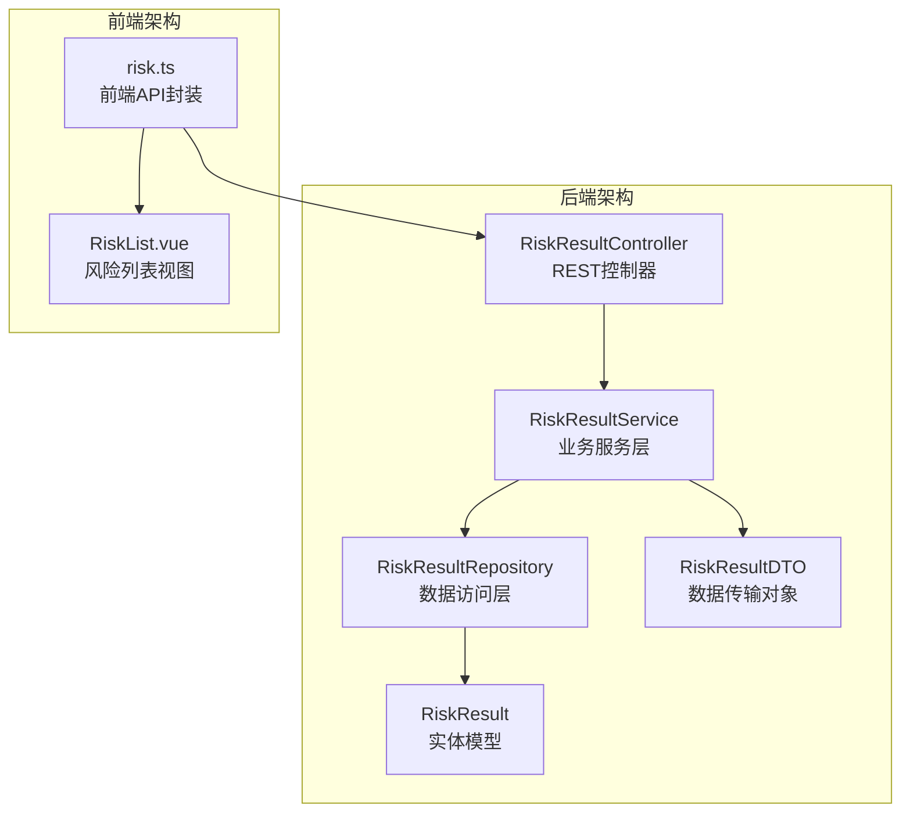
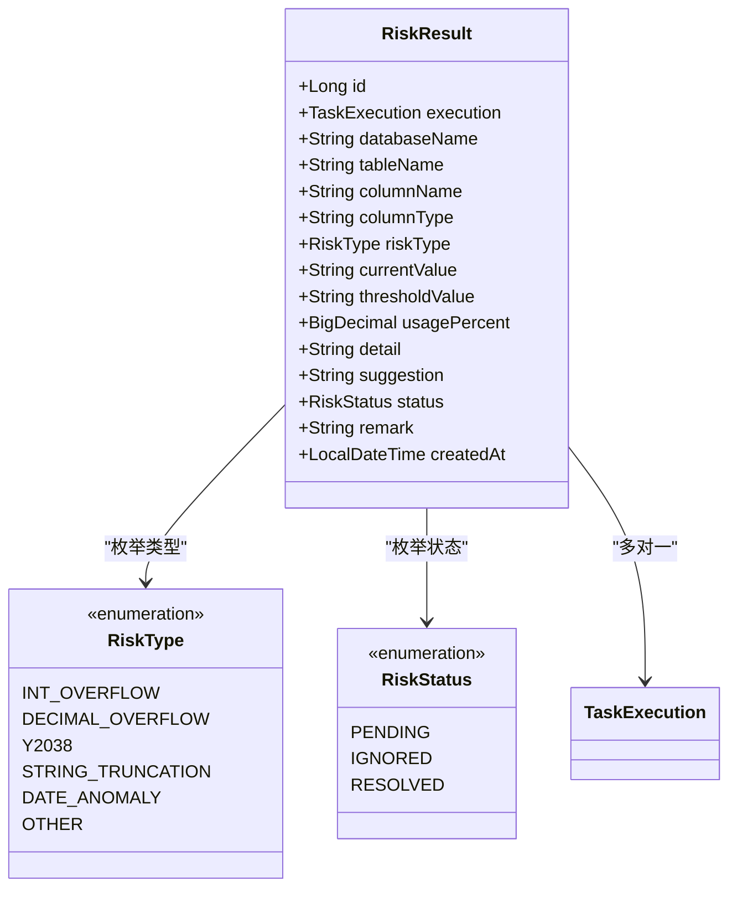
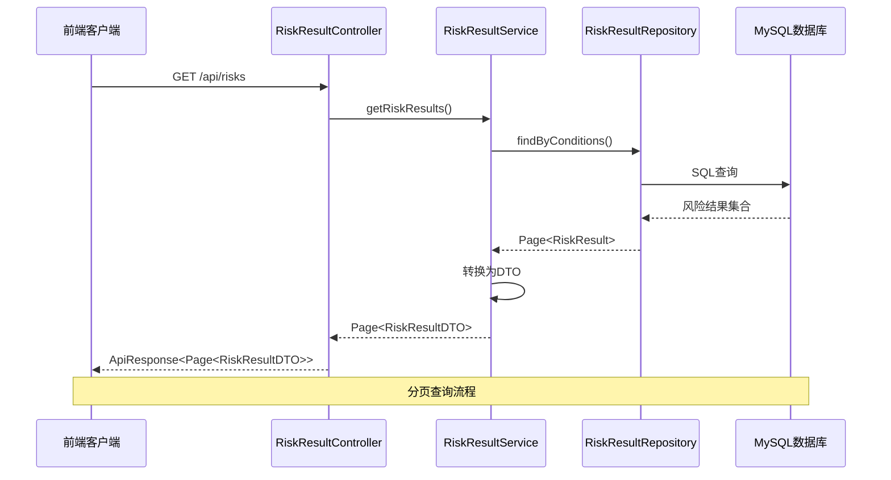
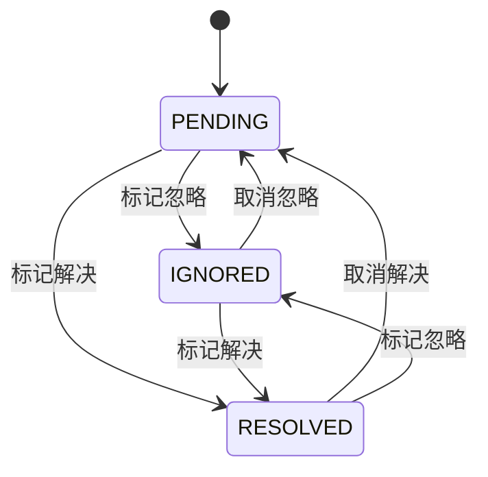
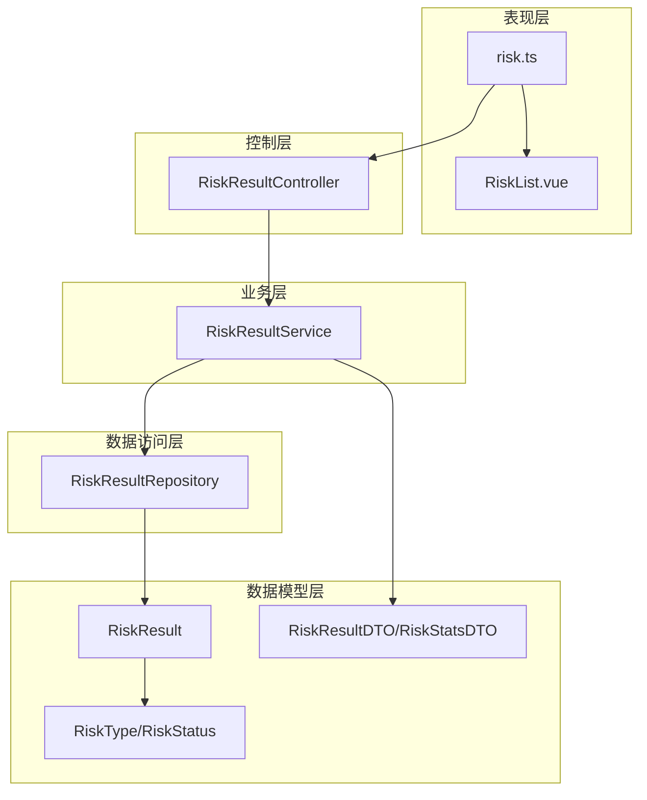

# 风险结果API

<cite>
**本文档引用的文件**
- [RiskResultController.java](file://backend/src/main/java/com/fieldcheck/controller/RiskResultController.java)
- [RiskResultService.java](file://backend/src/main/java/com/fieldcheck/service/RiskResultService.java)
- [RiskResultRepository.java](file://backend/src/main/java/com/fieldcheck/repository/RiskResultRepository.java)
- [RiskResult.java](file://backend/src/main/java/com/fieldcheck/entity/RiskResult.java)
- [RiskResultDTO.java](file://backend/src/main/java/com/fieldcheck/dto/RiskResultDTO.java)
- [RiskType.java](file://backend/src/main/java/com/fieldcheck/entity/RiskType.java)
- [RiskStatus.java](file://backend/src/main/java/com/fieldcheck/entity/RiskStatus.java)
- [RiskStatsDTO.java](file://backend/src/main/java/com/fieldcheck/dto/RiskStatsDTO.java)
- [risk.ts](file://frontend/src/api/risk.ts)
- [RiskList.vue](file://frontend/src/views/risk/RiskList.vue)
- [application.yml](file://backend/src/main/resources/application.yml)
- [01_init_schema.sql](file://mysql/init/01_init_schema.sql)
</cite>

## 目录
1. [简介](#简介)
2. [项目结构](#项目结构)
3. [核心组件](#核心组件)
4. [架构概览](#架构概览)
5. [详细组件分析](#详细组件分析)
6. [依赖关系分析](#依赖关系分析)
7. [性能考虑](#性能考虑)
8. [故障排除指南](#故障排除指南)
9. [结论](#结论)

## 简介

风险结果API是MySQL字段容量风险检查平台的核心功能模块，负责管理数据库、表、字段层面的风险检测结果。该API提供了完整的风险结果查询、筛选、统计和导出功能，支持按数据库、表、字段维度进行风险查询，并实现了风险状态管理和处理流程。

系统采用Spring Boot + Vue.js的前后端分离架构，后端使用JPA进行数据持久化，前端使用Element Plus进行用户界面展示。风险结果API支持分页查询、排序选项、风险统计报表和Excel导出功能。

## 项目结构

风险结果API位于后端项目的controller层，采用标准的MVC架构模式：

**图表来源**
- [RiskResultController.java](file://backend/src/main/java/com/fieldcheck/controller/RiskResultController.java#L31-L34)
- [RiskResultService.java](file://backend/src/main/java/com/fieldcheck/service/RiskResultService.java#L23-L25)
- [RiskResultRepository.java](file://backend/src/main/java/com/fieldcheck/repository/RiskResultRepository.java#L17-L17)

**章节来源**
- [RiskResultController.java](file://backend/src/main/java/com/fieldcheck/controller/RiskResultController.java#L1-L146)
- [application.yml](file://backend/src/main/resources/application.yml#L1-L75)

## 核心组件

### 风险结果实体模型

风险结果实体模型定义了风险检测的核心数据结构：

**图表来源**
- [RiskResult.java](file://backend/src/main/java/com/fieldcheck/entity/RiskResult.java#L23-L67)
- [RiskType.java](file://backend/src/main/java/com/fieldcheck/entity/RiskType.java#L3-L10)
- [RiskStatus.java](file://backend/src/main/java/com/fieldcheck/entity/RiskStatus.java#L3-L7)

### 数据传输对象

风险结果DTO提供了前后端交互的数据结构：

| 字段名 | 类型 | 描述 | 必填 |
|--------|------|------|------|
| id | Long | 风险结果ID | 是 |
| executionId | Long | 执行记录ID | 是 |
| databaseName | String | 数据库名称 | 是 |
| tableName | String | 表名 | 是 |
| columnName | String | 字段名 | 是 |
| columnType | String | 字段类型 | 否 |
| riskType | RiskType | 风险类型枚举 | 是 |
| riskTypeDesc | String | 风险类型描述 | 是 |
| currentValue | String | 当前值 | 否 |
| thresholdValue | String | 阈值 | 否 |
| usagePercent | BigDecimal | 使用率百分比 | 否 |
| detail | String | 风险详情 | 否 |
| suggestion | String | 处理建议 | 否 |
| status | RiskStatus | 风险状态 | 是 |
| remark | String | 备注 | 否 |
| createdAt | LocalDateTime | 创建时间 | 是 |

**章节来源**
- [RiskResultDTO.java](file://backend/src/main/java/com/fieldcheck/dto/RiskResultDTO.java#L17-L34)

## 架构概览

风险结果API采用分层架构设计，确保关注点分离和代码可维护性：

**图表来源**
- [RiskResultController.java](file://backend/src/main/java/com/fieldcheck/controller/RiskResultController.java#L38-L52)
- [RiskResultService.java](file://backend/src/main/java/com/fieldcheck/service/RiskResultService.java#L27-L30)
- [RiskResultRepository.java](file://backend/src/main/java/com/fieldcheck/repository/RiskResultRepository.java#L27-L38)

**章节来源**
- [RiskResultController.java](file://backend/src/main/java/com/fieldcheck/controller/RiskResultController.java#L31-L72)
- [RiskResultService.java](file://backend/src/main/java/com/fieldcheck/service/RiskResultService.java#L20-L50)

## 详细组件分析

### API接口定义

#### 风险结果列表查询

**HTTP方法**: GET  
**路径**: `/api/risks`  
**功能**: 查询风险结果列表，支持多种筛选条件和分页

**请求参数**:

| 参数名 | 类型 | 必填 | 默认值 | 描述 |
|--------|------|------|--------|------|
| executionId | Long | 否 | 无 | 执行记录ID |
| databaseName | String | 否 | 无 | 数据库名称（模糊匹配） |
| tableName | String | 否 | 无 | 表名（模糊匹配） |
| riskType | RiskType | 否 | 无 | 风险类型枚举 |
| status | RiskStatus | 否 | 无 | 风险状态枚举 |
| page | Integer | 否 | 0 | 页码（从0开始） |
| size | Integer | 否 | 20 | 每页大小 |

**响应数据结构**:
- 返回分页的RiskResultDTO列表
- 支持按创建时间降序排列

**章节来源**
- [RiskResultController.java](file://backend/src/main/java/com/fieldcheck/controller/RiskResultController.java#L38-L52)
- [RiskResultService.java](file://backend/src/main/java/com/fieldcheck/service/RiskResultService.java#L27-L30)

#### 风险结果详情获取

**HTTP方法**: GET  
**路径**: `/api/risks/{id}`  
**功能**: 获取指定ID的风险结果详情

**路径参数**:
- id: 风险结果ID（Long类型）

**响应数据结构**:
- 返回单个RiskResultDTO对象

**章节来源**
- [RiskResultController.java](file://backend/src/main/java/com/fieldcheck/controller/RiskResultController.java#L54-L58)
- [RiskResultService.java](file://backend/src/main/java/com/fieldcheck/service/RiskResultService.java#L37-L40)

#### 风险统计报表

**HTTP方法**: GET  
**路径**: `/api/risks/stats`  
**功能**: 获取风险统计报表数据

**响应数据结构**:

| 字段名 | 类型 | 描述 |
|--------|------|------|
| totalRisks | Long | 风险总数 |
| pendingRisks | Long | 待处理风险数 |
| ignoredRisks | Long | 已忽略风险数 |
| resolvedRisks | Long | 已解决风险数 |
| risksByType | Map<String, Long> | 按风险类型分类的数量统计 |
| riskTrend | List<TrendItem> | 风险趋势数据 |

**TrendItem结构**:
- date: String - 日期字符串
- count: Long - 当日风险数量

**章节来源**
- [RiskResultController.java](file://backend/src/main/java/com/fieldcheck/controller/RiskResultController.java#L60-L63)
- [RiskResultService.java](file://backend/src/main/java/com/fieldcheck/service/RiskResultService.java#L52-L90)
- [RiskStatsDTO.java](file://backend/src/main/java/com/fieldcheck/dto/RiskStatsDTO.java#L15-L31)

#### 风险状态更新

**HTTP方法**: PUT  
**路径**: `/api/risks/{id}/status`  
**功能**: 更新风险结果状态

**权限要求**: ADMIN或USER角色

**请求体参数**:

| 参数名 | 类型 | 必填 | 描述 |
|--------|------|------|------|
| status | RiskStatus | 是 | 新的风险状态 |
| remark | String | 否 | 处理备注 |

**响应数据结构**:
- 返回更新后的RiskResultDTO对象

**章节来源**
- [RiskResultController.java](file://backend/src/main/java/com/fieldcheck/controller/RiskResultController.java#L65-L72)
- [RiskResultService.java](file://backend/src/main/java/com/fieldcheck/service/RiskResultService.java#L42-L50)

#### 风险结果导出

**HTTP方法**: GET  
**路径**: `/api/risks/export`  
**功能**: 导出风险结果到Excel文件

**请求参数**:
- 与风险列表查询相同的筛选参数

**响应**: 
- 返回Excel文件流（application/vnd.openxmlformats-officedocument.spreadsheetml.sheet）
- 文件名为"风险结果_YYYYMMDD_HHmmss.xlsx"

**导出字段**:
1. ID
2. 执行记录ID
3. 任务名称
4. 数据库
5. 表名
6. 字段名
7. 风险类型
8. 字段类型
9. 当前值
10. 最大值
11. 使用率(%)
12. 风险描述
13. 状态
14. 备注
15. 创建时间

**章节来源**
- [RiskResultController.java](file://backend/src/main/java/com/fieldcheck/controller/RiskResultController.java#L80-L144)

### 风险类型分类

系统支持以下五种风险类型：

| 风险类型枚举 | 中文描述 | 英文描述 |
|-------------|----------|----------|
| INT_OVERFLOW | 整型溢出 | Integer Overflow |
| DECIMAL_OVERFLOW | 小数类型溢出 | Decimal Overflow |
| Y2038 | Y2038问题 | Year 2038 Problem |
| STRING_TRUNCATION | 字符串截断 | String Truncation |
| DATE_ANOMALY | 日期异常 | Date Anomaly |
| OTHER | 其他风险 | Other Risks |

### 风险状态管理

风险状态管理采用三状态模型：

**状态含义**:
- PENDING: 待处理 - 风险被发现但尚未处理
- IGNORED: 已忽略 - 确认为非风险或暂时不处理
- RESOLVED: 已解决 - 风险已被修复或处理完成

**章节来源**
- [RiskStatus.java](file://backend/src/main/java/com/fieldcheck/entity/RiskStatus.java#L3-L7)

### 数据库索引优化

风险结果表建立了以下关键索引以支持高效查询：

| 索引名称 | 列名 | 类型 | 描述 |
|----------|------|------|------|
| idx_execution_id | execution_id | 普通索引 | 支持按执行记录查询 |
| idx_risk_type | risk_type | 普通索引 | 支持按风险类型查询 |
| idx_status | status | 普通索引 | 支持按状态查询 |

**章节来源**
- [RiskResult.java](file://backend/src/main/java/com/fieldcheck/entity/RiskResult.java#L17-L21)
- [01_init_schema.sql](file://mysql/init/01_init_schema.sql#L106-L109)

## 依赖关系分析

风险结果API的依赖关系体现了清晰的分层架构：

**图表来源**
- [RiskResultController.java](file://backend/src/main/java/com/fieldcheck/controller/RiskResultController.java#L31-L36)
- [RiskResultService.java](file://backend/src/main/java/com/fieldcheck/service/RiskResultService.java#L23-L25)
- [RiskResultRepository.java](file://backend/src/main/java/com/fieldcheck/repository/RiskResultRepository.java#L17-L17)

**章节来源**
- [RiskResultController.java](file://backend/src/main/java/com/fieldcheck/controller/RiskResultController.java#L1-L146)
- [RiskResultService.java](file://backend/src/main/java/com/fieldcheck/service/RiskResultService.java#L1-L124)

## 性能考虑

### 查询优化策略

1. **分页查询**: 默认每页20条记录，支持自定义页码和大小
2. **索引优化**: 风险结果表建立关键索引支持高频查询
3. **懒加载**: 执行记录关联使用LAZY加载避免不必要的数据加载
4. **批量查询**: 统计功能使用原生SQL查询提升性能

### 缓存策略

系统未实现专门的缓存机制，但可以通过以下方式优化：
- 对频繁访问的统计数据进行内存缓存
- 实现查询结果的短期缓存
- 优化复杂统计查询的执行计划

### 并发处理

- 风险状态更新使用事务保证数据一致性
- 导出功能使用流式处理避免内存溢出
- 支持高并发的读取操作

## 故障排除指南

### 常见错误及解决方案

**1. 风险结果不存在**
- 错误信息: "风险结果不存在"
- 解决方案: 检查风险结果ID是否正确，确认数据是否已删除

**2. 导出失败**
- 错误信息: "导出失败: [具体错误]"
- 解决方案: 检查Excel依赖库是否正确配置，确认磁盘空间充足

**3. 权限不足**
- 错误信息: 访问被拒绝
- 解决方案: 确认用户具有ADMIN或USER角色

**4. 查询超时**
- 解决方案: 优化查询条件，减少模糊匹配的使用，合理设置分页参数

### 调试建议

1. **启用SQL日志**: 在application.yml中设置`show-sql: true`
2. **监控数据库连接**: 检查Hikari连接池配置
3. **查看应用日志**: 关注风险API相关的日志输出

**章节来源**
- [RiskResultService.java](file://backend/src/main/java/com/fieldcheck/service/RiskResultService.java#L37-L40)
- [RiskResultController.java](file://backend/src/main/java/com/fieldcheck/controller/RiskResultController.java#L141-L143)

## 结论

风险结果API提供了完整的企业级风险检测结果管理功能，具有以下特点：

1. **功能完整性**: 支持风险结果的查询、筛选、统计、导出和状态管理
2. **性能优化**: 采用分页查询、索引优化和懒加载等技术手段
3. **用户体验**: 提供直观的前端界面和丰富的筛选选项
4. **扩展性强**: 清晰的分层架构便于功能扩展和维护

该API能够有效帮助数据库管理员和开发人员及时发现和处理MySQL数据库中的字段容量风险，保障数据库系统的稳定运行。