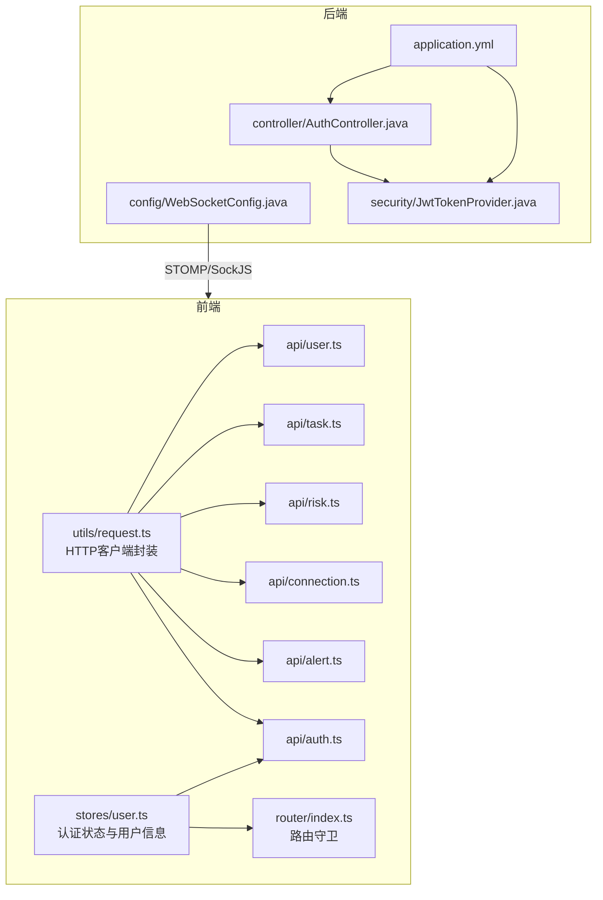
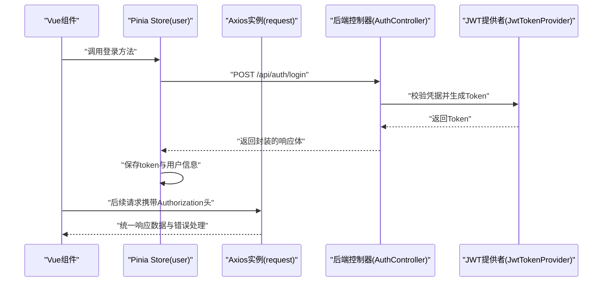
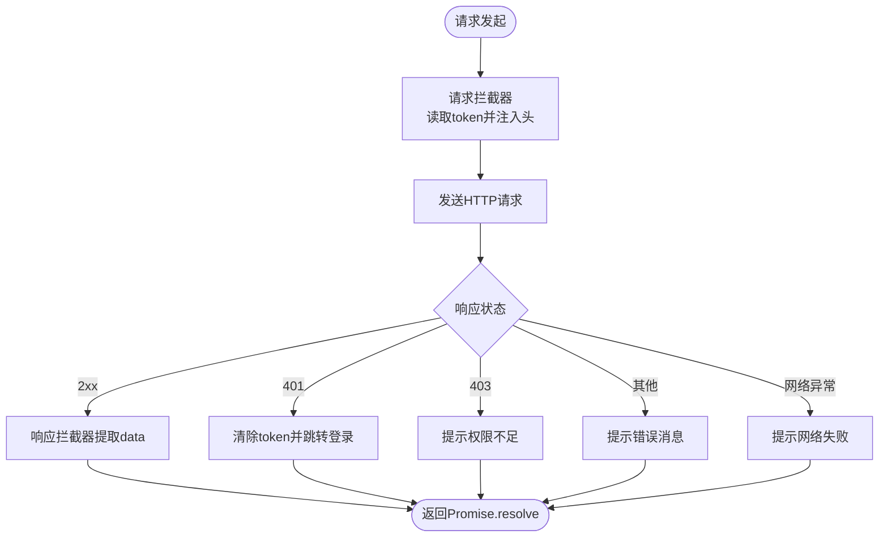
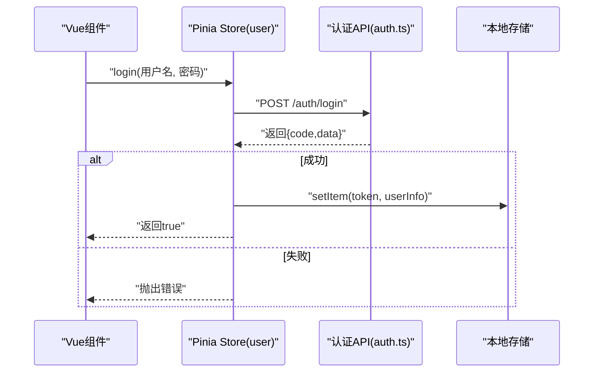
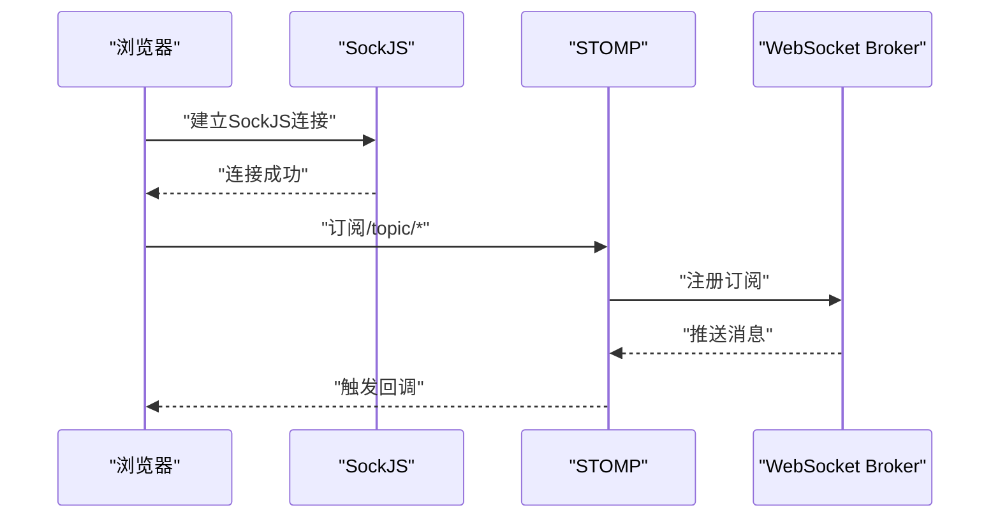
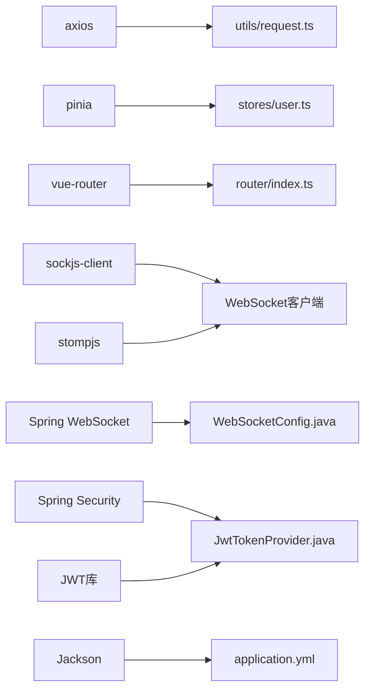

# API集成层

<cite>
**本文引用的文件**
- [frontend/src/utils/request.ts](file://frontend/src/utils/request.ts)
- [frontend/src/stores/user.ts](file://frontend/src/stores/user.ts)
- [frontend/src/api/auth.ts](file://frontend/src/api/auth.ts)
- [frontend/src/api/alert.ts](file://frontend/src/api/alert.ts)
- [frontend/src/api/connection.ts](file://frontend/src/api/connection.ts)
- [frontend/src/api/risk.ts](file://frontend/src/api/risk.ts)
- [frontend/src/api/task.ts](file://frontend/src/api/task.ts)
- [frontend/src/api/user.ts](file://frontend/src/api/user.ts)
- [frontend/src/router/index.ts](file://frontend/src/router/index.ts)
- [backend/src/main/java/com/fieldcheck/config/WebSocketConfig.java](file://backend/src/main/java/com/fieldcheck/config/WebSocketConfig.java)
- [backend/src/main/java/com/fieldcheck/security/JwtTokenProvider.java](file://backend/src/main/java/com/fieldcheck/security/JwtTokenProvider.java)
- [backend/src/main/java/com/fieldcheck/controller/AuthController.java](file://backend/src/main/java/com/fieldcheck/controller/AuthController.java)
- [backend/src/main/resources/application.yml](file://backend/src/main/resources/application.yml)
- [frontend/package.json](file://frontend/package.json)
</cite>

## 目录
1. [简介](#简介)
2. [项目结构](#项目结构)
3. [核心组件](#核心组件)
4. [架构总览](#架构总览)
5. [详细组件分析](#详细组件分析)
6. [依赖分析](#依赖分析)
7. [性能考虑](#性能考虑)
8. [故障排查指南](#故障排查指南)
9. [结论](#结论)
10. [附录](#附录)

## 简介
本文件聚焦于前端API集成层的设计与实现，系统性梳理HTTP客户端封装、请求/响应拦截器、认证状态与Token管理、API模块化与接口规范、错误处理与异常捕获、请求重试与超时控制、WebSocket连接与实时数据处理、最佳实践与性能优化、以及数据格式转换与类型安全等主题。文档同时结合后端JWT配置与WebSocket配置，给出前后端协同的完整视图。

## 项目结构
前端采用模块化的API分层：通用HTTP客户端封装在工具层，业务API以功能域划分在独立模块中，状态管理通过Pinia Store集中维护，路由守卫基于认证状态进行导航控制。

图表来源
- [frontend/src/utils/request.ts](file://frontend/src/utils/request.ts#L1-L47)
- [frontend/src/stores/user.ts](file://frontend/src/stores/user.ts#L1-L60)
- [frontend/src/router/index.ts](file://frontend/src/router/index.ts#L1-L116)
- [frontend/src/api/auth.ts](file://frontend/src/api/auth.ts#L1-L27)
- [frontend/src/api/alert.ts](file://frontend/src/api/alert.ts#L1-L28)
- [frontend/src/api/connection.ts](file://frontend/src/api/connection.ts#L1-L37)
- [frontend/src/api/risk.ts](file://frontend/src/api/risk.ts#L1-L71)
- [frontend/src/api/task.ts](file://frontend/src/api/task.ts#L1-L88)
- [frontend/src/api/user.ts](file://frontend/src/api/user.ts#L1-L32)
- [backend/src/main/java/com/fieldcheck/controller/AuthController.java](file://backend/src/main/java/com/fieldcheck/controller/AuthController.java#L1-L56)
- [backend/src/main/java/com/fieldcheck/config/WebSocketConfig.java](file://backend/src/main/java/com/fieldcheck/config/WebSocketConfig.java#L1-L26)
- [backend/src/main/java/com/fieldcheck/security/JwtTokenProvider.java](file://backend/src/main/java/com/fieldcheck/security/JwtTokenProvider.java#L1-L95)
- [backend/src/main/resources/application.yml](file://backend/src/main/resources/application.yml#L1-L75)

章节来源
- [frontend/src/utils/request.ts](file://frontend/src/utils/request.ts#L1-L47)
- [frontend/src/stores/user.ts](file://frontend/src/stores/user.ts#L1-L60)
- [frontend/src/router/index.ts](file://frontend/src/router/index.ts#L1-L116)
- [frontend/src/api/auth.ts](file://frontend/src/api/auth.ts#L1-L27)
- [frontend/src/api/alert.ts](file://frontend/src/api/alert.ts#L1-L28)
- [frontend/src/api/connection.ts](file://frontend/src/api/connection.ts#L1-L37)
- [frontend/src/api/risk.ts](file://frontend/src/api/risk.ts#L1-L71)
- [frontend/src/api/task.ts](file://frontend/src/api/task.ts#L1-L88)
- [frontend/src/api/user.ts](file://frontend/src/api/user.ts#L1-L32)
- [backend/src/main/java/com/fieldcheck/controller/AuthController.java](file://backend/src/main/java/com/fieldcheck/controller/AuthController.java#L1-L56)
- [backend/src/main/java/com/fieldcheck/config/WebSocketConfig.java](file://backend/src/main/java/com/fieldcheck/config/WebSocketConfig.java#L1-L26)
- [backend/src/main/java/com/fieldcheck/security/JwtTokenProvider.java](file://backend/src/main/java/com/fieldcheck/security/JwtTokenProvider.java#L1-L95)
- [backend/src/main/resources/application.yml](file://backend/src/main/resources/application.yml#L1-L75)

## 核心组件
- HTTP客户端封装与拦截器
  - 基础URL与超时设置
  - 请求拦截器自动注入Authorization头
  - 响应拦截器统一提取data并处理401/403/其他错误
- 认证状态与Token管理
  - Pinia Store集中存储token与用户信息
  - 登录成功写入localStorage，退出清理
  - 路由守卫基于认证状态控制访问
- API模块化与接口定义
  - 按领域拆分API模块（认证、告警、连接、风险、任务、用户）
  - 统一返回结构与类型声明
- 错误处理与异常捕获
  - 前端：按状态码分类提示；401跳转登录
  - 后端：控制器层统一返回包装对象
- WebSocket连接与实时数据
  - 后端启用STOMP消息代理与SockJS回退
  - 前端依赖sockjs-client与stompjs
- 性能与可靠性
  - 超时控制
  - 可扩展的重试策略（建议）
  - 数据格式与类型安全

章节来源
- [frontend/src/utils/request.ts](file://frontend/src/utils/request.ts#L1-L47)
- [frontend/src/stores/user.ts](file://frontend/src/stores/user.ts#L1-L60)
- [frontend/src/router/index.ts](file://frontend/src/router/index.ts#L102-L113)
- [frontend/src/api/auth.ts](file://frontend/src/api/auth.ts#L1-L27)
- [frontend/src/api/alert.ts](file://frontend/src/api/alert.ts#L1-L28)
- [frontend/src/api/connection.ts](file://frontend/src/api/connection.ts#L1-L37)
- [frontend/src/api/risk.ts](file://frontend/src/api/risk.ts#L1-L71)
- [frontend/src/api/task.ts](file://frontend/src/api/task.ts#L1-L88)
- [frontend/src/api/user.ts](file://frontend/src/api/user.ts#L1-L32)
- [backend/src/main/java/com/fieldcheck/config/WebSocketConfig.java](file://backend/src/main/java/com/fieldcheck/config/WebSocketConfig.java#L1-L26)
- [frontend/package.json](file://frontend/package.json#L11-L20)

## 架构总览
从前端到后端的典型交互流程如下：

图表来源
- [frontend/src/stores/user.ts](file://frontend/src/stores/user.ts#L28-L41)
- [frontend/src/utils/request.ts](file://frontend/src/utils/request.ts#L10-L21)
- [frontend/src/api/auth.ts](file://frontend/src/api/auth.ts#L16-L18)
- [backend/src/main/java/com/fieldcheck/controller/AuthController.java](file://backend/src/main/java/com/fieldcheck/controller/AuthController.java#L25-L36)
- [backend/src/main/java/com/fieldcheck/security/JwtTokenProvider.java](file://backend/src/main/java/com/fieldcheck/security/JwtTokenProvider.java#L32-L54)

## 详细组件分析

### HTTP客户端封装与拦截器
- 配置要点
  - 基础URL指向后端统一前缀
  - 超时时间统一设置
- 请求拦截器
  - 从本地存储读取token并注入Authorization头
- 响应拦截器
  - 成功时返回标准化数据体
  - 失败时根据状态码分支处理：
    - 401：清除token并跳转登录页
    - 403：权限不足提示
    - 其他：显示服务端消息或默认失败提示
  - 网络异常统一提示

图表来源
- [frontend/src/utils/request.ts](file://frontend/src/utils/request.ts#L4-L44)

章节来源
- [frontend/src/utils/request.ts](file://frontend/src/utils/request.ts#L1-L47)

### 认证状态管理与Token处理
- Store职责
  - 维护token与用户信息
  - 提供登录、登出、设置token与用户信息的方法
  - 登录成功后持久化到localStorage
- 登录流程
  - 调用认证API获取响应
  - 校验返回码，成功则写入token与用户信息
  - 失败抛出错误交由调用方处理
- 路由守卫
  - 未登录访问受保护路由跳转登录
  - 已登录访问登录页跳转仪表盘

图表来源
- [frontend/src/stores/user.ts](file://frontend/src/stores/user.ts#L28-L41)
- [frontend/src/api/auth.ts](file://frontend/src/api/auth.ts#L16-L18)

章节来源
- [frontend/src/stores/user.ts](file://frontend/src/stores/user.ts#L1-L60)
- [frontend/src/router/index.ts](file://frontend/src/router/index.ts#L102-L113)
- [frontend/src/api/auth.ts](file://frontend/src/api/auth.ts#L1-L27)

### API模块化设计与接口定义规范
- 模块划分
  - 认证：登录、登出、当前用户
  - 告警：列表、详情、创建、更新、删除、测试
  - 连接：列表、详情、创建、更新、删除、测试
  - 风险：列表、详情、统计、状态更新、导出
  - 任务：CRUD、运行/停止、执行记录、进度、日志
  - 用户：CRUD、重置密码、当前用户
- 规范
  - 所有模块均通过统一的HTTP客户端发起请求
  - 返回值采用统一的响应结构（由后端控制器与前端拦截器共同保证）
  - 类型声明集中在各模块文件内，确保调用侧类型安全

章节来源
- [frontend/src/api/auth.ts](file://frontend/src/api/auth.ts#L1-L27)
- [frontend/src/api/alert.ts](file://frontend/src/api/alert.ts#L1-L28)
- [frontend/src/api/connection.ts](file://frontend/src/api/connection.ts#L1-L37)
- [frontend/src/api/risk.ts](file://frontend/src/api/risk.ts#L1-L71)
- [frontend/src/api/task.ts](file://frontend/src/api/task.ts#L1-L88)
- [frontend/src/api/user.ts](file://frontend/src/api/user.ts#L1-L32)

### 错误处理与异常捕获策略
- 前端
  - 401：自动清理token并跳转登录
  - 403：权限不足提示
  - 其他HTTP错误：展示服务端消息或默认失败提示
  - 网络异常：提示网络连接失败
- 后端
  - 控制器层统一返回包装对象，便于前端一致处理
  - 登录失败记录审计日志并返回标准错误响应

章节来源
- [frontend/src/utils/request.ts](file://frontend/src/utils/request.ts#L23-L44)
- [backend/src/main/java/com/fieldcheck/controller/AuthController.java](file://backend/src/main/java/com/fieldcheck/controller/AuthController.java#L25-L36)

### 请求重试与超时控制机制
- 超时控制
  - 客户端已设置统一超时时间
- 重试机制
  - 当前未实现自动重试
  - 建议：对幂等GET请求可引入指数退避重试；对非幂等请求谨慎重试
  - 可通过在拦截器中增加策略或在调用侧封装增强

章节来源
- [frontend/src/utils/request.ts](file://frontend/src/utils/request.ts#L4-L7)

### WebSocket连接与实时数据处理
- 后端配置
  - 启用WebSocket消息代理，配置简单Broker与应用前缀
  - 注册STOMP端点并允许跨域，启用SockJS回退
- 前端依赖
  - 引入sockjs-client与stompjs用于建立与后端的实时通信
- 使用场景
  - 实时推送任务进度、告警通知等

图表来源
- [backend/src/main/java/com/fieldcheck/config/WebSocketConfig.java](file://backend/src/main/java/com/fieldcheck/config/WebSocketConfig.java#L13-L24)
- [frontend/package.json](file://frontend/package.json#L17-L18)

章节来源
- [backend/src/main/java/com/fieldcheck/config/WebSocketConfig.java](file://backend/src/main/java/com/fieldcheck/config/WebSocketConfig.java#L1-L26)
- [frontend/package.json](file://frontend/package.json#L1-L33)

### 数据格式转换与类型安全
- 类型声明
  - 各API模块定义了对应的接口类型（如风险、任务、连接等），确保调用侧类型安全
- 响应解包
  - 响应拦截器统一返回data字段，避免调用侧重复解包
- 时间与日期
  - 后端Jackson配置统一日期格式与时区，前端保持一致展示

章节来源
- [frontend/src/api/risk.ts](file://frontend/src/api/risk.ts#L3-L29)
- [frontend/src/api/task.ts](file://frontend/src/api/task.ts#L3-L36)
- [frontend/src/api/connection.ts](file://frontend/src/api/connection.ts#L3-L12)
- [backend/src/main/resources/application.yml](file://backend/src/main/resources/application.yml#L51-L53)

## 依赖分析
- 前端依赖
  - axios：HTTP客户端
  - pinia：状态管理
  - vue-router：路由与导航守卫
  - sockjs-client、stompjs：WebSocket客户端
- 后端依赖
  - Spring WebSocket、Spring Security、JWT库：认证与消息代理
  - Jackson：JSON序列化与日期格式化

图表来源
- [frontend/package.json](file://frontend/package.json#L11-L20)
- [frontend/src/utils/request.ts](file://frontend/src/utils/request.ts#L1-L7)
- [frontend/src/stores/user.ts](file://frontend/src/stores/user.ts#L1-L3)
- [frontend/src/router/index.ts](file://frontend/src/router/index.ts#L1-L3)
- [backend/src/main/java/com/fieldcheck/config/WebSocketConfig.java](file://backend/src/main/java/com/fieldcheck/config/WebSocketConfig.java#L1-L26)
- [backend/src/main/java/com/fieldcheck/security/JwtTokenProvider.java](file://backend/src/main/java/com/fieldcheck/security/JwtTokenProvider.java#L1-L15)
- [backend/src/main/resources/application.yml](file://backend/src/main/resources/application.yml#L51-L53)

章节来源
- [frontend/package.json](file://frontend/package.json#L1-L33)
- [backend/src/main/resources/application.yml](file://backend/src/main/resources/application.yml#L1-L75)

## 性能考虑
- 超时与并发
  - 统一超时设置避免请求悬挂
  - 合理控制并发请求数，避免阻塞UI线程
- 缓存与去抖
  - 对频繁查询的列表接口可引入内存缓存与去抖策略
- 传输优化
  - 后端统一日期格式与时区，减少前端格式化开销
- WebSocket
  - 仅订阅必要主题，避免广播风暴
- 重试策略
  - 对瞬时性错误引入指数退避重试，避免雪崩效应

## 故障排查指南
- 登录后仍被重定向到登录页
  - 检查store是否正确写入token与用户信息
  - 确认路由守卫逻辑与meta.requiresAuth配置
- 401错误频繁出现
  - 检查token是否过期或被清理
  - 确认请求头Authorization是否正确注入
- WebSocket无法连接
  - 检查后端WebSocket端点与跨域配置
  - 确认前端sockjs-client与stompjs版本兼容
- 导出/下载链接无效
  - 确认后端实际路径与前端拼接逻辑一致

章节来源
- [frontend/src/stores/user.ts](file://frontend/src/stores/user.ts#L18-L26)
- [frontend/src/router/index.ts](file://frontend/src/router/index.ts#L102-L113)
- [frontend/src/utils/request.ts](file://frontend/src/utils/request.ts#L10-L21)
- [backend/src/main/java/com/fieldcheck/config/WebSocketConfig.java](file://backend/src/main/java/com/fieldcheck/config/WebSocketConfig.java#L19-L24)

## 结论
该API集成层通过统一的HTTP客户端封装、完善的拦截器与错误处理、清晰的认证状态管理、模块化的业务API与强类型声明，构建了稳定可靠的前端数据通路。配合后端的JWT认证与WebSocket消息代理，实现了认证、业务数据与实时通知的完整闭环。建议后续引入请求重试与更细粒度的缓存策略，持续提升用户体验与系统韧性。

## 附录
- JWT配置要点
  - 密钥与过期时间在配置文件中集中管理
  - Token签发与校验在提供者类中实现
- 后端控制器
  - 统一返回包装对象，简化前端处理
- 前端依赖清单
  - 关键依赖已在前端package.json中声明

章节来源
- [backend/src/main/resources/application.yml](file://backend/src/main/resources/application.yml#L55-L62)
- [backend/src/main/java/com/fieldcheck/security/JwtTokenProvider.java](file://backend/src/main/java/com/fieldcheck/security/JwtTokenProvider.java#L19-L23)
- [backend/src/main/java/com/fieldcheck/controller/AuthController.java](file://backend/src/main/java/com/fieldcheck/controller/AuthController.java#L25-L36)
- [frontend/package.json](file://frontend/package.json#L11-L20)