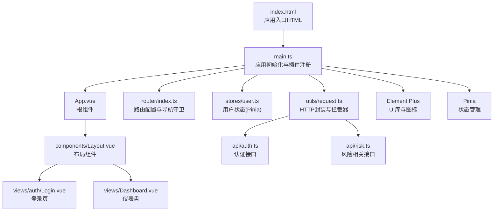
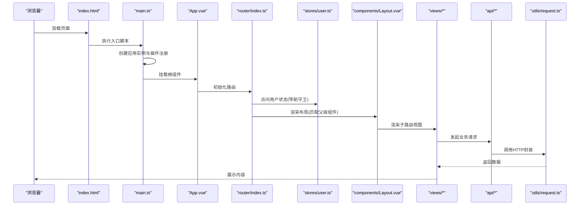
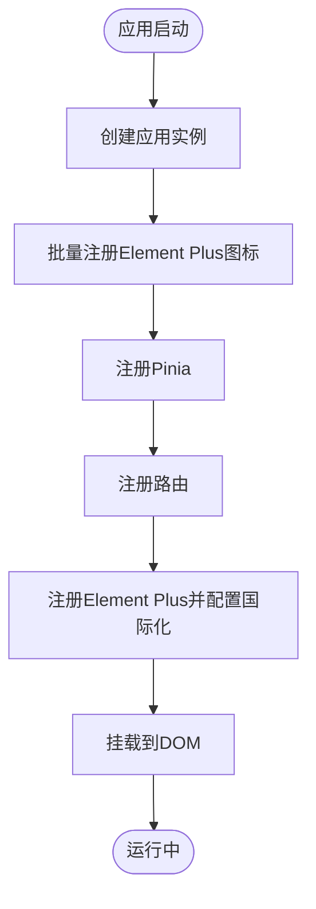
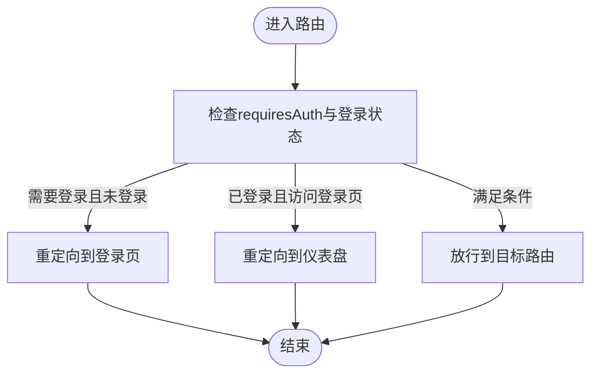
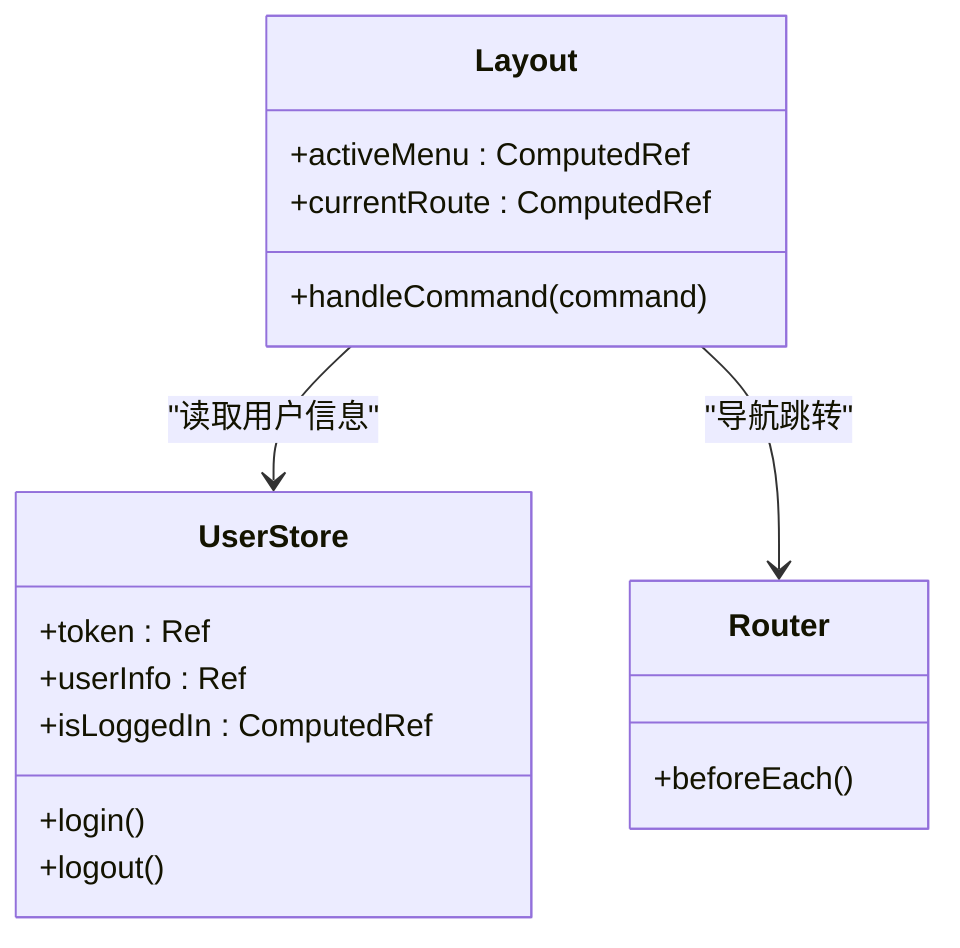
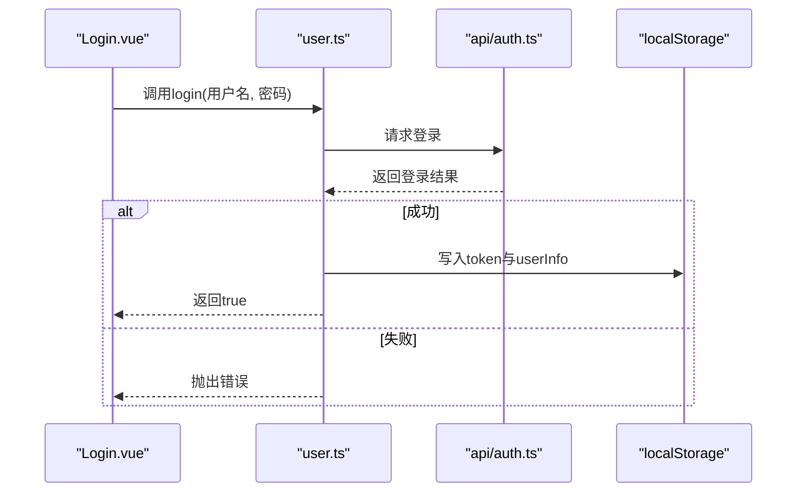
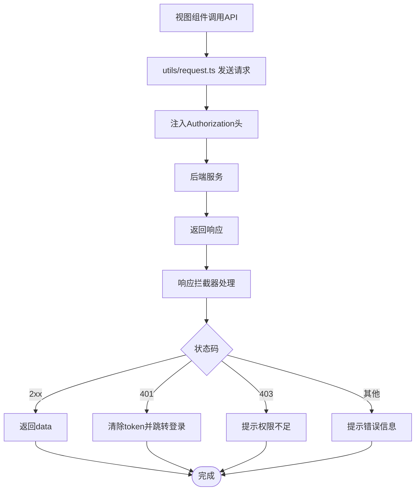
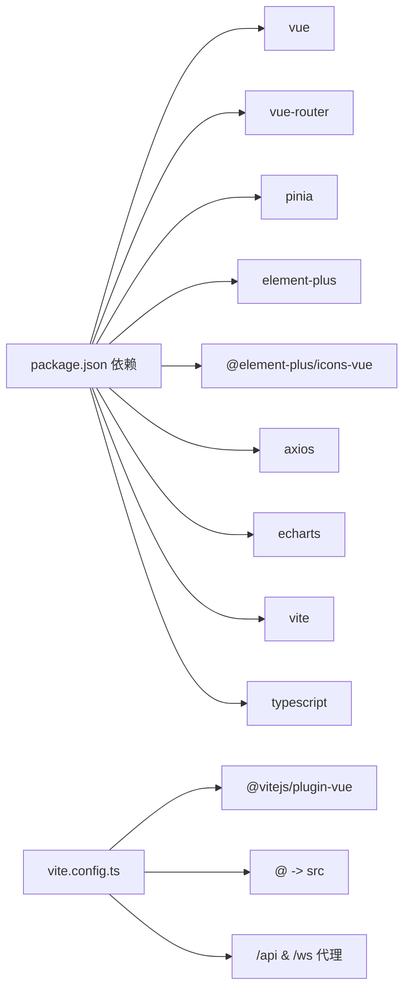

# Vue.js应用结构

<cite>
**本文引用的文件**
- [frontend/src/main.ts](file://frontend/src/main.ts)
- [frontend/src/App.vue](file://frontend/src/App.vue)
- [frontend/src/router/index.ts](file://frontend/src/router/index.ts)
- [frontend/src/stores/user.ts](file://frontend/src/stores/user.ts)
- [frontend/src/components/Layout.vue](file://frontend/src/components/Layout.vue)
- [frontend/src/views/auth/Login.vue](file://frontend/src/views/auth/Login.vue)
- [frontend/src/views/Dashboard.vue](file://frontend/src/views/Dashboard.vue)
- [frontend/src/utils/request.ts](file://frontend/src/utils/request.ts)
- [frontend/src/api/auth.ts](file://frontend/src/api/auth.ts)
- [frontend/src/api/risk.ts](file://frontend/src/api/risk.ts)
- [frontend/package.json](file://frontend/package.json)
- [frontend/vite.config.ts](file://frontend/vite.config.ts)
- [frontend/tsconfig.json](file://frontend/tsconfig.json)
- [frontend/tsconfig.app.json](file://frontend/tsconfig.app.json)
- [frontend/src/shims-vue.d.ts](file://frontend/src/shims-vue.d.ts)
- [frontend/index.html](file://frontend/index.html)
</cite>

## 目录
1. [引言](#引言)
2. [项目结构](#项目结构)
3. [核心组件](#核心组件)
4. [架构总览](#架构总览)
5. [详细组件分析](#详细组件分析)
6. [依赖关系分析](#依赖关系分析)
7. [性能考虑](#性能考虑)
8. [故障排除指南](#故障排除指南)
9. [结论](#结论)
10. [附录](#附录)

## 引言
本文件系统性梳理该Vue.js 3.x前端应用的结构与实现，重点覆盖以下方面：
- 应用实例创建、插件注册与全局配置
- Element Plus UI框架的集成（图标组件注册与国际化）
- Pinia状态管理的集成与配置
- 组件层次结构与布局组件设计
- TypeScript配置与类型声明文件的作用
- 应用启动流程与最佳实践

## 项目结构
前端采用Vite + Vue 3 + TypeScript + Element Plus + Pinia的现代技术栈。项目根目录位于frontend，核心入口为index.html，应用通过main.ts挂载到DOM节点。路由采用vue-router，状态管理采用Pinia，UI组件基于Element Plus。

图表来源
- [frontend/index.html](file://frontend/index.html#L1-L14)
- [frontend/src/main.ts](file://frontend/src/main.ts#L1-L23)
- [frontend/src/App.vue](file://frontend/src/App.vue#L1-L25)
- [frontend/src/router/index.ts](file://frontend/src/router/index.ts#L1-L116)
- [frontend/src/stores/user.ts](file://frontend/src/stores/user.ts#L1-L60)
- [frontend/src/components/Layout.vue](file://frontend/src/components/Layout.vue#L1-L162)
- [frontend/src/views/auth/Login.vue](file://frontend/src/views/auth/Login.vue#L1-L131)
- [frontend/src/views/Dashboard.vue](file://frontend/src/views/Dashboard.vue#L1-L210)
- [frontend/src/utils/request.ts](file://frontend/src/utils/request.ts#L1-L47)
- [frontend/src/api/auth.ts](file://frontend/src/api/auth.ts#L1-L27)
- [frontend/src/api/risk.ts](file://frontend/src/api/risk.ts#L1-L71)

章节来源
- [frontend/index.html](file://frontend/index.html#L1-L14)
- [frontend/src/main.ts](file://frontend/src/main.ts#L1-L23)
- [frontend/package.json](file://frontend/package.json#L1-L33)

## 核心组件
- 应用入口与初始化：在main.ts中创建Vue应用实例，注册Element Plus、Pinia、路由，并完成图标组件批量注册与国际化配置，最后挂载到DOM。
- 路由与导航守卫：router/index.ts定义了多级路由与导航前置守卫，控制登录态与页面访问权限。
- 布局组件：Layout.vue提供侧边菜单、面包屑、头部下拉等统一布局，配合路由元信息显示标题。
- 状态管理：stores/user.ts使用Pinia组合式API定义用户状态，包含登录、登出、token与用户信息持久化。
- 视图组件：Login.vue负责登录表单校验与调用用户store；Dashboard.vue展示统计卡片与图表。
- HTTP封装：utils/request.ts集中处理基础URL、超时、请求头注入与响应错误处理。
- 类型声明：shims-vue.d.ts允许TypeScript识别.vue模块；tsconfig系列文件提供编译选项与路径别名。

章节来源
- [frontend/src/main.ts](file://frontend/src/main.ts#L1-L23)
- [frontend/src/router/index.ts](file://frontend/src/router/index.ts#L1-L116)
- [frontend/src/stores/user.ts](file://frontend/src/stores/user.ts#L1-L60)
- [frontend/src/components/Layout.vue](file://frontend/src/components/Layout.vue#L1-L162)
- [frontend/src/views/auth/Login.vue](file://frontend/src/views/auth/Login.vue#L1-L131)
- [frontend/src/views/Dashboard.vue](file://frontend/src/views/Dashboard.vue#L1-L210)
- [frontend/src/utils/request.ts](file://frontend/src/utils/request.ts#L1-L47)
- [frontend/src/shims-vue.d.ts](file://frontend/src/shims-vue.d.ts#L1-L6)
- [frontend/tsconfig.app.json](file://frontend/tsconfig.app.json#L1-L21)

## 架构总览
应用采用“入口初始化 → 插件注册 → 路由驱动 → 状态管理 → 视图渲染”的线性流程。Element Plus提供UI能力与国际化，Pinia提供轻量状态管理，axios封装HTTP请求，路由负责页面导航与鉴权。

图表来源
- [frontend/index.html](file://frontend/index.html#L1-L14)
- [frontend/src/main.ts](file://frontend/src/main.ts#L1-L23)
- [frontend/src/App.vue](file://frontend/src/App.vue#L1-L25)
- [frontend/src/router/index.ts](file://frontend/src/router/index.ts#L1-L116)
- [frontend/src/stores/user.ts](file://frontend/src/stores/user.ts#L1-L60)
- [frontend/src/components/Layout.vue](file://frontend/src/components/Layout.vue#L1-L162)
- [frontend/src/views/auth/Login.vue](file://frontend/src/views/auth/Login.vue#L1-L131)
- [frontend/src/views/Dashboard.vue](file://frontend/src/views/Dashboard.vue#L1-L210)
- [frontend/src/utils/request.ts](file://frontend/src/utils/request.ts#L1-L47)
- [frontend/src/api/auth.ts](file://frontend/src/api/auth.ts#L1-L27)
- [frontend/src/api/risk.ts](file://frontend/src/api/risk.ts#L1-L71)

## 详细组件分析

### 应用初始化与插件注册
- 应用实例创建：通过createApp(App)创建应用实例。
- 插件注册顺序：先注册Element Plus（含国际化），再注册Pinia，最后注册路由。
- 图标组件注册：遍历Element Plus图标集合，逐个注册为全局组件，便于在模板中直接使用。
- 国际化配置：设置Element Plus语言为简体中文。
- 挂载：将应用挂载到id为app的DOM节点。

图表来源
- [frontend/src/main.ts](file://frontend/src/main.ts#L1-L23)

章节来源
- [frontend/src/main.ts](file://frontend/src/main.ts#L1-L23)

### 路由与导航守卫
- 路由结构：采用嵌套路由，根路径指向Layout.vue作为容器，内部children定义多个子路由。
- 导航守卫：在router.beforeEach中根据用户登录状态与路由元信息进行跳转控制，未登录访问受保护路由将重定向至登录页，已登录访问/login将重定向至仪表盘。
- 权限控制：部分路由通过meta.roles限制仅管理员可见。

图表来源
- [frontend/src/router/index.ts](file://frontend/src/router/index.ts#L102-L113)

章节来源
- [frontend/src/router/index.ts](file://frontend/src/router/index.ts#L1-L116)

### 布局组件设计
- 结构组成：左侧Aside菜单、顶部Header（面包屑与用户下拉）、主区域Main（router-view）。
- 动态菜单：根据当前路由计算默认激活项；菜单项与路由path绑定，支持router属性直连。
- 权限菜单：用户角色为ADMIN时才显示用户管理和审计日志菜单项。
- 用户操作：下拉菜单触发登出，清空本地存储并跳转登录页。

图表来源
- [frontend/src/components/Layout.vue](file://frontend/src/components/Layout.vue#L85-L103)
- [frontend/src/stores/user.ts](file://frontend/src/stores/user.ts#L1-L60)
- [frontend/src/router/index.ts](file://frontend/src/router/index.ts#L102-L113)

章节来源
- [frontend/src/components/Layout.vue](file://frontend/src/components/Layout.vue#L1-L162)
- [frontend/src/stores/user.ts](file://frontend/src/stores/user.ts#L1-L60)

### 状态管理（Pinia）
- Store定义：使用defineStore与组合式API，定义token、userInfo、isLoggedIn等状态。
- 数据持久化：登录后写入localStorage；登出时清除。
- 异步登录：调用api/auth.ts中的login方法，成功后更新token与用户信息。
- 导航守卫联动：路由守卫读取store判断登录状态。

图表来源
- [frontend/src/views/auth/Login.vue](file://frontend/src/views/auth/Login.vue#L72-L89)
- [frontend/src/stores/user.ts](file://frontend/src/stores/user.ts#L28-L41)
- [frontend/src/api/auth.ts](file://frontend/src/api/auth.ts#L16-L18)

章节来源
- [frontend/src/stores/user.ts](file://frontend/src/stores/user.ts#L1-L60)
- [frontend/src/views/auth/Login.vue](file://frontend/src/views/auth/Login.vue#L1-L131)
- [frontend/src/api/auth.ts](file://frontend/src/api/auth.ts#L1-L27)

### UI框架集成（Element Plus）
- 图标注册：遍历@element-plus/icons-vue导出的所有图标组件，逐个注册为全局组件，模板中可直接使用。
- 国际化：引入zh-cn.mjs并传入ElementPlus插件配置，使组件文案与格式化符合中文环境。
- 全局样式：引入element-plus/dist/index.css以确保组件样式生效。

章节来源
- [frontend/src/main.ts](file://frontend/src/main.ts#L3-L6)
- [frontend/src/main.ts](file://frontend/src/main.ts#L14-L16)
- [frontend/src/main.ts](file://frontend/src/main.ts#L20)

### HTTP封装与接口层
- 基础配置：axios.create设置baseURL为/api，超时30秒。
- 请求拦截：自动从localStorage读取token并注入Authorization头。
- 响应拦截：统一封装返回data；针对401、403与网络错误给出提示并处理跳转。
- 接口定义：api/auth.ts与api/risk.ts分别定义认证与风险相关接口，供视图组件调用。

图表来源
- [frontend/src/utils/request.ts](file://frontend/src/utils/request.ts#L4-L47)
- [frontend/src/api/auth.ts](file://frontend/src/api/auth.ts#L16-L18)
- [frontend/src/api/risk.ts](file://frontend/src/api/risk.ts#L47-L49)

章节来源
- [frontend/src/utils/request.ts](file://frontend/src/utils/request.ts#L1-L47)
- [frontend/src/api/auth.ts](file://frontend/src/api/auth.ts#L1-L27)
- [frontend/src/api/risk.ts](file://frontend/src/api/risk.ts#L1-L71)

### 视图组件示例（登录与仪表盘）
- 登录页：使用Element Plus表单组件，结合form校验规则与用户store登录逻辑，成功后提示并跳转。
- 仪表盘：展示统计卡片与折线图、饼图，通过api/risk.ts获取统计数据并初始化ECharts。

章节来源
- [frontend/src/views/auth/Login.vue](file://frontend/src/views/auth/Login.vue#L1-L131)
- [frontend/src/views/Dashboard.vue](file://frontend/src/views/Dashboard.vue#L1-L210)
- [frontend/src/api/risk.ts](file://frontend/src/api/risk.ts#L22-L29)

### TypeScript配置与类型声明
- tsconfig.json：通过references组织多个配置文件。
- tsconfig.app.json：启用严格模式、路径别名@/*映射到src，包含.ts、.tsx、.vue文件。
- shims-vue.d.ts：声明*.vue模块，使TypeScript能正确识别.vue文件类型。

章节来源
- [frontend/tsconfig.json](file://frontend/tsconfig.json#L1-L8)
- [frontend/tsconfig.app.json](file://frontend/tsconfig.app.json#L1-L21)
- [frontend/src/shims-vue.d.ts](file://frontend/src/shims-vue.d.ts#L1-L6)

## 依赖关系分析
- 运行时依赖：vue、vue-router、pinia、element-plus、@element-plus/icons-vue、axios、echarts等。
- 开发依赖：@vitejs/plugin-vue、typescript、vue-tsc、vite等。
- Vite配置：启用vue插件、路径别名@、全局对象定义、开发服务器端口与代理（/api与/ws）。

图表来源
- [frontend/package.json](file://frontend/package.json#L11-L31)
- [frontend/vite.config.ts](file://frontend/vite.config.ts#L6-L30)

章节来源
- [frontend/package.json](file://frontend/package.json#L1-L33)
- [frontend/vite.config.ts](file://frontend/vite.config.ts#L1-L31)

## 性能考虑
- 路由懒加载：路由组件通过动态导入实现按需加载，减少首屏体积。
- 图标按需：仅注册Element Plus图标集合中的组件，避免引入全部图标造成体积膨胀。
- 状态持久化：用户token与用户信息存于localStorage，减少重复登录成本。
- 图表优化：ECharts实例按需初始化，避免重复创建导致内存占用。
- 代理与缓存：开发环境通过Vite代理后端接口，减少跨域与重复请求。

## 故障排除指南
- 登录失败或提示权限不足：检查utils/request.ts中的响应拦截器逻辑，确认后端返回状态码与消息是否符合预期。
- 401未授权：确认localStorage中token是否存在，请求拦截器是否正确注入Authorization头。
- 路由跳转异常：检查router/index.ts的导航守卫逻辑与路由元信息配置。
- 国际化不生效：确认main.ts中Element Plus插件是否正确传入locale配置。
- 图标无法显示：确认main.ts中图标批量注册是否执行，模板中是否使用正确的图标名称。

章节来源
- [frontend/src/utils/request.ts](file://frontend/src/utils/request.ts#L24-L44)
- [frontend/src/router/index.ts](file://frontend/src/router/index.ts#L102-L113)
- [frontend/src/main.ts](file://frontend/src/main.ts#L14-L16)
- [frontend/src/main.ts](file://frontend/src/main.ts#L20)

## 结论
该Vue.js应用采用现代化前端技术栈，结构清晰、职责明确。通过合理的插件注册顺序、路由与状态管理的协同、UI框架与HTTP封装的集成，实现了良好的可维护性与扩展性。建议在后续迭代中持续关注路由懒加载、图标按需引入与ECharts实例复用等细节，进一步提升性能与用户体验。

## 附录
- 启动命令：开发环境使用vite，构建使用vue-tsc与vite build，预览使用vite preview。
- 开发服务器：默认端口3000，代理/api与/ws到后端服务。
- 入口HTML：index.html中仅包含一个id为app的div与入口脚本。

章节来源
- [frontend/package.json](file://frontend/package.json#L6-L10)
- [frontend/vite.config.ts](file://frontend/vite.config.ts#L16-L29)
- [frontend/index.html](file://frontend/index.html#L9-L12)