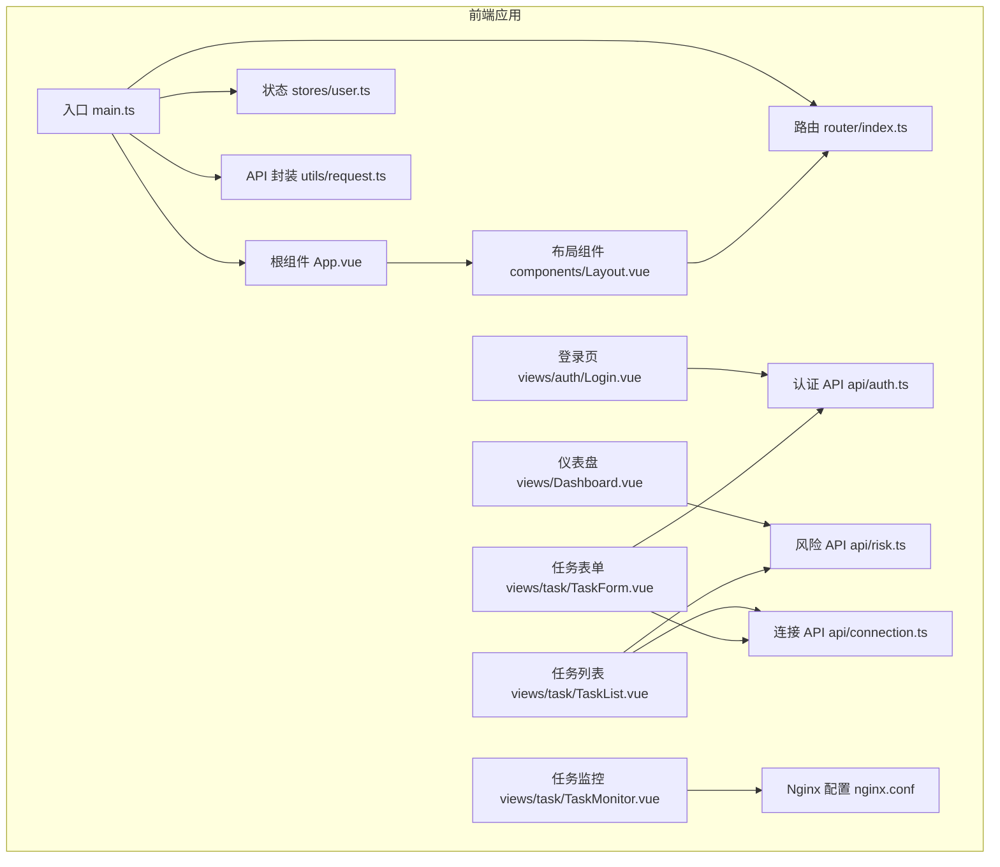
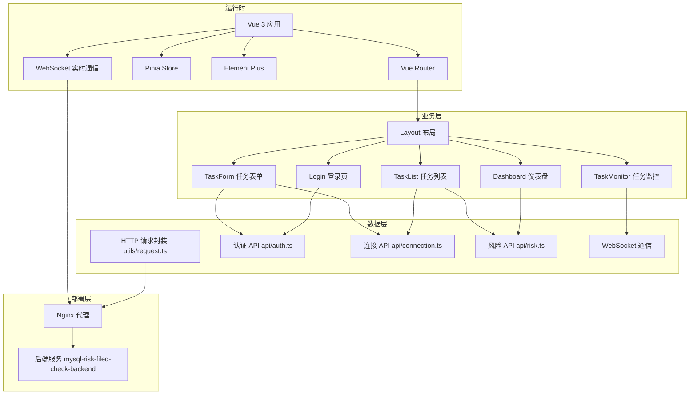
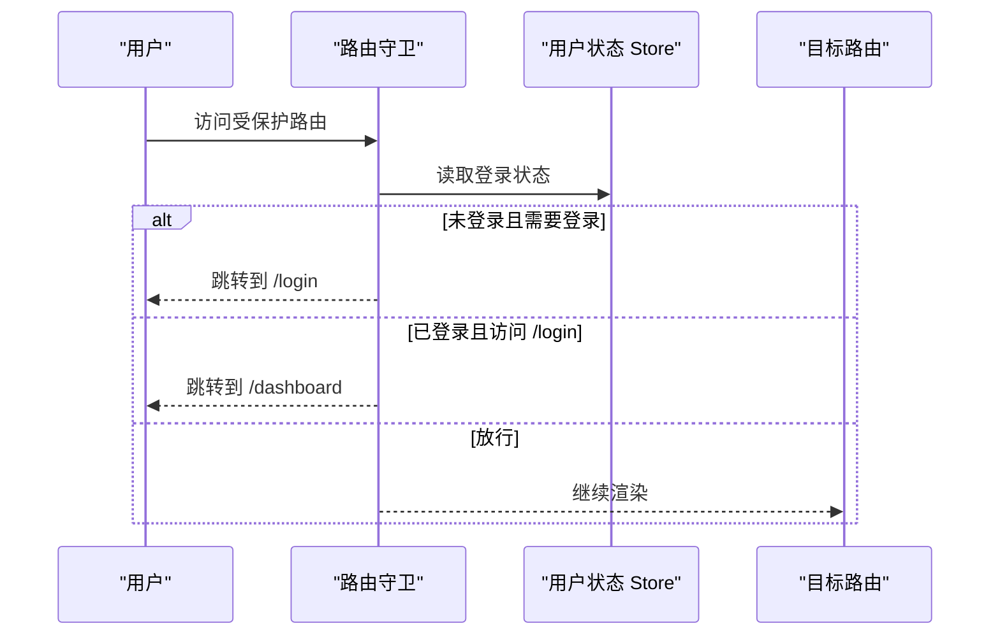
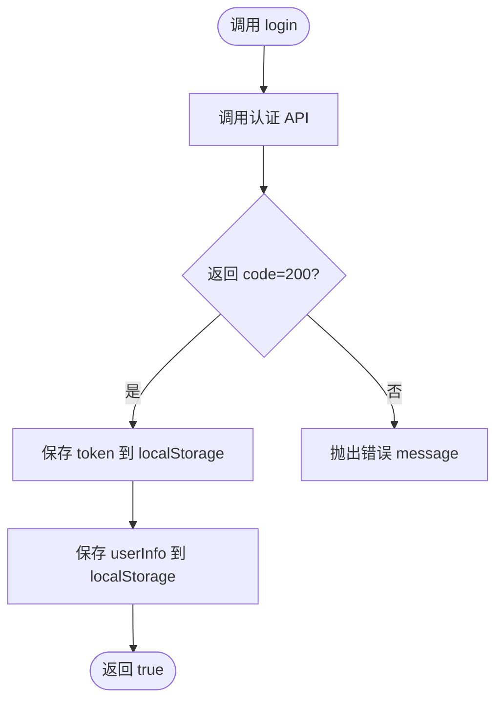
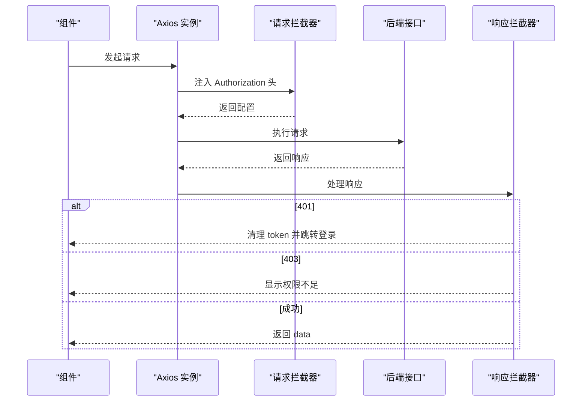
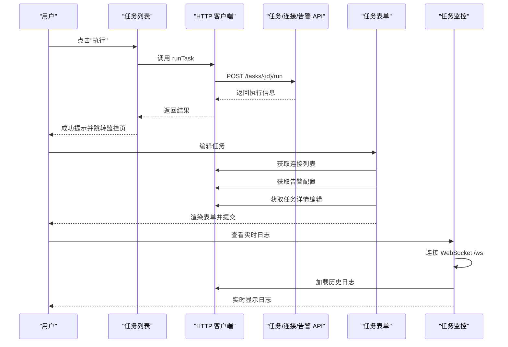
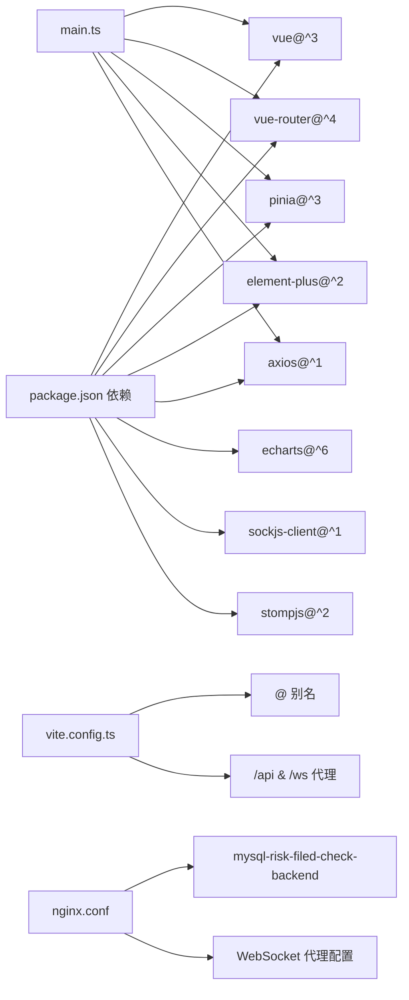

# 前端应用架构

<cite>
**本文档引用的文件**
- [main.ts](file://frontend/src/main.ts)
- [App.vue](file://frontend/src/App.vue)
- [router/index.ts](file://frontend/src/router/index.ts)
- [stores/user.ts](file://frontend/src/stores/user.ts)
- [utils/request.ts](file://frontend/src/utils/request.ts)
- [components/Layout.vue](file://frontend/src/components/Layout.vue)
- [views/auth/Login.vue](file://frontend/src/views/auth/Login.vue)
- [package.json](file://frontend/package.json)
- [vite.config.ts](file://frontend/vite.config.ts)
- [api/auth.ts](file://frontend/src/api/auth.ts)
- [api/connection.ts](file://frontend/src/api/connection.ts)
- [api/risk.ts](file://frontend/src/api/risk.ts)
- [views/Dashboard.vue](file://frontend/src/views/Dashboard.vue)
- [views/task/TaskList.vue](file://frontend/src/views/task/TaskList.vue)
- [views/task/TaskForm.vue](file://frontend/src/views/task/TaskForm.vue)
- [views/task/TaskMonitor.vue](file://frontend/src/views/task/TaskMonitor.vue)
- [nginx.conf](file://frontend/nginx.conf)
</cite>

## 更新摘要
**变更内容**
- 更新了 Nginx 代理配置，将后端服务目标从 'backend' 更改为 'mysql-risk-filed-check-backend'
- 更新了 WebSocket 连接路径，从绝对路径改为相对路径 '/ws'，确保通过 Nginx 代理正确转发请求
- 增强了 WebSocket 代理配置的说明，包括代理设置和连接升级处理

## 目录
1. [简介](#简介)
2. [项目结构](#项目结构)
3. [核心组件](#核心组件)
4. [架构总览](#架构总览)
5. [详细组件分析](#详细组件分析)
6. [依赖关系分析](#依赖关系分析)
7. [性能考虑](#性能考虑)
8. [故障排查指南](#故障排查指南)
9. [结论](#结论)
10. [附录](#附录)

## 简介
本文件系统性梳理 MySQL 风险字段检查平台前端应用的架构与实现，覆盖 Vue 3.x 技术栈、组件层次、路由与状态管理、API 集成层、页面交互设计、响应式与用户体验优化以及构建与部署流程。目标是帮助开发者快速理解并高效维护该前端工程。

## 项目结构
前端采用基于功能域的组织方式，主要目录与职责如下：
- src/api：按业务模块划分的 HTTP 客户端封装，统一通过请求拦截器注入鉴权信息
- src/components：通用布局与基础组件
- src/router：路由定义与导航守卫
- src/stores：Pinia 状态管理（当前为用户会话）
- src/utils：通用工具（HTTP 客户端封装）
- src/views：页面级组件，按业务模块组织
- public：静态资源
- 其他：Vite 构建配置、TypeScript 配置、依赖声明等

**图表来源**
- [main.ts:1-23](file://frontend/src/main.ts#L1-L23)
- [App.vue:1-25](file://frontend/src/App.vue#L1-L25)
- [router/index.ts:1-116](file://frontend/src/router/index.ts#L1-L116)
- [stores/user.ts:1-60](file://frontend/src/stores/user.ts#L1-L60)
- [components/Layout.vue:1-162](file://frontend/src/components/Layout.vue#L1-L162)
- [views/auth/Login.vue:1-131](file://frontend/src/views/auth/Login.vue#L1-L131)
- [views/Dashboard.vue:1-210](file://frontend/src/views/Dashboard.vue#L1-L210)
- [views/task/TaskList.vue:1-137](file://frontend/src/views/task/TaskList.vue#L1-L137)
- [views/task/TaskForm.vue:1-192](file://frontend/src/views/task/TaskForm.vue#L1-L192)
- [utils/request.ts:1-47](file://frontend/src/utils/request.ts#L1-L47)
- [api/auth.ts:1-27](file://frontend/src/api/auth.ts#L1-L27)
- [api/connection.ts:1-37](file://frontend/src/api/connection.ts#L1-L37)
- [api/risk.ts:1-71](file://frontend/src/api/risk.ts#L1-L71)
- [views/task/TaskMonitor.vue:1-296](file://frontend/src/views/task/TaskMonitor.vue#L1-L296)
- [nginx.conf:1-69](file://frontend/nginx.conf#L1-L69)

**章节来源**
- [main.ts:1-23](file://frontend/src/main.ts#L1-L23)
- [package.json:1-33](file://frontend/package.json#L1-L33)

## 核心组件
- 应用入口与插件注册：在入口中完成 Vue 实例创建、Pinia、Vue Router、Element Plus 的安装与本地化配置，并注册图标组件。
- 根组件：最外层容器，内部仅承载路由视图，样式重置与全局字体设置集中于此。
- 路由系统：采用 history 模式，定义登录页与带侧边栏布局的子路由；通过导航守卫实现登录态校验与角色访问控制。
- 状态管理：Pinia Store 维护用户登录态、用户信息与登录方法；持久化存储于 localStorage。
- HTTP 客户端：Axios 实例封装，统一设置基础路径、超时时间与请求/响应拦截器；自动注入 Authorization 头，处理 401/403 等错误场景。
- 布局组件：左侧菜单、顶部面包屑与用户下拉菜单，支持动态菜单项与管理员可见区域。
- 页面组件：登录页、仪表盘、任务列表/表单等，均通过 Element Plus 组件实现交互与数据展示。
- 任务监控组件：集成 WebSocket 实时日志功能，使用 SockJS 和 STOMP 协议实现实时通信。

**章节来源**
- [main.ts:1-23](file://frontend/src/main.ts#L1-L23)
- [App.vue:1-25](file://frontend/src/App.vue#L1-L25)
- [router/index.ts:1-116](file://frontend/src/router/index.ts#L1-L116)
- [stores/user.ts:1-60](file://frontend/src/stores/user.ts#L1-L60)
- [utils/request.ts:1-47](file://frontend/src/utils/request.ts#L1-L47)
- [components/Layout.vue:1-162](file://frontend/src/components/Layout.vue#L1-L162)
- [views/task/TaskMonitor.vue:108-132](file://frontend/src/views/task/TaskMonitor.vue#L108-L132)

## 架构总览
前端采用"入口 -> 路由 -> 视图 -> API -> 状态"的清晰分层，配合 Element Plus 提供的 UI 能力与 Pinia 进行轻量状态管理，整体架构简洁、职责明确。WebSocket 通过 Nginx 代理实现与后端的实时通信。

**图表来源**
- [main.ts:1-23](file://frontend/src/main.ts#L1-L23)
- [router/index.ts:1-116](file://frontend/src/router/index.ts#L1-L116)
- [components/Layout.vue:1-162](file://frontend/src/components/Layout.vue#L1-L162)
- [views/auth/Login.vue:1-131](file://frontend/src/views/auth/Login.vue#L1-L131)
- [views/Dashboard.vue:1-210](file://frontend/src/views/Dashboard.vue#L1-L210)
- [views/task/TaskList.vue:1-137](file://frontend/src/views/task/TaskList.vue#L1-L137)
- [views/task/TaskForm.vue:1-192](file://frontend/src/views/task/TaskForm.vue#L1-L192)
- [views/task/TaskMonitor.vue:108-132](file://frontend/src/views/task/TaskMonitor.vue#L108-L132)
- [utils/request.ts:1-47](file://frontend/src/utils/request.ts#L1-L47)
- [api/auth.ts:1-27](file://frontend/src/api/auth.ts#L1-L27)
- [api/connection.ts:1-37](file://frontend/src/api/connection.ts#L1-L37)
- [api/risk.ts:1-71](file://frontend/src/api/risk.ts#L1-L71)
- [nginx.conf:32-57](file://frontend/nginx.conf#L32-L57)

## 详细组件分析

### 应用入口与插件初始化
- 初始化顺序：创建应用实例 -> 注册 Element Plus 图标组件 -> 安装 Pinia、Router、Element Plus（中文本地化）
- 全局样式：重置 margin/padding、设置 html/body/#app 高度与宽度、统一字体族

**章节来源**
- [main.ts:1-23](file://frontend/src/main.ts#L1-L23)
- [App.vue:1-25](file://frontend/src/App.vue#L1-L25)

### 路由与导航守卫
- 路由结构：登录页无需登录态；其余页面均在 Layout 容器内，包含仪表盘、连接管理、任务管理、风险结果、白名单、告警配置、执行记录、用户管理、审计日志等
- 导航守卫：未登录访问受保护路由跳转登录；已登录访问登录页跳转仪表盘；后续可扩展角色权限控制

**图表来源**
- [router/index.ts:102-113](file://frontend/src/router/index.ts#L102-L113)
- [stores/user.ts:16-16](file://frontend/src/stores/user.ts#L16-L16)

**章节来源**
- [router/index.ts:1-116](file://frontend/src/router/index.ts#L1-L116)

### 用户状态管理（Pinia）
- 数据模型：token、userInfo、计算属性 isLoggedIn
- 方法：setToken、setUserInfo、login（调用认证 API）、logout（清空本地存储）
- 持久化：localStorage 存储 token 与 userInfo

**图表来源**
- [stores/user.ts:28-41](file://frontend/src/stores/user.ts#L28-L41)
- [api/auth.ts:16-18](file://frontend/src/api/auth.ts#L16-L18)

**章节来源**
- [stores/user.ts:1-60](file://frontend/src/stores/user.ts#L1-L60)
- [api/auth.ts:1-27](file://frontend/src/api/auth.ts#L1-L27)

### HTTP 客户端封装与认证
- 基础配置：baseURL 为 /api，超时 30 秒
- 请求拦截：从 localStorage 读取 token 并注入 Authorization: Bearer
- 响应拦截：统一提取 data；401 清理 token 并跳转登录；403 显示权限不足；其他错误统一提示；网络错误单独提示

**图表来源**
- [utils/request.ts:4-47](file://frontend/src/utils/request.ts#L4-L47)

**章节来源**
- [utils/request.ts:1-47](file://frontend/src/utils/request.ts#L1-L47)

### 布局组件与菜单
- 左侧菜单：根据当前路由高亮；支持管理员可见的用户管理与审计日志
- 顶部区域：面包屑显示当前页面标题；用户下拉菜单支持退出登录
- 主体内容：通过 router-view 呈现子路由页面

**章节来源**
- [components/Layout.vue:1-162](file://frontend/src/components/Layout.vue#L1-L162)

### 登录页
- 表单校验：用户名/密码必填
- 登录流程：校验通过后调用用户 Store 的 login，成功后提示并跳转仪表盘，失败显示错误消息
- 默认账号提示：便于演示环境使用

**章节来源**
- [views/auth/Login.vue:1-131](file://frontend/src/views/auth/Login.vue#L1-L131)
- [stores/user.ts:28-41](file://frontend/src/stores/user.ts#L28-L41)

### 仪表盘
- 统计卡片：总风险数、待处理、已解决、已忽略
- 图表：风险趋势折线图、风险类型分布饼图，使用 ECharts 渲染
- 数据来源：风险统计 API

**章节来源**
- [views/Dashboard.vue:1-210](file://frontend/src/views/Dashboard.vue#L1-L210)
- [api/risk.ts:47-49](file://frontend/src/api/risk.ts#L47-L49)

### 任务管理
- 任务列表：支持名称与状态筛选、分页、执行、监控、编辑、删除；执行后可跳转监控页并携带执行 ID
- 任务表单：支持连接选择、模式匹配、阈值配置、Y2038 告警年份、抽样与大表阈值、定时表达式、白名单策略、告警配置、状态开关；编辑模式下加载已有任务数据
- 任务监控：集成 WebSocket 实时日志功能，支持历史日志加载和实时日志订阅

**图表来源**
- [views/task/TaskList.vue:75-124](file://frontend/src/views/task/TaskList.vue#L75-L124)
- [views/task/TaskForm.vue:128-182](file://frontend/src/views/task/TaskForm.vue#L128-L182)
- [views/task/TaskMonitor.vue:108-132](file://frontend/src/views/task/TaskMonitor.vue#L108-L132)
- [api/connection.ts:14-16](file://frontend/src/api/connection.ts#L14-L16)
- [api/risk.ts:47-49](file://frontend/src/api/risk.ts#L47-L49)

**章节来源**
- [views/task/TaskList.vue:1-137](file://frontend/src/views/task/TaskList.vue#L1-L137)
- [views/task/TaskForm.vue:1-192](file://frontend/src/views/task/TaskForm.vue#L1-L192)
- [views/task/TaskMonitor.vue:1-296](file://frontend/src/views/task/TaskMonitor.vue#L1-L296)
- [api/connection.ts:1-37](file://frontend/src/api/connection.ts#L1-L37)
- [api/risk.ts:1-71](file://frontend/src/api/risk.ts#L1-L71)

### WebSocket 实时通信
- 连接建立：使用 SockJS 客户端连接相对路径 '/ws'，通过 Nginx 代理转发到后端服务
- 日志订阅：订阅 '/topic/execution/{executionId}/log' 主题获取实时日志
- 连接管理：支持连接断开、错误处理和内存清理
- 性能优化：限制日志数量，只渲染最近的日志条目

**更新** WebSocket 连接现在使用相对路径 '/ws'，通过 Nginx 代理正确转发到 'mysql-risk-filed-check-backend' 服务。

**章节来源**
- [views/task/TaskMonitor.vue:108-132](file://frontend/src/views/task/TaskMonitor.vue#L108-L132)
- [nginx.conf:45-57](file://frontend/nginx.conf#L45-L57)

## 依赖关系分析
- 技术栈：Vue 3、TypeScript、Element Plus、Vue Router、Pinia、Axios、ECharts、SockJS/STOMP（用于 WebSocket）
- 构建工具：Vite，配置别名 @ 指向 src，开发服务器代理 /api 与 /ws 到后端
- 依赖关系：页面组件依赖 API 模块；API 模块依赖请求封装；布局组件依赖路由与状态；入口统一注册插件
- 部署配置：Nginx 代理配置，支持 API 和 WebSocket 请求转发到 'mysql-risk-filed-check-backend'

**图表来源**
- [package.json:11-31](file://frontend/package.json#L11-L31)
- [vite.config.ts:8-29](file://frontend/vite.config.ts#L8-L29)
- [main.ts:1-23](file://frontend/src/main.ts#L1-L23)
- [nginx.conf:32-57](file://frontend/nginx.conf#L32-L57)

**章节来源**
- [package.json:1-33](file://frontend/package.json#L1-L33)
- [vite.config.ts:1-31](file://frontend/vite.config.ts#L1-L31)
- [nginx.conf:1-69](file://frontend/nginx.conf#L1-L69)

## 性能考虑
- 路由懒加载：通过动态导入实现页面级组件的按需加载，减少首屏体积
- 图表渲染：仪表盘中 ECharts 在挂载时初始化，避免重复创建实例
- 分页与搜索：任务列表采用分页与参数化查询，降低一次性传输数据量
- 本地存储：用户登录态与用户信息持久化，减少重复登录开销
- 构建优化：Vite 提供快速冷启动与热更新；生产构建进行代码压缩与 Tree Shaking
- WebSocket 优化：限制日志数量，只渲染最近的日志条目，防止内存泄漏
- Nginx 缓存：静态资源启用长期缓存，提高加载速度

**章节来源**
- [router/index.ts:9-94](file://frontend/src/router/index.ts#L9-L94)
- [views/Dashboard.vue:111-158](file://frontend/src/views/Dashboard.vue#L111-L158)
- [views/task/TaskList.vue:75-90](file://frontend/src/views/task/TaskList.vue#L75-L90)
- [views/task/TaskMonitor.vue:70-72](file://frontend/src/views/task/TaskMonitor.vue#L70-L72)
- [nginx.conf:26-30](file://frontend/nginx.conf#L26-L30)

## 故障排查指南
- 登录失败：检查用户名/密码是否符合要求；查看控制台是否有网络错误提示；确认后端接口可用
- 无权限或跳转登录：确认 token 是否存在且未过期；检查响应拦截器对 401/403 的处理逻辑
- 页面空白或组件不显示：检查路由配置与组件导出；确认 Element Plus 插件已正确安装
- 开发代理失效：确认 /api 与 /ws 代理配置指向正确的后端地址；浏览器 Network 面板观察请求转发
- 图表不渲染：确认 ECharts 引入与初始化逻辑；检查容器尺寸与挂载时机
- WebSocket 连接失败：检查 Nginx 代理配置是否正确；确认 WebSocket 端点 '/ws' 可用；查看浏览器控制台错误信息
- Nginx 代理问题：确认后端服务名称 'mysql-risk-filed-check-backend' 正确；检查代理目标端口 8080

**更新** 新增了 WebSocket 连接和 Nginx 代理相关的故障排查指导。

**章节来源**
- [utils/request.ts:24-44](file://frontend/src/utils/request.ts#L24-L44)
- [vite.config.ts:16-29](file://frontend/vite.config.ts#L16-L29)
- [views/Dashboard.vue:111-158](file://frontend/src/views/Dashboard.vue#L111-L158)
- [views/task/TaskMonitor.vue:129-131](file://frontend/src/views/task/TaskMonitor.vue#L129-L131)
- [nginx.conf:32-57](file://frontend/nginx.conf#L32-L57)

## 结论
该前端应用以 Vue 3 + TypeScript 为基础，结合 Element Plus、Pinia、Vue Router 与 Axios，形成了清晰的分层架构与良好的可维护性。通过统一的 API 封装与状态管理，实现了登录态与权限控制；页面组件围绕业务域组织，具备良好的复用性与扩展性。

**更新** 最新版本增强了 WebSocket 实时通信能力和 Nginx 代理配置，通过相对路径 '/ws' 实现了更可靠的后端服务转发。WebSocket 连接现在直接使用相对路径，避免了绝对路径导致的代理问题，确保通过 Nginx 正确转发到 'mysql-risk-filed-check-backend' 服务。

建议后续持续完善权限体系、增加错误边界与加载状态、引入国际化与主题切换等能力，进一步提升用户体验与可维护性。

## 附录
- 构建与预览命令：dev、build、preview（见 package.json scripts）
- 本地开发端口：3000（见 vite.config.ts server.port）
- 代理配置：/api -> http://localhost:8080，/ws -> http://localhost:8080（见 vite.config.ts proxy）
- Nginx 代理配置：API -> http://mysql-risk-filed-check-backend:8080，WebSocket -> http://mysql-risk-filed-check-backend:8080（见 nginx.conf）

**更新** 新增了 Nginx 代理配置的具体细节，包括 API 和 WebSocket 代理的目标服务名称。

**章节来源**
- [package.json:6-10](file://frontend/package.json#L6-L10)
- [vite.config.ts:16-29](file://frontend/vite.config.ts#L16-L29)
- [nginx.conf:32-57](file://frontend/nginx.conf#L32-L57)