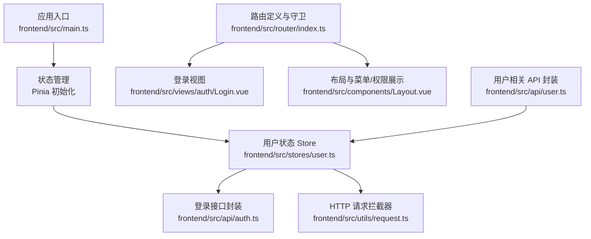
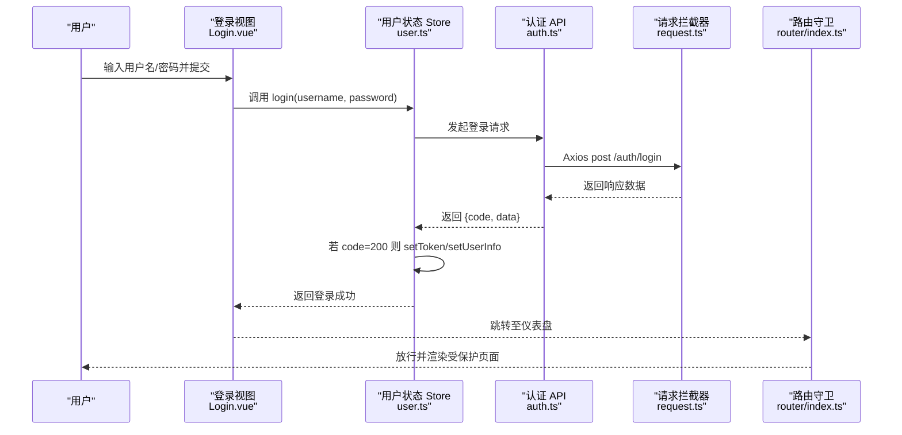
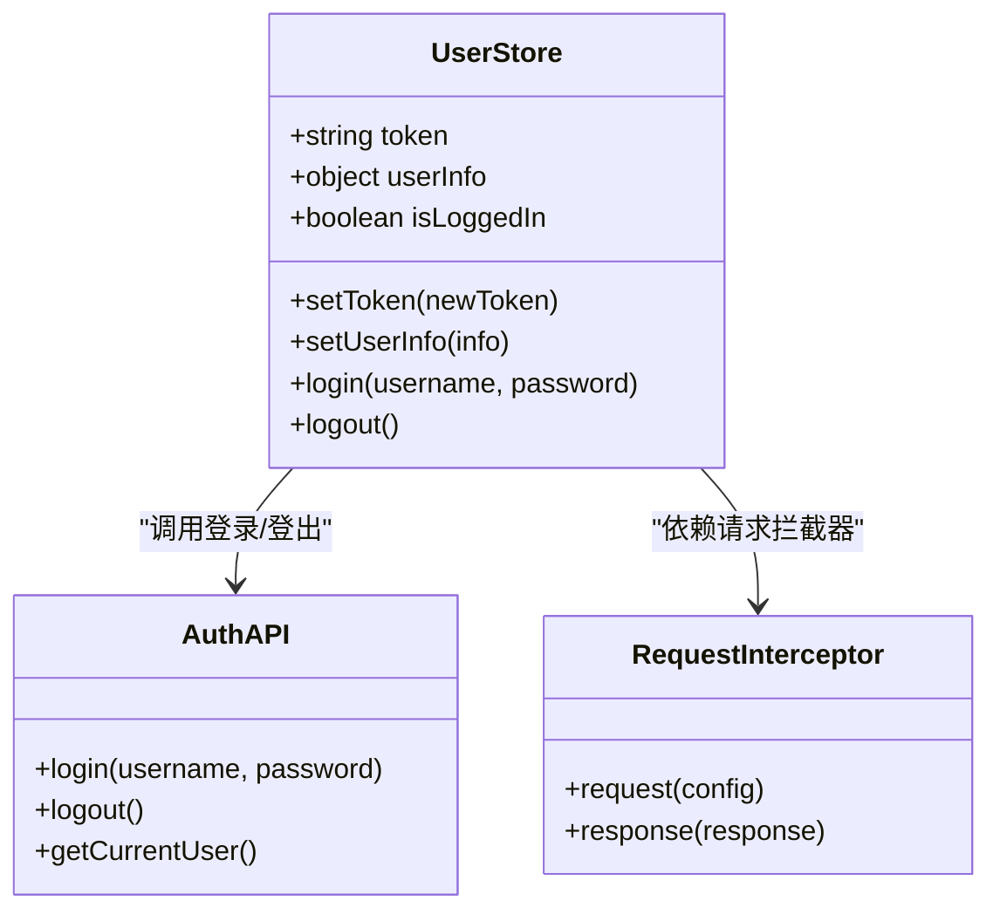
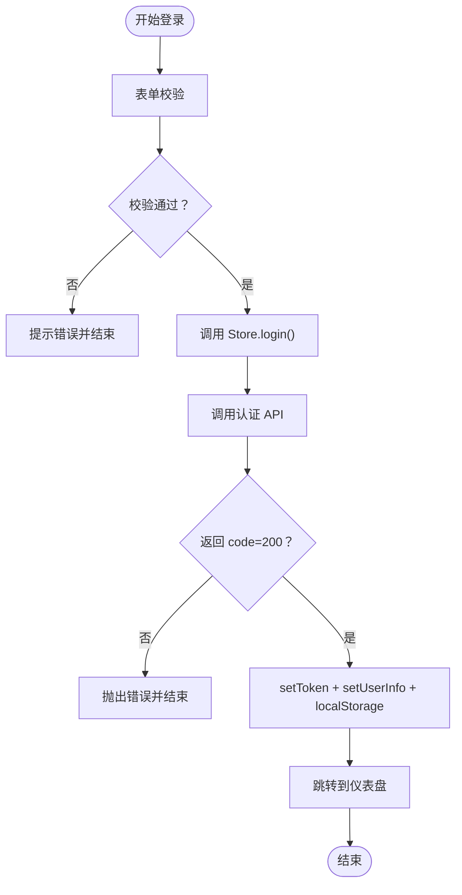
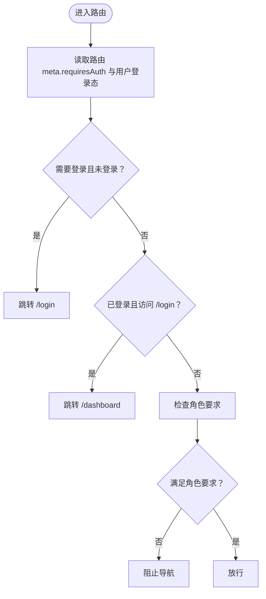
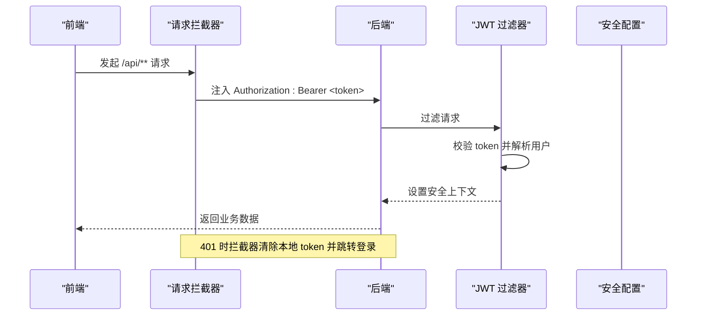
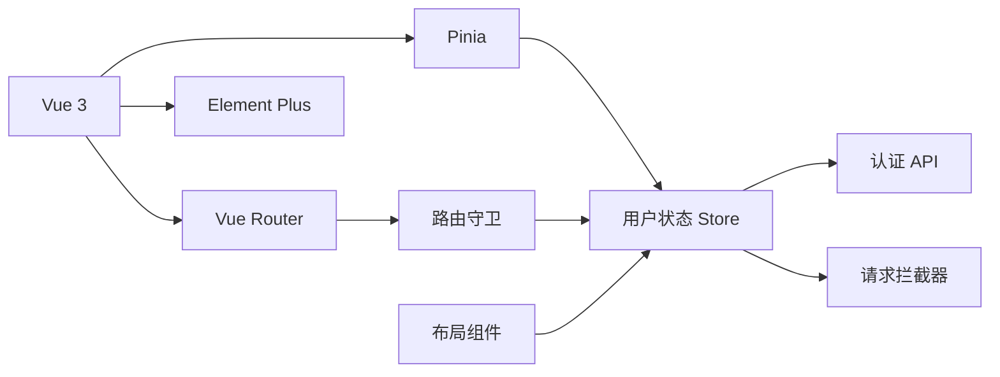

# 状态管理

<cite>
**本文引用的文件**
- [frontend/src/stores/user.ts](file://frontend/src/stores/user.ts)
- [frontend/src/main.ts](file://frontend/src/main.ts)
- [frontend/src/api/auth.ts](file://frontend/src/api/auth.ts)
- [frontend/src/router/index.ts](file://frontend/src/router/index.ts)
- [frontend/src/utils/request.ts](file://frontend/src/utils/request.ts)
- [frontend/src/views/auth/Login.vue](file://frontend/src/views/auth/Login.vue)
- [frontend/src/components/Layout.vue](file://frontend/src/components/Layout.vue)
- [frontend/src/api/user.ts](file://frontend/src/api/user.ts)
- [frontend/package.json](file://frontend/package.json)
- [backend/src/main/java/com/fieldcheck/config/SecurityConfig.java](file://backend/src/main/java/com/fieldcheck/config/SecurityConfig.java)
- [backend/src/main/java/com/fieldcheck/security/JwtAuthenticationFilter.java](file://backend/src/main/java/com/fieldcheck/security/JwtAuthenticationFilter.java)
- [backend/src/main/java/com/fieldcheck/entity/SysUser.java](file://backend/src/main/java/com/fieldcheck/entity/SysUser.java)
</cite>

## 目录
1. [引言](#引言)
2. [项目结构](#项目结构)
3. [核心组件](#核心组件)
4. [架构总览](#架构总览)
5. [详细组件分析](#详细组件分析)
6. [依赖分析](#依赖分析)
7. [性能考虑](#性能考虑)
8. [故障排查指南](#故障排查指南)
9. [结论](#结论)
10. [附录](#附录)

## 引言
本文件系统性梳理前端基于 Pinia 的状态管理实现，重点围绕用户状态（登录态、用户信息、角色权限）进行深入解析，并结合路由守卫、HTTP 请求拦截器与后端安全过滤链路，完整呈现“状态持久化—响应式绑定—权限控制—与后端同步”的闭环。文档同时给出模块化与命名空间管理建议、调试与开发工具使用指南，以及常见问题排查路径。

## 项目结构
前端采用 Vue 3 + TypeScript + Vite 构建，状态管理通过 Pinia 提供，核心入口在应用挂载时初始化 Pinia；用户状态 Store 定义于独立模块中，配合 API 层与路由守卫完成登录态与权限控制。

图表来源
- [frontend/src/main.ts](file://frontend/src/main.ts#L1-L23)
- [frontend/src/stores/user.ts](file://frontend/src/stores/user.ts#L1-L60)
- [frontend/src/api/auth.ts](file://frontend/src/api/auth.ts#L1-L27)
- [frontend/src/utils/request.ts](file://frontend/src/utils/request.ts#L1-L47)
- [frontend/src/router/index.ts](file://frontend/src/router/index.ts#L1-L116)
- [frontend/src/views/auth/Login.vue](file://frontend/src/views/auth/Login.vue#L1-L131)
- [frontend/src/components/Layout.vue](file://frontend/src/components/Layout.vue#L1-L162)
- [frontend/src/api/user.ts](file://frontend/src/api/user.ts#L1-L32)

章节来源
- [frontend/src/main.ts](file://frontend/src/main.ts#L1-L23)
- [frontend/package.json](file://frontend/package.json#L1-L33)

## 核心组件
- 用户状态 Store：集中管理 token、用户信息、登录态计算属性，提供登录、登出、设置 token 与用户信息等方法。
- 登录 API 封装：统一登录、登出、获取当前用户信息的接口调用。
- 路由守卫：根据登录态与路由元信息（requiresAuth、roles）进行导航控制。
- 请求拦截器：自动注入 Authorization 头，处理 401、403、网络错误等场景。
- 布局组件：根据用户角色动态渲染菜单项与下拉操作，触发登出流程。

章节来源
- [frontend/src/stores/user.ts](file://frontend/src/stores/user.ts#L1-L60)
- [frontend/src/api/auth.ts](file://frontend/src/api/auth.ts#L1-L27)
- [frontend/src/router/index.ts](file://frontend/src/router/index.ts#L102-L113)
- [frontend/src/utils/request.ts](file://frontend/src/utils/request.ts#L9-L44)
- [frontend/src/components/Layout.vue](file://frontend/src/components/Layout.vue#L43-L50)

## 架构总览
从登录到权限控制的端到端流程如下：

图表来源
- [frontend/src/views/auth/Login.vue](file://frontend/src/views/auth/Login.vue#L72-L89)
- [frontend/src/stores/user.ts](file://frontend/src/stores/user.ts#L28-L41)
- [frontend/src/api/auth.ts](file://frontend/src/api/auth.ts#L16-L18)
- [frontend/src/utils/request.ts](file://frontend/src/utils/request.ts#L4-L7)
- [frontend/src/router/index.ts](file://frontend/src/router/index.ts#L102-L113)

## 详细组件分析

### 用户状态 Store 设计与实现
- 数据模型
  - token：字符串，用于鉴权标识。
  - userInfo：对象或空，包含用户 ID、用户名、昵称、角色等。
  - isLoggedIn：基于 token 的计算属性，用于判断登录态。
- 方法职责
  - setToken/setUserInfo：写入响应式状态并持久化到 localStorage。
  - login：调用认证 API，成功后写入 token 与用户信息。
  - logout：清空响应式状态与 localStorage 中的 token 与用户信息。
- 持久化策略
  - 使用 localStorage 存储 token 与 userInfo，实现刷新后状态恢复。
- 响应式绑定
  - 通过 ref/computed 实现响应式数据，UI 组件可直接消费与响应变化。

图表来源
- [frontend/src/stores/user.ts](file://frontend/src/stores/user.ts#L12-L58)
- [frontend/src/api/auth.ts](file://frontend/src/api/auth.ts#L16-L26)
- [frontend/src/utils/request.ts](file://frontend/src/utils/request.ts#L9-L44)

章节来源
- [frontend/src/stores/user.ts](file://frontend/src/stores/user.ts#L1-L60)

### 登录流程与状态更新
- 视图层负责表单校验与加载态，调用 Store 的 login 方法。
- Store 在登录成功后写入 token 与 userInfo，并持久化到 localStorage。
- 成功后跳转至仪表盘，路由守卫放行。
- 登出时清空状态与本地存储，重定向到登录页。

图表来源
- [frontend/src/views/auth/Login.vue](file://frontend/src/views/auth/Login.vue#L72-L89)
- [frontend/src/stores/user.ts](file://frontend/src/stores/user.ts#L28-L41)
- [frontend/src/api/auth.ts](file://frontend/src/api/auth.ts#L16-L18)

章节来源
- [frontend/src/views/auth/Login.vue](file://frontend/src/views/auth/Login.vue#L1-L131)
- [frontend/src/stores/user.ts](file://frontend/src/stores/user.ts#L28-L41)

### 权限控制与路由守卫
- 路由元信息
  - requiresAuth：是否需要登录。
  - roles：访问该路由所需的最小角色（如 ADMIN）。
- 导航逻辑
  - 未登录访问受保护路由 → 跳转登录。
  - 已登录访问登录页 → 跳转仪表盘。
  - 其他情况 → 放行。
- 布局侧菜单
  - 仅当用户角色为 ADMIN 时显示“用户管理”“审计日志”。

图表来源
- [frontend/src/router/index.ts](file://frontend/src/router/index.ts#L102-L113)
- [frontend/src/components/Layout.vue](file://frontend/src/components/Layout.vue#L43-L50)

章节来源
- [frontend/src/router/index.ts](file://frontend/src/router/index.ts#L1-L116)
- [frontend/src/components/Layout.vue](file://frontend/src/components/Layout.vue#L1-L162)

### 状态持久化与本地存储策略
- 写入时机
  - 登录成功后 setToken 与 setUserInfo 同步写入 localStorage。
  - 登出时移除对应键值。
- 读取时机
  - Store 初始化时从 localStorage 读取 token 与 userInfo，恢复登录态与用户信息。
- 一致性保障
  - 所有状态变更均同步持久化，避免刷新丢失。
- 注意事项
  - 需要确保前后端 token 过期策略一致，必要时在请求拦截器中处理过期重定向。

章节来源
- [frontend/src/stores/user.ts](file://frontend/src/stores/user.ts#L13-L14)
- [frontend/src/stores/user.ts](file://frontend/src/stores/user.ts#L18-L26)
- [frontend/src/stores/user.ts](file://frontend/src/stores/user.ts#L43-L48)

### 响应式数据绑定机制
- Store 使用 ref/computed 管理响应式状态，UI 组件通过组合式 API 直接消费。
- 布局组件根据 userInfo 动态渲染菜单项与头像下拉，体现响应式联动。
- 登录成功后，isLoggedIn 计算属性立即变为 true，路由守卫随之放行。

章节来源
- [frontend/src/stores/user.ts](file://frontend/src/stores/user.ts#L16-L16)
- [frontend/src/components/Layout.vue](file://frontend/src/components/Layout.vue#L43-L50)

### 状态模块化与命名空间管理
- 当前项目采用单一用户状态模块，命名空间为 user。
- 建议扩展思路
  - 按功能拆分模块：如用户模块、任务模块、连接模块等，分别维护各自状态与持久化。
  - 使用 Pinia 模块化目录结构，便于团队协作与边界清晰。
  - 对跨模块共享的状态（如全局主题、语言）单独抽离，避免重复依赖。

章节来源
- [frontend/src/stores/user.ts](file://frontend/src/stores/user.ts#L12-L12)

### 与后端 API 的状态同步机制
- 认证流程
  - 前端发起登录请求，后端返回 token 与用户信息，前端写入 Store 与 localStorage。
  - 请求拦截器自动在 Authorization 头中携带 Bearer token。
- 安全过滤链
  - 后端通过 JWT 过滤器解析 Authorization 头，校验 token 并设置安全上下文。
  - 安全配置允许 /api/auth/** 免鉴权，其余 /api/** 需鉴权。
- 错误处理
  - 401 自动清除本地 token 并跳转登录。
  - 403 显示权限不足提示。
  - 其他错误统一提示消息。

图表来源
- [frontend/src/utils/request.ts](file://frontend/src/utils/request.ts#L10-L21)
- [backend/src/main/java/com/fieldcheck/security/JwtAuthenticationFilter.java](file://backend/src/main/java/com/fieldcheck/security/JwtAuthenticationFilter.java#L27-L49)
- [backend/src/main/java/com/fieldcheck/config/SecurityConfig.java](file://backend/src/main/java/com/fieldcheck/config/SecurityConfig.java#L44-L57)

章节来源
- [frontend/src/utils/request.ts](file://frontend/src/utils/request.ts#L1-L47)
- [backend/src/main/java/com/fieldcheck/config/SecurityConfig.java](file://backend/src/main/java/com/fieldcheck/config/SecurityConfig.java#L1-L60)
- [backend/src/main/java/com/fieldcheck/security/JwtAuthenticationFilter.java](file://backend/src/main/java/com/fieldcheck/security/JwtAuthenticationFilter.java#L1-L59)

## 依赖分析
- 应用依赖
  - Vue 3、Pinia、Element Plus、Axios、Vue Router。
- 关键耦合点
  - Store 依赖 API 封装与请求拦截器。
  - 路由守卫依赖 Store 的登录态。
  - 布局组件依赖 Store 的用户信息与角色。

图表来源
- [frontend/package.json](file://frontend/package.json#L11-L21)
- [frontend/src/stores/user.ts](file://frontend/src/stores/user.ts#L1-L60)
- [frontend/src/api/auth.ts](file://frontend/src/api/auth.ts#L1-L27)
- [frontend/src/utils/request.ts](file://frontend/src/utils/request.ts#L1-L47)
- [frontend/src/router/index.ts](file://frontend/src/router/index.ts#L1-L116)
- [frontend/src/components/Layout.vue](file://frontend/src/components/Layout.vue#L1-L162)

章节来源
- [frontend/package.json](file://frontend/package.json#L1-L33)

## 性能考虑
- 状态粒度
  - 将用户信息拆分为更细粒度的状态（如基础信息、偏好设置），减少不必要响应式更新。
- 持久化优化
  - 对大对象序列化写入 localStorage 可能带来开销，建议仅持久化必要字段。
- 请求缓存
  - 对只读列表数据可引入轻量缓存，避免重复请求。
- 渲染优化
  - 使用 keep-alive 缓存非关键页面，降低频繁切换成本。

## 故障排查指南
- 登录后无法进入受保护页面
  - 检查 Store 是否正确写入 token 与 userInfo。
  - 检查路由守卫逻辑与 requiresAuth 配置。
- 页面空白或 401
  - 检查请求拦截器是否注入 Authorization 头。
  - 检查后端 JWT 过滤器是否正确解析 token。
- 权限按钮不显示
  - 检查 userInfo 中角色字段与路由 meta.roles 的匹配。
- 登录成功但报错
  - 查看登录 API 返回的 code 与 message，确认后端返回格式。

章节来源
- [frontend/src/stores/user.ts](file://frontend/src/stores/user.ts#L28-L41)
- [frontend/src/router/index.ts](file://frontend/src/router/index.ts#L102-L113)
- [frontend/src/utils/request.ts](file://frontend/src/utils/request.ts#L24-L44)
- [backend/src/main/java/com/fieldcheck/security/JwtAuthenticationFilter.java](file://backend/src/main/java/com/fieldcheck/security/JwtAuthenticationFilter.java#L27-L49)

## 结论
本项目以 Pinia 为核心实现了简洁可靠的用户状态管理：通过 Store 统一管理 token 与用户信息，结合路由守卫与请求拦截器完成登录态与权限控制，并与后端 JWT 过滤链形成闭环。建议后续按功能模块拆分 Store，细化持久化策略，并引入调试工具辅助定位问题。

## 附录
- 开发工具与调试
  - 浏览器开发者工具：查看 Network 中 Authorization 头与响应状态码。
  - Vue DevTools：观察 Store 状态变化与组件响应式更新。
  - Pinia Devtools：查看 Store 的 state/actions/getters 变化轨迹。
- 最佳实践清单
  - 保持 Store 纯函数式更新，避免副作用。
  - 对外暴露只读计算属性，内部通过方法修改状态。
  - 对敏感字段（如 token）严格控制读写范围。
  - 对跨模块共享状态建立明确的模块边界与通信协议。