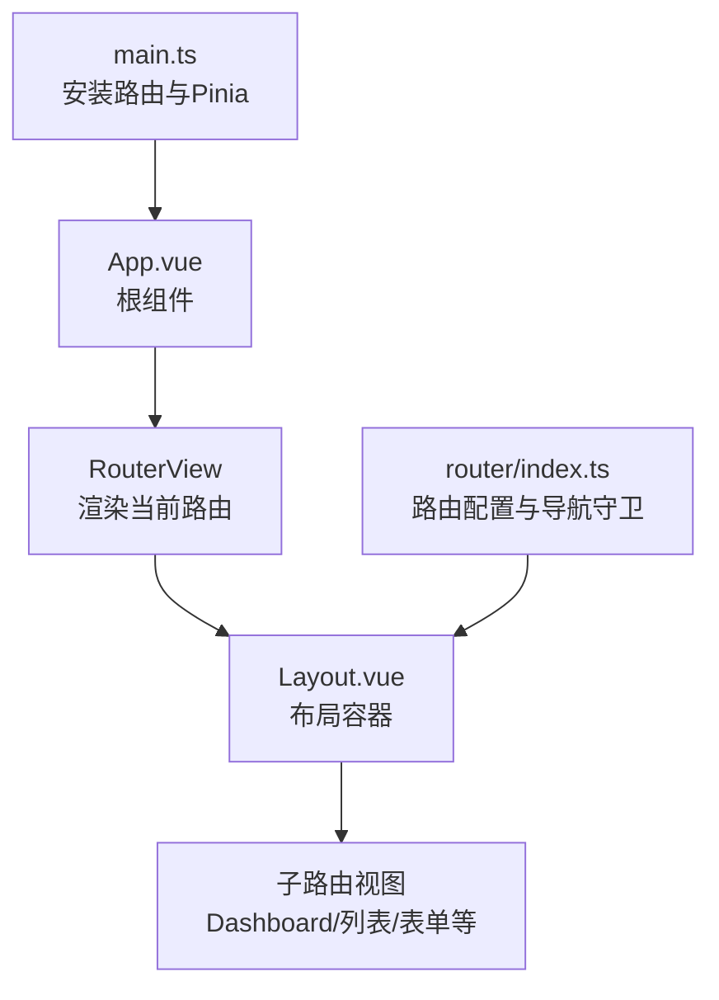
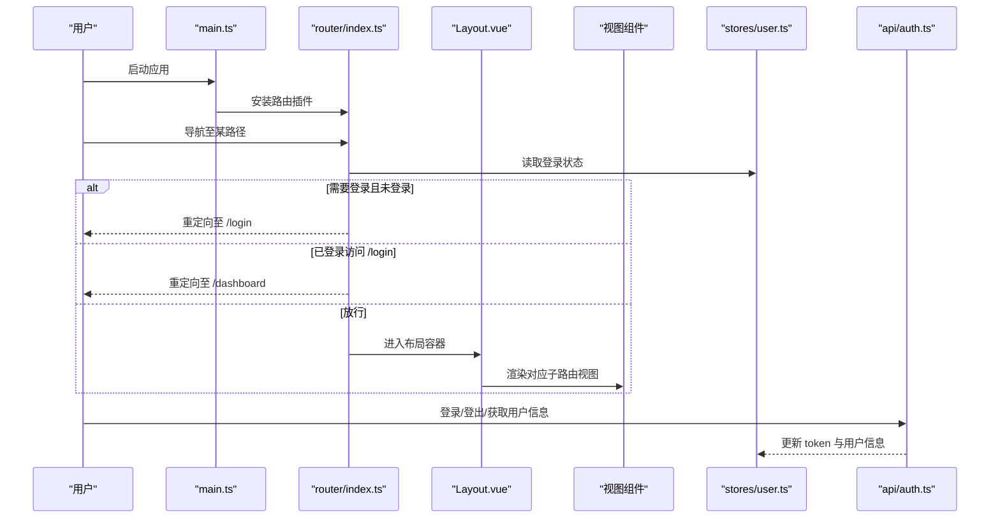
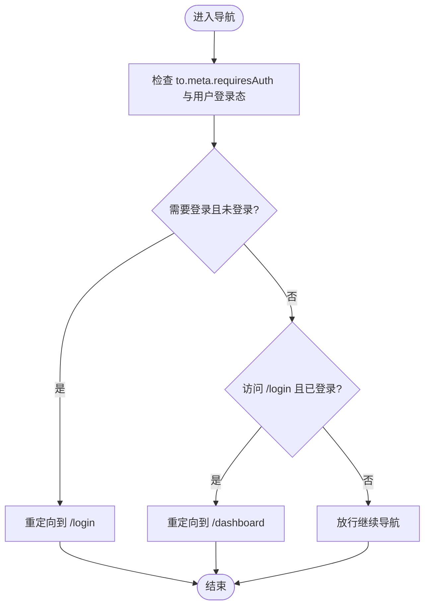
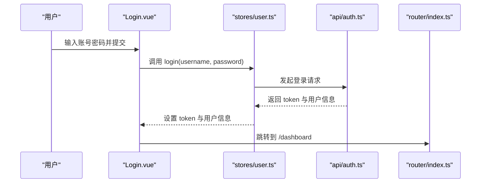
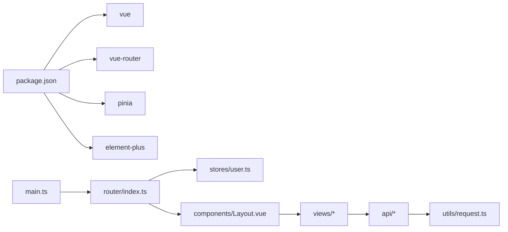

# 路由系统

<cite>
**本文引用的文件**
- [frontend/src/router/index.ts](file://frontend/src/router/index.ts)
- [frontend/src/main.ts](file://frontend/src/main.ts)
- [frontend/src/App.vue](file://frontend/src/App.vue)
- [frontend/src/components/Layout.vue](file://frontend/src/components/Layout.vue)
- [frontend/src/views/auth/Login.vue](file://frontend/src/views/auth/Login.vue)
- [frontend/src/stores/user.ts](file://frontend/src/stores/user.ts)
- [frontend/src/utils/request.ts](file://frontend/src/utils/request.ts)
- [frontend/src/api/auth.ts](file://frontend/src/api/auth.ts)
- [frontend/src/views/Dashboard.vue](file://frontend/src/views/Dashboard.vue)
- [frontend/src/views/task/TaskList.vue](file://frontend/src/views/task/TaskList.vue)
- [frontend/src/views/task/TaskForm.vue](file://frontend/src/views/task/TaskForm.vue)
- [frontend/src/api/task.ts](file://frontend/src/api/task.ts)
- [frontend/package.json](file://frontend/package.json)
- [frontend/vite.config.ts](file://frontend/vite.config.ts)
</cite>

## 目录
1. [简介](#简介)
2. [项目结构](#项目结构)
3. [核心组件](#核心组件)
4. [架构总览](#架构总览)
5. [详细组件分析](#详细组件分析)
6. [依赖分析](#依赖分析)
7. [性能考虑](#性能考虑)
8. [故障排查指南](#故障排查指南)
9. [结论](#结论)
10. [附录](#附录)

## 简介
本文件系统性梳理前端路由系统，围绕 Vue Router 的路由配置、导航守卫、路由层级与页面组件映射、路由元信息与权限控制、动态路由与嵌套路由、懒加载与性能优化、路由跳转与参数传递最佳实践以及 404 页面与错误处理机制进行深入解析。目标是帮助开发者快速理解并高效扩展该路由体系。

## 项目结构
前端路由位于 frontend/src/router/index.ts，采用 Vue Router 4.x + TypeScript + Vite 构建。应用通过 main.ts 安装路由插件；根组件 App.vue 使用 RouterView 渲染当前路由视图；Layout.vue 提供侧边菜单、面包屑与头部用户信息，作为受保护路由的容器；各业务视图组件按功能模块组织在 views 下。

图表来源
- [frontend/src/main.ts](file://frontend/src/main.ts#L1-L23)
- [frontend/src/App.vue](file://frontend/src/App.vue#L1-L25)
- [frontend/src/components/Layout.vue](file://frontend/src/components/Layout.vue#L1-L162)
- [frontend/src/router/index.ts](file://frontend/src/router/index.ts#L1-L116)

章节来源
- [frontend/src/router/index.ts](file://frontend/src/router/index.ts#L1-L116)
- [frontend/src/main.ts](file://frontend/src/main.ts#L1-L23)
- [frontend/src/App.vue](file://frontend/src/App.vue#L1-L25)

## 核心组件
- 路由器实例与配置：在 router/index.ts 中创建路由实例，定义路径、组件懒加载、嵌套路由与元信息，并设置全局前置导航守卫。
- 布局组件：Layout.vue 提供菜单、面包屑、头部用户下拉与主内容区，内部通过 Element Plus 菜单 router 属性与面包屑 currentRoute.meta.title 实现标题联动。
- 用户状态与鉴权：stores/user.ts 维护 token、用户信息与登录/登出逻辑；导航守卫读取用户登录态决定放行或重定向。
- 请求拦截与错误处理：utils/request.ts 在请求头注入 Token，在响应层统一处理 401/403/通用错误，触发自动登出与消息提示。
- 视图组件与路由跳转：各视图组件通过 $router.push/$router.back 或 Element Plus 菜单项 index 实现路由跳转，部分页面携带查询参数。

章节来源
- [frontend/src/router/index.ts](file://frontend/src/router/index.ts#L1-L116)
- [frontend/src/components/Layout.vue](file://frontend/src/components/Layout.vue#L1-L162)
- [frontend/src/stores/user.ts](file://frontend/src/stores/user.ts#L1-L60)
- [frontend/src/utils/request.ts](file://frontend/src/utils/request.ts#L1-L47)
- [frontend/src/views/auth/Login.vue](file://frontend/src/views/auth/Login.vue#L1-L131)

## 架构总览
下图展示从入口到路由渲染、鉴权与视图交互的关键流程：

图表来源
- [frontend/src/main.ts](file://frontend/src/main.ts#L1-L23)
- [frontend/src/router/index.ts](file://frontend/src/router/index.ts#L102-L113)
- [frontend/src/stores/user.ts](file://frontend/src/stores/user.ts#L1-L60)
- [frontend/src/api/auth.ts](file://frontend/src/api/auth.ts#L1-L27)

## 详细组件分析

### 路由配置与导航守卫
- 路由层级与嵌套
  - 根路径“/”使用 Layout.vue 作为父级容器，children 定义多个子路由，形成嵌套路由结构。
  - 子路由包括仪表盘、连接管理、任务管理、任务创建/编辑/监控、风险结果、白名单、告警配置、执行记录、用户管理、审计日志等。
- 动态路由参数
  - 任务编辑与监控使用动态段 :id，便于在不同页面间复用同一组件并根据参数切换数据。
- 路由元信息
  - requiresAuth 控制是否需要登录；title 用于面包屑与页面标题；roles 用于角色级权限控制（仅管理员可见）。
- 导航守卫
  - beforeEach 中判断 to.meta.requiresAuth 与用户登录态，未登录访问受保护路由则重定向至 /login；已登录访问 /login 则重定向至 /dashboard；其余放行。

图表来源
- [frontend/src/router/index.ts](file://frontend/src/router/index.ts#L102-L113)

章节来源
- [frontend/src/router/index.ts](file://frontend/src/router/index.ts#L5-L95)
- [frontend/src/router/index.ts](file://frontend/src/router/index.ts#L102-L113)

### 布局与菜单、面包屑联动
- 菜单项通过 el-menu router 属性与 index 绑定路径，点击即触发路由跳转。
- 面包屑通过 currentRoute.meta.title 动态显示当前页面标题，提升用户体验。
- 顶部用户下拉支持退出登录，调用用户存储的 logout 并跳转到登录页。

章节来源
- [frontend/src/components/Layout.vue](file://frontend/src/components/Layout.vue#L1-L162)

### 登录流程与鉴权
- 登录页 Login.vue 通过表单校验后调用用户存储的 login 方法，成功后跳转到仪表盘。
- 用户存储使用 Pinia 管理 token 与用户信息，并持久化到 localStorage。
- 请求拦截器在请求头注入 Authorization，响应拦截器统一处理 401 自动登出与错误提示。

图表来源
- [frontend/src/views/auth/Login.vue](file://frontend/src/views/auth/Login.vue#L72-L89)
- [frontend/src/stores/user.ts](file://frontend/src/stores/user.ts#L28-L41)
- [frontend/src/api/auth.ts](file://frontend/src/api/auth.ts#L16-L18)
- [frontend/src/router/index.ts](file://frontend/src/router/index.ts#L102-L113)

章节来源
- [frontend/src/views/auth/Login.vue](file://frontend/src/views/auth/Login.vue#L1-L131)
- [frontend/src/stores/user.ts](file://frontend/src/stores/user.ts#L1-L60)
- [frontend/src/api/auth.ts](file://frontend/src/api/auth.ts#L1-L27)
- [frontend/src/utils/request.ts](file://frontend/src/utils/request.ts#L1-L47)

### 动态路由与嵌套路由实践
- 动态路由
  - 任务编辑与监控使用 :id 参数，组件内通过 useRoute().params.id 获取并加载对应数据。
- 嵌套路由
  - 根路由 "/" 包裹 Layout.vue，子路由在 Layout 内部通过 router-view 渲染，形成统一布局下的多页面切换。
- 路由懒加载
  - 所有视图组件均通过函数形式懒加载，减少首屏体积，提升初始加载性能。

章节来源
- [frontend/src/router/index.ts](file://frontend/src/router/index.ts#L1-L116)
- [frontend/src/views/task/TaskForm.vue](file://frontend/src/views/task/TaskForm.vue#L98-L106)

### 路由跳转与参数传递最佳实践
- 编程式导航
  - 在任务列表中，执行任务后根据返回的执行 ID 通过 query 传参跳转到监控页，便于直接定位执行记录。
  - 表单页保存成功后统一跳回列表页，保持一致的导航体验。
- 模板内导航
  - 菜单项通过 index 直接绑定路径，简洁直观；支持条件渲染（如管理员可见的用户管理与审计日志）。
- 参数传递
  - 使用 push({ path, query }) 将执行 ID 等参数以查询字符串形式传递，避免深层嵌套导致的复杂 URL 结构。

章节来源
- [frontend/src/views/task/TaskList.vue](file://frontend/src/views/task/TaskList.vue#L92-L110)
- [frontend/src/views/task/TaskForm.vue](file://frontend/src/views/task/TaskForm.vue#L155-L176)
- [frontend/src/components/Layout.vue](file://frontend/src/components/Layout.vue#L15-L50)

### 权限控制机制
- 元信息驱动
  - 通过 meta.roles 指定仅管理员可见的菜单项；Layout 中使用 v-if=userStore.userInfo?.role === 'ADMIN' 控制显示。
- 导航守卫补充
  - 虽前置守卫主要基于 requiresAuth，但结合 meta.roles 可在后续扩展中实现更细粒度的权限拦截。
- 后端配合
  - 请求拦截器在 401 时自动清空 token 并跳转登录，确保无权限访问被及时阻断。

章节来源
- [frontend/src/router/index.ts](file://frontend/src/router/index.ts#L85-L91)
- [frontend/src/components/Layout.vue](file://frontend/src/components/Layout.vue#L43-L49)
- [frontend/src/utils/request.ts](file://frontend/src/utils/request.ts#L29-L42)

### 错误处理与 404 页面
- 404 页面
  - 当前路由配置未显式声明通配符 404 路由；若需统一 404 处理，建议新增“*”兜底路由并指向自定义 404 组件。
- 错误处理
  - 响应拦截器统一处理 401（自动登出）、403（权限不足）、通用错误与网络异常，保证错误信息一致且用户友好。
  - 登录页与业务组件内使用 Element Plus 的消息提示与确认框，增强交互反馈。

章节来源
- [frontend/src/router/index.ts](file://frontend/src/router/index.ts#L5-L95)
- [frontend/src/utils/request.ts](file://frontend/src/utils/request.ts#L23-L44)
- [frontend/src/views/auth/Login.vue](file://frontend/src/views/auth/Login.vue#L72-L89)

## 依赖分析
- 路由与状态管理
  - main.ts 安装路由与 Pinia；router/index.ts 依赖 stores/user.ts 进行鉴权；Layout.vue 依赖 userStore 与路由钩子。
- 视图与 API
  - 各视图组件通过 api/* 与后端交互；TaskList/TaskForm 依赖 task.ts；Login 依赖 auth.ts。
- 开发与构建
  - package.json 指定 vue、vue-router、pinia、element-plus 等依赖；vite.config.ts 配置代理与别名，便于开发调试。

图表来源
- [frontend/package.json](file://frontend/package.json#L11-L21)
- [frontend/src/main.ts](file://frontend/src/main.ts#L1-L23)
- [frontend/src/router/index.ts](file://frontend/src/router/index.ts#L1-L116)
- [frontend/src/stores/user.ts](file://frontend/src/stores/user.ts#L1-L60)
- [frontend/src/components/Layout.vue](file://frontend/src/components/Layout.vue#L1-L162)
- [frontend/src/utils/request.ts](file://frontend/src/utils/request.ts#L1-L47)
- [frontend/src/api/task.ts](file://frontend/src/api/task.ts#L1-L88)

章节来源
- [frontend/package.json](file://frontend/package.json#L1-L33)
- [frontend/vite.config.ts](file://frontend/vite.config.ts#L1-L31)

## 性能考虑
- 路由懒加载
  - 所有视图组件均采用动态导入，减少首屏 JavaScript 体积，提升首次加载速度。
- 组件按需加载
  - Element Plus 图标在入口处注册，避免重复引入；图表组件按需初始化，降低内存占用。
- 请求缓存与节流
  - 建议在高频接口上增加本地缓存与请求去重，避免重复请求造成资源浪费。
- 代理与热更新
  - Vite 代理配置将 /api 与 /ws 指向后端服务，减少跨域与额外中间层开销。

章节来源
- [frontend/src/router/index.ts](file://frontend/src/router/index.ts#L9-L116)
- [frontend/vite.config.ts](file://frontend/vite.config.ts#L16-L29)

## 故障排查指南
- 登录后无法进入受保护页面
  - 检查 stores/user.ts 是否正确写入 token 与用户信息；确认导航守卫逻辑与 meta.requiresAuth 配置。
- 访问 /login 仍被重定向到 /dashboard
  - 确认用户已登录且 isLoggedIn 为真；检查守卫中对 /login 的特殊处理。
- 401 未自动登出
  - 检查 utils/request.ts 的响应拦截器是否正确识别 401 并清除 token。
- 菜单项不显示或标题不更新
  - 确认 Layout.vue 中 meta.title 是否存在；检查 el-menu router 与 index 绑定是否正确。
- 动态路由参数无效
  - 检查路由定义中的 :id 与组件内 useRoute().params.id 读取是否一致；确认导航时是否携带参数。

章节来源
- [frontend/src/stores/user.ts](file://frontend/src/stores/user.ts#L1-L60)
- [frontend/src/router/index.ts](file://frontend/src/router/index.ts#L102-L113)
- [frontend/src/utils/request.ts](file://frontend/src/utils/request.ts#L23-L44)
- [frontend/src/components/Layout.vue](file://frontend/src/components/Layout.vue#L56-L61)
- [frontend/src/views/task/TaskForm.vue](file://frontend/src/views/task/TaskForm.vue#L98-L106)

## 结论
该路由系统以清晰的嵌套路由结构为基础，结合元信息与导航守卫实现了基础的鉴权与权限控制；通过懒加载与请求拦截器提升了性能与稳定性。建议后续补充 404 兜底路由与更细粒度的角色权限拦截，进一步完善用户体验与安全性。

## 附录
- 路由与视图映射概览
  - /login → Login.vue
  - / → Layout.vue（子路由）
    - /dashboard → Dashboard.vue
    - /connections → ConnectionList.vue
    - /tasks → TaskList.vue
    - /tasks/create → TaskForm.vue
    - /tasks/:id/edit → TaskForm.vue
    - /tasks/:id/monitor → TaskMonitor.vue
    - /risks → RiskList.vue
    - /whitelist → WhitelistList.vue
    - /alerts → AlertList.vue
    - /executions → ExecutionList.vue
    - /users → UserList.vue（管理员）
    - /audit-logs → AuditList.vue（管理员）

章节来源
- [frontend/src/router/index.ts](file://frontend/src/router/index.ts#L5-L95)
- [frontend/src/views/Dashboard.vue](file://frontend/src/views/Dashboard.vue#L1-L210)
- [frontend/src/views/task/TaskList.vue](file://frontend/src/views/task/TaskList.vue#L1-L137)
- [frontend/src/views/task/TaskForm.vue](file://frontend/src/views/task/TaskForm.vue#L1-L192)