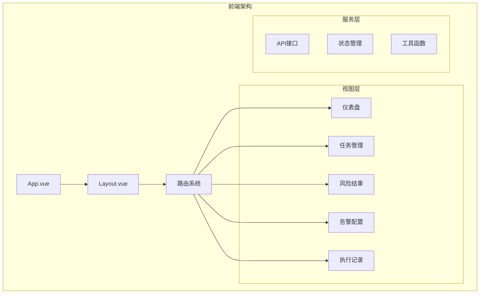
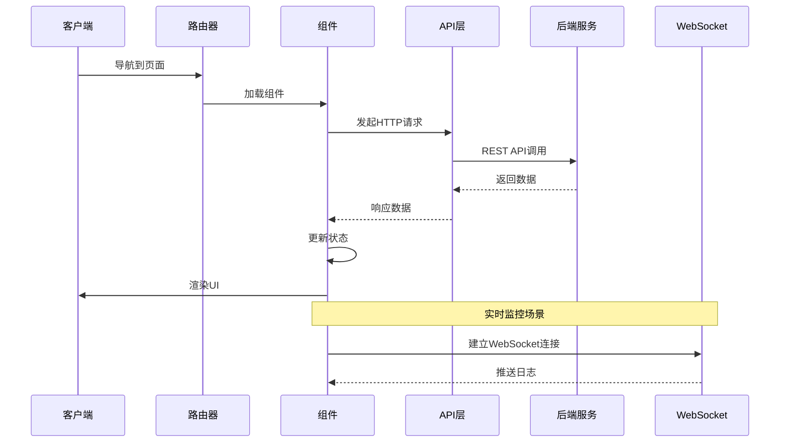
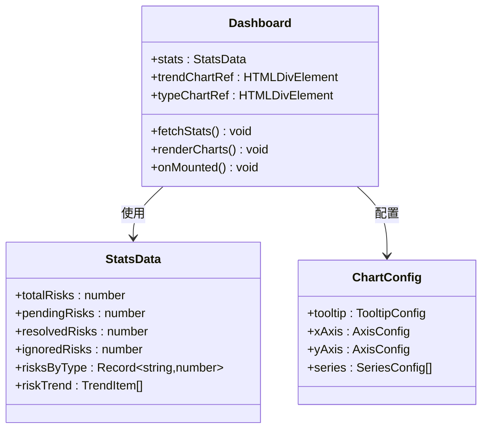
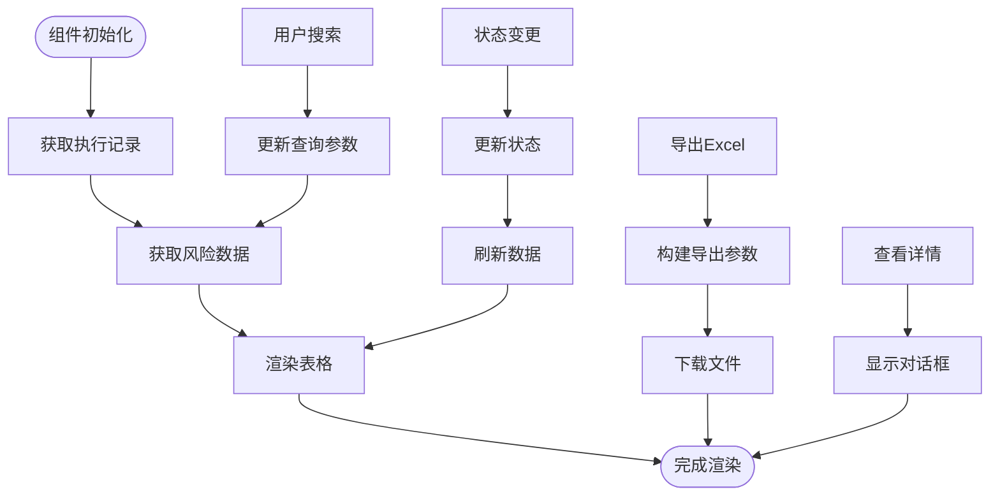
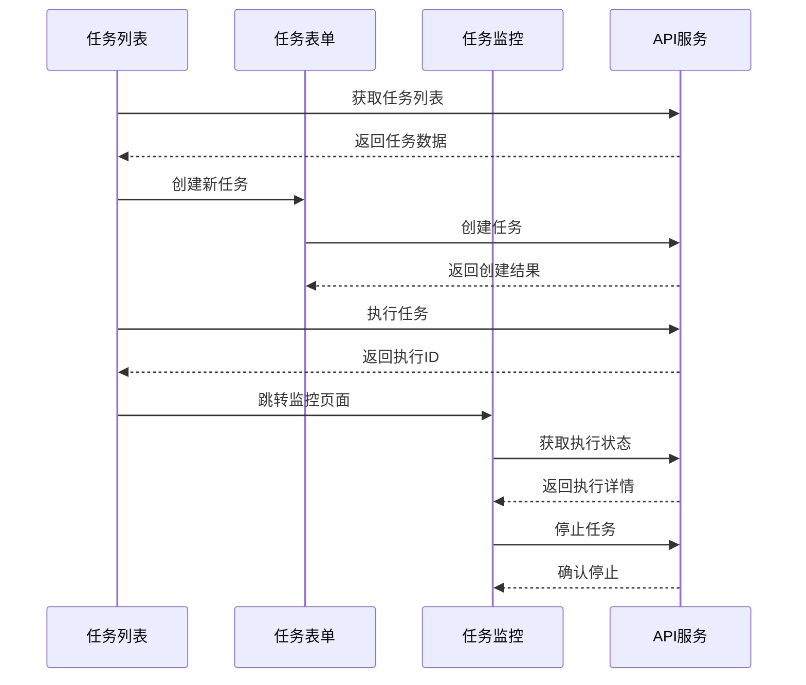
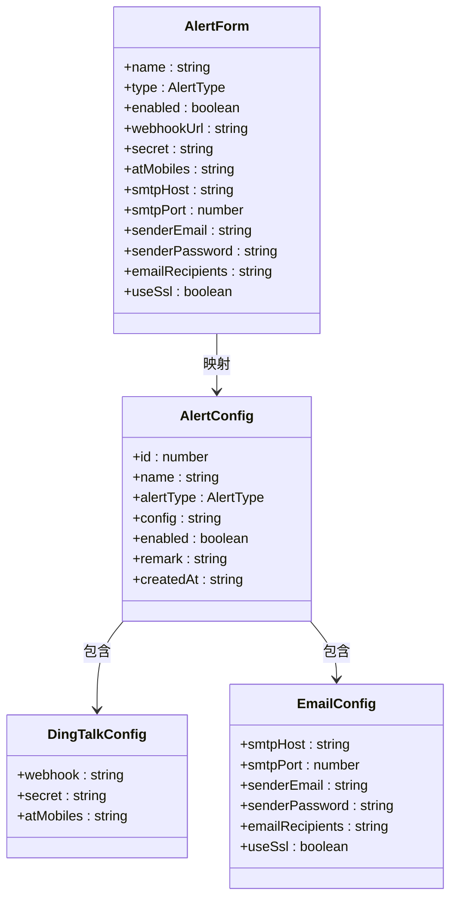
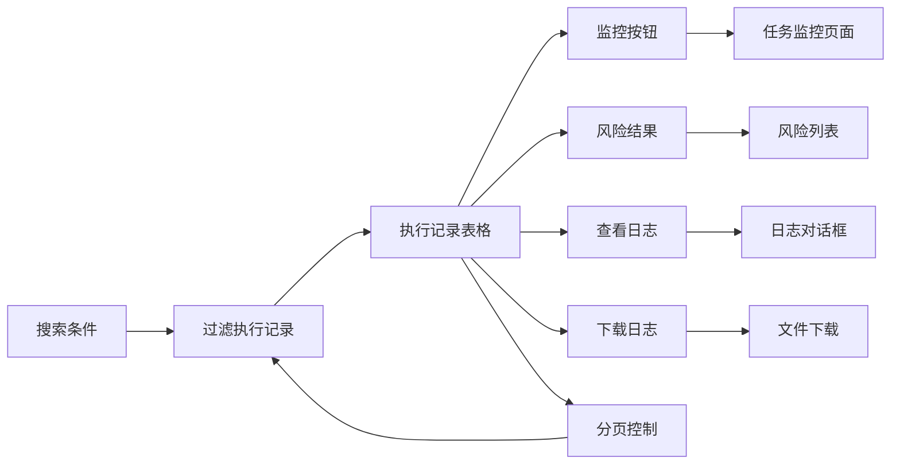
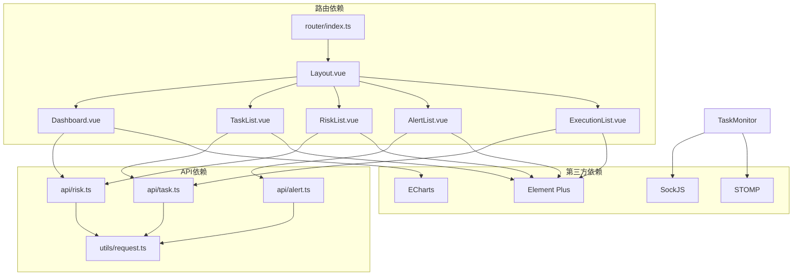
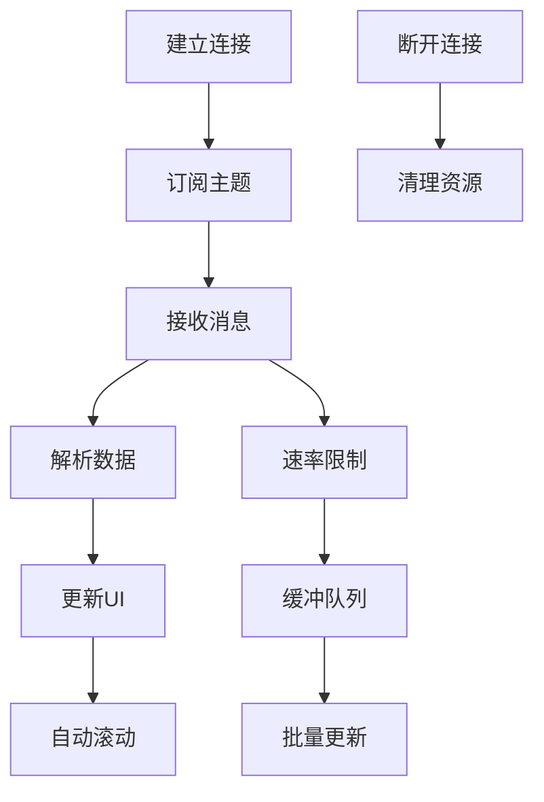

# 页面组件设计

<cite>
**本文档引用的文件**
- [Dashboard.vue](file://frontend/src/views/Dashboard.vue)
- [RiskList.vue](file://frontend/src/views/risk/RiskList.vue)
- [TaskList.vue](file://frontend/src/views/task/TaskList.vue)
- [TaskMonitor.vue](file://frontend/src/views/task/TaskMonitor.vue)
- [AlertList.vue](file://frontend/src/views/alert/AlertList.vue)
- [ExecutionList.vue](file://frontend/src/views/execution/ExecutionList.vue)
- [TaskForm.vue](file://frontend/src/views/task/TaskForm.vue)
- [Layout.vue](file://frontend/src/components/Layout.vue)
- [router/index.ts](file://frontend/src/router/index.ts)
- [api/risk.ts](file://frontend/src/api/risk.ts)
- [api/task.ts](file://frontend/src/api/task.ts)
- [api/alert.ts](file://frontend/src/api/alert.ts)
- [utils/request.ts](file://frontend/src/utils/request.ts)
- [App.vue](file://frontend/src/App.vue)
</cite>

## 目录
1. [引言](#引言)
2. [项目结构](#项目结构)
3. [核心组件](#核心组件)
4. [架构概览](#架构概览)
5. [详细组件分析](#详细组件分析)
6. [依赖关系分析](#依赖关系分析)
7. [性能考虑](#性能考虑)
8. [故障排除指南](#故障排除指南)
9. [结论](#结论)
10. [附录](#附录)

## 引言

本项目是一个基于Vue.js和Element Plus构建的MySQL字段容量检查管理系统。系统提供了完整的风险检测、任务管理、告警通知和实时监控功能。本文档深入分析各页面组件的设计模式、数据流和交互逻辑，为开发者提供全面的技术参考。

## 项目结构

前端采用模块化架构，按照功能域进行组织：

**图表来源**
- [App.vue](file://frontend/src/App.vue#L1-L25)
- [Layout.vue](file://frontend/src/components/Layout.vue#L1-L162)
- [router/index.ts](file://frontend/src/router/index.ts#L1-L116)

**章节来源**
- [App.vue](file://frontend/src/App.vue#L1-L25)
- [Layout.vue](file://frontend/src/components/Layout.vue#L1-L162)
- [router/index.ts](file://frontend/src/router/index.ts#L1-L116)

## 核心组件

系统包含以下核心页面组件：

### 仪表盘组件 (Dashboard)
- **功能**: 展示风险统计数据和趋势分析
- **技术**: ECharts图表库 + Element Plus卡片布局
- **数据**: 实时风险统计、类型分布、时间趋势

### 风险结果组件 (RiskList)
- **功能**: 风险结果展示、筛选、状态管理
- **技术**: Element Plus表格 + 分页 + 对话框
- **特性**: Excel导出、详情查看、状态批量更新

### 任务管理组件 (TaskList)
- **功能**: 任务生命周期管理
- **技术**: 表格操作 + 路由导航 + 确认对话框
- **特性**: 执行控制、删除保护、状态切换

### 实时监控组件 (TaskMonitor)
- **功能**: WebSocket实时日志监控
- **技术**: SockJS + STOMP协议 + 自动滚动
- **特性**: 历史日志加载 + 实时推送 + 进度跟踪

### 告警配置组件 (AlertList)
- **功能**: 多渠道告警配置管理
- **技术**: 表单验证 + 动态表单 + 开关控制
- **特性**: 钉钉机器人 + 邮件配置 + 测试功能

**章节来源**
- [Dashboard.vue](file://frontend/src/views/Dashboard.vue#L1-L210)
- [RiskList.vue](file://frontend/src/views/risk/RiskList.vue#L1-L257)
- [TaskList.vue](file://frontend/src/views/task/TaskList.vue#L1-L137)
- [TaskMonitor.vue](file://frontend/src/views/task/TaskMonitor.vue#L1-L266)
- [AlertList.vue](file://frontend/src/views/alert/AlertList.vue#L1-L508)

## 架构概览

系统采用前后端分离架构，通过RESTful API进行通信：

**图表来源**
- [router/index.ts](file://frontend/src/router/index.ts#L1-L116)
- [utils/request.ts](file://frontend/src/utils/request.ts#L1-L47)
- [TaskMonitor.vue](file://frontend/src/views/task/TaskMonitor.vue#L99-L119)

## 详细组件分析

### 仪表盘组件设计

仪表盘采用卡片式布局展示关键指标：

**图表来源**
- [Dashboard.vue](file://frontend/src/views/Dashboard.vue#L84-L91)
- [Dashboard.vue](file://frontend/src/views/Dashboard.vue#L111-L158)

**实现特点**:
- **响应式布局**: 使用Element Plus栅格系统实现自适应
- **图表集成**: ECharts实现折线图和饼图
- **数据绑定**: Vue响应式数据驱动界面更新
- **错误处理**: try-catch块确保组件稳定性

**章节来源**
- [Dashboard.vue](file://frontend/src/views/Dashboard.vue#L1-L210)

### 风险列表组件设计

风险列表实现完整的CRUD操作：

**图表来源**
- [RiskList.vue](file://frontend/src/views/risk/RiskList.vue#L151-L160)
- [RiskList.vue](file://frontend/src/views/risk/RiskList.vue#L172-L218)
- [RiskList.vue](file://frontend/src/views/risk/RiskList.vue#L220-L231)

**核心功能**:
- **多维筛选**: 执行记录、数据库、风险类型、状态
- **状态管理**: 待处理、已解决、已忽略三种状态
- **批量操作**: Excel导出、状态批量更新
- **详情展示**: 模态框显示完整风险信息

**章节来源**
- [RiskList.vue](file://frontend/src/views/risk/RiskList.vue#L1-L257)
- [api/risk.ts](file://frontend/src/api/risk.ts#L31-L53)

### 任务管理组件设计

任务管理实现完整的生命周期管理：

**图表来源**
- [TaskList.vue](file://frontend/src/views/task/TaskList.vue#L75-L90)
- [TaskMonitor.vue](file://frontend/src/views/task/TaskMonitor.vue#L136-L180)

**实现模式**:
- **路由参数传递**: 通过URL参数传递执行ID
- **状态同步**: 定时轮询保持状态最新
- **WebSocket集成**: 实时日志推送
- **错误处理**: 全面的异常捕获和用户反馈

**章节来源**
- [TaskList.vue](file://frontend/src/views/task/TaskList.vue#L1-L137)
- [TaskMonitor.vue](file://frontend/src/views/task/TaskMonitor.vue#L1-L266)

### 告警配置组件设计

告警配置支持多种通知渠道：

**图表来源**
- [AlertList.vue](file://frontend/src/views/alert/AlertList.vue#L216-L225)
- [AlertList.vue](file://frontend/src/views/alert/AlertList.vue#L246-L259)

**设计特色**:
- **动态表单**: 根据告警类型切换配置项
- **表单验证**: Element Plus表单验证规则
- **状态开关**: 实时启用/禁用配置
- **安全处理**: 敏感信息掩码显示

**章节来源**
- [AlertList.vue](file://frontend/src/views/alert/AlertList.vue#L1-L508)
- [api/alert.ts](file://frontend/src/api/alert.ts#L1-L28)

### 执行记录组件设计

执行记录提供完整的任务执行追踪：

**图表来源**
- [ExecutionList.vue](file://frontend/src/views/execution/ExecutionList.vue#L194-L217)
- [ExecutionList.vue](file://frontend/src/views/execution/ExecutionList.vue#L227-L276)

**功能特性**:
- **进度可视化**: 进度条显示执行状态
- **日志管理**: 在线查看和下载日志
- **状态分类**: 不同状态使用不同颜色标识
- **批量操作**: 支持多种批量处理操作

**章节来源**
- [ExecutionList.vue](file://frontend/src/views/execution/ExecutionList.vue#L1-L327)

## 依赖关系分析

系统采用模块化依赖管理：

**图表来源**
- [router/index.ts](file://frontend/src/router/index.ts#L1-L116)
- [utils/request.ts](file://frontend/src/utils/request.ts#L1-L47)

**依赖特点**:
- **松耦合设计**: 组件间通过API层解耦
- **统一认证**: 请求拦截器处理JWT令牌
- **错误处理**: 全局响应拦截器统一处理错误
- **类型安全**: TypeScript接口确保数据结构正确

**章节来源**
- [router/index.ts](file://frontend/src/router/index.ts#L1-L116)
- [utils/request.ts](file://frontend/src/utils/request.ts#L1-L47)

## 性能考虑

### 前端性能优化策略

1. **组件懒加载**
   - 路由级别的代码分割
   - 减少初始包体积

2. **虚拟滚动**
   - 大数据量表格使用虚拟滚动
   - 提升渲染性能

3. **缓存策略**
   - API响应缓存
   - 图表数据缓存

4. **资源优化**
   - 图片压缩
   - CSS/JS压缩

### WebSocket性能优化

**图表来源**
- [TaskMonitor.vue](file://frontend/src/views/task/TaskMonitor.vue#L99-L119)
- [TaskMonitor.vue](file://frontend/src/views/task/TaskMonitor.vue#L206-L223)

## 故障排除指南

### 常见问题及解决方案

1. **API请求失败**
   - 检查网络连接
   - 验证JWT令牌有效性
   - 查看后端服务状态

2. **WebSocket连接失败**
   - 确认后端WebSocket服务运行
   - 检查防火墙设置
   - 验证跨域配置

3. **图表渲染异常**
   - 检查ECharts版本兼容性
   - 验证容器尺寸
   - 确认数据格式正确

4. **权限相关问题**
   - 检查用户角色权限
   - 验证路由守卫配置
   - 确认菜单权限映射

**章节来源**
- [utils/request.ts](file://frontend/src/utils/request.ts#L24-L44)
- [TaskMonitor.vue](file://frontend/src/views/task/TaskMonitor.vue#L116-L118)

## 结论

本项目展现了现代前端开发的最佳实践，通过模块化设计、响应式布局和丰富的交互体验，为MySQL风险检查提供了完整的管理解决方案。组件设计遵循单一职责原则，API层实现了清晰的抽象，路由系统提供了良好的用户体验。

系统的主要优势包括：
- **模块化架构**: 清晰的功能划分和依赖管理
- **响应式设计**: 适配多种设备和屏幕尺寸
- **实时交互**: WebSocket实现实时监控
- **类型安全**: TypeScript提供编译时类型检查
- **用户体验**: 丰富的UI组件和友好的交互设计

## 附录

### 组件复用最佳实践

1. **通用组件设计**
   - 抽象通用功能为可复用组件
   - 使用props和events实现组件通信
   - 提供默认配置和覆盖机制

2. **样式定制**
   - 使用CSS变量实现主题定制
   - 支持scoped样式避免冲突
   - 提供样式覆盖接口

3. **国际化支持**
   - 文本内容提取为独立文件
   - 支持多语言切换
   - 日期时间本地化

4. **无障碍访问**
   - 语义化HTML标签
   - 键盘导航支持
   - 屏幕阅读器友好

### 移动端适配策略

1. **弹性布局**
   - 使用Flexbox实现自适应布局
   - 媒体查询适配不同屏幕尺寸
   - 触摸友好的交互元素

2. **性能优化**
   - 减少DOM节点数量
   - 优化图片资源
   - 使用硬件加速

3. **用户体验**
   - 简化操作流程
   - 提供加载状态指示
   - 错误处理友好的提示