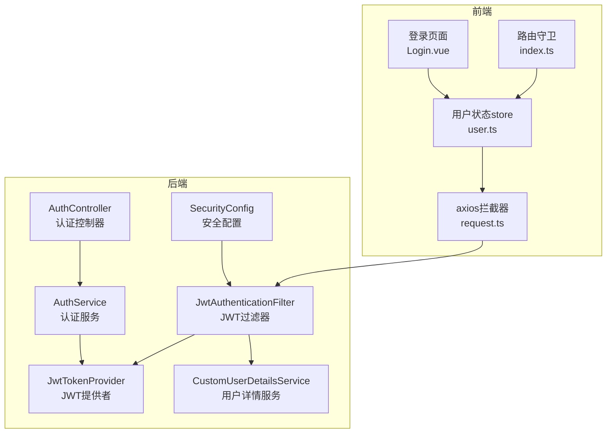
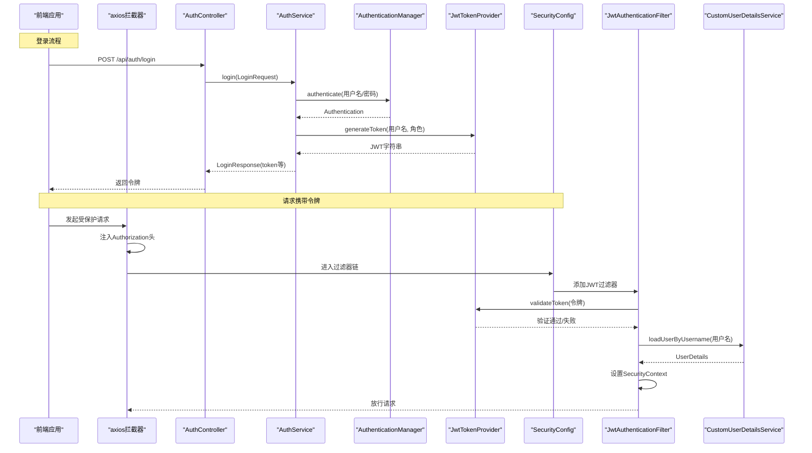
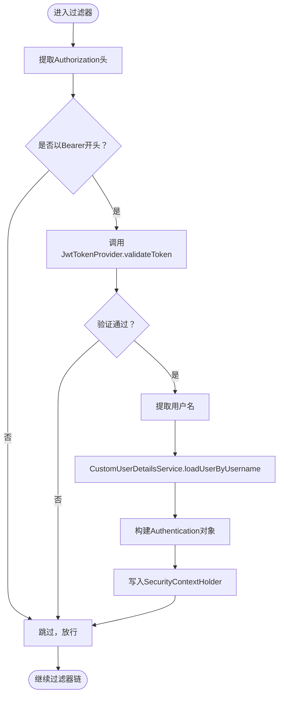
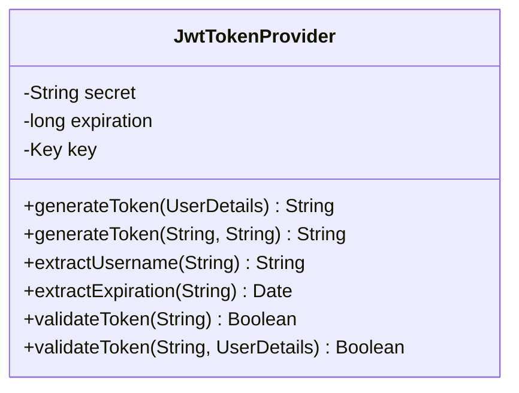
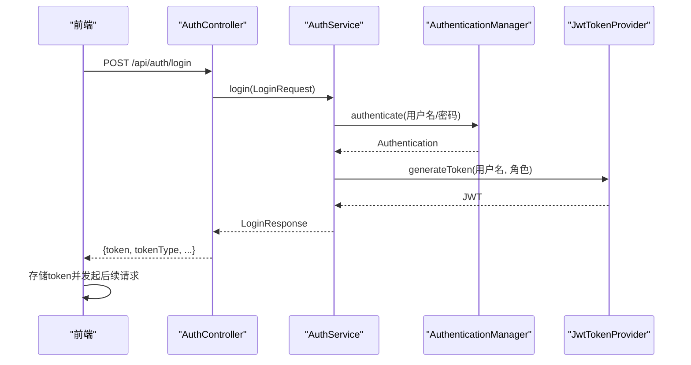
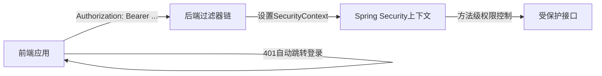
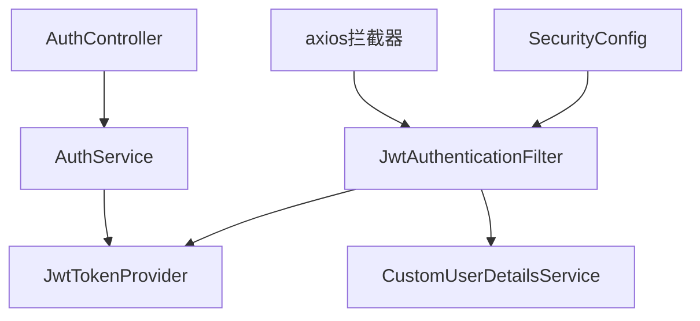

# JWT认证机制

<cite>
**本文引用的文件**
- [SecurityConfig.java](file://backend/src/main/java/com/fieldcheck/config/SecurityConfig.java)
- [JwtAuthenticationFilter.java](file://backend/src/main/java/com/fieldcheck/security/JwtAuthenticationFilter.java)
- [JwtTokenProvider.java](file://backend/src/main/java/com/fieldcheck/security/JwtTokenProvider.java)
- [AuthController.java](file://backend/src/main/java/com/fieldcheck/controller/AuthController.java)
- [AuthService.java](file://backend/src/main/java/com/fieldcheck/service/AuthService.java)
- [CustomUserDetailsService.java](file://backend/src/main/java/com/fieldcheck/security/CustomUserDetailsService.java)
- [LoginRequest.java](file://backend/src/main/java/com/fieldcheck/dto/LoginRequest.java)
- [LoginResponse.java](file://backend/src/main/java/com/fieldcheck/dto/LoginResponse.java)
- [application.yml](file://backend/src/main/resources/application.yml)
- [auth.ts](file://frontend/src/api/auth.ts)
- [user.ts](file://frontend/src/stores/user.ts)
- [request.ts](file://frontend/src/utils/request.ts)
- [Login.vue](file://frontend/src/views/auth/Login.vue)
- [index.ts](file://frontend/src/router/index.ts)
</cite>

## 目录
1. [简介](#简介)
2. [项目结构](#项目结构)
3. [核心组件](#核心组件)
4. [架构总览](#架构总览)
5. [详细组件分析](#详细组件分析)
6. [依赖关系分析](#依赖关系分析)
7. [性能考虑](#性能考虑)
8. [故障排除指南](#故障排除指南)
9. [结论](#结论)
10. [附录](#附录)

## 简介
本文件系统性阐述项目中基于Spring Security与JWT的认证机制，覆盖以下关键点：
- JWT工作原理与在项目中的落地实现
- 令牌生成、验证与刷新流程
- JwtAuthenticationFilter过滤器链的实现细节：令牌提取、验证与用户身份设置
- JwtTokenProvider核心能力：签名算法、过期时间与密钥管理
- 登录认证流程完整示例：用户名密码校验与令牌返回
- 前后端分离架构下的JWT应用模式
- 安全最佳实践与常见威胁防护
- 调试与故障排除指南

## 项目结构
项目采用前后端分离架构，后端为Spring Boot应用，前端为Vue 3 + Pinia + Element Plus。JWT认证相关代码主要集中在后端的安全配置、过滤器与令牌提供者，以及前端的请求拦截器与用户状态管理。

图表来源
- [SecurityConfig.java](file://backend/src/main/java/com/fieldcheck/config/SecurityConfig.java#L44-L58)
- [JwtAuthenticationFilter.java](file://backend/src/main/java/com/fieldcheck/security/JwtAuthenticationFilter.java#L27-L49)
- [JwtTokenProvider.java](file://backend/src/main/java/com/fieldcheck/security/JwtTokenProvider.java#L32-L54)
- [AuthController.java](file://backend/src/main/java/com/fieldcheck/controller/AuthController.java#L25-L36)
- [AuthService.java](file://backend/src/main/java/com/fieldcheck/service/AuthService.java#L51-L73)
- [CustomUserDetailsService.java](file://backend/src/main/java/com/fieldcheck/security/CustomUserDetailsService.java#L21-L35)
- [request.ts](file://frontend/src/utils/request.ts#L10-L21)
- [user.ts](file://frontend/src/stores/user.ts#L18-L41)
- [Login.vue](file://frontend/src/views/auth/Login.vue#L72-L89)
- [index.ts](file://frontend/src/router/index.ts#L102-L113)

章节来源
- [SecurityConfig.java](file://backend/src/main/java/com/fieldcheck/config/SecurityConfig.java#L1-L60)
- [application.yml](file://backend/src/main/resources/application.yml#L55-L58)

## 核心组件
- 安全配置：启用无状态会话策略，配置允许访问的路径，注册JWT过滤器到过滤器链。
- JWT过滤器：从请求头提取Bearer令牌，验证有效性，加载用户详情并设置安全上下文。
- JWT提供者：负责令牌生成、解析、验证与过期判断；使用HMAC-SHA256签名。
- 认证控制器与服务：处理登录请求，进行用户名密码认证，生成JWT并返回响应。
- 用户详情服务：根据用户名加载用户实体，构建Spring Security的UserDetails。
- 前端拦截器与状态：统一注入Authorization头，处理401自动跳转登录，持久化用户信息。

章节来源
- [SecurityConfig.java](file://backend/src/main/java/com/fieldcheck/config/SecurityConfig.java#L44-L58)
- [JwtAuthenticationFilter.java](file://backend/src/main/java/com/fieldcheck/security/JwtAuthenticationFilter.java#L27-L49)
- [JwtTokenProvider.java](file://backend/src/main/java/com/fieldcheck/security/JwtTokenProvider.java#L32-L93)
- [AuthController.java](file://backend/src/main/java/com/fieldcheck/controller/AuthController.java#L25-L36)
- [AuthService.java](file://backend/src/main/java/com/fieldcheck/service/AuthService.java#L51-L73)
- [CustomUserDetailsService.java](file://backend/src/main/java/com/fieldcheck/security/CustomUserDetailsService.java#L21-L35)
- [request.ts](file://frontend/src/utils/request.ts#L10-L21)
- [user.ts](file://frontend/src/stores/user.ts#L18-L41)

## 架构总览
下图展示JWT认证在请求生命周期中的关键交互：

图表来源
- [AuthController.java](file://backend/src/main/java/com/fieldcheck/controller/AuthController.java#L25-L36)
- [AuthService.java](file://backend/src/main/java/com/fieldcheck/service/AuthService.java#L51-L73)
- [JwtTokenProvider.java](file://backend/src/main/java/com/fieldcheck/security/JwtTokenProvider.java#L32-L54)
- [SecurityConfig.java](file://backend/src/main/java/com/fieldcheck/config/SecurityConfig.java#L44-L58)
- [JwtAuthenticationFilter.java](file://backend/src/main/java/com/fieldcheck/security/JwtAuthenticationFilter.java#L27-L49)
- [CustomUserDetailsService.java](file://backend/src/main/java/com/fieldcheck/security/CustomUserDetailsService.java#L21-L35)
- [request.ts](file://frontend/src/utils/request.ts#L10-L21)

## 详细组件分析

### JwtAuthenticationFilter 过滤器链实现
- 令牌提取：从Authorization头读取Bearer前缀的JWT字符串。
- 令牌验证：调用JwtTokenProvider.validateToken进行签名与过期校验。
- 用户加载：从JwtTokenProvider提取用户名，交由CustomUserDetailsService加载UserDetails。
- 安全上下文设置：构造UsernamePasswordAuthenticationToken并写入SecurityContextHolder。
- 异常处理：捕获异常并记录日志，不影响后续过滤器执行。

图表来源
- [JwtAuthenticationFilter.java](file://backend/src/main/java/com/fieldcheck/security/JwtAuthenticationFilter.java#L27-L49)
- [JwtTokenProvider.java](file://backend/src/main/java/com/fieldcheck/security/JwtTokenProvider.java#L81-L93)
- [CustomUserDetailsService.java](file://backend/src/main/java/com/fieldcheck/security/CustomUserDetailsService.java#L21-L35)

章节来源
- [JwtAuthenticationFilter.java](file://backend/src/main/java/com/fieldcheck/security/JwtAuthenticationFilter.java#L27-L57)

### JwtTokenProvider 核心功能
- 密钥管理：启动时从配置读取secret并转换为HMAC-SHA256密钥。
- 令牌生成：支持两种生成方式：仅用户名或附加角色信息；设置签发时间与过期时间。
- 令牌解析：解析并校验签名，提取主题与过期时间。
- 令牌验证：校验签名与过期；提供针对UserDetails的二次验证。

图表来源
- [JwtTokenProvider.java](file://backend/src/main/java/com/fieldcheck/security/JwtTokenProvider.java#L17-L93)

章节来源
- [JwtTokenProvider.java](file://backend/src/main/java/com/fieldcheck/security/JwtTokenProvider.java#L19-L30)
- [JwtTokenProvider.java](file://backend/src/main/java/com/fieldcheck/security/JwtTokenProvider.java#L32-L54)
- [JwtTokenProvider.java](file://backend/src/main/java/com/fieldcheck/security/JwtTokenProvider.java#L64-L93)

### 登录认证流程（含令牌返回）
- 前端提交用户名与密码至后端。
- 后端通过AuthenticationManager进行认证。
- 成功后，AuthService根据用户信息生成JWT。
- 返回LoginResponse，包含token、tokenType及用户基本信息。
- 前端存储token并在后续请求中通过axios拦截器统一注入Authorization头。

图表来源
- [AuthController.java](file://backend/src/main/java/com/fieldcheck/controller/AuthController.java#L25-L36)
- [AuthService.java](file://backend/src/main/java/com/fieldcheck/service/AuthService.java#L51-L73)
- [JwtTokenProvider.java](file://backend/src/main/java/com/fieldcheck/security/JwtTokenProvider.java#L32-L41)
- [LoginRequest.java](file://backend/src/main/java/com/fieldcheck/dto/LoginRequest.java#L8-L14)
- [LoginResponse.java](file://backend/src/main/java/com/fieldcheck/dto/LoginResponse.java#L12-L19)
- [request.ts](file://frontend/src/utils/request.ts#L10-L21)
- [user.ts](file://frontend/src/stores/user.ts#L18-L41)

章节来源
- [AuthController.java](file://backend/src/main/java/com/fieldcheck/controller/AuthController.java#L25-L36)
- [AuthService.java](file://backend/src/main/java/com/fieldcheck/service/AuthService.java#L51-L73)
- [LoginRequest.java](file://backend/src/main/java/com/fieldcheck/dto/LoginRequest.java#L8-L14)
- [LoginResponse.java](file://backend/src/main/java/com/fieldcheck/dto/LoginResponse.java#L12-L19)
- [request.ts](file://frontend/src/utils/request.ts#L10-L21)
- [user.ts](file://frontend/src/stores/user.ts#L18-L41)

### 前后端分离中的JWT应用模式
- 前端：登录成功后将token存入本地存储，请求拦截器统一添加Authorization头；401时清理token并跳转登录页。
- 后端：无状态会话策略，所有受保护接口均需携带有效JWT；过滤器在每次请求进入时验证令牌并设置安全上下文。
- 路由守卫：未登录用户无法访问需要认证的页面，已登录用户无法访问登录页。

图表来源
- [request.ts](file://frontend/src/utils/request.ts#L10-L21)
- [SecurityConfig.java](file://backend/src/main/java/com/fieldcheck/config/SecurityConfig.java#L44-L58)
- [JwtAuthenticationFilter.java](file://backend/src/main/java/com/fieldcheck/security/JwtAuthenticationFilter.java#L27-L49)
- [index.ts](file://frontend/src/router/index.ts#L102-L113)

章节来源
- [request.ts](file://frontend/src/utils/request.ts#L10-L21)
- [SecurityConfig.java](file://backend/src/main/java/com/fieldcheck/config/SecurityConfig.java#L44-L58)
- [index.ts](file://frontend/src/router/index.ts#L102-L113)

## 依赖关系分析
- 组件耦合与内聚
  - SecurityConfig集中配置过滤器链与授权规则，内聚度高。
  - JwtAuthenticationFilter依赖JwtTokenProvider与CustomUserDetailsService，职责清晰。
  - JwtTokenProvider依赖配置文件中的密钥与过期时间，依赖简单。
  - AuthController与AuthService通过依赖注入解耦，便于测试。
- 外部依赖与集成点
  - Spring Security：认证管理器、用户详情服务、会话策略。
  - JWT库：用于签名、解析与验证。
  - 前端axios：统一请求拦截与响应处理。

图表来源
- [SecurityConfig.java](file://backend/src/main/java/com/fieldcheck/config/SecurityConfig.java#L25-L26)
- [JwtAuthenticationFilter.java](file://backend/src/main/java/com/fieldcheck/security/JwtAuthenticationFilter.java#L24-L25)
- [JwtTokenProvider.java](file://backend/src/main/java/com/fieldcheck/security/JwtTokenProvider.java#L19-L23)
- [AuthController.java](file://backend/src/main/java/com/fieldcheck/controller/AuthController.java#L22-L23)
- [AuthService.java](file://backend/src/main/java/com/fieldcheck/service/AuthService.java#L25-L28)
- [request.ts](file://frontend/src/utils/request.ts#L10-L21)

章节来源
- [SecurityConfig.java](file://backend/src/main/java/com/fieldcheck/config/SecurityConfig.java#L25-L26)
- [JwtAuthenticationFilter.java](file://backend/src/main/java/com/fieldcheck/security/JwtAuthenticationFilter.java#L24-L25)
- [JwtTokenProvider.java](file://backend/src/main/java/com/fieldcheck/security/JwtTokenProvider.java#L19-L23)
- [AuthController.java](file://backend/src/main/java/com/fieldcheck/controller/AuthController.java#L22-L23)
- [AuthService.java](file://backend/src/main/java/com/fieldcheck/service/AuthService.java#L25-L28)
- [request.ts](file://frontend/src/utils/request.ts#L10-L21)

## 性能考虑
- 令牌生成与解析成本低：HMAC-SHA256签名与解析开销较小，适合高并发场景。
- 无状态设计：避免服务器端会话存储，降低内存与缓存压力。
- 过滤器链短路：若令牌无效或缺失，快速失败，减少后续处理开销。
- 建议
  - 合理设置过期时间：根据业务需求平衡安全性与用户体验。
  - 使用HTTPS：防止令牌在传输过程中被窃取。
  - 定期轮换密钥：结合密钥轮换策略提升长期安全性。

## 故障排除指南
- 常见问题与排查步骤
  - 401未授权
    - 检查前端是否正确注入Authorization头。
    - 检查后端过滤器是否正确提取并验证令牌。
    - 检查令牌是否过期或签名不匹配。
  - 用户名或密码错误
    - 确认用户名存在且密码正确。
    - 检查密码编码器与存储格式一致。
  - 路由跳转异常
    - 检查前端路由守卫逻辑与用户状态store。
  - 登录后仍提示未登录
    - 确认LoginResponse中token已正确保存到本地存储。
    - 检查axios拦截器是否生效。
- 关键日志与断点
  - 后端过滤器异常日志：定位令牌解析与用户加载问题。
  - 前端拦截器响应处理：定位401自动跳转逻辑。

章节来源
- [JwtAuthenticationFilter.java](file://backend/src/main/java/com/fieldcheck/security/JwtAuthenticationFilter.java#L44-L46)
- [request.ts](file://frontend/src/utils/request.ts#L29-L44)
- [index.ts](file://frontend/src/router/index.ts#L102-L113)

## 结论
本项目通过Spring Security与JWT实现了轻量、可扩展的无状态认证方案。后端通过过滤器链在请求入口统一验证令牌并设置安全上下文，前端通过拦截器与路由守卫保障了用户体验与安全性。建议在生产环境中强化密钥管理、引入HTTPS与更严格的令牌策略，并持续监控与审计登录行为。

## 附录
- 配置要点
  - JWT密钥与过期时间：在配置文件中定义，确保长度足够并定期轮换。
  - CORS与CSRF：已禁用CSRF，开启CORS以支持跨域。
  - 会话策略：设置为STATELESS，确保无状态特性。
- 默认管理员账户
  - 初始化时创建默认管理员账户，便于开发与演示。

章节来源
- [application.yml](file://backend/src/main/resources/application.yml#L55-L58)
- [SecurityConfig.java](file://backend/src/main/java/com/fieldcheck/config/SecurityConfig.java#L46-L48)
- [AuthService.java](file://backend/src/main/java/com/fieldcheck/service/AuthService.java#L30-L49)