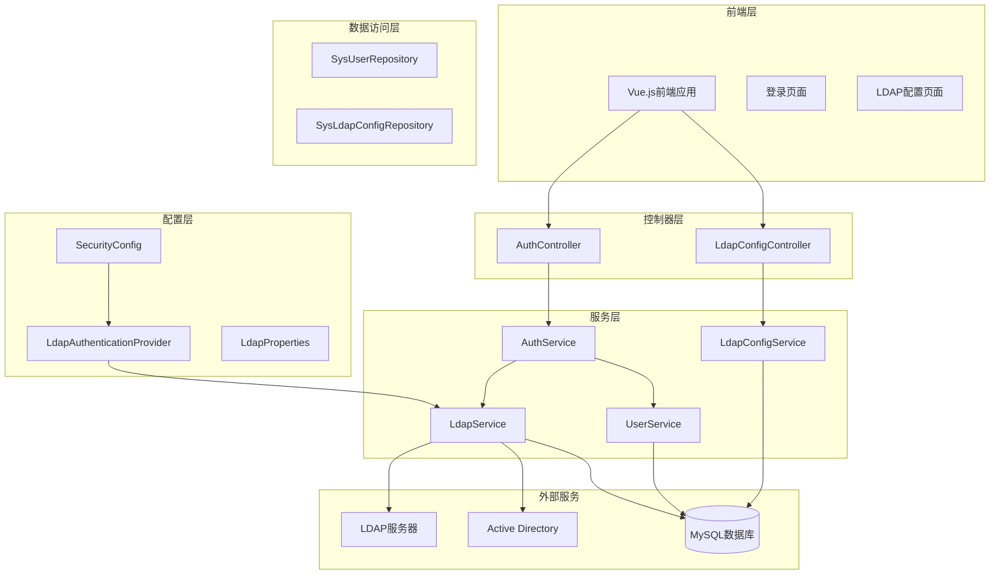
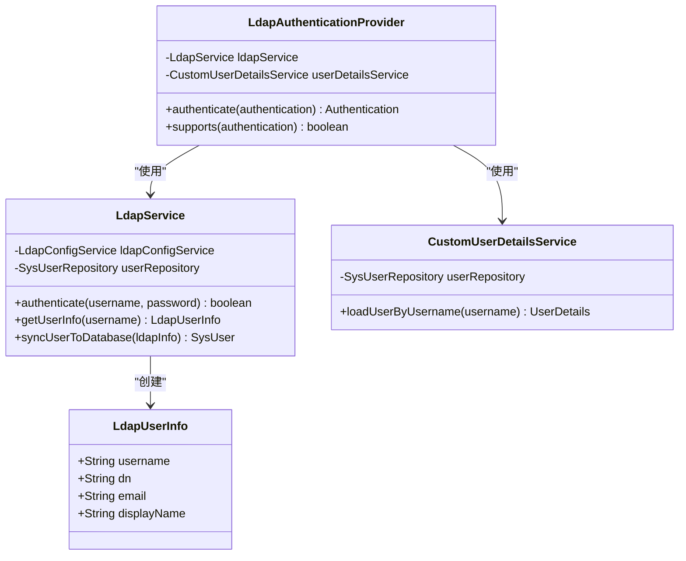
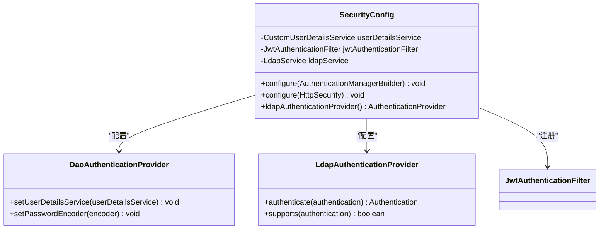
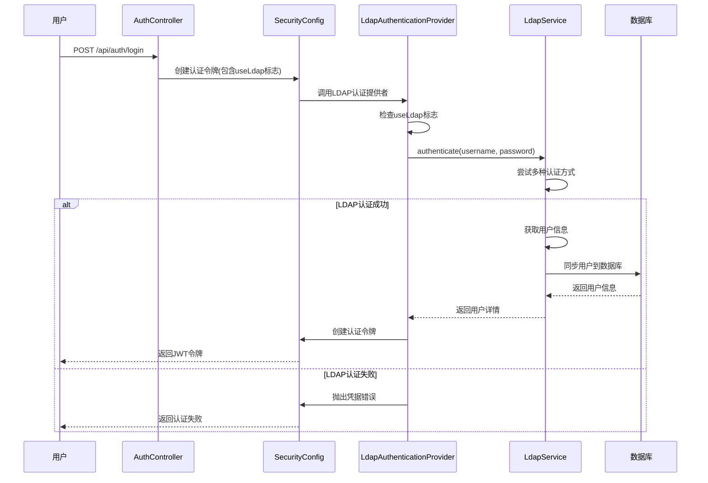
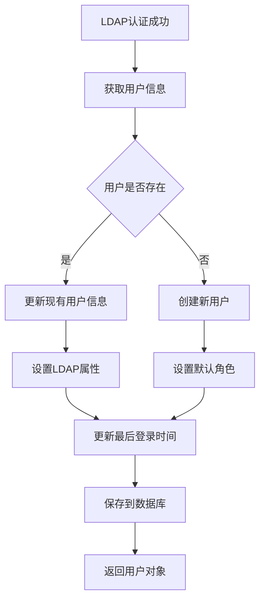
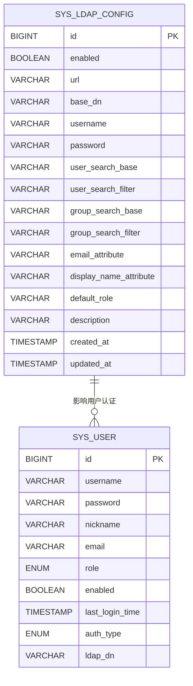
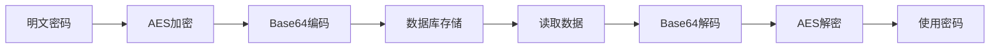
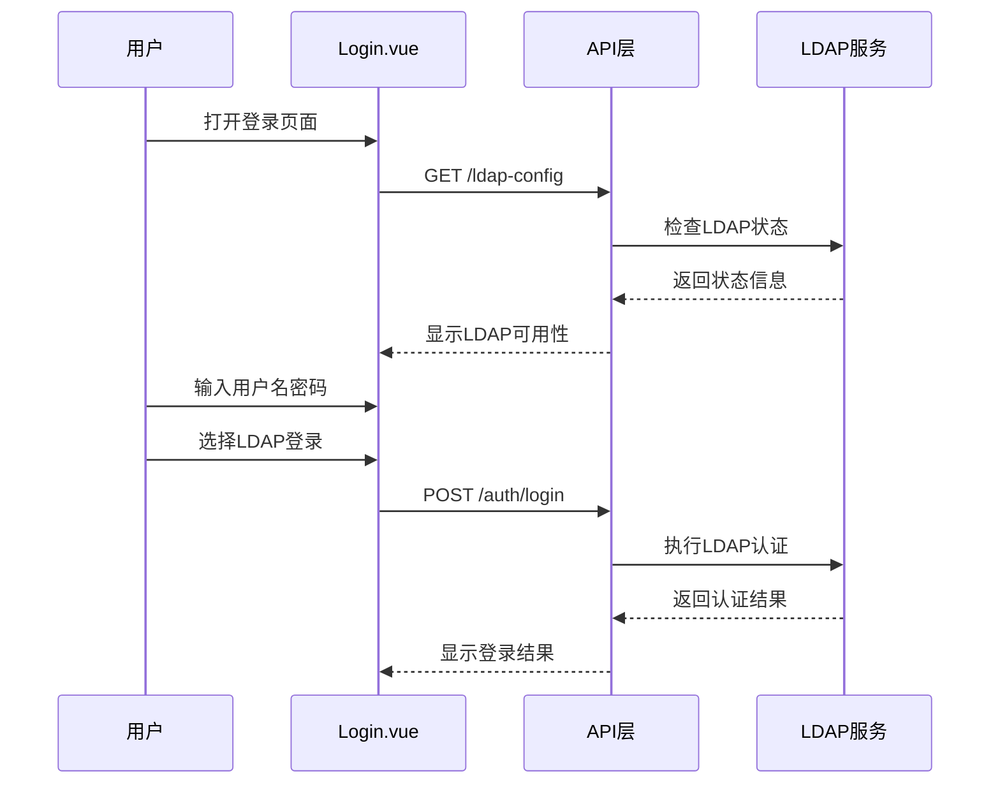
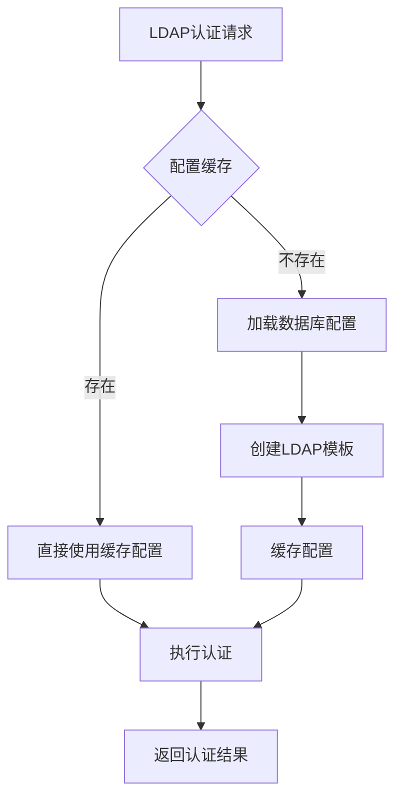

# LDAP企业级目录服务认证

<cite>
**本文档引用的文件**
- [LdapAuthenticationProvider.java](file://backend/src/main/java/com/fieldcheck/config/LdapAuthenticationProvider.java)
- [LdapProperties.java](file://backend/src/main/java/com/fieldcheck/config/LdapProperties.java)
- [SecurityConfig.java](file://backend/src/main/java/com/fieldcheck/config/SecurityConfig.java)
- [LdapService.java](file://backend/src/main/java/com/fieldcheck/service/LdapService.java)
- [LdapConfigService.java](file://backend/src/main/java/com/fieldcheck/service/LdapConfigService.java)
- [SysLdapConfig.java](file://backend/src/main/java/com/fieldcheck/entity/SysLdapConfig.java)
- [CustomUserDetailsService.java](file://backend/src/main/java/com/fieldcheck/security/CustomUserDetailsService.java)
- [application.yml](file://backend/src/main/resources/application.yml)
- [ldap.ts](file://frontend/src/api/ldap.ts)
- [LdapConfig.vue](file://frontend/src/views/system/LdapConfig.vue)
- [Login.vue](file://frontend/src/views/auth/Login.vue)
- [LdapConfigController.java](file://backend/src/main/java/com/fieldcheck/controller/LdapConfigController.java)
- [AuthController.java](file://backend/src/main/java/com/fieldcheck/controller/AuthController.java)
- [LdapConfigDTO.java](file://backend/src/main/java/com/fieldcheck/dto/LdapConfigDTO.java)
- [SysUser.java](file://backend/src/main/java/com/fieldcheck/entity/SysUser.java)
- [AESUtil.java](file://backend/src/main/java/com/fieldcheck/util/AESUtil.java)
</cite>

## 目录
1. [项目概述](#项目概述)
2. [系统架构](#系统架构)
3. [核心组件分析](#核心组件分析)
4. [LDAP认证流程](#ldap认证流程)
5. [配置管理](#配置管理)
6. [安全机制](#安全机制)
7. [前端集成](#前端集成)
8. [性能考虑](#性能考虑)
9. [故障排除指南](#故障排除指南)
10. [总结](#总结)

## 项目概述

本项目是一个基于Spring Boot的企业级目录服务认证系统，集成了LDAP/Active Directory认证功能。系统支持本地认证和LDAP双重认证模式，提供完整的用户身份验证、授权管理和审计日志功能。

该系统采用现代化的微服务架构设计，通过Spring Security实现统一的安全控制，结合Spring LDAP提供企业级目录服务集成能力。系统支持多种LDAP服务器类型，包括OpenLDAP、Active Directory等主流目录服务。

## 系统架构

**图表来源**
- [SecurityConfig.java](file://backend/src/main/java/com/fieldcheck/config/SecurityConfig.java#L26-L77)
- [LdapAuthenticationProvider.java](file://backend/src/main/java/com/fieldcheck/config/LdapAuthenticationProvider.java#L17-L79)
- [LdapService.java](file://backend/src/main/java/com/fieldcheck/service/LdapService.java#L24-L274)

## 核心组件分析

### 认证提供者组件

LDAP认证提供者是系统的核心组件，负责处理LDAP身份验证请求：

**图表来源**
- [LdapAuthenticationProvider.java](file://backend/src/main/java/com/fieldcheck/config/LdapAuthenticationProvider.java#L17-L79)
- [LdapService.java](file://backend/src/main/java/com/fieldcheck/service/LdapService.java#L266-L272)
- [CustomUserDetailsService.java](file://backend/src/main/java/com/fieldcheck/security/CustomUserDetailsService.java#L17-L37)

### 安全配置组件

系统采用多提供者认证架构，支持本地和LDAP双重认证：

**图表来源**
- [SecurityConfig.java](file://backend/src/main/java/com/fieldcheck/config/SecurityConfig.java#L26-L77)

**章节来源**
- [LdapAuthenticationProvider.java](file://backend/src/main/java/com/fieldcheck/config/LdapAuthenticationProvider.java#L17-L79)
- [SecurityConfig.java](file://backend/src/main/java/com/fieldcheck/config/SecurityConfig.java#L26-L77)
- [CustomUserDetailsService.java](file://backend/src/main/java/com/fieldcheck/security/CustomUserDetailsService.java#L17-L37)

## LDAP认证流程

### 用户登录认证流程

**图表来源**
- [AuthController.java](file://backend/src/main/java/com/fieldcheck/controller/AuthController.java#L25-L47)
- [LdapAuthenticationProvider.java](file://backend/src/main/java/com/fieldcheck/config/LdapAuthenticationProvider.java#L22-L72)
- [LdapService.java](file://backend/src/main/java/com/fieldcheck/service/LdapService.java#L63-L114)

### LDAP用户同步流程

**图表来源**
- [LdapService.java](file://backend/src/main/java/com/fieldcheck/service/LdapService.java#L229-L261)
- [SysUser.java](file://backend/src/main/java/com/fieldcheck/entity/SysUser.java#L44-L55)

**章节来源**
- [AuthController.java](file://backend/src/main/java/com/fieldcheck/controller/AuthController.java#L25-L47)
- [LdapAuthenticationProvider.java](file://backend/src/main/java/com/fieldcheck/config/LdapAuthenticationProvider.java#L22-L72)
- [LdapService.java](file://backend/src/main/java/com/fieldcheck/service/LdapService.java#L63-L114)

## 配置管理

### LDAP配置实体结构

**图表来源**
- [SysLdapConfig.java](file://backend/src/main/java/com/fieldcheck/entity/SysLdapConfig.java#L18-L63)
- [SysUser.java](file://backend/src/main/java/com/fieldcheck/entity/SysUser.java#L19-L55)

### 配置参数详解

系统支持丰富的LDAP配置选项：

| 配置项 | 默认值 | 描述 | 示例 |
|--------|--------|------|------|
| enabled | false | 是否启用LDAP认证 | true/false |
| url | ldap://localhost:389 | LDAP服务器地址 | ldap://172.16.20.16:389 |
| base-dn | dc=example,dc=com | 基础DN | dc=company,dc=com |
| username | cn=admin,dc=example,dc=com | 管理员DN | cn=admin,cn=users,dc=company,dc=com |
| password | admin | 管理员密码 | 加密存储 |
| user-search-base | ou=users | 用户搜索基础 | ou=employees |
| user-search-filter | (uid={0}) | 用户搜索过滤器 | (sAMAccountName={0}) |
| group-search-base | ou=groups | 组搜索基础 | ou=departments |
| group-search-filter | (member={0}) | 组搜索过滤器 | (member={0}) |
| email-attribute | mail | 邮箱属性映射 | mail/email |
| display-name-attribute | displayName | 显示名属性映射 | displayName/cn |
| default-role | USER | 默认用户角色 | USER/ADMIN |

**章节来源**
- [SysLdapConfig.java](file://backend/src/main/java/com/fieldcheck/entity/SysLdapConfig.java#L18-L63)
- [application.yml](file://backend/src/main/resources/application.yml#L69-L84)
- [LdapConfigDTO.java](file://backend/src/main/java/com/fieldcheck/dto/LdapConfigDTO.java#L8-L39)

## 安全机制

### 密码加密机制

系统采用AES对称加密算法保护敏感配置信息：

**图表来源**
- [AESUtil.java](file://backend/src/main/java/com/fieldcheck/util/AESUtil.java#L15-L45)
- [LdapConfigService.java](file://backend/src/main/java/com/fieldcheck/service/LdapConfigService.java#L74-L79)

### 认证流程安全控制

系统实现了多层次的安全防护机制：

1. **双因子认证控制**：通过useLdap标志精确控制认证路径
2. **凭据验证**：支持多种认证格式（DN、UPN、域\\用户名）
3. **用户同步**：自动创建和更新LDAP用户信息
4. **权限继承**：从LDAP组信息继承用户权限

**章节来源**
- [LdapAuthenticationProvider.java](file://backend/src/main/java/com/fieldcheck/config/LdapAuthenticationProvider.java#L27-L39)
- [LdapService.java](file://backend/src/main/java/com/fieldcheck/service/LdapService.java#L71-L114)

## 前端集成

### 登录页面集成

前端系统提供了完整的LDAP认证界面集成：

**图表来源**
- [Login.vue](file://frontend/src/views/auth/Login.vue#L82-L90)
- [ldap.ts](file://frontend/src/api/ldap.ts#L24-L27)

### 配置管理界面

LDAP配置管理提供了直观的图形化界面：

| 功能特性 | 描述 | 实现方式 |
|----------|------|----------|
| 连接测试 | 测试LDAP服务器连通性 | POST /ldap-config/test |
| 配置保存 | 保存LDAP服务器配置 | POST /ldap-config |
| 状态查询 | 查询LDAP启用状态 | GET /ldap-config |
| 协议支持 | 支持ldap://和ldaps:// | 自动协议检测 |

**章节来源**
- [LdapConfig.vue](file://frontend/src/views/system/LdapConfig.vue#L133-L203)
- [ldap.ts](file://frontend/src/api/ldap.ts#L24-L42)

## 性能考虑

### 连接池优化

系统通过以下方式优化LDAP连接性能：

1. **延迟初始化**：仅在需要时创建LDAP模板实例
2. **连接复用**：重用现有的LDAP连接减少开销
3. **超时配置**：合理设置连接超时和操作超时
4. **异常处理**：优雅处理LDAP服务器不可用情况

### 缓存策略

**图表来源**
- [LdapService.java](file://backend/src/main/java/com/fieldcheck/service/LdapService.java#L37-L58)

## 故障排除指南

### 常见问题诊断

| 问题类型 | 症状 | 可能原因 | 解决方案 |
|----------|------|----------|----------|
| 连接失败 | LDAP连接超时 | 服务器地址错误、网络不通 | 检查URL和防火墙设置 |
| 认证失败 | 用户名密码正确但登录失败 | 用户不存在、密码错误 | 验证用户DN和密码 |
| 属性映射错误 | 用户信息不完整 | 属性名称配置错误 | 检查email和displayName属性 |
| 权限不足 | 无法访问系统功能 | 角色配置错误 | 检查用户角色和权限 |

### 日志分析

系统提供了详细的日志记录机制：

1. **认证日志**：记录所有认证尝试和结果
2. **配置日志**：记录LDAP配置变更历史
3. **错误日志**：记录认证过程中的异常情况
4. **审计日志**：记录用户操作和系统事件

**章节来源**
- [LdapService.java](file://backend/src/main/java/com/fieldcheck/service/LdapService.java#L71-L114)
- [LdapAuthenticationProvider.java](file://backend/src/main/java/com/fieldcheck/config/LdapAuthenticationProvider.java#L41-L71)

## 总结

本LDAP企业级目录服务认证系统提供了完整的企业级身份认证解决方案。系统具有以下核心优势：

1. **灵活的认证模式**：支持本地认证和LDAP双重认证
2. **企业级兼容性**：支持OpenLDAP、Active Directory等多种LDAP服务器
3. **安全可靠**：采用AES加密保护敏感配置，提供完善的审计日志
4. **易于管理**：提供直观的图形化配置界面和连接测试功能
5. **高性能**：通过连接池和缓存机制优化认证性能

系统适用于各种规模的企业环境，能够满足复杂的企业级目录服务认证需求。通过合理的配置和部署，可以为企业提供安全、稳定、高效的身份认证服务。