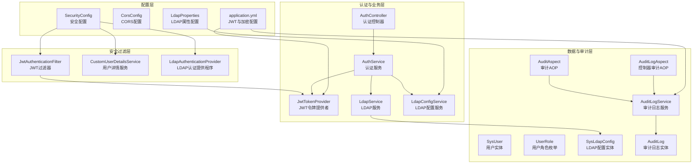
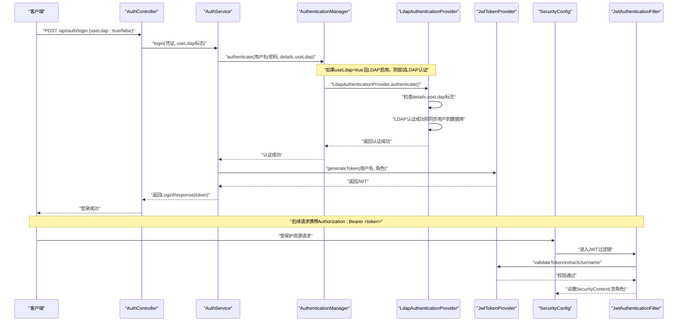
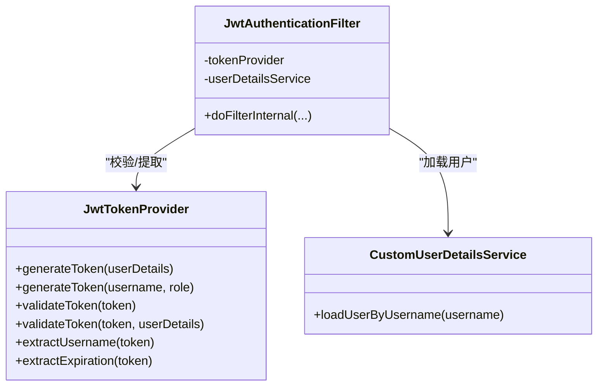
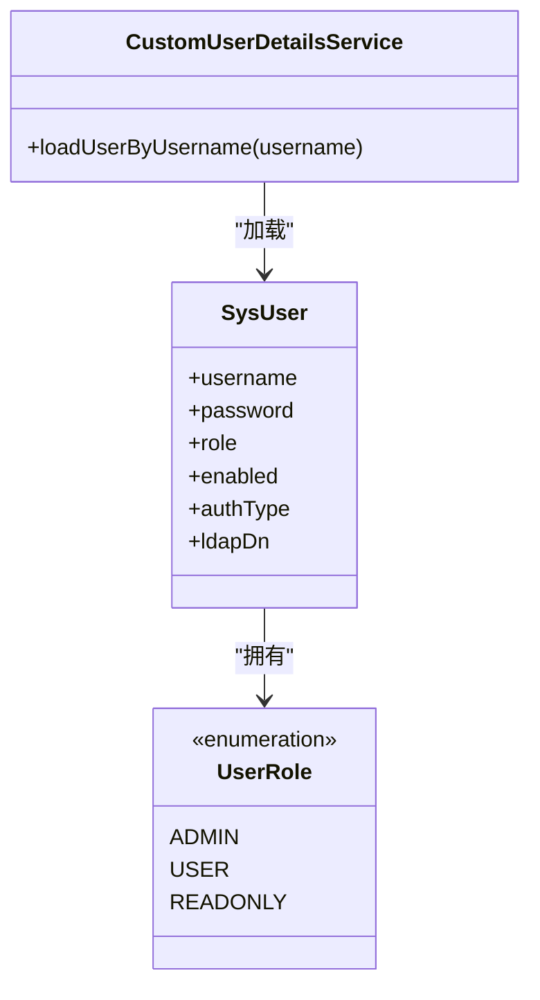
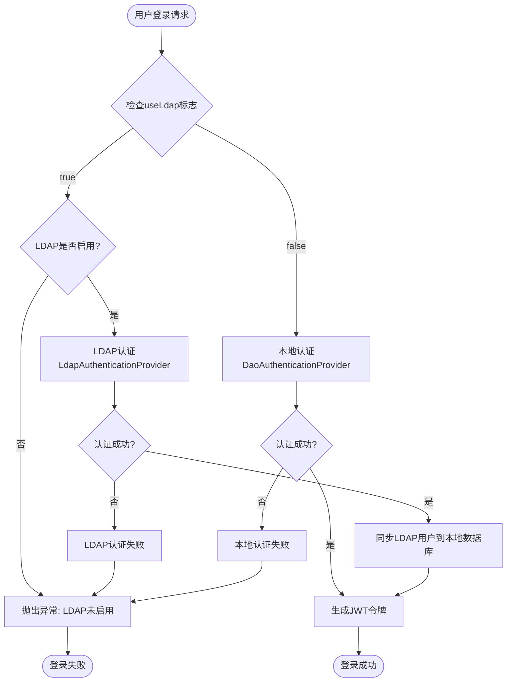
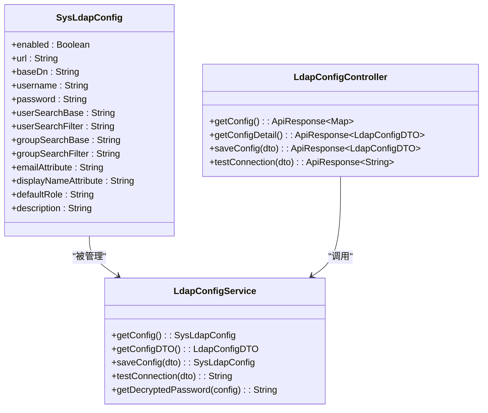
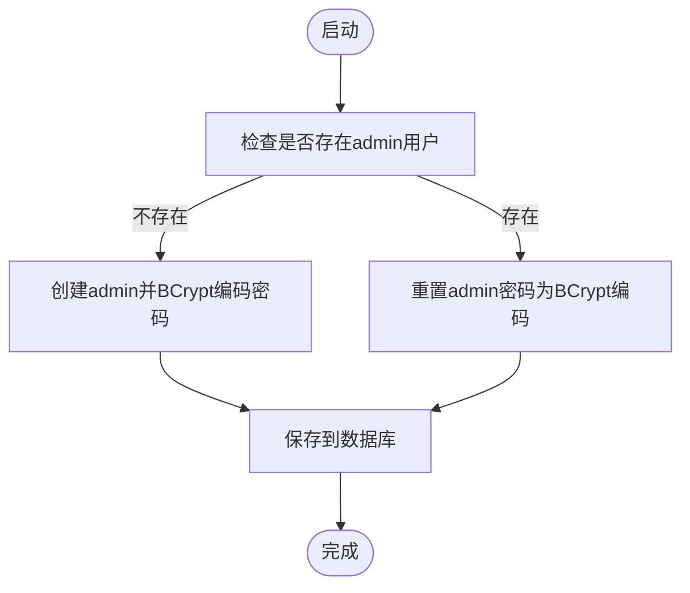
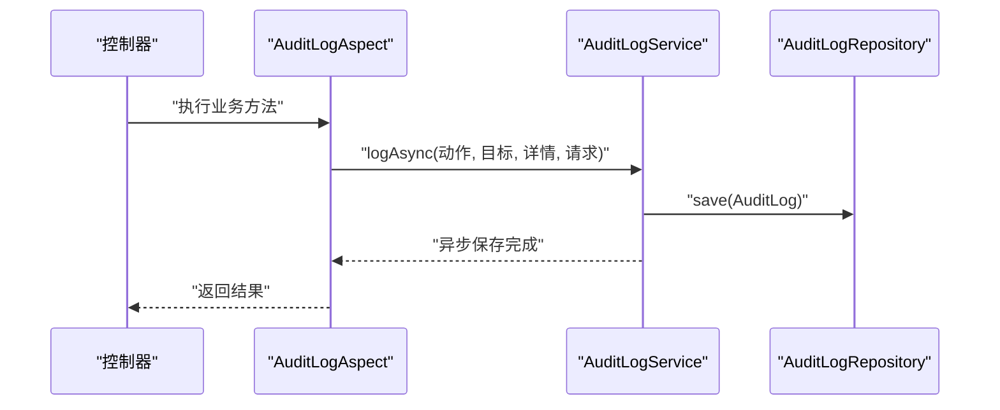
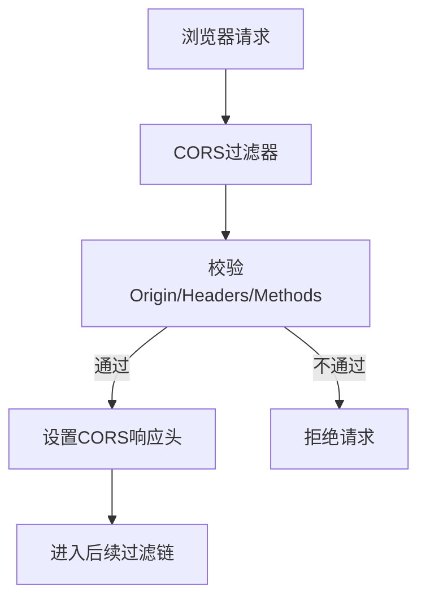
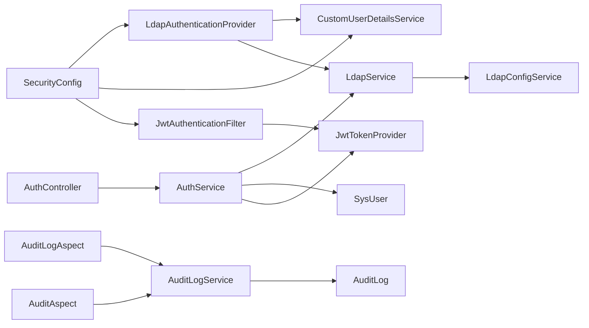

# 安全与认证

<cite>
**本文引用的文件**
- [JwtTokenProvider.java](file://backend/src/main/java/com/fieldcheck/security/JwtTokenProvider.java)
- [JwtAuthenticationFilter.java](file://backend/src/main/java/com/fieldcheck/security/JwtAuthenticationFilter.java)
- [CustomUserDetailsService.java](file://backend/src/main/java/com/fieldcheck/security/CustomUserDetailsService.java)
- [SecurityConfig.java](file://backend/src/main/java/com/fieldcheck/config/SecurityConfig.java)
- [CorsConfig.java](file://backend/src/main/java/com/fieldcheck/config/CorsConfig.java)
- [AuthController.java](file://backend/src/main/java/com/fieldcheck/controller/AuthController.java)
- [AuthService.java](file://backend/src/main/java/com/fieldcheck/service/AuthService.java)
- [SysUser.java](file://backend/src/main/java/com/fieldcheck/entity/SysUser.java)
- [UserRole.java](file://backend/src/main/java/com/fieldcheck/entity/UserRole.java)
- [AuditAspect.java](file://backend/src/main/java/com/fieldcheck/aspect/AuditAspect.java)
- [AuditLogAspect.java](file://backend/src/main/java/com/fieldcheck/aspect/AuditLogAspect.java)
- [AuditLogService.java](file://backend/src/main/java/com/fieldcheck/service/AuditLogService.java)
- [AuditLog.java](file://backend/src/main/java/com/fieldcheck/entity/AuditLog.java)
- [application.yml](file://backend/src/main/resources/application.yml)
- [AESUtil.java](file://backend/src/main/java/com/fieldcheck/util/AESUtil.java)
- [LdapAuthenticationProvider.java](file://backend/src/main/java/com/fieldcheck/config/LdapAuthenticationProvider.java)
- [LdapService.java](file://backend/src/main/java/com/fieldcheck/service/LdapService.java)
- [LdapConfigService.java](file://backend/src/main/java/com/fieldcheck/service/LdapConfigService.java)
- [LdapProperties.java](file://backend/src/main/java/com/fieldcheck/config/LdapProperties.java)
- [SysLdapConfig.java](file://backend/src/main/java/com/fieldcheck/entity/SysLdapConfig.java)
- [LdapConfigController.java](file://backend/src/main/java/com/fieldcheck/controller/LdapConfigController.java)
- [LdapConfigDTO.java](file://backend/src/main/java/com/fieldcheck/dto/LdapConfigDTO.java)
- [ldap.ts](file://frontend/src/api/ldap.ts)
</cite>

## 更新摘要
**所做更改**
- 新增LDAP双认证能力章节，详细说明混合认证模式的实现
- 更新认证机制章节，增加LDAP认证流程说明
- 新增LDAP配置管理章节，涵盖系统配置与前端API
- 更新用户实体，增加LDAP认证类型支持
- 新增LDAP用户同步机制说明
- 更新安全配置，支持LDAP认证提供程序注册

## 目录
1. [简介](#简介)
2. [项目结构](#项目结构)
3. [核心组件](#核心组件)
4. [架构总览](#架构总览)
5. [详细组件分析](#详细组件分析)
6. [依赖分析](#依赖分析)
7. [性能考量](#性能考量)
8. [故障排查指南](#故障排查指南)
9. [结论](#结论)
10. [附录](#附录)

## 简介
本文件面向MySQL风险字段检查平台的安全与认证体系，系统性阐述以下主题：
- JWT认证机制的实现原理与配置要点
- 基于角色的权限控制（RBAC），包括角色定义与授权流程
- **新增LDAP双认证能力**，支持本地认证与LDAP认证并存的混合认证模式
- 密码加密存储策略（BCrypt）与敏感信息保护（AES）
- 审计日志系统（自动记录与异步落库、登录审计）
- 跨域资源共享（CORS）配置与安全注意事项
- 会话管理与安全响应头策略
- 安全最佳实践、常见威胁防护与漏洞预防/检测方法

## 项目结构
后端采用Spring Boot工程，安全与认证相关代码主要分布在以下包：
- config：全局安全配置、CORS配置、**LDAP认证提供程序**
- security：JWT工具、过滤器、用户详情服务
- controller/service：认证控制器与业务服务、**LDAP配置管理**
- entity：用户实体与审计日志实体、**LDAP配置实体**
- aspect：审计AOP切面
- util：AES加解密工具
- resources：应用配置（含JWT与加密密钥）

**图表来源**
- [SecurityConfig.java](file://backend/src/main/java/com/fieldcheck/config/SecurityConfig.java#L23-L58)
- [CorsConfig.java](file://backend/src/main/java/com/fieldcheck/config/CorsConfig.java#L12-L28)
- [LdapAuthenticationProvider.java](file://backend/src/main/java/com/fieldcheck/config/LdapAuthenticationProvider.java#L17-L79)
- [LdapService.java](file://backend/src/main/java/com/fieldcheck/service/LdapService.java#L24-L274)
- [LdapConfigService.java](file://backend/src/main/java/com/fieldcheck/service/LdapConfigService.java#L16-L142)
- [SysUser.java](file://backend/src/main/java/com/fieldcheck/entity/SysUser.java#L19-L57)
- [SysLdapConfig.java](file://backend/src/main/java/com/fieldcheck/entity/SysLdapConfig.java#L18-L64)

**章节来源**
- [SecurityConfig.java](file://backend/src/main/java/com/fieldcheck/config/SecurityConfig.java#L23-L58)
- [CorsConfig.java](file://backend/src/main/java/com/fieldcheck/config/CorsConfig.java#L12-L28)
- [application.yml](file://backend/src/main/resources/application.yml#L55-L62)

## 核心组件
- JWT令牌生成与校验：基于HS256签名算法，支持自定义声明（角色）、过期时间配置
- JWT请求过滤：从Authorization头解析Bearer Token，加载用户详情并注入Security上下文
- 用户详情服务：从数据库加载用户，装配角色权限（ROLE_ADMIN/ROLE_USER/ROLE_READONLY）
- **LDAP认证提供程序**：支持LDAP/AD认证，自动用户同步与角色分配
- **混合认证模式**：本地认证与LDAP认证并存，用户可选择认证方式
- 安全配置：禁用CSRF，启用CORS，无状态会话（STATELESS），开放特定路径
- 审计日志：自动记录控制器操作与异常，异步写入数据库；登录单独记录
- 加解密工具：AES/CBC/PKCS5Padding用于敏感信息（如数据库连接密码）的存储与解密

**章节来源**
- [JwtTokenProvider.java](file://backend/src/main/java/com/fieldcheck/security/JwtTokenProvider.java#L16-L94)
- [JwtAuthenticationFilter.java](file://backend/src/main/java/com/fieldcheck/security/JwtAuthenticationFilter.java#L22-L59)
- [CustomUserDetailsService.java](file://backend/src/main/java/com/fieldcheck/security/CustomUserDetailsService.java#L17-L36)
- [SecurityConfig.java](file://backend/src/main/java/com/fieldcheck/config/SecurityConfig.java#L23-L58)
- [LdapAuthenticationProvider.java](file://backend/src/main/java/com/fieldcheck/config/LdapAuthenticationProvider.java#L17-L79)
- [LdapService.java](file://backend/src/main/java/com/fieldcheck/service/LdapService.java#L63-L114)
- [AuditLogService.java](file://backend/src/main/java/com/fieldcheck/service/AuditLogService.java#L21-L132)
- [AESUtil.java](file://backend/src/main/java/com/fieldcheck/util/AESUtil.java#L10-L54)

## 架构总览
下图展示认证与授权、审计日志、CORS与JWT的关键交互，以及LDAP双认证的集成。

**图表来源**
- [AuthController.java](file://backend/src/main/java/com/fieldcheck/controller/AuthController.java#L25-L47)
- [AuthService.java](file://backend/src/main/java/com/fieldcheck/service/AuthService.java#L58-L119)
- [LdapAuthenticationProvider.java](file://backend/src/main/java/com/fieldcheck/config/LdapAuthenticationProvider.java#L22-L72)
- [JwtTokenProvider.java](file://backend/src/main/java/com/fieldcheck/security/JwtTokenProvider.java#L32-L54)
- [SecurityConfig.java](file://backend/src/main/java/com/fieldcheck/config/SecurityConfig.java#L32-L47)
- [JwtAuthenticationFilter.java](file://backend/src/main/java/com/fieldcheck/security/JwtAuthenticationFilter.java#L27-L49)

## 详细组件分析

### JWT认证机制
- 令牌生成：包含签发时间、过期时间、主体（用户名）、自定义声明（角色），使用HS256签名
- 令牌校验：解析签名、验证过期、确认主体与用户一致
- 过滤器集成：从Authorization头提取Bearer Token，校验后将认证信息注入Security上下文

**图表来源**
- [JwtTokenProvider.java](file://backend/src/main/java/com/fieldcheck/security/JwtTokenProvider.java#L16-L94)
- [JwtAuthenticationFilter.java](file://backend/src/main/java/com/fieldcheck/security/JwtAuthenticationFilter.java#L22-L59)
- [CustomUserDetailsService.java](file://backend/src/main/java/com/fieldcheck/security/CustomUserDetailsService.java#L17-L36)

**章节来源**
- [JwtTokenProvider.java](file://backend/src/main/java/com/fieldcheck/security/JwtTokenProvider.java#L16-L94)
- [JwtAuthenticationFilter.java](file://backend/src/main/java/com/fieldcheck/security/JwtAuthenticationFilter.java#L22-L59)
- [application.yml](file://backend/src/main/resources/application.yml#L55-L58)

### 基于角色的权限控制（RBAC）
- 角色枚举：ADMIN（全部权限）、USER（可管理自身任务）、READONLY（只读）
- 权限装配：用户详情服务为每个用户装配"ROLE_"前缀的权限
- 授权策略：SecurityConfig对/api/auth/**放行，其余受保护接口需认证；方法级预授权通过@EnableGlobalMethodSecurity开启

**图表来源**
- [SysUser.java](file://backend/src/main/java/com/fieldcheck/entity/SysUser.java#L19-L57)
- [UserRole.java](file://backend/src/main/java/com/fieldcheck/entity/UserRole.java#L3-L7)
- [CustomUserDetailsService.java](file://backend/src/main/java/com/fieldcheck/security/CustomUserDetailsService.java#L17-L36)
- [SecurityConfig.java](file://backend/src/main/java/com/fieldcheck/config/SecurityConfig.java#L20-L22)

**章节来源**
- [SysUser.java](file://backend/src/main/java/com/fieldcheck/entity/SysUser.java#L19-L57)
- [UserRole.java](file://backend/src/main/java/com/fieldcheck/entity/UserRole.java#L3-L7)
- [CustomUserDetailsService.java](file://backend/src/main/java/com/fieldcheck/security/CustomUserDetailsService.java#L17-L36)
- [SecurityConfig.java](file://backend/src/main/java/com/fieldcheck/config/SecurityConfig.java#L20-L22)

### LDAP双认证能力
**新增** 平台支持LDAP双认证能力，实现本地认证与LDAP认证并存的混合认证模式：

- **认证提供程序注册**：SecurityConfig同时注册本地认证提供程序和LDAP认证提供程序
- **认证流程控制**：通过LoginRequest中的useLdap标志精确控制认证方式
- **LDAP认证实现**：LdapAuthenticationProvider仅在明确请求时才执行LDAP认证
- **用户同步机制**：LDAP认证成功后自动同步用户信息到本地数据库
- **认证类型区分**：SysUser实体新增AuthType枚举，区分LOCAL和LDAP用户类型

**图表来源**
- [AuthService.java](file://backend/src/main/java/com/fieldcheck/service/AuthService.java#L58-L119)
- [LdapAuthenticationProvider.java](file://backend/src/main/java/com/fieldcheck/config/LdapAuthenticationProvider.java#L22-L72)
- [LdapService.java](file://backend/src/main/java/com/fieldcheck/service/LdapService.java#L229-L261)

**章节来源**
- [AuthService.java](file://backend/src/main/java/com/fieldcheck/service/AuthService.java#L58-L119)
- [LdapAuthenticationProvider.java](file://backend/src/main/java/com/fieldcheck/config/LdapAuthenticationProvider.java#L17-L79)
- [LdapService.java](file://backend/src/main/java/com/fieldcheck/service/LdapService.java#L63-L114)
- [SysUser.java](file://backend/src/main/java/com/fieldcheck/entity/SysUser.java#L52-L55)

### LDAP配置管理系统
**新增** 完整的LDAP配置管理功能，支持系统级LDAP认证配置：

- **配置实体**：SysLdapConfig实体存储LDAP服务器连接信息
- **配置服务**：LdapConfigService提供配置的增删改查和连接测试
- **加密存储**：管理员密码使用AES加密存储
- **前端API**：提供LDAP状态查询、配置获取、连接测试等接口
- **权限控制**：LDAP配置管理仅限ADMIN角色访问

**图表来源**
- [SysLdapConfig.java](file://backend/src/main/java/com/fieldcheck/entity/SysLdapConfig.java#L18-L64)
- [LdapConfigService.java](file://backend/src/main/java/com/fieldcheck/service/LdapConfigService.java#L26-L140)
- [LdapConfigController.java](file://backend/src/main/java/com/fieldcheck/controller/LdapConfigController.java#L27-L77)

**章节来源**
- [SysLdapConfig.java](file://backend/src/main/java/com/fieldcheck/entity/SysLdapConfig.java#L18-L64)
- [LdapConfigService.java](file://backend/src/main/java/com/fieldcheck/service/LdapConfigService.java#L26-L140)
- [LdapConfigController.java](file://backend/src/main/java/com/fieldcheck/controller/LdapConfigController.java#L27-L77)
- [LdapProperties.java](file://backend/src/main/java/com/fieldcheck/config/LdapProperties.java#L10-L35)

### 密码加密存储策略
- 登录认证使用BCryptPasswordEncoder进行密码编码与比对
- 默认管理员账户在启动时初始化，密码以BCrypt编码持久化
- **LDAP用户密码**：LDAP用户不存储本地密码，使用LDAP认证
- 建议生产环境禁止默认账号存在，或强制要求首次登录修改密码

**图表来源**
- [AuthService.java](file://backend/src/main/java/com/fieldcheck/service/AuthService.java#L34-L56)

**章节来源**
- [AuthService.java](file://backend/src/main/java/com/fieldcheck/service/AuthService.java#L34-L56)
- [SecurityConfig.java](file://backend/src/main/java/com/fieldcheck/config/SecurityConfig.java#L55-L58)

### 审计日志系统
- 自动审计AOP：对标注@Auditable的方法进行环绕，记录操作、目标、详情、IP、UA等
- 控制器审计AOP：对大部分Controller方法进行环绕，自动识别动作类型与目标类型
- 登录审计：AuthController在登录成功/失败时分别记录审计日志
- 异步落库：AuditLogService提供异步方法，避免阻塞主请求线程

**图表来源**
- [AuditLogAspect.java](file://backend/src/main/java/com/fieldcheck/aspect/AuditLogAspect.java#L43-L115)
- [AuditLogService.java](file://backend/src/main/java/com/fieldcheck/service/AuditLogService.java#L28-L52)
- [AuditLog.java](file://backend/src/main/java/com/fieldcheck/entity/AuditLog.java#L21-L53)

**章节来源**
- [AuditAspect.java](file://backend/src/main/java/com/fieldcheck/aspect/AuditAspect.java#L25-L146)
- [AuditLogAspect.java](file://backend/src/main/java/com/fieldcheck/aspect/AuditLogAspect.java#L28-L240)
- [AuditLogService.java](file://backend/src/main/java/com/fieldcheck/service/AuditLogService.java#L21-L132)
- [AuditLog.java](file://backend/src/main/java/com/fieldcheck/entity/AuditLog.java#L21-L53)
- [AuthController.java](file://backend/src/main/java/com/fieldcheck/controller/AuthController.java#L25-L47)

### 跨域资源共享（CORS）配置与安全考虑
- 配置项：允许凭据、允许所有源模式、允许所有头、允许常用方法、暴露必要响应头
- 安全建议：生产环境应限制AllowedOriginPatterns为可信域名，避免使用通配符；对敏感接口增加额外校验

**图表来源**
- [CorsConfig.java](file://backend/src/main/java/com/fieldcheck/config/CorsConfig.java#L14-L27)

**章节来源**
- [CorsConfig.java](file://backend/src/main/java/com/fieldcheck/config/CorsConfig.java#L12-L28)

### 会话管理与安全头
- 会话策略：无状态（STATELESS），不使用Cookie会话
- CSRF：已禁用（REST API场景通常不需要）
- 其他安全头：未显式配置，建议结合Nginx或网关统一添加（如Strict-Transport-Security、X-Frame-Options、X-Content-Type-Options、Referrer-Policy等）

**章节来源**
- [SecurityConfig.java](file://backend/src/main/java/com/fieldcheck/config/SecurityConfig.java#L47-L48)

### 敏感信息加密存储（AES）
- 使用AES/CBC/PKCS5Padding对敏感数据（如数据库连接密码）进行加解密
- 密钥长度规范化为256位，IV取自密钥派生
- **LDAP管理员密码**：使用AES加密存储在SysLdapConfig表中
- 建议生产环境将密钥置于安全位置（如KMS或环境变量），避免硬编码

**章节来源**
- [AESUtil.java](file://backend/src/main/java/com/fieldcheck/util/AESUtil.java#L10-L54)
- [application.yml](file://backend/src/main/resources/application.yml#L60-L62)
- [LdapConfigService.java](file://backend/src/main/java/com/fieldcheck/service/LdapConfigService.java#L135-L140)

## 依赖分析
- 组件耦合
  - SecurityConfig依赖JwtAuthenticationFilter、CustomUserDetailsService、**LdapAuthenticationProvider**
  - JwtAuthenticationFilter依赖JwtTokenProvider与CustomUserDetailsService
  - AuthService依赖AuthenticationManager、JwtTokenProvider、SysUserRepository、PasswordEncoder、**LdapService**
  - **LdapAuthenticationProvider依赖LdapService与CustomUserDetailsService**
  - **LdapService依赖LdapConfigService与SysUserRepository**
  - AuditLogService依赖AuditLogRepository与Security上下文
- 外部依赖
  - JWT库（io.jsonwebtoken）用于令牌生成与解析
  - Spring Security用于认证与授权
  - Spring AOP用于审计切面
  - **Spring LDAP用于LDAP目录服务集成**

**图表来源**
- [SecurityConfig.java](file://backend/src/main/java/com/fieldcheck/config/SecurityConfig.java#L32-L47)
- [JwtAuthenticationFilter.java](file://backend/src/main/java/com/fieldcheck/security/JwtAuthenticationFilter.java#L22-L59)
- [AuthService.java](file://backend/src/main/java/com/fieldcheck/service/AuthService.java#L28-L32)
- [LdapAuthenticationProvider.java](file://backend/src/main/java/com/fieldcheck/config/LdapAuthenticationProvider.java#L19-L20)
- [LdapService.java](file://backend/src/main/java/com/fieldcheck/service/LdapService.java#L26-L27)
- [AuditLogService.java](file://backend/src/main/java/com/fieldcheck/service/AuditLogService.java#L21-L132)
- [AuditAspect.java](file://backend/src/main/java/com/fieldcheck/aspect/AuditAspect.java#L25-L146)
- [AuditLogAspect.java](file://backend/src/main/java/com/fieldcheck/aspect/AuditLogAspect.java#L28-L240)

## 性能考量
- JWT过滤器：每次请求都会进行令牌解析与用户加载，建议合理设置过期时间与缓存用户信息（如需要）
- **LDAP认证性能**：LDAP认证可能成为性能瓶颈，建议配置合适的超时时间和连接池
- 审计日志：异步写入避免阻塞主线程；大量写入时建议优化数据库索引与批量入库策略
- 数据库连接池：HikariCP参数已配置，注意监控连接泄漏与超时
- CORS：生产环境限制允许源，减少不必要的预检请求

## 故障排查指南
- 登录失败
  - 检查用户名/密码是否正确，确认用户启用状态
  - **LDAP用户必须使用LDAP登录，本地用户不能使用LDAP登录**
  - 查看AuthController的日志记录与异常栈
- 令牌无效
  - 确认Authorization头格式为Bearer <token>
  - 校验JWT密钥与过期时间配置
- 权限不足
  - 确认用户角色与目标接口所需权限匹配
  - 检查方法级注解与@EnableGlobalMethodSecurity配置
- **LDAP认证问题**
  - **确认LDAP配置已启用且连接测试通过**
  - **检查LDAP服务器可达性和凭据正确性**
  - **验证用户DN构建和搜索过滤器配置**
- 审计日志缺失
  - 确认AOP切面是否生效，异步线程池是否正常
  - 检查AuditLog表结构与索引
- CORS问题
  - 核对AllowedOriginPatterns与请求头是否匹配
  - 生产环境避免使用通配符

**章节来源**
- [AuthController.java](file://backend/src/main/java/com/fieldcheck/controller/AuthController.java#L25-L47)
- [AuthService.java](file://backend/src/main/java/com/fieldcheck/service/AuthService.java#L76-L89)
- [JwtTokenProvider.java](file://backend/src/main/java/com/fieldcheck/security/JwtTokenProvider.java#L86-L93)
- [SecurityConfig.java](file://backend/src/main/java/com/fieldcheck/config/SecurityConfig.java#L50-L57)
- [LdapService.java](file://backend/src/main/java/com/fieldcheck/service/LdapService.java#L63-L114)
- [AuditLogService.java](file://backend/src/main/java/com/fieldcheck/service/AuditLogService.java#L28-L52)
- [CorsConfig.java](file://backend/src/main/java/com/fieldcheck/config/CorsConfig.java#L14-L27)

## 结论
该平台采用JWT无状态认证、基于角色的权限控制、完善的审计日志与CORS配置，配合BCrypt与AES加密策略，构建了较为完整的安全体系。**新增的LDAP双认证能力进一步增强了平台的灵活性和企业集成能力**，支持本地认证与LDAP认证并存的混合模式。建议在生产环境中进一步收紧CORS范围、强化密钥管理、完善安全头策略，并持续监控与加固访问控制与日志分析能力。

## 附录

### 安全配置最佳实践清单
- 密钥与配置
  - JWT密钥长度≥256bit，定期轮换
  - AES密钥置于安全位置，避免硬编码
  - **LDAP管理员密码必须加密存储**
- 认证与授权
  - 禁止默认管理员账号长期存在
  - **严格限制CORS允许源**
  - **对敏感接口启用更细粒度的权限控制**
  - **合理配置LDAP认证优先级和回退机制**
- 审计与监控
  - 定期审查审计日志，建立告警规则
  - 对异常登录与高危操作进行实时告警
  - **监控LDAP认证成功率和失败原因**
- 会话与传输
  - 使用HTTPS，配置HSTS
  - 明确安全响应头策略

### 常见安全威胁与防护
- JWT劫持/重放
  - 缩短过期时间，启用黑名单或短期令牌
- 跨站脚本（XSS）
  - 输入输出转义，CSP策略，HttpOnly与Secure Cookie（若使用Cookie）
- 跨域伪造（CSRF）
  - REST API通常无需CSRF，但需确保CORS白名单严格
- **强认证与暴力破解**
  - 登录失败次数限制、验证码、多因子认证（MFA）
  - **LDAP用户强制使用LDAP认证，防止绕过**
- 数据泄露
  - 敏感字段AES加密存储，最小化日志输出敏感信息
  - **LDAP连接使用加密通道（LDAPS）**
- **LDAP安全威胁**
  - **配置最小权限原则的LDAP绑定账户**
  - **定期轮换LDAP管理员密码**
  - **监控LDAP异常访问模式**