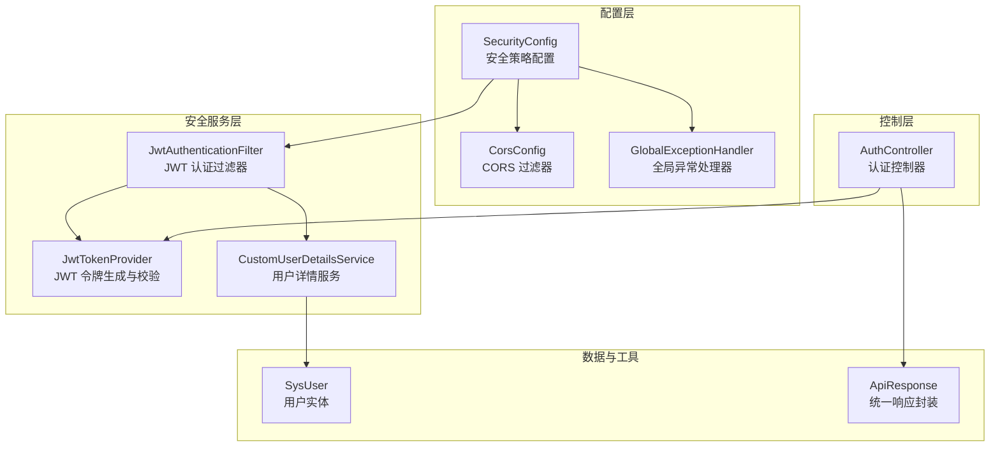
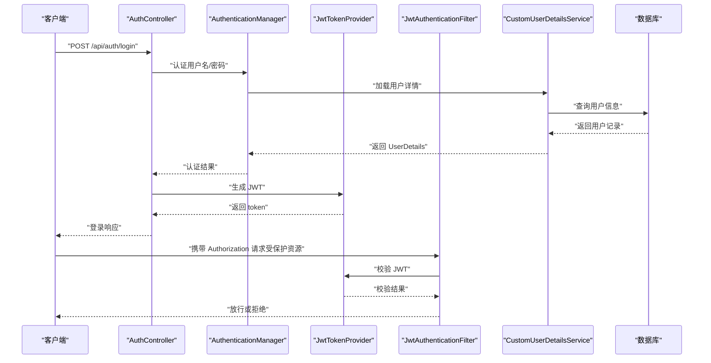
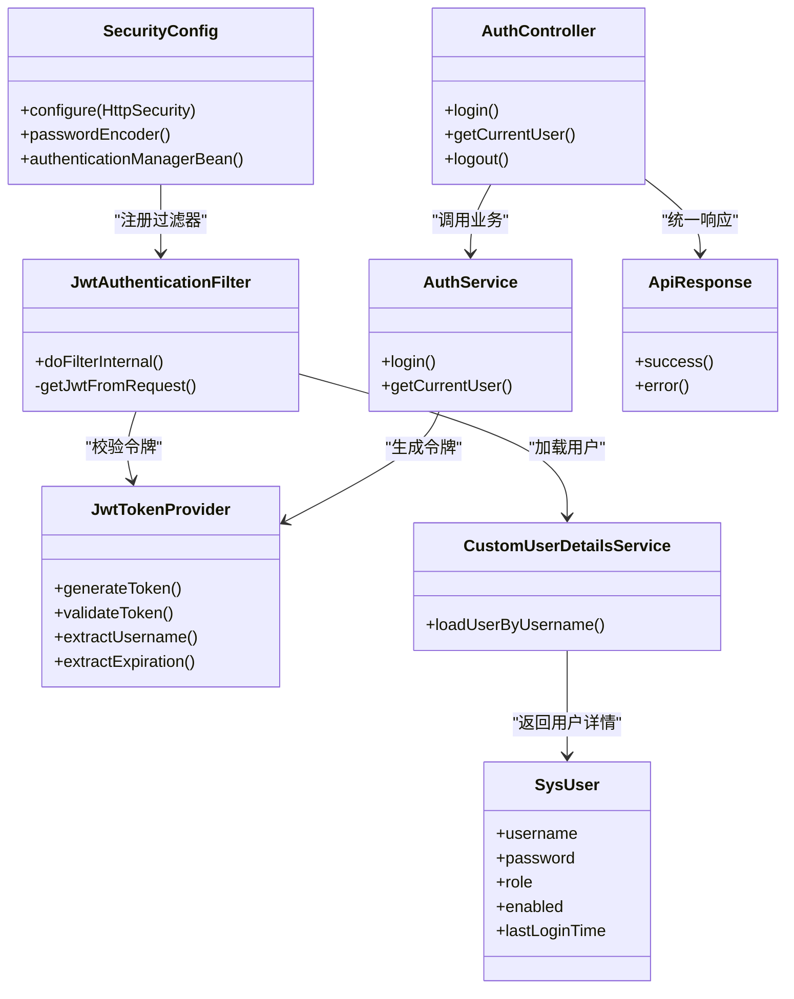
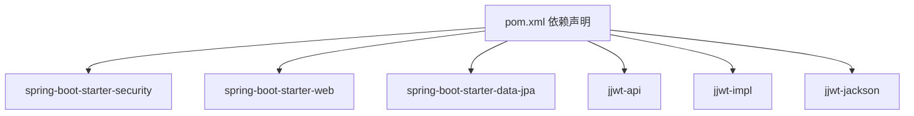

# 安全配置管理

<cite>
**本文档引用的文件**
- [SecurityConfig.java](file://backend/src/main/java/com/fieldcheck/config/SecurityConfig.java)
- [CorsConfig.java](file://backend/src/main/java/com/fieldcheck/config/CorsConfig.java)
- [GlobalExceptionHandler.java](file://backend/src/main/java/com/fieldcheck/config/GlobalExceptionHandler.java)
- [JwtAuthenticationFilter.java](file://backend/src/main/java/com/fieldcheck/security/JwtAuthenticationFilter.java)
- [JwtTokenProvider.java](file://backend/src/main/java/com/fieldcheck/security/JwtTokenProvider.java)
- [CustomUserDetailsService.java](file://backend/src/main/java/com/fieldcheck/security/CustomUserDetailsService.java)
- [AuthService.java](file://backend/src/main/java/com/fieldcheck/service/AuthService.java)
- [AuthController.java](file://backend/src/main/java/com/fieldcheck/controller/AuthController.java)
- [SysUser.java](file://backend/src/main/java/com/fieldcheck/entity/SysUser.java)
- [ApiResponse.java](file://backend/src/main/java/com/fieldcheck/dto/ApiResponse.java)
- [application.yml](file://backend/src/main/resources/application.yml)
- [pom.xml](file://backend/pom.xml)
</cite>

## 目录
1. [简介](#简介)
2. [项目结构](#项目结构)
3. [核心组件](#核心组件)
4. [架构总览](#架构总览)
5. [详细组件分析](#详细组件分析)
6. [依赖关系分析](#依赖关系分析)
7. [性能考量](#性能考量)
8. [故障排除指南](#故障排除指南)
9. [结论](#结论)
10. [附录](#附录)

## 简介
本文件系统性梳理后端安全配置与实现，覆盖以下主题：
- Spring Security 核心参数与安全策略
- CORS 跨域配置与安全考量
- 全局异常处理器的错误处理与安全响应策略
- 密码加密存储（BCrypt 编码器与盐值管理）
- 会话管理策略（无状态 JWT 认证）
- 安全头设置（HSTS、X-Frame-Options 等）
- 最佳实践与常见错误规避
- 安全扫描与渗透测试准备
- 生产环境安全加固与监控策略

## 项目结构
后端采用 Spring Boot + Spring Security 架构，安全相关代码主要集中在以下模块：
- 配置层：SecurityConfig、CorsConfig、GlobalExceptionHandler
- 安全服务层：JwtAuthenticationFilter、JwtTokenProvider、CustomUserDetailsService
- 控制层：AuthController
- 数据模型：SysUser
- 工具与响应：ApiResponse
- 配置文件：application.yml
- 依赖管理：pom.xml

图表来源
- [SecurityConfig.java](file://backend/src/main/java/com/fieldcheck/config/SecurityConfig.java#L23-L58)
- [CorsConfig.java](file://backend/src/main/java/com/fieldcheck/config/CorsConfig.java#L12-L28)
- [GlobalExceptionHandler.java](file://backend/src/main/java/com/fieldcheck/config/GlobalExceptionHandler.java#L16-L54)
- [JwtAuthenticationFilter.java](file://backend/src/main/java/com/fieldcheck/security/JwtAuthenticationFilter.java#L22-L58)
- [JwtTokenProvider.java](file://backend/src/main/java/com/fieldcheck/security/JwtTokenProvider.java#L16-L94)
- [CustomUserDetailsService.java](file://backend/src/main/java/com/fieldcheck/security/CustomUserDetailsService.java#L15-L36)
- [AuthController.java](file://backend/src/main/java/com/fieldcheck/controller/AuthController.java#L17-L55)
- [SysUser.java](file://backend/src/main/java/com/fieldcheck/entity/SysUser.java#L12-L43)
- [ApiResponse.java](file://backend/src/main/java/com/fieldcheck/dto/ApiResponse.java#L8-L43)

章节来源
- [SecurityConfig.java](file://backend/src/main/java/com/fieldcheck/config/SecurityConfig.java#L1-L60)
- [CorsConfig.java](file://backend/src/main/java/com/fieldcheck/config/CorsConfig.java#L1-L29)
- [GlobalExceptionHandler.java](file://backend/src/main/java/com/fieldcheck/config/GlobalExceptionHandler.java#L1-L55)

## 核心组件
- 安全策略配置：通过 SecurityConfig 统一管理 CSRF 关闭、会话策略（无状态）、路径授权规则以及 JWT 过滤器注册。
- CORS 配置：通过 CorsConfig 提供宽松的跨域策略，支持凭证传递与暴露特定响应头。
- 全局异常处理器：对验证错误、凭据错误、权限不足、运行时异常进行统一处理与安全响应。
- JWT 认证链路：JwtAuthenticationFilter 从请求中提取 JWT 并注入到安全上下文；JwtTokenProvider 负责签发与校验。
- 用户详情服务：CustomUserDetailsService 从数据库加载用户并装配角色权限。
- 认证流程：AuthController 接收登录请求，AuthService 使用 AuthenticationManager 进行认证，随后签发 JWT。

章节来源
- [SecurityConfig.java](file://backend/src/main/java/com/fieldcheck/config/SecurityConfig.java#L23-L58)
- [CorsConfig.java](file://backend/src/main/java/com/fieldcheck/config/CorsConfig.java#L12-L28)
- [GlobalExceptionHandler.java](file://backend/src/main/java/com/fieldcheck/config/GlobalExceptionHandler.java#L16-L54)
- [JwtAuthenticationFilter.java](file://backend/src/main/java/com/fieldcheck/security/JwtAuthenticationFilter.java#L22-L58)
- [JwtTokenProvider.java](file://backend/src/main/java/com/fieldcheck/security/JwtTokenProvider.java#L16-L94)
- [CustomUserDetailsService.java](file://backend/src/main/java/com/fieldcheck/security/CustomUserDetailsService.java#L15-L36)
- [AuthService.java](file://backend/src/main/java/com/fieldcheck/service/AuthService.java#L23-L79)
- [AuthController.java](file://backend/src/main/java/com/fieldcheck/controller/AuthController.java#L17-L55)

## 架构总览
下图展示从客户端到后端的认证与授权流程，以及安全组件之间的交互关系。

图表来源
- [AuthController.java](file://backend/src/main/java/com/fieldcheck/controller/AuthController.java#L25-L36)
- [AuthService.java](file://backend/src/main/java/com/fieldcheck/service/AuthService.java#L51-L73)
- [JwtTokenProvider.java](file://backend/src/main/java/com/fieldcheck/security/JwtTokenProvider.java#L32-L54)
- [JwtAuthenticationFilter.java](file://backend/src/main/java/com/fieldcheck/security/JwtAuthenticationFilter.java#L27-L49)
- [CustomUserDetailsService.java](file://backend/src/main/java/com/fieldcheck/security/CustomUserDetailsService.java#L21-L35)

## 详细组件分析

### Spring Security 核心参数与安全策略
- CSRF 禁用：在 HttpSecurity 中禁用 CSRF，适用于无状态 JWT 场景。
- 会话策略：设置为无状态（STATELESS），避免服务端维护会话。
- 授权规则：
  - /api/auth/** 允许匿名访问（登录、登出接口）
  - /ws/** 允许匿名访问（WebSocket）
  - /actuator/** 允许匿名访问（健康检查等运维端点）
  - /api/** 需要认证
  - 其他请求默认允许（可根据需要收紧）
- JWT 过滤器注册：在 UsernamePasswordAuthenticationFilter 前插入 JwtAuthenticationFilter，确保在认证前完成令牌解析与用户注入。

章节来源
- [SecurityConfig.java](file://backend/src/main/java/com/fieldcheck/config/SecurityConfig.java#L44-L58)

### CORS（跨域资源共享）配置与安全考量
- 允许凭证：允许携带 Cookie/Authorization 头部进行跨域请求。
- 允许模式：使用通配符模式匹配来源，便于前端开发调试。
- 允许方法：GET、POST、PUT、DELETE、OPTIONS。
- 暴露头：显式暴露 Authorization、Content-Disposition 等必要响应头。
- 安全建议：
  - 生产环境应限制 Allow-Origin 到具体域名，避免使用通配符。
  - 明确 Allow-Headers 与 Allow-Methods，减少攻击面。
  - 对敏感端点启用额外防护（如自定义安全头、CSP 等）。

章节来源
- [CorsConfig.java](file://backend/src/main/java/com/fieldcheck/config/CorsConfig.java#L14-L27)

### 全局异常处理器的错误处理与安全响应策略
- 输入验证错误：收集字段级错误消息，返回 400，并以统一 ApiResponse 结构返回。
- 凭据错误：捕获 BadCredentialsException，返回 401，提示“用户名或密码错误”。
- 权限不足：捕获 AccessDeniedException，返回 403，提示“权限不足”。
- 运行时异常：记录日志并返回 500，统一提示“服务器内部错误”，避免泄露内部细节。
- 异常兜底：捕获 Exception，记录日志并返回 500，确保不暴露堆栈信息。

章节来源
- [GlobalExceptionHandler.java](file://backend/src/main/java/com/fieldcheck/config/GlobalExceptionHandler.java#L20-L53)
- [ApiResponse.java](file://backend/src/main/java/com/fieldcheck/dto/ApiResponse.java#L12-L43)

### 密码加密存储（BCrypt 编码器与盐值管理）
- 编码器：使用 BCryptPasswordEncoder，自动处理盐值生成与哈希计算。
- 存储：SysUser.password 字段保存加密后的密码。
- 初始化：AuthService 在应用启动时创建或重置默认管理员账户，使用 BCrypt 加密初始密码。
- 安全建议：
  - 生产环境必须使用强随机密钥与足够长度的盐值（框架已内置）。
  - 定期轮换密钥与强制用户修改弱密码。
  - 禁止明文日志输出密码或哈希值。

章节来源
- [SecurityConfig.java](file://backend/src/main/java/com/fieldcheck/config/SecurityConfig.java#L39-L42)
- [AuthService.java](file://backend/src/main/java/com/fieldcheck/service/AuthService.java#L30-L49)
- [SysUser.java](file://backend/src/main/java/com/fieldcheck/entity/SysUser.java#L24-L25)

### 会话管理策略（无状态 JWT 认证）
- 会话策略：STATELESS，不创建会话，所有状态由 JWT 承载。
- 认证流程：
  - 登录：AuthController 调用 AuthService，AuthenticationManager 校验凭据。
  - 令牌签发：JwtTokenProvider 基于用户信息与过期时间生成 JWT。
  - 请求拦截：JwtAuthenticationFilter 从 Authorization 头提取 Bearer 令牌，校验后注入 SecurityContext。
- 角色与权限：CustomUserDetailsService 将用户角色映射为 ROLE_ 前缀的权限。

章节来源
- [SecurityConfig.java](file://backend/src/main/java/com/fieldcheck/config/SecurityConfig.java#L47-L48)
- [AuthController.java](file://backend/src/main/java/com/fieldcheck/controller/AuthController.java#L25-L36)
- [AuthService.java](file://backend/src/main/java/com/fieldcheck/service/AuthService.java#L51-L73)
- [JwtTokenProvider.java](file://backend/src/main/java/com/fieldcheck/security/JwtTokenProvider.java#L32-L54)
- [JwtAuthenticationFilter.java](file://backend/src/main/java/com/fieldcheck/security/JwtAuthenticationFilter.java#L27-L49)
- [CustomUserDetailsService.java](file://backend/src/main/java/com/fieldcheck/security/CustomUserDetailsService.java#L26-L34)

### 安全头设置（HSTS、X-Frame-Options 等）
当前代码未显式配置安全响应头（如 HSTS、X-Frame-Options、X-Content-Type-Options、Referrer-Policy 等）。建议在生产环境中补充：
- HSTS：严格传输安全，提升 HTTPS 安全性。
- X-Frame-Options：防止点击劫持。
- X-Content-Type-Options：阻止 MIME 类型嗅探。
- Content-Security-Policy：限制资源加载来源。
- Referrer-Policy：控制引用信息传递范围。
- 可通过 WebMvcConfigurer 或自定义 Filter 实现。

[本节为通用建议，不直接分析具体文件，故无章节来源]

### JWT 配置参数与密钥管理
- 密钥与过期时间：在 application.yml 中配置 jwt.secret 与 jwt.expiration。
- 密钥生成：JwtTokenProvider 使用 HMAC-SHA256 基于密钥生成签名。
- 安全建议：
  - 生产环境密钥必须足够长且随机，定期轮换。
  - 过期时间应合理设置，结合刷新令牌策略。
  - 密钥不应硬编码在源码中，建议使用环境变量或密钥管理服务。

章节来源
- [application.yml](file://backend/src/main/resources/application.yml#L55-L58)
- [JwtTokenProvider.java](file://backend/src/main/java/com/fieldcheck/security/JwtTokenProvider.java#L19-L30)

### 认证与授权流程（类图）

图表来源
- [SecurityConfig.java](file://backend/src/main/java/com/fieldcheck/config/SecurityConfig.java#L23-L58)
- [JwtAuthenticationFilter.java](file://backend/src/main/java/com/fieldcheck/security/JwtAuthenticationFilter.java#L22-L58)
- [JwtTokenProvider.java](file://backend/src/main/java/com/fieldcheck/security/JwtTokenProvider.java#L16-L94)
- [CustomUserDetailsService.java](file://backend/src/main/java/com/fieldcheck/security/CustomUserDetailsService.java#L15-L36)
- [AuthController.java](file://backend/src/main/java/com/fieldcheck/controller/AuthController.java#L17-L55)
- [AuthService.java](file://backend/src/main/java/com/fieldcheck/service/AuthService.java#L23-L79)
- [SysUser.java](file://backend/src/main/java/com/fieldcheck/entity/SysUser.java#L12-L43)
- [ApiResponse.java](file://backend/src/main/java/com/fieldcheck/dto/ApiResponse.java#L8-L43)

## 依赖关系分析
- Spring Security 启动器：提供 WebSecurityConfigurerAdapter、AuthenticationManager、密码编码器等基础能力。
- JWT 依赖：jjwt-api、jjwt-impl、jjwt-jackson，用于令牌生成与解析。
- Lombok：简化实体与配置类的样板代码。
- 测试依赖：spring-boot-starter-test、spring-security-test，便于安全相关单元测试。

图表来源
- [pom.xml](file://backend/pom.xml#L28-L87)

章节来源
- [pom.xml](file://backend/pom.xml#L28-L87)

## 性能考量
- 无状态设计：JWT 无状态特性降低服务端会话开销，但需注意令牌大小与网络传输成本。
- 密码编码：BCrypt 默认迭代次数较高，登录时会有一定 CPU 开销，建议在高并发场景下优化数据库连接池与线程池配置。
- 过滤器链：JwtAuthenticationFilter 每次请求都会执行令牌解析，建议在网关层或反向代理层做限流与缓存。
- 日志级别：生产环境建议降低日志级别，避免敏感信息泄露与 I/O 压力。

[本节提供一般性指导，不直接分析具体文件，故无章节来源]

## 故障排除指南
- 登录失败：
  - 检查用户名是否存在与是否启用。
  - 确认密码是否使用 BCrypt 加密存储。
  - 查看全局异常处理器对 BadCredentialsException 的处理。
- 权限不足：
  - 确认用户角色是否正确映射为 ROLE_ 前缀。
  - 检查授权规则是否覆盖目标路径。
- JWT 校验失败：
  - 确认 Authorization 头格式为 Bearer 令牌。
  - 检查密钥与过期时间配置是否一致。
  - 查看 JwtTokenProvider 的 validateToken 返回值。
- CORS 问题：
  - 生产环境应限制 Allow-Origin 到具体域名。
  - 确认暴露头与预检请求方法配置正确。

章节来源
- [GlobalExceptionHandler.java](file://backend/src/main/java/com/fieldcheck/config/GlobalExceptionHandler.java#L29-L39)
- [CustomUserDetailsService.java](file://backend/src/main/java/com/fieldcheck/security/CustomUserDetailsService.java#L26-L34)
- [JwtAuthenticationFilter.java](file://backend/src/main/java/com/fieldcheck/security/JwtAuthenticationFilter.java#L51-L57)
- [JwtTokenProvider.java](file://backend/src/main/java/com/fieldcheck/security/JwtTokenProvider.java#L86-L93)
- [CorsConfig.java](file://backend/src/main/java/com/fieldcheck/config/CorsConfig.java#L17-L21)

## 结论
本项目基于 Spring Security 实现了无状态 JWT 认证体系，配合全局异常处理与 CORS 配置，满足基本的认证授权与跨域需求。建议在生产环境中进一步强化安全头、密钥管理、CORS 策略与日志脱敏，同时建立完善的渗透测试与安全扫描流程，确保系统在上线前达到可接受的安全水平。

[本节为总结性内容，不直接分析具体文件，故无章节来源]

## 附录

### 安全配置最佳实践清单
- 密钥与配置
  - 使用环境变量或密钥管理服务存放 jwt.secret 与 encryption.aes-key。
  - 定期轮换密钥，设置合理的过期时间。
- CORS 策略
  - 生产环境限制 Allow-Origin 到具体域名，避免通配符。
  - 明确 Allow-Headers 与 Allow-Methods，仅暴露必要响应头。
- 安全头
  - 启用 HSTS、X-Frame-Options、X-Content-Type-Options、CSP、Referrer-Policy。
- 日志与审计
  - 生产环境关闭敏感字段日志，记录登录与操作审计。
- 渗透测试与扫描
  - 使用 OWASP ZAP/ Burp Suite 进行自动化与手工测试。
  - 定期扫描依赖漏洞（OWASP Dependency-Check）。
- 监控与告警
  - 监控异常率、登录失败率、慢查询与内存使用。
  - 设置告警阈值与应急响应流程。

[本节为通用建议，不直接分析具体文件，故无章节来源]