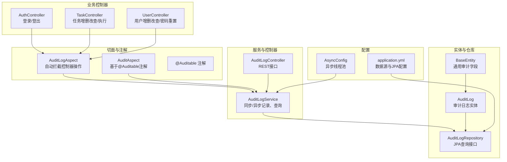
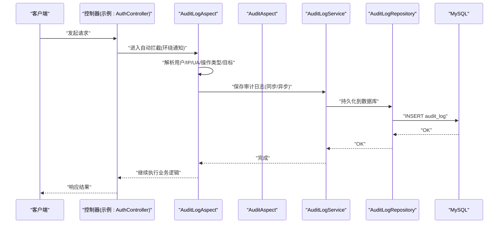
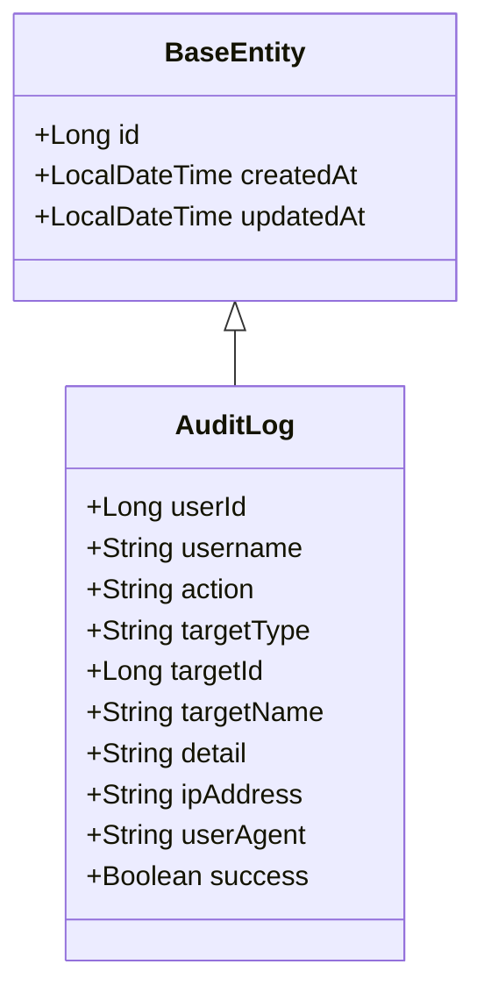
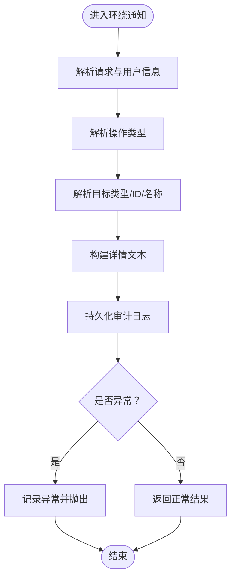
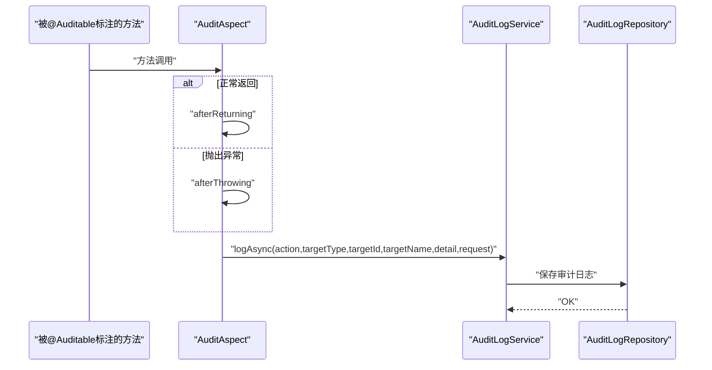
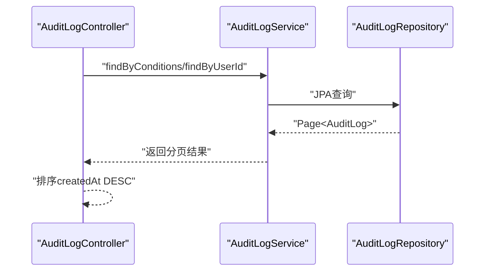
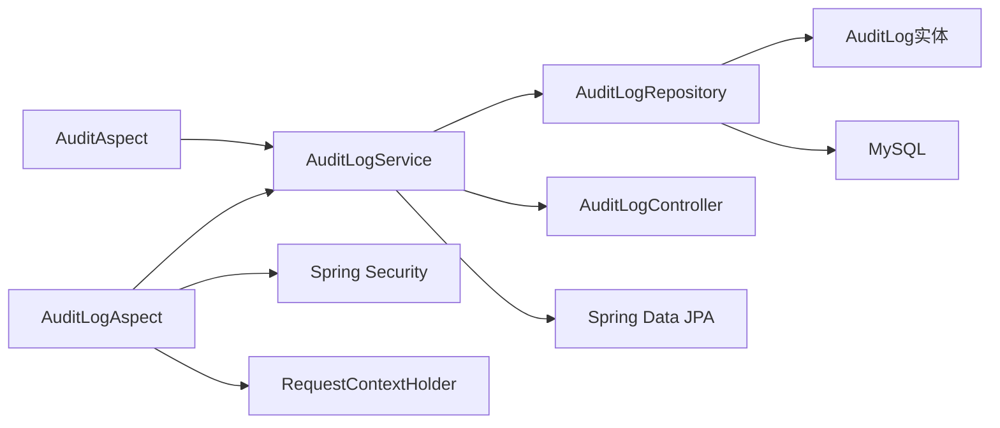

# 审计日志管理

<cite>
**本文引用的文件**
- [AuditLogAspect.java](file://backend/src/main/java/com/fieldcheck/aspect/AuditLogAspect.java)
- [AuditAspect.java](file://backend/src/main/java/com/fieldcheck/aspect/AuditAspect.java)
- [Auditable.java](file://backend/src/main/java/com/fieldcheck/aspect/Auditable.java)
- [AuditLog.java](file://backend/src/main/java/com/fieldcheck/entity/AuditLog.java)
- [BaseEntity.java](file://backend/src/main/java/com/fieldcheck/entity/BaseEntity.java)
- [AuditLogService.java](file://backend/src/main/java/com/fieldcheck/service/AuditLogService.java)
- [AuditLogController.java](file://backend/src/main/java/com/fieldcheck/controller/AuditLogController.java)
- [AuditLogRepository.java](file://backend/src/main/java/com/fieldcheck/repository/AuditLogRepository.java)
- [AsyncConfig.java](file://backend/src/main/java/com/fieldcheck/config/AsyncConfig.java)
- [application.yml](file://backend/src/main/resources/application.yml)
- [AuthController.java](file://backend/src/main/java/com/fieldcheck/controller/AuthController.java)
- [TaskController.java](file://backend/src/main/java/com/fieldcheck/controller/TaskController.java)
- [UserController.java](file://backend/src/main/java/com/fieldcheck/controller/UserController.java)
</cite>

## 目录
1. [简介](#简介)
2. [项目结构](#项目结构)
3. [核心组件](#核心组件)
4. [架构总览](#架构总览)
5. [详细组件分析](#详细组件分析)
6. [依赖分析](#依赖分析)
7. [性能考虑](#性能考虑)
8. [故障排查指南](#故障排查指南)
9. [结论](#结论)
10. [附录](#附录)

## 简介
本文件为“审计日志管理系统”的技术文档，聚焦于审计日志的采集、记录与管理机制，系统采用面向切面编程（AOP）自动拦截控制器层的关键操作，结合手动注解式审计，统一记录用户行为、操作类型、目标对象、时间戳、来源IP与UA等关键信息，并提供分页查询、条件筛选与统计能力。同时覆盖存储策略、性能优化、安全监控价值、合规与数据保护、以及维护与清理策略。

## 项目结构
后端采用Spring Boot + Spring Data JPA + MySQL，审计相关代码主要分布在以下模块：
- 切面与注解：aspect 包下的两个AOP切面与自定义注解
- 实体与仓库：entity 与 repository 包下的审计日志实体与查询接口
- 服务与控制器：service 与 controller 包下的审计日志服务与对外接口
- 配置：config 包下的异步线程池配置
- 应用配置：resources 下的应用配置文件

图表来源
- [AuditLogAspect.java](file://backend/src/main/java/com/fieldcheck/aspect/AuditLogAspect.java#L34-L61)
- [AuditAspect.java](file://backend/src/main/java/com/fieldcheck/aspect/AuditAspect.java#L29-L66)
- [Auditable.java](file://backend/src/main/java/com/fieldcheck/aspect/Auditable.java#L12-L38)
- [AuditLogService.java](file://backend/src/main/java/com/fieldcheck/service/AuditLogService.java#L28-L52)
- [AuditLogController.java](file://backend/src/main/java/com/fieldcheck/controller/AuditLogController.java#L23-L48)
- [AuditLog.java](file://backend/src/main/java/com/fieldcheck/entity/AuditLog.java#L16-L19)
- [AuditLogRepository.java](file://backend/src/main/java/com/fieldcheck/repository/AuditLogRepository.java#L18-L27)
- [AsyncConfig.java](file://backend/src/main/java/com/fieldcheck/config/AsyncConfig.java#L16-L29)
- [application.yml](file://backend/src/main/resources/application.yml#L8-L32)
- [AuthController.java](file://backend/src/main/java/com/fieldcheck/controller/AuthController.java#L25-L54)
- [TaskController.java](file://backend/src/main/java/com/fieldcheck/controller/TaskController.java#L49-L86)
- [UserController.java](file://backend/src/main/java/com/fieldcheck/controller/UserController.java#L63-L115)

章节来源
- [AuditLogAspect.java](file://backend/src/main/java/com/fieldcheck/aspect/AuditLogAspect.java#L34-L61)
- [AuditAspect.java](file://backend/src/main/java/com/fieldcheck/aspect/AuditAspect.java#L29-L66)
- [AuditLogService.java](file://backend/src/main/java/com/fieldcheck/service/AuditLogService.java#L28-L52)
- [AuditLogController.java](file://backend/src/main/java/com/fieldcheck/controller/AuditLogController.java#L23-L48)
- [AuditLog.java](file://backend/src/main/java/com/fieldcheck/entity/AuditLog.java#L16-L19)
- [AuditLogRepository.java](file://backend/src/main/java/com/fieldcheck/repository/AuditLogRepository.java#L18-L27)
- [AsyncConfig.java](file://backend/src/main/java/com/fieldcheck/config/AsyncConfig.java#L16-L29)
- [application.yml](file://backend/src/main/resources/application.yml#L8-L32)

## 核心组件
- 审计切面（自动拦截）
  - AuditLogAspect：通过环绕通知拦截控制器层操作，自动解析用户、IP、UA、操作类型、目标对象等，统一持久化
- 注解式审计
  - AuditAspect + @Auditable：对标注了@Auditable的方法进行返回/异常后的审计记录，支持显式指定操作类型、目标类型与目标标识
- 数据模型
  - AuditLog：审计日志实体，继承BaseEntity，包含用户、操作、目标、详情、IP、UA、成功标志等字段，并建立索引以提升查询性能
- 服务与接口
  - AuditLogService：提供同步/异步记录、登录记录、按条件与用户分页查询
  - AuditLogController：对外提供审计日志查询接口，支持按用户名、操作类型、时间范围分页查询
- 存储与配置
  - AuditLogRepository：基于JPA的分页查询接口，含条件查询与按用户查询
  - AsyncConfig：异步线程池配置，限制并发数，避免审计写入阻塞主流程
  - application.yml：数据源、JPA方言与连接池配置

章节来源
- [AuditLogAspect.java](file://backend/src/main/java/com/fieldcheck/aspect/AuditLogAspect.java#L34-L115)
- [AuditAspect.java](file://backend/src/main/java/com/fieldcheck/aspect/AuditAspect.java#L29-L136)
- [Auditable.java](file://backend/src/main/java/com/fieldcheck/aspect/Auditable.java#L12-L38)
- [AuditLog.java](file://backend/src/main/java/com/fieldcheck/entity/AuditLog.java#L21-L53)
- [AuditLogService.java](file://backend/src/main/java/com/fieldcheck/service/AuditLogService.java#L28-L105)
- [AuditLogController.java](file://backend/src/main/java/com/fieldcheck/controller/AuditLogController.java#L23-L64)
- [AuditLogRepository.java](file://backend/src/main/java/com/fieldcheck/repository/AuditLogRepository.java#L18-L27)
- [AsyncConfig.java](file://backend/src/main/java/com/fieldcheck/config/AsyncConfig.java#L16-L29)
- [application.yml](file://backend/src/main/resources/application.yml#L8-L32)

## 架构总览
系统通过AOP在不侵入业务代码的前提下完成审计日志采集；自动切面覆盖控制器层常见操作，注解式切面补充细粒度方法级审计；服务层负责构建日志并持久化；控制器提供查询接口；数据库层面通过索引优化查询性能。

图表来源
- [AuditLogAspect.java](file://backend/src/main/java/com/fieldcheck/aspect/AuditLogAspect.java#L43-L115)
- [AuditAspect.java](file://backend/src/main/java/com/fieldcheck/aspect/AuditAspect.java#L32-L66)
- [AuditLogService.java](file://backend/src/main/java/com/fieldcheck/service/AuditLogService.java#L28-L52)
- [AuditLogRepository.java](file://backend/src/main/java/com/fieldcheck/repository/AuditLogRepository.java#L14-L27)

## 详细组件分析

### 审计日志实体与数据结构
- 字段设计
  - 用户标识：userId、username
  - 操作标识：action（如LOGIN、LOGOUT、CREATE、UPDATE、DELETE、EXECUTE、STOP、TEST、OPERATION等）
  - 目标标识：targetType（如Connection、Task、Execution、RiskResult、WhitelistRule、AlertConfig、User、Auth）、targetId、targetName
  - 细节与上下文：detail（操作详情/失败原因）、ipAddress、userAgent
  - 结果与时间：success（布尔）、createdAt/updatedAt（继承BaseEntity）
- 索引设计
  - idx_user_id、idx_action：加速按用户与操作类型查询
- 继承基类
  - BaseEntity：统一提供创建/更新时间审计字段

图表来源
- [AuditLog.java](file://backend/src/main/java/com/fieldcheck/entity/AuditLog.java#L21-L53)
- [BaseEntity.java](file://backend/src/main/java/com/fieldcheck/entity/BaseEntity.java#L14-L27)

章节来源
- [AuditLog.java](file://backend/src/main/java/com/fieldcheck/entity/AuditLog.java#L21-L53)
- [BaseEntity.java](file://backend/src/main/java/com/fieldcheck/entity/BaseEntity.java#L14-L27)

### 自动拦截切面（AuditLogAspect）
- 拦截范围
  - 控制器层所有方法，排除审计控制器自身、用户/me、列表/搜索/查询类方法、进度/日志读取等非关键路径
- 关键逻辑
  - 请求信息：从RequestContextHolder获取HttpServletRequest，解析X-Forwarded-For/代理头，提取真实IP
  - 用户信息：从SecurityContext获取当前认证用户，若存在则查询SysUserRepository获取userId
  - 操作类型解析：根据方法名前缀映射为CREATE/UPDATE/DELETE/EXECUTE/STOP/LOGIN/LOGOUT/TEST/OPERATION
  - 目标类型解析：根据Controller类名推断（如Connection、Task、Execution、RiskResult、WhitelistRule、AlertConfig、User、Auth）
  - 目标标识提取：优先从方法参数中提取Long/Integer类型的ID，其次尝试从DTO的getName方法反射提取名称
  - 详情构建：拼接类名+方法名，附加成功/失败信息
  - 异常处理：捕获异常并记录，finally中确保审计日志落库
- 性能与可靠性
  - 使用finally保证即使异常也记录审计日志
  - 日志级别为DEBUG，避免生产环境过多输出

图表来源
- [AuditLogAspect.java](file://backend/src/main/java/com/fieldcheck/aspect/AuditLogAspect.java#L43-L115)

章节来源
- [AuditLogAspect.java](file://backend/src/main/java/com/fieldcheck/aspect/AuditLogAspect.java#L34-L115)

### 注解式审计（AuditAspect + @Auditable）
- 注解定义
  - action：操作类型（如CREATE、UPDATE、DELETE、LOGIN、LOGOUT等）
  - targetType：目标类型（如Connection、Task、User等）
  - targetIdParam/targetNameParam：从方法参数中提取目标ID/名称的参数名
  - description：描述模板，可选
- 切面逻辑
  - 返回后：afterReturning记录成功日志
  - 抛出异常：afterThrowing记录失败日志及错误信息
  - 参数提取：通过方法签名与参数名反射提取目标ID/名称
  - 异步记录：调用AuditLogService.logAsync异步写入，避免阻塞

图表来源
- [AuditAspect.java](file://backend/src/main/java/com/fieldcheck/aspect/AuditAspect.java#L32-L66)
- [Auditable.java](file://backend/src/main/java/com/fieldcheck/aspect/Auditable.java#L12-L38)
- [AuditLogService.java](file://backend/src/main/java/com/fieldcheck/service/AuditLogService.java#L28-L38)

章节来源
- [AuditAspect.java](file://backend/src/main/java/com/fieldcheck/aspect/AuditAspect.java#L29-L136)
- [Auditable.java](file://backend/src/main/java/com/fieldcheck/aspect/Auditable.java#L12-L38)

### 审计日志服务与查询
- 记录方式
  - 同步记录：直接开启事务并保存
  - 异步记录：@Async + 线程池，降低写入对主流程影响
  - 登录记录：专门的logLogin方法，便于集中处理登录场景
- 查询接口
  - 条件查询：支持按用户名（模糊）、操作类型、起止时间分页查询
  - 用户查询：按userId分页查询该用户的所有审计日志
- IP解析一致性
  - 与自动切面保持一致的多级代理头解析策略

图表来源
- [AuditLogController.java](file://backend/src/main/java/com/fieldcheck/controller/AuditLogController.java#L23-L48)
- [AuditLogService.java](file://backend/src/main/java/com/fieldcheck/service/AuditLogService.java#L73-L105)
- [AuditLogRepository.java](file://backend/src/main/java/com/fieldcheck/repository/AuditLogRepository.java#L18-L27)

章节来源
- [AuditLogService.java](file://backend/src/main/java/com/fieldcheck/service/AuditLogService.java#L28-L105)
- [AuditLogController.java](file://backend/src/main/java/com/fieldcheck/controller/AuditLogController.java#L23-L64)
- [AuditLogRepository.java](file://backend/src/main/java/com/fieldcheck/repository/AuditLogRepository.java#L18-L27)

### 不同操作类型的审计策略
- 登录/登出
  - AuthController中显式调用AuditLogService记录LOGIN/LOGOUT，包含成功与否与详情
- 数据修改/删除
  - 自动切面根据方法名前缀识别UPDATE/DELETE/CREATE等操作类型
- 执行/停止
  - 任务执行/停止对应EXECUTE/STOP操作类型
- 其他
  - TEST、RESET等操作类型亦有覆盖

章节来源
- [AuthController.java](file://backend/src/main/java/com/fieldcheck/controller/AuthController.java#L25-L54)
- [TaskController.java](file://backend/src/main/java/com/fieldcheck/controller/TaskController.java#L74-L86)
- [AuditLogAspect.java](file://backend/src/main/java/com/fieldcheck/aspect/AuditLogAspect.java#L142-L166)

### 审计日志的存储策略与性能优化
- 存储策略
  - 使用JPA + MySQL持久化，实体表audit_log，包含必要索引
- 性能优化
  - 异步写入：通过@Async与线程池减少写盘对主流程的影响
  - 连接池与JPA：合理配置最大连接、空闲超时、校验查询等
  - 查询优化：针对常用查询字段建立索引，使用分页与倒序排序
  - 过滤策略：自动切面默认排除非关键路径，降低审计开销

章节来源
- [AsyncConfig.java](file://backend/src/main/java/com/fieldcheck/config/AsyncConfig.java#L16-L29)
- [application.yml](file://backend/src/main/resources/application.yml#L8-L32)
- [AuditLog.java](file://backend/src/main/java/com/fieldcheck/entity/AuditLog.java#L16-L19)
- [AuditLogAspect.java](file://backend/src/main/java/com/fieldcheck/aspect/AuditLogAspect.java#L34-L42)

### 审计日志查询与统计
- 接口能力
  - 支持按用户名（模糊）、操作类型、起止时间分页查询
  - 支持按用户ID分页查询
  - 提供可用操作类型枚举接口
- 建议统计维度
  - 按用户/操作类型/时间窗口的计数统计（可在上层服务扩展）

章节来源
- [AuditLogController.java](file://backend/src/main/java/com/fieldcheck/controller/AuditLogController.java#L23-L64)
- [AuditLogRepository.java](file://backend/src/main/java/com/fieldcheck/repository/AuditLogRepository.java#L18-L27)

### 审计日志在安全监控中的作用与价值
- 行为追踪：完整记录用户操作轨迹，便于回溯与取证
- 异常定位：结合失败详情快速定位问题
- 合规审计：满足内部与外部合规要求，提供可追溯证据链
- 安全预警：结合规则引擎可对高危操作进行实时告警

## 依赖分析
- 组件耦合
  - AuditLogAspect与AuditAspect分别覆盖控制器层与方法级审计，职责清晰
  - AuditLogService作为门面，统一处理日志构建与持久化
  - AuditLogRepository提供查询能力，与实体形成稳定契约
- 外部依赖
  - Spring Security：获取当前用户
  - Spring Web：RequestContextHolder获取请求上下文
  - Spring Data JPA：持久化与查询
  - MySQL：存储审计日志

图表来源
- [AuditLogAspect.java](file://backend/src/main/java/com/fieldcheck/aspect/AuditLogAspect.java#L75-L90)
- [AuditAspect.java](file://backend/src/main/java/com/fieldcheck/aspect/AuditAspect.java#L50-L66)
- [AuditLogService.java](file://backend/src/main/java/com/fieldcheck/service/AuditLogService.java#L88-L105)
- [AuditLogRepository.java](file://backend/src/main/java/com/fieldcheck/repository/AuditLogRepository.java#L14-L27)

章节来源
- [AuditLogAspect.java](file://backend/src/main/java/com/fieldcheck/aspect/AuditLogAspect.java#L75-L90)
- [AuditAspect.java](file://backend/src/main/java/com/fieldcheck/aspect/AuditAspect.java#L50-L66)
- [AuditLogService.java](file://backend/src/main/java/com/fieldcheck/service/AuditLogService.java#L88-L105)
- [AuditLogRepository.java](file://backend/src/main/java/com/fieldcheck/repository/AuditLogRepository.java#L14-L27)

## 性能考虑
- 异步写入：通过@Async与线程池限制并发，避免阻塞请求
- 连接池参数：合理设置最大连接、空闲超时、校验查询，保障高并发稳定性
- 查询优化：利用索引与分页，避免全表扫描
- 切面过滤：仅对关键操作进行审计，减少无效日志

章节来源
- [AsyncConfig.java](file://backend/src/main/java/com/fieldcheck/config/AsyncConfig.java#L16-L29)
- [application.yml](file://backend/src/main/resources/application.yml#L13-L23)
- [AuditLog.java](file://backend/src/main/java/com/fieldcheck/entity/AuditLog.java#L16-L19)
- [AuditLogAspect.java](file://backend/src/main/java/com/fieldcheck/aspect/AuditLogAspect.java#L34-L42)

## 故障排查指南
- 审计日志未记录
  - 检查是否命中拦截范围（控制器方法、是否被排除）
  - 确认自动切面与注解式切面是否启用
  - 查看服务层异常日志，确认保存异常
- IP显示异常
  - 检查代理头是否正确传递（X-Forwarded-For等），确认解析逻辑
- 查询无结果
  - 检查分页参数、排序字段createdAt是否存在
  - 确认索引是否生效
- 登录审计缺失
  - 确认AuthController是否调用了AuditLogService.logLogin/logAsync

章节来源
- [AuditLogAspect.java](file://backend/src/main/java/com/fieldcheck/aspect/AuditLogAspect.java#L123-L140)
- [AuditLogService.java](file://backend/src/main/java/com/fieldcheck/service/AuditLogService.java#L107-L131)
- [AuditLogController.java](file://backend/src/main/java/com/fieldcheck/controller/AuditLogController.java#L23-L48)
- [AuthController.java](file://backend/src/main/java/com/fieldcheck/controller/AuthController.java#L25-L54)

## 结论
本系统通过自动拦截与注解式审计相结合的方式，实现了对关键业务操作的全面记录；借助异步写入与索引优化，兼顾了性能与可观测性；配合完善的查询接口，满足日常运维与安全审计需求。建议后续扩展统计分析与合规导出能力，并制定长期归档与清理策略。

## 附录
- 合规与数据保护
  - 审计日志属于敏感数据，应遵循最小访问原则与加密存储策略
  - 对外查询接口需严格鉴权（已使用角色控制）
- 维护与清理策略
  - 建议按月/季度归档旧数据，保留一定周期（如1年）以满足合规
  - 清理策略需经审批并留痕，避免误删