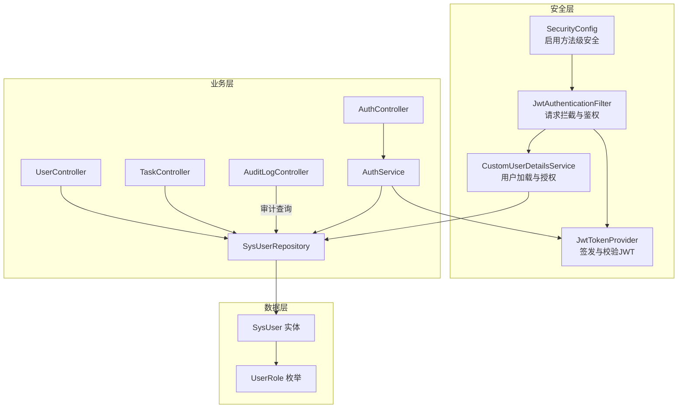
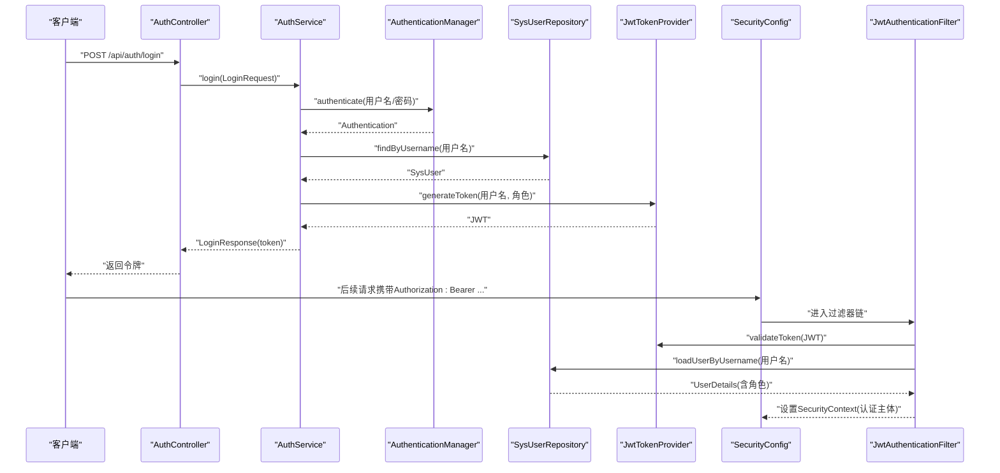
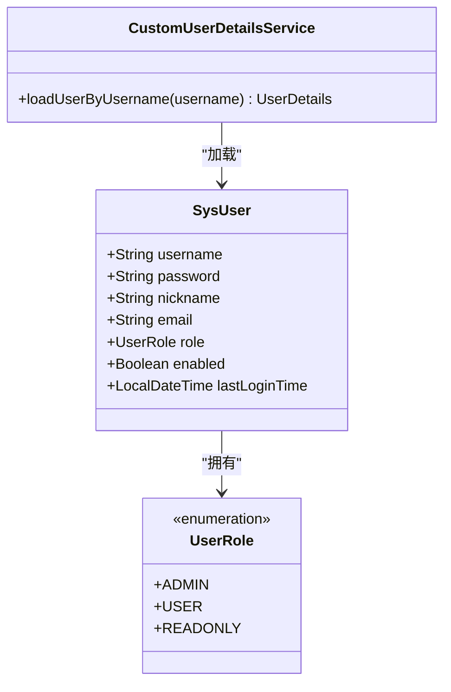
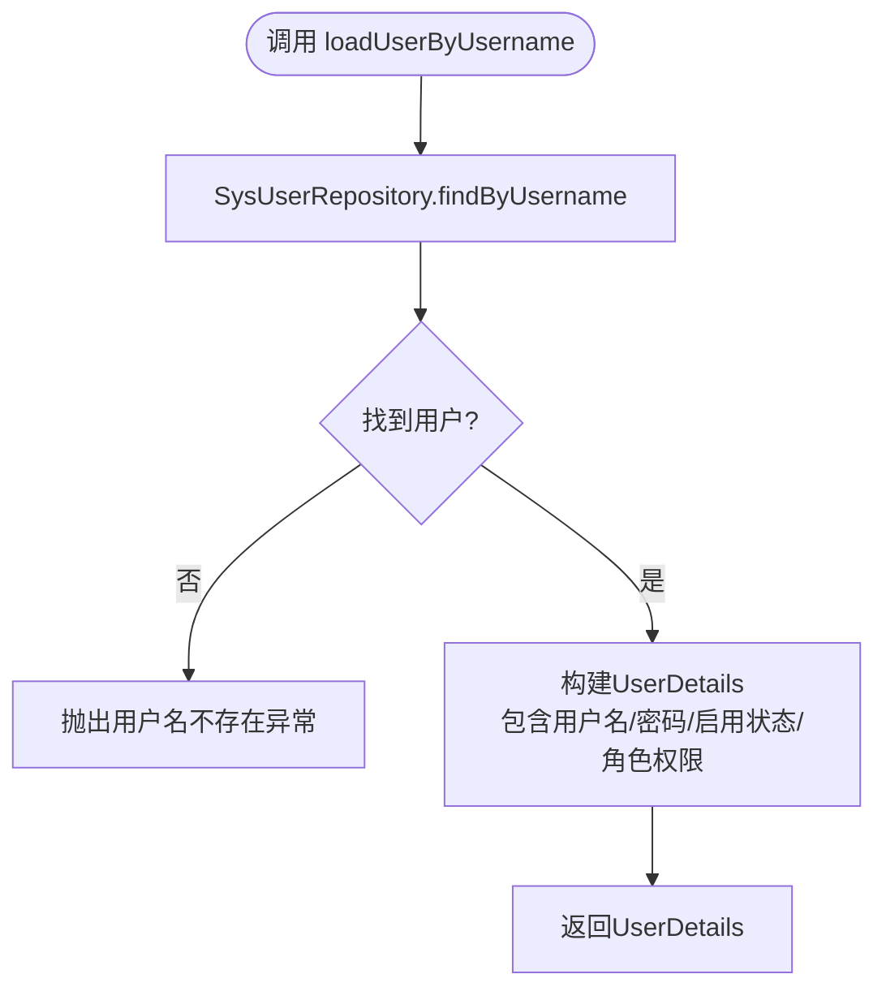
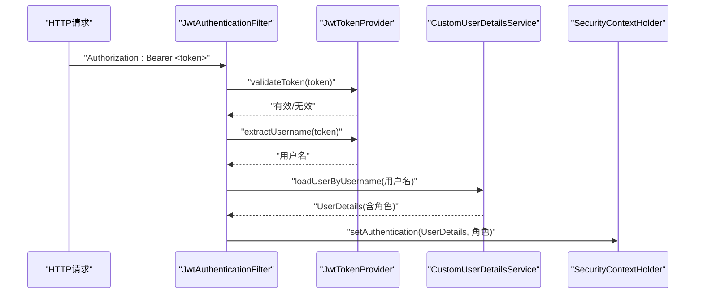
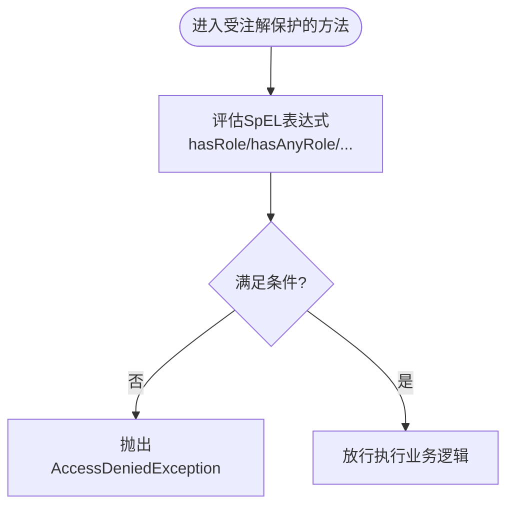
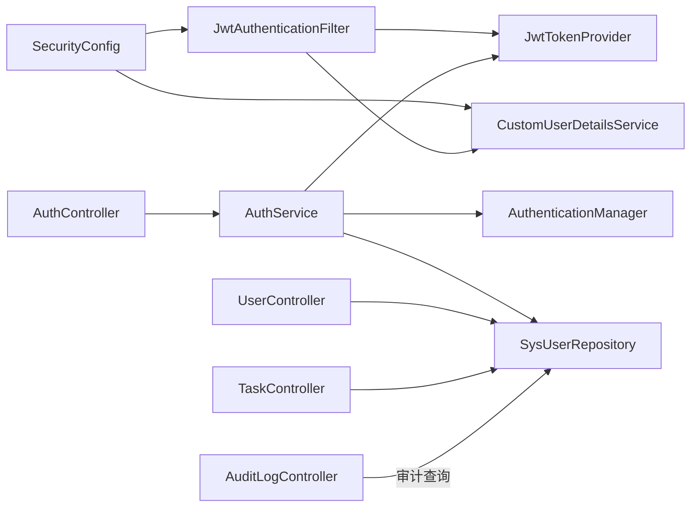

# 权限控制策略

<cite>
**本文引用的文件**
- [backend/src/main/java/com/fieldcheck/security/CustomUserDetailsService.java](file://backend/src/main/java/com/fieldcheck/security/CustomUserDetailsService.java)
- [backend/src/main/java/com/fieldcheck/config/SecurityConfig.java](file://backend/src/main/java/com/fieldcheck/config/SecurityConfig.java)
- [backend/src/main/java/com/fieldcheck/security/JwtAuthenticationFilter.java](file://backend/src/main/java/com/fieldcheck/security/JwtAuthenticationFilter.java)
- [backend/src/main/java/com/fieldcheck/security/JwtTokenProvider.java](file://backend/src/main/java/com/fieldcheck/security/JwtTokenProvider.java)
- [backend/src/main/java/com/fieldcheck/entity/UserRole.java](file://backend/src/main/java/com/fieldcheck/entity/UserRole.java)
- [backend/src/main/java/com/fieldcheck/entity/SysUser.java](file://backend/src/main/java/com/fieldcheck/entity/SysUser.java)
- [backend/src/main/java/com/fieldcheck/repository/SysUserRepository.java](file://backend/src/main/java/com/fieldcheck/repository/SysUserRepository.java)
- [backend/src/main/java/com/fieldcheck/controller/AuthController.java](file://backend/src/main/java/com/fieldcheck/controller/AuthController.java)
- [backend/src/main/java/com/fieldcheck/service/AuthService.java](file://backend/src/main/java/com/fieldcheck/service/AuthService.java)
- [backend/src/main/java/com/fieldcheck/controller/UserController.java](file://backend/src/main/java/com/fieldcheck/controller/UserController.java)
- [backend/src/main/java/com/fieldcheck/controller/TaskController.java](file://backend/src/main/java/com/fieldcheck/controller/TaskController.java)
- [backend/src/main/java/com/fieldcheck/controller/AuditLogController.java](file://backend/src/main/java/com/fieldcheck/controller/AuditLogController.java)
- [backend/src/main/java/com/fieldcheck/aspect/AuditLogAspect.java](file://backend/src/main/java/com/fieldcheck/aspect/AuditLogAspect.java)
- [backend/src/main/java/com/fieldcheck/service/AuditLogService.java](file://backend/src/main/java/com/fieldcheck/service/AuditLogService.java)
- [backend/src/main/resources/application.yml](file://backend/src/main/resources/application.yml)
</cite>

## 目录
1. [简介](#简介)
2. [项目结构](#项目结构)
3. [核心组件](#核心组件)
4. [架构总览](#架构总览)
5. [详细组件分析](#详细组件分析)
6. [依赖关系分析](#依赖关系分析)
7. [性能考虑](#性能考虑)
8. [故障排除指南](#故障排除指南)
9. [结论](#结论)
10. [附录](#附录)

## 简介
本文件系统性阐述本项目的基于角色的访问控制（RBAC）模型与实现。围绕用户角色体系、权限分配与继承、方法级安全注解、JWT认证流程、以及前后端权限集成与动态展示进行深入解析，并提供权限配置示例、最佳实践、性能优化与故障排除建议。

## 项目结构
后端采用Spring Boot + Spring Security + JWT的典型分层架构：
- 安全配置与过滤器链：SecurityConfig、JwtAuthenticationFilter、JwtTokenProvider、CustomUserDetailsService
- 实体与仓储：SysUser、UserRole、SysUserRepository
- 控制器与服务：AuthController、AuthService、UserController、TaskController、AuditLogController
- 审计与切面：AuditLogAspect、AuditLogService
- 配置：application.yml（含JWT密钥与过期时间）

图表来源
- [backend/src/main/java/com/fieldcheck/config/SecurityConfig.java](file://backend/src/main/java/com/fieldcheck/config/SecurityConfig.java#L23-L58)
- [backend/src/main/java/com/fieldcheck/security/JwtAuthenticationFilter.java](file://backend/src/main/java/com/fieldcheck/security/JwtAuthenticationFilter.java#L22-L49)
- [backend/src/main/java/com/fieldcheck/security/JwtTokenProvider.java](file://backend/src/main/java/com/fieldcheck/security/JwtTokenProvider.java#L17-L94)
- [backend/src/main/java/com/fieldcheck/security/CustomUserDetailsService.java](file://backend/src/main/java/com/fieldcheck/security/CustomUserDetailsService.java#L17-L35)
- [backend/src/main/java/com/fieldcheck/controller/AuthController.java](file://backend/src/main/java/com/fieldcheck/controller/AuthController.java#L20-L55)
- [backend/src/main/java/com/fieldcheck/service/AuthService.java](file://backend/src/main/java/com/fieldcheck/service/AuthService.java#L23-L79)
- [backend/src/main/java/com/fieldcheck/controller/UserController.java](file://backend/src/main/java/com/fieldcheck/controller/UserController.java#L18-L135)
- [backend/src/main/java/com/fieldcheck/controller/TaskController.java](file://backend/src/main/java/com/fieldcheck/controller/TaskController.java#L22-L98)
- [backend/src/main/java/com/fieldcheck/controller/AuditLogController.java](file://backend/src/main/java/com/fieldcheck/controller/AuditLogController.java#L21-L64)
- [backend/src/main/java/com/fieldcheck/entity/SysUser.java](file://backend/src/main/java/com/fieldcheck/entity/SysUser.java#L19-L43)
- [backend/src/main/java/com/fieldcheck/entity/UserRole.java](file://backend/src/main/java/com/fieldcheck/entity/UserRole.java#L3-L7)

章节来源
- [backend/src/main/java/com/fieldcheck/config/SecurityConfig.java](file://backend/src/main/java/com/fieldcheck/config/SecurityConfig.java#L23-L58)
- [backend/src/main/resources/application.yml](file://backend/src/main/resources/application.yml#L55-L58)

## 核心组件
- 角色与用户模型
  - 用户实体包含用户名、密码、昵称、邮箱、角色枚举、启用状态与最近登录时间等字段。
  - 角色枚举定义了ADMIN（管理员）、USER（普通用户）、READONLY（只读用户）三类角色。
- 用户详情服务
  - 自定义UserDetailsService按用户名加载用户，构建包含角色权限的UserDetails对象。
- JWT认证与过滤器
  - JwtTokenProvider负责签发与校验JWT；JwtAuthenticationFilter从请求头提取JWT并设置安全上下文。
- 安全配置
  - 启用方法级安全注解（prePostEnabled），配置无状态会话策略，开放部分路径，添加JWT过滤器。
- 认证服务与控制器
  - AuthService完成认证、令牌签发与用户信息获取；AuthController提供登录、当前用户信息与登出接口。
- 方法级安全注解
  - 在控制器方法上使用@PreAuthorize/@PostAuthorize/@PreAuthorize("hasRole('...')"/"hasAnyRole(...)"等实现细粒度权限控制。

章节来源
- [backend/src/main/java/com/fieldcheck/entity/SysUser.java](file://backend/src/main/java/com/fieldcheck/entity/SysUser.java#L19-L43)
- [backend/src/main/java/com/fieldcheck/entity/UserRole.java](file://backend/src/main/java/com/fieldcheck/entity/UserRole.java#L3-L7)
- [backend/src/main/java/com/fieldcheck/security/CustomUserDetailsService.java](file://backend/src/main/java/com/fieldcheck/security/CustomUserDetailsService.java#L17-L35)
- [backend/src/main/java/com/fieldcheck/security/JwtTokenProvider.java](file://backend/src/main/java/com/fieldcheck/security/JwtTokenProvider.java#L17-L94)
- [backend/src/main/java/com/fieldcheck/security/JwtAuthenticationFilter.java](file://backend/src/main/java/com/fieldcheck/security/JwtAuthenticationFilter.java#L22-L49)
- [backend/src/main/java/com/fieldcheck/config/SecurityConfig.java](file://backend/src/main/java/com/fieldcheck/config/SecurityConfig.java#L21-L58)
- [backend/src/main/java/com/fieldcheck/service/AuthService.java](file://backend/src/main/java/com/fieldcheck/service/AuthService.java#L23-L79)
- [backend/src/main/java/com/fieldcheck/controller/AuthController.java](file://backend/src/main/java/com/fieldcheck/controller/AuthController.java#L20-L55)
- [backend/src/main/java/com/fieldcheck/controller/UserController.java](file://backend/src/main/java/com/fieldcheck/controller/UserController.java#L26-L103)
- [backend/src/main/java/com/fieldcheck/controller/TaskController.java](file://backend/src/main/java/com/fieldcheck/controller/TaskController.java#L49-L86)

## 架构总览
下图展示了从客户端到后端的认证与授权流程，以及方法级安全注解在控制器中的应用。

图表来源
- [backend/src/main/java/com/fieldcheck/controller/AuthController.java](file://backend/src/main/java/com/fieldcheck/controller/AuthController.java#L25-L36)
- [backend/src/main/java/com/fieldcheck/service/AuthService.java](file://backend/src/main/java/com/fieldcheck/service/AuthService.java#L51-L73)
- [backend/src/main/java/com/fieldcheck/security/JwtAuthenticationFilter.java](file://backend/src/main/java/com/fieldcheck/security/JwtAuthenticationFilter.java#L27-L49)
- [backend/src/main/java/com/fieldcheck/config/SecurityConfig.java](file://backend/src/main/java/com/fieldcheck/config/SecurityConfig.java#L44-L58)

## 详细组件分析

### 用户角色体系与权限模型
- 角色定义
  - ADMIN：拥有全部权限，可管理用户、审计日志、系统配置等。
  - USER：可创建/编辑/执行任务，但删除操作通常受限于ADMIN。
  - READONLY：仅可查看，不可写入或变更。
- 权限分配
  - 用户实体包含角色字段，用户详情服务在构建UserDetails时赋予对应的角色权限。
- 角色继承
  - 当前实现未显式定义角色继承关系，权限通过角色直接映射为Spring Security的SimpleGrantedAuthority。

图表来源
- [backend/src/main/java/com/fieldcheck/entity/SysUser.java](file://backend/src/main/java/com/fieldcheck/entity/SysUser.java#L19-L43)
- [backend/src/main/java/com/fieldcheck/entity/UserRole.java](file://backend/src/main/java/com/fieldcheck/entity/UserRole.java#L3-L7)
- [backend/src/main/java/com/fieldcheck/security/CustomUserDetailsService.java](file://backend/src/main/java/com/fieldcheck/security/CustomUserDetailsService.java#L17-L35)

章节来源
- [backend/src/main/java/com/fieldcheck/entity/UserRole.java](file://backend/src/main/java/com/fieldcheck/entity/UserRole.java#L3-L7)
- [backend/src/main/java/com/fieldcheck/entity/SysUser.java](file://backend/src/main/java/com/fieldcheck/entity/SysUser.java#L19-L43)
- [backend/src/main/java/com/fieldcheck/security/CustomUserDetailsService.java](file://backend/src/main/java/com/fieldcheck/security/CustomUserDetailsService.java#L17-L35)

### CustomUserDetailsService 用户详情服务
- 职责
  - 根据用户名查询用户，构建UserDetails对象，授予“ROLE_”前缀的角色权限。
- 账户状态验证
  - 使用用户启用状态作为AccountNonLocked、AccountNonExpired、CredentialsNonExpired的依据。
- 与仓储交互
  - 通过SysUserRepository按用户名查找用户。

图表来源
- [backend/src/main/java/com/fieldcheck/security/CustomUserDetailsService.java](file://backend/src/main/java/com/fieldcheck/security/CustomUserDetailsService.java#L21-L35)
- [backend/src/main/java/com/fieldcheck/repository/SysUserRepository.java](file://backend/src/main/java/com/fieldcheck/repository/SysUserRepository.java#L12-L18)

章节来源
- [backend/src/main/java/com/fieldcheck/security/CustomUserDetailsService.java](file://backend/src/main/java/com/fieldcheck/security/CustomUserDetailsService.java#L17-L35)
- [backend/src/main/java/com/fieldcheck/repository/SysUserRepository.java](file://backend/src/main/java/com/fieldcheck/repository/SysUserRepository.java#L12-L18)

### JWT认证与过滤器链
- JwtTokenProvider
  - 支持从配置中读取密钥与过期时间，签发包含角色声明的JWT，并提供解析、校验与过期判断。
- JwtAuthenticationFilter
  - 从请求头提取Bearer Token，校验有效性，解析用户名，委托CustomUserDetailsService加载用户，设置SecurityContext以供后续方法级安全检查使用。

图表来源
- [backend/src/main/java/com/fieldcheck/security/JwtAuthenticationFilter.java](file://backend/src/main/java/com/fieldcheck/security/JwtAuthenticationFilter.java#L27-L49)
- [backend/src/main/java/com/fieldcheck/security/JwtTokenProvider.java](file://backend/src/main/java/com/fieldcheck/security/JwtTokenProvider.java#L32-L93)
- [backend/src/main/java/com/fieldcheck/security/CustomUserDetailsService.java](file://backend/src/main/java/com/fieldcheck/security/CustomUserDetailsService.java#L21-L35)

章节来源
- [backend/src/main/java/com/fieldcheck/security/JwtTokenProvider.java](file://backend/src/main/java/com/fieldcheck/security/JwtTokenProvider.java#L17-L94)
- [backend/src/main/java/com/fieldcheck/security/JwtAuthenticationFilter.java](file://backend/src/main/java/com/fieldcheck/security/JwtAuthenticationFilter.java#L22-L58)

### 方法级安全注解与访问控制策略
- 启用方式
  - 在SecurityConfig中开启@EnableGlobalMethodSecurity(prePostEnabled = true)，允许使用@PreAuthorize、@PostAuthorize等。
- 典型策略
  - 管理员专属：@PreAuthorize("hasRole('ADMIN')")用于审计日志查询、用户管理等。
  - 多角色允许：@PreAuthorize("hasAnyRole('ADMIN', 'USER')")用于任务的创建/更新/执行。
  - 当前用户资源：通过@AuthenticationPrincipal获取当前用户，结合业务逻辑限制对特定资源的操作。
- 示例覆盖
  - 审计日志控制器：管理员可查询审计日志与指定用户日志。
  - 用户控制器：管理员可增删改查用户，支持重置密码。
  - 任务控制器：管理员与普通用户均可创建/更新/执行任务，删除由管理员独享。

图表来源
- [backend/src/main/java/com/fieldcheck/config/SecurityConfig.java](file://backend/src/main/java/com/fieldcheck/config/SecurityConfig.java#L21-L31)
- [backend/src/main/java/com/fieldcheck/controller/AuditLogController.java](file://backend/src/main/java/com/fieldcheck/controller/AuditLogController.java#L24-L47)
- [backend/src/main/java/com/fieldcheck/controller/UserController.java](file://backend/src/main/java/com/fieldcheck/controller/UserController.java#L26-L103)
- [backend/src/main/java/com/fieldcheck/controller/TaskController.java](file://backend/src/main/java/com/fieldcheck/controller/TaskController.java#L49-L86)

章节来源
- [backend/src/main/java/com/fieldcheck/config/SecurityConfig.java](file://backend/src/main/java/com/fieldcheck/config/SecurityConfig.java#L21-L31)
- [backend/src/main/java/com/fieldcheck/controller/AuditLogController.java](file://backend/src/main/java/com/fieldcheck/controller/AuditLogController.java#L24-L47)
- [backend/src/main/java/com/fieldcheck/controller/UserController.java](file://backend/src/main/java/com/fieldcheck/controller/UserController.java#L26-L103)
- [backend/src/main/java/com/fieldcheck/controller/TaskController.java](file://backend/src/main/java/com/fieldcheck/controller/TaskController.java#L49-L86)

### 不同用户角色的权限范围与访问控制
- ADMIN
  - 可访问审计日志查询、用户管理（增删改查、重置密码）、删除任务等高权限操作。
- USER
  - 可访问任务的创建、更新、执行、停止与历史执行记录查询；对自身资源具备读写能力。
- READONLY
  - 仅具备只读权限，不参与写操作。

章节来源
- [backend/src/main/java/com/fieldcheck/controller/AuditLogController.java](file://backend/src/main/java/com/fieldcheck/controller/AuditLogController.java#L24-L47)
- [backend/src/main/java/com/fieldcheck/controller/UserController.java](file://backend/src/main/java/com/fieldcheck/controller/UserController.java#L26-L103)
- [backend/src/main/java/com/fieldcheck/controller/TaskController.java](file://backend/src/main/java/com/fieldcheck/controller/TaskController.java#L49-L86)
- [backend/src/main/java/com/fieldcheck/entity/UserRole.java](file://backend/src/main/java/com/fieldcheck/entity/UserRole.java#L3-L7)

### 权限配置示例与最佳实践
- 配置示例
  - 在控制器方法上使用@PreAuthorize("hasRole('ADMIN')")保护敏感接口。
  - 对需要多角色协作的功能使用@PreAuthorize("hasAnyRole('ADMIN', 'USER')")。
  - 使用@AuthenticationPrincipal获取当前用户，结合业务参数进行资源归属校验。
- 最佳实践
  - 将权限判定前置至方法层，避免在业务层重复校验。
  - 严格区分只读与写操作，最小权限原则。
  - 对高风险操作（删除、重置密码）必须要求ADMIN角色。
  - 在服务层补充业务级校验，确保即使绕过注解也无法越权。

章节来源
- [backend/src/main/java/com/fieldcheck/controller/UserController.java](file://backend/src/main/java/com/fieldcheck/controller/UserController.java#L26-L103)
- [backend/src/main/java/com/fieldcheck/controller/TaskController.java](file://backend/src/main/java/com/fieldcheck/controller/TaskController.java#L49-L86)
- [backend/src/main/java/com/fieldcheck/controller/AuditLogController.java](file://backend/src/main/java/com/fieldcheck/controller/AuditLogController.java#L24-L47)

### 权限缓存机制与性能优化
- 当前实现
  - 用户详情服务按需加载，未见显式的权限缓存实现。
- 建议优化
  - 在CustomUserDetailsService中引入基于用户名的权限缓存（如Redis或本地缓存），结合角色变化事件失效。
  - 对频繁访问的静态资源与公开接口减少不必要的方法级安全检查。
  - 合理设置JWT过期时间，平衡安全性与刷新成本。

章节来源
- [backend/src/main/java/com/fieldcheck/security/CustomUserDetailsService.java](file://backend/src/main/java/com/fieldcheck/security/CustomUserDetailsService.java#L17-L35)
- [backend/src/main/resources/application.yml](file://backend/src/main/resources/application.yml#L55-L58)

### 前端集成与动态权限展示
- 登录与令牌存储
  - 登录成功后，后端返回JWT；前端应将其保存在安全位置（如HttpOnly Cookie或内存），并在后续请求头中携带Authorization: Bearer。
- 动态菜单与按钮权限
  - 前端根据当前用户角色与后端提供的权限清单渲染界面元素。
  - 对于需要隐藏/禁用的菜单项与按钮，依据角色与权限表达式进行条件渲染。
- 审计与日志
  - 前端可调用审计日志接口（需ADMIN权限）查看操作轨迹，辅助权限问题定位。

章节来源
- [backend/src/main/java/com/fieldcheck/service/AuthService.java](file://backend/src/main/java/com/fieldcheck/service/AuthService.java#L51-L73)
- [backend/src/main/java/com/fieldcheck/controller/AuthController.java](file://backend/src/main/java/com/fieldcheck/controller/AuthController.java#L25-L48)
- [backend/src/main/java/com/fieldcheck/controller/AuditLogController.java](file://backend/src/main/java/com/fieldcheck/controller/AuditLogController.java#L24-L47)

## 依赖关系分析
- 组件耦合
  - SecurityConfig依赖JwtAuthenticationFilter与CustomUserDetailsService，形成认证链路。
  - JwtAuthenticationFilter依赖JwtTokenProvider与CustomUserDetailsService，承担运行时鉴权。
  - AuthService依赖AuthenticationManager、JwtTokenProvider与SysUserRepository，完成认证与令牌发放。
  - 控制器通过方法级注解依赖Spring Security的全局方法安全。
- 外部依赖
  - JWT库用于签发与校验；Spring Security用于认证与授权；Spring Data JPA用于用户仓储。

图表来源
- [backend/src/main/java/com/fieldcheck/config/SecurityConfig.java](file://backend/src/main/java/com/fieldcheck/config/SecurityConfig.java#L25-L26)
- [backend/src/main/java/com/fieldcheck/security/JwtAuthenticationFilter.java](file://backend/src/main/java/com/fieldcheck/security/JwtAuthenticationFilter.java#L24-L25)
- [backend/src/main/java/com/fieldcheck/service/AuthService.java](file://backend/src/main/java/com/fieldcheck/service/AuthService.java#L25-L28)
- [backend/src/main/java/com/fieldcheck/controller/AuthController.java](file://backend/src/main/java/com/fieldcheck/controller/AuthController.java#L22-L23)
- [backend/src/main/java/com/fieldcheck/controller/UserController.java](file://backend/src/main/java/com/fieldcheck/controller/UserController.java#L23)
- [backend/src/main/java/com/fieldcheck/controller/TaskController.java](file://backend/src/main/java/com/fieldcheck/controller/TaskController.java#L27)
- [backend/src/main/java/com/fieldcheck/controller/AuditLogController.java](file://backend/src/main/java/com/fieldcheck/controller/AuditLogController.java#L21)

章节来源
- [backend/src/main/java/com/fieldcheck/config/SecurityConfig.java](file://backend/src/main/java/com/fieldcheck/config/SecurityConfig.java#L25-L26)
- [backend/src/main/java/com/fieldcheck/security/JwtAuthenticationFilter.java](file://backend/src/main/java/com/fieldcheck/security/JwtAuthenticationFilter.java#L24-L25)
- [backend/src/main/java/com/fieldcheck/service/AuthService.java](file://backend/src/main/java/com/fieldcheck/service/AuthService.java#L25-L28)

## 性能考虑
- 无状态认证
  - 采用JWT无状态模式，避免服务器端会话存储，降低扩展复杂度。
- 密钥与过期时间
  - JWT密钥与过期时间在配置文件中集中管理，便于统一调整。
- 过滤器链
  - 仅在必要路径启用JWT过滤器，减少对静态资源与公开接口的影响。
- 建议
  - 对热点用户信息进行短期缓存，降低数据库压力。
  - 合理设置令牌有效期，避免频繁刷新带来的开销。

章节来源
- [backend/src/main/java/com/fieldcheck/config/SecurityConfig.java](file://backend/src/main/java/com/fieldcheck/config/SecurityConfig.java#L44-L58)
- [backend/src/main/resources/application.yml](file://backend/src/main/resources/application.yml#L55-L58)

## 故障排除指南
- 常见问题
  - 无法登录：检查用户名是否存在、密码是否正确、用户是否启用。
  - 403/401：确认请求头Authorization是否携带Bearer Token、令牌是否过期或签名无效。
  - 方法级注解不生效：确认SecurityConfig已启用@EnableGlobalMethodSecurity(prePostEnabled = true)。
  - 审计日志查询失败：确认调用者具备ADMIN角色。
- 排查步骤
  - 查看后端日志，定位认证与授权阶段的异常。
  - 使用审计日志接口回溯操作行为，辅助定位权限问题。
  - 核对JWT配置（密钥、过期时间）与前端令牌存储策略。

章节来源
- [backend/src/main/java/com/fieldcheck/config/SecurityConfig.java](file://backend/src/main/java/com/fieldcheck/config/SecurityConfig.java#L21-L21)
- [backend/src/main/java/com/fieldcheck/controller/AuditLogController.java](file://backend/src/main/java/com/fieldcheck/controller/AuditLogController.java#L24-L47)
- [backend/src/main/java/com/fieldcheck/aspect/AuditLogAspect.java](file://backend/src/main/java/com/fieldcheck/aspect/AuditLogAspect.java#L41-L66)
- [backend/src/main/java/com/fieldcheck/service/AuditLogService.java](file://backend/src/main/java/com/fieldcheck/service/AuditLogService.java#L88-L105)

## 结论
本项目基于Spring Security与JWT实现了清晰的RBAC模型：以角色为核心，通过方法级安全注解实现细粒度的访问控制；配合审计日志与切面，形成可追溯、可维护的权限体系。建议在现有基础上引入权限缓存与更完善的权限治理策略，持续提升系统安全性与可运维性。

## 附录
- 关键配置项
  - JWT密钥与过期时间：在配置文件中集中管理，便于统一调整与轮换。
- 默认管理员账户
  - 应用初始化时自动创建默认管理员账户，初始密码可在部署后重置。

章节来源
- [backend/src/main/resources/application.yml](file://backend/src/main/resources/application.yml#L55-L58)
- [backend/src/main/java/com/fieldcheck/service/AuthService.java](file://backend/src/main/java/com/fieldcheck/service/AuthService.java#L30-L49)