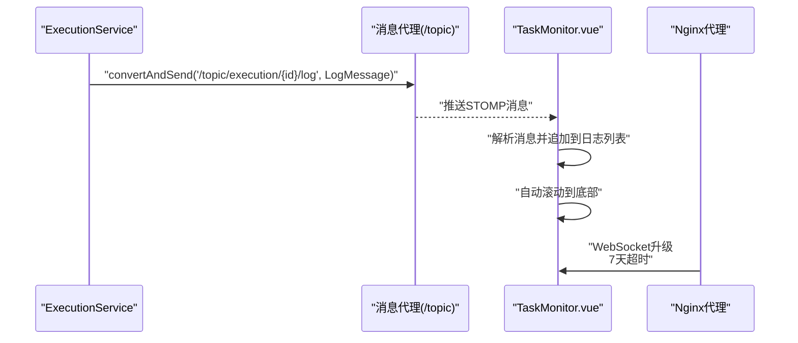
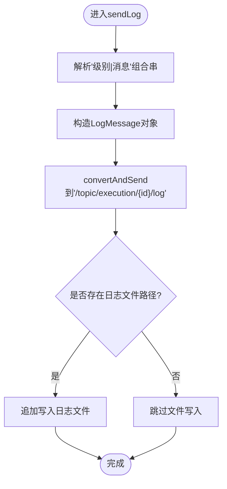
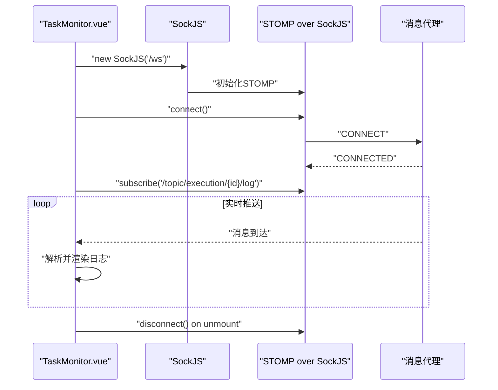
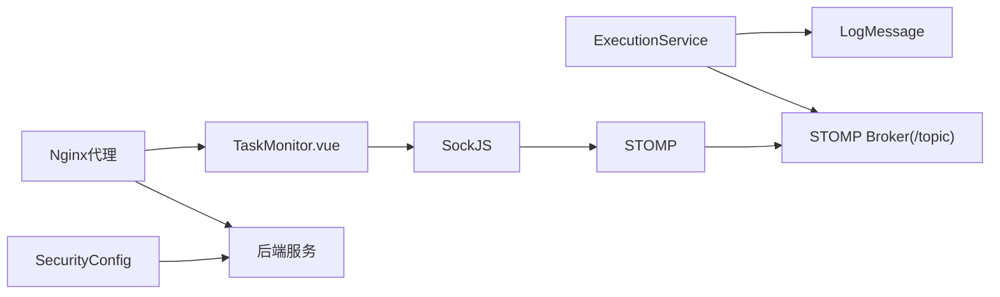

# 实时通信系统

<cite>
**本文引用的文件**
- [WebSocketConfig.java](file://backend/src/main/java/com/fieldcheck/config/WebSocketConfig.java)
- [ExecutionService.java](file://backend/src/main/java/com/fieldcheck/service/ExecutionService.java)
- [LogMessage.java](file://backend/src/main/java/com/fieldcheck/dto/LogMessage.java)
- [TaskMonitor.vue](file://frontend/src/views/task/TaskMonitor.vue)
- [SecurityConfig.java](file://backend/src/main/java/com/fieldcheck/config/SecurityConfig.java)
- [nginx.conf](file://frontend/nginx.conf)
</cite>

## 更新摘要
**变更内容**
- 优化WebSocket代理配置和Nginx集成，增强实时日志流功能
- 前端使用相对路径'/ws'的SockJS连接，提高代理兼容性
- 后端SecurityConfig禁用frameOptions以支持Nginx代理
- Nginx配置优化，增加7天超时支持长时间任务监控
- 增强的错误处理和资源清理机制

## 目录
1. [简介](#简介)
2. [项目结构](#项目结构)
3. [核心组件](#核心组件)
4. [架构总览](#架构总览)
5. [详细组件分析](#详细组件分析)
6. [依赖分析](#依赖分析)
7. [性能考虑](#性能考虑)
8. [故障排查指南](#故障排查指南)
9. [结论](#结论)
10. [附录](#附录)

## 简介
本文件面向MySQL风险字段检查平台的实时通信系统，聚焦于基于Spring WebSocket与STOMP/SockJS的消息推送机制。内容涵盖WebSocket配置与实现原理（连接建立、消息传递、连接管理）、实时状态推送（任务执行进度、风险检测结果、系统通知）、消息格式与事件类型设计、前端集成与错误处理策略、性能优化与稳定性保障、以及调试与监控方法。

**更新** 新增Nginx代理配置优化和增强的错误处理机制，支持长时间任务监控和更好的代理兼容性。

## 项目结构
后端采用Spring Boot + Spring WebSocket + STOMP/SockJS；前端使用Vue 3 + SockJS Client + Stomp.js订阅主题。WebSocket端点通过SockJS兼容多种传输方式，消息以STOMP帧形式在服务端启用的简单消息代理上分发。Nginx作为反向代理，支持7天超时的WebSocket连接。

```mermaid
graph TB
subgraph "后端"
Cfg["WebSocketConfig<br/>注册/路由/代理"]
ExecSvc["ExecutionService<br/>发送日志/进度"]
Dto["LogMessage<br/>消息载体"]
SecCfg["SecurityConfig<br/>禁用frameOptions"]
end
subgraph "前端"
View["TaskMonitor.vue<br/>连接/订阅/渲染"]
end
subgraph "Nginx代理"
Nginx["nginx.conf<br/>7天超时/代理配置"]
end
View --> |"SockJS + STOMP<br/>相对路径'/ws'|" Cfg
ExecSvc --> |"convertAndSend"| Cfg
Cfg --> |"Simple Broker"| View
ExecSvc --> |"构建消息"| Dto
Nginx --> |"WebSocket代理"| Cfg
SecCfg --> |"支持Nginx代理"| Cfg
```

**图表来源**
- [WebSocketConfig.java:11-25](file://backend/src/main/java/com/fieldcheck/config/WebSocketConfig.java#L11-L25)
- [ExecutionService.java:237-268](file://backend/src/main/java/com/fieldcheck/service/ExecutionService.java#L237-L268)
- [LogMessage.java:14-23](file://backend/src/main/java/com/fieldcheck/dto/LogMessage.java#L14-L23)
- [TaskMonitor.vue:99-119](file://frontend/src/views/task/TaskMonitor.vue#L99-L119)
- [SecurityConfig.java:63-70](file://backend/src/main/java/com/fieldcheck/config/SecurityConfig.java#L63-L70)
- [nginx.conf:45-57](file://frontend/nginx.conf#L45-L57)

**章节来源**
- [WebSocketConfig.java:1-26](file://backend/src/main/java/com/fieldcheck/config/WebSocketConfig.java#L1-L26)
- [TaskMonitor.vue:1-296](file://frontend/src/views/task/TaskMonitor.vue#L1-L296)
- [nginx.conf:1-69](file://frontend/nginx.conf#L1-L69)

## 核心组件
- **WebSocket配置与端点**
  - 启用WebSocket消息代理，设置目的地前缀与简单代理路径，注册SockJS端点"/ws"，允许跨域。
- **消息代理与目的地**
  - 使用"/topic"作为发布/订阅通道前缀；应用消息前缀为"/app"。服务端向"/topic/execution/{id}/log"推送日志。
- **消息载体**
  - 日志消息对象包含执行ID、时间戳、级别（INFO/WARN/ERROR）、消息正文及可选的进度字段。
- **前端连接与订阅**
  - 使用SockJS封装STOMP，连接到相对路径"/ws"，订阅"/topic/execution/{id}/log"，实时渲染日志与状态。
- **Nginx代理配置**
  - 支持WebSocket升级，配置7天超时，确保长时间任务监控的稳定性。

**更新** 新增Nginx代理配置和相对路径连接优化。

**章节来源**
- [WebSocketConfig.java:13-24](file://backend/src/main/java/com/fieldcheck/config/WebSocketConfig.java#L13-L24)
- [ExecutionService.java:237-268](file://backend/src/main/java/com/fieldcheck/service/ExecutionService.java#L237-L268)
- [LogMessage.java:14-23](file://backend/src/main/java/com/fieldcheck/dto/LogMessage.java#L14-L23)
- [TaskMonitor.vue:108-132](file://frontend/src/views/task/TaskMonitor.vue#L108-L132)
- [SecurityConfig.java:63-70](file://backend/src/main/java/com/fieldcheck/config/SecurityConfig.java#L63-L70)
- [nginx.conf:45-57](file://frontend/nginx.conf#L45-L57)

## 架构总览
下图展示从任务执行到前端实时日志推送的关键流程：后端服务生成日志消息，经STOMP代理广播至订阅者；前端通过SockJS/STOMP订阅主题，接收并渲染。Nginx作为反向代理，支持WebSocket升级和7天超时。



**图表来源**
- [ExecutionService.java:237-268](file://backend/src/main/java/com/fieldcheck/service/ExecutionService.java#L237-L268)
- [TaskMonitor.vue:105-118](file://frontend/src/views/task/TaskMonitor.vue#L105-L118)
- [nginx.conf:45-57](file://frontend/nginx.conf#L45-L57)

## 详细组件分析

### 后端WebSocket配置
- **配置要点**
  - 启用消息代理并指定"/topic"为订阅通道。
  - 设置应用消息前缀为"/app"，用于控制器或处理器映射。
  - 注册SockJS端点"/ws"，允许任意源访问，增强浏览器兼容性。
- **安全注意**
  - 当前安全配置对"/ws/**"放行，确保WebSocket握手与数据传输不受拦截。
  - 禁用frameOptions以支持Nginx代理，避免X-Frame-Options冲突。

**更新** 新增frameOptions禁用配置，支持Nginx代理。

**章节来源**
- [WebSocketConfig.java:13-24](file://backend/src/main/java/com/fieldcheck/config/WebSocketConfig.java#L13-L24)
- [SecurityConfig.java:63-70](file://backend/src/main/java/com/fieldcheck/config/SecurityConfig.java#L63-L70)

### 执行日志推送（服务端）
- **日志消息构建**
  - 解析"级别|消息体"的组合字符串，提取级别与正文，填充时间戳与执行ID。
- **发布机制**
  - 使用消息模板向"/topic/execution/{executionId}/log"发送日志消息。
- **文件落盘**
  - 若执行记录存在日志文件路径，则同步写入本地文件，便于离线回溯。



**图表来源**
- [ExecutionService.java:237-268](file://backend/src/main/java/com/fieldcheck/service/ExecutionService.java#L237-L268)

**章节来源**
- [ExecutionService.java:237-268](file://backend/src/main/java/com/fieldcheck/service/ExecutionService.java#L237-L268)

### 日志消息模型
- **字段说明**
  - 执行ID、时间戳、日志级别（INFO/WARN/ERROR）、消息正文。
  - 可选字段：当前表名、已处理表数、总表数、进度百分比，便于前端展示执行进度。

**章节来源**
- [LogMessage.java:14-23](file://backend/src/main/java/com/fieldcheck/dto/LogMessage.java#L14-L23)

### 前端连接与订阅
- **连接建立**
  - 使用SockJS客户端连接后端"/ws"，通过STOMP封装协议。
  - 成功连接后订阅"/topic/execution/{executionId}/log"主题。
- **消息处理**
  - 接收消息后解析JSON，将日志项推送到本地数组，自动滚动到底部。
- **生命周期管理**
  - 组件卸载时清理轮询定时器并断开STOMP连接，避免内存泄漏与悬挂连接。
- **错误处理**
  - 连接错误回调中记录错误信息，禁用STOMP调试输出，避免控制台刷屏。

**更新** 前端使用相对路径'/ws'连接，增强代理兼容性；新增错误处理和资源清理机制。



**图表来源**
- [TaskMonitor.vue:108-132](file://frontend/src/views/task/TaskMonitor.vue#L108-L132)
- [TaskMonitor.vue:245-250](file://frontend/src/views/task/TaskMonitor.vue#L245-L250)

**章节来源**
- [TaskMonitor.vue:108-132](file://frontend/src/views/task/TaskMonitor.vue#L108-L132)
- [TaskMonitor.vue:182-204](file://frontend/src/views/task/TaskMonitor.vue#L182-L204)
- [TaskMonitor.vue:245-250](file://frontend/src/views/task/TaskMonitor.vue#L245-L250)

### Nginx代理配置
- **WebSocket支持**
  - 配置"/ws"路径的代理，支持WebSocket升级协议。
  - 设置代理头包括Upgrade和Connection，确保WebSocket正常工作。
- **超时配置**
  - 连接超时、发送超时、读取超时均设置为7天（7d），支持长时间任务监控。
- **代理转发**
  - 将"/ws"请求转发到后端8080端口，保持原始Host和IP信息。
- **安全头**
  - 设置X-Frame-Options为SAMEORIGIN，与后端禁用frameOptions配合使用。

**更新** 新增完整的Nginx代理配置，支持7天超时和WebSocket升级。

**章节来源**
- [nginx.conf:45-57](file://frontend/nginx.conf#L45-L57)
- [nginx.conf:14-18](file://frontend/nginx.conf#L14-L18)

### 任务状态与进度推送
- **现状**
  - 日志消息包含执行ID、时间戳、级别与正文，以及可选的进度字段。
- **建议**
  - 在任务执行过程中，除日志外，还可定期推送执行进度（已处理/总数、风险计数、状态变更）到同一主题或独立主题，前端统一渲染。

**章节来源**
- [LogMessage.java:14-23](file://backend/src/main/java/com/fieldcheck/dto/LogMessage.java#L14-L23)
- [ExecutionService.java:284-305](file://backend/src/main/java/com/fieldcheck/service/ExecutionService.java#L284-L305)

### 消息格式与事件类型设计
- **消息格式**
  - 服务端：LogMessage对象，序列化为JSON后通过STOMP发送。
  - 前端：解析JSON为{timestamp, level, message, ...可选字段}。
- **事件类型**
  - 主题命名：/topic/execution/{executionId}/log
  - 可扩展：/topic/task/{taskId}/status、/topic/alert/{alertId}/notify等，按业务域细分。

**章节来源**
- [LogMessage.java:14-23](file://backend/src/main/java/com/fieldcheck/dto/LogMessage.java#L14-L23)
- [ExecutionService.java:255-255](file://backend/src/main/java/com/fieldcheck/service/ExecutionService.java#L255-L255)
- [TaskMonitor.vue:107-113](file://frontend/src/views/task/TaskMonitor.vue#L107-L113)

### WebSocket客户端集成指南
- **端点与协议**
  - 后端端点：/ws，启用SockJS，支持多种传输（websocket/native、xhr等）。
  - 前端库：sockjs-client + stompjs。
- **订阅主题**
  - 使用唯一执行ID拼接订阅路径，确保多任务并发场景下的隔离。
- **错误处理**
  - 连接错误回调中记录错误信息，必要时进行重连策略（见"性能考虑"）。
- **资源清理**
  - 组件销毁时断开连接、清理定时器，防止资源泄露。
- **代理兼容性**
  - 使用相对路径"/ws"连接，提高Nginx代理兼容性。

**更新** 新增代理兼容性和增强的错误处理策略。

**章节来源**
- [WebSocketConfig.java:20-24](file://backend/src/main/java/com/fieldcheck/config/WebSocketConfig.java#L20-L24)
- [TaskMonitor.vue:108-132](file://frontend/src/views/task/TaskMonitor.vue#L108-L132)
- [TaskMonitor.vue:245-250](file://frontend/src/views/task/TaskMonitor.vue#L245-L250)

### 错误处理策略
- **连接失败**
  - 前端在连接回调中捕获错误，记录并提示用户；可结合指数退避重试。
  - 禁用STOMP调试输出，避免控制台刷屏。
- **订阅异常**
  - 订阅回调内解析失败或空消息时，忽略并记录日志，避免中断后续消息。
- **服务端异常**
  - 发送日志时若写文件失败，记录错误但不影响消息推送。
- **代理错误**
  - Nginx代理配置7天超时，避免长时间任务被中断。
  - WebSocket升级失败时，检查代理头配置和超时设置。

**更新** 新增代理错误处理和7天超时配置。

**章节来源**
- [TaskMonitor.vue:129-131](file://frontend/src/views/task/TaskMonitor.vue#L129-L131)
- [ExecutionService.java:264-267](file://backend/src/main/java/com/fieldcheck/service/ExecutionService.java#L264-L267)
- [nginx.conf:54-56](file://frontend/nginx.conf#L54-L56)

## 依赖分析
- **组件耦合**
  - ExecutionService仅依赖消息模板与实体查询，耦合度低，便于测试与替换。
  - 前端仅依赖SockJS/STOMP库与后端约定的主题命名，解耦良好。
- **外部依赖**
  - Spring WebSocket + STOMP/SockJS；前端sockjs-client与stompjs。
  - Nginx反向代理，支持WebSocket升级和7天超时。
- **安全边界**
  - WebSocket端点对"/ws/**"放行，确保实时通信可用；REST API受JWT过滤器保护。
  - 后端禁用frameOptions，与Nginx安全头配合使用。

**更新** 新增Nginx代理依赖和安全配置分析。



**图表来源**
- [ExecutionService.java:237-268](file://backend/src/main/java/com/fieldcheck/service/ExecutionService.java#L237-L268)
- [LogMessage.java:14-23](file://backend/src/main/java/com/fieldcheck/dto/LogMessage.java#L14-L23)
- [TaskMonitor.vue:108-132](file://frontend/src/views/task/TaskMonitor.vue#L108-L132)
- [nginx.conf:45-57](file://frontend/nginx.conf#L45-L57)
- [SecurityConfig.java:63-70](file://backend/src/main/java/com/fieldcheck/config/SecurityConfig.java#L63-L70)

**章节来源**
- [SecurityConfig.java:63-70](file://backend/src/main/java/com/fieldcheck/config/SecurityConfig.java#L63-L70)

## 性能考虑
- **连接复用与传输选择**
  - SockJS会根据环境选择最优传输；优先使用WebSocket，降级为XHR长轮询时需关注延迟与带宽。
- **消息聚合与节流**
  - 对高频日志可做批量发送或限速，避免前端渲染压力过大。
- **前端渲染优化**
  - 使用虚拟滚动或分页加载历史日志，减少DOM节点数量。
  - 限制最大日志数量（500条），仅渲染最近100条可见日志。
- **连接稳定性**
  - 前端实现指数退避重连；服务端合理配置心跳与超时参数。
  - Nginx配置7天超时，支持长时间任务监控。
- **资源回收**
  - 组件卸载时及时断开连接与清理定时器，避免内存泄漏。
  - 禁用STOMP调试输出，减少控制台开销。

**更新** 新增Nginx超时配置和前端渲染优化策略。

## 故障排查指南
- **无法连接**
  - 检查后端是否正确注册"/ws"端点与允许跨域；确认前端URL与端口一致。
  - 确认Nginx代理配置正确，WebSocket升级头设置完整。
- **订阅不到消息**
  - 确认订阅主题与执行ID匹配；检查服务端是否向对应主题发送消息。
  - 检查Nginx代理是否正确转发到后端8080端口。
- **日志未落盘**
  - 检查执行记录的日志文件路径是否为空或不可写。
- **代理超时问题**
  - 检查Nginx超时配置，确保连接、发送、读取超时均为7天。
  - 验证WebSocket升级协议头是否正确传递。
- **控制台告警**
  - 前端关闭STOMP调试输出，避免控制台刷屏；生产环境保留错误日志。

**更新** 新增Nginx代理和超时问题排查指南。

**章节来源**
- [WebSocketConfig.java:20-24](file://backend/src/main/java/com/fieldcheck/config/WebSocketConfig.java#L20-L24)
- [TaskMonitor.vue:108-132](file://frontend/src/views/task/TaskMonitor.vue#L108-L132)
- [ExecutionService.java:257-267](file://backend/src/main/java/com/fieldcheck/service/ExecutionService.java#L257-L267)
- [nginx.conf:45-57](file://frontend/nginx.conf#L45-L57)

## 结论
该实时通信系统以Spring WebSocket + STOMP/SockJS为基础，实现了任务执行日志的实时推送。通过清晰的主题命名与消息模型，前后端职责明确、耦合度低。**更新** 新增的Nginx代理配置和7天超时支持，显著提升了系统的稳定性和长时间任务监控能力。建议在现有基础上扩展任务状态与风险结果的推送主题，并完善前端重连与渲染优化策略，以进一步提升用户体验与系统稳定性。

## 附录
- **前端集成清单**
  - 引入库：sockjs-client、stompjs
  - 连接：SockJS('/ws') -> Stomp.over(...) -> connect()
  - 订阅：subscribe('/topic/execution/{id}/log', handler)
  - 渲染：解析消息 -> 追加到日志列表 -> 自动滚动
  - 清理：unmounted时 disconnect() 与 clearInterval()
  - 错误处理：禁用STOMP调试输出，记录连接错误
- **Nginx代理配置要点**
  - WebSocket升级头：Upgrade和Connection必须正确传递
  - 超时配置：proxy_connect_timeout、proxy_send_timeout、proxy_read_timeout均为7d
  - 代理路径：/ws -> http://mysql-risk-filed-check-backend:8080
- **安全配置要点**
  - 后端禁用frameOptions，与Nginx安全头配合使用
  - WebSocket端点对/ws/**放行，确保实时通信可用

**章节来源**
- [TaskMonitor.vue:108-132](file://frontend/src/views/task/TaskMonitor.vue#L108-L132)
- [nginx.conf:45-57](file://frontend/nginx.conf#L45-L57)
- [SecurityConfig.java:63-70](file://backend/src/main/java/com/fieldcheck/config/SecurityConfig.java#L63-L70)