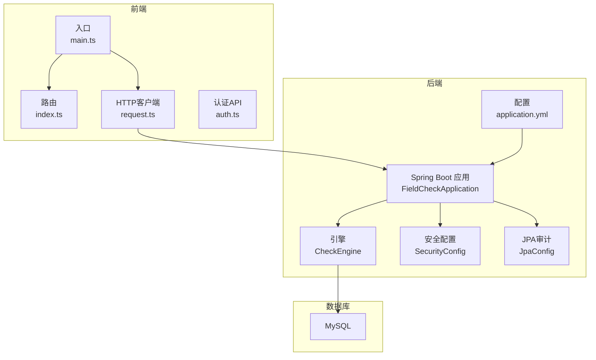
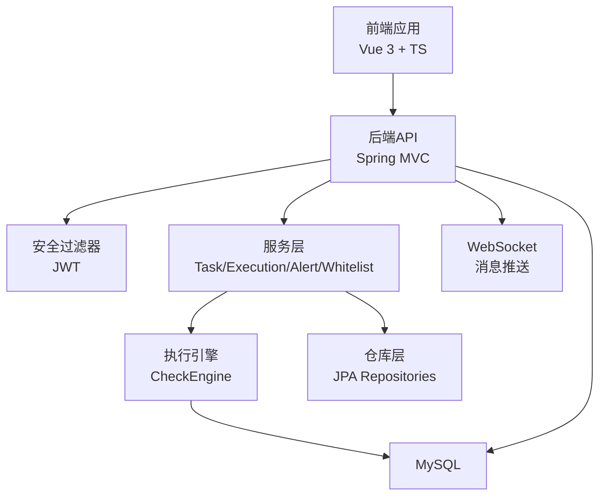
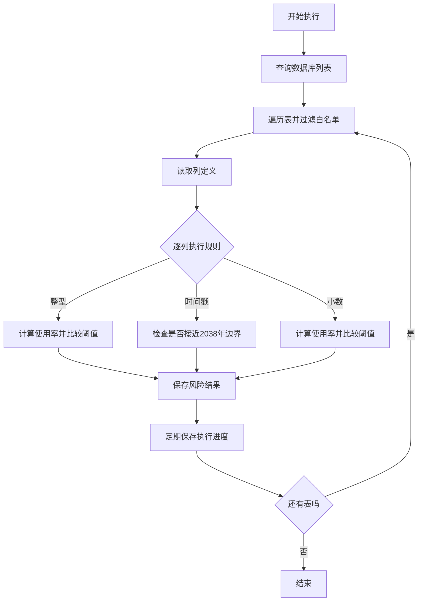
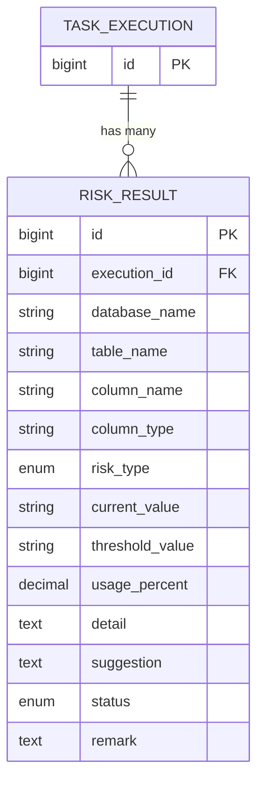
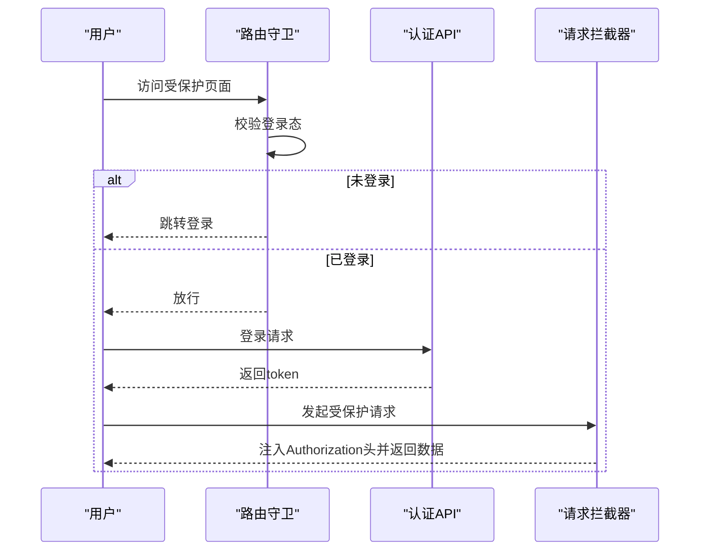
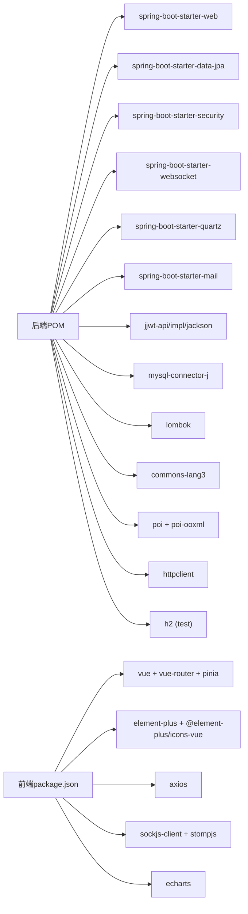

# 开发指南

<cite>
**本文引用的文件**
- [FieldCheckApplication.java](file://backend/src/main/java/com/fieldcheck/FieldCheckApplication.java)
- [application.yml](file://backend/src/main/resources/application.yml)
- [pom.xml](file://backend/pom.xml)
- [docker-compose.yml](file://docker-compose.yml)
- [start.sh](file://start.sh)
- [CheckEngine.java](file://backend/src/main/java/com/fieldcheck/engine/CheckEngine.java)
- [RiskResult.java](file://backend/src/main/java/com/fieldcheck/entity/RiskResult.java)
- [SecurityConfig.java](file://backend/src/main/java/com/fieldcheck/config/SecurityConfig.java)
- [JpaConfig.java](file://backend/src/main/java/com/fieldcheck/config/JpaConfig.java)
- [main.ts](file://frontend/src/main.ts)
- [index.ts](file://frontend/src/router/index.ts)
- [request.ts](file://frontend/src/utils/request.ts)
- [auth.ts](file://frontend/src/api/auth.ts)
</cite>

## 目录
1. [简介](#简介)
2. [项目结构](#项目结构)
3. [核心组件](#核心组件)
4. [架构总览](#架构总览)
5. [详细组件分析](#详细组件分析)
6. [依赖分析](#依赖分析)
7. [性能考量](#性能考量)
8. [故障排查指南](#故障排查指南)
9. [结论](#结论)
10. [附录](#附录)

## 简介
本指南面向MySQL风险字段检查平台的开发者，提供从环境搭建、代码规范、模块划分、Git工作流、测试策略、调试与排错，到新功能开发流程与质量保障的完整说明。平台采用前后端分离架构：后端基于Spring Boot，使用JPA/Hibernate、Quartz调度、WebSocket推送、JWT鉴权；前端基于Vue 3 + TypeScript + Element Plus，通过Axios统一请求拦截处理。

## 项目结构
- 后端 backend
  - Java源码位于 src/main/java/com/fieldcheck，按领域分层组织（controller/dto/service/repository/entity/config/aspect/websocket/engine/util）
  - 配置位于 src/main/resources，包含应用配置、数据库迁移脚本目录等
  - 构建使用 Maven，核心依赖集中在 pom.xml
- 前端 frontend
  - 使用 Vite + Vue 3 + TypeScript，路由、状态、API封装清晰
  - 统一通过 /api 前缀代理到后端
- 运维
  - docker-compose 编排MySQL、后端、前端(Nginx)三服务
  - 提供一键启动脚本 start.sh

图表来源
- [FieldCheckApplication.java](file://backend/src/main/java/com/fieldcheck/FieldCheckApplication.java#L1-L17)
- [application.yml](file://backend/src/main/resources/application.yml#L1-L75)
- [CheckEngine.java](file://backend/src/main/java/com/fieldcheck/engine/CheckEngine.java#L1-L454)
- [SecurityConfig.java](file://backend/src/main/java/com/fieldcheck/config/SecurityConfig.java#L1-L60)
- [JpaConfig.java](file://backend/src/main/java/com/fieldcheck/config/JpaConfig.java#L1-L10)
- [main.ts](file://frontend/src/main.ts#L1-L23)
- [index.ts](file://frontend/src/router/index.ts#L1-L116)
- [request.ts](file://frontend/src/utils/request.ts#L1-L47)
- [auth.ts](file://frontend/src/api/auth.ts#L1-L27)

章节来源
- [FieldCheckApplication.java](file://backend/src/main/java/com/fieldcheck/FieldCheckApplication.java#L1-L17)
- [application.yml](file://backend/src/main/resources/application.yml#L1-L75)
- [pom.xml](file://backend/pom.xml#L1-L161)
- [docker-compose.yml](file://docker-compose.yml#L1-L91)
- [start.sh](file://start.sh#L1-L80)
- [main.ts](file://frontend/src/main.ts#L1-L23)
- [index.ts](file://frontend/src/router/index.ts#L1-L116)
- [request.ts](file://frontend/src/utils/request.ts#L1-L47)
- [auth.ts](file://frontend/src/api/auth.ts#L1-L27)

## 核心组件
- 应用入口与开关
  - 启用异步与定时任务，作为Spring Boot主程序运行
- 安全与鉴权
  - 基于JWT的无状态会话，全局拦截器在过滤器链中生效
- 数据访问与审计
  - JPA审计启用，实体基类统一审计字段
- 执行引擎
  - 风险扫描核心，支持整型溢出、Y2038、小数溢出等规则，带采样与白名单跳过逻辑
- 前端基础
  - 路由守卫、请求拦截、响应拦截、认证API

章节来源
- [FieldCheckApplication.java](file://backend/src/main/java/com/fieldcheck/FieldCheckApplication.java#L1-L17)
- [SecurityConfig.java](file://backend/src/main/java/com/fieldcheck/config/SecurityConfig.java#L1-L60)
- [JpaConfig.java](file://backend/src/main/java/com/fieldcheck/config/JpaConfig.java#L1-L10)
- [CheckEngine.java](file://backend/src/main/java/com/fieldcheck/engine/CheckEngine.java#L1-L454)
- [RiskResult.java](file://backend/src/main/java/com/fieldcheck/entity/RiskResult.java#L1-L68)
- [main.ts](file://frontend/src/main.ts#L1-L23)
- [index.ts](file://frontend/src/router/index.ts#L1-L116)
- [request.ts](file://frontend/src/utils/request.ts#L1-L47)
- [auth.ts](file://frontend/src/api/auth.ts#L1-L27)

## 架构总览
后端采用分层架构：控制器层接收请求，服务层编排业务，仓库层访问持久化，引擎层执行核心算法。前端通过Axios统一发起REST请求，路由守卫控制访问权限，WebSocket用于实时推送（后端配置存在但具体实现需结合实际视图组件）。数据库通过JPA/Hibernate进行对象关系映射，Quartz负责任务调度。

图表来源
- [SecurityConfig.java](file://backend/src/main/java/com/fieldcheck/config/SecurityConfig.java#L45-L58)
- [CheckEngine.java](file://backend/src/main/java/com/fieldcheck/engine/CheckEngine.java#L57-L139)
- [RiskResult.java](file://backend/src/main/java/com/fieldcheck/entity/RiskResult.java#L23-L67)
- [main.ts](file://frontend/src/main.ts#L1-L23)
- [index.ts](file://frontend/src/router/index.ts#L102-L113)
- [request.ts](file://frontend/src/utils/request.ts#L10-L21)

## 详细组件分析

### 后端应用与配置
- 应用入口
  - 启用异步与定时任务，加载Spring上下文
- 数据源与JPA
  - Hikari连接池参数、MySQL方言、DDL策略、时区与日志格式
- Quartz
  - JDBC Job Store初始化策略
- JWT与加密
  - JWT密钥与过期时间、AES密钥用于敏感信息加密
- 日志
  - 控制台与包级别日志输出

章节来源
- [FieldCheckApplication.java](file://backend/src/main/java/com/fieldcheck/FieldCheckApplication.java#L8-L11)
- [application.yml](file://backend/src/main/resources/application.yml#L8-L75)

### 执行引擎（CheckEngine）
- 功能职责
  - 遍历匹配的数据库与表，按列扫描风险，支持白名单跳过、采样与进度保存
- 关键流程
  - 获取数据库列表、表列表、列定义
  - 针对每列执行规则检查（整型溢出、Y2038、小数溢出）
  - 计算使用率阈值，生成风险结果并入库
- 性能优化
  - 大表采样、批量保存进度、事务模板减少写入压力

图表来源
- [CheckEngine.java](file://backend/src/main/java/com/fieldcheck/engine/CheckEngine.java#L57-L139)
- [CheckEngine.java](file://backend/src/main/java/com/fieldcheck/engine/CheckEngine.java#L216-L256)
- [CheckEngine.java](file://backend/src/main/java/com/fieldcheck/engine/CheckEngine.java#L258-L384)

章节来源
- [CheckEngine.java](file://backend/src/main/java/com/fieldcheck/engine/CheckEngine.java#L1-L454)

### 实体模型（以风险结果为例）
- 表结构要点
  - 外键关联执行记录、枚举字段、数值与百分比、文本详情与建议、状态与备注
  - 为执行ID、风险类型、状态建立索引
- 设计意图
  - 支持按执行、类型、状态快速检索，便于报表与告警

图表来源
- [RiskResult.java](file://backend/src/main/java/com/fieldcheck/entity/RiskResult.java#L17-L67)

章节来源
- [RiskResult.java](file://backend/src/main/java/com/fieldcheck/entity/RiskResult.java#L1-L68)

### 安全与鉴权
- 配置要点
  - 允许的路径放行（认证、WebSocket、健康检查）
  - 其余接口需认证
  - 无状态会话策略
- 建议
  - 生产环境确保HTTPS、合理设置JWT过期时间与刷新策略

章节来源
- [SecurityConfig.java](file://backend/src/main/java/com/fieldcheck/config/SecurityConfig.java#L44-L58)

### 前端路由与请求拦截
- 路由守卫
  - 登录态校验、登录页直返、标题元信息
- 请求拦截
  - 自动注入Authorization头、401自动登出、403提示权限不足、统一错误提示
- 认证API
  - 登录、登出、获取当前用户

图表来源
- [index.ts](file://frontend/src/router/index.ts#L102-L113)
- [auth.ts](file://frontend/src/api/auth.ts#L16-L26)
- [request.ts](file://frontend/src/utils/request.ts#L10-L21)

章节来源
- [index.ts](file://frontend/src/router/index.ts#L1-L116)
- [request.ts](file://frontend/src/utils/request.ts#L1-L47)
- [auth.ts](file://frontend/src/api/auth.ts#L1-L27)

## 依赖分析
- 后端依赖
  - Spring Web、Data JPA、Security、WebSocket、Validation、AOP、Quartz、Mail
  - MySQL驱动、JWT实现、Lombok、Apache Commons、POI、HTTP Client、H2测试库
- 前端依赖
  - Vue 3、Vue Router、Pinia、Element Plus、ECharts、SockJS、StompJS、Axios

图表来源
- [pom.xml](file://backend/pom.xml#L28-L142)
- [package.json](file://frontend/package.json#L11-L31)

章节来源
- [pom.xml](file://backend/pom.xml#L1-L161)
- [package.json](file://frontend/package.json#L1-L33)

## 性能考量
- 数据库层
  - 合理设置连接池参数，避免超时与连接泄漏
  - 对高频查询列建立索引（如执行ID、风险类型、状态）
- 扫描层
  - 大表采用采样降低开销，阈值与采样大小可调
  - 分批保存执行进度，减少事务压力
- 并发与异步
  - 启用异步与调度，避免阻塞主线程
- 前端
  - 列表分页与懒加载、缓存与防抖

章节来源
- [application.yml](file://backend/src/main/resources/application.yml#L13-L22)
- [RiskResult.java](file://backend/src/main/java/com/fieldcheck/entity/RiskResult.java#L17-L21)
- [CheckEngine.java](file://backend/src/main/java/com/fieldcheck/engine/CheckEngine.java#L273-L277)
- [CheckEngine.java](file://backend/src/main/java/com/fieldcheck/engine/CheckEngine.java#L125-L131)
- [FieldCheckApplication.java](file://backend/src/main/java/com/fieldcheck/FieldCheckApplication.java#L8-L11)

## 故障排查指南
- 启动与容器
  - 使用一键脚本检查Docker与Compose版本，确认.env配置，查看服务健康状态与日志
- 数据库连接
  - 校验URL、用户名、密码与字符集；确认MySQL健康检查成功
- 认证与鉴权
  - 检查JWT密钥与过期时间；确认请求头Authorization正确注入
- 执行异常
  - 关注引擎日志与异常栈；核对白名单规则与采样参数
- 前端请求
  - 观察401/403响应与错误提示；确认路由守卫逻辑

章节来源
- [start.sh](file://start.sh#L11-L27)
- [docker-compose.yml](file://docker-compose.yml#L22-L26)
- [application.yml](file://backend/src/main/resources/application.yml#L56-L62)
- [request.ts](file://frontend/src/utils/request.ts#L24-L44)
- [index.ts](file://frontend/src/router/index.ts#L102-L113)
- [CheckEngine.java](file://backend/src/main/java/com/fieldcheck/engine/CheckEngine.java#L135-L139)

## 结论
本指南提供了从环境搭建到开发运维的全流程指引。建议在开发中遵循统一的代码规范与模块划分，严格遵守Git工作流与提交规范，完善单元与集成测试，并持续关注性能与质量保障流程，以确保平台稳定高效地运行。

## 附录

### 开发环境搭建步骤
- 后端
  - 安装JDK 1.8+、Maven、MySQL
  - 配置数据库与用户，准备schema初始化脚本
  - 修改后端配置文件中的数据库连接、JWT与AES密钥
  - 运行后端应用或使用Docker Compose
- 前端
  - 安装Node.js与包管理器
  - 安装依赖并启动开发服务器
  - 确认代理到后端 /api 接口
- 一键启动
  - 准备 .env 示例并复制为 .env
  - 使用脚本启动/停止/重启/查看日志/清理

章节来源
- [application.yml](file://backend/src/main/resources/application.yml#L8-L12)
- [docker-compose.yml](file://docker-compose.yml#L37-L43)
- [start.sh](file://start.sh#L22-L27)
- [package.json](file://frontend/package.json#L6-L10)

### 代码规范与最佳实践
- 命名约定
  - 包名全小写；类名帕斯卡；常量全大写；字段与方法驼峰
- 注释规范
  - 公共API与复杂逻辑添加必要注释；保持简洁明确
- 代码组织
  - 按领域分层（controller/service/repository/entity），避免交叉耦合
- 安全
  - 密码与敏感信息使用AES加密；JWT密钥妥善保管
- 日志
  - 统一日志格式与级别，区分业务日志与调试日志

章节来源
- [application.yml](file://backend/src/main/resources/application.yml#L56-L62)
- [JpaConfig.java](file://backend/src/main/java/com/fieldcheck/config/JpaConfig.java#L1-L10)

### Git工作流程与提交规范
- 分支策略
  - 主分支只合并已测试通过的功能
  - 功能开发在特性分支上进行
- 提交规范
  - 标题简明，正文说明动机与影响
  - 单一职责，避免“混合提交”
- 审查与合并
  - 提交PR，至少一次审查通过后再合并

[本节为通用实践建议，不直接分析具体文件]

### 单元测试与集成测试
- 单元测试
  - 使用Spring Boot Test与Mock，覆盖关键服务与工具类
- 集成测试
  - 使用H2内存数据库或Docker Compose环境，验证端到端流程
- 建议
  - 覆盖核心业务逻辑、异常场景与边界条件

章节来源
- [pom.xml](file://backend/pom.xml#L124-L142)

### 新功能开发指导流程
- 需求评审 → 设计（实体/接口/流程） → 编码（分层实现） → 单测 → 集成测试 → 文档更新 → PR审查 → 合并发布

[本节为通用流程建议，不直接分析具体文件]

### 调试技巧与问题排查
- 后端
  - 启用DEBUG日志级别，定位SQL与异常堆栈
  - 使用Actuator健康检查端点
- 前端
  - 浏览器开发者工具观察请求与响应
  - 路由守卫与拦截器配合定位权限问题
- 数据库
  - 校验连接参数、字符集与索引

章节来源
- [application.yml](file://backend/src/main/resources/application.yml#L69-L75)
- [docker-compose.yml](file://docker-compose.yml#L52-L57)
- [request.ts](file://frontend/src/utils/request.ts#L24-L44)

### 性能测试与质量保证
- 性能测试
  - 使用采样与阈值参数评估大表扫描性能
  - 监控连接池与数据库负载
- 质量保证
  - 代码静态检查、单元测试覆盖率、集成测试回归

章节来源
- [CheckEngine.java](file://backend/src/main/java/com/fieldcheck/engine/CheckEngine.java#L273-L277)
- [application.yml](file://backend/src/main/resources/application.yml#L13-L22)