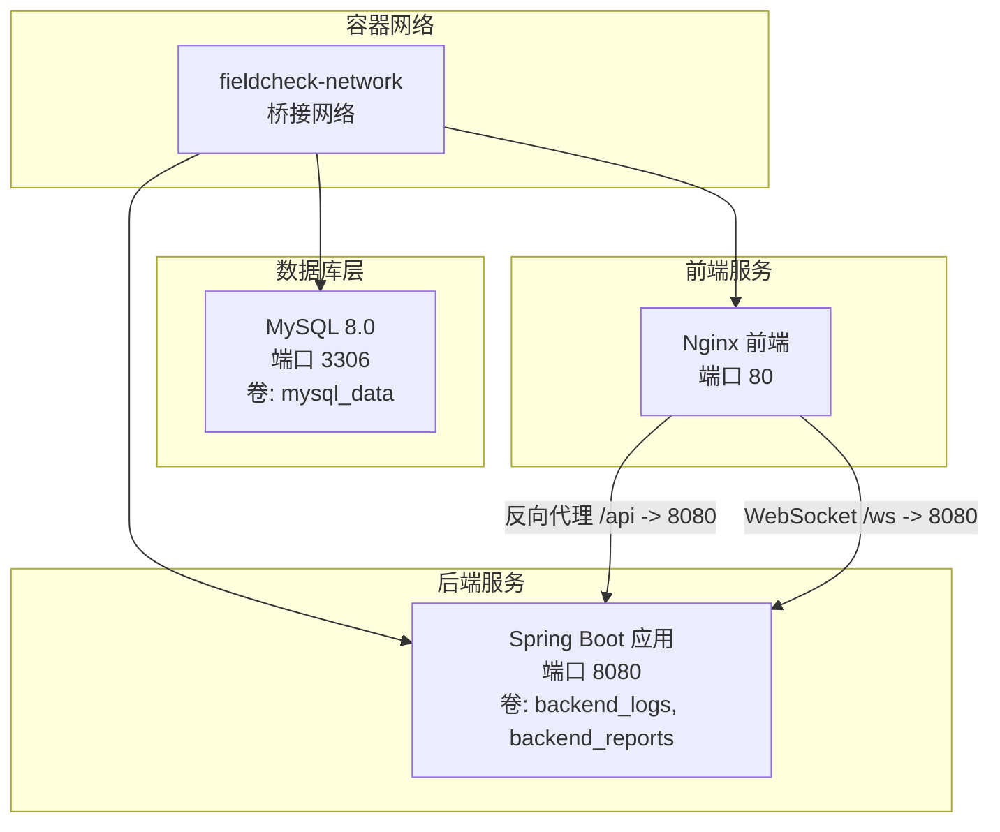
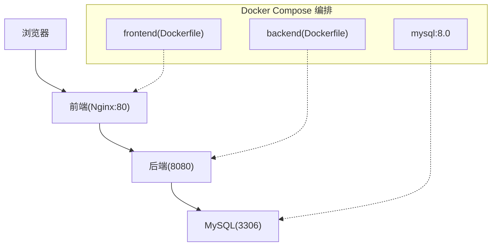
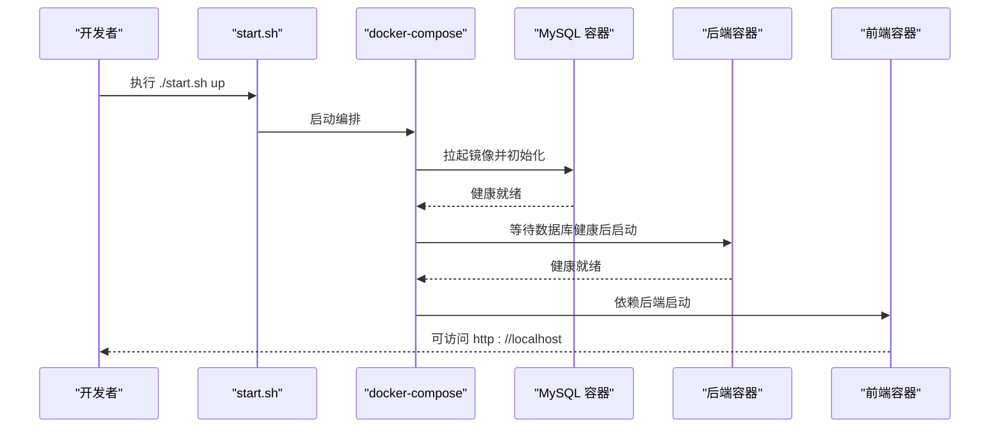
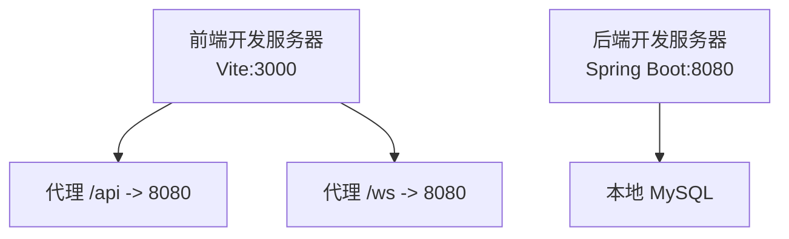
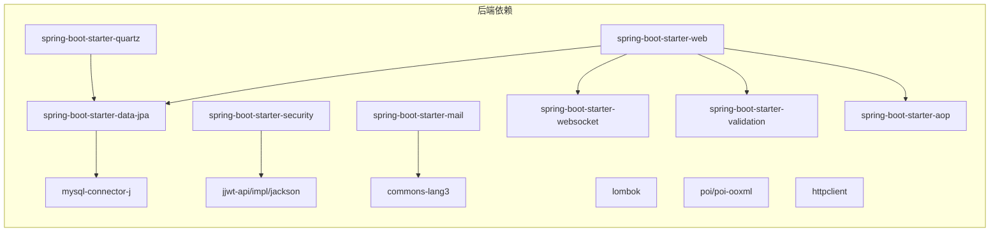

# 快速开始

<cite>
**本文引用的文件**
- [docker-compose.yml](file://docker-compose.yml)
- [start.sh](file://start.sh)
- [backend/pom.xml](file://backend/pom.xml)
- [frontend/package.json](file://frontend/package.json)
- [backend/src/main/resources/application.yml](file://backend/src/main/resources/application.yml)
- [backend/src/main/resources/application-docker.yml](file://backend/src/main/resources/application-docker.yml)
- [backend/Dockerfile](file://backend/Dockerfile)
- [frontend/Dockerfile](file://frontend/Dockerfile)
- [mysql/conf/my.cnf](file://mysql/conf/my.cnf)
- [mysql/init/01_init_schema.sql](file://mysql/init/01_init_schema.sql)
- [frontend/vite.config.ts](file://frontend/vite.config.ts)
- [backend/src/main/java/com/fieldcheck/FieldCheckApplication.java](file://backend/src/main/java/com/fieldcheck/FieldCheckApplication.java)
- [.gitignore](file://.gitignore)
</cite>

## 目录
1. [简介](#简介)
2. [项目结构](#项目结构)
3. [核心组件](#核心组件)
4. [架构总览](#架构总览)
5. [详细组件分析](#详细组件分析)
6. [依赖关系分析](#依赖关系分析)
7. [性能注意事项](#性能注意事项)
8. [故障排查指南](#故障排查指南)
9. [结论](#结论)
10. [附录](#附录)

## 简介
本指南面向初学者，帮助您在最短时间内完成 MySQL 风险字段检查平台的安装与启动。内容涵盖：
- 环境准备与依赖安装
- Docker 容器化部署全流程（含数据库初始化与应用启动）
- 本地开发环境搭建（前后端分别启动）
- 基本配置说明与常见问题解决
- 首次使用操作示例，帮助快速体验核心功能

## 项目结构
该仓库采用前后端分离架构，配合 Docker Compose 实现一键部署。核心目录与职责如下：
- backend：Spring Boot 后端工程，包含配置、实体、控制器、服务、定时任务等模块
- frontend：Vue 3 前端工程，使用 Vite 开发服务器与 Nginx 打包
- mysql：MySQL 初始化配置与数据库脚本
- docker-compose.yml：编排 MySQL、后端、前端三服务
- start.sh：一键启动/停止/重启/查看状态/清理数据的脚本

图表来源
- [docker-compose.yml](file://docker-compose.yml#L1-L91)

章节来源
- [docker-compose.yml](file://docker-compose.yml#L1-L91)
- [backend/src/main/resources/application.yml](file://backend/src/main/resources/application.yml#L1-L75)
- [frontend/vite.config.ts](file://frontend/vite.config.ts#L16-L30)

## 核心组件
- MySQL 数据库：提供持久化存储，初始化脚本创建业务表与默认管理员账户
- Spring Boot 后端：提供 REST API、安全认证、定时任务、审计日志、WebSocket 推送等能力
- Vue 前端：基于 Element Plus 的管理界面，通过 /api 前缀调用后端接口，支持 WebSocket 实时推送

章节来源
- [backend/src/main/java/com/fieldcheck/FieldCheckApplication.java](file://backend/src/main/java/com/fieldcheck/FieldCheckApplication.java#L1-L17)
- [frontend/package.json](file://frontend/package.json#L1-L33)
- [backend/pom.xml](file://backend/pom.xml#L28-L142)

## 架构总览
下图展示容器化部署的整体交互：前端通过 Nginx 提供静态资源与反向代理，后端负责业务逻辑与数据库访问，MySQL 存储业务数据。

图表来源
- [docker-compose.yml](file://docker-compose.yml#L3-L78)
- [backend/Dockerfile](file://backend/Dockerfile#L1-L44)
- [frontend/Dockerfile](file://frontend/Dockerfile#L1-L35)

## 详细组件分析

### Docker 容器化部署（推荐）
- 环境要求
  - 已安装 Docker 与 docker-compose 或 Docker Compose v2
  - Linux/macOS/Windows（WSL2）均可运行
- 步骤
  1) 准备环境变量文件
     - 若不存在 .env，则自动复制示例模板并提示修改
  2) 启动服务
     - 使用脚本一键启动：./start.sh up
     - 访问地址：
       - 前端：http://localhost
       - 后端：http://localhost:8080
  3) 数据库初始化
     - 首次启动时，MySQL 会执行 /docker-entrypoint-initdb.d 下的 SQL 脚本
     - 脚本创建数据库、表结构并插入默认管理员账户
  4) 应用健康检查
     - 后端与前端均配置了健康检查，可通过 ./start.sh status 查看
  5) 停止/重启/日志/清理
     - ./start.sh down | restart | logs | status | clean

图表来源
- [start.sh](file://start.sh#L32-L57)
- [docker-compose.yml](file://docker-compose.yml#L49-L58)

章节来源
- [start.sh](file://start.sh#L1-L80)
- [docker-compose.yml](file://docker-compose.yml#L1-L91)
- [mysql/init/01_init_schema.sql](file://mysql/init/01_init_schema.sql#L1-L185)

### 本地开发环境搭建
- 前端开发
  - 使用 Vite 开发服务器，默认监听 3000 端口
  - 通过代理将 /api 与 /ws 请求转发至后端 8080 端口
  - 启动命令：npm run dev（需 Node.js 18+）
- 后端开发
  - 使用 Maven 构建，Java 8 兼容
  - 直接运行 Spring Boot 主类或通过 Maven 启动
  - 数据库连接默认指向本地 MySQL（application.yml）

图表来源
- [frontend/vite.config.ts](file://frontend/vite.config.ts#L16-L30)
- [backend/src/main/resources/application.yml](file://backend/src/main/resources/application.yml#L8-L22)

章节来源
- [frontend/vite.config.ts](file://frontend/vite.config.ts#L1-L31)
- [backend/src/main/resources/application.yml](file://backend/src/main/resources/application.yml#L1-L75)
- [backend/pom.xml](file://backend/pom.xml#L21-L26)

### 配置说明
- 后端配置
  - 本地开发：application.yml（默认连接本地 MySQL，JPA 自动建模，Quartz JDBC 初始化）
  - Docker 环境：application-docker.yml（通过环境变量注入数据源、JWT、AES 密钥）
- 前端配置
  - Vite 代理：将 /api 与 /ws 代理到后端 8080
  - 开发端口：3000
- 数据库配置
  - MySQL 字符集：utf8mb4，排序规则：utf8mb4_unicode_ci
  - 慢查询日志开启，长查询阈值为 2 秒
  - 默认时区：+08:00

章节来源
- [backend/src/main/resources/application.yml](file://backend/src/main/resources/application.yml#L1-L75)
- [backend/src/main/resources/application-docker.yml](file://backend/src/main/resources/application-docker.yml#L1-L46)
- [frontend/vite.config.ts](file://frontend/vite.config.ts#L16-L30)
- [mysql/conf/my.cnf](file://mysql/conf/my.cnf#L1-L31)

### 首次使用操作示例
- 登录
  - 默认管理员：admin / admin123（BCrypt 加密存储）
- 基本流程
  1) 新增数据库连接（主机、端口、用户名、密码、备注）
  2) 创建检查任务（名称、Cron 表达式、扫描范围、阈值等）
  3) 触发执行或等待定时调度
  4) 在“风险列表”查看结果；在“执行记录”查看历史
  5) 在“白名单”中配置忽略规则
  6) 在“告警配置”中设置告警方式（如邮件）
- 关键页面
  - 登录页、连接管理、任务管理、执行记录、风险列表、白名单、系统审计、用户管理

章节来源
- [mysql/init/01_init_schema.sql](file://mysql/init/01_init_schema.sql#L182-L185)

## 依赖关系分析
- 后端依赖
  - Spring Web、Data JPA、Security、WebSocket、Validation、AOP、Quartz、Mail
  - MySQL Connector/J、JWT、Apache Commons、Apache POI、HTTP Client、测试依赖
- 前端依赖
  - Vue 3、Element Plus、Vue Router、Pinia、Axios、ECharts、SockJS、StompJS
  - Vite、TypeScript、插件生态

图表来源
- [backend/pom.xml](file://backend/pom.xml#L28-L142)

章节来源
- [backend/pom.xml](file://backend/pom.xml#L1-L161)
- [frontend/package.json](file://frontend/package.json#L11-L31)

## 性能注意事项
- 数据库连接池
  - HikariCP 最大池大小、空闲超时、连接超时等参数已在配置中设定，可根据并发调整
- JVM 内存
  - 后端容器设置了最小/最大堆参数，建议结合实际负载调优
- 前端构建
  - 生产构建使用 Vite，打包后由 Nginx 提供静态资源，注意缓存策略与 gzip 压缩
- 定时任务
  - Quartz 使用 JDBC 持久化，避免重复作业覆盖，合理设置 Cron 表达式

章节来源
- [backend/src/main/resources/application.yml](file://backend/src/main/resources/application.yml#L13-L22)
- [backend/Dockerfile](file://backend/Dockerfile#L36-L40)

## 故障排查指南
- 无法访问前端
  - 检查端口 80 是否被占用；确认前端容器健康状态
- 无法访问后端
  - 检查端口 8080；确认后端容器健康状态；查看日志
- 数据库连接失败
  - 确认 MySQL 容器健康；核对数据源 URL、用户名、密码；检查字符集与时区
- 默认管理员登录失败
  - 确认初始化脚本是否执行；检查密码是否正确（BCrypt）
- 健康检查失败
  - 使用 ./start.sh logs 查看实时日志；使用 ./start.sh status 查看各服务状态
- 清理数据
  - 使用 ./start.sh clean 删除数据卷与容器（谨慎操作）

章节来源
- [start.sh](file://start.sh#L52-L67)
- [docker-compose.yml](file://docker-compose.yml#L22-L26)
- [docker-compose.yml](file://docker-compose.yml#L52-L58)
- [mysql/init/01_init_schema.sql](file://mysql/init/01_init_schema.sql#L182-L185)

## 结论
通过 Docker Compose 一键部署，您可以快速获得可运行的 MySQL 风险字段检查平台。若需本地开发，前端使用 Vite，后端使用 Spring Boot，两者通过代理与 WebSocket 协同工作。建议在生产环境中进一步完善安全与监控配置，并按需扩展数据库与中间件资源。

## 附录
- 环境变量与默认值
  - 数据库：根密码、数据库名、用户与密码、时区
  - 后端：JWT 密钥、AES 密钥、数据源 URL/用户名/密码
- 忽略文件
  - 前端与后端构建产物、日志、报告、IDE 与系统临时文件、Docker 卷目录

章节来源
- [docker-compose.yml](file://docker-compose.yml#L9-L43)
- [.gitignore](file://.gitignore#L1-L43)