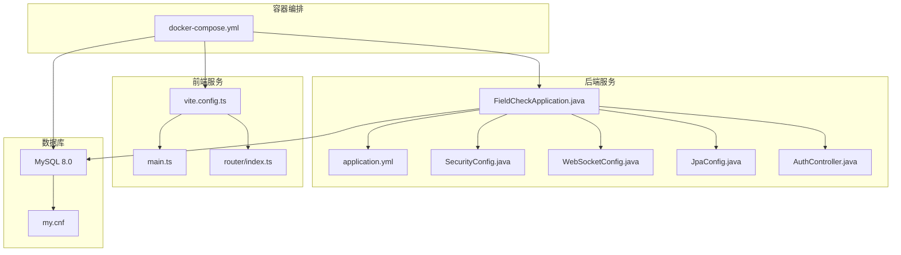
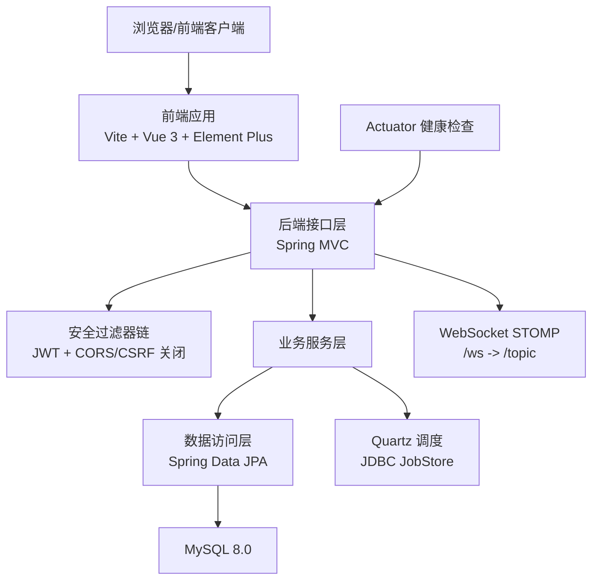
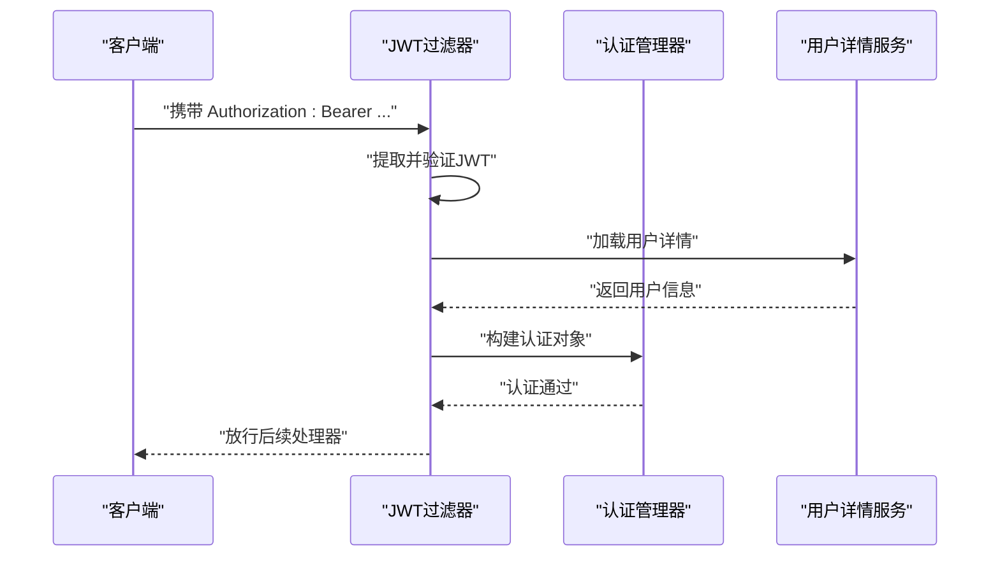
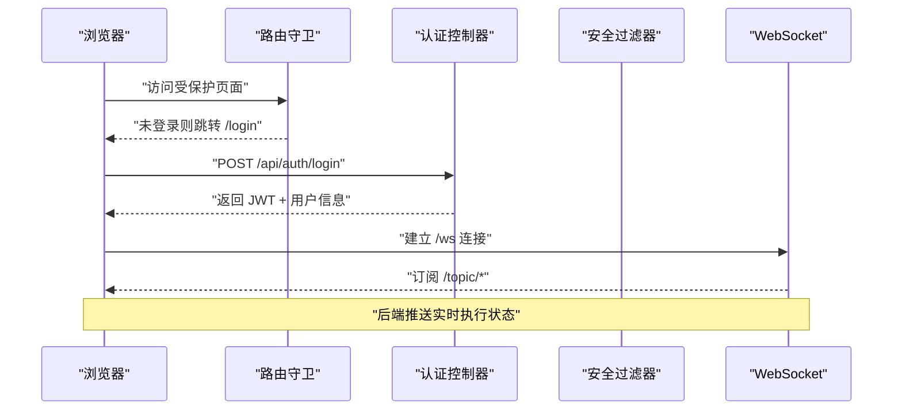

# 技术栈与依赖

<cite>
**本文引用的文件**
- [backend/pom.xml](file://backend/pom.xml)
- [docker-compose.yml](file://docker-compose.yml)
- [backend/src/main/resources/application.yml](file://backend/src/main/resources/application.yml)
- [backend/src/main/java/com/fieldcheck/FieldCheckApplication.java](file://backend/src/main/java/com/fieldcheck/FieldCheckApplication.java)
- [backend/src/main/java/com/fieldcheck/config/SecurityConfig.java](file://backend/src/main/java/com/fieldcheck/config/SecurityConfig.java)
- [backend/src/main/java/com/fieldcheck/config/WebSocketConfig.java](file://backend/src/main/java/com/fieldcheck/config/WebSocketConfig.java)
- [backend/src/main/java/com/fieldcheck/config/JpaConfig.java](file://backend/src/main/java/com/fieldcheck/config/JpaConfig.java)
- [backend/src/main/java/com/fieldcheck/security/JwtAuthenticationFilter.java](file://backend/src/main/java/com/fieldcheck/security/JwtAuthenticationFilter.java)
- [backend/src/main/java/com/fieldcheck/controller/AuthController.java](file://backend/src/main/java/com/fieldcheck/controller/AuthController.java)
- [backend/src/main/java/com/fieldcheck/entity/SysUser.java](file://backend/src/main/java/com/fieldcheck/entity/SysUser.java)
- [frontend/package.json](file://frontend/package.json)
- [frontend/vite.config.ts](file://frontend/vite.config.ts)
- [frontend/src/main.ts](file://frontend/src/main.ts)
- [frontend/src/router/index.ts](file://frontend/src/router/index.ts)
- [mysql/conf/my.cnf](file://mysql/conf/my.cnf)
</cite>

## 目录
1. [简介](#简介)
2. [项目结构](#项目结构)
3. [核心组件](#核心组件)
4. [架构总览](#架构总览)
5. [详细组件分析](#详细组件分析)
6. [依赖分析](#依赖分析)
7. [性能考虑](#性能考虑)
8. [故障排查指南](#故障排查指南)
9. [结论](#结论)
10. [附录](#附录)

## 简介
本文件系统性梳理 MySQL 风险字段检查平台的技术栈与依赖，覆盖后端（Spring Boot 2.7.x + Spring Security + Spring Data JPA + WebSocket + Quartz）、前端（Vue 3 + TypeScript + Element Plus + Vite）、数据库（MySQL 8.0 及其特性配置）、容器化（Docker + Docker Compose）以及依赖管理与版本兼容性。文档同时给出架构图示、调用流程与时序图，帮助读者快速理解系统实现与扩展点。

## 项目结构
项目采用前后端分离与容器化部署的典型布局：后端为 Spring Boot 应用，前端为 Vue 3 应用，数据库为 MySQL 8.0，通过 Docker Compose 统一编排。核心目录与职责如下：
- backend：Spring Boot 后端工程，包含配置、控制器、服务、实体、仓库、安全、WebSocket、定时任务等模块
- frontend：Vue 3 前端工程，基于 Vite 构建，使用 TypeScript、Element Plus、Pinia、Vue Router
- mysql：MySQL 初始化脚本与配置文件
- 根目录：Docker Compose 编排文件与启动脚本

图表来源
- [docker-compose.yml](file://docker-compose.yml#L1-L91)
- [backend/src/main/java/com/fieldcheck/FieldCheckApplication.java](file://backend/src/main/java/com/fieldcheck/FieldCheckApplication.java#L1-L17)
- [backend/src/main/resources/application.yml](file://backend/src/main/resources/application.yml#L1-L75)
- [backend/src/main/java/com/fieldcheck/config/SecurityConfig.java](file://backend/src/main/java/com/fieldcheck/config/SecurityConfig.java#L1-L60)
- [backend/src/main/java/com/fieldcheck/config/WebSocketConfig.java](file://backend/src/main/java/com/fieldcheck/config/WebSocketConfig.java#L1-L26)
- [backend/src/main/java/com/fieldcheck/config/JpaConfig.java](file://backend/src/main/java/com/fieldcheck/config/JpaConfig.java#L1-L10)
- [backend/src/main/java/com/fieldcheck/controller/AuthController.java](file://backend/src/main/java/com/fieldcheck/controller/AuthController.java#L1-L56)
- [frontend/vite.config.ts](file://frontend/vite.config.ts#L1-L31)
- [frontend/src/main.ts](file://frontend/src/main.ts#L1-L23)
- [frontend/src/router/index.ts](file://frontend/src/router/index.ts#L1-L116)
- [mysql/conf/my.cnf](file://mysql/conf/my.cnf#L1-L31)

章节来源
- [docker-compose.yml](file://docker-compose.yml#L1-L91)
- [backend/src/main/java/com/fieldcheck/FieldCheckApplication.java](file://backend/src/main/java/com/fieldcheck/FieldCheckApplication.java#L1-L17)
- [frontend/vite.config.ts](file://frontend/vite.config.ts#L1-L31)

## 核心组件
- 后端框架与配置
  - Spring Boot 2.7.18（父工程版本）
  - Spring Security：基于 JWT 的无状态认证与授权
  - Spring Data JPA：数据访问层与审计注解
  - WebSocket：STOMP over SockJS 实时通信
  - Quartz：持久化作业调度
  - Mail：邮件发送能力
  - Validation：参数校验
  - AOP：横切能力（如审计）
- 前端框架与配置
  - Vue 3.5.30 + TypeScript
  - Element Plus 2.13.5 + 图标库
  - Vue Router 4.6.4 + Pinia
  - Vite 8.0 + 开发代理（/api、/ws）
- 数据库
  - MySQL 8.0：字符集 utf8mb4、慢查询日志、时区设置、大小写不敏感表名
- 容器化
  - Docker Compose：MySQL、后端、前端三服务编排，健康检查与网络卷挂载

章节来源
- [backend/pom.xml](file://backend/pom.xml#L1-L161)
- [backend/src/main/resources/application.yml](file://backend/src/main/resources/application.yml#L1-L75)
- [frontend/package.json](file://frontend/package.json#L1-L33)
- [frontend/vite.config.ts](file://frontend/vite.config.ts#L1-L31)
- [mysql/conf/my.cnf](file://mysql/conf/my.cnf#L1-L31)

## 架构总览
下图展示从浏览器到后端再到数据库的整体交互路径，以及实时消息通道与定时任务的集成位置。

图表来源
- [frontend/src/main.ts](file://frontend/src/main.ts#L1-L23)
- [frontend/src/router/index.ts](file://frontend/src/router/index.ts#L1-L116)
- [backend/src/main/java/com/fieldcheck/config/SecurityConfig.java](file://backend/src/main/java/com/fieldcheck/config/SecurityConfig.java#L1-L60)
- [backend/src/main/java/com/fieldcheck/config/WebSocketConfig.java](file://backend/src/main/java/com/fieldcheck/config/WebSocketConfig.java#L1-L26)
- [backend/src/main/resources/application.yml](file://backend/src/main/resources/application.yml#L33-L37)
- [docker-compose.yml](file://docker-compose.yml#L44-L57)

## 详细组件分析

### 后端技术栈与配置

#### Spring Boot 应用入口与开关
- 应用入口启用异步与定时任务，便于并发执行与周期性任务调度
- 典型入口类负责启动 Spring Boot 应用上下文

章节来源
- [backend/src/main/java/com/fieldcheck/FieldCheckApplication.java](file://backend/src/main/java/com/fieldcheck/FieldCheckApplication.java#L1-L17)

#### 安全配置（Spring Security + JWT）
- 无状态会话策略（SessionCreationPolicy.STATELESS）
- 放行 /api/auth/**、/ws/**、/actuator/** 等端点
- 使用自定义 JWT 过滤器在请求链中解析与注入认证信息
- 密码编码器采用 BCrypt

图表来源
- [backend/src/main/java/com/fieldcheck/config/SecurityConfig.java](file://backend/src/main/java/com/fieldcheck/config/SecurityConfig.java#L45-L58)
- [backend/src/main/java/com/fieldcheck/security/JwtAuthenticationFilter.java](file://backend/src/main/java/com/fieldcheck/security/JwtAuthenticationFilter.java#L27-L49)

章节来源
- [backend/src/main/java/com/fieldcheck/config/SecurityConfig.java](file://backend/src/main/java/com/fieldcheck/config/SecurityConfig.java#L1-L60)
- [backend/src/main/java/com/fieldcheck/security/JwtAuthenticationFilter.java](file://backend/src/main/java/com/fieldcheck/security/JwtAuthenticationFilter.java#L1-L59)

#### WebSocket 配置（STOMP over SockJS）
- 暴露 /ws 端点，允许任意源，启用 SockJS 回退
- 应用目的地前缀 /app，简单代理 /topic 广播

章节来源
- [backend/src/main/java/com/fieldcheck/config/WebSocketConfig.java](file://backend/src/main/java/com/fieldcheck/config/WebSocketConfig.java#L1-L26)

#### JPA 审计与方言
- 启用 JPA 审计（创建/更新时间与操作人）
- Hibernate 方言为 MySQL57Dialect（兼容 MySQL 8.0）

章节来源
- [backend/src/main/java/com/fieldcheck/config/JpaConfig.java](file://backend/src/main/java/com/fieldcheck/config/JpaConfig.java#L1-L10)
- [backend/src/main/resources/application.yml](file://backend/src/main/resources/application.yml#L24-L31)

#### 数据模型示例（SysUser）
- 用户实体包含用户名、密码、昵称、邮箱、角色、启用状态与最近登录时间
- 继承 BaseEntity，具备审计字段

章节来源
- [backend/src/main/java/com/fieldcheck/entity/SysUser.java](file://backend/src/main/java/com/fieldcheck/entity/SysUser.java#L1-L44)

#### 认证控制器（登录/当前用户/登出）
- 登录接口返回 JWT 令牌与用户信息，同时记录审计日志
- 当前用户接口返回用户简要信息
- 登出接口异步记录审计日志

章节来源
- [backend/src/main/java/com/fieldcheck/controller/AuthController.java](file://backend/src/main/java/com/fieldcheck/controller/AuthController.java#L1-L56)

### 前端技术栈与配置

#### 应用初始化与 UI 组件库
- 创建 Vue 应用，注册 Element Plus 及图标，设置中文本地化
- 引入 Pinia 与路由

章节来源
- [frontend/src/main.ts](file://frontend/src/main.ts#L1-L23)

#### 路由与导航守卫
- 定义多级路由与权限元信息
- 全局前置守卫根据登录状态与目标路由进行跳转控制

章节来源
- [frontend/src/router/index.ts](file://frontend/src/router/index.ts#L1-L116)

#### 构建与开发代理
- Vite 代理 /api 到后端 8080 端口，/ws 到 WebSocket
- 本地开发端口 3000

章节来源
- [frontend/vite.config.ts](file://frontend/vite.config.ts#L1-L31)

#### 依赖与版本
- Vue 3.5.30、Element Plus 2.13.5、Vue Router 4.6.4、Pinia 3.0.4、Axios、ECharts、SockJS + StompJS
- TypeScript ~5.9.3、Vite 8.0、开发类型声明

章节来源
- [frontend/package.json](file://frontend/package.json#L1-L33)

### 数据库技术与配置

#### MySQL 8.0 特性与配置
- 字符集：utf8mb4 与排序规则 utf8mb4_unicode_ci
- 最大连接数、慢查询日志、长查询阈值、默认时区 +08:00
- 表名大小写不敏感（lower_case_table_names=1）

章节来源
- [mysql/conf/my.cnf](file://mysql/conf/my.cnf#L1-L31)

#### 连接与池化配置
- HikariCP 连接池参数：最大池大小、空闲超时、连接超时、最大生存时间、测试查询与超时
- Jackson 时间格式与时区统一

章节来源
- [backend/src/main/resources/application.yml](file://backend/src/main/resources/application.yml#L8-L22)
- [backend/src/main/resources/application.yml](file://backend/src/main/resources/application.yml#L51-L53)

### 容器化与编排

#### Docker Compose 编排
- 服务：mysql（8.0）、backend（Spring Boot）、frontend（Nginx）
- 环境变量：数据库凭据、JWT 秘钥、AES 密钥
- 端口映射：3306、8080、80
- 健康检查：curl /actuator/health、mysqladmin ping、wget spider
- 卷：数据卷、日志卷、报告卷、初始化 SQL 与配置挂载

章节来源
- [docker-compose.yml](file://docker-compose.yml#L1-L91)

## 依赖分析

### 后端依赖与版本兼容性
- Spring Boot 父工程版本：2.7.18
- Spring 生态：Web、Data JPA、Security、WebSocket、Validation、AOP、Quartz、Mail
- 数据库驱动：mysql-connector-j（运行时）
- 安全：jjwt-api/impl/jackson（0.11.5）
- 工具：Lombok、Apache Commons Lang3、Apache POI（Excel）、HTTP Client、H2 测试库
- 注意：Java 版本属性为 1.8，但 Spring Boot 2.7.x 对 Java 8+ 兼容良好；若升级至 Spring Boot 3.x，需同步升级 Java 版本与相关依赖

章节来源
- [backend/pom.xml](file://backend/pom.xml#L1-L161)

### 前端依赖与版本兼容性
- Vue 3.5.30 + TypeScript ~5.9.3 + Vite 8.0
- Element Plus 2.13.5 + 图标库
- Vue Router 4.6.4 + Pinia 3.0.4
- WebSocket 客户端：sockjs-client + stompjs
- 开发类型声明与插件生态完善

章节来源
- [frontend/package.json](file://frontend/package.json#L1-L33)

### 数据库依赖
- MySQL 8.0 官方驱动（mysql-connector-j）
- 初始化脚本位于 docker-entrypoint-initdb.d，随容器首次启动执行

章节来源
- [backend/pom.xml](file://backend/pom.xml#L63-L68)
- [docker-compose.yml](file://docker-compose.yml#L17-L21)

### 容器化依赖
- Docker Compose v3.8
- Nginx 用于前端静态资源服务（前端工程内含 nginx.conf）

章节来源
- [docker-compose.yml](file://docker-compose.yml#L1-L91)
- [frontend/nginx.conf](file://frontend/nginx.conf)

## 性能考虑
- 连接池与超时：合理设置最大池大小、空闲超时、连接超时与最大生存时间，避免连接泄漏与抖动
- 查询优化：开启慢查询日志，结合 long_query_time 分析热点 SQL
- 字符集与排序：utf8mb4 保证表情符号存储，排序规则统一提升 LIKE/排序一致性
- WebSocket：生产环境建议限制广播范围与消息频率，避免带宽与 CPU 压力
- 前端：按需引入 Element Plus 组件，减少打包体积；路由懒加载降低首屏负载
- 定时任务：Quartz JDBC 存储，注意作业并发与重入控制

## 故障排查指南
- 健康检查
  - 后端：/actuator/health（Docker Compose curl 检查）
  - MySQL：mysqladmin ping（Docker Compose 健康检查）
  - 前端：/health（wget spider）
- 日志定位
  - 后端：application.yml 中 logging.level 与日志路径
  - 前端：浏览器控制台与网络面板，确认代理是否正确转发 /api 与 /ws
- 数据库
  - 字符集与时区：确认 JDBC URL 时区参数与数据库配置一致
  - 初始化：确认 /docker-entrypoint-initdb.d 下 SQL 是否执行
- 安全
  - JWT：确认 Authorization 头以 Bearer 开头，密钥与过期时间配置正确
  - CORS/CSRF：当前配置关闭 CSRF，允许跨域，确保前端域名匹配

章节来源
- [backend/src/main/resources/application.yml](file://backend/src/main/resources/application.yml#L69-L75)
- [docker-compose.yml](file://docker-compose.yml#L22-L26)
- [docker-compose.yml](file://docker-compose.yml#L52-L57)
- [frontend/vite.config.ts](file://frontend/vite.config.ts#L18-L28)

## 结论
该平台采用成熟稳定的全栈技术组合：后端以 Spring Boot 2.7.x 为核心，配合 Spring Security/JPA/WebSocket/Quartz 构建高可用后端；前端以 Vue 3 + TypeScript 为基础，搭配 Element Plus 提供良好的用户体验；数据库采用 MySQL 8.0 并结合完善的配置与初始化脚本；容器化方面通过 Docker Compose 实现一键部署与健康检查。整体架构清晰、可扩展性强，适合在生产环境中持续演进。

## 附录

### 关键流程时序图：登录与实时通知

图表来源
- [frontend/src/router/index.ts](file://frontend/src/router/index.ts#L102-L113)
- [backend/src/main/java/com/fieldcheck/controller/AuthController.java](file://backend/src/main/java/com/fieldcheck/controller/AuthController.java#L25-L36)
- [backend/src/main/java/com/fieldcheck/config/WebSocketConfig.java](file://backend/src/main/java/com/fieldcheck/config/WebSocketConfig.java#L20-L24)