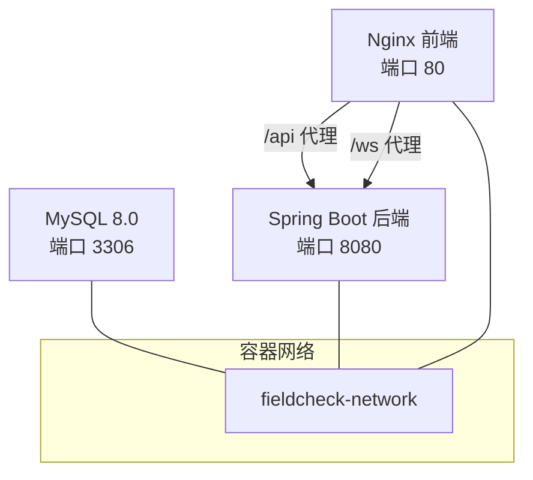
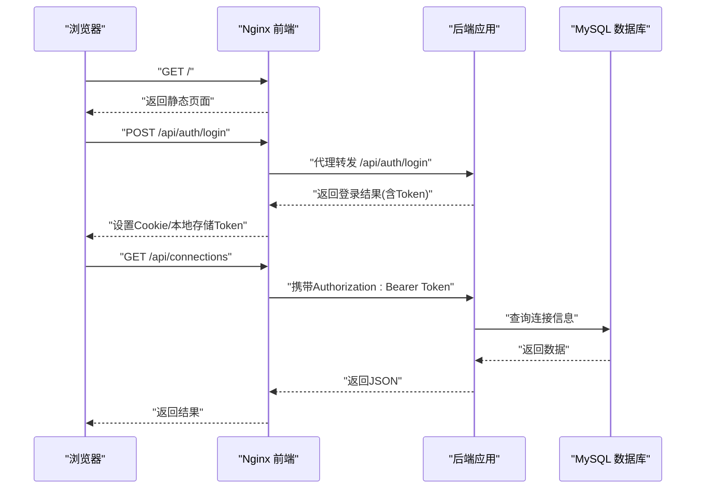
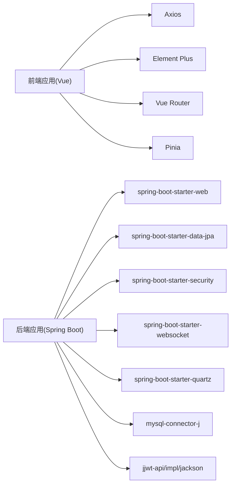

# 常见问题解答

<cite>
**本文引用的文件**
- [docker-compose.yml](file://docker-compose.yml)
- [application.yml](file://backend/src/main/resources/application.yml)
- [application-docker.yml](file://backend/src/main/resources/application-docker.yml)
- [pom.xml](file://backend/pom.xml)
- [start.sh](file://start.sh)
- [AuthController.java](file://backend/src/main/java/com/fieldcheck/controller/AuthController.java)
- [AuthService.java](file://backend/src/main/java/com/fieldcheck/service/AuthService.java)
- [ConnectionController.java](file://backend/src/main/java/com/fieldcheck/controller/ConnectionController.java)
- [ConnectionService.java](file://backend/src/main/java/com/fieldcheck/service/ConnectionService.java)
- [GlobalExceptionHandler.java](file://backend/src/main/java/com/fieldcheck/config/GlobalExceptionHandler.java)
- [JwtAuthenticationFilter.java](file://backend/src/main/java/com/fieldcheck/security/JwtAuthenticationFilter.java)
- [auth.ts](file://frontend/src/api/auth.ts)
- [request.ts](file://frontend/src/utils/request.ts)
- [index.ts](file://frontend/src/router/index.ts)
- [vite.config.ts](file://frontend/vite.config.ts)
- [nginx.conf](file://frontend/nginx.conf)
</cite>

## 目录
1. [简介](#简介)
2. [项目结构](#项目结构)
3. [核心组件](#核心组件)
4. [架构总览](#架构总览)
5. [详细组件分析](#详细组件分析)
6. [依赖关系分析](#依赖关系分析)
7. [性能注意事项](#性能注意事项)
8. [故障排查指南](#故障排查指南)
9. [结论](#结论)
10. [附录](#附录)

## 简介
本FAQ面向MySQL风险字段检查平台的使用者与运维人员，聚焦系统启动失败、数据库连接异常、权限认证问题、API调用错误、前后端联调兼容性问题以及Docker容器启动失败等常见问题。文档提供症状表现、可能原因、解决步骤、自检清单、快速排查方法与复现步骤，并辅以图示帮助定位问题。

## 项目结构
平台采用前后端分离架构：前端基于Vue 3 + TypeScript，通过Vite开发；后端基于Spring Boot 2.7 + Java 8；数据库为MySQL 8.0；通过Docker Compose编排运行。核心服务包括MySQL、后端应用与前端Nginx代理。

图表来源
- [docker-compose.yml](file://docker-compose.yml#L1-L91)
- [nginx.conf](file://frontend/nginx.conf#L33-L57)

章节来源
- [docker-compose.yml](file://docker-compose.yml#L1-L91)
- [application.yml](file://backend/src/main/resources/application.yml#L1-L75)
- [application-docker.yml](file://backend/src/main/resources/application-docker.yml#L1-L46)

## 核心组件
- 认证与授权：后端提供登录、登出、当前用户查询接口；前端负责拦截器注入Token与统一错误处理；路由守卫控制页面访问。
- 数据库连接管理：提供连接列表、新增、更新、删除与连通性测试接口；连接密码采用AES加密存储。
- 全局异常处理：统一封装400/401/403/500等错误响应。
- Docker编排：一键启动/停止/重启/查看日志/状态清理；健康检查保障服务可用性。

章节来源
- [AuthController.java](file://backend/src/main/java/com/fieldcheck/controller/AuthController.java#L1-L56)
- [AuthService.java](file://backend/src/main/java/com/fieldcheck/service/AuthService.java#L1-L80)
- [ConnectionController.java](file://backend/src/main/java/com/fieldcheck/controller/ConnectionController.java#L1-L82)
- [ConnectionService.java](file://backend/src/main/java/com/fieldcheck/service/ConnectionService.java#L1-L127)
- [GlobalExceptionHandler.java](file://backend/src/main/java/com/fieldcheck/config/GlobalExceptionHandler.java#L1-L55)
- [JwtAuthenticationFilter.java](file://backend/src/main/java/com/fieldcheck/security/JwtAuthenticationFilter.java#L1-L59)
- [auth.ts](file://frontend/src/api/auth.ts#L1-L27)
- [request.ts](file://frontend/src/utils/request.ts#L1-L47)
- [index.ts](file://frontend/src/router/index.ts#L1-L116)

## 架构总览
下图展示从浏览器到后端、再到数据库的整体调用链路与鉴权流程。

图表来源
- [auth.ts](file://frontend/src/api/auth.ts#L16-L18)
- [request.ts](file://frontend/src/utils/request.ts#L10-L21)
- [index.ts](file://frontend/src/router/index.ts#L102-L113)
- [nginx.conf](file://frontend/nginx.conf#L33-L43)
- [AuthController.java](file://backend/src/main/java/com/fieldcheck/controller/AuthController.java#L25-L36)
- [ConnectionController.java](file://backend/src/main/java/com/fieldcheck/controller/ConnectionController.java#L25-L39)

## 详细组件分析

### 认证与会话问题
- 症状
  - 登录失败或提示“用户名或密码错误”
  - 登录成功但页面跳转异常或接口报401
  - 刷新页面后需重新登录
- 可能原因
  - JWT密钥不一致或被修改
  - 浏览器未正确保存Token或被清理
  - 后端未正确解析Authorization头
  - 用户被禁用或默认管理员账户异常
- 解决步骤
  - 确认JWT密钥配置一致（后端配置文件与环境变量）
  - 清除浏览器缓存与Cookie后重试
  - 检查后端日志中是否出现“无法设置用户认证”的错误
  - 确认默认管理员账户存在且启用
- 复现步骤
  - 使用错误凭据登录，观察后端返回401
  - 登录成功后清除本地Token，再次访问受保护接口
- 截图示例
  - 登录页输入错误凭据后的错误提示
  - 401未授权时的弹窗或页面提示

章节来源
- [AuthService.java](file://backend/src/main/java/com/fieldcheck/service/AuthService.java#L30-L49)
- [AuthController.java](file://backend/src/main/java/com/fieldcheck/controller/AuthController.java#L25-L36)
- [JwtAuthenticationFilter.java](file://backend/src/main/java/com/fieldcheck/security/JwtAuthenticationFilter.java#L27-L49)
- [request.ts](file://frontend/src/utils/request.ts#L24-L44)
- [index.ts](file://frontend/src/router/index.ts#L102-L113)

### 数据库连接异常
- 症状
  - 连接测试失败或抛出连接异常
  - 新增/更新连接后无法连通
  - 密码正确但连接超时
- 可能原因
  - 主机名/端口错误或网络不可达
  - 用户名/密码错误或权限不足
  - 连接超时时间过短
  - 密码加密/解密密钥不匹配
- 解决步骤
  - 使用“测试连接”接口验证连通性
  - 检查后端日志中的连接异常堆栈
  - 确认AES密钥与后端配置一致
  - 调整连接超时参数（如适用）
- 复现步骤
  - 在连接管理中添加无效主机/端口，点击“测试连接”
  - 修改连接密码但不填写新密码，尝试更新连接
- 截图示例
  - “测试连接”按钮点击后的错误提示
  - 更新连接后仍提示连接失败的对话框

章节来源
- [ConnectionController.java](file://backend/src/main/java/com/fieldcheck/controller/ConnectionController.java#L72-L80)
- [ConnectionService.java](file://backend/src/main/java/com/fieldcheck/service/ConnectionService.java#L92-L108)
- [application-docker.yml](file://backend/src/main/resources/application-docker.yml#L28-L29)

### API调用错误
- 症状
  - 返回400参数校验失败
  - 返回403权限不足
  - 返回500服务器内部错误
- 可能原因
  - 请求体字段缺失或格式不合法
  - 缺少或错误的Authorization头
  - 角色权限不足（如普通用户访问管理员页面）
  - 后端未捕获异常导致500
- 解决步骤
  - 检查请求体字段与后端DTO定义
  - 确保请求头包含正确的Bearer Token
  - 确认用户角色满足接口权限要求
  - 查看后端日志定位异常根因
- 复现步骤
  - 提交空用户名/密码进行登录
  - 以普通用户身份访问仅管理员可见的页面
- 截图示例
  - 参数校验失败的错误消息
  - 权限不足的提示弹窗

章节来源
- [GlobalExceptionHandler.java](file://backend/src/main/java/com/fieldcheck/config/GlobalExceptionHandler.java#L20-L53)
- [index.ts](file://frontend/src/router/index.ts#L85-L92)

### 前后端联调兼容性问题
- 症状
  - 前端请求被CORS拒绝
  - 代理不通或WebSocket升级失败
  - 开发环境下接口404
- 可能原因
  - 代理目标地址或路径前缀不匹配
  - CORS未正确配置
  - WebSocket代理未开启
  - Nginx未正确转发/api与/ws
- 解决步骤
  - 开发环境确认Vite代理配置指向后端8080端口
  - 生产环境确认Nginx代理/api与/ws至后端
  - 检查后端CORS配置（如需要）
  - 确认浏览器Network面板中请求是否被代理命中
- 复现步骤
  - 关闭后端，前端发起请求，观察跨域或连接失败
  - 将/api改为/backend，验证代理是否生效
- 截图示例
  - Network面板中/api请求被代理到后端
  - WebSocket升级失败的错误提示

章节来源
- [vite.config.ts](file://frontend/vite.config.ts#L16-L30)
- [nginx.conf](file://frontend/nginx.conf#L33-L57)
- [request.ts](file://frontend/src/utils/request.ts#L4-L7)

### Docker容器启动失败
- 症状
  - mysql容器启动后立即退出
  - backend容器健康检查失败
  - 前端容器无法访问后端
- 可能原因
  - 环境变量未正确加载（如数据库密码、JWT密钥）
  - 数据卷挂载失败或权限不足
  - 端口冲突（3306/8080/80已被占用）
  - 依赖服务未就绪（mysql未健康）
- 解决步骤
  - 使用提供的脚本一键启动，确保环境变量文件存在
  - 查看各容器健康检查状态与日志
  - 检查端口占用并释放
  - 等待mysql健康后再启动其他服务
- 复现步骤
  - 删除.env文件后直接启动，观察后端初始化失败
  - 手动修改端口后启动，验证端口冲突提示
- 截图示例
  - docker-compose ps显示某容器状态异常
  - docker-compose logs -f中出现数据库连接异常

章节来源
- [start.sh](file://start.sh#L22-L27)
- [docker-compose.yml](file://docker-compose.yml#L49-L51)
- [docker-compose.yml](file://docker-compose.yml#L52-L57)
- [docker-compose.yml](file://docker-compose.yml#L70-L76)

## 依赖关系分析
后端依赖Spring生态与MySQL驱动，前端依赖Axios、Element Plus、Vue Router与Pinia等。Docker编排通过Compose统一管理服务生命周期与健康检查。

图表来源
- [pom.xml](file://backend/pom.xml#L28-L142)
- [frontend/package.json](file://frontend/package.json#L11-L31)

章节来源
- [pom.xml](file://backend/pom.xml#L1-L161)
- [frontend/package.json](file://frontend/package.json#L1-L33)

## 性能注意事项
- 数据库连接池：合理设置最大连接数、空闲超时与连接超时，避免高并发下的连接争用。
- 日志级别：生产环境建议降低日志级别，减少IO开销。
- 前端静态资源：Nginx已启用Gzip与缓存策略，建议保持默认配置。
- WebSocket：长连接需关注代理超时配置，避免频繁断开。

## 故障排查指南

### 自检清单
- 系统环境
  - 已安装Docker与docker-compose
  - 环境变量文件存在且内容完整
- 服务状态
  - mysql处于健康状态
  - backend健康检查通过
  - 前端可访问健康检查端点
- 网络连通
  - 前端能访问后端/api与/ws
  - 数据库端口3306可达
- 认证与授权
  - Token存在且未过期
  - 用户角色具备访问权限
- 数据库连接
  - 连接测试通过
  - 密码加密/解密密钥一致

### 快速排查方法
- 查看容器状态与日志
  - docker-compose ps
  - docker-compose logs -f
- 检查健康检查
  - curl http://localhost:8080/actuator/health
  - wget -q --spider http://localhost/health
- 验证API连通性
  - curl -i http://localhost/api/auth/me
- 验证数据库连通性
  - 使用连接管理的“测试连接”功能

### 问题复现与定位
- 登录失败
  - 使用错误凭据登录，观察后端返回401
  - 检查后端日志中“Could not set user authentication in security context”
- 连接测试失败
  - 输入错误主机/端口，点击测试连接
  - 查看后端日志中的SQLException
- 权限不足
  - 以普通用户访问管理员页面
  - 观察前端403提示或后端返回403
- CORS/代理问题
  - 关闭后端，前端请求被拦截
  - 检查Vite代理或Nginx代理配置

章节来源
- [start.sh](file://start.sh#L52-L57)
- [docker-compose.yml](file://docker-compose.yml#L22-L26)
- [docker-compose.yml](file://docker-compose.yml#L52-L57)
- [docker-compose.yml](file://docker-compose.yml#L72-L76)
- [GlobalExceptionHandler.java](file://backend/src/main/java/com/fieldcheck/config/GlobalExceptionHandler.java#L29-L39)
- [vite.config.ts](file://frontend/vite.config.ts#L18-L28)
- [nginx.conf](file://frontend/nginx.conf#L33-L57)

## 结论
通过本FAQ，用户可以系统化地定位与解决平台在启动、认证、连接、API调用及Docker部署过程中的常见问题。建议在生产环境中严格核对配置项、启用健康检查与日志监控，并遵循权限最小化原则与安全最佳实践。

## 附录

### 常用命令与端口
- 启动/停止/重启/查看日志/状态/清理
  - ./start.sh up|start|down|restart|logs|status|clean
- 端口映射
  - MySQL: 3306
  - 后端: 8080
  - 前端: 80
- 健康检查
  - 后端: http://localhost:8080/actuator/health
  - 前端: http://localhost/health

章节来源
- [start.sh](file://start.sh#L32-L78)
- [docker-compose.yml](file://docker-compose.yml#L15-L16)
- [docker-compose.yml](file://docker-compose.yml#L44-L45)
- [docker-compose.yml](file://docker-compose.yml#L68-L69)
- [docker-compose.yml](file://docker-compose.yml#L52-L57)
- [docker-compose.yml](file://docker-compose.yml#L72-L76)