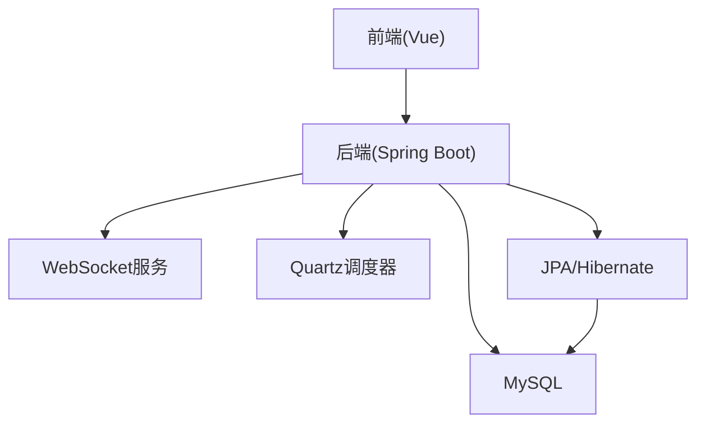
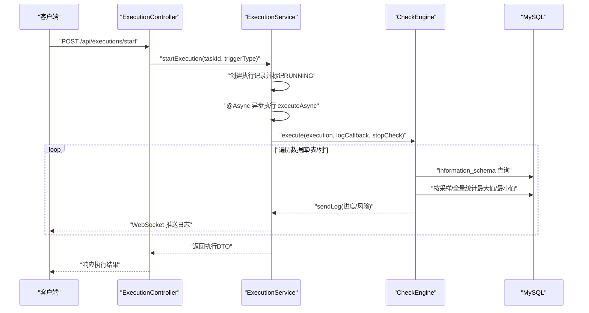
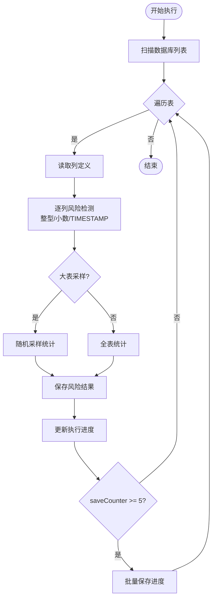
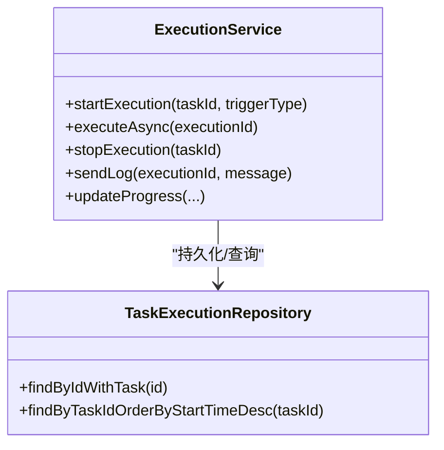
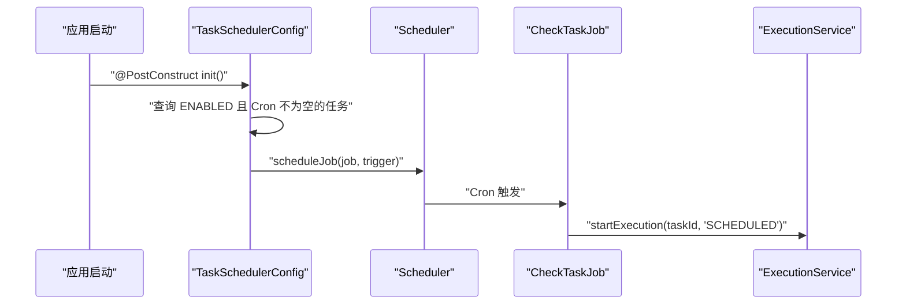
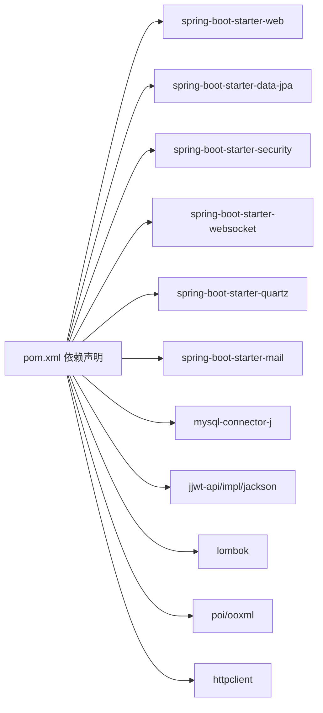

# 性能问题排查

<cite>
**本文引用的文件**
- [application.yml](file://backend/src/main/resources/application.yml)
- [application-docker.yml](file://backend/src/main/resources/application-docker.yml)
- [my.cnf](file://mysql/conf/my.cnf)
- [CheckEngine.java](file://backend/src/main/java/com/fieldcheck/engine/CheckEngine.java)
- [ExecutionService.java](file://backend/src/main/java/com/fieldcheck/service/ExecutionService.java)
- [TaskSchedulerConfig.java](file://backend/src/main/java/com/fieldcheck/scheduler/TaskSchedulerConfig.java)
- [AsyncConfig.java](file://backend/src/main/java/com/fieldcheck/config/AsyncConfig.java)
- [TaskExecutionRepository.java](file://backend/src/main/java/com/fieldcheck/repository/TaskExecutionRepository.java)
- [ExecutionController.java](file://backend/src/main/java/com/fieldcheck/controller/ExecutionController.java)
- [TaskExecution.java](file://backend/src/main/java/com/fieldcheck/entity/TaskExecution.java)
- [CheckTask.java](file://backend/src/main/java/com/fieldcheck/entity/CheckTask.java)
- [TaskForm.vue](file://frontend/src/views/task/TaskForm.vue)
- [pom.xml](file://backend/pom.xml)
</cite>

## 目录
1. [简介](#简介)
2. [项目结构](#项目结构)
3. [核心组件](#核心组件)
4. [架构总览](#架构总览)
5. [详细组件分析](#详细组件分析)
6. [依赖分析](#依赖分析)
7. [性能考量](#性能考量)
8. [故障排查指南](#故障排查指南)
9. [结论](#结论)
10. [附录](#附录)

## 简介
本指南面向MySQL风险字段检查平台的运维与开发人员，聚焦于系统性能问题的识别与解决。内容涵盖数据库查询慢、内存占用高、CPU使用率异常等常见瓶颈；解释关键性能指标（响应时间、吞吐量、并发连接数）的含义与采集方式；给出风险检测引擎的优化策略与调参建议；剖析任务调度对系统性能的影响及优化方向；并提供数据库索引优化、连接池配置、缓存策略与性能测试工具的实操建议。

## 项目结构
后端采用Spring Boot + Spring Data JPA + Quartz + WebSocket的架构，前端为Vue单页应用。平台通过异步线程池执行检查任务，使用Quartz进行定时调度，并通过WebSocket推送执行日志与进度。数据库配置位于MySQL容器内的my.cnf，应用层连接池与JPA/Hibernate参数在application.yml中定义。

**图表来源**
- [ExecutionController.java](file://backend/src/main/java/com/fieldcheck/controller/ExecutionController.java#L20-L79)
- [TaskSchedulerConfig.java](file://backend/src/main/java/com/fieldcheck/scheduler/TaskSchedulerConfig.java#L20-L95)
- [application.yml](file://backend/src/main/resources/application.yml#L8-L32)

**章节来源**
- [application.yml](file://backend/src/main/resources/application.yml#L1-L75)
- [application-docker.yml](file://backend/src/main/resources/application-docker.yml#L1-L46)
- [my.cnf](file://mysql/conf/my.cnf#L1-L31)

## 核心组件
- 检查引擎：负责扫描数据库、表、列，执行整型溢出、Y2038、小数溢出等风险检测，并按阈值生成风险结果。
- 执行服务：封装任务执行流程，支持异步执行、进度上报、日志推送与告警触发。
- 调度配置：基于Quartz的Cron表达式进行周期性任务调度。
- 连接池与JPA：HikariCP连接池与Hibernate方言、SQL格式化等参数。
- 控制器与实体：提供执行记录查询、日志下载、进度查询等接口；实体包含执行状态、统计信息与触发类型。

**章节来源**
- [CheckEngine.java](file://backend/src/main/java/com/fieldcheck/engine/CheckEngine.java#L57-L139)
- [ExecutionService.java](file://backend/src/main/java/com/fieldcheck/service/ExecutionService.java#L107-L210)
- [TaskSchedulerConfig.java](file://backend/src/main/java/com/fieldcheck/scheduler/TaskSchedulerConfig.java#L38-L93)
- [AsyncConfig.java](file://backend/src/main/java/com/fieldcheck/config/AsyncConfig.java#L16-L29)
- [TaskExecutionRepository.java](file://backend/src/main/java/com/fieldcheck/repository/TaskExecutionRepository.java#L17-L40)
- [ExecutionController.java](file://backend/src/main/java/com/fieldcheck/controller/ExecutionController.java#L27-L77)
- [TaskExecution.java](file://backend/src/main/java/com/fieldcheck/entity/TaskExecution.java#L17-L57)

## 架构总览
下图展示从HTTP请求到数据库查询、再到结果回传的关键路径，以及异步执行与WebSocket推送的交互。

**图表来源**
- [ExecutionController.java](file://backend/src/main/java/com/fieldcheck/controller/ExecutionController.java#L27-L44)
- [ExecutionService.java](file://backend/src/main/java/com/fieldcheck/service/ExecutionService.java#L107-L210)
- [CheckEngine.java](file://backend/src/main/java/com/fieldcheck/engine/CheckEngine.java#L57-L139)

## 详细组件分析

### 检查引擎（性能热点）
- 扫描阶段：通过information_schema枚举数据库、表与列，复杂度与目标库规模线性相关。
- 统计阶段：对每列执行聚合查询以评估使用率，大表默认采样，可降低开销。
- 写入阶段：批量保存风险结果，定期持久化执行进度，减少频繁IO。
- 停止机制：通过回调函数轮询停止信号，保证任务可中断。

**更新** 新增批量保存机制优化：每处理5张表或到达最后一批时才保存执行进度，显著减少数据库写入频率。

**图表来源**
- [CheckEngine.java](file://backend/src/main/java/com/fieldcheck/engine/CheckEngine.java#L155-L214)
- [CheckEngine.java](file://backend/src/main/java/com/fieldcheck/engine/CheckEngine.java#L258-L311)
- [CheckEngine.java](file://backend/src/main/java/com/fieldcheck/engine/CheckEngine.java#L346-L384)

**章节来源**
- [CheckEngine.java](file://backend/src/main/java/com/fieldcheck/engine/CheckEngine.java#L57-L139)
- [CheckEngine.java](file://backend/src/main/java/com/fieldcheck/engine/CheckEngine.java#L273-L277)

### 执行服务（并发与资源控制）
- 并发控制：通过自注入+@Async在独立线程池执行，避免阻塞Web线程。
- 进度与日志：实时推送执行日志至WebSocket，同时落盘到文件，便于离线分析。
- 停止与清理：维护runningTasks集合，确保重复提交与异常中断场景下的状态一致性。

**图表来源**
- [ExecutionService.java](file://backend/src/main/java/com/fieldcheck/service/ExecutionService.java#L107-L210)
- [TaskExecutionRepository.java](file://backend/src/main/java/com/fieldcheck/repository/TaskExecutionRepository.java#L38-L39)

**章节来源**
- [ExecutionService.java](file://backend/src/main/java/com/fieldcheck/service/ExecutionService.java#L165-L210)
- [AsyncConfig.java](file://backend/src/main/java/com/fieldcheck/config/AsyncConfig.java#L16-L29)

### 调度配置（Quartz）
- 启动加载：应用启动时扫描启用且配置了Cron的任务并注册到调度器。
- 作业执行：触发时委托ExecutionService启动一次执行，支持重复任务的幂等处理。

**图表来源**
- [TaskSchedulerConfig.java](file://backend/src/main/java/com/fieldcheck/scheduler/TaskSchedulerConfig.java#L25-L65)
- [TaskSchedulerConfig.java](file://backend/src/main/java/com/fieldcheck/scheduler/TaskSchedulerConfig.java#L82-L92)

**章节来源**
- [TaskSchedulerConfig.java](file://backend/src/main/java/com/fieldcheck/scheduler/TaskSchedulerConfig.java#L25-L73)

### 数据库连接与JPA/Hibernate
- 连接池：HikariCP在application.yml中配置最大池大小、空闲超时、连接超时等参数。
- SQL输出：生产环境关闭show-sql，避免额外开销；Docker环境开启格式化以便调试。
- 方言：指定MySQL57方言，确保SQL生成兼容性。

**章节来源**
- [application.yml](file://backend/src/main/resources/application.yml#L13-L32)
- [application-docker.yml](file://backend/src/main/resources/application-docker.yml#L16-L22)

## 依赖分析
- 外部依赖：Spring Web、WebMvc、Data JPA、Security、WebSocket、Quartz、Mail、JJWT、POI、HTTPClient等。
- 关键模块耦合：ExecutionService依赖CheckEngine与WebSocket模板；CheckEngine依赖连接服务与仓库；调度器依赖ExecutionService。

**图表来源**
- [pom.xml](file://backend/pom.xml#L28-L134)

**章节来源**
- [pom.xml](file://backend/pom.xml#L28-L134)

## 性能考量

### 数据库查询慢
- 现象：information_schema查询与大表聚合耗时长。
- 优化策略：
  - 采样策略：大表默认采样，仅在需要时开启全量扫描；合理设置采样数量与阈值。
  - 索引建议：为information_schema查询涉及的过滤条件建立合适的索引（视业务允许范围）。
  - 分批处理：按库/表分批执行，避免一次性扫描过多对象。
  - SQL优化：避免在information_schema上做复杂JOIN；尽量使用WHERE子句精确筛选。
  - **批量保存优化**：每处理5张表保存一次进度，减少数据库写入频率，提升整体执行效率。

**更新** 新增批量保存机制优化，通过saveCounter变量控制保存频率，平衡写入开销与断点恢复能力。

**章节来源**
- [CheckEngine.java](file://backend/src/main/java/com/fieldcheck/engine/CheckEngine.java#L155-L214)
- [CheckEngine.java](file://backend/src/main/java/com/fieldcheck/engine/CheckEngine.java#L273-L277)
- [CheckEngine.java](file://backend/src/main/java/com/fieldcheck/engine/CheckEngine.java#L151-L156)

### 内存占用过高
- 可能原因：大量风险结果对象堆积、日志文件过大、WebSocket消息未及时消费。
- 优化策略：
  - 批量写入：风险结果批量保存，减少事务次数。
  - 日志落盘：将日志写入文件而非仅驻内存，控制内存峰值。
  - 进度持久化：定期保存执行进度，避免丢失状态导致重算。
  - 监控与告警：关注堆内存与GC频率，必要时扩大堆或优化对象生命周期。

**章节来源**
- [CheckEngine.java](file://backend/src/main/java/com/fieldcheck/engine/CheckEngine.java#L114-L131)
- [ExecutionService.java](file://backend/src/main/java/com/fieldcheck/service/ExecutionService.java#L237-L268)

### CPU使用率异常
- 可能原因：大表聚合计算、正则匹配、字符串拼接、WebSocket广播。
- 优化策略：
  - 计算优化：减少不必要的BigDecimal运算，合并计算逻辑。
  - 正则与模式匹配：预编译或缓存正则表达式，避免重复编译。
  - I/O解耦：WebSocket推送与文件写入异步化，避免阻塞主线程。

**章节来源**
- [CheckEngine.java](file://backend/src/main/java/com/fieldcheck/engine/CheckEngine.java#L387-L414)
- [ExecutionService.java](file://backend/src/main/java/com/fieldcheck/service/ExecutionService.java#L237-L268)

### 并发连接数
- 应用侧：HikariCP最大池大小与连接超时需与数据库最大连接数匹配。
- 数据库侧：MySQL最大连接数与缓冲池大小需与业务负载匹配。
- 建议：根据峰值QPS与平均响应时间估算所需连接数，预留安全余量。

**章节来源**
- [application.yml](file://backend/src/main/resources/application.yml#L13-L19)
- [my.cnf](file://mysql/conf/my.cnf#L6-L8)

### 性能监控指标
- 响应时间：接口平均/95分位/99分位响应时间，用于衡量用户体验。
- 吞吐量：单位时间内处理的请求数（TPS），用于评估系统承载能力。
- 并发连接数：应用连接池活跃连接数与数据库最大连接数对比。
- GC与内存：堆内存使用率、GC频率与停顿时间。
- 数据库慢查询：慢查询日志与执行计划分析。

**章节来源**
- [my.cnf](file://mysql/conf/my.cnf#L15-L18)

### 风险检测引擎优化策略
- 参数调优：
  - 最大并发任务数：通过配置项控制异步线程池核心与最大线程数。
  - 采样大小与阈值：根据业务容忍度调整采样量与使用率阈值。
  - 进度保存间隔：平衡写入频率与断点恢复能力。
- 代码级优化：
  - 减少information_schema查询次数，合并SQL。
  - 对大表优先采样，避免全表扫描。
  - 批量写入风险结果，减少事务边界。
  - **批量保存优化**：每处理5张表保存一次进度，减少数据库写入频率。

**更新** 新增批量保存机制优化，通过saveCounter变量控制保存频率，平衡写入开销与断点恢复能力。

**章节来源**
- [AsyncConfig.java](file://backend/src/main/java/com/fieldcheck/config/AsyncConfig.java#L16-L29)
- [CheckEngine.java](file://backend/src/main/java/com/fieldcheck/engine/CheckEngine.java#L273-L277)
- [CheckEngine.java](file://backend/src/main/java/com/fieldcheck/engine/CheckEngine.java#L125-L131)
- [CheckEngine.java](file://backend/src/main/java/com/fieldcheck/engine/CheckEngine.java#L151-L156)

### 任务调度系统性能影响
- 影响因素：Cron过于密集、任务执行时间长、线程池饱和。
- 优化建议：
  - 合理设置Cron间隔，避免重叠执行。
  - 将长任务拆分为多个短任务，提升并发度。
  - 监控调度延迟与执行耗时，动态调整线程池大小。

**章节来源**
- [TaskSchedulerConfig.java](file://backend/src/main/java/com/fieldcheck/scheduler/TaskSchedulerConfig.java#L58-L64)
- [ExecutionService.java](file://backend/src/main/java/com/fieldcheck/service/ExecutionService.java#L107-L163)

### 数据库索引优化
- 建议：
  - 为information_schema查询的过滤字段增加覆盖索引（视实际需求）。
  - 为执行记录表的常用查询字段建立索引（如task_id、status、start_time）。
  - 定期分析慢查询，结合执行计划优化SQL。

**章节来源**
- [TaskExecutionRepository.java](file://backend/src/main/java/com/fieldcheck/repository/TaskExecutionRepository.java#L19-L36)

### 连接池配置
- HikariCP关键参数：
  - maximum-pool-size：最大连接数，建议与数据库最大连接数匹配。
  - connection-timeout：连接获取超时，避免长时间阻塞。
  - idle-timeout：空闲连接回收时间。
  - max-lifetime：连接最长存活时间。
  - validation-timeout：连接校验超时。
- Docker环境参数与本地不同，需按部署环境分别配置。

**章节来源**
- [application.yml](file://backend/src/main/resources/application.yml#L13-L19)
- [application-docker.yml](file://backend/src/main/resources/application-docker.yml#L9-L15)

### 缓存策略
- 适用场景：白名单规则、任务元数据、最近执行结果概览。
- 实施建议：使用本地缓存或Redis缓存热点数据，降低数据库压力；注意缓存失效策略与一致性。

（本节为通用建议，不直接对应具体源码）

### 性能测试工具与基准方法
- 工具推荐：JMeter、Gatling、k6、ab（Apache Bench）。
- 基准方法：
  - 压测目标：接口吞吐、响应时间分布、错误率。
  - 场景设计：逐步加压至系统瓶颈，记录CPU、内存、连接数、慢查询。
  - 回归测试：每次优化后回归验证关键指标。

（本节为通用建议，不直接对应具体源码）

## 故障排查指南

### 快速定位步骤
- 查看日志：确认执行记录状态、错误信息与日志文件路径。
- 监控指标：观察CPU、内存、连接池使用率与数据库慢查询。
- 复现路径：确认是否由大表、采样参数或并发任务导致。

**章节来源**
- [ExecutionController.java](file://backend/src/main/java/com/fieldcheck/controller/ExecutionController.java#L52-L77)
- [ExecutionService.java](file://backend/src/main/java/com/fieldcheck/service/ExecutionService.java#L270-L282)

### 常见问题与处理
- 任务卡死或重复执行
  - 现象：runningTasks集合未清理或数据库状态异常。
  - 处理：重启后清理残留状态，确保唯一性约束与幂等逻辑。
- 日志缺失或WebSocket不推送
  - 现象：日志文件为空或前端无进度。
  - 处理：检查日志落盘权限、WebSocket配置与消息模板。
- 数据库连接超时
  - 现象：HikariCP获取连接超时或数据库拒绝连接。
  - 处理：调整连接池参数与数据库最大连接数，优化SQL与索引。

**章节来源**
- [ExecutionService.java](file://backend/src/main/java/com/fieldcheck/service/ExecutionService.java#L111-L131)
- [ExecutionService.java](file://backend/src/main/java/com/fieldcheck/service/ExecutionService.java#L237-L268)
- [application.yml](file://backend/src/main/resources/application.yml#L13-L19)

## 结论
本平台的性能瓶颈主要集中在数据库扫描与统计阶段、连接池与线程池配置、以及调度与日志推送的协调。通过合理的采样策略、连接池与线程池参数、索引优化与监控体系，可显著提升系统稳定性与吞吐能力。新增的批量保存机制进一步优化了数据库写入性能，而智能的扫描策略选择确保了在大数据量场景下的高效执行。建议在生产环境中持续观测关键指标，结合基准测试与回归验证，形成闭环的性能治理流程。

## 附录

### 关键配置清单
- 应用连接池：maximum-pool-size、minimum-idle、idle-timeout、connection-timeout、max-lifetime、validation-timeout
- 应用并发：max-concurrent-tasks（线程池核心/最大线程数）
- 数据库慢查询：slow_query_log、slow_query_log_file、long_query_time
- JPA/Hibernate：show-sql、hibernate.dialect、format_sql

**章节来源**
- [application.yml](file://backend/src/main/resources/application.yml#L13-L32)
- [application-docker.yml](file://backend/src/main/resources/application-docker.yml#L9-L22)
- [my.cnf](file://mysql/conf/my.cnf#L6-L18)

### 性能优化参数配置
- **批量保存参数**：saveCounter变量控制每5张表保存一次进度
- **采样扫描参数**：maxTableRows（默认100万）、sampleSize（默认1000）、fullScan开关
- **并发控制参数**：max-concurrent-tasks（默认5）、线程池队列容量100
- **前端配置参数**：在TaskForm.vue中提供可视化配置界面

**章节来源**
- [CheckEngine.java](file://backend/src/main/java/com/fieldcheck/engine/CheckEngine.java#L151-L156)
- [CheckTask.java](file://backend/src/main/java/com/fieldcheck/entity/CheckTask.java#L35-L45)
- [AsyncConfig.java](file://backend/src/main/java/com/fieldcheck/config/AsyncConfig.java#L16-L29)
- [TaskForm.vue](file://frontend/src/views/task/TaskForm.vue#L29-L36)