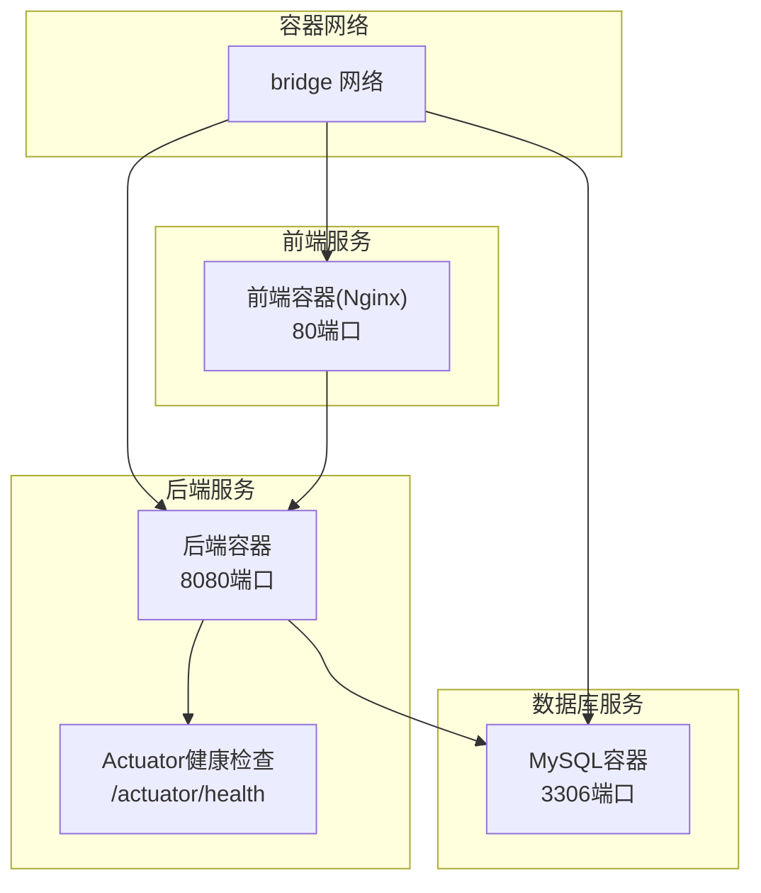
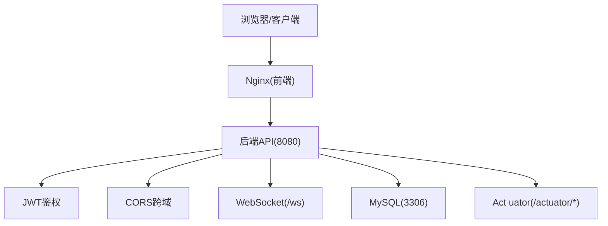
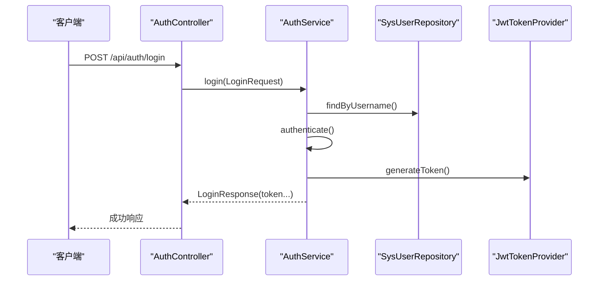
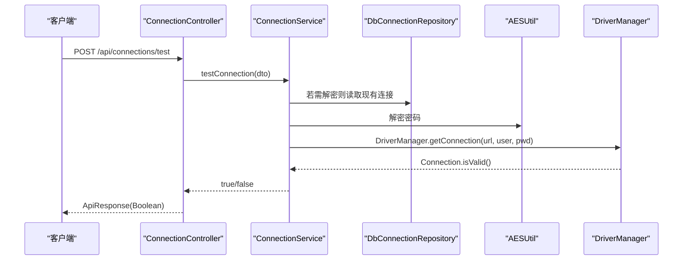
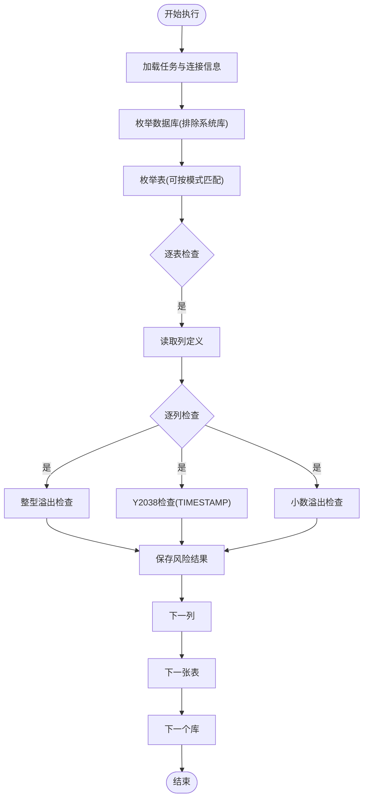
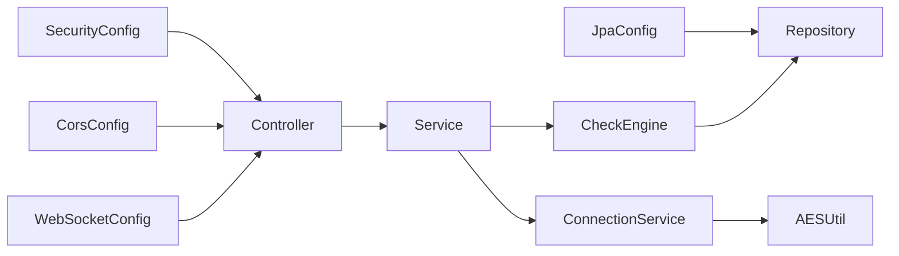

# 故障排除

<cite>
**本文引用的文件**
- [application.yml](file://backend/src/main/resources/application.yml)
- [application-docker.yml](file://backend/src/main/resources/application-docker.yml)
- [docker-compose.yml](file://docker-compose.yml)
- [my.cnf](file://mysql/conf/my.cnf)
- [Dockerfile（后端）](file://backend/Dockerfile)
- [Dockerfile（前端）](file://frontend/Dockerfile)
- [全局异常处理器](file://backend/src/main/java/com/fieldcheck/config/GlobalExceptionHandler.java)
- [安全配置](file://backend/src/main/java/com/fieldcheck/config/SecurityConfig.java)
- [跨域配置](file://backend/src/main/java/com/fieldcheck/config/CorsConfig.java)
- [WebSocket配置](file://backend/src/main/java/com/fieldcheck/config/WebSocketConfig.java)
- [JPA审计配置](file://backend/src/main/java/com/fieldcheck/config/JpaConfig.java)
- [认证控制器](file://backend/src/main/java/com/fieldcheck/controller/AuthController.java)
- [连接控制器](file://backend/src/main/java/com/fieldcheck/controller/ConnectionController.java)
- [连接服务](file://backend/src/main/java/com/fieldcheck/service/ConnectionService.java)
- [认证服务](file://backend/src/main/java/com/fieldcheck/service/AuthService.java)
- [检查引擎](file://backend/src/main/java/com/fieldcheck/engine/CheckEngine.java)
</cite>

## 目录
1. [简介](#简介)
2. [项目结构](#项目结构)
3. [核心组件](#核心组件)
4. [架构总览](#架构总览)
5. [详细组件分析](#详细组件分析)
6. [依赖分析](#依赖分析)
7. [性能注意事项](#性能注意事项)
8. [故障排除指南](#故障排除指南)
9. [结论](#结论)
10. [附录](#附录)

## 简介
本指南面向MySQL风险字段检查平台的运维与开发人员，聚焦于系统在启动失败、连接问题、性能问题与功能异常等场景下的诊断与修复流程。文档覆盖后端Spring Boot、前端Nginx、数据库MySQL以及Docker编排的全链路排查路径，并提供错误日志分析方法、关键错误码解释、监控指标与性能瓶颈定位、前后端问题区分策略、Docker相关问题诊断与修复，以及紧急情况下的应急处理方案。

## 项目结构
系统采用多容器编排：后端Spring Boot应用、前端Nginx静态站点、MySQL数据库，通过docker-compose统一管理。配置分为本地开发与Docker环境两套，分别位于后端资源目录中；数据库默认字符集、慢查询日志、连接数等参数由MySQL配置文件控制。

图表来源
- [docker-compose.yml](file://docker-compose.yml#L1-L91)
- [Dockerfile（后端）](file://backend/Dockerfile#L1-L44)
- [Dockerfile（前端）](file://frontend/Dockerfile#L1-L35)

章节来源
- [docker-compose.yml](file://docker-compose.yml#L1-L91)
- [application.yml](file://backend/src/main/resources/application.yml#L1-L75)
- [application-docker.yml](file://backend/src/main/resources/application-docker.yml#L1-L46)
- [my.cnf](file://mysql/conf/my.cnf#L1-L31)

## 核心组件
- 后端服务：提供认证、连接管理、任务执行、风险检查、告警、审计日志等能力，使用JWT鉴权、CORS、WebSocket推送、Quartz调度、JPA持久化。
- 前端服务：基于Nginx提供静态页面与健康检查接口。
- 数据库服务：MySQL 8.0，初始化脚本与配置文件位于mysql目录。
- 配置体系：本地application.yml与Docker环境application-docker.yml，分别适配不同部署形态。

章节来源
- [安全配置](file://backend/src/main/java/com/fieldcheck/config/SecurityConfig.java#L1-L60)
- [跨域配置](file://backend/src/main/java/com/fieldcheck/config/CorsConfig.java#L1-L29)
- [WebSocket配置](file://backend/src/main/java/com/fieldcheck/config/WebSocketConfig.java#L1-L26)
- [JPA审计配置](file://backend/src/main/java/com/fieldcheck/config/JpaConfig.java#L1-L10)
- [认证控制器](file://backend/src/main/java/com/fieldcheck/controller/AuthController.java#L1-L56)
- [连接控制器](file://backend/src/main/java/com/fieldcheck/controller/ConnectionController.java#L1-L82)
- [连接服务](file://backend/src/main/java/com/fieldcheck/service/ConnectionService.java#L1-L127)
- [认证服务](file://backend/src/main/java/com/fieldcheck/service/AuthService.java#L1-L80)
- [检查引擎](file://backend/src/main/java/com/fieldcheck/engine/CheckEngine.java#L1-L454)

## 架构总览
后端通过JDBC连接MySQL，使用HikariCP连接池；前端通过Nginx提供静态资源，与后端通过HTTP通信；系统通过WebSocket向客户端推送执行进度；Actuator暴露健康检查端点供容器健康探测。

图表来源
- [WebSocket配置](file://backend/src/main/java/com/fieldcheck/config/WebSocketConfig.java#L1-L26)
- [安全配置](file://backend/src/main/java/com/fieldcheck/config/SecurityConfig.java#L1-L60)
- [docker-compose.yml](file://docker-compose.yml#L30-L78)

## 详细组件分析

### 认证与会话
- 登录接口负责校验凭据、生成JWT令牌并记录审计日志；登出接口异步记录审计事件。
- 默认管理员账户在服务启动时初始化，便于首次登录与恢复。

图表来源
- [认证控制器](file://backend/src/main/java/com/fieldcheck/controller/AuthController.java#L25-L36)
- [认证服务](file://backend/src/main/java/com/fieldcheck/service/AuthService.java#L51-L73)

章节来源
- [认证控制器](file://backend/src/main/java/com/fieldcheck/controller/AuthController.java#L1-L56)
- [认证服务](file://backend/src/main/java/com/fieldcheck/service/AuthService.java#L1-L80)

### 数据库连接管理
- 支持创建、更新、删除与测试数据库连接；连接密码采用AES加密存储，测试连接时动态解密。
- 提供按名称与启用状态分页查询，支持排序与过滤。

图表来源
- [连接控制器](file://backend/src/main/java/com/fieldcheck/controller/ConnectionController.java#L72-L80)
- [连接服务](file://backend/src/main/java/com/fieldcheck/service/ConnectionService.java#L92-L108)

章节来源
- [连接控制器](file://backend/src/main/java/com/fieldcheck/controller/ConnectionController.java#L1-L82)
- [连接服务](file://backend/src/main/java/com/fieldcheck/service/ConnectionService.java#L1-L127)

### 风险检查引擎
- 扫描目标数据库与表，按列类型进行整型溢出、Y2038、小数溢出检测；支持白名单跳过、采样与阈值控制；定期保存执行进度以降低写放大。

图表来源
- [检查引擎](file://backend/src/main/java/com/fieldcheck/engine/CheckEngine.java#L57-L139)

章节来源
- [检查引擎](file://backend/src/main/java/com/fieldcheck/engine/CheckEngine.java#L1-L454)

## 依赖分析
- 后端配置层：安全、跨域、WebSocket、JPA审计等配置类共同构成运行期行为边界。
- 控制器与服务层：控制器负责请求入口与鉴权注解，服务层封装业务逻辑与数据访问。
- 引擎与仓库：检查引擎依赖连接服务与白名单服务，持久化依赖JPA仓库与事务模板。

图表来源
- [安全配置](file://backend/src/main/java/com/fieldcheck/config/SecurityConfig.java#L1-L60)
- [跨域配置](file://backend/src/main/java/com/fieldcheck/config/CorsConfig.java#L1-L29)
- [WebSocket配置](file://backend/src/main/java/com/fieldcheck/config/WebSocketConfig.java#L1-L26)
- [JPA审计配置](file://backend/src/main/java/com/fieldcheck/config/JpaConfig.java#L1-L10)
- [连接服务](file://backend/src/main/java/com/fieldcheck/service/ConnectionService.java#L1-L127)
- [检查引擎](file://backend/src/main/java/com/fieldcheck/engine/CheckEngine.java#L1-L454)

章节来源
- [安全配置](file://backend/src/main/java/com/fieldcheck/config/SecurityConfig.java#L1-L60)
- [跨域配置](file://backend/src/main/java/com/fieldcheck/config/CorsConfig.java#L1-L29)
- [WebSocket配置](file://backend/src/main/java/com/fieldcheck/config/WebSocketConfig.java#L1-L26)
- [JPA审计配置](file://backend/src/main/java/com/fieldcheck/config/JpaConfig.java#L1-L10)
- [连接服务](file://backend/src/main/java/com/fieldcheck/service/ConnectionService.java#L1-L127)
- [检查引擎](file://backend/src/main/java/com/fieldcheck/engine/CheckEngine.java#L1-L454)

## 性能注意事项
- 连接池与超时：HikariCP连接超时、空闲超时、最大生命周期等参数影响连接建立与回收效率。
- 查询采样：大表默认采用随机采样以降低开销，可通过任务配置调整采样大小与是否全量扫描。
- 执行进度批量落盘：每处理若干张表统一保存进度，减少频繁写入。
- Actuator健康检查：容器健康探针用于自动重启与负载均衡摘除，建议结合日志与指标综合判断。

章节来源
- [application.yml](file://backend/src/main/resources/application.yml#L13-L22)
- [application-docker.yml](file://backend/src/main/resources/application-docker.yml#L9-L14)
- [检查引擎](file://backend/src/main/java/com/fieldcheck/engine/CheckEngine.java#L125-L131)
- [Dockerfile（后端）](file://backend/Dockerfile#L39-L40)

## 故障排除指南

### 一、启动失败
- 症状
  - 容器无法进入健康状态，健康检查失败。
  - 后端启动报错，端口占用或数据库连接失败。
- 排查步骤
  1) 查看容器健康检查
     - 后端：curl访问/actuator/health；若失败，查看容器日志与后端日志级别。
     - 前端：wget健康检查；若失败，确认Nginx配置与静态资源。
     - 数据库：mysqladmin ping健康检查。
  2) 校验环境变量与配置
     - Docker环境变量是否正确注入（数据库URL、用户名、密码、JWT/AES密钥）。
     - application-docker.yml中的数据源、日志路径、Actuator暴露项是否符合预期。
  3) 端口与网络
     - 确认8080/80/3306端口未被占用；容器网络连通性。
  4) 初始化与依赖
     - MySQL初始化脚本是否执行；后端是否能连接到数据库。
- 关键日志与错误码
  - 后端日志级别：DEBUG/INFO按需开启；关注启动阶段的数据库连接与JPA初始化。
  - 健康检查失败：通常伴随数据库不可达或配置错误。

章节来源
- [docker-compose.yml](file://docker-compose.yml#L22-L26)
- [docker-compose.yml](file://docker-compose.yml#L52-L57)
- [docker-compose.yml](file://docker-compose.yml#L72-L76)
- [application-docker.yml](file://backend/src/main/resources/application-docker.yml#L1-L46)
- [Dockerfile（后端）](file://backend/Dockerfile#L39-L40)
- [Dockerfile（前端）](file://frontend/Dockerfile#L30-L32)

### 二、连接问题
- 症状
  - 登录失败、权限不足、跨域失败。
  - 测试数据库连接失败。
- 排查步骤
  1) 认证与权限
     - 使用/actuator/health确认后端可用；核对JWT密钥与过期时间。
     - 检查SecurityConfig中放行路径与鉴权规则。
  2) 跨域与前端
     - CORS允许的源、头、方法是否满足前端请求；前端Nginx健康检查是否通过。
  3) 数据库连接
     - 使用ConnectionController的/test接口验证；若失败，检查URL、用户名、密码、字符集与超时设置。
     - 解密密码是否正确；必要时重置默认管理员账户以恢复登录。
- 关键错误码与含义
  - 401 未授权：用户名或密码错误；检查凭证与用户状态。
  - 403 权限不足：角色不满足接口权限要求；检查用户角色与接口注解。
  - 400 参数校验失败：请求体字段校验未通过；检查必填项与格式。
  - 500 内部错误：后端异常未捕获或数据库异常；查看全局异常处理器日志。

章节来源
- [安全配置](file://backend/src/main/java/com/fieldcheck/config/SecurityConfig.java#L44-L57)
- [跨域配置](file://backend/src/main/java/com/fieldcheck/config/CorsConfig.java#L14-L27)
- [全局异常处理器](file://backend/src/main/java/com/fieldcheck/config/GlobalExceptionHandler.java#L20-L53)
- [连接控制器](file://backend/src/main/java/com/fieldcheck/controller/ConnectionController.java#L72-L80)
- [连接服务](file://backend/src/main/java/com/fieldcheck/service/ConnectionService.java#L92-L108)
- [认证服务](file://backend/src/main/java/com/fieldcheck/service/AuthService.java#L30-L49)

### 三、性能问题
- 症状
  - 检查任务耗时长、CPU/内存占用高、数据库慢查询增多。
- 排查步骤
  1) 采样与阈值
     - 对大表启用采样并调优采样大小；合理设置阈值百分比。
  2) 连接池与超时
     - 调整HikariCP参数；避免连接泄漏与长时间阻塞。
  3) 数据库侧
     - 检查慢查询日志与长查询阈值；优化information_schema查询与随机采样。
  4) 容器资源
     - 调整JVM堆大小与GC参数；监控容器CPU/内存使用。
- 关键指标
  - 执行进度保存频率、采样命中率、数据库连接池活跃数、慢查询数量。

章节来源
- [检查引擎](file://backend/src/main/java/com/fieldcheck/engine/CheckEngine.java#L125-L131)
- [application.yml](file://backend/src/main/resources/application.yml#L13-L22)
- [application-docker.yml](file://backend/src/main/resources/application-docker.yml#L9-L14)
- [my.cnf](file://mysql/conf/my.cnf#L16-L18)
- [Dockerfile（后端）](file://backend/Dockerfile#L36-L36)

### 四、功能异常
- 症状
  - 风险检查未产出结果、白名单未生效、WebSocket推送中断。
- 排查步骤
  1) 白名单与模式匹配
     - 确认白名单规则与任务模式匹配逻辑；检查大小写敏感与通配符。
  2) WebSocket
     - 确认/endpoint与broker配置；客户端是否正确订阅/topic。
  3) 数据一致性
     - 检查事务模板与进度保存策略；避免并发写导致的数据丢失。
- 关键日志
  - 执行回调日志包含“跳过白名单表”、“检查完成，发现X个风险”等信息。

章节来源
- [检查引擎](file://backend/src/main/java/com/fieldcheck/engine/CheckEngine.java#L94-L133)
- [WebSocket配置](file://backend/src/main/java/com/fieldcheck/config/WebSocketConfig.java#L13-L24)

### 五、前后端问题区分与解决策略
- 前端问题
  - 症状：页面无法打开、静态资源404、健康检查失败。
  - 排查：确认Nginx配置与构建产物；健康检查路径与返回。
- 后端问题
  - 症状：接口报4xx/5xx、鉴权失败、数据库连接异常。
  - 排查：Actuator健康检查、全局异常处理器、日志级别、数据库连接池。

章节来源
- [Dockerfile（前端）](file://frontend/Dockerfile#L24-L32)
- [docker-compose.yml](file://docker-compose.yml#L61-L78)
- [全局异常处理器](file://backend/src/main/java/com/fieldcheck/config/GlobalExceptionHandler.java#L1-L55)

### 六、Docker容器相关问题
- 常见问题
  - 容器无法启动、健康检查失败、卷挂载异常、网络不通。
- 诊断与修复
  1) 健康检查失败
     - 后端：检查/actuator/health；核对JVM参数与端口暴露。
     - 前端：检查Nginx配置与健康检查命令。
     - 数据库：检查mysqladmin ping与root密码。
  2) 卷与持久化
     - 确认backend_logs与backend_reports卷存在且权限正确。
  3) 网络
     - 使用同一bridge网络；容器间通过服务名访问。
  4) 环境变量
     - 确保SPRING_DATASOURCE_URL、用户名、密码、JWT与AES密钥正确注入。

章节来源
- [docker-compose.yml](file://docker-compose.yml#L30-L78)
- [Dockerfile（后端）](file://backend/Dockerfile#L14-L30)
- [Dockerfile（前端）](file://frontend/Dockerfile#L18-L29)

### 七、紧急情况应急处理
- 快速止损
  - 停止高负载任务；临时降低并发与采样规模；回滚配置变更。
- 快速恢复
  - 重启后端容器；确认数据库健康；恢复默认管理员账户登录。
- 证据留存
  - 导出后端日志与慢查询日志；记录容器状态与健康检查输出。

章节来源
- [认证服务](file://backend/src/main/java/com/fieldcheck/service/AuthService.java#L30-L49)
- [my.cnf](file://mysql/conf/my.cnf#L16-L18)
- [docker-compose.yml](file://docker-compose.yml#L52-L57)

### 八、错误日志分析与关键错误码
- 日志位置
  - 本地：application.yml中指定的日志路径；Docker：application-docker.yml中文件路径。
- 分析要点
  - 时间戳、线程、级别、类名与消息；关注数据库连接异常、SQL异常、鉴权异常。
- 错误码对照
  - 400：参数校验失败；401：凭据错误；403：权限不足；500：服务器内部错误。

章节来源
- [application.yml](file://backend/src/main/resources/application.yml#L69-L75)
- [application-docker.yml](file://backend/src/main/resources/application-docker.yml#L35-L36)
- [全局异常处理器](file://backend/src/main/java/com/fieldcheck/config/GlobalExceptionHandler.java#L20-L53)

### 九、系统监控指标与性能瓶颈识别
- 指标建议
  - 后端：JVM堆使用、GC次数与停顿、Actuator健康状态、数据库连接池活跃数。
  - 数据库：慢查询计数、连接数、缓冲池命中率、锁等待。
- 瓶颈识别
  - 大表全量扫描导致CPU/IO飙升；连接池耗尽；慢查询日志增多；前端静态资源加载失败。

章节来源
- [application.yml](file://backend/src/main/resources/application.yml#L13-L22)
- [my.cnf](file://mysql/conf/my.cnf#L16-L18)
- [Dockerfile（后端）](file://backend/Dockerfile#L36-L36)

### 十、数据库连接问题排查步骤
- 步骤
  1) 使用/test接口快速验证；失败时检查URL、端口、字符集、超时。
  2) 核对用户名与密码；必要时解密后再次尝试。
  3) 检查防火墙与网络策略；确认容器间连通。
  4) 查看慢查询日志与长查询阈值；优化information_schema查询。
- 参考实现
  - 连接测试与解密逻辑、URL拼接与超时设置。

章节来源
- [连接控制器](file://backend/src/main/java/com/fieldcheck/controller/ConnectionController.java#L72-L80)
- [连接服务](file://backend/src/main/java/com/fieldcheck/service/ConnectionService.java#L92-L108)
- [my.cnf](file://mysql/conf/my.cnf#L16-L18)

### 十一、问题反馈与社区支持
- 信息收集
  - 系统版本、部署方式（Docker/本地）、配置片段、错误日志与慢查询日志。
- 反馈渠道
  - 通过项目仓库Issue提交；附带上述信息以便快速定位。

[本节为通用指导，无需特定文件引用]

## 结论
本指南提供了从启动、连接、性能到功能异常的全链路故障排除路径，结合配置文件与关键组件的实现细节，帮助快速定位问题并实施修复。建议在生产环境中启用健康检查、慢查询日志与合理的日志级别，并定期评估连接池与任务采样策略以维持系统稳定与高效。

## 附录
- 关键配置参考
  - 后端端口、数据源、JPA方言、Quartz、邮件、Jackson日期格式与时区、JWT与AES密钥、日志路径与级别。
  - Docker环境变量覆盖、Actuator暴露、日志文件路径。
  - MySQL字符集、连接数、缓冲池、慢查询阈值、时区与大小写敏感。

章节来源
- [application.yml](file://backend/src/main/resources/application.yml#L1-L75)
- [application-docker.yml](file://backend/src/main/resources/application-docker.yml#L1-L46)
- [my.cnf](file://mysql/conf/my.cnf#L1-L31)