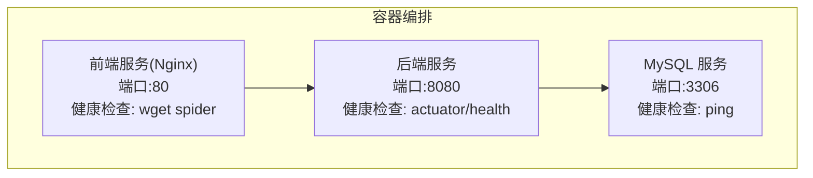
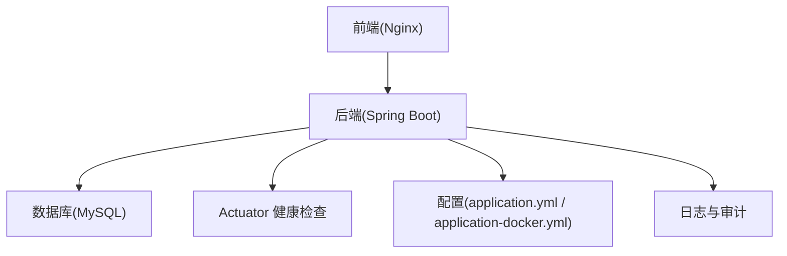
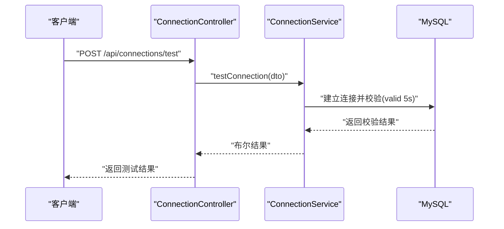
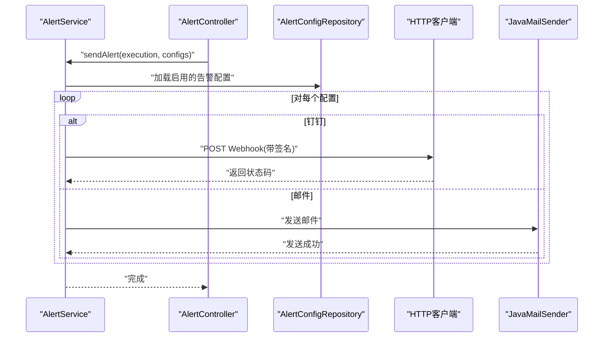
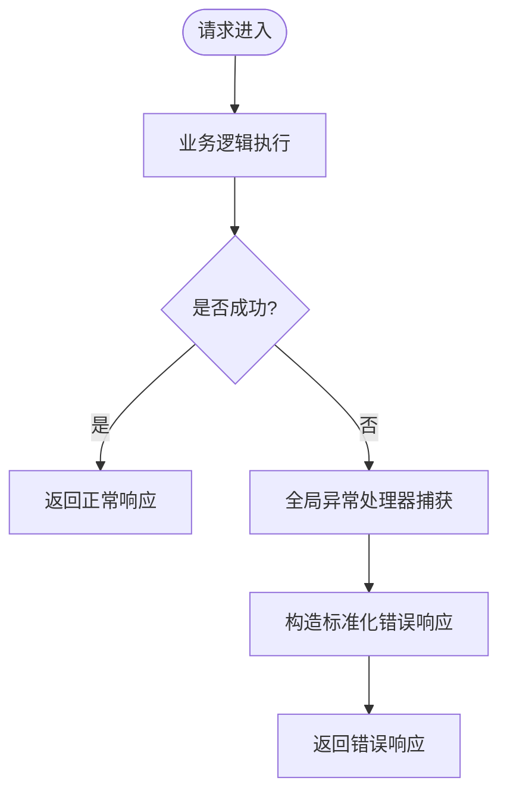
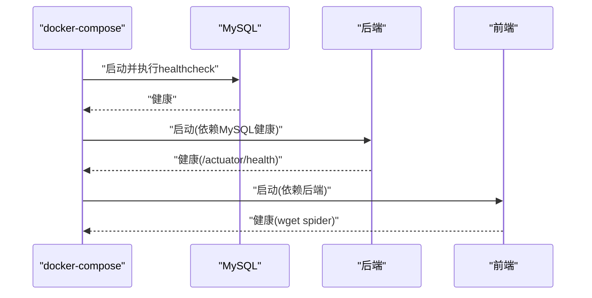
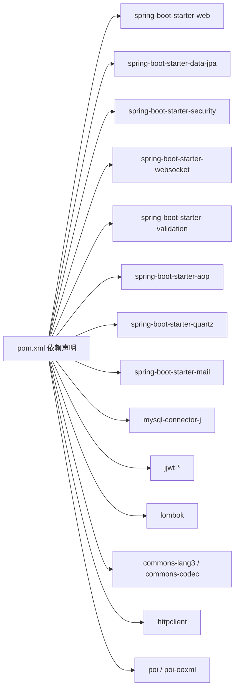

# 紧急故障处理

<cite>
**本文引用的文件**
- [application.yml](file://backend/src/main/resources/application.yml)
- [application-docker.yml](file://backend/src/main/resources/application-docker.yml)
- [GlobalExceptionHandler.java](file://backend/src/main/java/com/fieldcheck/config/GlobalExceptionHandler.java)
- [AlertService.java](file://backend/src/main/java/com/fieldcheck/service/AlertService.java)
- [AlertController.java](file://backend/src/main/java/com/fieldcheck/controller/AlertController.java)
- [ConnectionController.java](file://backend/src/main/java/com/fieldcheck/controller/ConnectionController.java)
- [ConnectionService.java](file://backend/src/main/java/com/fieldcheck/service/ConnectionService.java)
- [DbConnection.java](file://backend/src/main/java/com/fieldcheck/entity/DbConnection.java)
- [docker-compose.yml](file://docker-compose.yml)
- [Dockerfile（后端）](file://backend/Dockerfile)
- [Dockerfile（前端）](file://frontend/Dockerfile)
- [my.cnf](file://mysql/conf/my.cnf)
- [01_init_schema.sql](file://mysql/init/01_init_schema.sql)
- [start.sh](file://start.sh)
- [AuditLogController.java](file://backend/src/main/java/com/fieldcheck/controller/AuditLogController.java)
</cite>

## 目录
1. [简介](#简介)
2. [项目结构](#项目结构)
3. [核心组件](#核心组件)
4. [架构总览](#架构总览)
5. [详细组件分析](#详细组件分析)
6. [依赖分析](#依赖分析)
7. [性能考虑](#性能考虑)
8. [故障排查指南](#故障排查指南)
9. [结论](#结论)
10. [附录](#附录)

## 简介
本预案面向“MySQL风险字段检查平台”的紧急故障场景，覆盖系统宕机、数据库连接中断、服务不可用、数据异常等情形。内容包括应急响应流程、故障隔离与恢复策略（含数据库连接自动重试与服务重启/回滚）、灾难恢复与备份策略、监控告警配置与响应机制、紧急联系人与上报流程、故障处理记录模板与事后分析报告模板，以及团队成员职责分工与联系方式。

## 项目结构
平台采用前后端分离与容器化部署，后端为Spring Boot应用，前端为静态资源（Nginx），数据库为MySQL。通过docker-compose编排，包含健康检查与依赖顺序，便于快速恢复与回滚。

图表来源
- [docker-compose.yml](file://docker-compose.yml#L1-L91)
- [Dockerfile（后端）](file://backend/Dockerfile#L39-L40)
- [Dockerfile（前端）](file://frontend/Dockerfile#L30-L32)

章节来源
- [docker-compose.yml](file://docker-compose.yml#L1-L91)
- [start.sh](file://start.sh#L1-L80)

## 核心组件
- 数据库连接管理：负责连接创建、测试、解密存储密码、分页查询与删除。
- 全局异常处理：统一捕获运行时异常与安全相关异常，返回标准化错误响应。
- 告警服务：支持钉钉与邮件两种告警方式，具备测试发送能力。
- 健康检查与容器编排：后端与前端均配置健康检查，MySQL通过healthcheck探活。

章节来源
- [ConnectionService.java](file://backend/src/main/java/com/fieldcheck/service/ConnectionService.java#L1-L127)
- [ConnectionController.java](file://backend/src/main/java/com/fieldcheck/controller/ConnectionController.java#L1-L82)
- [GlobalExceptionHandler.java](file://backend/src/main/java/com/fieldcheck/config/GlobalExceptionHandler.java#L1-L55)
- [AlertService.java](file://backend/src/main/java/com/fieldcheck/service/AlertService.java#L1-L274)
- [AlertController.java](file://backend/src/main/java/com/fieldcheck/controller/AlertController.java#L1-L67)
- [docker-compose.yml](file://docker-compose.yml#L22-L26)
- [Dockerfile（后端）](file://backend/Dockerfile#L39-L40)
- [Dockerfile（前端）](file://frontend/Dockerfile#L30-L32)

## 架构总览
系统由前端（Nginx）、后端（Spring Boot）、数据库（MySQL）三层组成，容器间通过独立网络通信；后端通过JPA/Hibernate访问数据库，Quartz调度任务执行，Actuator暴露健康检查端点。

图表来源
- [docker-compose.yml](file://docker-compose.yml#L30-L78)
- [application.yml](file://backend/src/main/resources/application.yml#L1-L75)
- [application-docker.yml](file://backend/src/main/resources/application-docker.yml#L1-L46)

## 详细组件分析

### 数据库连接组件（隔离与恢复）
- 连接测试：在连接创建/更新时可进行连通性校验，超时与校验时间可控，失败时抛出异常并记录日志。
- 密码存储：使用对称加密保存密码，读取时解密，避免明文泄露。
- 连接池配置：最大池大小、空闲超时、连接超时、最大生命周期、连接有效性校验等参数，有助于在异常情况下自动回收与重建连接。
- 故障隔离：当某连接异常时，可通过禁用该连接或切换至备用连接，避免影响其他任务执行。

图表来源
- [ConnectionController.java](file://backend/src/main/java/com/fieldcheck/controller/ConnectionController.java#L72-L80)
- [ConnectionService.java](file://backend/src/main/java/com/fieldcheck/service/ConnectionService.java#L92-L108)

章节来源
- [ConnectionController.java](file://backend/src/main/java/com/fieldcheck/controller/ConnectionController.java#L1-L82)
- [ConnectionService.java](file://backend/src/main/java/com/fieldcheck/service/ConnectionService.java#L1-L127)
- [DbConnection.java](file://backend/src/main/java/com/fieldcheck/entity/DbConnection.java#L1-L47)
- [application.yml](file://backend/src/main/resources/application.yml#L8-L23)

### 告警组件（通知与恢复）
- 支持钉钉与邮件两种告警通道，具备签名URL与动态SMTP配置能力。
- 提供测试发送接口，便于验证配置正确性。
- 告警触发：在任务执行完成后按配置向指定通道推送消息。

图表来源
- [AlertController.java](file://backend/src/main/java/com/fieldcheck/controller/AlertController.java#L1-L67)
- [AlertService.java](file://backend/src/main/java/com/fieldcheck/service/AlertService.java#L124-L140)
- [AlertService.java](file://backend/src/main/java/com/fieldcheck/service/AlertService.java#L159-L199)
- [AlertService.java](file://backend/src/main/java/com/fieldcheck/service/AlertService.java#L201-L222)

章节来源
- [AlertController.java](file://backend/src/main/java/com/fieldcheck/controller/AlertController.java#L1-L67)
- [AlertService.java](file://backend/src/main/java/com/fieldcheck/service/AlertService.java#L1-L274)

### 异常处理与服务可用性
- 全局异常处理器统一拦截参数校验、认证失败、权限不足、运行时异常与未知异常，返回标准错误响应，避免堆栈泄露。
- Actuator健康检查端点对外暴露服务状态，便于容器编排自动重启。

图表来源
- [GlobalExceptionHandler.java](file://backend/src/main/java/com/fieldcheck/config/GlobalExceptionHandler.java#L20-L53)
- [Dockerfile（后端）](file://backend/Dockerfile#L39-L40)

章节来源
- [GlobalExceptionHandler.java](file://backend/src/main/java/com/fieldcheck/config/GlobalExceptionHandler.java#L1-L55)
- [application-docker.yml](file://backend/src/main/resources/application-docker.yml#L38-L46)

### 容器健康检查与自动重启
- MySQL：通过healthcheck探测ping，失败重试多次。
- 后端：通过curl探测/actuator/health，失败自动重启。
- 前端：通过wget探测/health，失败自动重启。
- 依赖顺序：后端等待MySQL健康后再启动，保证数据库可用性。

图表来源
- [docker-compose.yml](file://docker-compose.yml#L22-L26)
- [docker-compose.yml](file://docker-compose.yml#L52-L57)
- [docker-compose.yml](file://docker-compose.yml#L72-L76)
- [docker-compose.yml](file://docker-compose.yml#L49-L51)

章节来源
- [docker-compose.yml](file://docker-compose.yml#L1-L91)
- [Dockerfile（后端）](file://backend/Dockerfile#L39-L40)
- [Dockerfile（前端）](file://frontend/Dockerfile#L30-L32)

## 依赖分析
- 后端依赖：Web、JPA、Security、WebSocket、Validation、AOP、Quartz、Mail、MySQL驱动、JWT、Lombok、Apache Commons、Apache HttpClient、POI等。
- 健康检查端点：后端暴露health与info，前端暴露简单健康探测。
- 数据库配置：连接池参数、方言、DDL策略、时区与字符集等。

图表来源
- [pom.xml](file://backend/pom.xml#L28-L134)

章节来源
- [pom.xml](file://backend/pom.xml#L1-L161)
- [application.yml](file://backend/src/main/resources/application.yml#L24-L31)
- [application.yml](file://backend/src/main/resources/application.yml#L39-L49)

## 性能考虑
- 连接池参数：最大池大小、最小空闲、空闲超时、连接超时、最大生命周期、连接有效性校验，有助于在高并发与异常场景下保持稳定性。
- 字符集与时区：utf8mb4与Asia/Shanghai，减少字符集转换开销与时区差异问题。
- Quartz持久化：使用JDBC存储作业，避免内存状态丢失。
- 前端静态资源：Nginx直接提供，降低后端压力。

章节来源
- [application.yml](file://backend/src/main/resources/application.yml#L8-L23)
- [application.yml](file://backend/src/main/resources/application.yml#L24-L31)
- [application.yml](file://backend/src/main/resources/application.yml#L33-L37)
- [my.cnf](file://mysql/conf/my.cnf#L1-L31)

## 故障排查指南

### 一、系统宕机/服务不可用
- 步骤
  1) 使用容器编排状态查看服务状态与日志。
  2) 检查后端/前端健康检查端点是否可达。
  3) 若后端不健康，检查数据库连通性与连接池参数。
  4) 重启对应容器，观察健康检查恢复。
- 隔离与恢复
  - 优先重启后端容器，确保其依赖的数据库健康后再启动。
  - 如前端不健康，检查Nginx配置与静态资源路径。
- 参考
  - 容器健康检查与启动顺序、日志查看脚本。

章节来源
- [docker-compose.yml](file://docker-compose.yml#L49-L51)
- [docker-compose.yml](file://docker-compose.yml#L52-L57)
- [docker-compose.yml](file://docker-compose.yml#L72-L76)
- [start.sh](file://start.sh#L52-L57)

### 二、数据库连接中断
- 步骤
  1) 使用连接测试接口验证目标数据库连通性与凭据。
  2) 检查连接池参数与数据库慢查询日志。
  3) 若连接异常，临时禁用该连接或切换备用连接。
- 自动重连机制
  - 连接池具备连接有效性校验与超时控制，异常连接会被回收重建。
- 参考
  - 连接测试实现与连接池配置。

章节来源
- [ConnectionController.java](file://backend/src/main/java/com/fieldcheck/controller/ConnectionController.java#L72-L80)
- [ConnectionService.java](file://backend/src/main/java/com/fieldcheck/service/ConnectionService.java#L92-L108)
- [application.yml](file://backend/src/main/resources/application.yml#L8-L23)
- [my.cnf](file://mysql/conf/my.cnf#L16-L18)

### 三、服务重启与回滚
- 步骤
  1) 执行一键重启脚本，观察健康检查恢复。
  2) 若问题持续，回滚至上一个稳定镜像版本。
  3) 回滚后验证数据库schema与配置文件一致性。
- 参考
  - 容器健康检查与一键启动脚本。

章节来源
- [start.sh](file://start.sh#L47-L51)
- [docker-compose.yml](file://docker-compose.yml#L36-L51)
- [Dockerfile（后端）](file://backend/Dockerfile#L39-L40)

### 四、数据丢失/异常
- 步骤
  1) 检查数据库初始化脚本与当前表结构一致性。
  2) 核对审计日志中的关键操作记录。
  3) 如需恢复，基于备份卷进行数据回滚。
- 参考
  - 初始化脚本与审计日志控制器。

章节来源
- [01_init_schema.sql](file://mysql/init/01_init_schema.sql#L1-L185)
- [AuditLogController.java](file://backend/src/main/java/com/fieldcheck/controller/AuditLogController.java#L50-L65)

### 五、监控告警与响应
- 配置
  - 后端暴露健康检查端点，前端提供健康探测。
  - 告警服务支持钉钉与邮件，具备测试发送能力。
- 响应
  - 发生异常或任务失败时，按配置向指定通道推送告警。
- 参考
  - 健康检查端点与告警控制器。

章节来源
- [application-docker.yml](file://backend/src/main/resources/application-docker.yml#L38-L46)
- [AlertController.java](file://backend/src/main/java/com/fieldcheck/controller/AlertController.java#L1-L67)
- [AlertService.java](file://backend/src/main/java/com/fieldcheck/service/AlertService.java#L1-L274)

### 六、灾难恢复与数据备份策略
- 策略
  - 使用docker卷持久化数据库与后端日志/报表目录。
  - 定期导出数据库快照，保留多个历史版本。
  - 在环境变量中设置敏感配置，避免硬编码。
- 参考
  - 卷挂载与环境变量配置。

章节来源
- [docker-compose.yml](file://docker-compose.yml#L17-L21)
- [docker-compose.yml](file://docker-compose.yml#L46-L48)
- [application-docker.yml](file://backend/src/main/resources/application-docker.yml#L3-L29)

### 七、紧急联系人与上报流程
- 职责分工
  - 运维：负责容器编排、健康检查、日志收集与服务重启。
  - 开发：负责后端异常定位、配置修复与功能回归。
  - 安全：负责凭据管理、加密密钥轮换与权限审计。
  - 产品/运营：负责业务影响评估与外部沟通。
- 上报流程
  - 一线值班人员发现故障后，立即在群内上报并启动预案。
  - 指定负责人组织处置，每小时同步进展。
  - 事后形成复盘报告，沉淀改进措施。
- 联系方式
  - 运维负责人：[填写]
  - 开发负责人：[填写]
  - 安全负责人：[填写]
  - 产品/运营：[填写]

### 八、故障处理记录模板与事后分析报告
- 故障处理记录模板
  - 时间线：发现时间、上报时间、处置开始/结束时间
  - 影响范围：业务模块、用户规模、SLA影响
  - 处置过程：采取的隔离/恢复措施、责任人、决策依据
  - 结论：根因、临时/永久修复方案、验证结果
  - 改进项：流程优化、监控完善、演练计划
- 事后分析报告模板
  - 事件概述、根因分析、影响评估、处置过程、经验教训、改进计划、责任认定

### 九、团队成员应急职责与联系方式
- 运维工程师：负责容器编排、健康检查、日志与备份、服务重启与回滚
- 后端开发：负责异常定位、配置修复、数据库schema核对
- 前端开发：负责静态资源与健康探测页面
- 安全工程师：负责凭据与密钥管理、权限审计
- 联系方式：各成员私有信息，仅在预案附件中列出

## 结论
本预案以容器化与健康检查为基础，结合数据库连接池参数、全局异常处理与告警通道，形成从隔离、恢复到灾备的完整应急体系。建议定期演练、完善监控与告警阈值，并持续优化配置与流程，提升平台在极端场景下的韧性与可恢复性。

## 附录
- 快速启动脚本命令参考
  - 启动：./start.sh up
  - 停止：./start.sh down
  - 重启：./start.sh restart
  - 查看日志：./start.sh logs
  - 查看状态：./start.sh status
  - 清理数据：./start.sh clean（谨慎使用）

章节来源
- [start.sh](file://start.sh#L1-L80)