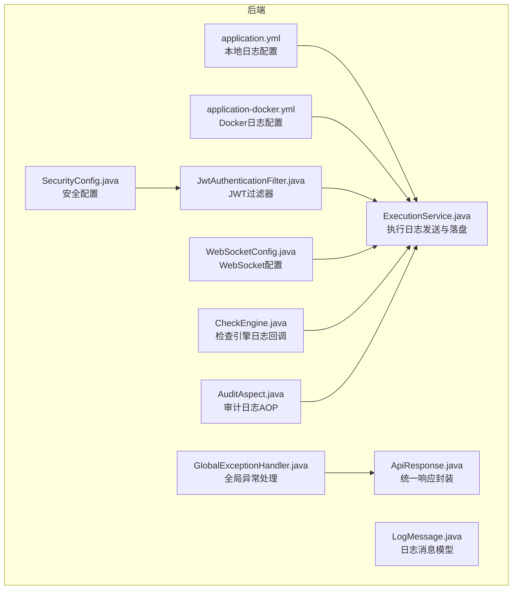
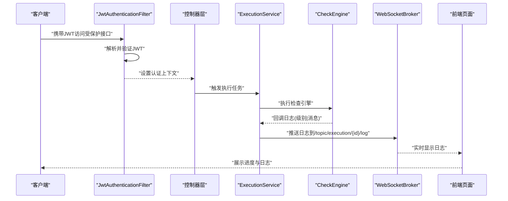
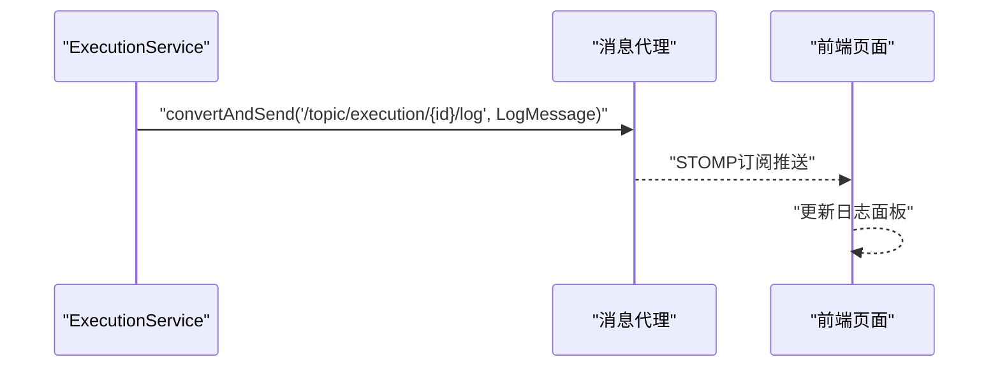
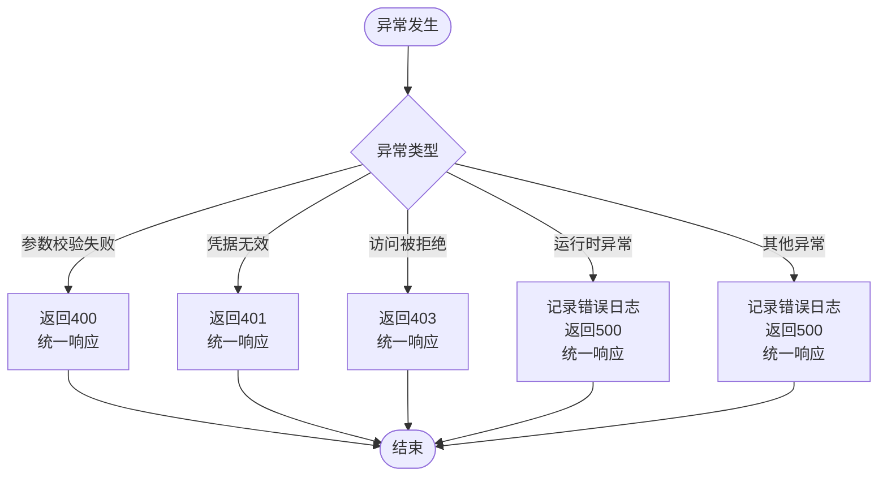
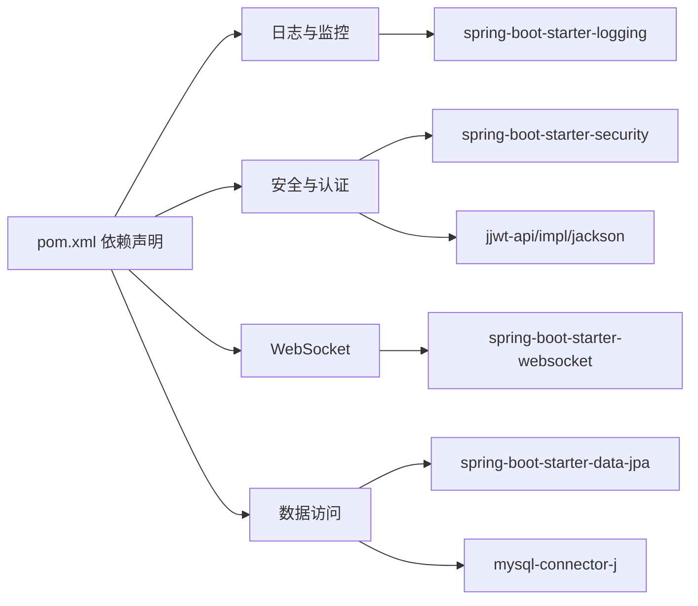

# 错误日志分析

<cite>
**本文引用的文件**
- [application.yml](file://backend/src/main/resources/application.yml)
- [application-docker.yml](file://backend/src/main/resources/application-docker.yml)
- [GlobalExceptionHandler.java](file://backend/src/main/java/com/fieldcheck/config/GlobalExceptionHandler.java)
- [SecurityConfig.java](file://backend/src/main/java/com/fieldcheck/config/SecurityConfig.java)
- [JwtAuthenticationFilter.java](file://backend/src/main/java/com/fieldcheck/security/JwtAuthenticationFilter.java)
- [WebSocketConfig.java](file://backend/src/main/java/com/fieldcheck/config/WebSocketConfig.java)
- [ExecutionService.java](file://backend/src/main/java/com/fieldcheck/service/ExecutionService.java)
- [CheckEngine.java](file://backend/src/main/java/com/fieldcheck/engine/CheckEngine.java)
- [AuditAspect.java](file://backend/src/main/java/com/fieldcheck/aspect/AuditAspect.java)
- [LogMessage.java](file://backend/src/main/java/com/fieldcheck/dto/LogMessage.java)
- [ApiResponse.java](file://backend/src/main/java/com/fieldcheck/dto/ApiResponse.java)
- [pom.xml](file://backend/pom.xml)
- [.gitignore](file://.gitignore)
- [start.sh](file://start.sh)
</cite>

## 目录
1. [简介](#简介)
2. [项目结构](#项目结构)
3. [核心组件](#核心组件)
4. [架构总览](#架构总览)
5. [详细组件分析](#详细组件分析)
6. [依赖分析](#依赖分析)
7. [性能考量](#性能考量)
8. [故障排查指南](#故障排查指南)
9. [结论](#结论)
10. [附录](#附录)

## 简介
本指南面向MySQL风险字段检查平台的运维与开发人员，聚焦后端应用日志的查看与分析方法，覆盖以下方面：
- Spring Boot应用日志：控制台与文件输出、日志级别与格式
- 数据库连接日志：JDBC连接池与SQL执行相关日志
- WebSocket通信日志：实时日志推送与前端展示
- 关键错误码与含义：400参数校验错误、401认证失败、403权限不足、500服务器内部错误
- 日志过滤与搜索技巧：快速定位问题根因
- 不同环境下的日志配置与输出格式差异：本地与Docker环境
- 日志轮转与存储策略最佳实践

## 项目结构
后端采用Spring Boot工程，日志配置位于resources目录；WebSocket配置在config包中；全局异常处理在config包中；执行过程中的日志通过ExecutionService写入文件并推送到前端；审计日志通过AOP切面自动记录。

图表来源
- [application.yml](file://backend/src/main/resources/application.yml#L69-L75)
- [application-docker.yml](file://backend/src/main/resources/application-docker.yml#L31-L46)
- [GlobalExceptionHandler.java](file://backend/src/main/java/com/fieldcheck/config/GlobalExceptionHandler.java#L16-L55)
- [SecurityConfig.java](file://backend/src/main/java/com/fieldcheck/config/SecurityConfig.java#L23-L60)
- [JwtAuthenticationFilter.java](file://backend/src/main/java/com/fieldcheck/security/JwtAuthenticationFilter.java#L19-L59)
- [WebSocketConfig.java](file://backend/src/main/java/com/fieldcheck/config/WebSocketConfig.java#L9-L26)
- [ExecutionService.java](file://backend/src/main/java/com/fieldcheck/service/ExecutionService.java#L237-L282)
- [CheckEngine.java](file://backend/src/main/java/com/fieldcheck/engine/CheckEngine.java#L57-L139)
- [AuditAspect.java](file://backend/src/main/java/com/fieldcheck/aspect/AuditAspect.java#L25-L66)
- [LogMessage.java](file://backend/src/main/java/com/fieldcheck/dto/LogMessage.java#L10-L23)
- [ApiResponse.java](file://backend/src/main/java/com/fieldcheck/dto/ApiResponse.java#L8-L44)

章节来源
- [application.yml](file://backend/src/main/resources/application.yml#L1-L75)
- [application-docker.yml](file://backend/src/main/resources/application-docker.yml#L1-L46)

## 核心组件
- 日志配置与输出
  - 本地开发：控制台输出格式与日志级别，路径由应用配置指定
  - Docker环境：集中写入容器内文件，便于外部挂载与采集
- 全局异常处理：将业务异常映射为HTTP状态码与统一响应体
- 安全与认证：基于JWT的无状态认证流程
- WebSocket：实时推送执行日志到前端
- 执行日志：执行过程中将“级别|消息”格式的日志写入文件并广播
- 审计日志：AOP自动记录操作行为与结果

章节来源
- [application.yml](file://backend/src/main/resources/application.yml#L69-L75)
- [application-docker.yml](file://backend/src/main/resources/application-docker.yml#L31-L46)
- [GlobalExceptionHandler.java](file://backend/src/main/java/com/fieldcheck/config/GlobalExceptionHandler.java#L16-L55)
- [JwtAuthenticationFilter.java](file://backend/src/main/java/com/fieldcheck/security/JwtAuthenticationFilter.java#L19-L59)
- [WebSocketConfig.java](file://backend/src/main/java/com/fieldcheck/config/WebSocketConfig.java#L9-L26)
- [ExecutionService.java](file://backend/src/main/java/com/fieldcheck/service/ExecutionService.java#L237-L282)
- [AuditAspect.java](file://backend/src/main/java/com/fieldcheck/aspect/AuditAspect.java#L25-L66)

## 架构总览
下图展示了从请求进入、认证鉴权、业务执行、日志记录到前端实时展示的整体流程。

图表来源
- [JwtAuthenticationFilter.java](file://backend/src/main/java/com/fieldcheck/security/JwtAuthenticationFilter.java#L27-L49)
- [ExecutionService.java](file://backend/src/main/java/com/fieldcheck/service/ExecutionService.java#L237-L268)
- [CheckEngine.java](file://backend/src/main/java/com/fieldcheck/engine/CheckEngine.java#L57-L139)
- [WebSocketConfig.java](file://backend/src/main/java/com/fieldcheck/config/WebSocketConfig.java#L13-L24)

## 详细组件分析

### Spring Boot应用日志配置与输出
- 本地开发
  - 控制台输出格式包含时间、线程、级别、Logger名称与消息
  - 日志级别对根包与业务包分别设置
- Docker环境
  - 集中写入容器内文件，便于外部挂载与采集
  - Actuator暴露健康与信息端点，便于监控

章节来源
- [application.yml](file://backend/src/main/resources/application.yml#L69-L75)
- [application-docker.yml](file://backend/src/main/resources/application-docker.yml#L31-L46)

### 数据库连接日志与SQL执行
- 连接池与超时
  - HikariCP连接池参数在本地与Docker配置中均有体现，包括最大池大小、空闲超时、连接超时、最大生命周期等
- SQL执行
  - 执行引擎通过JDBC连接信息模式化拼接URL，使用连接服务解密后的密码建立连接
  - 在执行过程中，通过回调函数向前端推送日志，并同时写入本地文件

章节来源
- [application.yml](file://backend/src/main/resources/application.yml#L8-L23)
- [application-docker.yml](file://backend/src/main/resources/application-docker.yml#L4-L15)
- [CheckEngine.java](file://backend/src/main/java/com/fieldcheck/engine/CheckEngine.java#L57-L139)
- [ExecutionService.java](file://backend/src/main/java/com/fieldcheck/service/ExecutionService.java#L237-L282)

### WebSocket通信日志
- 配置
  - 启用简单内存消息代理，前缀为/app，主题为/topic
  - 注册/ws端点，允许跨域
- 推送
  - 执行服务将日志消息封装为LogMessage并通过模板发送至对应主题
- 前端
  - 页面在任务运行时连接WebSocket，接收实时日志并渲染

图表来源
- [WebSocketConfig.java](file://backend/src/main/java/com/fieldcheck/config/WebSocketConfig.java#L13-L24)
- [ExecutionService.java](file://backend/src/main/java/com/fieldcheck/service/ExecutionService.java#L237-L268)
- [LogMessage.java](file://backend/src/main/java/com/fieldcheck/dto/LogMessage.java#L10-L23)

章节来源
- [WebSocketConfig.java](file://backend/src/main/java/com/fieldcheck/config/WebSocketConfig.java#L9-L26)
- [ExecutionService.java](file://backend/src/main/java/com/fieldcheck/service/ExecutionService.java#L237-L282)
- [LogMessage.java](file://backend/src/main/java/com/fieldcheck/dto/LogMessage.java#L10-L23)

### 全局异常处理与关键错误码
- 400 参数验证错误
  - 触发条件：参数校验失败
  - 处理方式：返回统一响应，状态码400
- 401 认证失败
  - 触发条件：凭据无效
  - 处理方式：返回统一响应，状态码401
- 403 权限不足
  - 触发条件：访问被拒绝
  - 处理方式：返回统一响应，状态码403
- 500 服务器内部错误
  - 触发条件：运行时异常或未预期异常
  - 处理方式：记录错误日志并返回统一响应，状态码500

图表来源
- [GlobalExceptionHandler.java](file://backend/src/main/java/com/fieldcheck/config/GlobalExceptionHandler.java#L20-L53)
- [ApiResponse.java](file://backend/src/main/java/com/fieldcheck/dto/ApiResponse.java#L17-L42)

章节来源
- [GlobalExceptionHandler.java](file://backend/src/main/java/com/fieldcheck/config/GlobalExceptionHandler.java#L16-L55)
- [ApiResponse.java](file://backend/src/main/java/com/fieldcheck/dto/ApiResponse.java#L8-L44)

### 审计日志AOP
- 切点：标注@Auditable的方法
- 成功与异常均会记录，包含操作动作、目标类型、目标ID/名称、详情与请求上下文
- 异常场景下会记录失败原因，便于回溯

章节来源
- [AuditAspect.java](file://backend/src/main/java/com/fieldcheck/aspect/AuditAspect.java#L25-L147)

### 执行日志模型与落盘
- 日志消息模型包含执行ID、时间戳、级别、消息内容及进度信息
- 执行服务将“级别|消息”格式的日志拆分，构造消息对象并推送WebSocket
- 同时将格式化的日志追加写入执行记录关联的文件

章节来源
- [LogMessage.java](file://backend/src/main/java/com/fieldcheck/dto/LogMessage.java#L10-L23)
- [ExecutionService.java](file://backend/src/main/java/com/fieldcheck/service/ExecutionService.java#L237-L282)

## 依赖分析
- 日志与监控
  - Spring Boot Starter Logging用于日志输出
  - Actuator在Docker环境下暴露健康与信息端点
- WebSocket
  - spring-boot-starter-websocket提供STOMP支持
- 安全
  - spring-boot-starter-security与JWT依赖提供认证能力
- 数据访问
  - spring-boot-starter-data-jpa与MySQL驱动

图表来源
- [pom.xml](file://backend/pom.xml#L28-L142)

章节来源
- [pom.xml](file://backend/pom.xml#L1-L161)

## 性能考量
- 日志级别
  - 生产环境建议提升日志级别以降低I/O开销
- WebSocket推送
  - 实时推送需关注带宽与并发，避免大量高频日志导致拥塞
- 数据库连接
  - 合理设置连接池参数，避免连接泄漏与超时
- 执行进度落盘
  - 批量写入与节流可减少磁盘压力

## 故障排查指南

### 如何查看与分析日志
- 本地开发
  - 查看控制台输出，结合日志格式定位异常发生位置
- Docker环境
  - 使用容器内文件路径查看日志
  - 通过Docker Compose查看聚合日志流
- 前端实时日志
  - 任务运行时连接WebSocket，观察实时日志与进度

章节来源
- [application.yml](file://backend/src/main/resources/application.yml#L69-L75)
- [application-docker.yml](file://backend/src/main/resources/application-docker.yml#L31-L46)
- [start.sh](file://start.sh#L52-L54)

### 关键错误码与解决方案
- 400 参数验证错误
  - 现象：请求参数不合法
  - 排查：检查请求体与字段约束
  - 解决：修正参数或调整校验规则
- 401 认证失败
  - 现象：未提供有效JWT或令牌过期
  - 排查：确认Authorization头是否正确、令牌是否过期
  - 解决：重新登录获取新令牌
- 403 权限不足
  - 现象：用户无权访问资源
  - 排查：确认用户角色与资源权限
  - 解决：分配相应角色或调整授权策略
- 500 服务器内部错误
  - 现象：系统异常
  - 排查：查看错误堆栈与审计日志
  - 解决：修复异常逻辑或依赖问题

章节来源
- [GlobalExceptionHandler.java](file://backend/src/main/java/com/fieldcheck/config/GlobalExceptionHandler.java#L16-L55)
- [AuditAspect.java](file://backend/src/main/java/com/fieldcheck/aspect/AuditAspect.java#L25-L66)

### 日志过滤与搜索技巧
- 使用日志级别过滤：优先查找ERROR/WARN
- 使用关键字过滤：如“Failed to write log file”、“Database check failed”
- 使用时间范围过滤：结合日志时间戳定位时间段内的问题
- 结合审计日志：通过操作动作与目标ID回溯问题

章节来源
- [ExecutionService.java](file://backend/src/main/java/com/fieldcheck/service/ExecutionService.java#L264-L266)
- [CheckEngine.java](file://backend/src/main/java/com/fieldcheck/engine/CheckEngine.java#L135-L139)
- [AuditAspect.java](file://backend/src/main/java/com/fieldcheck/aspect/AuditAspect.java#L40-L48)

### 不同环境下的日志配置与输出格式差异
- 本地开发
  - 控制台输出，格式包含时间、线程、级别、Logger名称与消息
- Docker环境
  - 写入容器内文件，便于外部挂载与采集
  - 暴露Actuator端点，便于远程监控

章节来源
- [application.yml](file://backend/src/main/resources/application.yml#L69-L75)
- [application-docker.yml](file://backend/src/main/resources/application-docker.yml#L31-L46)

### 日志轮转与存储策略最佳实践
- 轮转
  - 使用系统级日志轮转工具（如logrotate）按大小或时间轮转
- 存储
  - 将日志目录挂载到持久化卷，避免容器重建丢失
- 归档
  - 对历史日志进行压缩归档，定期清理过期日志
- 采集
  - 使用集中式日志采集器（如Fluentd/Logstash）收集多容器日志

章节来源
- [.gitignore](file://.gitignore#L17-L21)

## 结论
通过统一的日志配置、完善的异常处理、实时的WebSocket日志推送以及自动化的审计日志，MySQL风险字段检查平台能够高效地定位与解决问题。建议在生产环境中合理设置日志级别、启用日志轮转与归档，并结合监控与告警体系，确保问题早发现、快恢复。

## 附录

### 安全配置要点
- 无状态会话：禁用Cookie，使用JWT
- 跨域：WebSocket端点允许跨域
- 认证链路：JWT过滤器在安全过滤链中前置

章节来源
- [SecurityConfig.java](file://backend/src/main/java/com/fieldcheck/config/SecurityConfig.java#L44-L58)
- [JwtAuthenticationFilter.java](file://backend/src/main/java/com/fieldcheck/security/JwtAuthenticationFilter.java#L27-L49)
- [WebSocketConfig.java](file://backend/src/main/java/com/fieldcheck/config/WebSocketConfig.java#L20-L24)