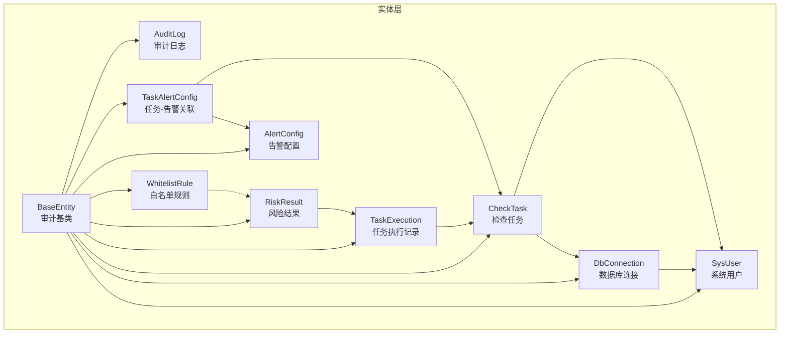
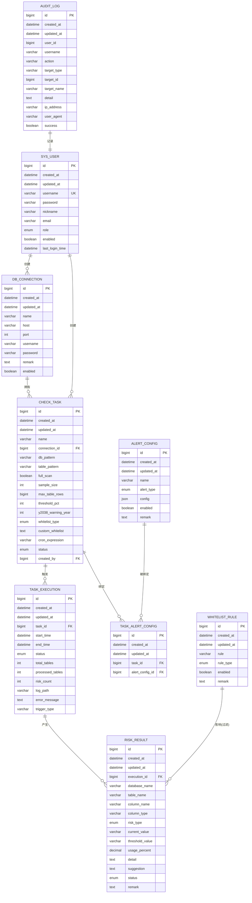
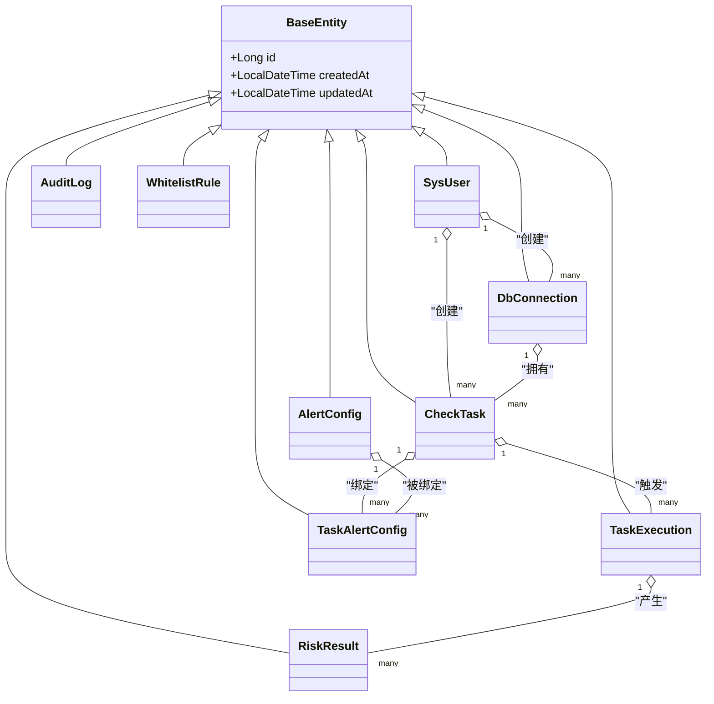
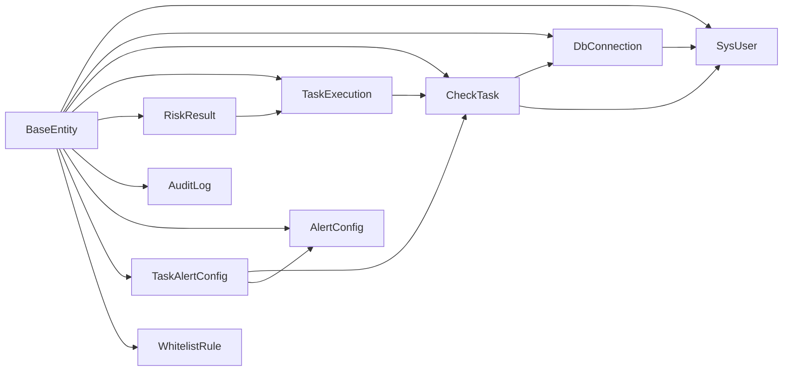

# 实体关系设计

<cite>
**本文引用的文件**
- [BaseEntity.java](file://backend/src/main/java/com/fieldcheck/entity/BaseEntity.java)
- [SysUser.java](file://backend/src/main/java/com/fieldcheck/entity/SysUser.java)
- [DbConnection.java](file://backend/src/main/java/com/fieldcheck/entity/DbConnection.java)
- [CheckTask.java](file://backend/src/main/java/com/fieldcheck/entity/CheckTask.java)
- [TaskExecution.java](file://backend/src/main/java/com/fieldcheck/entity/TaskExecution.java)
- [RiskResult.java](file://backend/src/main/java/com/fieldcheck/entity/RiskResult.java)
- [AuditLog.java](file://backend/src/main/java/com/fieldcheck/entity/AuditLog.java)
- [AlertConfig.java](file://backend/src/main/java/com/fieldcheck/entity/AlertConfig.java)
- [TaskAlertConfig.java](file://backend/src/main/java/com/fieldcheck/entity/TaskAlertConfig.java)
- [WhitelistRule.java](file://backend/src/main/java/com/fieldcheck/entity/WhitelistRule.java)
- [WhitelistRuleType.java](file://backend/src/main/java/com/fieldcheck/entity/WhitelistRuleType.java)
- [AlertType.java](file://backend/src/main/java/com/fieldcheck/entity/AlertType.java)
- [TaskStatus.java](file://backend/src/main/java/com/fieldcheck/entity/TaskStatus.java)
- [ExecutionStatus.java](file://backend/src/main/java/com/fieldcheck/entity/ExecutionStatus.java)
- [RiskStatus.java](file://backend/src/main/java/com/fieldcheck/entity/RiskStatus.java)
- [RiskType.java](file://backend/src/main/java/com/fieldcheck/entity/RiskType.java)
</cite>

## 目录
1. [简介](#简介)
2. [项目结构](#项目结构)
3. [核心组件](#核心组件)
4. [架构总览](#架构总览)
5. [详细组件分析](#详细组件分析)
6. [依赖分析](#依赖分析)
7. [性能考虑](#性能考虑)
8. [故障排查指南](#故障排查指南)
9. [结论](#结论)
10. [附录](#附录)

## 简介
本设计文档聚焦于MySQL风险字段检查平台的实体关系设计，系统性梳理所有核心实体类、继承与组合关系、JPA注解使用策略、主外键约束与索引设计，并结合业务流程给出ER图与实体关系图，帮助开发者与运维人员准确理解数据模型与持久化策略。

## 项目结构
后端采用Spring Boot + JPA/Hibernate标准分层：entity（实体）、repository（仓储）、service（服务）、controller（控制层）。实体层以BaseEntity为基类，统一审计字段；其余实体围绕“用户-连接-任务-执行-结果-审计-告警-白名单”构建完整闭环。

图表来源
- [BaseEntity.java](file://backend/src/main/java/com/fieldcheck/entity/BaseEntity.java#L1-L28)
- [SysUser.java](file://backend/src/main/java/com/fieldcheck/entity/SysUser.java#L1-L44)
- [DbConnection.java](file://backend/src/main/java/com/fieldcheck/entity/DbConnection.java#L1-L47)
- [CheckTask.java](file://backend/src/main/java/com/fieldcheck/entity/CheckTask.java#L1-L75)
- [TaskExecution.java](file://backend/src/main/java/com/fieldcheck/entity/TaskExecution.java#L1-L58)
- [RiskResult.java](file://backend/src/main/java/com/fieldcheck/entity/RiskResult.java#L1-L68)
- [AuditLog.java](file://backend/src/main/java/com/fieldcheck/entity/AuditLog.java#L1-L54)
- [AlertConfig.java](file://backend/src/main/java/com/fieldcheck/entity/AlertConfig.java#L1-L37)
- [TaskAlertConfig.java](file://backend/src/main/java/com/fieldcheck/entity/TaskAlertConfig.java#L1-L29)
- [WhitelistRule.java](file://backend/src/main/java/com/fieldcheck/entity/WhitelistRule.java#L1-L34)

章节来源
- [BaseEntity.java](file://backend/src/main/java/com/fieldcheck/entity/BaseEntity.java#L1-L28)
- [SysUser.java](file://backend/src/main/java/com/fieldcheck/entity/SysUser.java#L1-L44)
- [DbConnection.java](file://backend/src/main/java/com/fieldcheck/entity/DbConnection.java#L1-L47)
- [CheckTask.java](file://backend/src/main/java/com/fieldcheck/entity/CheckTask.java#L1-L75)
- [TaskExecution.java](file://backend/src/main/java/com/fieldcheck/entity/TaskExecution.java#L1-L58)
- [RiskResult.java](file://backend/src/main/java/com/fieldcheck/entity/RiskResult.java#L1-L68)
- [AuditLog.java](file://backend/src/main/java/com/fieldcheck/entity/AuditLog.java#L1-L54)
- [AlertConfig.java](file://backend/src/main/java/com/fieldcheck/entity/AlertConfig.java#L1-L37)
- [TaskAlertConfig.java](file://backend/src/main/java/com/fieldcheck/entity/TaskAlertConfig.java#L1-L29)
- [WhitelistRule.java](file://backend/src/main/java/com/fieldcheck/entity/WhitelistRule.java#L1-L34)

## 核心组件
- 审计基类 BaseEntity：统一提供自增主键id、创建时间createdAt、更新时间updatedAt，并通过AuditingEntityListener开启自动审计。
- 用户 SysUser：用户名、密码、角色、状态等，继承BaseEntity。
- 连接 DbConnection：连接名称、主机、端口、账号、加密存储的密码、备注、启用状态、创建人。
- 任务 CheckTask：任务名、所属连接、数据库/表匹配模式、采样参数、阈值、白名单策略、Cron表达式、状态、创建人。
- 执行 TaskExecution：关联任务、开始/结束时间、执行状态、统计信息、日志路径、错误信息、触发类型。
- 结果 RiskResult：关联执行、数据库/表/列、类型、阈值、使用率、详情、建议、状态、备注。
- 审计 AuditLog：用户标识、动作、目标类型/ID/名称、详情、IP、UA、是否成功。
- 告警 AlertConfig：告警名称、类型、配置JSON、启用状态、备注。
- 关联 TaskAlertConfig：任务与告警配置的多对多中间表（实际由两个多对一构成）。
- 白名单 WhitelistRule：规则字符串、规则类型、启用状态、备注。

章节来源
- [BaseEntity.java](file://backend/src/main/java/com/fieldcheck/entity/BaseEntity.java#L1-L28)
- [SysUser.java](file://backend/src/main/java/com/fieldcheck/entity/SysUser.java#L1-L44)
- [DbConnection.java](file://backend/src/main/java/com/fieldcheck/entity/DbConnection.java#L1-L47)
- [CheckTask.java](file://backend/src/main/java/com/fieldcheck/entity/CheckTask.java#L1-L75)
- [TaskExecution.java](file://backend/src/main/java/com/fieldcheck/entity/TaskExecution.java#L1-L58)
- [RiskResult.java](file://backend/src/main/java/com/fieldcheck/entity/RiskResult.java#L1-L68)
- [AuditLog.java](file://backend/src/main/java/com/fieldcheck/entity/AuditLog.java#L1-L54)
- [AlertConfig.java](file://backend/src/main/java/com/fieldcheck/entity/AlertConfig.java#L1-L37)
- [TaskAlertConfig.java](file://backend/src/main/java/com/fieldcheck/entity/TaskAlertConfig.java#L1-L29)
- [WhitelistRule.java](file://backend/src/main/java/com/fieldcheck/entity/WhitelistRule.java#L1-L34)

## 架构总览
下图展示实体间的主要关系与约束，强调一对一/一对多/多对多的映射与外键方向。

图表来源
- [SysUser.java](file://backend/src/main/java/com/fieldcheck/entity/SysUser.java#L1-L44)
- [DbConnection.java](file://backend/src/main/java/com/fieldcheck/entity/DbConnection.java#L1-L47)
- [CheckTask.java](file://backend/src/main/java/com/fieldcheck/entity/CheckTask.java#L1-L75)
- [TaskExecution.java](file://backend/src/main/java/com/fieldcheck/entity/TaskExecution.java#L1-L58)
- [RiskResult.java](file://backend/src/main/java/com/fieldcheck/entity/RiskResult.java#L1-L68)
- [AlertConfig.java](file://backend/src/main/java/com/fieldcheck/entity/AlertConfig.java#L1-L37)
- [TaskAlertConfig.java](file://backend/src/main/java/com/fieldcheck/entity/TaskAlertConfig.java#L1-L29)
- [WhitelistRule.java](file://backend/src/main/java/com/fieldcheck/entity/WhitelistRule.java#L1-L34)
- [AuditLog.java](file://backend/src/main/java/com/fieldcheck/entity/AuditLog.java#L1-L54)

## 详细组件分析

### 继承与组合关系
- 继承：SysUser、DbConnection、CheckTask、TaskExecution、RiskResult、AuditLog、AlertConfig、TaskAlertConfig、WhitelistRule均继承BaseEntity，共享审计字段。
- 组合/关联：
  - 一对多：SysUser → DbConnection（创建者），SysUser → CheckTask（创建者）
  - 多对一：CheckTask → DbConnection（所属连接）
  - 一对多：CheckTask → TaskExecution（历史执行）
  - 多对一：RiskResult → TaskExecution（产生于某次执行）
  - 多对一：TaskAlertConfig → CheckTask、AlertConfig（任务-告警绑定）
  - 多对一：DbConnection → SysUser（创建人）

图表来源
- [BaseEntity.java](file://backend/src/main/java/com/fieldcheck/entity/BaseEntity.java#L1-L28)
- [SysUser.java](file://backend/src/main/java/com/fieldcheck/entity/SysUser.java#L1-L44)
- [DbConnection.java](file://backend/src/main/java/com/fieldcheck/entity/DbConnection.java#L1-L47)
- [CheckTask.java](file://backend/src/main/java/com/fieldcheck/entity/CheckTask.java#L1-L75)
- [TaskExecution.java](file://backend/src/main/java/com/fieldcheck/entity/TaskExecution.java#L1-L58)
- [RiskResult.java](file://backend/src/main/java/com/fieldcheck/entity/RiskResult.java#L1-L68)
- [AlertConfig.java](file://backend/src/main/java/com/fieldcheck/entity/AlertConfig.java#L1-L37)
- [TaskAlertConfig.java](file://backend/src/main/java/com/fieldcheck/entity/TaskAlertConfig.java#L1-L29)
- [WhitelistRule.java](file://backend/src/main/java/com/fieldcheck/entity/WhitelistRule.java#L1-L34)

章节来源
- [BaseEntity.java](file://backend/src/main/java/com/fieldcheck/entity/BaseEntity.java#L1-L28)
- [SysUser.java](file://backend/src/main/java/com/fieldcheck/entity/SysUser.java#L1-L44)
- [DbConnection.java](file://backend/src/main/java/com/fieldcheck/entity/DbConnection.java#L1-L47)
- [CheckTask.java](file://backend/src/main/java/com/fieldcheck/entity/CheckTask.java#L1-L75)
- [TaskExecution.java](file://backend/src/main/java/com/fieldcheck/entity/TaskExecution.java#L1-L58)
- [RiskResult.java](file://backend/src/main/java/com/fieldcheck/entity/RiskResult.java#L1-L68)
- [AlertConfig.java](file://backend/src/main/java/com/fieldcheck/entity/AlertConfig.java#L1-L37)
- [TaskAlertConfig.java](file://backend/src/main/java/com/fieldcheck/entity/TaskAlertConfig.java#L1-L29)
- [WhitelistRule.java](file://backend/src/main/java/com/fieldcheck/entity/WhitelistRule.java#L1-L34)

### JPA注解与映射策略
- 统一审计：BaseEntity使用@MappedSuperclass与@EntityListeners(AuditingEntityListener)，子类自动获得createdAt/updatedAt。
- 主键：所有实体使用@GeneratedValue(strategy = GenerationType.IDENTITY)生成自增主键。
- 表与列：@Entity/@Table/@Column，明确表名、列名、长度、精度、默认值、是否可空。
- 枚举：@Enumerated(EnumType.STRING)统一以字符串存储枚举值，便于迁移与查询。
- 关系：
  - @ManyToOne(fetch = FetchType.LAZY)：延迟加载，降低N+1开销。
  - @JoinColumn(name = "...")：显式指定外键列名与非空约束。
  - @Index：在高选择性列上建立索引，如risk_result的execution_id/risk_type/status。
- 特殊类型：
  - JSON：AlertConfig.config使用JSON类型存储配置。
  - TEXT：DbConnection.password、RiskResult.detail/suggestion、AuditLog.detail等使用长文本。
  - DECIMAL：RiskResult.usage_percent使用precision/scale保证精度。

章节来源
- [BaseEntity.java](file://backend/src/main/java/com/fieldcheck/entity/BaseEntity.java#L1-L28)
- [RiskResult.java](file://backend/src/main/java/com/fieldcheck/entity/RiskResult.java#L1-L68)
- [AlertConfig.java](file://backend/src/main/java/com/fieldcheck/entity/AlertConfig.java#L1-L37)
- [CheckTask.java](file://backend/src/main/java/com/fieldcheck/entity/CheckTask.java#L1-L75)
- [TaskExecution.java](file://backend/src/main/java/com/fieldcheck/entity/TaskExecution.java#L1-L58)
- [DbConnection.java](file://backend/src/main/java/com/fieldcheck/entity/DbConnection.java#L1-L47)
- [AuditLog.java](file://backend/src/main/java/com/fieldcheck/entity/AuditLog.java#L1-L54)

### 生命周期管理与级联策略
- 审计：通过AuditingEntityListener自动维护createdAt/updatedAt，无需手动设置。
- 级联：当前实体未声明CascadeType，遵循“不自动级联”的保守策略，避免误删或误增。
- 状态机：
  - 任务状态：TaskStatus（ENABLED/DISABLED）
  - 执行状态：ExecutionStatus（PENDING/RUNNING/SUCCESS/FAILED/STOPPED）
  - 风险状态：RiskStatus（PENDING/IGNORED/RESOLVED）
  - 风险类型：RiskType（整型溢出、小数溢出、Y2038、字符串截断、日期异常、其他）
  - 告警类型：AlertType（钉钉、邮件）
  - 白名单规则类型：WhitelistRuleType（库/表/字段）

章节来源
- [BaseEntity.java](file://backend/src/main/java/com/fieldcheck/entity/BaseEntity.java#L1-L28)
- [TaskStatus.java](file://backend/src/main/java/com/fieldcheck/entity/TaskStatus.java#L1-L7)
- [ExecutionStatus.java](file://backend/src/main/java/com/fieldcheck/entity/ExecutionStatus.java#L1-L10)
- [RiskStatus.java](file://backend/src/main/java/com/fieldcheck/entity/RiskStatus.java#L1-L8)
- [RiskType.java](file://backend/src/main/java/com/fieldcheck/entity/RiskType.java#L1-L11)
- [AlertType.java](file://backend/src/main/java/com/fieldcheck/entity/AlertType.java#L1-L7)
- [WhitelistRuleType.java](file://backend/src/main/java/com/fieldcheck/entity/WhitelistRuleType.java#L1-L8)

### 数据持久化与业务逻辑映射
- 用户管理：SysUser负责认证与授权，DbConnection与CheckTask围绕其创建与管理。
- 连接与任务：DbConnection提供数据库访问凭证，CheckTask定义扫描策略与阈值。
- 执行与结果：TaskExecution承载单次执行的上下文，RiskResult记录具体风险项。
- 审计与告警：AuditLog记录关键操作，AlertConfig与TaskAlertConfig联动通知。
- 白名单：WhitelistRule按库/表/字段粒度过滤风险，减少误报。

章节来源
- [SysUser.java](file://backend/src/main/java/com/fieldcheck/entity/SysUser.java#L1-L44)
- [DbConnection.java](file://backend/src/main/java/com/fieldcheck/entity/DbConnection.java#L1-L47)
- [CheckTask.java](file://backend/src/main/java/com/fieldcheck/entity/CheckTask.java#L1-L75)
- [TaskExecution.java](file://backend/src/main/java/com/fieldcheck/entity/TaskExecution.java#L1-L58)
- [RiskResult.java](file://backend/src/main/java/com/fieldcheck/entity/RiskResult.java#L1-L68)
- [AuditLog.java](file://backend/src/main/java/com/fieldcheck/entity/AuditLog.java#L1-L54)
- [AlertConfig.java](file://backend/src/main/java/com/fieldcheck/entity/AlertConfig.java#L1-L37)
- [TaskAlertConfig.java](file://backend/src/main/java/com/fieldcheck/entity/TaskAlertConfig.java#L1-L29)
- [WhitelistRule.java](file://backend/src/main/java/com/fieldcheck/entity/WhitelistRule.java#L1-L34)

## 依赖分析
- 内聚性：每个实体职责清晰，围绕单一业务对象建模。
- 耦合度：通过外键与枚举降低耦合；延迟加载减少不必要的关联查询。
- 可扩展性：新增实体可通过继承BaseEntity快速接入审计体系；枚举驱动的状态与类型便于扩展。

图表来源
- [BaseEntity.java](file://backend/src/main/java/com/fieldcheck/entity/BaseEntity.java#L1-L28)
- [SysUser.java](file://backend/src/main/java/com/fieldcheck/entity/SysUser.java#L1-L44)
- [DbConnection.java](file://backend/src/main/java/com/fieldcheck/entity/DbConnection.java#L1-L47)
- [CheckTask.java](file://backend/src/main/java/com/fieldcheck/entity/CheckTask.java#L1-L75)
- [TaskExecution.java](file://backend/src/main/java/com/fieldcheck/entity/TaskExecution.java#L1-L58)
- [RiskResult.java](file://backend/src/main/java/com/fieldcheck/entity/RiskResult.java#L1-L68)
- [AlertConfig.java](file://backend/src/main/java/com/fieldcheck/entity/AlertConfig.java#L1-L37)
- [TaskAlertConfig.java](file://backend/src/main/java/com/fieldcheck/entity/TaskAlertConfig.java#L1-L29)
- [WhitelistRule.java](file://backend/src/main/java/com/fieldcheck/entity/WhitelistRule.java#L1-L34)

## 性能考虑
- 查询优化：
  - 在RiskResult上为execution_id、risk_type、status建立索引，提升筛选与统计效率。
  - 在AuditLog上为user_id、action建立索引，便于审计检索。
- 关联查询：
  - 使用FetchType.LAZY避免N+1问题；必要时通过JOIN FETCH批量抓取。
- 数据类型：
  - DECIMAL用于百分比，确保计算精度；JSON用于灵活配置，注意查询与更新成本。
- 分页与统计：
  - 对TaskExecution与RiskResult提供分页接口，避免一次性加载大量记录。

章节来源
- [RiskResult.java](file://backend/src/main/java/com/fieldcheck/entity/RiskResult.java#L1-L68)
- [AuditLog.java](file://backend/src/main/java/com/fieldcheck/entity/AuditLog.java#L1-L54)

## 故障排查指南
- 审计字段缺失：
  - 检查是否正确引入AuditingEntityListener；确认BaseEntity已标注@EntityListeners。
- 外键约束失败：
  - 确认关联实体存在且未被删除；检查@JoinColumn的列名与非空约束。
- 枚举存储异常：
  - 确保使用@Enumerated(EnumType.STRING)；避免直接存数字或拼写不一致。
- 密码安全：
  - DbConnection.password为敏感字段，需配合AES工具进行加解密存储与传输。
- 日志与追踪：
  - 通过AuditLog定位操作人、目标与结果；结合RiskResult.status与errorMessage定位问题。

章节来源
- [BaseEntity.java](file://backend/src/main/java/com/fieldcheck/entity/BaseEntity.java#L1-L28)
- [DbConnection.java](file://backend/src/main/java/com/fieldcheck/entity/DbConnection.java#L1-L47)
- [AuditLog.java](file://backend/src/main/java/com/fieldcheck/entity/AuditLog.java#L1-L54)
- [RiskResult.java](file://backend/src/main/java/com/fieldcheck/entity/RiskResult.java#L1-L68)

## 结论
该实体关系设计以BaseEntity为核心，围绕用户、连接、任务、执行、结果、审计、告警与白名单构建了完整的数据模型。通过合理的JPA注解、延迟加载、索引与枚举策略，既满足业务需求又兼顾性能与可维护性。建议后续在高并发场景下进一步完善缓存与异步处理策略，并持续优化索引与查询计划。

## 附录
- 最佳实践与设计模式应用：
  - 基类抽象：BaseEntity作为模板方法，统一审计字段，减少重复代码。
  - 枚举驱动：以字符串枚举替代魔法值，增强可读性与可维护性。
  - 延迟加载：对关联对象使用LAZY，降低查询成本。
  - 中间表建模：TaskAlertConfig通过两个多对一实现多对多，符合JPA习惯。
  - 灵活配置：AlertConfig使用JSON存储配置，便于扩展不同告警通道。

章节来源
- [BaseEntity.java](file://backend/src/main/java/com/fieldcheck/entity/BaseEntity.java#L1-L28)
- [AlertConfig.java](file://backend/src/main/java/com/fieldcheck/entity/AlertConfig.java#L1-L37)
- [TaskAlertConfig.java](file://backend/src/main/java/com/fieldcheck/entity/TaskAlertConfig.java#L1-L29)