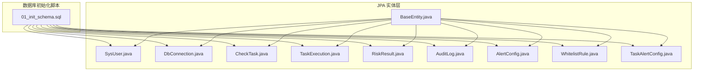
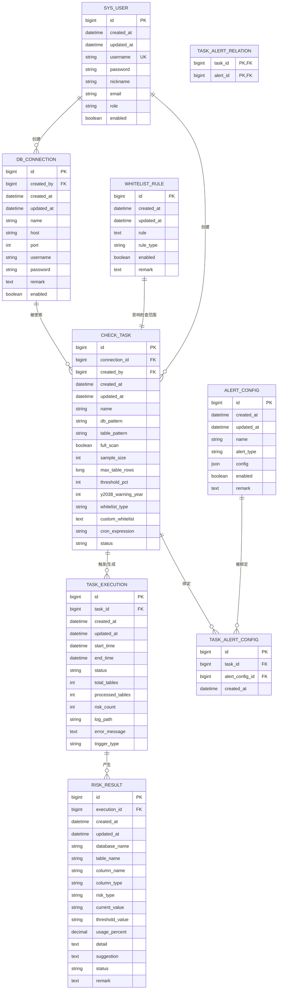
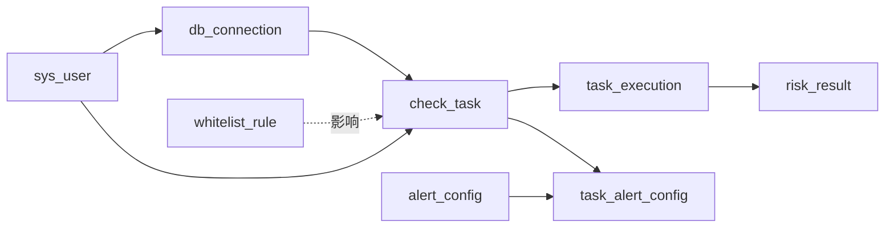

# 数据库设计

<cite>
**本文引用的文件**
- [01_init_schema.sql](file://mysql/init/01_init_schema.sql)
- [SysUser.java](file://backend/src/main/java/com/fieldcheck/entity/SysUser.java)
- [DbConnection.java](file://backend/src/main/java/com/fieldcheck/entity/DbConnection.java)
- [CheckTask.java](file://backend/src/main/java/com/fieldcheck/entity/CheckTask.java)
- [TaskExecution.java](file://backend/src/main/java/com/fieldcheck/entity/TaskExecution.java)
- [RiskResult.java](file://backend/src/main/java/com/fieldcheck/entity/RiskResult.java)
- [AuditLog.java](file://backend/src/main/java/com/fieldcheck/entity/AuditLog.java)
- [AlertConfig.java](file://backend/src/main/java/com/fieldcheck/entity/AlertConfig.java)
- [WhitelistRule.java](file://backend/src/main/java/com/fieldcheck/entity/WhitelistRule.java)
- [TaskAlertConfig.java](file://backend/src/main/java/com/fieldcheck/entity/TaskAlertConfig.java)
- [BaseEntity.java](file://backend/src/main/java/com/fieldcheck/entity/BaseEntity.java)
</cite>

## 更新摘要
**所做更改**
- 更新了数据库初始化脚本的表结构创建顺序说明
- 修正了表结构创建顺序：新增了 sys_user 和 db_connection 表的创建
- 更新了 task_execution 表的创建位置说明
- 删除了多个注释行的说明
- 优化了表结构的逻辑组织说明

## 目录
1. [简介](#简介)
2. [项目结构](#项目结构)
3. [核心组件](#核心组件)
4. [架构总览](#架构总览)
5. [详细组件分析](#详细组件分析)
6. [依赖分析](#依赖分析)
7. [性能考虑](#性能考虑)
8. [故障排查指南](#故障排查指南)
9. [结论](#结论)
10. [附录](#附录)

## 简介
本文件为 MySQL 风险字段检查平台的数据库设计文档，聚焦于实体关系模型（ER）与表结构设计，覆盖核心表的字段定义、主键/外键/索引/约束的设计原则，并结合业务场景给出数据访问模式与性能优化建议。同时，提供初始化脚本说明、迁移策略与版本管理思路，以及数据模型的演进历史说明。

## 项目结构
后端采用 Spring Boot + JPA 的分层架构，数据库初始化脚本位于 mysql/init/01_init_schema.sql；JPA 实体类位于 backend/src/main/java/com/fieldcheck/entity/，用于映射数据库表结构并声明索引与关系。

**图表来源**
- [01_init_schema.sql:1-178](file://mysql/init/01_init_schema.sql#L1-L178)
- [BaseEntity.java:1-28](file://backend/src/main/java/com/fieldcheck/entity/BaseEntity.java#L1-L28)
- [SysUser.java:1-57](file://backend/src/main/java/com/fieldcheck/entity/SysUser.java#L1-L57)
- [DbConnection.java:1-47](file://backend/src/main/java/com/fieldcheck/entity/DbConnection.java#L1-L47)
- [CheckTask.java:1-75](file://backend/src/main/java/com/fieldcheck/entity/CheckTask.java#L1-L75)
- [TaskExecution.java:1-58](file://backend/src/main/java/com/fieldcheck/entity/TaskExecution.java#L1-L58)
- [RiskResult.java:1-68](file://backend/src/main/java/com/fieldcheck/entity/RiskResult.java#L1-L68)
- [AuditLog.java:1-54](file://backend/src/main/java/com/fieldcheck/entity/AuditLog.java#L1-L54)
- [AlertConfig.java:1-37](file://backend/src/main/java/com/fieldcheck/entity/AlertConfig.java#L1-L37)
- [WhitelistRule.java:1-34](file://backend/src/main/java/com/fieldcheck/entity/WhitelistRule.java#L1-L34)
- [TaskAlertConfig.java:1-29](file://backend/src/main/java/com/fieldcheck/entity/TaskAlertConfig.java#L1-L29)

**章节来源**
- [01_init_schema.sql:1-178](file://mysql/init/01_init_schema.sql#L1-L178)
- [BaseEntity.java:1-28](file://backend/src/main/java/com/fieldcheck/entity/BaseEntity.java#L1-L28)

## 核心组件
本节从数据库角度梳理核心表及其关键字段、主键/外键/索引/约束的设计原则与业务含义。

- sys_user（系统用户）
  - 主键：id
  - 唯一约束：username
  - 字段要点：用户名、密码、昵称、邮箱、角色、启用状态、审计时间等
  - 业务含义：平台用户主体，支撑权限控制与审计追踪
  - 索引：无显式索引（唯一约束自动建立索引）

- db_connection（数据库连接）
  - 主键：id
  - 外键：created_by → sys_user(id)
  - 字段要点：名称、主机、端口、用户名、密码（AES 加密）、备注、启用状态
  - 业务含义：被检查的目标数据库连接配置
  - 索引：无显式索引

- check_task（检查任务）
  - 主键：id
  - 外键：connection_id → db_connection(id)，created_by → sys_user(id)
  - 字段要点：名称、数据库/表匹配模式、是否全量扫描、抽样大小、大表阈值、风险阈值百分比、Y2038 警告年份、白名单类型、自定义白名单、Cron 表达式、状态
  - 业务含义：定义一次检查任务的规则与触发方式
  - 索引：无显式索引

- task_execution（任务执行记录）
  - 主键：id
  - 外键：task_id → check_task(id)
  - 字段要点：开始/结束时间、状态、总表数、已处理表数、风险数量、日志路径、错误信息、触发类型（手动/定时）
  - 业务含义：一次任务的实际执行过程与结果统计
  - 索引：无显式索引

- risk_result（风险结果）
  - 主键：id
  - 外键：execution_id → task_execution(id)
  - 字段要点：数据库名、表名、列名、列类型、风险类型、当前值、阈值、使用率、详情、建议、状态、备注
  - 业务含义：具体的风险发现与处理建议
  - 索引：idx_execution_id、idx_risk_type、idx_status

- audit_log（审计日志）
  - 主键：id
  - 字段要点：操作动作、目标类型/ID/名称、用户ID/用户名、IP、UA、详情、成功标记
  - 业务含义：平台关键操作的审计追踪
  - 索引：idx_user_id、idx_action

- alert_config（告警配置）
  - 主键：id
  - 字段要点：名称、告警类型、配置（JSON）、启用状态、备注
  - 业务含义：统一的告警模板配置
  - 索引：无显式索引

- whitelist_rule（白名单规则）
  - 主键：id
  - 字段要点：规则字符串、规则类型、启用状态、备注
  - 业务含义：排除特定库/表/字段的风险检查
  - 索引：无显式索引

- task_alert_config（任务与告警配置关联）
  - 主键：id
  - 唯一键：(task_id, alert_config_id)
  - 外键：task_id → check_task(id)（级联删除），alert_config_id → alert_config(id)（级联删除）
  - 业务含义：为任务绑定多个告警配置
  - 索引：idx_alert_config_id

- task_alert_relation（任务与告警配置关联（旧版））
  - 主键：(task_id, alert_id)
  - 外键：task_id → check_task(id)，alert_id → alert_config(id)
  - 业务含义：任务与告警配置的多对多关系（与 task_alert_config 并存或演进）
  - 索引：无显式索引

**章节来源**
- [01_init_schema.sql:41-53](file://mysql/init/01_init_schema.sql#L41-L53)
- [01_init_schema.sql:55-70](file://mysql/init/01_init_schema.sql#L55-L70)
- [01_init_schema.sql:72-95](file://mysql/init/01_init_schema.sql#L72-L95)
- [01_init_schema.sql:97-114](file://mysql/init/01_init_schema.sql#L97-L114)
- [01_init_schema.sql:117-139](file://mysql/init/01_init_schema.sql#L117-L139)
- [01_init_schema.sql:22-39](file://mysql/init/01_init_schema.sql#L22-L39)
- [01_init_schema.sql:10-20](file://mysql/init/01_init_schema.sql#L10-L20)
- [01_init_schema.sql:152-161](file://mysql/init/01_init_schema.sql#L152-L161)
- [01_init_schema.sql:163-173](file://mysql/init/01_init_schema.sql#L163-L173)
- [01_init_schema.sql:142-149](file://mysql/init/01_init_schema.sql#L142-L149)

## 架构总览
下图展示数据库层的实体关系与关键约束，体现"用户-连接-任务-执行-结果"的主线流程，以及"告警配置"和"白名单规则"的扩展能力。

**图表来源**
- [01_init_schema.sql:41-53](file://mysql/init/01_init_schema.sql#L41-L53)
- [01_init_schema.sql:55-70](file://mysql/init/01_init_schema.sql#L55-L70)
- [01_init_schema.sql:72-95](file://mysql/init/01_init_schema.sql#L72-L95)
- [01_init_schema.sql:97-114](file://mysql/init/01_init_schema.sql#L97-L114)
- [01_init_schema.sql:117-139](file://mysql/init/01_init_schema.sql#L117-L139)
- [01_init_schema.sql:22-39](file://mysql/init/01_init_schema.sql#L22-L39)
- [01_init_schema.sql:10-20](file://mysql/init/01_init_schema.sql#L10-L20)
- [01_init_schema.sql:152-161](file://mysql/init/01_init_schema.sql#L152-L161)
- [01_init_schema.sql:163-173](file://mysql/init/01_init_schema.sql#L163-L173)
- [01_init_schema.sql:142-149](file://mysql/init/01_init_schema.sql#L142-L149)

## 详细组件分析

### 实体类与表结构映射
- BaseEntity 提供统一的审计字段（创建/更新时间）与主键生成策略，所有实体继承该基类以保持一致性。
- 各实体类通过注解映射到对应表，字段长度、可空性、默认值与枚举类型均在实体中明确声明，确保与初始化脚本一致。

**章节来源**
- [BaseEntity.java:1-28](file://backend/src/main/java/com/fieldcheck/entity/BaseEntity.java#L1-L28)
- [SysUser.java:1-57](file://backend/src/main/java/com/fieldcheck/entity/SysUser.java#L1-L57)
- [DbConnection.java:1-47](file://backend/src/main/java/com/fieldcheck/entity/DbConnection.java#L1-L47)
- [CheckTask.java:1-75](file://backend/src/main/java/com/fieldcheck/entity/CheckTask.java#L1-L75)
- [TaskExecution.java:1-58](file://backend/src/main/java/com/fieldcheck/entity/TaskExecution.java#L1-L58)
- [RiskResult.java:1-68](file://backend/src/main/java/com/fieldcheck/entity/RiskResult.java#L1-L68)
- [AuditLog.java:1-54](file://backend/src/main/java/com/fieldcheck/entity/AuditLog.java#L1-L54)
- [AlertConfig.java:1-37](file://backend/src/main/java/com/fieldcheck/entity/AlertConfig.java#L1-L37)
- [WhitelistRule.java:1-34](file://backend/src/main/java/com/fieldcheck/entity/WhitelistRule.java#L1-L34)
- [TaskAlertConfig.java:1-29](file://backend/src/main/java/com/fieldcheck/entity/TaskAlertConfig.java#L1-L29)

### 关系与约束设计
- 外键关系
  - sys_user.id → db_connection.created_by
  - sys_user.id → check_task.created_by
  - db_connection.id → check_task.connection_id
  - check_task.id → task_execution.task_id
  - task_execution.id → risk_result.execution_id
  - alert_config.id → task_alert_config.alert_config_id
  - check_task.id → task_alert_config.task_id
- 唯一键
  - task_alert_config: (task_id, alert_config_id)
  - sys_user.username: 唯一
- 级联删除
  - task_alert_config 对 alert_config 与 check_task 的外键均设置级联删除，保证数据一致性

**章节来源**
- [01_init_schema.sql:66-70](file://mysql/init/01_init_schema.sql#L66-L70)
- [01_init_schema.sql:88-95](file://mysql/init/01_init_schema.sql#L88-L95)
- [01_init_schema.sql:110-114](file://mysql/init/01_init_schema.sql#L110-L114)
- [01_init_schema.sql:169-173](file://mysql/init/01_init_schema.sql#L169-L173)

### 索引与查询优化
- 风险结果表
  - idx_execution_id：按执行记录聚合风险结果
  - idx_risk_type：按风险类型筛选
  - idx_status：按状态筛选
- 审计日志表
  - idx_user_id：按用户过滤
  - idx_action：按操作类型过滤
- 其他表未显式创建二级索引，建议根据实际查询模式补充

**章节来源**
- [01_init_schema.sql:135-137](file://mysql/init/01_init_schema.sql#L135-L137)
- [01_init_schema.sql:37-38](file://mysql/init/01_init_schema.sql#L37-L38)
- [RiskResult.java:17-21](file://backend/src/main/java/com/fieldcheck/entity/RiskResult.java#L17-L21)
- [AuditLog.java:16-19](file://backend/src/main/java/com/fieldcheck/entity/AuditLog.java#L16-L19)

### 数据访问模式与性能优化
- 访问模式
  - 任务执行：先写入 task_execution，再批量写入 risk_result，最后按状态/类型汇总统计
  - 审计日志：围绕用户与动作维度高频查询，建议在用户与动作列上建立索引
  - 白名单与告警：通过 task_alert_config 绑定任务与告警模板，减少重复配置
- 性能建议
  - 批量插入 risk_result，避免单条提交带来的事务开销
  - 使用分页查询与条件过滤，避免 SELECT * 导致的 IO 压力
  - 对高频查询字段建立合适索引，避免全表扫描
  - 合理设置 innodb_buffer_pool_size、innodb_log_file_size 等参数（参考初始化脚本中的字符集与排序规则）

**章节来源**
- [01_init_schema.sql:1-8](file://mysql/init/01_init_schema.sql#L1-L8)
- [01_init_schema.sql:135-137](file://mysql/init/01_init_schema.sql#L135-L137)
- [01_init_schema.sql:37-38](file://mysql/init/01_init_schema.sql#L37-L38)

### 初始化脚本说明
- 数据库创建：若不存在则创建 fieldcheck 库，字符集 utf8mb4，排序规则 utf8mb4_unicode_ci
- 表结构创建：按顺序创建 alert_config、audit_log、sys_user、db_connection、check_task、task_execution、risk_result、task_alert_relation、whitelist_rule、task_alert_config
- 默认管理员：插入一条 ADMIN 角色的默认用户（密码经 BCrypt 加密）
- 约束与索引：外键、唯一键、索引均在脚本中定义

**更新** 重新排列了表结构创建顺序，优化了逻辑组织

**章节来源**
- [01_init_schema.sql:1-8](file://mysql/init/01_init_schema.sql#L1-L8)
- [01_init_schema.sql:175-178](file://mysql/init/01_init_schema.sql#L175-L178)

### 数据模型演进历史
- 初期版本：包含基础表（用户、连接、任务、执行、结果、审计、告警、白名单）
- 关系表演进：task_alert_relation 与 task_alert_config 并存，后者引入唯一键与级联删除，提升一致性与可维护性
- 建议后续：逐步淘汰旧的关系表，统一使用 task_alert_config

**章节来源**
- [01_init_schema.sql:142-149](file://mysql/init/01_init_schema.sql#L142-L149)
- [01_init_schema.sql:163-173](file://mysql/init/01_init_schema.sql#L163-L173)

## 依赖分析
- 组件耦合
  - risk_result 强依赖 task_execution（一对多）
  - check_task 与 db_connection 为多对一关系
  - sys_user 作为创建者贯穿多个实体
  - task_alert_config 将任务与告警配置解耦，降低直接耦合
- 外部依赖
  - 初始化脚本依赖 MySQL 服务器与 UTF8MB4 字符集
  - Java 实体依赖 JPA/Hibernate 运行时环境

**图表来源**
- [01_init_schema.sql:66-70](file://mysql/init/01_init_schema.sql#L66-L70)
- [01_init_schema.sql:88-95](file://mysql/init/01_init_schema.sql#L88-L95)
- [01_init_schema.sql:169-173](file://mysql/init/01_init_schema.sql#L169-L173)
- [01_init_schema.sql:142-149](file://mysql/init/01_init_schema.sql#L142-L149)

## 性能考虑
- 存储引擎与字符集
  - 使用 InnoDB 与 utf8mb4，满足多语言与高性能需求
- 索引策略
  - 针对高频过滤字段建立索引，避免全表扫描
  - 对 JSON 字段与 TEXT 字段避免在 WHERE 中直接使用函数或通配符前缀匹配
- 查询优化
  - 使用 EXPLAIN 分析慢查询
  - 控制返回字段数量，避免 SELECT *
- 批处理
  - 风险结果写入采用批处理，减少事务提交次数

## 故障排查指南
- 常见问题
  - 外键约束失败：检查关联实体是否存在或状态是否正确
  - 唯一键冲突：确认 task_alert_config 的唯一键组合是否重复
  - 编码问题：确保客户端与数据库字符集一致（utf8mb4）
- 排查步骤
  - 查看 audit_log 中相关用户的操作记录
  - 检查 task_execution 的状态与错误信息
  - 定位 risk_result 的风险类型与状态分布

**章节来源**
- [01_init_schema.sql:169-173](file://mysql/init/01_init_schema.sql#L169-L173)
- [AuditLog.java:16-19](file://backend/src/main/java/com/fieldcheck/entity/AuditLog.java#L16-L19)
- [TaskExecution.java:1-58](file://backend/src/main/java/com/fieldcheck/entity/TaskExecution.java#L1-L58)
- [RiskResult.java:1-68](file://backend/src/main/java/com/fieldcheck/entity/RiskResult.java#L1-L68)

## 结论
本设计以清晰的实体关系与严格的约束保障数据一致性，配合合理的索引与访问模式，能够支撑风险字段检查平台的核心业务。建议在生产环境中持续监控查询性能，按需补充索引与优化 SQL，并规范数据库迁移与版本管理流程。

## 附录

### 数据字典
- sys_user
  - 字段：id、username（UNIQUE）、password、nickname、email、role、enabled、created_at、updated_at
  - 约束：UNIQUE(username)
  - 用途：系统用户主体

- db_connection
  - 字段：id、name、host、port、username、password、remark、enabled、created_by、created_at、updated_at
  - 约束：FK(created_by → sys_user.id)
  - 用途：目标数据库连接配置

- check_task
  - 字段：id、name、connection_id、db_pattern、table_pattern、full_scan、sample_size、max_table_rows、threshold_pct、y2038_warning_year、whitelist_type、custom_whitelist、cron_expression、status、created_by、created_at、updated_at
  - 约束：FK(connection_id → db_connection.id)，FK(created_by → sys_user.id)
  - 用途：检查任务规则与触发

- task_execution
  - 字段：id、task_id、start_time、end_time、status、total_tables、processed_tables、risk_count、log_path、error_message、trigger_type、created_at、updated_at
  - 约束：FK(task_id → check_task.id)
  - 用途：任务执行过程与结果统计

- risk_result
  - 字段：id、execution_id、database_name、table_name、column_name、column_type、risk_type、current_value、threshold_value、usage_percent、detail、suggestion、status、remark、created_at、updated_at
  - 约束：FK(execution_id → task_execution.id)
  - 用途：具体风险发现与建议

- audit_log
  - 字段：id、user_id、username、action、target_type、target_id、target_name、detail、ip_address、user_agent、success、created_at、updated_at
  - 约束：无
  - 用途：平台操作审计

- alert_config
  - 字段：id、name、alert_type、config(JSON)、enabled、remark、created_at、updated_at
  - 约束：无
  - 用途：告警模板配置

- whitelist_rule
  - 字段：id、rule、rule_type、enabled、remark、created_at、updated_at
  - 约束：无
  - 用途：白名单规则

- task_alert_config
  - 字段：id、task_id、alert_config_id、created_at
  - 约束：UNIQUE(task_id, alert_config_id)，FK(task_id → check_task.id ON DELETE CASCADE)，FK(alert_config_id → alert_config.id ON DELETE CASCADE)
  - 用途：任务与告警配置绑定

- task_alert_relation（旧版）
  - 字段：task_id、alert_id
  - 约束：PK(task_id, alert_id)，FK(task_id → check_task.id)，FK(alert_id → alert_config.id)
  - 用途：任务与告警配置多对多关系

**章节来源**
- [01_init_schema.sql:41-53](file://mysql/init/01_init_schema.sql#L41-L53)
- [01_init_schema.sql:55-70](file://mysql/init/01_init_schema.sql#L55-L70)
- [01_init_schema.sql:72-95](file://mysql/init/01_init_schema.sql#L72-L95)
- [01_init_schema.sql:97-114](file://mysql/init/01_init_schema.sql#L97-L114)
- [01_init_schema.sql:117-139](file://mysql/init/01_init_schema.sql#L117-L139)
- [01_init_schema.sql:22-39](file://mysql/init/01_init_schema.sql#L22-L39)
- [01_init_schema.sql:10-20](file://mysql/init/01_init_schema.sql#L10-L20)
- [01_init_schema.sql:152-161](file://mysql/init/01_init_schema.sql#L152-L161)
- [01_init_schema.sql:163-173](file://mysql/init/01_init_schema.sql#L163-L173)
- [01_init_schema.sql:142-149](file://mysql/init/01_init_schema.sql#L142-L149)

### 数据库迁移策略与版本管理
- 迁移策略
  - 使用 Flyway/Liquibase 管理迁移脚本，命名规范 V<版本号>__<描述>.sql
  - 新增表/索引/约束遵循幂等性，避免重复执行导致异常
  - 变更前备份，变更后验证完整性与性能
- 版本管理
  - 以功能模块为单位拆分迁移脚本，便于回滚与追踪
  - 在 task_alert_config 引入唯一键与级联删除后，逐步淘汰旧的关系表

**本节为通用实践建议，不直接分析具体文件**