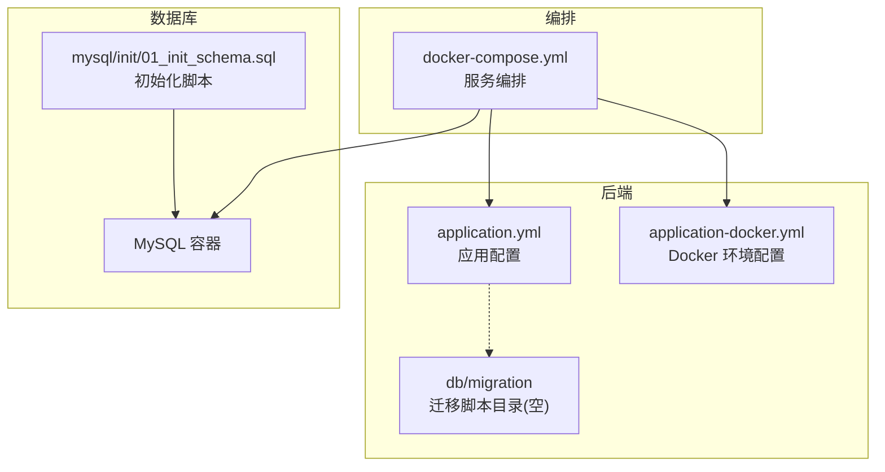
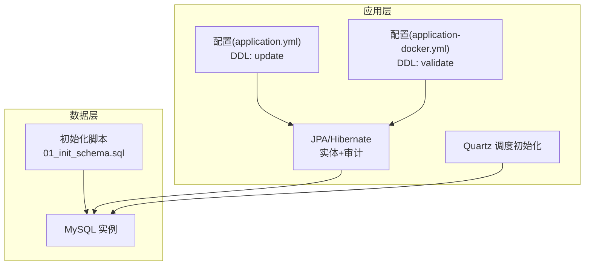
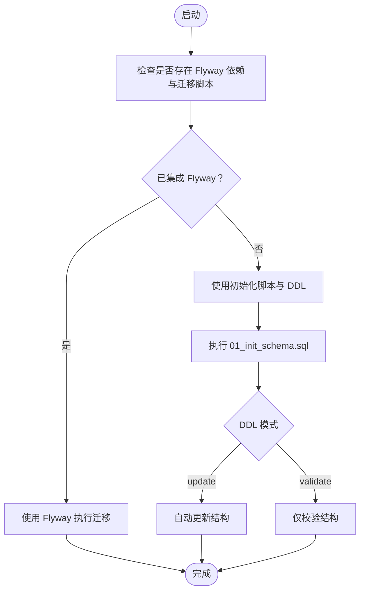
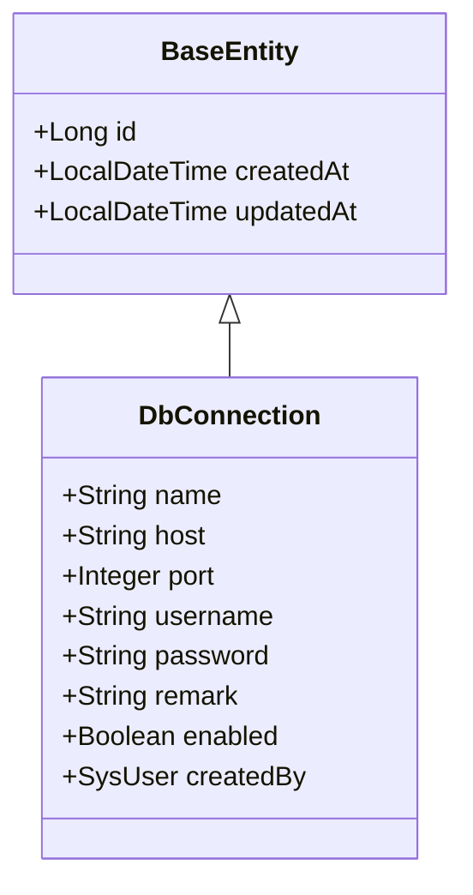
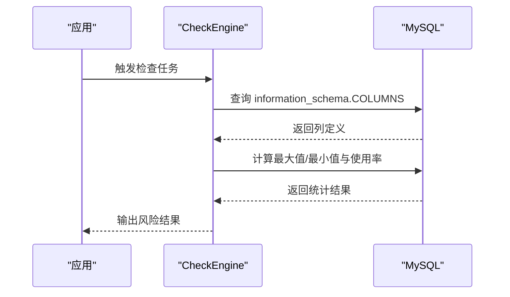
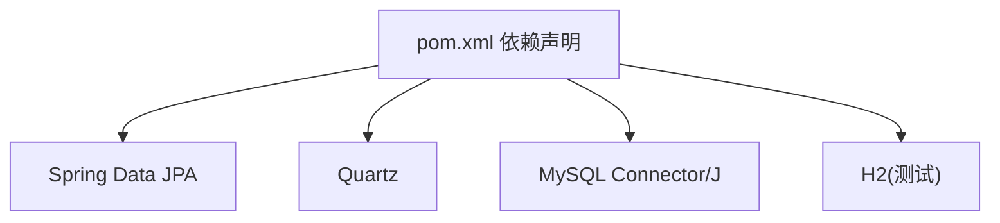

# 数据库迁移策略

<cite>
**本文引用的文件**
- [application.yml](file://backend/src/main/resources/application.yml)
- [application-docker.yml](file://backend/src/main/resources/application-docker.yml)
- [01_init_schema.sql](file://mysql/init/01_init_schema.sql)
- [docker-compose.yml](file://docker-compose.yml)
- [pom.xml](file://backend/pom.xml)
- [JpaConfig.java](file://backend/src/main/java/com/fieldcheck/config/JpaConfig.java)
- [BaseEntity.java](file://backend/src/main/java/com/fieldcheck/entity/BaseEntity.java)
- [DbConnection.java](file://backend/src/main/java/com/fieldcheck/entity/DbConnection.java)
- [CheckEngine.java](file://backend/src/main/java/com/fieldcheck/engine/CheckEngine.java)
</cite>

## 目录
1. [引言](#引言)
2. [项目结构](#项目结构)
3. [核心组件](#核心组件)
4. [架构总览](#架构总览)
5. [详细组件分析](#详细组件分析)
6. [依赖分析](#依赖分析)
7. [性能考虑](#性能考虑)
8. [故障排查指南](#故障排查指南)
9. [结论](#结论)
10. [附录](#附录)

## 引言
本文件面向数据库迁移策略，结合当前代码库现状，系统阐述数据库版本管理、迁移脚本组织方式、Flyway工具的使用与配置建议、命名规范与版本控制策略、编写规范与最佳实践、增量与全量迁移的区别与适用场景、迁移过程中的数据备份与回滚策略、生产环境迁移的安全措施与风险控制，以及迁移故障的排查与解决方案。需要特别说明的是：当前仓库未集成 Flyway 迁移框架，而是采用 Hibernate 的 DDL 自动建模能力与初始化 SQL 脚本进行数据库初始化。本文在“现状与问题”部分明确指出该差异，并在“迁移策略与实施建议”中提供基于 Flyway 的完整落地方案。

## 项目结构
- 后端资源目录包含数据库迁移脚本目录 db/migration（当前为空），以及应用配置文件 application.yml 和 application-docker.yml。
- MySQL 初始化脚本位于 mysql/init/01_init_schema.sql，用于首次部署时创建数据库与基础表结构。
- docker-compose.yml 定义了 MySQL 服务、后端服务与前端服务的编排，MySQL 挂载了初始化脚本目录以完成首次初始化。
- pom.xml 中声明了 Spring Data JPA、Quartz 等依赖，但未包含 Flyway 相关依赖。

**图示来源**
- [application.yml](file://backend/src/main/resources/application.yml#L1-L75)
- [application-docker.yml](file://backend/src/main/resources/application-docker.yml#L1-L46)
- [01_init_schema.sql](file://mysql/init/01_init_schema.sql#L1-L185)
- [docker-compose.yml](file://docker-compose.yml#L1-L91)

**章节来源**
- [application.yml](file://backend/src/main/resources/application.yml#L1-L75)
- [application-docker.yml](file://backend/src/main/resources/application-docker.yml#L1-L46)
- [01_init_schema.sql](file://mysql/init/01_init_schema.sql#L1-L185)
- [docker-compose.yml](file://docker-compose.yml#L1-L91)

## 核心组件
- 数据源与连接池配置：通过 application.yml 与 application-docker.yml 配置数据源 URL、用户名、密码与 HikariCP 参数；Docker 环境下使用环境变量注入。
- JPA/Hibernate 配置：启用审计注解、设置方言与 DDL 行为；开发环境使用 update，Docker 环境使用 validate。
- Quartz 初始化：通过 jdbc.initialize-schema 设置为 always，确保调度表初始化。
- 初始化脚本：01_init_schema.sql 完成数据库与基础表结构的创建，并插入默认管理员账户。
- 编排与运行：docker-compose.yml 将 MySQL 初始化脚本挂载到容器内，后端服务在健康检查通过后再启动。

**章节来源**
- [application.yml](file://backend/src/main/resources/application.yml#L8-L37)
- [application-docker.yml](file://backend/src/main/resources/application-docker.yml#L4-L26)
- [01_init_schema.sql](file://mysql/init/01_init_schema.sql#L1-L185)
- [docker-compose.yml](file://docker-compose.yml#L17-L21)

## 架构总览
当前架构采用“初始化 SQL + Hibernate DDL”的组合模式：
- 首次部署由 MySQL 初始化脚本创建数据库与表结构；
- 应用启动时根据配置决定是否自动更新或校验表结构；
- Quartz 调度表按需初始化；
- 运行期通过实体类与 JPA 注解驱动数据访问。

**图示来源**
- [application.yml](file://backend/src/main/resources/application.yml#L24-L37)
- [application-docker.yml](file://backend/src/main/resources/application-docker.yml#L16-L22)
- [01_init_schema.sql](file://mysql/init/01_init_schema.sql#L1-L185)

## 详细组件分析

### 当前迁移现状与问题
- 未集成 Flyway：pom.xml 中未发现 Flyway 依赖，db/migration 目录为空，表明未采用 Flyway 的版本化迁移机制。
- 初始化方式：通过 01_init_schema.sql 在首次启动时创建数据库与表结构。
- DDL 行为：开发环境使用 update，Docker 环境使用 validate，二者对结构变更的处理方式不同，存在不一致风险。
- Quartz 初始化：通过 jdbc.initialize-schema: always 确保调度表可用，但未纳入 Flyway 版本管理。

**图示来源**
- [pom.xml](file://backend/pom.xml#L28-L142)
- [application.yml](file://backend/src/main/resources/application.yml#L24-L37)
- [application-docker.yml](file://backend/src/main/resources/application-docker.yml#L16-L22)
- [01_init_schema.sql](file://mysql/init/01_init_schema.sql#L1-L185)

**章节来源**
- [pom.xml](file://backend/pom.xml#L28-L142)
- [application.yml](file://backend/src/main/resources/application.yml#L24-L37)
- [application-docker.yml](file://backend/src/main/resources/application-docker.yml#L16-L22)
- [01_init_schema.sql](file://mysql/init/01_init_schema.sql#L1-L185)

### 迁移策略与实施建议（基于 Flyway 的完整方案）
为统一版本管理、提升可追溯性与安全性，建议引入 Flyway 并制定如下策略：

- 工具选择与配置
  - 引入 Flyway 依赖并在 pom.xml 中声明。
  - 在 application.yml 中配置 flyway.url、flyway.user、flyway.password、flyway.locations 等参数，指定迁移脚本位置为 db/migration。
  - 保持 db/migration 目录结构清晰，按版本号顺序命名脚本。

- 命名规范与版本控制
  - 使用 V<版本号>__<描述>.sql 的命名格式，如 V1__init.sql、V1_1__add_indexes.sql。
  - 采用语义化版本号，主版本号与应用大版本对齐，子版本号用于数据库结构变更。
  - 将迁移脚本纳入 Git 管理，每次提交对应一次版本升级。

- 迁移脚本编写规范
  - 只做幂等操作：重复执行不应产生副作用；使用 IF NOT EXISTS、IF EXISTS 等条件判断。
  - 明确事务边界：每个脚本独立事务，避免长事务阻塞。
  - 清晰注释：说明变更目的、影响范围与回滚要点。
  - 分离结构与数据：结构变更（DDL）与数据变更（DML）分脚本执行，便于回滚与追踪。

- 增量迁移与全量迁移
  - 增量迁移：适用于日常小规模结构变更，脚本短小、执行快、风险低，适合频繁发布。
  - 全量迁移：适用于重大架构调整或历史脚本清理，需严格测试与演练，谨慎上线。
  - 适用场景：常规维护走增量，重构或重构历史遗留走全量。

- 备份与回滚策略
  - 上线前：执行逻辑备份（mysqldump 或物理备份），记录当前版本号。
  - 回滚：若失败，先恢复备份，再回退到上一版本迁移脚本；确保回滚脚本与升级脚本一一对应。
  - 验证：回滚后验证业务功能与数据完整性。

- 生产环境安全与风险控制
  - 只读窗口：在业务低峰期执行迁移，缩短停机时间。
  - 权限最小化：仅授予 Flyway 所需权限，避免过度授权。
  - 审计日志：开启数据库审计与应用日志，记录迁移全过程。
  - 多级验证：本地测试 → 预发布验证 → 小范围灰度 → 全量上线。

- 故障排查与解决方案
  - 常见问题：迁移失败、版本不匹配、死锁与超时。
  - 排查步骤：查看 Flyway 历史表与日志；确认脚本幂等性；检查锁等待与资源瓶颈。
  - 解决方案：修复脚本错误后重试；必要时手动干预并补充回滚脚本。

（本节为基于 Flyway 的策略设计，不直接分析具体源码文件）

### 数据模型与实体映射
实体类通过 JPA 注解映射到数据库表，配合审计注解自动生成创建与更新时间戳。例如 DbConnection 实体映射到 db_connection 表，BaseEntity 提供通用审计字段。

**图示来源**
- [BaseEntity.java](file://backend/src/main/java/com/fieldcheck/entity/BaseEntity.java#L14-L26)
- [DbConnection.java](file://backend/src/main/java/com/fieldcheck/entity/DbConnection.java#L18-L45)

**章节来源**
- [BaseEntity.java](file://backend/src/main/java/com/fieldcheck/entity/BaseEntity.java#L1-L28)
- [DbConnection.java](file://backend/src/main/java/com/fieldcheck/entity/DbConnection.java#L1-L46)

### 数据访问与信息架构查询
CheckEngine 中通过 JDBC 查询 information_schema 获取列信息与数值范围，用于风险评估计算。该流程展示了应用如何直接访问系统表以完成业务逻辑。

**图示来源**
- [CheckEngine.java](file://backend/src/main/java/com/fieldcheck/engine/CheckEngine.java#L193-L290)

**章节来源**
- [CheckEngine.java](file://backend/src/main/java/com/fieldcheck/engine/CheckEngine.java#L193-L290)

## 依赖分析
- 运行时依赖：Spring Data JPA、Quartz、MySQL Connector/J、H2（测试）等。
- 迁移工具依赖：Flyway（建议新增）。
- 配置依赖：application.yml 与 application-docker.yml 决定数据源、DDL 行为与日志级别。

**图示来源**
- [pom.xml](file://backend/pom.xml#L28-L142)

**章节来源**
- [pom.xml](file://backend/pom.xml#L28-L142)

## 性能考虑
- 连接池参数：合理设置最大连接数、空闲超时与连接生命周期，避免资源浪费与抖动。
- DDL 行为：开发环境 update 便于迭代，生产环境 validate 更安全；避免频繁结构变更导致锁表。
- Quartz 初始化：always 会创建调度表，注意与 Flyway 协调，避免重复初始化。
- 信息架构查询：CheckEngine 对 information_schema 的查询应避免全库扫描，必要时加索引与限制条件。

（本节为通用性能建议，不直接分析具体源码文件）

## 故障排查指南
- 迁移失败
  - 症状：Flyway 报错、版本不匹配。
  - 排查：检查迁移脚本幂等性、语法与依赖；核对目标数据库版本。
  - 解决：修复脚本后重试；必要时手动回滚并补充回退脚本。
- DDL 不一致
  - 症状：开发与生产环境结构差异。
  - 排查：对比 application.yml 的 ddl-auto 配置；确认是否使用 Flyway 统一管理。
  - 解决：统一为 Flyway 管理，或在各环境保持一致的 DDL 行为。
- Quartz 初始化异常
  - 症状：调度表缺失或初始化失败。
  - 排查：确认 jdbc.initialize-schema 配置与数据库权限。
  - 解决：修正配置或手动创建调度表，后续纳入 Flyway 管理。

（本节为通用故障排查建议，不直接分析具体源码文件）

## 结论
当前代码库采用初始化 SQL 与 Hibernate DDL 的组合方式进行数据库初始化与结构管理，未集成 Flyway。为提升迁移的可控性、可追溯性与安全性，建议引入 Flyway，建立完善的命名规范、版本控制策略、编写规范与回滚备份机制，并在生产环境严格执行安全与风险控制措施。通过 Flyway 的版本化迁移，可有效降低结构变更风险，保障系统稳定演进。

## 附录
- 初始化脚本路径：mysql/init/01_init_schema.sql
- 应用配置路径：backend/src/main/resources/application.yml、application-docker.yml
- 迁移脚本目录：backend/src/main/resources/db/migration（建议新增）
- 编排文件：docker-compose.yml

**章节来源**
- [01_init_schema.sql](file://mysql/init/01_init_schema.sql#L1-L185)
- [application.yml](file://backend/src/main/resources/application.yml#L1-L75)
- [application-docker.yml](file://backend/src/main/resources/application-docker.yml#L1-L46)
- [docker-compose.yml](file://docker-compose.yml#L1-L91)