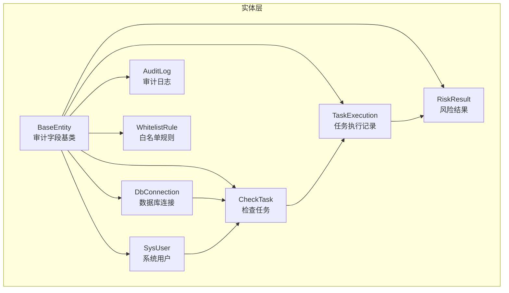
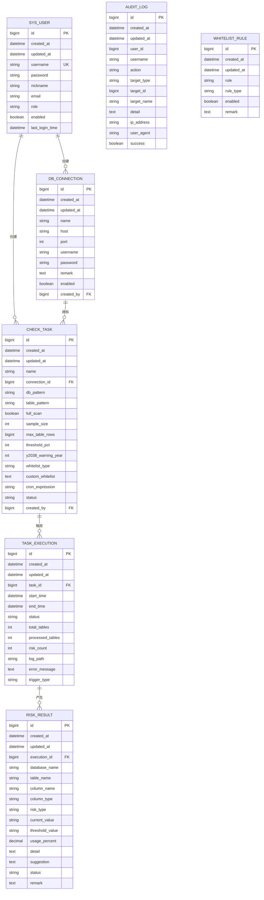
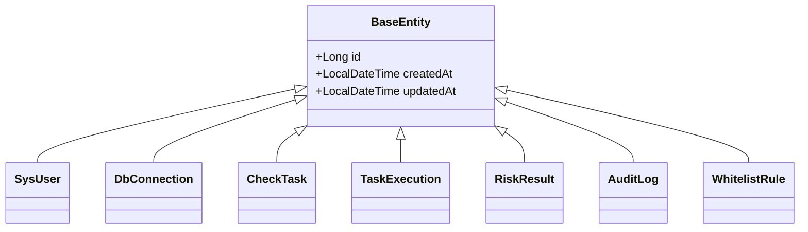
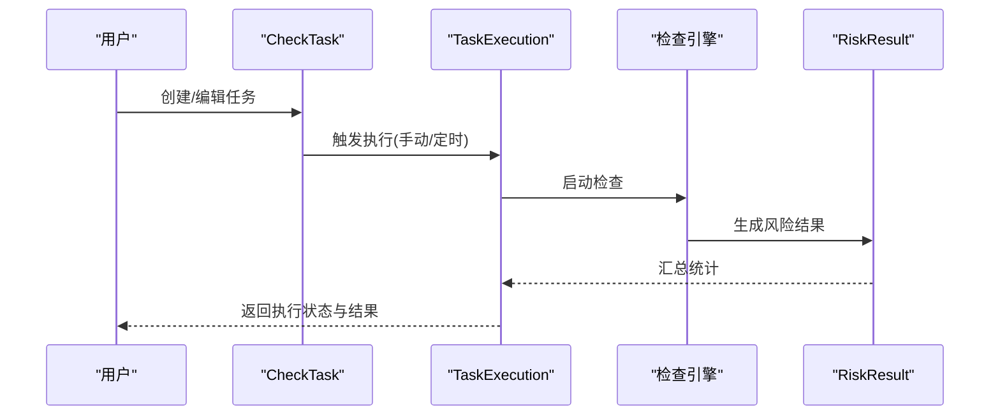
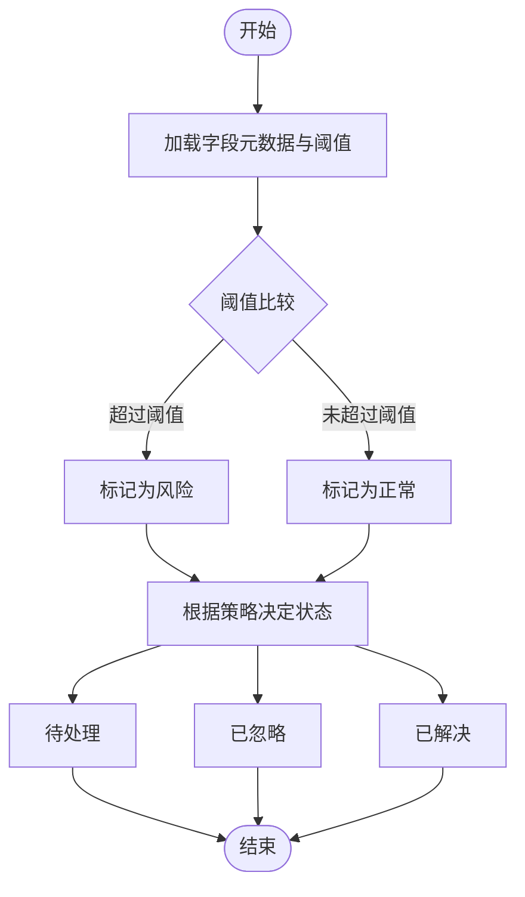
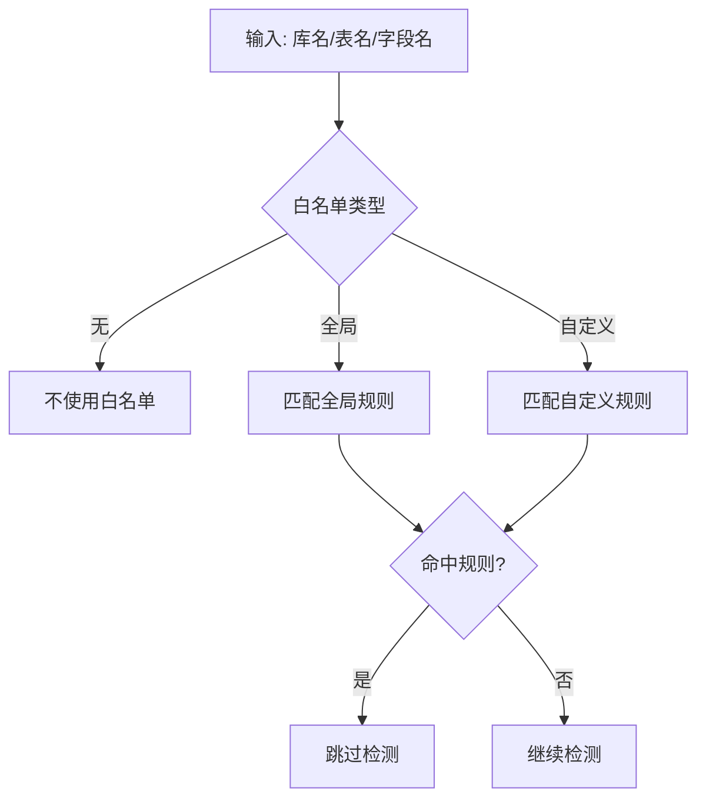
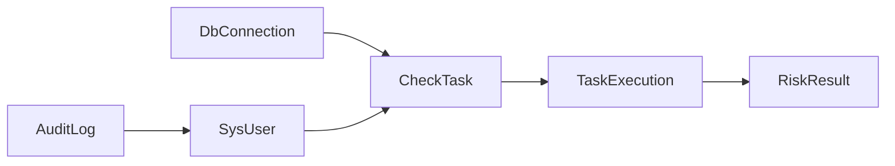

# 数据模型解释

<cite>
**本文引用的文件**
- [BaseEntity.java](file://backend/src/main/java/com/fieldcheck/entity/BaseEntity.java)
- [SysUser.java](file://backend/src/main/java/com/fieldcheck/entity/SysUser.java)
- [DbConnection.java](file://backend/src/main/java/com/fieldcheck/entity/DbConnection.java)
- [CheckTask.java](file://backend/src/main/java/com/fieldcheck/entity/CheckTask.java)
- [TaskExecution.java](file://backend/src/main/java/com/fieldcheck/entity/TaskExecution.java)
- [RiskResult.java](file://backend/src/main/java/com/fieldcheck/entity/RiskResult.java)
- [AuditLog.java](file://backend/src/main/java/com/fieldcheck/entity/AuditLog.java)
- [WhitelistRule.java](file://backend/src/main/java/com/fieldcheck/entity/WhitelistRule.java)
- [UserRole.java](file://backend/src/main/java/com/fieldcheck/entity/UserRole.java)
- [TaskStatus.java](file://backend/src/main/java/com/fieldcheck/entity/TaskStatus.java)
- [ExecutionStatus.java](file://backend/src/main/java/com/fieldcheck/entity/ExecutionStatus.java)
- [RiskType.java](file://backend/src/main/java/com/fieldcheck/entity/RiskType.java)
- [RiskStatus.java](file://backend/src/main/java/com/fieldcheck/entity/RiskStatus.java)
- [WhitelistType.java](file://backend/src/main/java/com/fieldcheck/entity/WhitelistType.java)
- [WhitelistRuleType.java](file://backend/src/main/java/com/fieldcheck/entity/WhitelistRuleType.java)
- [AlertType.java](file://backend/src/main/java/com/fieldcheck/entity/AlertType.java)
</cite>

## 目录
1. [引言](#引言)
2. [项目结构](#项目结构)
3. [核心组件](#核心组件)
4. [架构总览](#架构总览)
5. [详细组件分析](#详细组件分析)
6. [依赖分析](#依赖分析)
7. [性能考虑](#性能考虑)
8. [故障排查指南](#故障排查指南)
9. [结论](#结论)
10. [附录](#附录)

## 引言
本文件系统化阐述 MySQL 风险字段检查系统的核心数据模型，覆盖实体设计思路、业务含义、与业务流程的映射关系、演进与设计决策、扩展性与未来规划、使用示例与最佳实践，以及在系统架构中的作用与影响。目标是帮助开发者与产品人员快速理解“模型—流程—实现”的闭环。

## 项目结构
后端采用分层架构（实体/仓库/服务/控制器），数据模型集中在 entity 包中，通过 JPA 映射到数据库表。公共审计字段由基类统一提供，各实体按需扩展。

图表来源
- [BaseEntity.java](file://backend/src/main/java/com/fieldcheck/entity/BaseEntity.java#L1-L28)
- [SysUser.java](file://backend/src/main/java/com/fieldcheck/entity/SysUser.java#L1-L44)
- [DbConnection.java](file://backend/src/main/java/com/fieldcheck/entity/DbConnection.java#L1-L47)
- [CheckTask.java](file://backend/src/main/java/com/fieldcheck/entity/CheckTask.java#L1-L75)
- [TaskExecution.java](file://backend/src/main/java/com/fieldcheck/entity/TaskExecution.java#L1-L58)
- [RiskResult.java](file://backend/src/main/java/com/fieldcheck/entity/RiskResult.java#L1-L68)
- [AuditLog.java](file://backend/src/main/java/com/fieldcheck/entity/AuditLog.java#L1-L54)
- [WhitelistRule.java](file://backend/src/main/java/com/fieldcheck/entity/WhitelistRule.java#L1-L34)

章节来源
- [BaseEntity.java](file://backend/src/main/java/com/fieldcheck/entity/BaseEntity.java#L1-L28)
- [SysUser.java](file://backend/src/main/java/com/fieldcheck/entity/SysUser.java#L1-L44)
- [DbConnection.java](file://backend/src/main/java/com/fieldcheck/entity/DbConnection.java#L1-L47)
- [CheckTask.java](file://backend/src/main/java/com/fieldcheck/entity/CheckTask.java#L1-L75)
- [TaskExecution.java](file://backend/src/main/java/com/fieldcheck/entity/TaskExecution.java#L1-L58)
- [RiskResult.java](file://backend/src/main/java/com/fieldcheck/entity/RiskResult.java#L1-L68)
- [AuditLog.java](file://backend/src/main/java/com/fieldcheck/entity/AuditLog.java#L1-L54)
- [WhitelistRule.java](file://backend/src/main/java/com/fieldcheck/entity/WhitelistRule.java#L1-L34)

## 核心组件
本节从“业务需求—数据模型—关键字段”三个维度梳理核心实体，解释其设计动机与约束。

- 系统用户（SysUser）
  - 业务含义：平台使用者，区分角色（管理员/普通用户/只读用户），支持启用/禁用与登录时间追踪。
  - 关键字段：用户名（唯一）、密码、昵称、邮箱、角色、启用状态、最近登录时间。
  - 设计要点：继承审计基类，确保创建/更新时间自动维护；角色使用字符串枚举以利于迁移与扩展。

- 数据库连接（DbConnection）
  - 业务含义：被检查的目标数据库连接配置，支持加密存储敏感信息。
  - 关键字段：名称、主机、端口、用户名、密码（AES 加密）、备注、启用状态、创建人。
  - 设计要点：密码字段采用加密存储策略；外键关联创建者；默认端口为标准 MySQL 端口。

- 检查任务（CheckTask）
  - 业务含义：定义一次检查的策略与范围，支持正则匹配、抽样、阈值、白名单策略与定时调度。
  - 关键字段：名称、所属连接、数据库/表匹配模式（正则）、是否全表扫描、抽样量、大表阈值、风险阈值百分比、Y2038 告警年份、白名单类型（全局/自定义/无）、自定义白名单内容、Cron 表达式、状态、创建人。
  - 设计要点：多处默认值保障开箱即用；枚举化状态与白名单类型提升一致性；外键关联连接与创建人。

- 任务执行（TaskExecution）
  - 业务含义：一次具体执行实例，记录开始/结束时间、进度、错误信息与触发方式。
  - 关键字段：所属任务、开始/结束时间、状态（待执行/执行中/成功/失败/已停止）、总表数、已处理表数、风险数量、日志路径、错误信息、触发类型（手动/定时）。
  - 设计要点：状态机驱动执行生命周期；进度指标便于前端展示与监控。

- 风险结果（RiskResult）
  - 业务含义：单个字段级风险检测结果，承载风险类型、阈值、使用率、建议与处理状态。
  - 关键字段：所属执行、数据库/表/字段名、列类型、风险类型、当前值、阈值、使用率、详情、建议、状态（待处理/已忽略/已解决）、备注。
  - 设计要点：建立多维索引支撑查询与统计；文本字段用于富信息输出；使用率采用高精度数值类型。

- 审计日志（AuditLog）
  - 业务含义：记录用户行为轨迹，便于合规与排障。
  - 关键字段：用户标识与名称、操作动作、目标类型/ID/名称、IP 地址、User-Agent、详情、成功与否。
  - 设计要点：索引覆盖用户与动作，便于审计检索。

- 白名单规则（WhitelistRule）
  - 业务含义：对特定数据库/表/字段的豁免规则，支持启用与备注。
  - 关键字段：规则表达式、规则类型（库/表/字段）、启用状态、备注。
  - 设计要点：规则表达式支持灵活匹配；类型枚举化保证一致性。

章节来源
- [SysUser.java](file://backend/src/main/java/com/fieldcheck/entity/SysUser.java#L1-L44)
- [DbConnection.java](file://backend/src/main/java/com/fieldcheck/entity/DbConnection.java#L1-L47)
- [CheckTask.java](file://backend/src/main/java/com/fieldcheck/entity/CheckTask.java#L1-L75)
- [TaskExecution.java](file://backend/src/main/java/com/fieldcheck/entity/TaskExecution.java#L1-L58)
- [RiskResult.java](file://backend/src/main/java/com/fieldcheck/entity/RiskResult.java#L1-L68)
- [AuditLog.java](file://backend/src/main/java/com/fieldcheck/entity/AuditLog.java#L1-L54)
- [WhitelistRule.java](file://backend/src/main/java/com/fieldcheck/entity/WhitelistRule.java#L1-L34)

## 架构总览
数据模型在系统中的作用：
- 作为业务事实的权威来源，贯穿“任务编排—执行—检测—结果—审计”的全链路。
- 通过枚举与默认值降低业务歧义，提升跨模块一致性。
- 通过索引与字段类型选择平衡查询性能与存储成本。

图表来源
- [SysUser.java](file://backend/src/main/java/com/fieldcheck/entity/SysUser.java#L1-L44)
- [DbConnection.java](file://backend/src/main/java/com/fieldcheck/entity/DbConnection.java#L1-L47)
- [CheckTask.java](file://backend/src/main/java/com/fieldcheck/entity/CheckTask.java#L1-L75)
- [TaskExecution.java](file://backend/src/main/java/com/fieldcheck/entity/TaskExecution.java#L1-L58)
- [RiskResult.java](file://backend/src/main/java/com/fieldcheck/entity/RiskResult.java#L1-L68)
- [AuditLog.java](file://backend/src/main/java/com/fieldcheck/entity/AuditLog.java#L1-L54)
- [WhitelistRule.java](file://backend/src/main/java/com/fieldcheck/entity/WhitelistRule.java#L1-L34)

## 详细组件分析

### 类层次与继承关系
- BaseEntity 提供统一的主键与审计字段（创建/更新时间），所有实体均继承该基类，减少重复代码并统一审计能力。
- 具体实体通过注解声明表名、索引与字段约束，形成清晰的领域模型。

图表来源
- [BaseEntity.java](file://backend/src/main/java/com/fieldcheck/entity/BaseEntity.java#L1-L28)
- [SysUser.java](file://backend/src/main/java/com/fieldcheck/entity/SysUser.java#L1-L44)
- [DbConnection.java](file://backend/src/main/java/com/fieldcheck/entity/DbConnection.java#L1-L47)
- [CheckTask.java](file://backend/src/main/java/com/fieldcheck/entity/CheckTask.java#L1-L75)
- [TaskExecution.java](file://backend/src/main/java/com/fieldcheck/entity/TaskExecution.java#L1-L58)
- [RiskResult.java](file://backend/src/main/java/com/fieldcheck/entity/RiskResult.java#L1-L68)
- [AuditLog.java](file://backend/src/main/java/com/fieldcheck/entity/AuditLog.java#L1-L54)
- [WhitelistRule.java](file://backend/src/main/java/com/fieldcheck/entity/WhitelistRule.java#L1-L34)

章节来源
- [BaseEntity.java](file://backend/src/main/java/com/fieldcheck/entity/BaseEntity.java#L1-L28)
- [SysUser.java](file://backend/src/main/java/com/fieldcheck/entity/SysUser.java#L1-L44)
- [DbConnection.java](file://backend/src/main/java/com/fieldcheck/entity/DbConnection.java#L1-L47)
- [CheckTask.java](file://backend/src/main/java/com/fieldcheck/entity/CheckTask.java#L1-L75)
- [TaskExecution.java](file://backend/src/main/java/com/fieldcheck/entity/TaskExecution.java#L1-L58)
- [RiskResult.java](file://backend/src/main/java/com/fieldcheck/entity/RiskResult.java#L1-L68)
- [AuditLog.java](file://backend/src/main/java/com/fieldcheck/entity/AuditLog.java#L1-L54)
- [WhitelistRule.java](file://backend/src/main/java/com/fieldcheck/entity/WhitelistRule.java#L1-L34)

### 任务执行流程时序
从任务创建到执行再到风险结果产出的关键步骤如下：

图表来源
- [CheckTask.java](file://backend/src/main/java/com/fieldcheck/entity/CheckTask.java#L1-L75)
- [TaskExecution.java](file://backend/src/main/java/com/fieldcheck/entity/TaskExecution.java#L1-L58)
- [RiskResult.java](file://backend/src/main/java/com/fieldcheck/entity/RiskResult.java#L1-L68)

章节来源
- [CheckTask.java](file://backend/src/main/java/com/fieldcheck/entity/CheckTask.java#L1-L75)
- [TaskExecution.java](file://backend/src/main/java/com/fieldcheck/entity/TaskExecution.java#L1-L58)
- [RiskResult.java](file://backend/src/main/java/com/fieldcheck/entity/RiskResult.java#L1-L68)

### 风险结果判定流程
风险结果的判定与状态流转如下：

图表来源
- [RiskResult.java](file://backend/src/main/java/com/fieldcheck/entity/RiskResult.java#L1-L68)
- [RiskType.java](file://backend/src/main/java/com/fieldcheck/entity/RiskType.java#L1-L11)
- [RiskStatus.java](file://backend/src/main/java/com/fieldcheck/entity/RiskStatus.java#L1-L8)

章节来源
- [RiskResult.java](file://backend/src/main/java/com/fieldcheck/entity/RiskResult.java#L1-L68)
- [RiskType.java](file://backend/src/main/java/com/fieldcheck/entity/RiskType.java#L1-L11)
- [RiskStatus.java](file://backend/src/main/java/com/fieldcheck/entity/RiskStatus.java#L1-L8)

### 白名单匹配策略
白名单规则支持库/表/字段三个层级，结合任务的白名单类型决定是否跳过检测：

图表来源
- [CheckTask.java](file://backend/src/main/java/com/fieldcheck/entity/CheckTask.java#L1-L75)
- [WhitelistRule.java](file://backend/src/main/java/com/fieldcheck/entity/WhitelistRule.java#L1-L34)
- [WhitelistType.java](file://backend/src/main/java/com/fieldcheck/entity/WhitelistType.java#L1-L8)
- [WhitelistRuleType.java](file://backend/src/main/java/com/fieldcheck/entity/WhitelistRuleType.java#L1-L8)

章节来源
- [CheckTask.java](file://backend/src/main/java/com/fieldcheck/entity/CheckTask.java#L1-L75)
- [WhitelistRule.java](file://backend/src/main/java/com/fieldcheck/entity/WhitelistRule.java#L1-L34)
- [WhitelistType.java](file://backend/src/main/java/com/fieldcheck/entity/WhitelistType.java#L1-L8)
- [WhitelistRuleType.java](file://backend/src/main/java/com/fieldcheck/entity/WhitelistRuleType.java#L1-L8)

## 依赖分析
- 实体间外键关系
  - DbConnection → CheckTask（一对多）
  - SysUser → CheckTask（一对多，创建人）
  - CheckTask → TaskExecution（一对多）
  - TaskExecution → RiskResult（一对多）

- 枚举与默认值
  - 通过枚举统一状态与类型，避免魔法字符串带来的歧义。
  - 大量字段提供默认值，降低配置复杂度，提升可用性。

- 索引与查询优化
  - RiskResult 与 AuditLog 建立常用查询维度索引，支撑报表与审计场景。
  - CheckTask 的正则字段与阈值字段常用于筛选，建议在业务层配合缓存或物化视图进一步优化。

图表来源
- [DbConnection.java](file://backend/src/main/java/com/fieldcheck/entity/DbConnection.java#L1-L47)
- [CheckTask.java](file://backend/src/main/java/com/fieldcheck/entity/CheckTask.java#L1-L75)
- [TaskExecution.java](file://backend/src/main/java/com/fieldcheck/entity/TaskExecution.java#L1-L58)
- [RiskResult.java](file://backend/src/main/java/com/fieldcheck/entity/RiskResult.java#L1-L68)
- [AuditLog.java](file://backend/src/main/java/com/fieldcheck/entity/AuditLog.java#L1-L54)

章节来源
- [DbConnection.java](file://backend/src/main/java/com/fieldcheck/entity/DbConnection.java#L1-L47)
- [CheckTask.java](file://backend/src/main/java/com/fieldcheck/entity/CheckTask.java#L1-L75)
- [TaskExecution.java](file://backend/src/main/java/com/fieldcheck/entity/TaskExecution.java#L1-L58)
- [RiskResult.java](file://backend/src/main/java/com/fieldcheck/entity/RiskResult.java#L1-L68)
- [AuditLog.java](file://backend/src/main/java/com/fieldcheck/entity/AuditLog.java#L1-L54)

## 性能考虑
- 查询热点
  - 风险结果与审计日志的高频查询可通过索引与分页优化。
  - 任务执行进度与状态变更频繁，建议在应用层增加缓存与批量写入。
- 写入压力
  - 风险结果体量较大，建议按天分区或归档历史数据。
- 存储安全
  - 密码字段采用加密存储，避免明文泄露风险。
- 计算与阈值
  - 阈值计算尽量在入库前完成，减少重复计算；对正则匹配等高成本操作进行缓存。

## 故障排查指南
- 执行失败定位
  - 查看任务执行记录的错误信息与日志路径，结合风险结果的明细字段定位具体字段。
- 权限与白名单
  - 若出现误报/漏报，检查任务白名单类型与规则是否正确配置。
- 审计追踪
  - 通过审计日志的用户、动作、目标信息回溯问题发生的时间线与责任人。

章节来源
- [TaskExecution.java](file://backend/src/main/java/com/fieldcheck/entity/TaskExecution.java#L1-L58)
- [RiskResult.java](file://backend/src/main/java/com/fieldcheck/entity/RiskResult.java#L1-L68)
- [AuditLog.java](file://backend/src/main/java/com/fieldcheck/entity/AuditLog.java#L1-L54)
- [WhitelistRule.java](file://backend/src/main/java/com/fieldcheck/entity/WhitelistRule.java#L1-L34)

## 结论
本数据模型以“可配置、可审计、可扩展”为核心设计原则，通过统一的审计基类、枚举化的状态与类型、合理的索引与默认值，有效支撑了从任务编排到风险检测再到结果治理的完整业务闭环。未来可在以下方面持续演进：
- 引入物化视图与缓存，优化高频报表与审计查询。
- 增强白名单规则的表达能力（如支持更复杂的匹配条件）。
- 扩展风险类型的细粒度分类与自动化建议生成。

## 附录
- 使用示例与最佳实践
  - 任务配置：优先设置合理的阈值与抽样量，避免全表扫描；必要时开启定时任务。
  - 风险处理：建立“待处理—已忽略—已解决”的闭环流程，定期复盘。
  - 审计与合规：保留完整的审计日志，定期导出与归档。
  - 安全：严格管理数据库连接凭证，启用加密传输与访问控制。
- 与业务流程的对应关系
  - 用户管理：SysUser 支撑权限体系与登录审计。
  - 连接管理：DbConnection 支撑多租户与多环境接入。
  - 任务编排：CheckTask 定义检查策略，TaskExecution 承载执行生命周期。
  - 风险治理：RiskResult 产出风险清单，AuditLog 提供审计证据。
  - 合规与白名单：WhitelistRule 与任务白名单类型共同实现合规豁免。