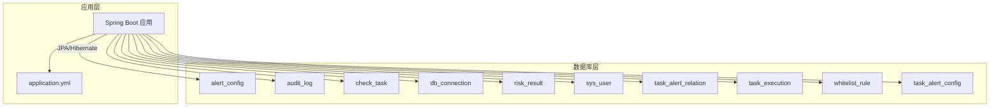
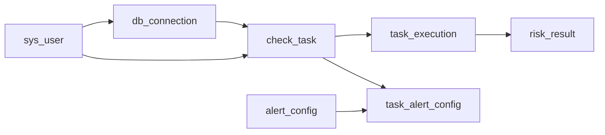

# 索引和约束设计

<cite>
**本文引用的文件**
- [01_init_schema.sql](file://mysql/init/01_init_schema.sql)
- [BaseEntity.java](file://backend/src/main/java/com/fieldcheck/entity/BaseEntity.java)
- [SysUser.java](file://backend/src/main/java/com/fieldcheck/entity/SysUser.java)
- [CheckTask.java](file://backend/src/main/java/com/fieldcheck/entity/CheckTask.java)
- [RiskResult.java](file://backend/src/main/java/com/fieldcheck/entity/RiskResult.java)
- [TaskExecution.java](file://backend/src/main/java/com/fieldcheck/entity/TaskExecution.java)
- [DbConnection.java](file://backend/src/main/java/com/fieldcheck/entity/DbConnection.java)
- [AuditLog.java](file://backend/src/main/java/com/fieldcheck/entity/AuditLog.java)
- [WhitelistRule.java](file://backend/src/main/java/com/fieldcheck/entity/WhitelistRule.java)
- [TaskAlertConfig.java](file://backend/src/main/java/com/fieldcheck/entity/TaskAlertConfig.java)
- [application.yml](file://backend/src/main/resources/application.yml)
</cite>

## 目录
1. [简介](#简介)
2. [项目结构](#项目结构)
3. [核心组件](#核心组件)
4. [架构总览](#架构总览)
5. [详细组件分析](#详细组件分析)
6. [依赖关系分析](#依赖关系分析)
7. [性能考量](#性能考量)
8. [故障排查指南](#故障排查指南)
9. [结论](#结论)
10. [附录](#附录)

## 简介
本文件面向数据库索引与约束设计，结合后端实体模型与初始化脚本，系统性梳理各表的主键、唯一约束、外键约束与索引设计，并给出复合索引设计原则、查询模式下的索引选择策略、性能优化建议、维护与重建策略以及最佳实践。目标是帮助开发者在保证数据完整性的同时，提升查询与写入性能。

## 项目结构
本项目采用前后端分离架构，数据库初始化脚本位于 mysql/init/01_init_schema.sql；后端通过 JPA 实体映射数据库表，部分表通过注解声明索引，其余通过 SQL 脚本显式创建索引与约束。应用配置文件中包含数据库连接与 JPA 相关设置。



图表来源
- [01_init_schema.sql](file://mysql/init/01_init_schema.sql#L1-L185)
- [application.yml](file://backend/src/main/resources/application.yml#L1-L75)

章节来源
- [01_init_schema.sql](file://mysql/init/01_init_schema.sql#L1-L185)
- [application.yml](file://backend/src/main/resources/application.yml#L1-L75)

## 核心组件
本节从“主键/唯一/外键/索引”的角度，逐表说明设计要点与选择理由。

- sys_user
  - 主键：id（自增）
  - 唯一约束：username（数据库唯一索引）
  - 设计说明：用户名全局唯一，支撑登录与鉴权流程；唯一索引可避免重复注册与并发冲突。
  - 性能考虑：唯一性校验在插入/更新时进行，建议配合业务层去重策略减少冲突概率。

- db_connection
  - 主键：id（自增）
  - 外键：created_by → sys_user(id)
  - 索引：FK9u2g9g4u2a18bytvr5uqvrk1f（created_by）
  - 设计说明：记录数据库连接信息，支持按创建人归档与审计；外键确保删除用户时连接数据的完整性。
  - 性能考虑：按创建人检索连接列表时可利用索引；若存在频繁的连接名/主机查询，可评估增加相应索引。

- check_task
  - 主键：id（自增）
  - 外键：connection_id → db_connection(id)；created_by → sys_user(id)
  - 索引：FK727fkha23y8hxldc1j88plr3y（connection_id）；FK1qa5mh5ctajx8pj4me4b46i56（created_by）
  - 设计说明：任务与连接、创建人强关联；外键保障级联一致性。
  - 性能考虑：按连接或创建人筛选任务时可利用索引；若任务状态/名称等字段高频过滤，可考虑新增索引。

- task_execution
  - 主键：id（自增）
  - 外键：task_id → check_task(id)
  - 索引：FK38vsmv8w996if4sdk6m5rff9e（task_id）
  - 设计说明：执行记录与任务关联，便于按任务查询执行历史。
  - 性能考虑：按任务ID查询执行记录时高效；若需按状态、时间范围查询，可评估增加复合索引。

- risk_result
  - 主键：id（自增）
  - 外键：execution_id → task_execution(id)
  - 索引：idx_execution_id（execution_id）、idx_risk_type（risk_type）、idx_status（status）
  - 设计说明：风险结果按执行批次组织，三类常用过滤条件均建立单列索引。
  - 性能考虑：按执行ID聚合统计、按风险类型/状态筛选时效率高；若存在“执行+状态”等高频组合查询，可考虑复合索引。

- audit_log
  - 主键：id（自增）
  - 索引：idx_user_id（user_id）、idx_action（action）
  - 设计说明：审计日志体量大，按用户与动作类型查询较为常见。
  - 性能考虑：建议按访问模式评估是否需要复合索引（如 user_id+action 或时间区间），以降低回表成本。

- whitelist_rule
  - 主键：id（自增）
  - 设计说明：白名单规则表，当前无外键与额外索引。
  - 性能考虑：若规则匹配查询频繁，可基于规则字符串前缀或规则类型建立索引。

- task_alert_config
  - 主键：id（自增）
  - 唯一约束：uk_task_alert(task_id, alert_config_id)
  - 外键：task_id → check_task(id)；alert_config_id → alert_config(id)
  - 索引：idx_alert_config_id（alert_config_id）
  - 设计说明：任务-告警配置的多对多关联，唯一联合键防止重复绑定；外键保障级联删除。
  - 性能考虑：按告警配置ID反查任务时可利用索引；若存在“任务+告警配置”双向查询，可评估复合索引。

- alert_config
  - 主键：id（自增）
  - 设计说明：告警配置表，当前无外键与额外索引。
  - 性能考虑：若存在按类型/启用状态/名称等过滤，可考虑相应索引。

章节来源
- [01_init_schema.sql](file://mysql/init/01_init_schema.sql#L11-L180)
- [SysUser.java](file://backend/src/main/java/com/fieldcheck/entity/SysUser.java#L21-L22)
- [CheckTask.java](file://backend/src/main/java/com/fieldcheck/entity/CheckTask.java#L25-L27)
- [TaskExecution.java](file://backend/src/main/java/com/fieldcheck/entity/TaskExecution.java#L21-L23)
- [RiskResult.java](file://backend/src/main/java/com/fieldcheck/entity/RiskResult.java#L17-L21)
- [AuditLog.java](file://backend/src/main/java/com/fieldcheck/entity/AuditLog.java#L16-L19)
- [TaskAlertConfig.java](file://backend/src/main/java/com/fieldcheck/entity/TaskAlertConfig.java#L21-L27)

## 架构总览
下图展示实体与表之间的关系，以及索引与约束的分布。

```mermaid
erDiagram
SYS_USER {
bigint id PK
string username UK
}
DB_CONNECTION {
bigint id PK
bigint created_by FK
}
CHECK_TASK {
bigint id PK
bigint connection_id FK
bigint created_by FK
}
TASK_EXECUTION {
bigint id PK
bigint task_id FK
}
RISK_RESULT {
bigint id PK
bigint execution_id FK
string risk_type
string status
}
AUDIT_LOG {
bigint id PK
bigint user_id
string action
}
WHITELIST_RULE {
bigint id PK
}
ALERT_CONFIG {
bigint id PK
}
TASK_ALERT_CONFIG {
bigint id PK
bigint task_id FK
bigint alert_config_id FK
composite uk_task_alert(task_id, alert_config_id)
}
SYS_USER ||--o{ DB_CONNECTION : "created_by"
SYS_USER ||--o{ CHECK_TASK : "created_by"
DB_CONNECTION ||--o{ CHECK_TASK : "connection_id"
CHECK_TASK ||--o{ TASK_EXECUTION : "task_id"
TASK_EXECUTION ||--o{ RISK_RESULT : "execution_id"
ALERT_CONFIG ||--o{ TASK_ALERT_CONFIG : "alert_config_id"
CHECK_TASK ||--o{ TASK_ALERT_CONFIG : "task_id"
```

图表来源
- [01_init_schema.sql](file://mysql/init/01_init_schema.sql#L11-L180)
- [SysUser.java](file://backend/src/main/java/com/fieldcheck/entity/SysUser.java#L21-L22)
- [CheckTask.java](file://backend/src/main/java/com/fieldcheck/entity/CheckTask.java#L25-L27)
- [TaskExecution.java](file://backend/src/main/java/com/fieldcheck/entity/TaskExecution.java#L21-L23)
- [RiskResult.java](file://backend/src/main/java/com/fieldcheck/entity/RiskResult.java#L17-L21)
- [AuditLog.java](file://backend/src/main/java/com/fieldcheck/entity/AuditLog.java#L16-L19)
- [TaskAlertConfig.java](file://backend/src/main/java/com/fieldcheck/entity/TaskAlertConfig.java#L21-L27)

## 详细组件分析

### sys_user（用户表）
- 主键：id
- 唯一约束：username
- 设计要点：用户名唯一，支撑登录与权限控制；JPA 注解与数据库唯一索引一致。
- 约束与完整性：唯一性约束保障用户名不重复，外键约束在其他表中体现（如 db_connection.created_by）。
- 索引策略：当前仅用户名唯一索引；若存在邮箱/昵称等高频查询，可评估添加索引。

章节来源
- [01_init_schema.sql](file://mysql/init/01_init_schema.sql#L113-L125)
- [SysUser.java](file://backend/src/main/java/com/fieldcheck/entity/SysUser.java#L21-L22)

### db_connection（数据库连接表）
- 主键：id
- 外键：created_by → sys_user(id)
- 索引：FK9u2g9g4u2a18bytvr5uqvrk1f（created_by）
- 设计要点：记录外部数据库连接信息；外键确保用户删除时连接归属的一致性。
- 索引策略：按创建人检索连接列表时可用索引；若存在按名称/主机/端口等过滤，建议评估新增索引。

章节来源
- [01_init_schema.sql](file://mysql/init/01_init_schema.sql#L69-L85)
- [DbConnection.java](file://backend/src/main/java/com/fieldcheck/entity/DbConnection.java#L43-L45)

### check_task（检查任务表）
- 主键：id
- 外键：connection_id → db_connection(id)；created_by → sys_user(id)
- 索引：FK727fkha23y8hxldc1j88plr3y（connection_id）；FK1qa5mh5ctajx8pj4me4b46i56（created_by）
- 设计要点：任务与连接、创建人关联；外键保障级联一致性。
- 索引策略：按连接/创建人查询时高效；若存在按状态/名称/正则模式等过滤，建议新增相应索引。

章节来源
- [01_init_schema.sql](file://mysql/init/01_init_schema.sql#L43-L67)
- [CheckTask.java](file://backend/src/main/java/com/fieldcheck/entity/CheckTask.java#L25-L27)

### task_execution（任务执行记录表）
- 主键：id
- 外键：task_id → check_task(id)
- 索引：FK38vsmv8w996if4sdk6m5rff9e（task_id）
- 设计要点：按任务维度归档执行历史；外键保障执行记录与任务的关联。
- 索引策略：按任务ID查询执行记录高效；若存在按状态、开始/结束时间等过滤，建议新增复合索引。

章节来源
- [01_init_schema.sql](file://mysql/init/01_init_schema.sql#L137-L155)
- [TaskExecution.java](file://backend/src/main/java/com/fieldcheck/entity/TaskExecution.java#L21-L23)

### risk_result（风险结果表）
- 主键：id
- 外键：execution_id → task_execution(id)
- 索引：idx_execution_id（execution_id）、idx_risk_type（risk_type）、idx_status（status）
- 设计要点：按执行批次组织风险结果；为高频过滤字段建立单列索引。
- 索引策略：按执行ID聚合、按风险类型/状态筛选高效；若存在“执行+状态”等组合查询，建议新增复合索引。

章节来源
- [01_init_schema.sql](file://mysql/init/01_init_schema.sql#L87-L110)
- [RiskResult.java](file://backend/src/main/java/com/fieldcheck/entity/RiskResult.java#L17-L21)

### audit_log（审计日志表）
- 主键：id
- 索引：idx_user_id（user_id）、idx_action（action）
- 设计要点：审计日志体量大，按用户与动作类型查询较为常见。
- 索引策略：建议按访问模式评估是否需要复合索引（如 user_id+action 或时间区间），以降低回表成本。

章节来源
- [01_init_schema.sql](file://mysql/init/01_init_schema.sql#L23-L41)
- [AuditLog.java](file://backend/src/main/java/com/fieldcheck/entity/AuditLog.java#L16-L19)

### whitelist_rule（白名单规则表）
- 主键：id
- 设计要点：存储规则字符串与类型；当前无外键与额外索引。
- 索引策略：若规则匹配查询频繁，可基于规则字符串前缀或规则类型建立索引。

章节来源
- [01_init_schema.sql](file://mysql/init/01_init_schema.sql#L157-L167)
- [WhitelistRule.java](file://backend/src/main/java/com/fieldcheck/entity/WhitelistRule.java#L20-L25)

### task_alert_config（任务-告警配置关联表）
- 主键：id
- 唯一约束：uk_task_alert(task_id, alert_config_id)
- 外键：task_id → check_task(id)；alert_config_id → alert_config(id)
- 索引：idx_alert_config_id（alert_config_id）
- 设计要点：多对多关联，唯一联合键防止重复绑定；外键保障级联删除。
- 索引策略：按告警配置ID反查任务时可利用索引；若存在“任务+告警配置”双向查询，可评估复合索引。

章节来源
- [01_init_schema.sql](file://mysql/init/01_init_schema.sql#L169-L180)
- [TaskAlertConfig.java](file://backend/src/main/java/com/fieldcheck/entity/TaskAlertConfig.java#L21-L27)

### alert_config（告警配置表）
- 主键：id
- 设计要点：存储告警配置信息；当前无外键与额外索引。
- 索引策略：若存在按类型/启用状态/名称等过滤，可考虑相应索引。

章节来源
- [01_init_schema.sql](file://mysql/init/01_init_schema.sql#L10-L21)
- [AlertConfig.java](file://backend/src/main/java/com/fieldcheck/entity/AlertConfig.java#L23-L25)

## 依赖关系分析
- 外键关系
  - sys_user → db_connection.created_by
  - sys_user → check_task.created_by
  - db_connection → check_task.connection_id
  - check_task → task_execution.task_id
  - task_execution → risk_result.execution_id
  - check_task ↔ task_alert_config.task_id
  - alert_config ↔ task_alert_config.alert_config_id

- 约束与完整性
  - 唯一约束：sys_user.username
  - 联合唯一：task_alert_config.uk_task_alert
  - 外键约束：上述所有外键关系

- 索引分布
  - 单列索引：audit_log.idx_user_id、audit_log.idx_action、risk_result.idx_execution_id、risk_result.idx_risk_type、risk_result.idx_status、db_connection.FK9u2g9g4u2a18bytvr5uqvrk1f、check_task.FK727fkha23y8hxldc1j88plr3y、check_task.FK1qa5mh5ctajx8pj4me4b46i56、task_execution.FK38vsmv8w996if4sdk6m5rff9e、task_alert_config.idx_alert_config_id



图表来源
- [01_init_schema.sql](file://mysql/init/01_init_schema.sql#L11-L180)

章节来源
- [01_init_schema.sql](file://mysql/init/01_init_schema.sql#L11-L180)

## 性能考量
- 索引选择策略
  - 高频过滤字段优先：如 risk_result 的 execution_id、risk_type、status；audit_log 的 user_id、action；db_connection 的 created_by；check_task 的 connection_id、created_by；task_execution 的 task_id；task_alert_config 的 alert_config_id。
  - 区分选择性与基数：高选择性的列更适合独立索引；低选择性列（如布尔字段）应结合其他列形成复合索引。
  - 写入与读取平衡：索引越多，写入代价越高；需根据实际查询模式权衡。

- 复合索引设计原则与场景
  - 原则：将最左前缀匹配的过滤条件放在前面；选择性高的列靠前；覆盖查询需求减少回表。
  - 场景示例：
    - 按执行ID+状态查询风险结果：可考虑 (execution_id, status) 复合索引。
    - 按任务ID+状态查询执行记录：可考虑 (task_id, status) 复合索引。
    - 审计日志按用户+动作+时间范围：可考虑 (user_id, action, created_at) 复合索引。

- 查询模式下的索引优化
  - 聚合统计：按 execution_id 聚合计数/求和时，现有 idx_execution_id 已满足；若涉及状态过滤，可考虑复合索引。
  - 分页查询：尽量使用覆盖索引或主键回表；避免 ORDER BY 无索引导致文件排序。
  - 连接查询：确保连接键上有索引；避免笛卡尔积与全表扫描。

- 维护与重建策略
  - 定期统计：监控索引使用率与碎片率，识别未使用或低效索引。
  - 在线重建：使用在线 DDL（如 MySQL 5.7+ 支持的 ALGORITHM=INPLACE）减少锁等待。
  - 合理命名：统一索引命名规范，便于维护与迁移。

- 最佳实践
  - 先分析查询计划（EXPLAIN）再决定是否加索引。
  - 控制索引数量，避免过度索引导致写入放大。
  - 对于 JSON/TEXT 字段，谨慎建立索引；必要时考虑虚拟列+索引。
  - 使用分区表（如按时间分区）处理超大表的归档与清理。

## 故障排查指南
- 常见问题
  - 查询慢：检查 WHERE 条件是否命中索引；确认是否存在隐式转换或函数导致索引失效。
  - 写入慢：检查是否存在过多索引；评估批量写入策略与事务大小。
  - 死锁：检查外键约束与并发更新顺序；避免循环依赖。

- 排查步骤
  - 使用 EXPLAIN 分析 SQL 执行计划，确认是否使用期望索引。
  - 查看慢查询日志与性能监控指标，定位热点表与慢查询。
  - 检查外键约束是否合理，避免不必要的级联操作影响性能。

章节来源
- [application.yml](file://backend/src/main/resources/application.yml#L8-L32)

## 结论
本设计在保证数据完整性（唯一约束、外键约束）的前提下，针对高频查询字段建立了单列索引，并通过 JPA 注解与 SQL 脚本共同实现索引与约束的落地。建议后续结合实际查询模式，补充必要的复合索引与覆盖索引，持续优化写入与读取性能，并建立索引维护与重建的常态化流程。

## 附录
- 关键表与字段一览
  - sys_user：id（PK）、username（UK）
  - db_connection：id（PK）、created_by（FK）
  - check_task：id（PK）、connection_id（FK）、created_by（FK）
  - task_execution：id（PK）、task_id（FK）
  - risk_result：id（PK）、execution_id（FK）、risk_type、status
  - audit_log：id（PK）、user_id、action
  - whitelist_rule：id（PK）
  - task_alert_config：id（PK）、task_id（FK）、alert_config_id（FK）、uk_task_alert
  - alert_config：id（PK）

- 参考配置
  - 数据源与 JPA 配置参见 application.yml 中的 datasource 与 jpa 节点。

章节来源
- [01_init_schema.sql](file://mysql/init/01_init_schema.sql#L11-L180)
- [application.yml](file://backend/src/main/resources/application.yml#L8-L32)