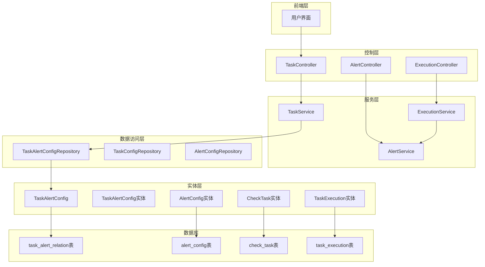
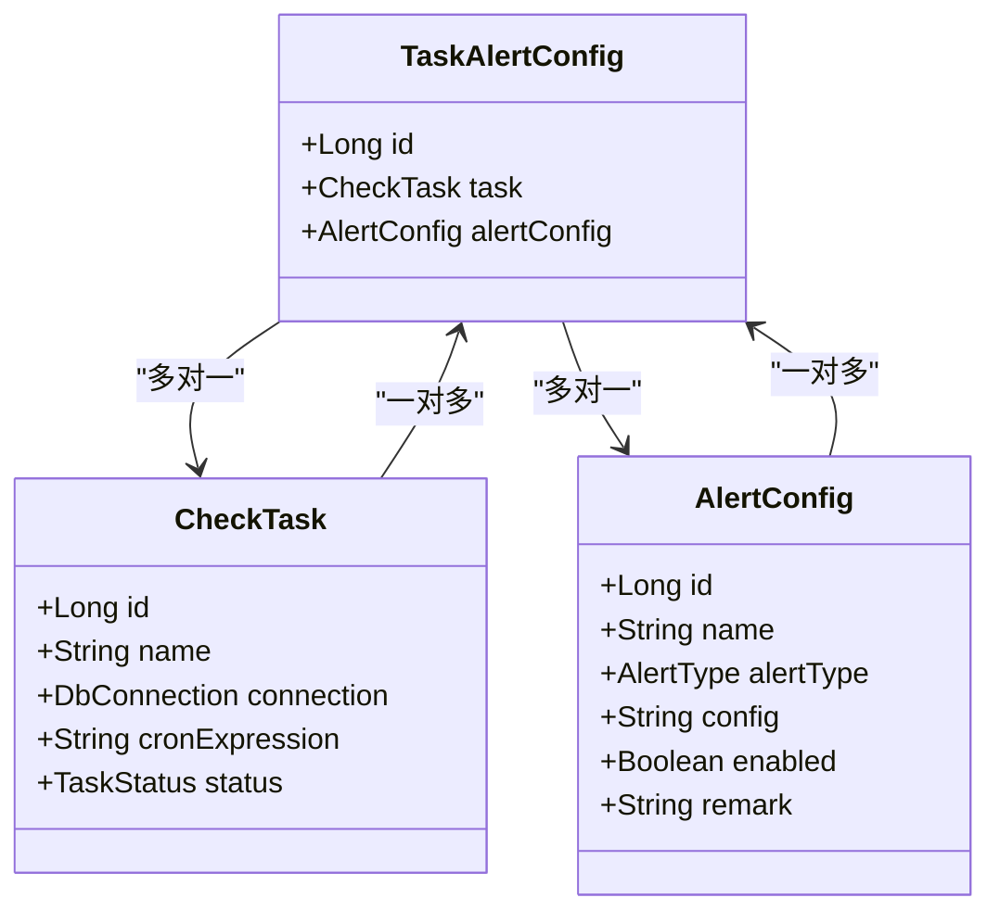
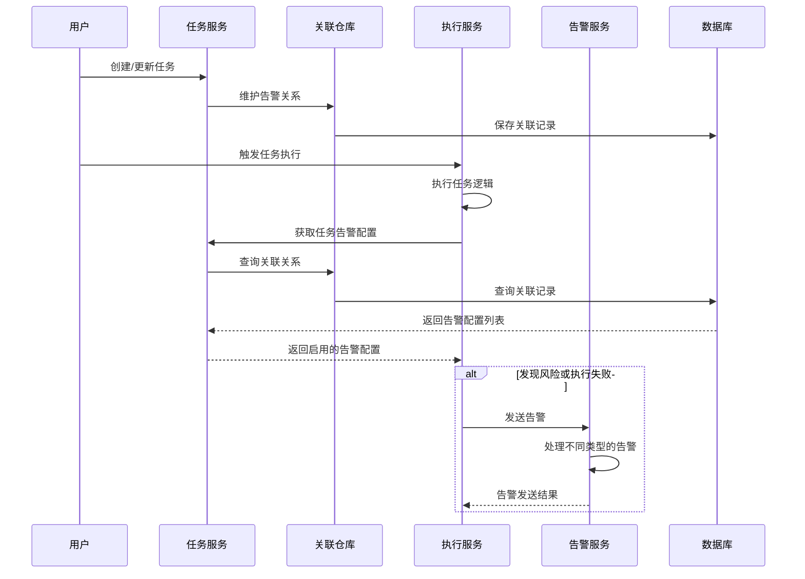
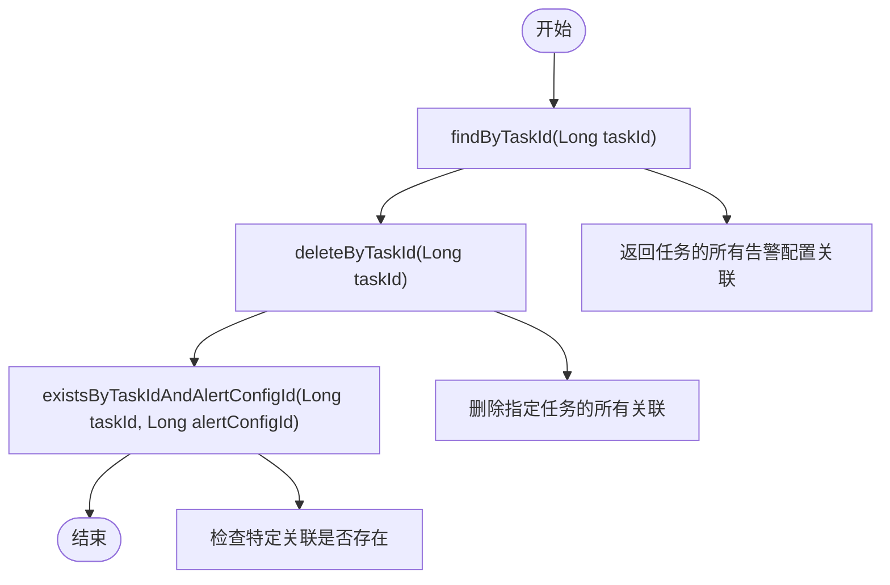
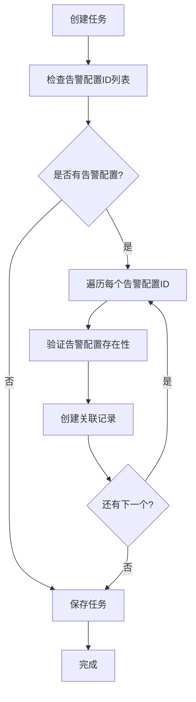
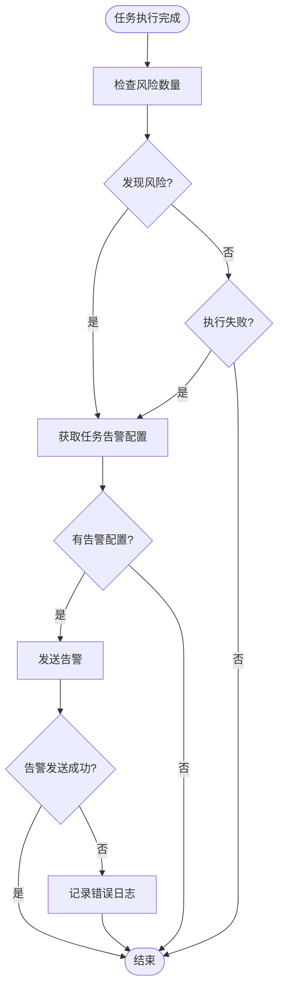
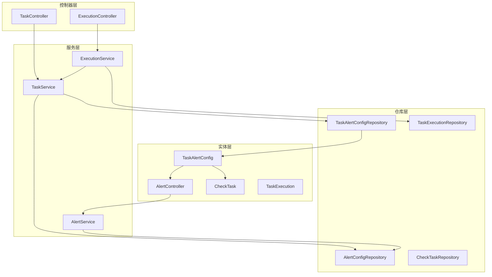

# 任务告警关系表 (task_alert_relation)

<cite>
**本文档引用的文件**
- [TaskAlertConfig.java](file://backend/src/main/java/com/fieldcheck/entity/TaskAlertConfig.java)
- [TaskAlertConfigRepository.java](file://backend/src/main/java/com/fieldcheck/repository/TaskAlertConfigRepository.java)
- [TaskService.java](file://backend/src/main/java/com/fieldcheck/service/TaskService.java)
- [ExecutionService.java](file://backend/src/main/java/com/fieldcheck/service/ExecutionService.java)
- [AlertService.java](file://backend/src/main/java/com/fieldcheck/service/AlertService.java)
- [AlertConfig.java](file://backend/src/main/java/com/fieldcheck/entity/AlertConfig.java)
- [CheckTask.java](file://backend/src/main/java/com/fieldcheck/entity/CheckTask.java)
- [TaskExecution.java](file://backend/src/main/java/com/fieldcheck/entity/TaskExecution.java)
- [01_init_schema.sql](file://mysql/init/01_init_schema.sql)
- [TaskDTO.java](file://backend/src/main/java/com/fieldcheck/dto/TaskDTO.java)
</cite>

## 目录
1. [简介](#简介)
2. [项目结构](#项目结构)
3. [核心组件](#核心组件)
4. [架构概览](#架构概览)
5. [详细组件分析](#详细组件分析)
6. [依赖关系分析](#依赖关系分析)
7. [性能考虑](#性能考虑)
8. [故障排除指南](#故障排除指南)
9. [结论](#结论)

## 简介

任务告警关系表(task_alert_relation)是MySQL字段容量检查系统中的关键关联表，用于建立任务与告警配置之间的多对多关系映射。该表的设计目的是实现灵活的任务告警绑定机制，允许单个任务绑定多个告警配置，同时支持多个任务共享相同的告警配置。

通过这个关联表，系统实现了以下核心功能：
- 支持任务与告警配置的多对多关系
- 提供任务级别的告警配置管理
- 实现告警触发的条件判断和路由
- 支持动态的告警配置更新和维护

## 项目结构

系统采用分层架构设计，任务告警关系表位于数据访问层，通过实体类、仓库接口和服务层进行管理：



**图表来源**
- [TaskAlertConfig.java](file://backend/src/main/java/com/fieldcheck/entity/TaskAlertConfig.java#L17-L28)
- [TaskAlertConfigRepository.java](file://backend/src/main/java/com/fieldcheck/repository/TaskAlertConfigRepository.java#L9-L17)
- [TaskService.java](file://backend/src/main/java/com/fieldcheck/service/TaskService.java#L25-L28)
- [ExecutionService.java](file://backend/src/main/java/com/fieldcheck/service/ExecutionService.java#L42-L67)

**章节来源**
- [TaskAlertConfig.java](file://backend/src/main/java/com/fieldcheck/entity/TaskAlertConfig.java#L1-L29)
- [TaskAlertConfigRepository.java](file://backend/src/main/java/com/fieldcheck/repository/TaskAlertConfigRepository.java#L1-L18)
- [01_init_schema.sql](file://mysql/init/01_init_schema.sql#L127-L180)

## 核心组件

### 关联表实体设计

任务告警关系表的核心实体类定义了任务与告警配置之间的关联关系：



**图表来源**
- [TaskAlertConfig.java](file://backend/src/main/java/com/fieldcheck/entity/TaskAlertConfig.java#L19-L28)
- [CheckTask.java](file://backend/src/main/java/com/fieldcheck/entity/CheckTask.java#L20-L75)
- [AlertConfig.java](file://backend/src/main/java/com/fieldcheck/entity/AlertConfig.java#L18-L36)

### 主键设计策略

系统提供了两种主键设计策略：

1. **物理主键策略**（数据库表）：
   - 使用自增ID作为主键
   - 唯一约束：(task_id, alert_config_id)
   - 适用于需要保留历史关联记录的场景

2. **复合主键策略**（逻辑设计）：
   - 使用(task_id, alert_config_id)作为复合主键
   - 无重复关联自动去重
   - 适用于简单直接的关联管理

**章节来源**
- [TaskAlertConfig.java](file://backend/src/main/java/com/fieldcheck/entity/TaskAlertConfig.java#L17-L28)
- [01_init_schema.sql](file://mysql/init/01_init_schema.sql#L169-L180)

## 架构概览

系统通过任务告警关系表实现了完整的告警触发机制：



**图表来源**
- [TaskService.java](file://backend/src/main/java/com/fieldcheck/service/TaskService.java#L70-L84)
- [ExecutionService.java](file://backend/src/main/java/com/fieldcheck/service/ExecutionService.java#L192-L206)
- [AlertService.java](file://backend/src/main/java/com/fieldcheck/service/AlertService.java#L124-L140)

## 详细组件分析

### 关联表实体分析

TaskAlertConfig实体类定义了任务与告警配置的关联关系：

| 属性 | 类型 | 约束 | 描述 |
|------|------|------|------|
| id | Long | 主键, 自增 | 关联记录唯一标识 |
| task | CheckTask | 外键, 非空 | 关联的任务实体 |
| alertConfig | AlertConfig | 外键, 非空 | 关联的告警配置实体 |

**章节来源**
- [TaskAlertConfig.java](file://backend/src/main/java/com/fieldcheck/entity/TaskAlertConfig.java#L19-L28)

### 仓库接口设计

TaskAlertConfigRepository提供了针对关联表的操作方法：



**图表来源**
- [TaskAlertConfigRepository.java](file://backend/src/main/java/com/fieldcheck/repository/TaskAlertConfigRepository.java#L10-L17)

**章节来源**
- [TaskAlertConfigRepository.java](file://backend/src/main/java/com/fieldcheck/repository/TaskAlertConfigRepository.java#L1-L18)

### 任务服务中的关系管理

TaskService在任务创建和更新时负责维护告警关系：



**图表来源**
- [TaskService.java](file://backend/src/main/java/com/fieldcheck/service/TaskService.java#L70-L84)

**章节来源**
- [TaskService.java](file://backend/src/main/java/com/fieldcheck/service/TaskService.java#L70-L129)

### 执行服务中的告警触发机制

ExecutionService在任务执行完成后根据风险情况触发告警：



**图表来源**
- [ExecutionService.java](file://backend/src/main/java/com/fieldcheck/service/ExecutionService.java#L192-L206)

**章节来源**
- [ExecutionService.java](file://backend/src/main/java/com/fieldcheck/service/ExecutionService.java#L192-L206)

## 依赖关系分析

系统中各组件之间的依赖关系如下：



**图表来源**
- [TaskService.java](file://backend/src/main/java/com/fieldcheck/service/TaskService.java#L23-L28)
- [ExecutionService.java](file://backend/src/main/java/com/fieldcheck/service/ExecutionService.java#L37-L67)

**章节来源**
- [TaskService.java](file://backend/src/main/java/com/fieldcheck/service/TaskService.java#L23-L28)
- [ExecutionService.java](file://backend/src/main/java/com/fieldcheck/service/ExecutionService.java#L37-L67)

## 性能考虑

### 查询优化策略

1. **索引设计**
   - 主键索引：(task_id, alert_config_id)
   - 外键索引：alert_config_id
   - 唯一约束：防止重复关联

2. **查询性能**
   - 使用批量查询减少数据库往返
   - 缓存常用查询结果
   - 避免N+1查询问题

3. **事务管理**
   - 在任务创建/更新时使用事务保证数据一致性
   - 合理设置事务隔离级别

### 内存管理

- 使用ConcurrentHashMap存储运行中的任务状态
- 及时清理过期的运行状态
- 避免内存泄漏

## 故障排除指南

### 常见问题及解决方案

1. **告警配置不存在**
   ```java
   // 错误：告警配置ID无效
   RuntimeException: 告警配置不存在: 123
   
   // 解决方案：检查告警配置ID的有效性
   AlertConfig alertConfig = alertConfigRepository.findById(alertConfigId)
           .orElseThrow(() -> new RuntimeException("告警配置不存在: " + alertConfigId));
   ```

2. **重复关联问题**
   ```java
   // 检查关联是否已存在
   if (taskAlertConfigRepository.existsByTaskIdAndAlertConfigId(taskId, alertConfigId)) {
       // 处理重复关联
   }
   ```

3. **级联删除问题**
   - 删除任务时会自动删除关联关系
   - 删除告警配置时会自动删除关联关系

**章节来源**
- [TaskService.java](file://backend/src/main/java/com/fieldcheck/service/TaskService.java#L73-L74)
- [TaskAlertConfigRepository.java](file://backend/src/main/java/com/fieldcheck/repository/TaskAlertConfigRepository.java#L16)

### 日志监控

系统提供了完善的日志记录机制：

- 告警发送成功日志
- 告警发送失败日志
- 关联关系维护日志
- 异常处理日志

## 结论

任务告警关系表(task_alert_relation)是MySQL字段容量检查系统中实现灵活告警机制的关键组件。通过采用多对多关系设计，系统实现了以下优势：

1. **灵活性**：支持一个任务绑定多个告警配置，满足复杂告警需求
2. **可扩展性**：支持多个任务共享相同的告警配置
3. **可靠性**：通过外键约束保证数据完整性
4. **易维护性**：清晰的实体关系和仓库接口设计

该设计为系统的告警功能提供了坚实的基础，能够有效支持各种告警场景，并为未来的功能扩展预留了充足的空间。