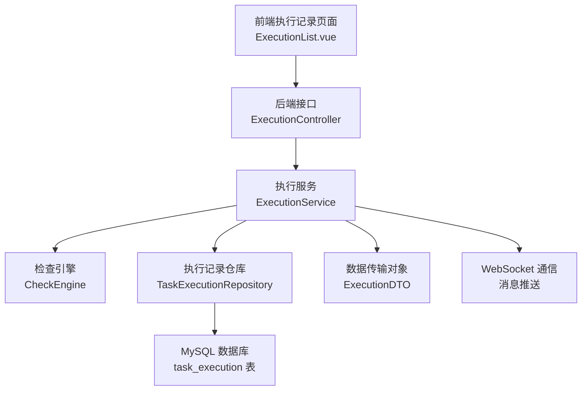
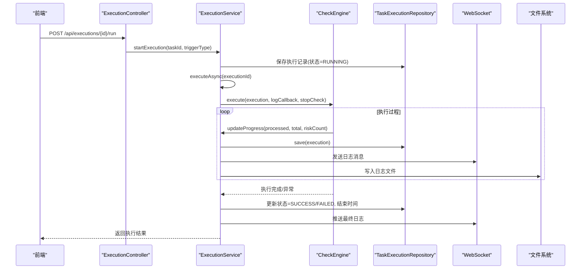
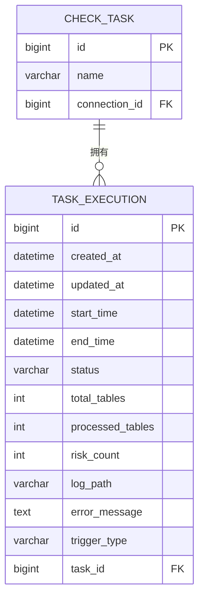
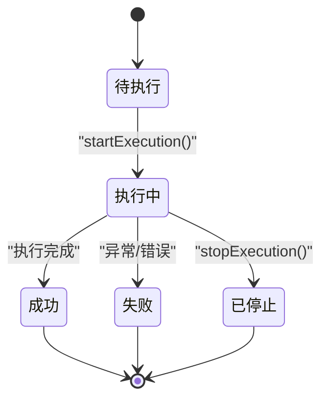
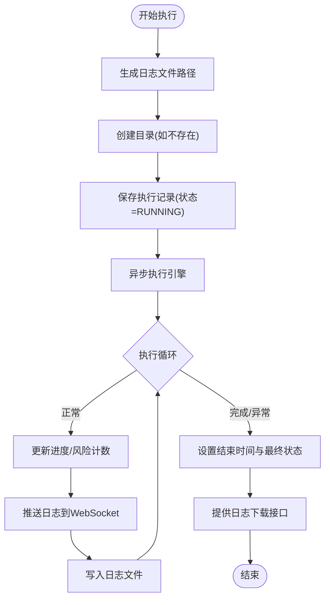
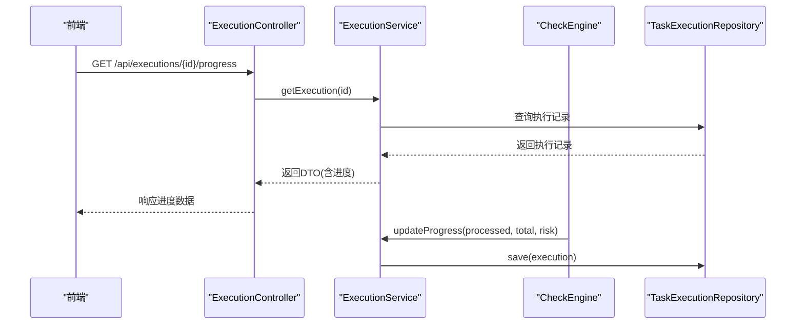
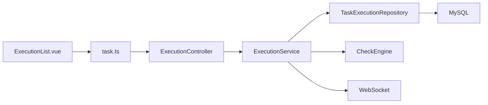

# 任务执行记录表 (task_execution)

<cite>
**本文档引用的文件**
- [TaskExecution.java](file://backend/src/main/java/com/fieldcheck/entity/TaskExecution.java)
- [TaskExecutionRepository.java](file://backend/src/main/java/com/fieldcheck/repository/TaskExecutionRepository.java)
- [ExecutionService.java](file://backend/src/main/java/com/fieldcheck/service/ExecutionService.java)
- [ExecutionController.java](file://backend/src/main/java/com/fieldcheck/controller/ExecutionController.java)
- [ExecutionStatus.java](file://backend/src/main/java/com/fieldcheck/entity/ExecutionStatus.java)
- [ExecutionDTO.java](file://backend/src/main/java/com/fieldcheck/dto/ExecutionDTO.java)
- [CheckEngine.java](file://backend/src/main/java/com/fieldcheck/engine/CheckEngine.java)
- [CheckTask.java](file://backend/src/main/java/com/fieldcheck/entity/CheckTask.java)
- [application.yml](file://backend/src/main/resources/application.yml)
- [01_init_schema.sql](file://mysql/init/01_init_schema.sql)
- [ExecutionList.vue](file://frontend/src/views/execution/ExecutionList.vue)
- [task.ts](file://frontend/src/api/task.ts)
</cite>

## 目录
1. [简介](#简介)
2. [项目结构](#项目结构)
3. [核心组件](#核心组件)
4. [架构概览](#架构概览)
5. [详细组件分析](#详细组件分析)
6. [依赖关系分析](#依赖关系分析)
7. [性能考量](#性能考量)
8. [故障排查指南](#故障排查指南)
9. [结论](#结论)
10. [附录](#附录)

## 简介
本文档详细说明任务执行记录表（task_execution）的设计与实现，涵盖以下方面：
- 字段定义与含义：开始时间、结束时间、处理表数量、风险数量、错误信息、触发类型等
- 执行状态生命周期管理与状态转换逻辑
- 执行日志路径与文件存储机制
- 执行监控与进度跟踪实现方式
- 执行性能指标与统计分析功能
- 与检查任务表（check_task）的关联关系与数据完整性约束

## 项目结构
后端采用Spring Boot + Spring Data JPA + MySQL的典型三层架构，前端使用Vue 3 + Element Plus构建管理界面。任务执行记录作为核心业务实体之一，贯穿控制器、服务层、持久层与前端展示层。

图表来源
- [ExecutionList.vue](file://frontend/src/views/execution/ExecutionList.vue#L1-L327)
- [ExecutionController.java](file://backend/src/main/java/com/fieldcheck/controller/ExecutionController.java#L1-L79)
- [ExecutionService.java](file://backend/src/main/java/com/fieldcheck/service/ExecutionService.java#L1-L307)
- [TaskExecutionRepository.java](file://backend/src/main/java/com/fieldcheck/repository/TaskExecutionRepository.java#L1-L41)
- [CheckEngine.java](file://backend/src/main/java/com/fieldcheck/engine/CheckEngine.java#L1-L493)
- [01_init_schema.sql](file://mysql/init/01_init_schema.sql#L137-L155)

章节来源
- [ExecutionList.vue](file://frontend/src/views/execution/ExecutionList.vue#L1-L327)
- [ExecutionController.java](file://backend/src/main/java/com/fieldcheck/controller/ExecutionController.java#L1-L79)
- [ExecutionService.java](file://backend/src/main/java/com/fieldcheck/service/ExecutionService.java#L1-L307)
- [TaskExecutionRepository.java](file://backend/src/main/java/com/fieldcheck/repository/TaskExecutionRepository.java#L1-L41)
- [CheckEngine.java](file://backend/src/main/java/com/fieldcheck/engine/CheckEngine.java#L1-L493)
- [01_init_schema.sql](file://mysql/init/01_init_schema.sql#L137-L155)

## 核心组件
- 实体模型：TaskExecution（任务执行记录），包含状态、时间戳、进度、风险计数、日志路径、错误信息、触发类型等字段
- 仓库接口：TaskExecutionRepository，提供按任务、状态、时间范围查询及聚合统计能力
- 服务层：ExecutionService，负责执行启动、异步执行、进度更新、日志写入与推送、告警发送、停止控制
- 控制器：ExecutionController，提供执行记录列表、详情、进度、日志查看与下载等REST接口
- 前端：ExecutionList.vue，提供执行记录列表、搜索过滤、进度展示、日志查看与下载功能

章节来源
- [TaskExecution.java](file://backend/src/main/java/com/fieldcheck/entity/TaskExecution.java#L1-L58)
- [TaskExecutionRepository.java](file://backend/src/main/java/com/fieldcheck/repository/TaskExecutionRepository.java#L1-L41)
- [ExecutionService.java](file://backend/src/main/java/com/fieldcheck/service/ExecutionService.java#L1-L307)
- [ExecutionController.java](file://backend/src/main/java/com/fieldcheck/controller/ExecutionController.java#L1-L79)
- [ExecutionDTO.java](file://backend/src/main/java/com/fieldcheck/dto/ExecutionDTO.java#L1-L30)

## 架构概览
任务执行从“手动触发”或“定时调度”开始，服务层创建执行记录并启动异步执行；执行过程中通过回调函数实时更新进度与风险计数，并将日志同时推送到WebSocket通道与写入本地文件；最终根据执行结果设置状态为成功或失败，并在需要时发送告警。

图表来源
- [ExecutionController.java](file://backend/src/main/java/com/fieldcheck/controller/ExecutionController.java#L1-L79)
- [ExecutionService.java](file://backend/src/main/java/com/fieldcheck/service/ExecutionService.java#L107-L210)
- [CheckEngine.java](file://backend/src/main/java/com/fieldcheck/engine/CheckEngine.java#L57-L165)
- [TaskExecutionRepository.java](file://backend/src/main/java/com/fieldcheck/repository/TaskExecutionRepository.java#L38-L39)

## 详细组件分析

### 数据模型与字段说明
- 关联关系
  - 多对一：TaskExecution.task → CheckTask.id（外键约束）
- 字段定义
  - 开始时间：start_time（datetime）
  - 结束时间：end_time（datetime）
  - 总表数：total_tables（int）
  - 已处理表数：processed_tables（int）
  - 风险数量：risk_count（int）
  - 日志路径：log_path（varchar 500）
  - 错误信息：error_message（text）
  - 触发类型：trigger_type（varchar 20，默认 MANUAL）
  - 状态：status（varchar 20，默认 PENDING）

图表来源
- [01_init_schema.sql](file://mysql/init/01_init_schema.sql#L137-L155)
- [TaskExecution.java](file://backend/src/main/java/com/fieldcheck/entity/TaskExecution.java#L19-L56)
- [CheckTask.java](file://backend/src/main/java/com/fieldcheck/entity/CheckTask.java#L20-L74)

章节来源
- [TaskExecution.java](file://backend/src/main/java/com/fieldcheck/entity/TaskExecution.java#L19-L56)
- [01_init_schema.sql](file://mysql/init/01_init_schema.sql#L137-L155)

### 执行状态生命周期与状态转换
- 状态枚举：PENDING（待执行）、RUNNING（执行中）、SUCCESS（执行成功）、FAILED（执行失败）、STOPPED（已停止）
- 状态转换流程
  - 启动：创建执行记录并立即设置为 RUNNING
  - 成功：执行完成后设置为 SUCCESS，并记录结束时间
  - 失败：捕获异常后设置为 FAILED，并记录错误信息
  - 停止：用户主动停止时设置为 STOPPED，并记录结束时间
  - 并发保护：内存缓存 runningTasks 防止同一任务重复执行；数据库中若存在未清理的 RUNNING 记录，启动前会将其标记为 FAILED

图表来源
- [ExecutionStatus.java](file://backend/src/main/java/com/fieldcheck/entity/ExecutionStatus.java#L3-L9)
- [ExecutionService.java](file://backend/src/main/java/com/fieldcheck/service/ExecutionService.java#L107-L224)

章节来源
- [ExecutionStatus.java](file://backend/src/main/java/com/fieldcheck/entity/ExecutionStatus.java#L3-L9)
- [ExecutionService.java](file://backend/src/main/java/com/fieldcheck/service/ExecutionService.java#L107-L224)

### 执行日志路径与文件存储机制
- 日志路径生成规则：基于应用配置 app.log-path，文件名格式为 task_{taskId}_{yyyyMMdd_HHmmss}.log
- 写入策略：
  - WebSocket推送：每条日志通过消息模板发送到 /topic/execution/{id}/log
  - 文件落盘：按时间戳与级别写入对应日志文件，便于离线分析
- 下载接口：提供HTTP下载，前端可直接触发浏览器下载

图表来源
- [ExecutionService.java](file://backend/src/main/java/com/fieldcheck/service/ExecutionService.java#L134-L282)
- [ExecutionController.java](file://backend/src/main/java/com/fieldcheck/controller/ExecutionController.java#L52-L77)
- [application.yml](file://backend/src/main/resources/application.yml#L65-L67)

章节来源
- [ExecutionService.java](file://backend/src/main/java/com/fieldcheck/service/ExecutionService.java#L134-L282)
- [ExecutionController.java](file://backend/src/main/java/com/fieldcheck/controller/ExecutionController.java#L52-L77)
- [application.yml](file://backend/src/main/resources/application.yml#L65-L67)

### 执行监控与进度跟踪
- 进度计算：progressPercent = processedTables / totalTables * 100（当 totalTables > 0）
- 实时更新：检查引擎每处理若干张表后调用 saveExecution，合并更新 totalTables、processedTables、riskCount
- 前端展示：表格列显示“检查表数/风险数/进度”，支持分页与筛选
- 日志流：WebSocket订阅执行日志，实时显示执行过程

图表来源
- [ExecutionController.java](file://backend/src/main/java/com/fieldcheck/controller/ExecutionController.java#L46-L50)
- [ExecutionService.java](file://backend/src/main/java/com/fieldcheck/service/ExecutionService.java#L226-L235)
- [CheckEngine.java](file://backend/src/main/java/com/fieldcheck/engine/CheckEngine.java#L144-L157)

章节来源
- [ExecutionController.java](file://backend/src/main/java/com/fieldcheck/controller/ExecutionController.java#L46-L50)
- [ExecutionService.java](file://backend/src/main/java/com/fieldcheck/service/ExecutionService.java#L226-L235)
- [CheckEngine.java](file://backend/src/main/java/com/fieldcheck/engine/CheckEngine.java#L144-L157)

### 执行性能指标与统计分析
- 性能指标
  - 总表数与已处理表数：用于计算进度百分比
  - 风险数量：用于告警与统计
  - 执行耗时：由开始时间与结束时间差计算
- 统计分析
  - 按状态统计：countByStatus(status)
  - 最近执行：findRecentExecutions(startTime)
  - 按任务与状态组合查询：findByTaskIdAndStatus(taskId, status)
  - 前端支持按任务名称、状态、触发类型进行筛选与分页

章节来源
- [TaskExecutionRepository.java](file://backend/src/main/java/com/fieldcheck/repository/TaskExecutionRepository.java#L32-L36)
- [ExecutionService.java](file://backend/src/main/java/com/fieldcheck/service/ExecutionService.java#L73-L100)
- [ExecutionList.vue](file://frontend/src/views/execution/ExecutionList.vue#L8-L36)

### 与检查任务表的关联关系与数据完整性约束
- 外键约束：task_execution.task_id → check_task.id
- 关系映射：TaskExecution.task（多对一）→ CheckTask
- 数据完整性：
  - 删除级联：删除任务时，其执行记录不会自动删除（外键约束未声明ON DELETE CASCADE）
  - 查询优化：提供按任务ID排序与按状态过滤的查询方法
- 风险结果关联：risk_result.execution_id → task_execution.id，形成“执行记录-风险结果”的一对多关系

章节来源
- [01_init_schema.sql](file://mysql/init/01_init_schema.sql#L137-L155)
- [TaskExecution.java](file://backend/src/main/java/com/fieldcheck/entity/TaskExecution.java#L21-L23)
- [CheckTask.java](file://backend/src/main/java/com/fieldcheck/entity/CheckTask.java#L20-L74)

## 依赖关系分析
- 控制器依赖服务层，服务层依赖仓库接口与检查引擎
- 仓库接口依赖JPA与数据库
- 前端通过API接口与后端交互，使用WebSocket接收日志流

图表来源
- [ExecutionController.java](file://backend/src/main/java/com/fieldcheck/controller/ExecutionController.java#L1-L79)
- [ExecutionService.java](file://backend/src/main/java/com/fieldcheck/service/ExecutionService.java#L1-L307)
- [TaskExecutionRepository.java](file://backend/src/main/java/com/fieldcheck/repository/TaskExecutionRepository.java#L1-L41)
- [ExecutionList.vue](file://frontend/src/views/execution/ExecutionList.vue#L1-L327)
- [task.ts](file://frontend/src/api/task.ts#L1-L88)

章节来源
- [ExecutionController.java](file://backend/src/main/java/com/fieldcheck/controller/ExecutionController.java#L1-L79)
- [ExecutionService.java](file://backend/src/main/java/com/fieldcheck/service/ExecutionService.java#L1-L307)
- [TaskExecutionRepository.java](file://backend/src/main/java/com/fieldcheck/repository/TaskExecutionRepository.java#L1-L41)
- [ExecutionList.vue](file://frontend/src/views/execution/ExecutionList.vue#L1-L327)
- [task.ts](file://frontend/src/api/task.ts#L1-L88)

## 性能考量
- 异步执行：使用@Async与线程池隔离IO密集型日志写入与数据库更新
- 进度批量保存：每处理N张表统一保存一次，减少数据库写入压力
- 查询优化：提供按任务ID、状态、时间范围的索引与查询方法
- 日志落盘：仅追加写入，避免大文件频繁重写
- 并发控制：内存缓存runningTasks防止重复执行，数据库层面清理异常RUNNING记录

章节来源
- [ExecutionService.java](file://backend/src/main/java/com/fieldcheck/service/ExecutionService.java#L165-L210)
- [CheckEngine.java](file://backend/src/main/java/com/fieldcheck/engine/CheckEngine.java#L151-L157)
- [TaskExecutionRepository.java](file://backend/src/main/java/com/fieldcheck/repository/TaskExecutionRepository.java#L25-L39)

## 故障排查指南
- 执行记录不存在：getExecution抛出异常，需确认ID正确性
- 任务正在执行中：startExecution检测runningTasks，避免重复执行
- 日志文件无法写入：sendLog捕获IOException并记录错误，检查app.log-path权限与磁盘空间
- WebSocket日志不显示：确认订阅路径与连接状态
- 停止任务无效：stopExecution仅对RUNNING状态生效，需确保任务处于运行中

章节来源
- [ExecutionService.java](file://backend/src/main/java/com/fieldcheck/service/ExecutionService.java#L102-L131)
- [ExecutionService.java](file://backend/src/main/java/com/fieldcheck/service/ExecutionService.java#L237-L268)
- [ExecutionController.java](file://backend/src/main/java/com/fieldcheck/controller/ExecutionController.java#L52-L77)

## 结论
task_execution表完整记录了每次任务执行的生命周期、进度与风险情况，配合异步执行、WebSocket日志推送与文件落盘，实现了高效、可观测的任务执行体系。通过合理的状态机设计与并发控制，保证了执行的一致性与可靠性；通过丰富的查询与统计接口，支撑了前端的监控与分析需求。

## 附录
- 配置项参考
  - 日志路径：app.log-path（默认 ./logs/executions）
  - 并发任务上限：app.max-concurrent-tasks（在应用配置中定义）
- 前端接口映射
  - 获取执行记录列表：GET /executions
  - 获取单条执行记录：GET /executions/{id}
  - 获取执行进度：GET /executions/{id}/progress
  - 获取执行日志：GET /executions/{id}/log
  - 下载执行日志：GET /executions/{id}/log/download

章节来源
- [application.yml](file://backend/src/main/resources/application.yml#L65-L67)
- [task.ts](file://frontend/src/api/task.ts#L66-L87)