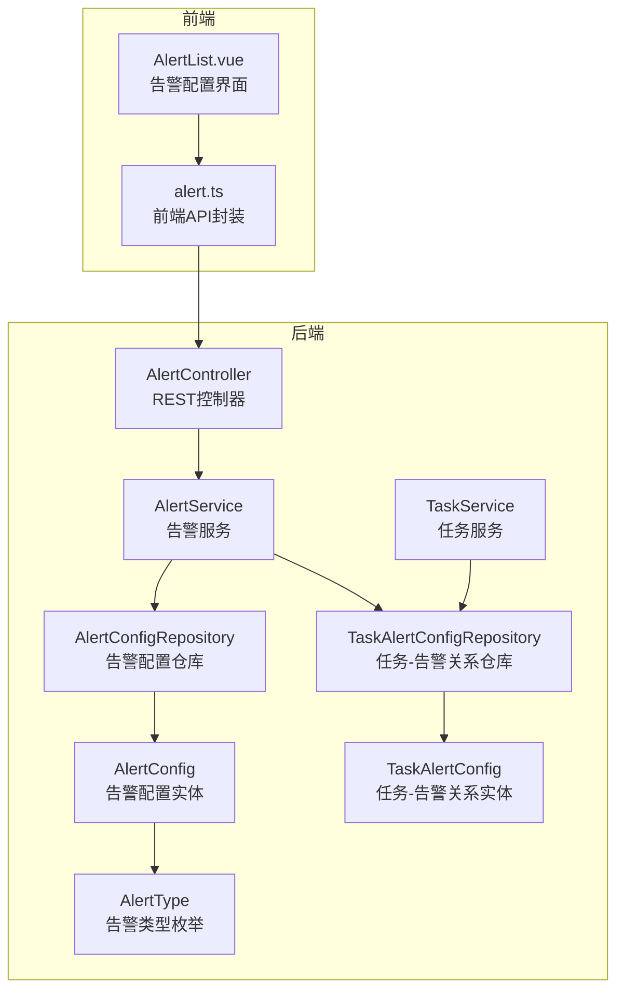
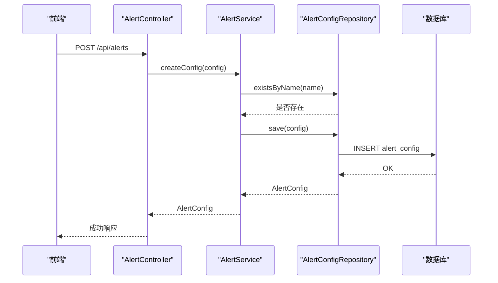
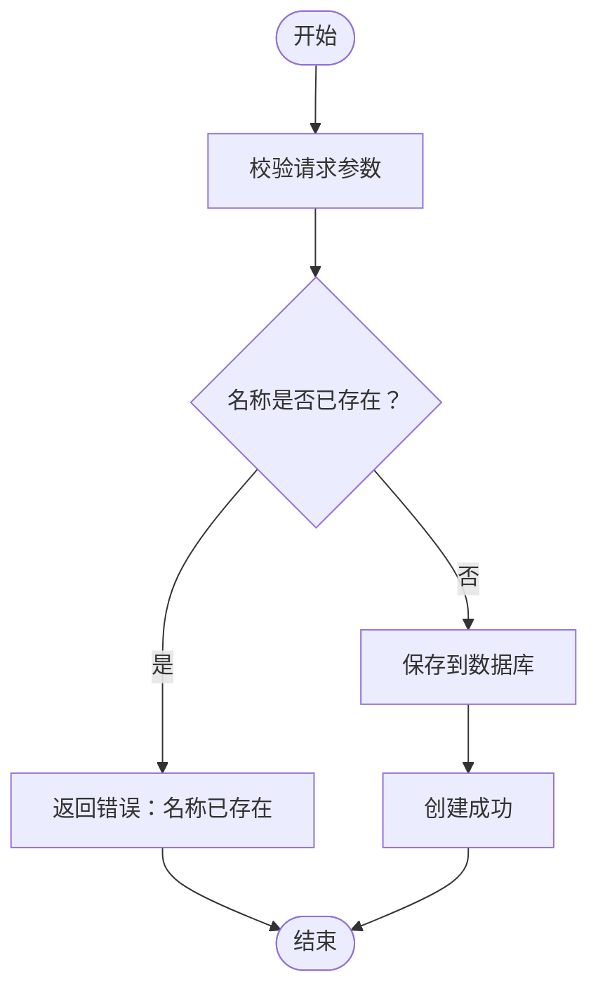
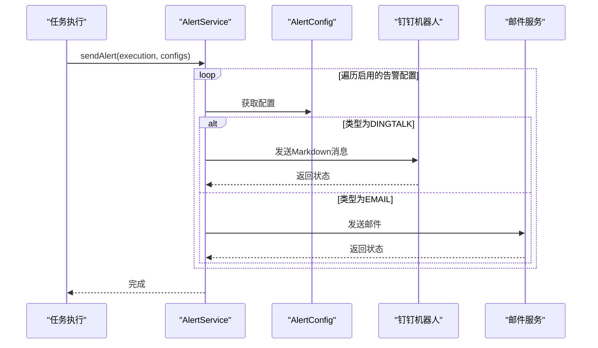
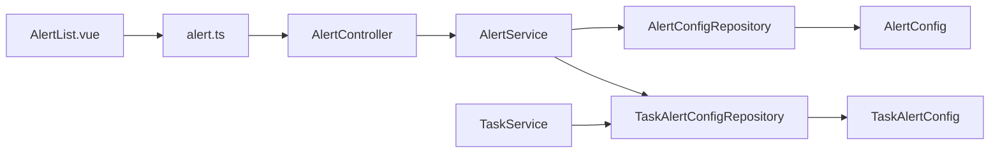

# 告警配置表 (alert_config)

<cite>
**本文引用的文件**
- [AlertConfig.java](file://backend/src/main/java/com/fieldcheck/entity/AlertConfig.java)
- [AlertType.java](file://backend/src/main/java/com/fieldcheck/entity/AlertType.java)
- [AlertConfigRepository.java](file://backend/src/main/java/com/fieldcheck/repository/AlertConfigRepository.java)
- [AlertService.java](file://backend/src/main/java/com/fieldcheck/service/AlertService.java)
- [AlertController.java](file://backend/src/main/java/com/fieldcheck/controller/AlertController.java)
- [TaskAlertConfig.java](file://backend/src/main/java/com/fieldcheck/entity/TaskAlertConfig.java)
- [TaskAlertConfigRepository.java](file://backend/src/main/java/com/fieldcheck/repository/TaskAlertConfigRepository.java)
- [TaskService.java](file://backend/src/main/java/com/fieldcheck/service/TaskService.java)
- [01_init_schema.sql](file://mysql/init/01_init_schema.sql)
- [alert.ts](file://frontend/src/api/alert.ts)
- [AlertList.vue](file://frontend/src/views/alert/AlertList.vue)
</cite>

## 目录
1. [简介](#简介)
2. [项目结构](#项目结构)
3. [核心组件](#核心组件)
4. [架构总览](#架构总览)
5. [详细组件分析](#详细组件分析)
6. [依赖关系分析](#依赖关系分析)
7. [性能考虑](#性能考虑)
8. [故障排查指南](#故障排查指南)
9. [结论](#结论)
10. [附录](#附录)

## 简介
本文件系统性地阐述告警配置表（alert_config）的设计与使用，覆盖字段定义、JSON配置结构与校验、告警类型与参数、创建/修改/删除流程、触发条件与通知渠道、以及与任务告警关系表（task_alert_config）的多对多关联管理。目标是帮助开发者与运维人员快速理解并正确配置告警机制。

## 项目结构
后端采用Spring Boot + JPA，前端基于Vue 3 + Element Plus。告警配置由后端实体与仓库层承载，服务层负责业务逻辑与通知发送，控制器提供REST接口；前端通过API封装调用后端接口，实现可视化配置与测试。



图表来源
- [AlertController.java](file://backend/src/main/java/com/fieldcheck/entity/AlertConfig.java#L1-L36)
- [AlertService.java](file://backend/src/main/java/com/fieldcheck/service/AlertService.java#L1-L274)
- [AlertConfigRepository.java](file://backend/src/main/java/com/fieldcheck/repository/AlertConfigRepository.java#L1-L19)
- [TaskAlertConfigRepository.java](file://backend/src/main/java/com/fieldcheck/repository/TaskAlertConfigRepository.java#L1-L18)
- [TaskService.java](file://backend/src/main/java/com/fieldcheck/service/TaskService.java#L1-L177)
- [AlertList.vue](file://frontend/src/views/alert/AlertList.vue#L1-L508)
- [alert.ts](file://frontend/src/api/alert.ts#L1-L28)

章节来源
- [AlertController.java](file://backend/src/main/java/com/fieldcheck/controller/AlertController.java#L1-L67)
- [AlertService.java](file://backend/src/main/java/com/fieldcheck/service/AlertService.java#L1-L274)
- [AlertConfigRepository.java](file://backend/src/main/java/com/fieldcheck/repository/AlertConfigRepository.java#L1-L19)
- [TaskAlertConfigRepository.java](file://backend/src/main/java/com/fieldcheck/repository/TaskAlertConfigRepository.java#L1-L18)
- [TaskService.java](file://backend/src/main/java/com/fieldcheck/service/TaskService.java#L1-L177)
- [AlertList.vue](file://frontend/src/views/alert/AlertList.vue#L1-L508)
- [alert.ts](file://frontend/src/api/alert.ts#L1-L28)

## 核心组件
- 实体与枚举
  - 告警配置实体：包含名称、告警类型、JSON配置、启用状态、备注等字段。
  - 告警类型枚举：支持“钉钉机器人”和“邮件”两类。
  - 任务-告警关系实体：维护任务与告警配置的多对多关联。
- 仓库层
  - 告警配置仓库：提供按名称、类型、启用状态查询与去重校验。
  - 任务-告警关系仓库：提供按任务查询、按任务批量删除、存在性校验。
- 服务层
  - 告警服务：提供查询、创建、更新、删除、测试告警、发送告警、构建消息体等能力。
  - 任务服务：在任务创建/更新时维护任务与告警配置的关联。
- 控制器与前端
  - 控制器：提供REST接口，支持分页筛选、启用状态切换、测试告警。
  - 前端：提供可视化表单、列表展示、搜索过滤、测试发送。

章节来源
- [AlertConfig.java](file://backend/src/main/java/com/fieldcheck/entity/AlertConfig.java#L1-L36)
- [AlertType.java](file://backend/src/main/java/com/fieldcheck/entity/AlertType.java#L1-L7)
- [TaskAlertConfig.java](file://backend/src/main/java/com/fieldcheck/entity/TaskAlertConfig.java#L1-L29)
- [AlertConfigRepository.java](file://backend/src/main/java/com/fieldcheck/repository/AlertConfigRepository.java#L1-L19)
- [TaskAlertConfigRepository.java](file://backend/src/main/java/com/fieldcheck/repository/TaskAlertConfigRepository.java#L1-L18)
- [AlertService.java](file://backend/src/main/java/com/fieldcheck/service/AlertService.java#L1-L274)
- [TaskService.java](file://backend/src/main/java/com/fieldcheck/service/TaskService.java#L1-L177)
- [AlertController.java](file://backend/src/main/java/com/fieldcheck/controller/AlertController.java#L1-L67)
- [AlertList.vue](file://frontend/src/views/alert/AlertList.vue#L1-L508)
- [alert.ts](file://frontend/src/api/alert.ts#L1-L28)

## 架构总览
告警配置的完整生命周期如下：
- 前端提交配置（名称、类型、JSON配置、启用状态），后端进行名称重复校验与持久化。
- 任务执行完成后，系统根据任务绑定的告警配置列表，逐个发送通知。
- 支持测试模式，便于验证配置有效性。



图表来源
- [AlertController.java](file://backend/src/main/java/com/fieldcheck/controller/AlertController.java#L41-L50)
- [AlertService.java](file://backend/src/main/java/com/fieldcheck/service/AlertService.java#L75-L81)
- [AlertConfigRepository.java](file://backend/src/main/java/com/fieldcheck/repository/AlertConfigRepository.java#L17-L18)

## 详细组件分析

### 表结构与字段说明
- 表名：alert_config
- 关键列
  - id：主键
  - name：字符串，长度限制，必填
  - alert_type：字符串枚举，必填，取值为“DINGTALK”或“EMAIL”
  - config：JSON类型，存储具体通知渠道配置
  - enabled：布尔型，启用状态，默认启用
  - remark：文本，备注说明
  - created_at / updated_at：审计时间戳

章节来源
- [01_init_schema.sql](file://mysql/init/01_init_schema.sql#L10-L21)
- [AlertConfig.java](file://backend/src/main/java/com/fieldcheck/entity/AlertConfig.java#L20-L35)

### 告警类型与配置参数
- 钉钉机器人（DINGTALK）
  - 必填字段：webhook（Webhook地址）
  - 可选字段：secret（加签密钥）、atMobiles（需要@的手机号，逗号分隔）
  - 发送逻辑：若提供secret，会生成带时间戳与签名的URL；消息体为Markdown类型。
- 邮件（EMAIL）
  - 必填字段：emailRecipients（收件人，逗号分隔）
  - 常用字段：smtpHost、smtpPort、senderEmail、senderPassword、useSsl
  - 兼容字段：前端可能传入senderEmail/senderPassword，后端兼容读取smtpUsername/smtpPassword
  - 发送逻辑：动态构造JavaMailSender，设置SMTP参数，发送纯文本邮件。

章节来源
- [AlertType.java](file://backend/src/main/java/com/fieldcheck/entity/AlertType.java#L3-L6)
- [AlertService.java](file://backend/src/main/java/com/fieldcheck/service/AlertService.java#L159-L199)
- [AlertService.java](file://backend/src/main/java/com/fieldcheck/service/AlertService.java#L201-L245)
- [AlertService.java](file://backend/src/main/java/com/fieldcheck/service/AlertService.java#L247-L272)
- [AlertList.vue](file://frontend/src/views/alert/AlertList.vue#L138-L192)
- [AlertList.vue](file://frontend/src/views/alert/AlertList.vue#L378-L394)

### JSON配置字段与校验规则
- 钉钉机器人
  - webhook：必填，字符串
  - secret：可选，字符串
  - atMobiles：可选，字符串（多个手机号逗号分隔）
- 邮件
  - smtpHost：必填，字符串
  - smtpPort：必填，整数
  - senderEmail：必填，邮箱格式
  - senderPassword：必填，字符串
  - emailRecipients：必填，字符串（多个邮箱逗号分隔）
  - useSsl：可选，布尔
- 后端解析
  - 使用Jackson解析JSON，读取对应字段；若缺少关键字段，发送时会抛出异常。
  - 钉钉：支持secret加签，自动拼接时间戳与签名参数。
  - 邮件：兼容前端命名与后端命名差异，统一读取。

章节来源
- [AlertService.java](file://backend/src/main/java/com/fieldcheck/service/AlertService.java#L160-L162)
- [AlertService.java](file://backend/src/main/java/com/fieldcheck/service/AlertService.java#L202-L205)
- [AlertService.java](file://backend/src/main/java/com/fieldcheck/service/AlertService.java#L254-L258)
- [AlertList.vue](file://frontend/src/views/alert/AlertList.vue#L378-L394)

### 创建、修改、删除流程
- 创建
  - 前端提交：名称、告警类型、JSON配置、启用状态
  - 后端校验：名称唯一性
  - 持久化：保存到alert_config
- 修改
  - 更新字段：名称、类型、JSON配置、启用状态、备注
  - 后端直接更新实体并保存
- 删除
  - 后端删除指定ID记录
  - 注意：删除不会影响任务-告警关系，但被删除的配置将不再参与后续告警发送



图表来源
- [AlertService.java](file://backend/src/main/java/com/fieldcheck/service/AlertService.java#L75-L81)
- [AlertConfigRepository.java](file://backend/src/main/java/com/fieldcheck/repository/AlertConfigRepository.java#L17-L18)

章节来源
- [AlertController.java](file://backend/src/main/java/com/fieldcheck/controller/AlertController.java#L41-L58)
- [AlertService.java](file://backend/src/main/java/com/fieldcheck/service/AlertService.java#L75-L97)
- [AlertConfigRepository.java](file://backend/src/main/java/com/fieldcheck/repository/AlertConfigRepository.java#L17-L18)

### 触发条件与通知渠道
- 触发条件
  - 当任务执行完成且存在绑定的启用告警配置时，系统会逐个发送通知。
  - 前端提供“测试告警”按钮，可单独验证某条配置的有效性。
- 通知渠道
  - 钉钉机器人：通过HTTP POST发送Markdown消息，支持加签。
  - 邮件：通过SMTP发送邮件，支持SSL/TLS。



图表来源
- [AlertService.java](file://backend/src/main/java/com/fieldcheck/service/AlertService.java#L124-L140)
- [AlertService.java](file://backend/src/main/java/com/fieldcheck/service/AlertService.java#L159-L199)
- [AlertService.java](file://backend/src/main/java/com/fieldcheck/service/AlertService.java#L201-L245)

章节来源
- [AlertService.java](file://backend/src/main/java/com/fieldcheck/service/AlertService.java#L124-L140)
- [AlertController.java](file://backend/src/main/java/com/fieldcheck/controller/AlertController.java#L60-L65)

### 与任务告警关系表的关联与多对多管理
- 关系表：task_alert_config
  - 主键：自增ID
  - 唯一索引：(task_id, alert_config_id)，保证同一任务-告警组合不重复
  - 外键约束：级联删除，确保删除任务或告警配置时关系表同步清理
- 多对多语义
  - 一个任务可绑定多个告警配置
  - 一个告警配置可被多个任务复用
- 维护策略
  - 任务创建/更新时，先清空旧关系，再按新列表重建
  - 查询任务绑定的告警配置时，仅返回启用状态的配置

```mermaid
erDiagram
CHECK_TASK ||--o{ TASK_ALERT_CONFIG : "绑定"
ALERT_CONFIG ||--o{ TASK_ALERT_CONFIG : "绑定"
CHECK_TASK {
bigint id PK
varchar name
...
}
ALERT_CONFIG {
bigint id PK
varchar name
enum alert_type
json config
boolean enabled
text remark
}
TASK_ALERT_CONFIG {
bigint id PK
bigint task_id FK
bigint alert_config_id FK
}
```

图表来源
- [01_init_schema.sql](file://mysql/init/01_init_schema.sql#L127-L135)
- [01_init_schema.sql](file://mysql/init/01_init_schema.sql#L169-L180)
- [TaskAlertConfig.java](file://backend/src/main/java/com/fieldcheck/entity/TaskAlertConfig.java#L19-L28)
- [TaskAlertConfigRepository.java](file://backend/src/main/java/com/fieldcheck/repository/TaskAlertConfigRepository.java#L10-L17)
- [TaskService.java](file://backend/src/main/java/com/fieldcheck/service/TaskService.java#L112-L129)

章节来源
- [TaskService.java](file://backend/src/main/java/com/fieldcheck/service/TaskService.java#L112-L129)
- [TaskService.java](file://backend/src/main/java/com/fieldcheck/service/TaskService.java#L169-L175)
- [TaskAlertConfigRepository.java](file://backend/src/main/java/com/fieldcheck/repository/TaskAlertConfigRepository.java#L12-L16)
- [01_init_schema.sql](file://mysql/init/01_init_schema.sql#L127-L135)

## 依赖关系分析
- 组件耦合
  - AlertService依赖AlertConfigRepository与Jackson对象映射，负责告警发送与测试。
  - TaskService在任务创建/更新时依赖AlertConfigRepository与TaskAlertConfigRepository，负责维护多对多关系。
  - 前端通过alert.ts封装API，AlertList.vue负责表单与交互。
- 外部依赖
  - 钉钉：HTTP客户端发送Markdown消息
  - 邮件：JavaMailSender实现SMTP发送
- 潜在循环依赖
  - 未见直接循环依赖；服务层通过仓库层访问实体，避免了循环引用。



图表来源
- [AlertList.vue](file://frontend/src/views/alert/AlertList.vue#L1-L508)
- [alert.ts](file://frontend/src/api/alert.ts#L1-L28)
- [AlertController.java](file://backend/src/main/java/com/fieldcheck/controller/AlertController.java#L1-L67)
- [AlertService.java](file://backend/src/main/java/com/fieldcheck/service/AlertService.java#L1-L274)
- [TaskService.java](file://backend/src/main/java/com/fieldcheck/service/TaskService.java#L1-L177)
- [AlertConfigRepository.java](file://backend/src/main/java/com/fieldcheck/repository/AlertConfigRepository.java#L1-L19)
- [TaskAlertConfigRepository.java](file://backend/src/main/java/com/fieldcheck/repository/TaskAlertConfigRepository.java#L1-L18)

## 性能考虑
- 查询优化
  - 建议在alert_type与enabled上建立索引，以提升筛选效率。
- 发送性能
  - 钉钉与邮件发送为IO密集型，建议在高并发场景下增加限流与重试策略。
- 存储
  - JSON字段config体积较小，无需额外压缩；注意定期清理无效配置。

## 故障排查指南
- 常见问题
  - 名称重复：创建/更新时提示名称已存在，需修改名称。
  - 配置缺失：钉钉缺少webhook或邮件缺少必要字段，发送时会报错。
  - 未启用：测试或发送时若配置未启用，会抛出异常。
  - 钉钉加签失败：secret为空或签名计算异常会导致HTTP状态非200。
  - 邮件认证失败：SMTP用户名/密码错误或未开启SMTP授权。
- 排查步骤
  - 使用前端“测试告警”功能快速定位配置问题。
  - 检查后端日志中的错误信息与状态码。
  - 对照JSON配置字段清单，确认必填项齐全。
  - 验证任务是否绑定了启用的告警配置。

章节来源
- [AlertService.java](file://backend/src/main/java/com/fieldcheck/service/AlertService.java#L77-L79)
- [AlertService.java](file://backend/src/main/java/com/fieldcheck/service/AlertService.java#L101-L103)
- [AlertService.java](file://backend/src/main/java/com/fieldcheck/service/AlertService.java#L191-L194)
- [AlertService.java](file://backend/src/main/java/com/fieldcheck/service/AlertService.java#L211-L218)

## 结论
告警配置表（alert_config）提供了灵活的通知机制，通过JSON配置抽象化不同渠道的参数，并结合任务-告警关系表实现多对多绑定。前端提供直观的配置界面与测试能力，后端通过服务层统一封装发送逻辑，具备良好的扩展性与可维护性。建议在生产环境中完善监控与告警配置的审计与回滚策略。

## 附录

### REST API一览
- GET /api/alerts：分页查询告警配置（支持按名称、类型、启用状态筛选）
- GET /api/alerts/enabled：获取所有启用的告警配置
- GET /api/alerts/{id}：获取指定告警配置
- POST /api/alerts：创建告警配置
- PUT /api/alerts/{id}：更新告警配置
- DELETE /api/alerts/{id}：删除告警配置
- POST /api/alerts/{id}/test：测试告警配置

章节来源
- [AlertController.java](file://backend/src/main/java/com/fieldcheck/controller/AlertController.java#L19-L65)
- [alert.ts](file://frontend/src/api/alert.ts#L3-L27)