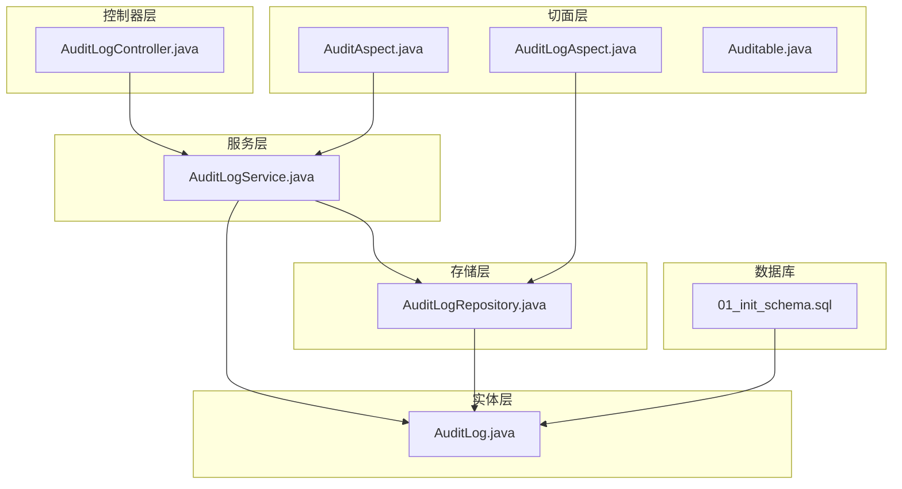
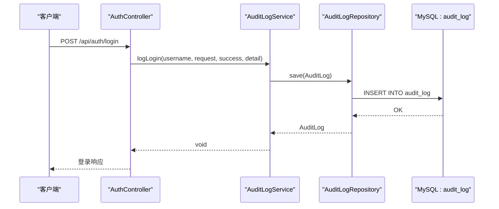
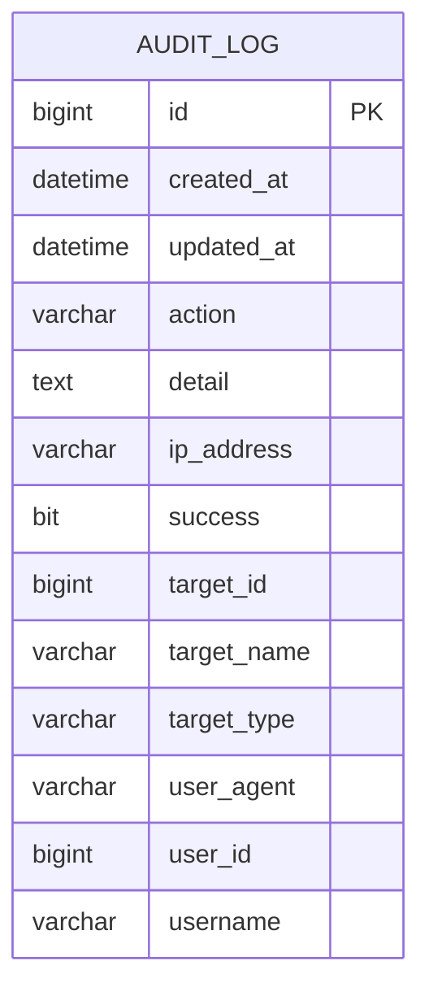
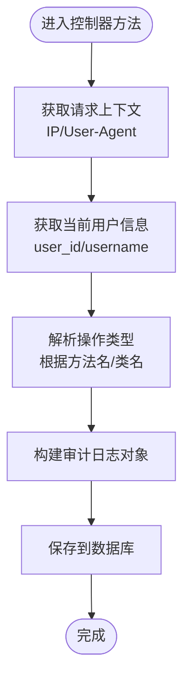
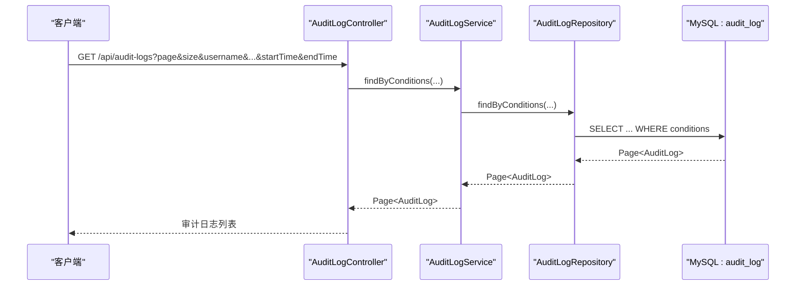
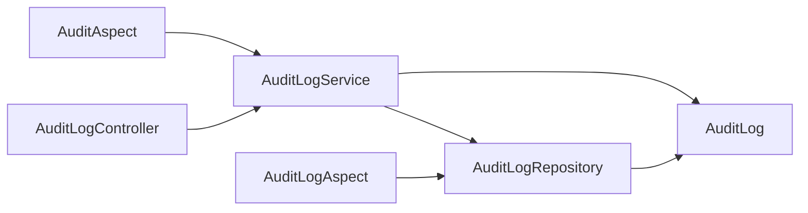

# 审计日志表 (audit_log)

<cite>
**本文引用的文件**
- [AuditLog.java](file://backend/src/main/java/com/fieldcheck/entity/AuditLog.java)
- [AuditLogRepository.java](file://backend/src/main/java/com/fieldcheck/repository/AuditLogRepository.java)
- [AuditLogService.java](file://backend/src/main/java/com/fieldcheck/service/AuditLogService.java)
- [AuditLogController.java](file://backend/src/main/java/com/fieldcheck/controller/AuditLogController.java)
- [AuditAspect.java](file://backend/src/main/java/com/fieldcheck/aspect/AuditAspect.java)
- [AuditLogAspect.java](file://backend/src/main/java/com/fieldcheck/aspect/AuditLogAspect.java)
- [Auditable.java](file://backend/src/main/java/com/fieldcheck/aspect/Auditable.java)
- [AuthController.java](file://backend/src/main/java/com/fieldcheck/controller/AuthController.java)
- [01_init_schema.sql](file://mysql/init/01_init_schema.sql)
</cite>

## 目录
1. [简介](#简介)
2. [项目结构](#项目结构)
3. [核心组件](#核心组件)
4. [架构总览](#架构总览)
5. [详细组件分析](#详细组件分析)
6. [依赖关系分析](#依赖关系分析)
7. [性能考量](#性能考量)
8. [故障排查指南](#故障排查指南)
9. [结论](#结论)
10. [附录](#附录)

## 简介
本文件系统化梳理审计日志表（audit_log）的设计与实现，覆盖字段定义、数据模型、收集机制、存储策略、查询与统计、清理与归档建议，以及在安全监控与合规中的作用。审计日志贯穿系统的关键业务操作，既支持自动化的切面采集，也支持显式的业务埋点，确保可追溯、可审计、可分析。

## 项目结构
审计日志相关代码主要分布在以下层次：
- 实体层：定义审计日志的数据模型与索引
- 存储层：基于 Spring Data JPA 的仓库接口
- 服务层：提供异步/同步写入、条件查询、登录专用记录等能力
- 控制器层：对外暴露审计日志查询接口
- 切面层：两大切面分别负责自动采集与注解式采集
- 数据库初始化：创建审计日志表及索引

图表来源
- [AuditLog.java](file://backend/src/main/java/com/fieldcheck/entity/AuditLog.java#L1-L54)
- [AuditLogRepository.java](file://backend/src/main/java/com/fieldcheck/repository/AuditLogRepository.java#L1-L29)
- [AuditLogService.java](file://backend/src/main/java/com/fieldcheck/service/AuditLogService.java#L1-L133)
- [AuditLogController.java](file://backend/src/main/java/com/fieldcheck/controller/AuditLogController.java#L1-L66)
- [AuditLogAspect.java](file://backend/src/main/java/com/fieldcheck/aspect/AuditLogAspect.java#L1-L241)
- [AuditAspect.java](file://backend/src/main/java/com/fieldcheck/aspect/AuditAspect.java#L1-L147)
- [Auditable.java](file://backend/src/main/java/com/fieldcheck/aspect/Auditable.java#L1-L39)
- [01_init_schema.sql](file://mysql/init/01_init_schema.sql#L23-L41)

章节来源
- [AuditLog.java](file://backend/src/main/java/com/fieldcheck/entity/AuditLog.java#L1-L54)
- [AuditLogRepository.java](file://backend/src/main/java/com/fieldcheck/repository/AuditLogRepository.java#L1-L29)
- [AuditLogService.java](file://backend/src/main/java/com/fieldcheck/service/AuditLogService.java#L1-L133)
- [AuditLogController.java](file://backend/src/main/java/com/fieldcheck/controller/AuditLogController.java#L1-L66)
- [AuditLogAspect.java](file://backend/src/main/java/com/fieldcheck/aspect/AuditLogAspect.java#L1-L241)
- [AuditAspect.java](file://backend/src/main/java/com/fieldcheck/aspect/AuditAspect.java#L1-L147)
- [Auditable.java](file://backend/src/main/java/com/fieldcheck/aspect/Auditable.java#L1-L39)
- [01_init_schema.sql](file://mysql/init/01_init_schema.sql#L23-L41)

## 核心组件
- 审计日志实体：定义字段、索引与默认值
- 仓库接口：提供按用户、条件分页查询
- 服务层：异步/同步写入、登录专用记录、IP/User-Agent解析、条件查询
- 控制器：提供审计日志列表、按用户查询、操作类型枚举
- 切面：两大切面分别覆盖自动采集与注解式采集
- 数据库初始化：创建表结构与索引

章节来源
- [AuditLog.java](file://backend/src/main/java/com/fieldcheck/entity/AuditLog.java#L1-L54)
- [AuditLogRepository.java](file://backend/src/main/java/com/fieldcheck/repository/AuditLogRepository.java#L1-L29)
- [AuditLogService.java](file://backend/src/main/java/com/fieldcheck/service/AuditLogService.java#L1-L133)
- [AuditLogController.java](file://backend/src/main/java/com/fieldcheck/controller/AuditLogController.java#L1-L66)
- [AuditLogAspect.java](file://backend/src/main/java/com/fieldcheck/aspect/AuditLogAspect.java#L1-L241)
- [AuditAspect.java](file://backend/src/main/java/com/fieldcheck/aspect/AuditAspect.java#L1-L147)
- [01_init_schema.sql](file://mysql/init/01_init_schema.sql#L23-L41)

## 架构总览
审计日志的采集与查询采用“控制器-服务-仓库-实体”的标准分层，并通过两个切面实现自动化采集：
- 自动切面：拦截控制器方法，自动推断操作类型、目标对象、IP/User-Agent等
- 注解切面：对标注@Auditable的方法进行统一记录，便于细粒度控制

图表来源
- [AuthController.java](file://backend/src/main/java/com/fieldcheck/controller/AuthController.java#L25-L36)
- [AuditLogService.java](file://backend/src/main/java/com/fieldcheck/service/AuditLogService.java#L57-L68)
- [AuditLogRepository.java](file://backend/src/main/java/com/fieldcheck/repository/AuditLogRepository.java#L1-L29)
- [01_init_schema.sql](file://mysql/init/01_init_schema.sql#L23-L41)

## 详细组件分析

### 数据模型与字段定义
审计日志表（audit_log）字段设计如下：
- 主键与时间戳：自增主键、创建/更新时间
- 用户标识：user_id、username
- 操作标识：action（如 LOGIN、CREATE、UPDATE、DELETE、EXECUTE、STOP、TEST、OPERATION 等）
- 目标对象：target_type（如 Connection、Task、Execution、RiskResult、WhitelistRule、AlertConfig、User、Auth）、target_id、target_name
- 详情与结果：detail（文本）、success（布尔）
- 网络信息：ip_address、user_agent

图表来源
- [AuditLog.java](file://backend/src/main/java/com/fieldcheck/entity/AuditLog.java#L21-L53)
- [01_init_schema.sql](file://mysql/init/01_init_schema.sql#L23-L41)

章节来源
- [AuditLog.java](file://backend/src/main/java/com/fieldcheck/entity/AuditLog.java#L1-L54)
- [01_init_schema.sql](file://mysql/init/01_init_schema.sql#L23-L41)

### 收集机制与存储策略
- 自动采集（AuditLogAspect）
  - 拦截控制器方法，自动推断操作类型与目标对象
  - 提取请求上下文中的 IP 与 User-Agent
  - 从安全上下文中获取当前用户信息
  - 统一保存到数据库
- 注解采集（AuditAspect + Auditable）
  - 对标注@Auditable的方法进行后置/异常时记录
  - 可指定 action、targetType、targetIdParam、targetNameParam、description 等
  - 通过 logAsync 异步写入，避免阻塞业务线程
- 登录专用记录（AuditLogService.logLogin）
  - 针对登录场景的快速记录，包含用户名、IP、UA、成功与否与附加详情

图表来源
- [AuditLogAspect.java](file://backend/src/main/java/com/fieldcheck/aspect/AuditLogAspect.java#L43-L115)

章节来源
- [AuditLogAspect.java](file://backend/src/main/java/com/fieldcheck/aspect/AuditLogAspect.java#L1-L241)
- [AuditAspect.java](file://backend/src/main/java/com/fieldcheck/aspect/AuditAspect.java#L1-L147)
- [Auditable.java](file://backend/src/main/java/com/fieldcheck/aspect/Auditable.java#L1-L39)
- [AuditLogService.java](file://backend/src/main/java/com/fieldcheck/service/AuditLogService.java#L57-L68)

### 不同类型操作的日志格式与内容规范
- 登录/登出
  - action: LOGIN/LOGOUT
  - detail: 包含“登录成功/失败”或“用户登出”
  - ip_address/user_agent: 来自请求头
- 增删改查
  - action: CREATE/UPDATE/DELETE/EXECUTE/STOP/TEST/OPERATION
  - target_type: 根据控制器类名推断（如 Connection、Task、Execution、RiskResult、WhitelistRule、AlertConfig、User、Auth）
  - target_id/name: 从参数或返回结果中提取
- 注解式操作
  - 由@Auditable注解显式指定 action、targetType、targetIdParam、targetNameParam、description
  - detail: 可包含模板与失败原因

章节来源
- [AuditLogController.java](file://backend/src/main/java/com/fieldcheck/controller/AuditLogController.java#L50-L64)
- [AuditLogAspect.java](file://backend/src/main/java/com/fieldcheck/aspect/AuditLogAspect.java#L142-L188)
- [AuditAspect.java](file://backend/src/main/java/com/fieldcheck/aspect/AuditAspect.java#L50-L66)
- [AuthController.java](file://backend/src/main/java/com/fieldcheck/controller/AuthController.java#L25-L54)

### 审计查询与统计分析
- 接口
  - GET /api/audit-logs：按用户名、操作类型、时间范围分页查询
  - GET /api/audit-logs/user/{userId}：按用户ID分页查询
  - GET /api/audit-logs/actions：返回可用的操作类型枚举
- 查询条件
  - username：模糊匹配
  - action：精确匹配
  - startTime/endTime：时间范围过滤
- 分页排序
  - 默认按创建时间降序

图表来源
- [AuditLogController.java](file://backend/src/main/java/com/fieldcheck/controller/AuditLogController.java#L23-L36)
- [AuditLogService.java](file://backend/src/main/java/com/fieldcheck/service/AuditLogService.java#L73-L78)
- [AuditLogRepository.java](file://backend/src/main/java/com/fieldcheck/repository/AuditLogRepository.java#L18-L27)

章节来源
- [AuditLogController.java](file://backend/src/main/java/com/fieldcheck/controller/AuditLogController.java#L1-L66)
- [AuditLogRepository.java](file://backend/src/main/java/com/fieldcheck/repository/AuditLogRepository.java#L1-L29)
- [AuditLogService.java](file://backend/src/main/java/com/fieldcheck/service/AuditLogService.java#L73-L86)

### 日志清理与归档策略
- 清理策略
  - 建议设置保留周期（如 90/180/365 天），到期自动删除
  - 可按 action 或用户维度定期清理
- 归档策略
  - 按月/季度导出历史数据至离线存储（如对象存储）
  - 导出前进行脱敏处理（如敏感字段掩码）
- 性能优化
  - 使用索引：idx_user_id、idx_action
  - 分表/分区：按时间列进行水平拆分
  - 冷热分离：近期活跃数据驻留热存储，历史数据迁移至冷存储

章节来源
- [01_init_schema.sql](file://mysql/init/01_init_schema.sql#L38-L41)

### 在安全监控与合规中的作用
- 安全监控
  - 身份认证审计：登录/登出、失败尝试、异常IP
  - 权限变更审计：用户角色、资源访问
  - 关键操作审计：增删改查、执行/停止、测试
- 合规要求
  - 完整性：不可篡改的审计轨迹
  - 可追溯：可按用户、时间、操作类型回溯
  - 可审计：满足内外部审计与监管要求

## 依赖关系分析
审计日志模块内部依赖清晰，遵循分层架构：
- 控制器依赖服务层
- 服务层依赖仓库与实体
- 仓库依赖实体
- 切面层独立于控制器，通过服务或仓库直接持久化

图表来源
- [AuditLogController.java](file://backend/src/main/java/com/fieldcheck/controller/AuditLogController.java#L1-L66)
- [AuditLogService.java](file://backend/src/main/java/com/fieldcheck/service/AuditLogService.java#L1-L133)
- [AuditLogRepository.java](file://backend/src/main/java/com/fieldcheck/repository/AuditLogRepository.java#L1-L29)
- [AuditLog.java](file://backend/src/main/java/com/fieldcheck/entity/AuditLog.java#L1-L54)
- [AuditLogAspect.java](file://backend/src/main/java/com/fieldcheck/aspect/AuditLogAspect.java#L1-L241)
- [AuditAspect.java](file://backend/src/main/java/com/fieldcheck/aspect/AuditAspect.java#L1-L147)

章节来源
- [AuditLogController.java](file://backend/src/main/java/com/fieldcheck/controller/AuditLogController.java#L1-L66)
- [AuditLogService.java](file://backend/src/main/java/com/fieldcheck/service/AuditLogService.java#L1-L133)
- [AuditLogRepository.java](file://backend/src/main/java/com/fieldcheck/repository/AuditLogRepository.java#L1-L29)
- [AuditLog.java](file://backend/src/main/java/com/fieldcheck/entity/AuditLog.java#L1-L54)
- [AuditLogAspect.java](file://backend/src/main/java/com/fieldcheck/aspect/AuditLogAspect.java#L1-L241)
- [AuditAspect.java](file://backend/src/main/java/com/fieldcheck/aspect/AuditAspect.java#L1-L147)

## 性能考量
- 异步写入：logAsync 使用异步注解，降低业务线程阻塞
- 索引优化：为 user_id 与 action 建立索引，提升查询效率
- 分页查询：默认按创建时间倒序，结合时间范围过滤
- 切面开销：自动切面会拦截所有控制器方法，需关注方法命名规范与排除规则

章节来源
- [AuditLogService.java](file://backend/src/main/java/com/fieldcheck/service/AuditLogService.java#L28-L38)
- [AuditLogAspect.java](file://backend/src/main/java/com/fieldcheck/aspect/AuditLogAspect.java#L33-L61)
- [01_init_schema.sql](file://mysql/init/01_init_schema.sql#L38-L41)

## 故障排查指南
- 写入失败
  - 现象：日志未入库，控制台报错
  - 排查：检查数据库连接、权限、表结构是否一致；查看服务层异常日志
- IP/User-Agent为空
  - 现象：ip_address 或 userAgent 为空
  - 排查：确认代理链配置与请求头传递；检查 getClientIp 方法逻辑
- 查询无结果
  - 现象：按条件查询不到数据
  - 排查：确认时间范围、action 是否正确；检查索引是否生效
- 登录审计缺失
  - 现象：登录成功/失败未记录
  - 排查：确认 AuthController 中是否调用了 logLogin；检查服务层异常捕获

章节来源
- [AuditLogService.java](file://backend/src/main/java/com/fieldcheck/service/AuditLogService.java#L35-L37)
- [AuditLogService.java](file://backend/src/main/java/com/fieldcheck/service/AuditLogService.java#L107-L131)
- [AuthController.java](file://backend/src/main/java/com/fieldcheck/controller/AuthController.java#L25-L54)

## 结论
审计日志表（audit_log）通过清晰的数据模型、完善的收集机制与灵活的查询接口，实现了对系统关键操作的全面追踪。两大切面覆盖自动与注解式采集，服务层提供异步写入与条件查询，控制器暴露统一的查询入口。配合合理的清理与归档策略，可在保障性能的同时满足安全监控与合规要求。

## 附录
- 操作类型枚举（来自接口返回）
  - LOGIN、LOGOUT、CREATE、UPDATE、DELETE、EXECUTE、STOP、TEST、OPERATION、CREATE_CONNECTION、UPDATE_CONNECTION、DELETE_CONNECTION、TEST_CONNECTION、CREATE_TASK、UPDATE_TASK、DELETE_TASK、EXECUTE_TASK、STOP_TASK、CREATE_WHITELIST、UPDATE_WHITELIST、DELETE_WHITELIST、CREATE_ALERT、UPDATE_ALERT、DELETE_ALERT、TEST_ALERT、CREATE_USER、UPDATE_USER、DELETE_USER、RESET_PASSWORD、UPDATE_RISK_STATUS

章节来源
- [AuditLogController.java](file://backend/src/main/java/com/fieldcheck/controller/AuditLogController.java#L50-L64)