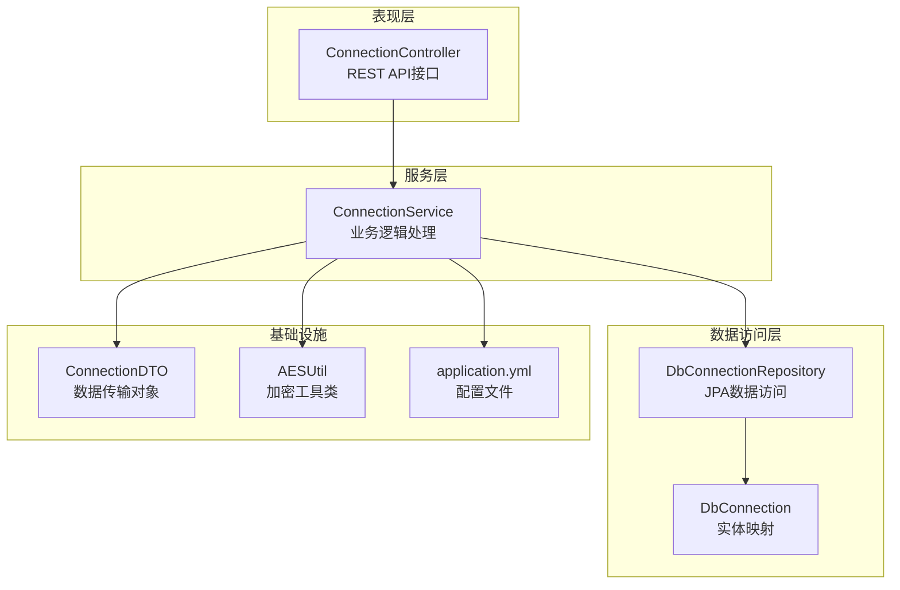
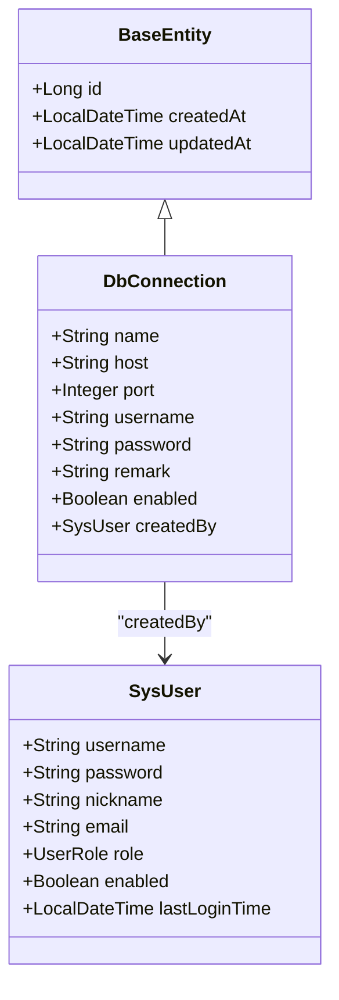
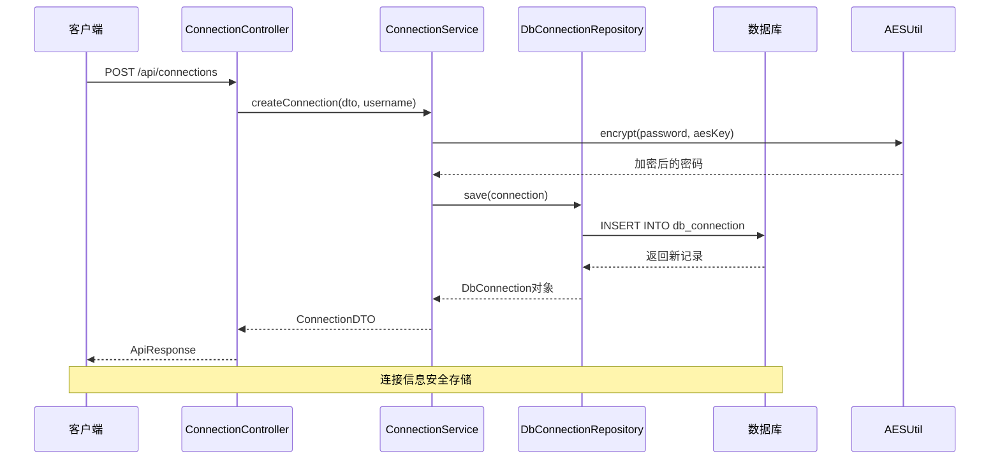
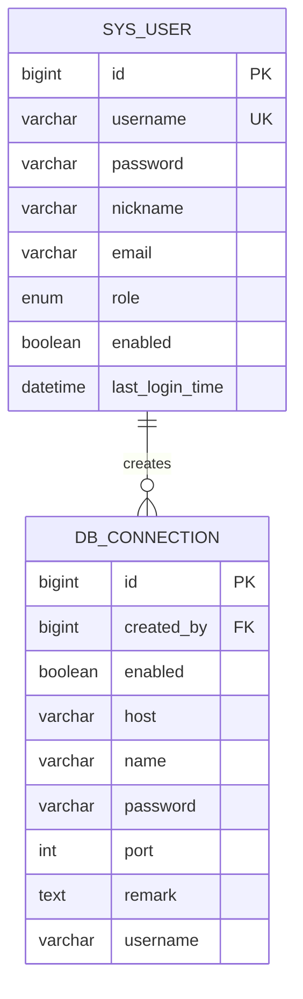
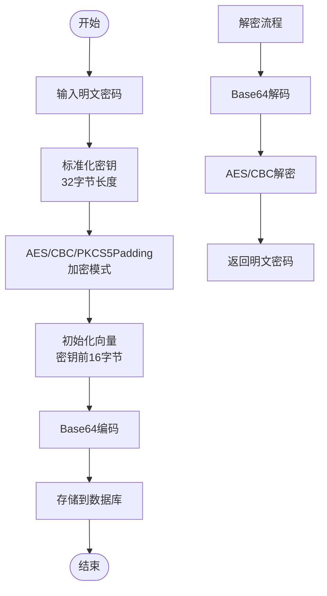
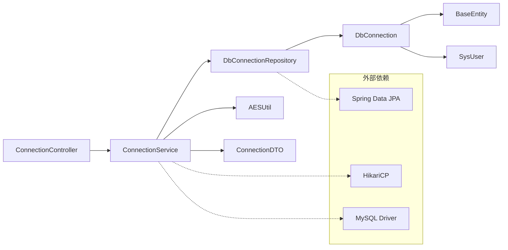
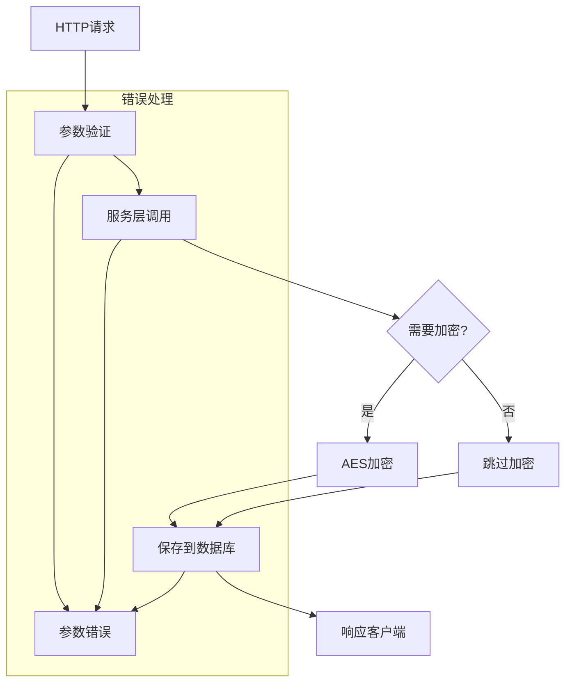
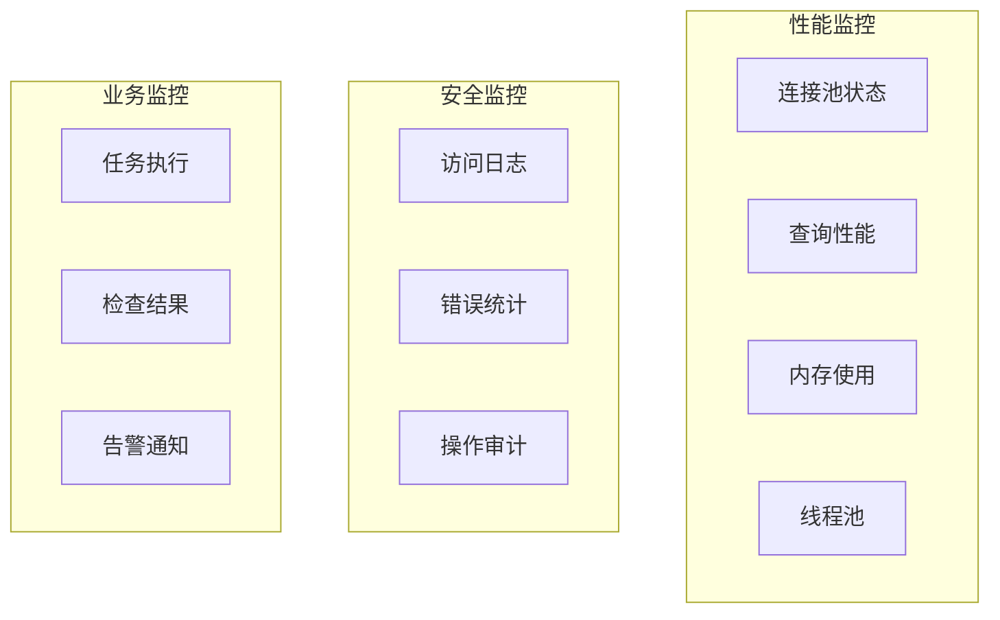
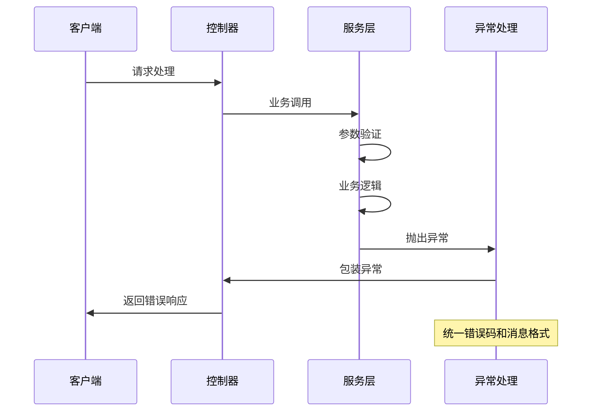

# 数据库连接表 (db_connection)

<cite>
**本文档引用的文件**
- [DbConnection.java](file://backend/src/main/java/com/fieldcheck/entity/DbConnection.java)
- [DbConnectionRepository.java](file://backend/src/main/java/com/fieldcheck/repository/DbConnectionRepository.java)
- [ConnectionService.java](file://backend/src/main/java/com/fieldcheck/service/ConnectionService.java)
- [ConnectionController.java](file://backend/src/main/java/com/fieldcheck/controller/ConnectionController.java)
- [ConnectionDTO.java](file://backend/src/main/java/com/fieldcheck/dto/ConnectionDTO.java)
- [AESUtil.java](file://backend/src/main/java/com/fieldcheck/util/AESUtil.java)
- [application.yml](file://backend/src/main/resources/application.yml)
- [BaseEntity.java](file://backend/src/main/java/com/fieldcheck/entity/BaseEntity.java)
- [SysUser.java](file://backend/src/main/java/com/fieldcheck/entity/SysUser.java)
- [01_init_schema.sql](file://mysql/init/01_init_schema.sql)
</cite>

## 目录
1. [简介](#简介)
2. [项目结构](#项目结构)
3. [核心组件](#核心组件)
4. [架构概览](#架构概览)
5. [详细组件分析](#详细组件分析)
6. [依赖关系分析](#依赖关系分析)
7. [性能考虑](#性能考虑)
8. [故障排除指南](#故障排除指南)
9. [结论](#结论)

## 简介

数据库连接表(db_connection)是MySQL字段容量风险检查平台中的核心配置表，用于存储和管理所有外部数据库连接信息。该表设计遵循企业级应用的安全性、可扩展性和可维护性要求，支持连接池管理、安全存储和审计追踪等功能。

## 项目结构

系统采用分层架构设计，db_connection表通过以下层次进行管理：



**图表来源**
- [ConnectionController.java](file://backend/src/main/java/com/fieldcheck/controller/ConnectionController.java#L18-L82)
- [ConnectionService.java](file://backend/src/main/java/com/fieldcheck/service/ConnectionService.java#L22-L127)
- [DbConnectionRepository.java](file://backend/src/main/java/com/fieldcheck/repository/DbConnectionRepository.java#L13-L27)

**章节来源**
- [ConnectionController.java](file://backend/src/main/java/com/fieldcheck/controller/ConnectionController.java#L1-L82)
- [ConnectionService.java](file://backend/src/main/java/com/fieldcheck/service/ConnectionService.java#L1-L127)
- [DbConnectionRepository.java](file://backend/src/main/java/com/fieldcheck/repository/DbConnectionRepository.java#L1-L27)

## 核心组件

### 实体模型设计

DbConnection实体类采用Lombok注解简化代码，继承BaseEntity实现审计功能：



**图表来源**
- [BaseEntity.java](file://backend/src/main/java/com/fieldcheck/entity/BaseEntity.java#L11-L28)
- [DbConnection.java](file://backend/src/main/java/com/fieldcheck/entity/DbConnection.java#L11-L47)
- [SysUser.java](file://backend/src/main/java/com/fieldcheck/entity/SysUser.java#L12-L44)

**章节来源**
- [DbConnection.java](file://backend/src/main/java/com/fieldcheck/entity/DbConnection.java#L1-L47)
- [BaseEntity.java](file://backend/src/main/java/com/fieldcheck/entity/BaseEntity.java#L1-L28)
- [SysUser.java](file://backend/src/main/java/com/fieldcheck/entity/SysUser.java#L1-L44)

## 架构概览

系统采用Spring Boot框架，db_connection表通过以下架构模式进行管理：



**图表来源**
- [ConnectionController.java](file://backend/src/main/java/com/fieldcheck/controller/ConnectionController.java#L47-L54)
- [ConnectionService.java](file://backend/src/main/java/com/fieldcheck/service/ConnectionService.java#L42-L63)
- [AESUtil.java](file://backend/src/main/java/com/fieldcheck/util/AESUtil.java#L15-L29)

## 详细组件分析

### 表结构设计原理

db_connection表采用标准的关系型数据库设计原则，确保数据完整性和查询效率：

| 字段名 | 数据类型 | 长度限制 | 约束条件 | 业务含义 |
|--------|----------|----------|----------|----------|
| id | BIGINT | - | 主键, 自增 | 连接记录唯一标识 |
| created_at | DATETIME | - | 非空, 不可更新 | 记录创建时间 |
| updated_at | DATETIME | - | 可空 | 记录最后更新时间 |
| enabled | BIT | - | 非空, 默认true | 连接是否启用 |
| host | VARCHAR | 255 | 非空 | 数据库主机地址 |
| name | VARCHAR | 100 | 非空 | 连接名称 |
| password | VARCHAR | 500 | 非空 | AES加密后的密码 |
| port | INT | - | 非空, 默认3306 | 数据库端口号 |
| remark | TEXT | - | 可空 | 备注说明 |
| username | VARCHAR | 100 | 非空 | 数据库用户名 |
| created_by | BIGINT | - | 外键, 可空 | 创建者用户ID |

**章节来源**
- [01_init_schema.sql](file://mysql/init/01_init_schema.sql#L69-L85)
- [DbConnection.java](file://backend/src/main/java/com/fieldcheck/entity/DbConnection.java#L20-L45)

### 字段级别注释说明

#### 基础字段
- **name**: 连接的业务标识符，用于区分不同的数据库连接
- **host**: 支持IPv4、IPv6和域名格式
- **port**: 默认3306，支持1-65535范围内的端口
- **username**: 数据库认证用户名
- **password**: AES-CBC加密存储，确保敏感信息安全

#### 业务控制字段
- **enabled**: 连接状态开关，默认启用
- **remark**: 业务用途说明，支持多行文本
- **created_by**: 外键关联到sys_user表，实现审计追踪

#### 审计字段
- **created_at/updated_at**: 自动维护的时间戳，基于BaseEntity基类

**章节来源**
- [DbConnection.java](file://backend/src/main/java/com/fieldcheck/entity/DbConnection.java#L20-L45)
- [BaseEntity.java](file://backend/src/main/java/com/fieldcheck/entity/BaseEntity.java#L20-L26)

### 外键关系设计



**图表来源**
- [01_init_schema.sql](file://mysql/init/01_init_schema.sql#L69-L85)
- [01_init_schema.sql](file://mysql/init/01_init_schema.sql#L112-L125)

**章节来源**
- [01_init_schema.sql](file://mysql/init/01_init_schema.sql#L69-L85)

### 连接池管理机制

系统采用HikariCP连接池，配置参数如下：

| 配置项 | 值 | 说明 |
|--------|-----|------|
| maximum-pool-size | 20 | 最大连接数 |
| minimum-idle | 5 | 最小空闲连接 |
| idle-timeout | 300000 | 空闲超时(ms) |
| connection-timeout | 20000 | 连接超时(ms) |
| max-lifetime | 1800000 | 连接最大生命周期(ms) |
| validation-timeout | 3000 | 验证超时(ms) |
| connection-test-query | SELECT 1 | 连接验证查询 |

**章节来源**
- [application.yml](file://backend/src/main/resources/application.yml#L13-L22)

### 安全存储机制

#### AES加密实现
系统使用AES-CBC模式进行密码加密，确保敏感信息在数据库中的安全存储：



**图表来源**
- [AESUtil.java](file://backend/src/main/java/com/fieldcheck/util/AESUtil.java#L15-L45)

**章节来源**
- [AESUtil.java](file://backend/src/main/java/com/fieldcheck/util/AESUtil.java#L1-L54)
- [ConnectionService.java](file://backend/src/main/java/com/fieldcheck/service/ConnectionService.java#L56-L76)

### API接口设计

系统提供完整的RESTful API用于db_connection表的操作：

| 方法 | 路径 | 权限 | 功能 |
|------|------|------|------|
| GET | /api/connections | 所有用户 | 分页查询连接列表 |
| GET | /api/connections/{id} | 所有用户 | 获取单个连接详情 |
| POST | /api/connections | ADMIN/USER | 创建新的数据库连接 |
| PUT | /api/connections/{id} | ADMIN/USER | 更新现有连接 |
| DELETE | /api/connections/{id} | ADMIN | 删除连接 |
| POST | /api/connections/test | 所有用户 | 测试连接可用性 |

**章节来源**
- [ConnectionController.java](file://backend/src/main/java/com/fieldcheck/controller/ConnectionController.java#L25-L80)

### 使用示例

#### 创建数据库连接
```json
{
  "name": "生产环境MySQL",
  "host": "prod-db.company.com",
  "port": 3306,
  "username": "monitor_user",
  "password": "encrypted_password_here",
  "remark": "用于生产环境监控",
  "enabled": true
}
```

#### 查询连接列表
```bash
curl -X GET "http://localhost:8080/api/connections?page=0&size=10&enabled=true"
```

#### 测试连接
```json
{
  "host": "test-db.company.com",
  "port": 3306,
  "username": "test_user",
  "password": "test_password"
}
```

**章节来源**
- [ConnectionDTO.java](file://backend/src/main/java/com/fieldcheck/dto/ConnectionDTO.java#L10-L34)
- [ConnectionController.java](file://backend/src/main/java/com/fieldcheck/controller/ConnectionController.java#L25-L80)

## 依赖关系分析

### 组件耦合度分析



**图表来源**
- [ConnectionController.java](file://backend/src/main/java/com/fieldcheck/controller/ConnectionController.java#L23-L24)
- [ConnectionService.java](file://backend/src/main/java/com/fieldcheck/service/ConnectionService.java#L27-L28)

**章节来源**
- [ConnectionService.java](file://backend/src/main/java/com/fieldcheck/service/ConnectionService.java#L1-L127)
- [DbConnectionRepository.java](file://backend/src/main/java/com/fieldcheck/repository/DbConnectionRepository.java#L1-L27)

### 数据流分析



**图表来源**
- [ConnectionService.java](file://backend/src/main/java/com/fieldcheck/service/ConnectionService.java#L42-L84)
- [ConnectionDTO.java](file://backend/src/main/java/com/fieldcheck/dto/ConnectionDTO.java#L14-L23)

**章节来源**
- [ConnectionService.java](file://backend/src/main/java/com/fieldcheck/service/ConnectionService.java#L42-L108)

## 性能考虑

### 查询优化策略

1. **索引设计**
   - 主键索引：自动创建
   - created_by外键索引：支持快速关联查询
   - 建议添加：name字段索引用于模糊查询

2. **分页查询**
   - 默认按创建时间倒序排列
   - 支持条件过滤：name、enabled
   - 合理设置page和size参数

3. **连接池优化**
   - 根据并发需求调整maximum-pool-size
   - 监控连接池利用率和等待时间
   - 定期清理长时间未使用的连接

### 缓存策略

- **连接信息缓存**：对常用连接信息进行短期缓存
- **用户权限缓存**：减少重复的权限验证开销
- **配置参数缓存**：避免频繁读取配置文件

### 监控指标



## 故障排除指南

### 常见问题及解决方案

#### 连接测试失败
**症状**：POST /api/connections/test 返回false或抛出异常
**可能原因**：
- 网络连接问题
- 认证信息错误
- 数据库服务不可用
- 防火墙阻断

**解决步骤**：
1. 检查网络连通性
2. 验证用户名密码
3. 确认数据库服务状态
4. 检查防火墙规则

#### 密码解密失败
**症状**：无法获取原始密码
**可能原因**：
- AES密钥不匹配
- 数据损坏
- 编码问题

**解决方法**：
1. 确认encryption.aes-key配置正确
2. 检查数据库中密码字段完整性
3. 重新创建连接记录

#### 权限不足
**症状**：403 Forbidden错误
**解决方法**：
- 确认用户角色为ADMIN或USER
- 检查JWT令牌有效性
- 重新登录获取新令牌

**章节来源**
- [ConnectionService.java](file://backend/src/main/java/com/fieldcheck/service/ConnectionService.java#L92-L108)
- [ConnectionController.java](file://backend/src/main/java/com/fieldcheck/controller/ConnectionController.java#L48-L67)

### 错误处理机制

系统采用统一的异常处理策略：



**图表来源**
- [ConnectionService.java](file://backend/src/main/java/com/fieldcheck/service/ConnectionService.java#L38-L40)

## 结论

db_connection表作为MySQL字段容量风险检查平台的核心配置表，体现了现代企业级应用的设计理念：

1. **安全性优先**：采用AES加密存储敏感信息，配合JWT认证机制
2. **可扩展性**：支持动态连接管理和灵活的查询接口
3. **可观测性**：完善的审计追踪和监控指标
4. **易维护性**：清晰的分层架构和标准化的数据模型

通过合理的配置和最佳实践，该表能够有效支撑整个平台的数据库连接管理需求，为用户提供安全、可靠、高效的数据库监控服务。