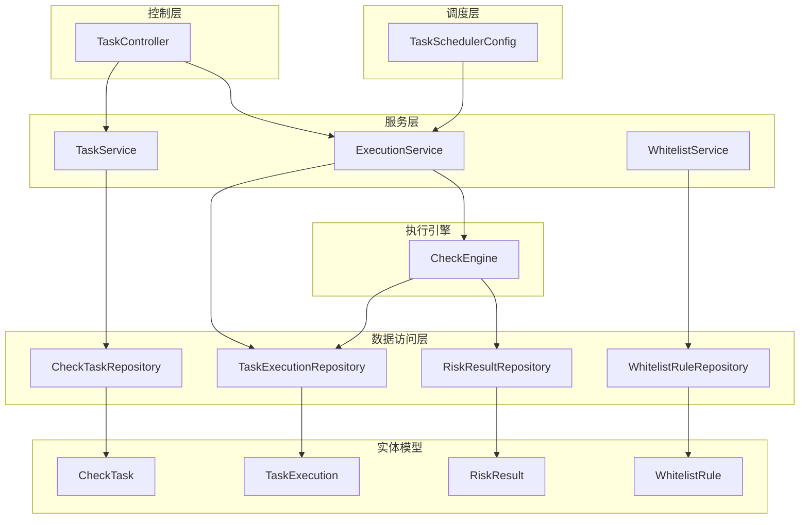
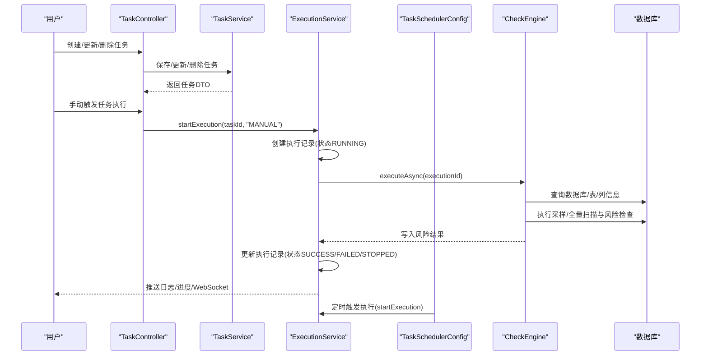
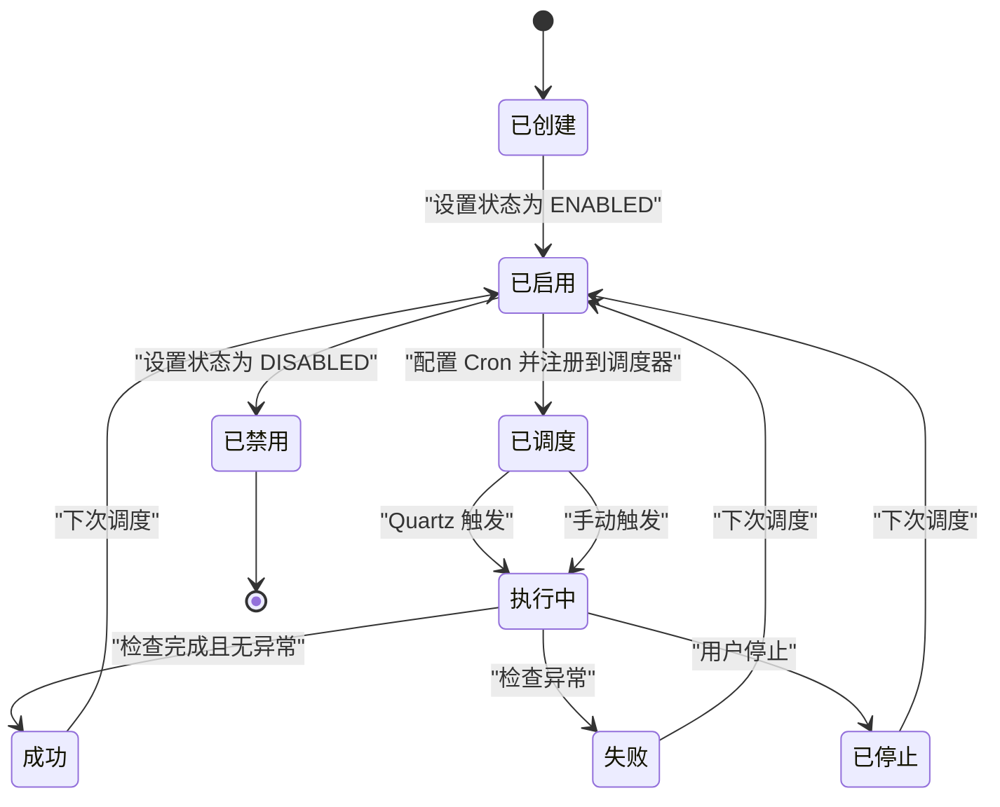
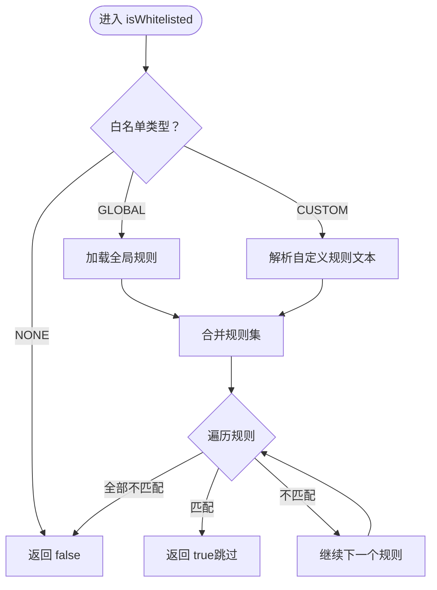
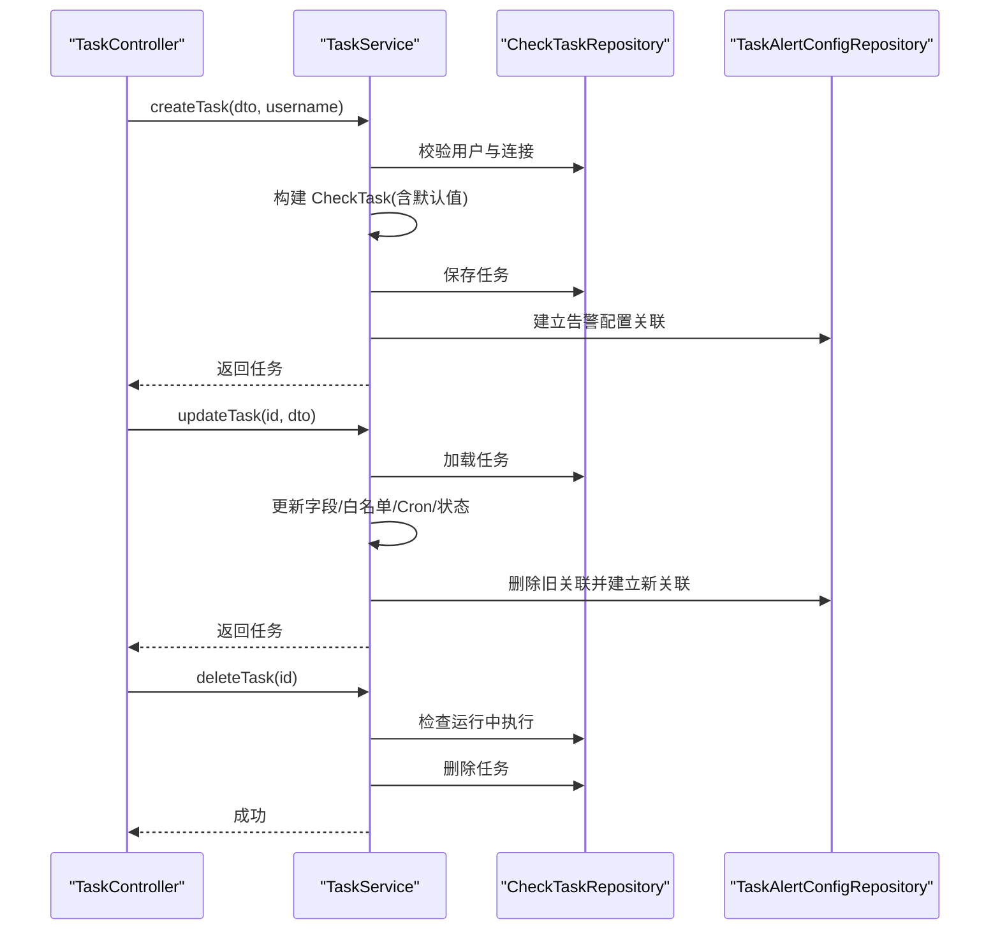
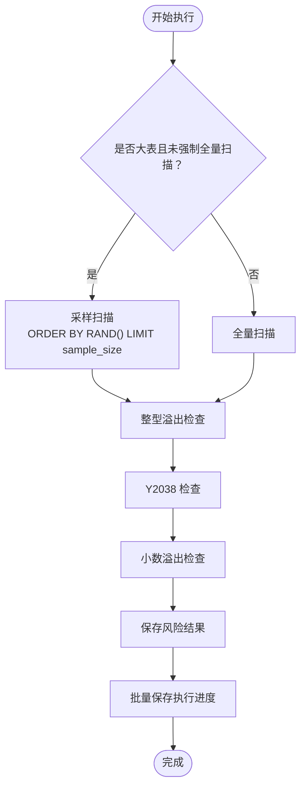
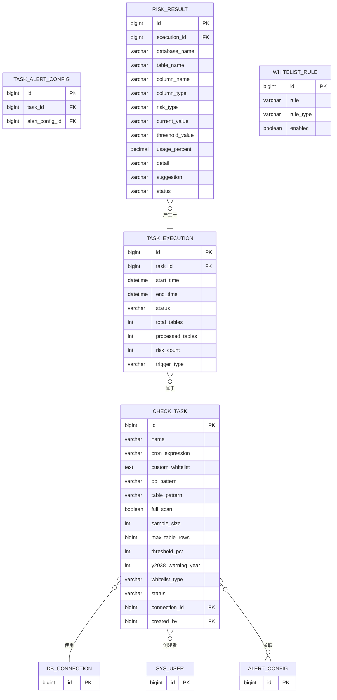
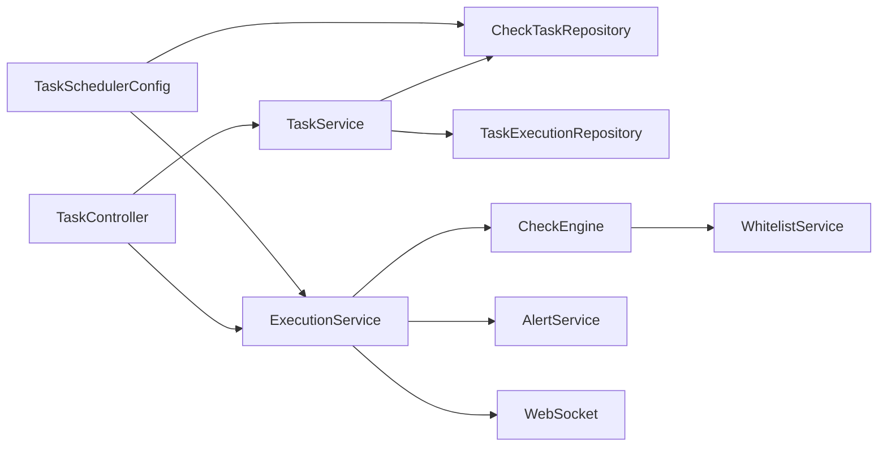

# 检查任务表 (check_task)

<cite>
**本文引用的文件**
- [CheckTask.java](file://backend/src/main/java/com/fieldcheck/entity/CheckTask.java)
- [CheckTaskRepository.java](file://backend/src/main/java/com/fieldcheck/repository/CheckTaskRepository.java)
- [TaskService.java](file://backend/src/main/java/com/fieldcheck/service/TaskService.java)
- [TaskController.java](file://backend/src/main/java/com/fieldcheck/controller/TaskController.java)
- [CheckEngine.java](file://backend/src/main/java/com/fieldcheck/engine/CheckEngine.java)
- [TaskSchedulerConfig.java](file://backend/src/main/java/com/fieldcheck/scheduler/TaskSchedulerConfig.java)
- [ExecutionService.java](file://backend/src/main/java/com/fieldcheck/service/ExecutionService.java)
- [TaskExecution.java](file://backend/src/main/java/com/fieldcheck/entity/TaskExecution.java)
- [RiskResult.java](file://backend/src/main/java/com/fieldcheck/entity/RiskResult.java)
- [TaskStatus.java](file://backend/src/main/java/com/fieldcheck/entity/TaskStatus.java)
- [WhitelistType.java](file://backend/src/main/java/com/fieldcheck/entity/WhitelistType.java)
- [WhitelistService.java](file://backend/src/main/java/com/fieldcheck/service/WhitelistService.java)
- [WhitelistRule.java](file://backend/src/main/java/com/fieldcheck/entity/WhitelistRule.java)
- [TaskDTO.java](file://backend/src/main/java/com/fieldcheck/dto/TaskDTO.java)
- [01_init_schema.sql](file://mysql/init/01_init_schema.sql)
</cite>

## 目录
1. [简介](#简介)
2. [项目结构](#项目结构)
3. [核心组件](#核心组件)
4. [架构总览](#架构总览)
5. [详细组件分析](#详细组件分析)
6. [依赖关系分析](#依赖关系分析)
7. [性能考量](#性能考量)
8. [故障排查指南](#故障排查指南)
9. [结论](#结论)
10. [附录](#附录)

## 简介
本文件围绕“检查任务表 (check_task)”进行系统化说明，覆盖任务配置参数、状态管理与调度机制、白名单与自定义白名单使用方式、任务生命周期（创建/修改/删除）、执行策略与性能影响，以及与相关表的关联关系与数据一致性保障。

## 项目结构
后端采用 Spring Boot + JPA 的分层架构，check_task 作为核心实体之一，贯穿于控制器、服务、仓库、调度器与执行引擎之间，形成完整的任务编排与执行闭环。

图表来源
- [TaskController.java](file://backend/src/main/java/com/fieldcheck/controller/TaskController.java#L22-L99)
- [TaskService.java](file://backend/src/main/java/com/fieldcheck/service/TaskService.java#L21-L177)
- [ExecutionService.java](file://backend/src/main/java/com/fieldcheck/service/ExecutionService.java#L34-L307)
- [CheckEngine.java](file://backend/src/main/java/com/fieldcheck/engine/CheckEngine.java#L26-L493)
- [TaskSchedulerConfig.java](file://backend/src/main/java/com/fieldcheck/scheduler/TaskSchedulerConfig.java#L20-L95)
- [CheckTaskRepository.java](file://backend/src/main/java/com/fieldcheck/repository/CheckTaskRepository.java#L14-L30)
- [CheckTask.java](file://backend/src/main/java/com/fieldcheck/entity/CheckTask.java#L20-L75)
- [TaskExecution.java](file://backend/src/main/java/com/fieldcheck/entity/TaskExecution.java#L19-L58)
- [RiskResult.java](file://backend/src/main/java/com/fieldcheck/entity/RiskResult.java#L23-L68)
- [WhitelistRule.java](file://backend/src/main/java/com/fieldcheck/entity/WhitelistRule.java#L18-L34)

章节来源
- [TaskController.java](file://backend/src/main/java/com/fieldcheck/controller/TaskController.java#L22-L99)
- [TaskService.java](file://backend/src/main/java/com/fieldcheck/service/TaskService.java#L21-L177)
- [CheckEngine.java](file://backend/src/main/java/com/fieldcheck/engine/CheckEngine.java#L26-L493)
- [TaskSchedulerConfig.java](file://backend/src/main/java/com/fieldcheck/scheduler/TaskSchedulerConfig.java#L20-L95)

## 核心组件
- 实体 CheckTask：定义任务配置与元数据，包括 Cron 表达式、数据库/表模式、采样大小、阈值百分比、大表阈值、Y2038 告警年份、白名单类型与自定义白名单内容、任务状态等。
- 仓库 CheckTaskRepository：提供按条件分页查询、查找启用且配置了 Cron 的任务等能力。
- 服务 TaskService：封装任务的创建、更新、删除与 DTO 转换逻辑，并维护任务与告警配置的关联。
- 控制器 TaskController：对外暴露任务的增删改查与手动触发执行、查看执行历史等接口。
- 执行引擎 CheckEngine：负责实际的数据库扫描、列检查、风险识别与结果落库。
- 执行服务 ExecutionService：负责执行记录的创建、异步执行、进度与日志推送、告警发送与停止控制。
- 调度器 TaskSchedulerConfig：基于 Quartz 将任务与 Cron 表达式绑定，实现定时触发。
- 白名单服务 WhitelistService：根据任务的白名单类型（全局/自定义）与规则进行匹配，决定跳过检查的对象。

章节来源
- [CheckTask.java](file://backend/src/main/java/com/fieldcheck/entity/CheckTask.java#L20-L75)
- [CheckTaskRepository.java](file://backend/src/main/java/com/fieldcheck/repository/CheckTaskRepository.java#L14-L30)
- [TaskService.java](file://backend/src/main/java/com/fieldcheck/service/TaskService.java#L21-L177)
- [TaskController.java](file://backend/src/main/java/com/fieldcheck/controller/TaskController.java#L22-L99)
- [CheckEngine.java](file://backend/src/main/java/com/fieldcheck/engine/CheckEngine.java#L26-L493)
- [ExecutionService.java](file://backend/src/main/java/com/fieldcheck/service/ExecutionService.java#L34-L307)
- [TaskSchedulerConfig.java](file://backend/src/main/java/com/fieldcheck/scheduler/TaskSchedulerConfig.java#L20-L95)
- [WhitelistService.java](file://backend/src/main/java/com/fieldcheck/service/WhitelistService.java#L22-L153)

## 架构总览
下图展示从任务创建到执行、调度、日志与告警的整体流程。

图表来源
- [TaskController.java](file://backend/src/main/java/com/fieldcheck/controller/TaskController.java#L49-L97)
- [TaskService.java](file://backend/src/main/java/com/fieldcheck/service/TaskService.java#L43-L140)
- [ExecutionService.java](file://backend/src/main/java/com/fieldcheck/service/ExecutionService.java#L107-L210)
- [TaskSchedulerConfig.java](file://backend/src/main/java/com/fieldcheck/scheduler/TaskSchedulerConfig.java#L77-L93)
- [CheckEngine.java](file://backend/src/main/java/com/fieldcheck/engine/CheckEngine.java#L57-L165)

## 详细组件分析

### 任务配置参数详解
- 名称：任务标识名，必填。
- 数据库模式 (db_pattern)：支持逗号分隔的多个模式，以及通配符匹配（点与星号等），用于筛选需要检查的数据库集合。
- 表模式 (table_pattern)：同上，用于筛选目标表集合。
- 全量扫描 (full_scan)：布尔值，当表行数超过阈值时，是否强制全量扫描而非采样。
- 抽样大小 (sample_size)：整型，默认值为 1000；在大表采样场景下决定随机抽样的样本数量。
- 大表阈值 (max_table_rows)：长整型，默认 100 万；超过该阈值的表在非强制全量扫描时采用采样。
- 阈值百分比 (threshold_pct)：整型，默认 90；用于判断整型/小数使用率是否达到风险阈值。
- Y2038 告警年份 (y2038_warning_year)：整型，默认 2030；TIMESTAMP 最大值对应的年份阈值。
- 白名单类型 (whitelist_type)：枚举，NONE/GLOBAL/CUSTOM。
- 自定义白名单 (custom_whitelist)：文本块，逐行书写规则，支持注释（以 # 开头）。
- Cron 表达式 (cron_expression)：字符串，配置定时执行计划。
- 任务状态 (status)：枚举 ENABLED/DISABLED，仅启用的任务会被调度。

章节来源
- [CheckTask.java](file://backend/src/main/java/com/fieldcheck/entity/CheckTask.java#L22-L69)
- [TaskDTO.java](file://backend/src/main/java/com/fieldcheck/dto/TaskDTO.java#L12-L47)
- [01_init_schema.sql](file://mysql/init/01_init_schema.sql#L43-L67)

### 任务状态管理与调度机制
- 状态枚举：TaskStatus 提供 ENABLED/DISABLED。
- 启用任务的加载：应用启动时，调度器会读取所有启用且配置了 Cron 的任务并注册到 Quartz。
- 定时触发：Quartz Job 通过 ExecutionService.startExecution 启动一次执行。
- 手动触发：TaskController 支持手动触发执行，同样走 ExecutionService 流程。
- 执行状态：TaskExecution.status 支持 PENDING/RUNNING/SUCCESS/FAILED/STOPPED。

图表来源
- [TaskStatus.java](file://backend/src/main/java/com/fieldcheck/entity/TaskStatus.java#L3-L6)
- [ExecutionStatus.java](file://backend/src/main/java/com/fieldcheck/entity/ExecutionStatus.java#L3-L9)
- [TaskSchedulerConfig.java](file://backend/src/main/java/com/fieldcheck/scheduler/TaskSchedulerConfig.java#L25-L36)
- [ExecutionService.java](file://backend/src/main/java/com/fieldcheck/service/ExecutionService.java#L107-L163)

章节来源
- [TaskStatus.java](file://backend/src/main/java/com/fieldcheck/entity/TaskStatus.java#L3-L6)
- [ExecutionStatus.java](file://backend/src/main/java/com/fieldcheck/entity/ExecutionStatus.java#L3-L9)
- [TaskSchedulerConfig.java](file://backend/src/main/java/com/fieldcheck/scheduler/TaskSchedulerConfig.java#L25-L36)
- [ExecutionService.java](file://backend/src/main/java/com/fieldcheck/service/ExecutionService.java#L107-L163)

### 白名单配置与自定义白名单
- 白名单类型：
  - NONE：不使用任何白名单。
  - GLOBAL：使用全局白名单规则集合。
  - CUSTOM：使用任务级自定义白名单文本。
- 规则格式：
  - 支持三级粒度：数据库、表、字段；使用点号分隔。
  - 支持通配符：星号匹配任意字符序列，问号匹配单个字符。
  - 自定义白名单支持注释行（以 # 开头），空行将被忽略。
- 匹配逻辑：
  - 优先合并规则集（全局或自定义），然后对每个规则进行模式匹配。
  - 若任一规则命中，则该对象（库/表/字段）被跳过检查。
- 规则检测：自动根据点号数量推断规则类型（数据库/表/字段）。

图表来源
- [WhitelistService.java](file://backend/src/main/java/com/fieldcheck/service/WhitelistService.java#L66-L89)
- [WhitelistService.java](file://backend/src/main/java/com/fieldcheck/service/WhitelistService.java#L91-L104)
- [WhitelistService.java](file://backend/src/main/java/com/fieldcheck/service/WhitelistService.java#L106-L140)
- [WhitelistType.java](file://backend/src/main/java/com/fieldcheck/entity/WhitelistType.java#L3-L7)

章节来源
- [WhitelistService.java](file://backend/src/main/java/com/fieldcheck/service/WhitelistService.java#L22-L153)
- [WhitelistRule.java](file://backend/src/main/java/com/fieldcheck/entity/WhitelistRule.java#L18-L34)
- [WhitelistType.java](file://backend/src/main/java/com/fieldcheck/entity/WhitelistType.java#L3-L7)

### 任务创建、修改、删除业务流程
- 创建流程：
  - 校验用户与数据库连接存在性。
  - 组装 CheckTask 对象（默认值填充）。
  - 保存任务并建立与告警配置的关联关系。
- 修改流程：
  - 加载现有任务，按需更新字段。
  - 可替换告警配置关联（先删后建）。
- 删除流程：
  - 检查是否存在运行中的执行记录，若有则拒绝删除。
  - 否则删除任务。

图表来源
- [TaskController.java](file://backend/src/main/java/com/fieldcheck/controller/TaskController.java#L49-L72)
- [TaskService.java](file://backend/src/main/java/com/fieldcheck/service/TaskService.java#L43-L140)

章节来源
- [TaskController.java](file://backend/src/main/java/com/fieldcheck/controller/TaskController.java#L49-L72)
- [TaskService.java](file://backend/src/main/java/com/fieldcheck/service/TaskService.java#L43-L140)

### 任务执行策略与性能影响
- 扫描策略：
  - 大表判定：当表行数大于 max_table_rows 且未开启 full_scan 时，采用采样扫描。
  - 采样 SQL：对目标列执行 ORDER BY RAND() LIMIT sample_size。
  - 非大表：全量扫描。
- 风险检查类型：
  - 整型溢出：基于列类型最大值计算使用率，超过 threshold_pct 即标记风险。
  - Y2038：针对 TIMESTAMP 列，若最大时间达到或超过 y2038_warning_year，则标记风险。
  - 小数溢出：基于数值精度与标度计算允许的最大绝对值，超过 threshold_pct 即标记风险。
- 性能优化：
  - 进度批量落库：每处理若干张表统一保存一次执行记录，减少写放大。
  - 日志与 WebSocket：边执行边推送日志，便于前端实时反馈。
  - 异步执行：通过 @Async 与线程池隔离执行，避免阻塞请求线程。
- 资源占用：
  - 大表采样可显著降低 CPU 与 IO 压力；但采样可能引入统计偏差，建议在高精度需求场景关闭 full_scan 并适当提高 sample_size。
  - Y2038 与小数溢出检查为 O(n) 扫描，采样时成本可控。

图表来源
- [CheckEngine.java](file://backend/src/main/java/com/fieldcheck/engine/CheckEngine.java#L101-L104)
- [CheckEngine.java](file://backend/src/main/java/com/fieldcheck/engine/CheckEngine.java#L299-L303)
- [CheckEngine.java](file://backend/src/main/java/com/fieldcheck/engine/CheckEngine.java#L318-L336)
- [CheckEngine.java](file://backend/src/main/java/com/fieldcheck/engine/CheckEngine.java#L349-L369)
- [CheckEngine.java](file://backend/src/main/java/com/fieldcheck/engine/CheckEngine.java#L390-L410)
- [CheckEngine.java](file://backend/src/main/java/com/fieldcheck/engine/CheckEngine.java#L151-L157)

章节来源
- [CheckEngine.java](file://backend/src/main/java/com/fieldcheck/engine/CheckEngine.java#L101-L104)
- [CheckEngine.java](file://backend/src/main/java/com/fieldcheck/engine/CheckEngine.java#L299-L303)
- [CheckEngine.java](file://backend/src/main/java/com/fieldcheck/engine/CheckEngine.java#L318-L336)
- [CheckEngine.java](file://backend/src/main/java/com/fieldcheck/engine/CheckEngine.java#L349-L369)
- [CheckEngine.java](file://backend/src/main/java/com/fieldcheck/engine/CheckEngine.java#L390-L410)
- [CheckEngine.java](file://backend/src/main/java/com/fieldcheck/engine/CheckEngine.java#L151-L157)

### 与其他表的关联关系与数据一致性
- 关联关系：
  - check_task → db_connection：多对一，任务绑定一个数据库连接。
  - check_task → sys_user（created_by）：多对一，记录创建者。
  - check_task ↔ alert_config：多对多（通过中间表 task_alert_config 关联）。
  - task_execution → check_task：一对多，一次任务执行对应一个任务。
  - risk_result → task_execution：一对多，一次执行产生多条风险结果。
  - whitelist_rule：全局白名单规则，由 WhitelistService 统一管理。
- 约束与索引：
  - 外键约束确保引用完整性。
  - 索引覆盖常见查询路径，如 risk_result.idx_execution_id、idx_risk_type、idx_status。
- 一致性保障：
  - 事务包裹执行记录创建与风险结果保存，避免部分写入。
  - 执行状态机严格控制并发执行与停止操作。
  - 删除任务前校验执行状态，防止破坏执行数据。

图表来源
- [01_init_schema.sql](file://mysql/init/01_init_schema.sql#L43-L67)
- [01_init_schema.sql](file://mysql/init/01_init_schema.sql#L69-L85)
- [01_init_schema.sql](file://mysql/init/01_init_schema.sql#L127-L135)
- [01_init_schema.sql](file://mysql/init/01_init_schema.sql#L137-L155)
- [01_init_schema.sql](file://mysql/init/01_init_schema.sql#L157-L167)
- [CheckTask.java](file://backend/src/main/java/com/fieldcheck/entity/CheckTask.java#L25-L73)
- [TaskExecution.java](file://backend/src/main/java/com/fieldcheck/entity/TaskExecution.java#L21-L57)
- [RiskResult.java](file://backend/src/main/java/com/fieldcheck/entity/RiskResult.java#L25-L67)
- [WhitelistRule.java](file://backend/src/main/java/com/fieldcheck/entity/WhitelistRule.java#L18-L34)

章节来源
- [01_init_schema.sql](file://mysql/init/01_init_schema.sql#L43-L67)
- [CheckTask.java](file://backend/src/main/java/com/fieldcheck/entity/CheckTask.java#L25-L73)
- [TaskExecution.java](file://backend/src/main/java/com/fieldcheck/entity/TaskExecution.java#L21-L57)
- [RiskResult.java](file://backend/src/main/java/com/fieldcheck/entity/RiskResult.java#L25-L67)
- [WhitelistRule.java](file://backend/src/main/java/com/fieldcheck/entity/WhitelistRule.java#L18-L34)

## 依赖关系分析
- 组件耦合：
  - TaskController 依赖 TaskService 与 ExecutionService。
  - TaskService 依赖多个仓库与 TaskAlertConfig 关联表。
  - ExecutionService 依赖 CheckEngine、AlertService、WebSocket 模板与 TaskService。
  - CheckEngine 依赖 ConnectionService、WhitelistService、风险与执行仓库。
  - TaskSchedulerConfig 依赖 Scheduler 与 CheckTaskRepository。
- 外部依赖：
  - Quartz：任务调度。
  - WebSocket：实时日志推送。
  - MySQL：执行期间的 information_schema 查询与数据扫描。

图表来源
- [TaskController.java](file://backend/src/main/java/com/fieldcheck/controller/TaskController.java#L27-L28)
- [TaskService.java](file://backend/src/main/java/com/fieldcheck/service/TaskService.java#L23-L28)
- [ExecutionService.java](file://backend/src/main/java/com/fieldcheck/service/ExecutionService.java#L37-L47)
- [CheckEngine.java](file://backend/src/main/java/com/fieldcheck/engine/CheckEngine.java#L28-L32)
- [TaskSchedulerConfig.java](file://backend/src/main/java/com/fieldcheck/scheduler/TaskSchedulerConfig.java#L22-L23)

章节来源
- [TaskController.java](file://backend/src/main/java/com/fieldcheck/controller/TaskController.java#L27-L28)
- [TaskService.java](file://backend/src/main/java/com/fieldcheck/service/TaskService.java#L23-L28)
- [ExecutionService.java](file://backend/src/main/java/com/fieldcheck/service/ExecutionService.java#L37-L47)
- [CheckEngine.java](file://backend/src/main/java/com/fieldcheck/engine/CheckEngine.java#L28-L32)
- [TaskSchedulerConfig.java](file://backend/src/main/java/com/fieldcheck/scheduler/TaskSchedulerConfig.java#L22-L23)

## 性能考量
- 采样策略：在大表场景下显著降低 CPU 与 IO；建议结合业务重要性权衡精度与性能。
- 批量进度保存：减少频繁写入，提升吞吐。
- 异步执行：避免阻塞 Web 线程，提升响应速度。
- 日志写盘：按级别输出，避免高频刷盘；WebSocket 推送与文件写入并存。
- 数据库查询：利用 information_schema 快速定位目标库/表/列，注意在超大规模实例下的查询开销。

## 故障排查指南
- 任务无法删除：若存在运行中的执行记录，服务会抛出异常阻止删除。请等待执行结束或停止后再试。
- 任务重复执行：内存缓存 runningTasks 用于防重，若服务器重启导致状态不一致，服务会在启动时清理异常状态并恢复一致性。
- 手动停止任务：调用停止接口后，服务会将 RUNNING 状态置为 STOPPED 并结束执行。
- Cron 未生效：确认任务状态为 ENABLED 且 cron_expression 非空；应用启动时会重新加载启用任务的调度。
- 风险误报/漏报：
  - 采样不足：提高 sample_size 或关闭 full_scan。
  - 阈值过高/过低：调整 threshold_pct。
  - 白名单误伤：检查白名单规则与注释行，确认规则粒度与通配符使用正确。

章节来源
- [TaskService.java](file://backend/src/main/java/com/fieldcheck/service/TaskService.java#L131-L140)
- [ExecutionService.java](file://backend/src/main/java/com/fieldcheck/service/ExecutionService.java#L113-L131)
- [ExecutionService.java](file://backend/src/main/java/com/fieldcheck/service/ExecutionService.java#L212-L224)
- [TaskSchedulerConfig.java](file://backend/src/main/java/com/fieldcheck/scheduler/TaskSchedulerConfig.java#L25-L36)
- [CheckEngine.java](file://backend/src/main/java/com/fieldcheck/engine/CheckEngine.java#L300-L303)

## 结论
check_task 是整个风险检查系统的核心配置载体，通过灵活的模式匹配、阈值与采样策略、白名单机制与 Quartz 调度，实现了对大规模数据库的高效扫描与风险识别。配合完善的执行状态管理、日志与告警体系，能够在保证性能的同时提供可靠的可观测性与可运维性。

## 附录
- 参数默认值参考：
  - sample_size：1000
  - max_table_rows：1000000
  - threshold_pct：90
  - y2038_warning_year：2030
  - full_scan：false
  - whitelist_type：NONE
- 常见问题速查：
  - 如何快速跳过某些表/字段？在任务中配置白名单类型为 GLOBAL 或 CUSTOM，并编写相应规则。
  - 如何避免大表全量扫描？保持 full_scan=false 并合理设置 max_table_rows 与 sample_size。
  - 如何查看执行日志？通过 WebSocket 订阅执行日志通道或读取本地日志文件。