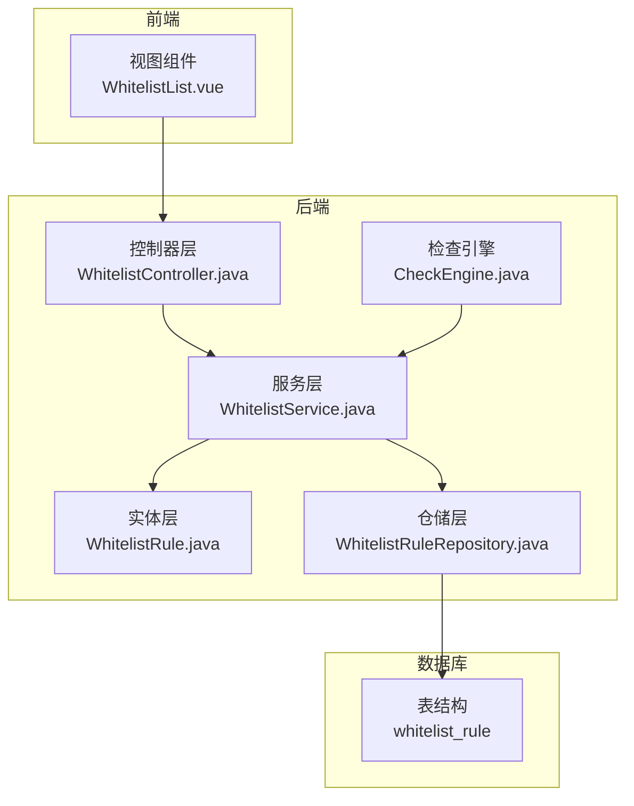
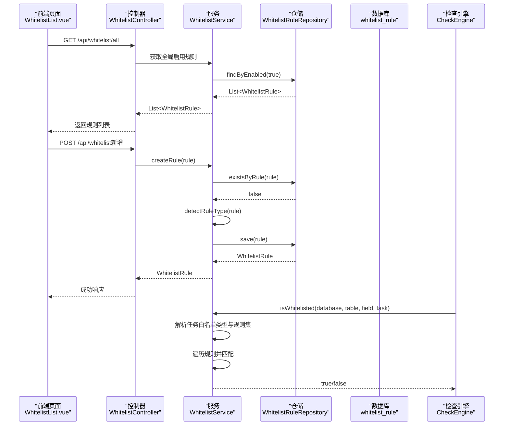
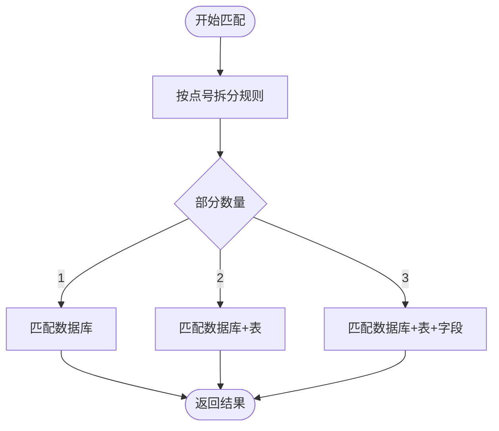
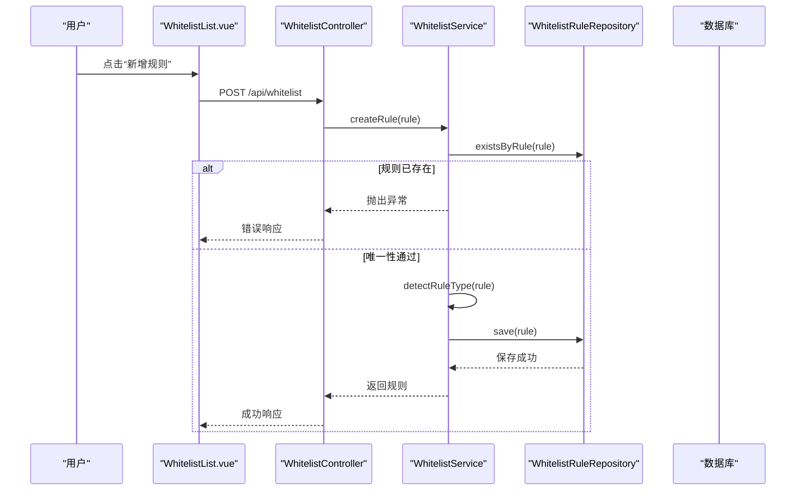
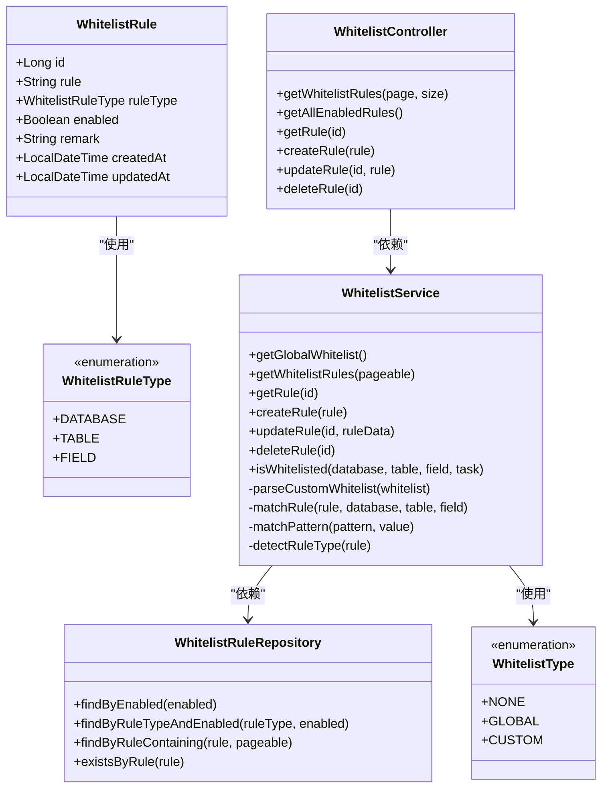

# 白名单规则表 (whitelist_rule)

<cite>
**本文引用的文件**
- [WhitelistRule.java](file://backend/src/main/java/com/fieldcheck/entity/WhitelistRule.java)
- [WhitelistRuleType.java](file://backend/src/main/java/com/fieldcheck/entity/WhitelistRuleType.java)
- [WhitelistType.java](file://backend/src/main/java/com/fieldcheck/entity/WhitelistType.java)
- [WhitelistService.java](file://backend/src/main/java/com/fieldcheck/service/WhitelistService.java)
- [WhitelistController.java](file://backend/src/main/java/com/fieldcheck/controller/WhitelistController.java)
- [WhitelistRuleRepository.java](file://backend/src/main/java/com/fieldcheck/repository/WhitelistRuleRepository.java)
- [01_init_schema.sql](file://mysql/init/01_init_schema.sql)
- [WhitelistList.vue](file://frontend/src/views/whitelist/WhitelistList.vue)
- [CheckEngine.java](file://backend/src/main/java/com/fieldcheck/engine/CheckEngine.java)
- [BaseEntity.java](file://backend/src/main/java/com/fieldcheck/entity/BaseEntity.java)
</cite>

## 目录
1. [简介](#简介)
2. [项目结构](#项目结构)
3. [核心组件](#核心组件)
4. [架构总览](#架构总览)
5. [详细组件分析](#详细组件分析)
6. [依赖关系分析](#依赖关系分析)
7. [性能考量与缓存策略](#性能考量与缓存策略)
8. [故障排查指南](#故障排查指南)
9. [结论](#结论)
10. [附录](#附录)

## 简介
本文件系统性阐述“白名单规则表 (whitelist_rule)”的设计与实现，覆盖以下方面：
- 字段定义与含义（规则表达式、规则类型、启用状态、备注等）
- 白名单类型与匹配优先级
- 规则表达式语法与匹配算法
- 规则的创建、编辑、删除流程（后端接口与前端页面）
- 在风险检测中的作用与影响
- 性能优化与缓存策略建议

## 项目结构
白名单规则相关代码位于后端 Java 模块，前端 Vue 页面负责展示与交互；数据库初始化脚本定义了表结构。

图表来源
- [WhitelistController.java](file://backend/src/main/java/com/fieldcheck/controller/WhitelistController.java#L1-L59)
- [WhitelistService.java](file://backend/src/main/java/com/fieldcheck/service/WhitelistService.java#L1-L153)
- [WhitelistRuleRepository.java](file://backend/src/main/java/com/fieldcheck/repository/WhitelistRuleRepository.java#L1-L23)
- [WhitelistRule.java](file://backend/src/main/java/com/fieldcheck/entity/WhitelistRule.java#L1-L34)
- [CheckEngine.java](file://backend/src/main/java/com/fieldcheck/engine/CheckEngine.java#L1-L493)
- [01_init_schema.sql](file://mysql/init/01_init_schema.sql#L157-L167)

章节来源
- [WhitelistController.java](file://backend/src/main/java/com/fieldcheck/controller/WhitelistController.java#L1-L59)
- [WhitelistService.java](file://backend/src/main/java/com/fieldcheck/service/WhitelistService.java#L1-L153)
- [WhitelistRuleRepository.java](file://backend/src/main/java/com/fieldcheck/repository/WhitelistRuleRepository.java#L1-L23)
- [WhitelistRule.java](file://backend/src/main/java/com/fieldcheck/entity/WhitelistRule.java#L1-L34)
- [01_init_schema.sql](file://mysql/init/01_init_schema.sql#L157-L167)

## 核心组件
- 实体类 WhitelistRule：定义规则表的字段与业务属性
- 枚举 WhitelistRuleType：规则类型（数据库/表/字段）
- 枚举 WhitelistType：任务白名单策略（不使用/全局/自定义）
- 服务类 WhitelistService：规则的增删改查、规则解析与匹配
- 控制器 WhitelistController：对外暴露 REST 接口
- 仓储接口 WhitelistRuleRepository：基于 Spring Data 的查询能力
- 前端视图 WhitelistList.vue：规则列表与 CRUD 操作界面
- 初始化脚本 01_init_schema.sql：定义 whitelist_rule 表结构

章节来源
- [WhitelistRule.java](file://backend/src/main/java/com/fieldcheck/entity/WhitelistRule.java#L1-L34)
- [WhitelistRuleType.java](file://backend/src/main/java/com/fieldcheck/entity/WhitelistRuleType.java#L1-L8)
- [WhitelistType.java](file://backend/src/main/java/com/fieldcheck/entity/WhitelistType.java#L1-L8)
- [WhitelistService.java](file://backend/src/main/java/com/fieldcheck/service/WhitelistService.java#L1-L153)
- [WhitelistController.java](file://backend/src/main/java/com/fieldcheck/controller/WhitelistController.java#L1-L59)
- [WhitelistRuleRepository.java](file://backend/src/main/java/com/fieldcheck/repository/WhitelistRuleRepository.java#L1-L23)
- [WhitelistList.vue](file://frontend/src/views/whitelist/WhitelistList.vue#L1-L105)
- [01_init_schema.sql](file://mysql/init/01_init_schema.sql#L157-L167)

## 架构总览
白名单规则贯穿“前端展示—后端控制—服务匹配—数据库持久化”的完整链路，并在检查引擎中用于跳过风险检测。

图表来源
- [WhitelistController.java](file://backend/src/main/java/com/fieldcheck/controller/WhitelistController.java#L22-L57)
- [WhitelistService.java](file://backend/src/main/java/com/fieldcheck/service/WhitelistService.java#L26-L89)
- [WhitelistRuleRepository.java](file://backend/src/main/java/com/fieldcheck/repository/WhitelistRuleRepository.java#L15-L21)
- [CheckEngine.java](file://backend/src/main/java/com/fieldcheck/engine/CheckEngine.java#L94-L122)

## 详细组件分析

### 数据模型与字段说明
- 表名：whitelist_rule
- 字段与约束：
  - id：主键，自增
  - created_at / updated_at：审计字段（由 BaseEntity 提供）
  - enabled：布尔，是否启用
  - remark：文本，备注
  - rule：字符串，规则表达式，长度上限 500
  - rule_type：枚举，规则类型（DATABASE/TABLE/FIELD）

字段来源与映射
- 实体类 WhitelistRule 映射上述字段与类型
- BaseEntity 提供通用审计字段（createdAt/updatedAt）

章节来源
- [01_init_schema.sql](file://mysql/init/01_init_schema.sql#L157-L167)
- [WhitelistRule.java](file://backend/src/main/java/com/fieldcheck/entity/WhitelistRule.java#L18-L33)
- [BaseEntity.java](file://backend/src/main/java/com/fieldcheck/entity/BaseEntity.java#L14-L27)

### 白名单类型与匹配优先级
- WhitelistType（任务侧）：
  - NONE：不使用白名单
  - GLOBAL：使用全局白名单（从规则表取启用规则）
  - CUSTOM：使用自定义白名单（任务的 custom_whitelist 文本）
- 匹配优先级：
  - 若任务设置为 GLOBAL，则仅使用全局启用规则集合
  - 若任务设置为 CUSTOM，则解析 custom_whitelist 文本为规则集合
  - 若两者都为空，返回未命中
  - 命中任一规则即判定为白名单

章节来源
- [WhitelistType.java](file://backend/src/main/java/com/fieldcheck/entity/WhitelistType.java#L1-L8)
- [WhitelistService.java](file://backend/src/main/java/com/fieldcheck/service/WhitelistService.java#L66-L89)

### 规则表达式语法与匹配算法
- 语法要点：
  - 支持点号分隔的层级：db、db.table、db.table.field
  - 支持通配符：*（任意字符序列）、?（单字符）
  - 大小写不敏感
- 匹配流程：
  - 将规则按点号拆分为若干部分
  - 根据部分数量分别匹配数据库、表、字段层级
  - 对每个部分进行模式匹配（通配符转正则）
- 自动类型推断：
  - 依据规则中“.”的数量自动判断规则类型（0=数据库，1=表，2=字段）

图表来源
- [WhitelistService.java](file://backend/src/main/java/com/fieldcheck/service/WhitelistService.java#L106-L123)

章节来源
- [WhitelistService.java](file://backend/src/main/java/com/fieldcheck/service/WhitelistService.java#L106-L151)

### 规则创建、编辑、删除流程
- 创建：
  - 前端提交规则对象（rule、enabled、remark）
  - 后端校验规则唯一性，自动推断规则类型，保存到数据库
- 编辑：
  - 更新规则内容、类型、启用状态与备注
- 删除：
  - 根据 id 删除规则
- 前端页面：
  - 列表展示规则、类型、状态、备注
  - 支持新增、编辑、删除弹窗

图表来源
- [WhitelistList.vue](file://frontend/src/views/whitelist/WhitelistList.vue#L80-L90)
- [WhitelistController.java](file://backend/src/main/java/com/fieldcheck/controller/WhitelistController.java#L40-L50)
- [WhitelistService.java](file://backend/src/main/java/com/fieldcheck/service/WhitelistService.java#L39-L49)
- [WhitelistRuleRepository.java](file://backend/src/main/java/com/fieldcheck/repository/WhitelistRuleRepository.java#L21)

章节来源
- [WhitelistList.vue](file://frontend/src/views/whitelist/WhitelistList.vue#L1-L105)
- [WhitelistController.java](file://backend/src/main/java/com/fieldcheck/controller/WhitelistController.java#L1-L59)
- [WhitelistService.java](file://backend/src/main/java/com/fieldcheck/service/WhitelistService.java#L39-L64)
- [WhitelistRuleRepository.java](file://backend/src/main/java/com/fieldcheck/repository/WhitelistRuleRepository.java#L1-L23)

### 在风险检测中的作用与影响
- 检查引擎在扫描数据库与表时，会先对目标对象调用 isWhitelisted 进行白名单判定
- 若命中白名单：
  - 跳过该表或字段的风险检测，减少不必要的计算与 IO
- 白名单直接影响检测范围与性能表现，合理配置可显著降低检测成本

章节来源
- [CheckEngine.java](file://backend/src/main/java/com/fieldcheck/engine/CheckEngine.java#L94-L122)
- [WhitelistService.java](file://backend/src/main/java/com/fieldcheck/service/WhitelistService.java#L66-L89)

## 依赖关系分析

图表来源
- [WhitelistRule.java](file://backend/src/main/java/com/fieldcheck/entity/WhitelistRule.java#L18-L33)
- [WhitelistRuleType.java](file://backend/src/main/java/com/fieldcheck/entity/WhitelistRuleType.java#L1-L8)
- [WhitelistType.java](file://backend/src/main/java/com/fieldcheck/entity/WhitelistType.java#L1-L8)
- [WhitelistService.java](file://backend/src/main/java/com/fieldcheck/service/WhitelistService.java#L22-L152)
- [WhitelistController.java](file://backend/src/main/java/com/fieldcheck/controller/WhitelistController.java#L18-L58)
- [WhitelistRuleRepository.java](file://backend/src/main/java/com/fieldcheck/repository/WhitelistRuleRepository.java#L12-L22)

## 性能考量与缓存策略
现状与建议：
- 当前实现
  - isWhitelisted 会根据任务白名单类型收集规则集合，然后逐条匹配
  - parseCustomWhitelist 会对自定义白名单按行解析，忽略空行与注释行
- 性能瓶颈
  - 规则匹配采用线性遍历，规则量大时可能成为热点
  - 每次匹配都会进行通配符到正则的转换
- 可选优化方向
  - 规则去重与预处理：在入库时统一规范化规则，避免重复匹配
  - 分层索引：按规则类型与层级（数据库/表/字段）建立索引，加速过滤
  - 缓存策略：对常用规则与匹配结果进行短期缓存（如 Guava Cache 或 Redis），结合规则版本号失效
  - 并发安全：在高并发场景下，确保规则读取与匹配的原子性与一致性
  - 批量匹配：在检查引擎中批量传入候选对象，减少多次调用开销

章节来源
- [WhitelistService.java](file://backend/src/main/java/com/fieldcheck/service/WhitelistService.java#L66-L151)
- [CheckEngine.java](file://backend/src/main/java/com/fieldcheck/engine/CheckEngine.java#L94-L122)

## 故障排查指南
- 规则无法保存
  - 现象：提示“规则已存在”
  - 排查：确认 rule 是否唯一；检查是否存在大小写差异导致的误判
- 规则不生效
  - 现象：目标对象仍被检测
  - 排查：确认任务的 whitelist_type 设置（NONE/GLOBAL/CUSTOM）；若为 CUSTOM，确认 custom_whitelist 文本格式正确且未被注释行过滤
- 匹配异常
  - 现象：通配符未按预期工作
  - 排查：检查规则表达式是否包含非法字符；确认大小写不敏感匹配逻辑是否符合预期
- 前端操作异常
  - 现象：新增/编辑/删除无响应
  - 排查：查看网络请求返回码与错误信息；确认权限与角色满足要求

章节来源
- [WhitelistService.java](file://backend/src/main/java/com/fieldcheck/service/WhitelistService.java#L41-L43)
- [WhitelistController.java](file://backend/src/main/java/com/fieldcheck/controller/WhitelistController.java#L40-L57)
- [WhitelistList.vue](file://frontend/src/views/whitelist/WhitelistList.vue#L80-L97)

## 结论
白名单规则是风险检测系统的重要配置项，通过合理的规则设计与匹配机制，可在保证检测覆盖率的同时显著提升性能。建议在生产环境中配合缓存与索引策略，持续监控规则命中率与匹配耗时，以获得最佳实践效果。

## 附录

### API 定义概览
- 获取所有启用规则
  - 方法：GET
  - 路径：/api/whitelist/all
  - 返回：List<WhitelistRule>
- 分页获取规则
  - 方法：GET
  - 路径：/api/whitelist?page=&size=
  - 返回：Page<WhitelistRule>
- 获取单条规则
  - 方法：GET
  - 路径：/api/whitelist/{id}
  - 返回：WhitelistRule
- 新增规则
  - 方法：POST
  - 路径：/api/whitelist
  - 权限：需 ADMIN 或 USER
  - 请求体：WhitelistRule
  - 返回：WhitelistRule
- 更新规则
  - 方法：PUT
  - 路径：/api/whitelist/{id}
  - 权限：需 ADMIN 或 USER
  - 请求体：WhitelistRule
  - 返回：WhitelistRule
- 删除规则
  - 方法：DELETE
  - 路径：/api/whitelist/{id}
  - 权限：需 ADMIN
  - 返回：Void

章节来源
- [WhitelistController.java](file://backend/src/main/java/com/fieldcheck/controller/WhitelistController.java#L22-L57)