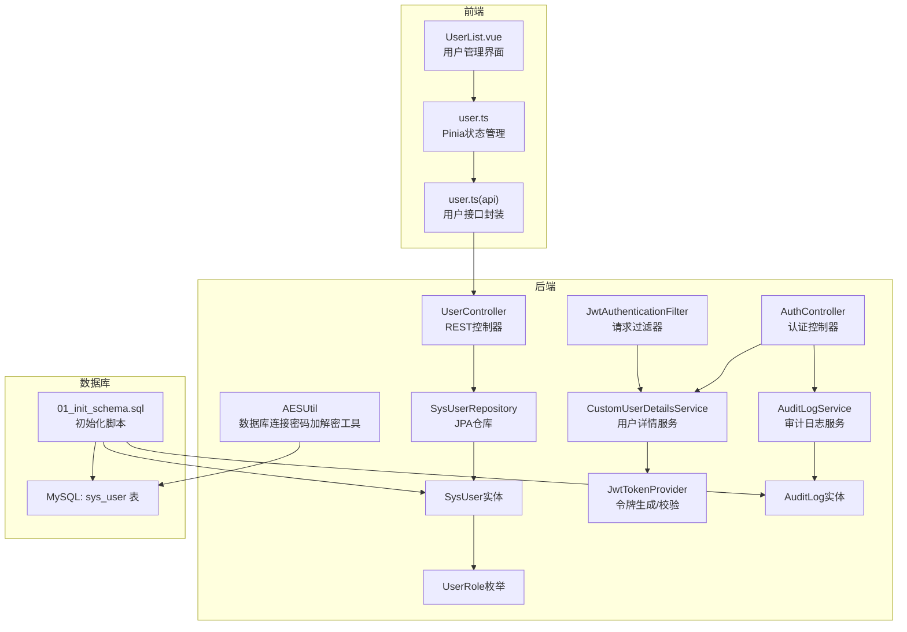
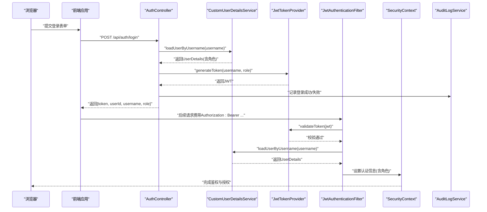
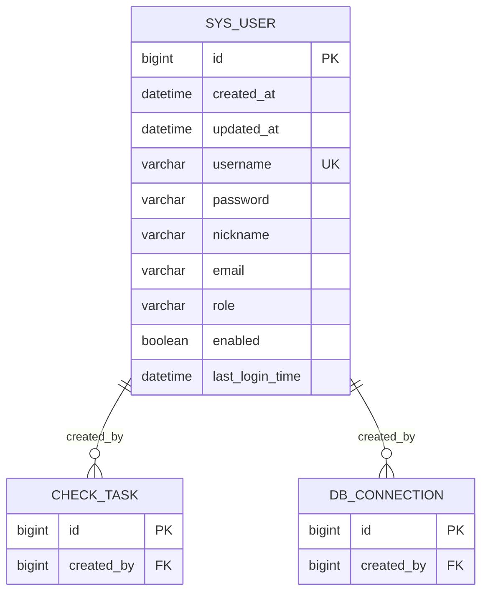
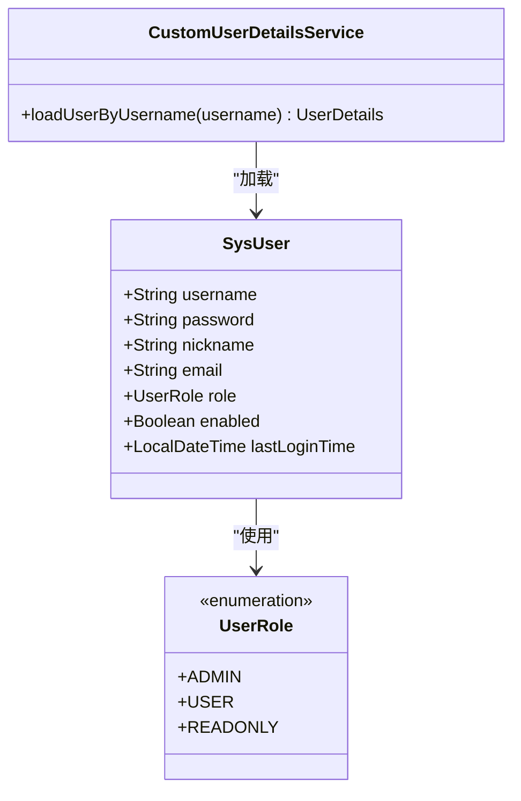
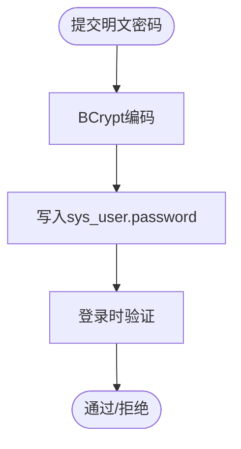
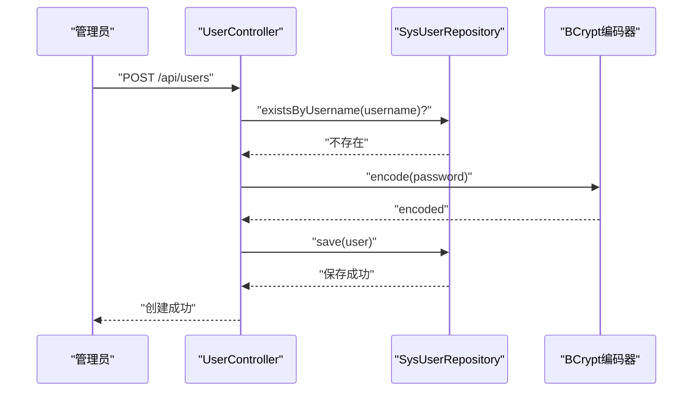
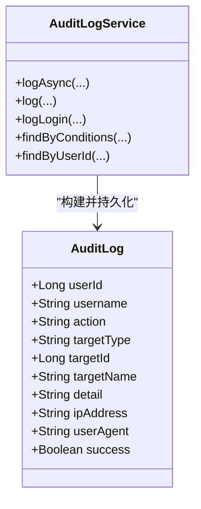
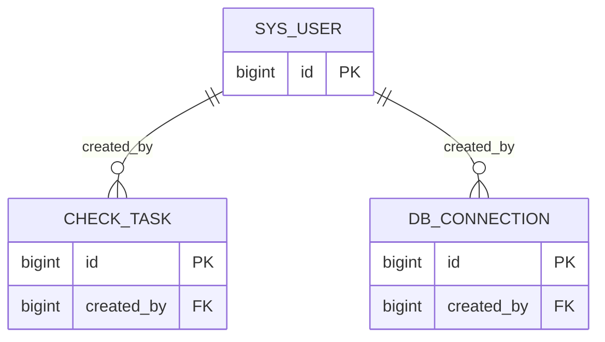
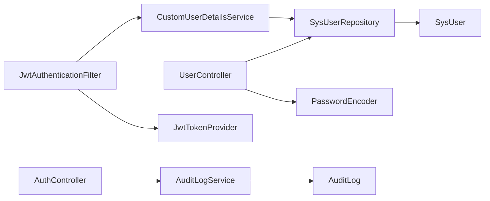

# 系统用户表 (sys_user)

<cite>
**本文档引用的文件**
- [SysUser.java](file://backend/src/main/java/com/fieldcheck/entity/SysUser.java)
- [UserRole.java](file://backend/src/main/java/com/fieldcheck/entity/UserRole.java)
- [SysUserRepository.java](file://backend/src/main/java/com/fieldcheck/repository/SysUserRepository.java)
- [UserController.java](file://backend/src/main/java/com/fieldcheck/controller/UserController.java)
- [CustomUserDetailsService.java](file://backend/src/main/java/com/fieldcheck/security/CustomUserDetailsService.java)
- [JwtAuthenticationFilter.java](file://backend/src/main/java/com/fieldcheck/security/JwtAuthenticationFilter.java)
- [JwtTokenProvider.java](file://backend/src/main/java/com/fieldcheck/security/JwtTokenProvider.java)
- [AuthController.java](file://backend/src/main/java/com/fieldcheck/controller/AuthController.java)
- [application.yml](file://backend/src/main/resources/application.yml)
- [01_init_schema.sql](file://mysql/init/01_init_schema.sql)
- [AuditLogService.java](file://backend/src/main/java/com/fieldcheck/service/AuditLogService.java)
- [AuditLog.java](file://backend/src/main/java/com/fieldcheck/entity/AuditLog.java)
- [AuditAspect.java](file://backend/src/main/java/com/fieldcheck/aspect/AuditAspect.java)
- [AESUtil.java](file://backend/src/main/java/com/fieldcheck/util/AESUtil.java)
- [UserList.vue](file://frontend/src/views/system/UserList.vue)
- [user.ts](file://frontend/src/stores/user.ts)
- [user.ts(api)](file://frontend/src/api/user.ts)
</cite>

## 目录
1. [简介](#简介)
2. [项目结构](#项目结构)
3. [核心组件](#核心组件)
4. [架构总览](#架构总览)
5. [详细组件分析](#详细组件分析)
6. [依赖关系分析](#依赖关系分析)
7. [性能考虑](#性能考虑)
8. [故障排查指南](#故障排查指南)
9. [结论](#结论)
10. [附录](#附录)

## 简介
本文件系统性地阐述系统用户表(sys_user)的设计与实现，覆盖字段定义、角色与权限体系、密码安全策略、用户管理流程（注册、登录、权限分配）、会话管理与安全审计，以及与其他业务表的关联关系与数据隔离机制。目标是帮助开发者与运维人员全面理解用户子系统的数据模型与运行机制。

## 项目结构
后端采用Spring Boot + Spring Security + Spring Data JPA + JWT的典型分层架构；前端使用Vue 3 + Element Plus + Pinia进行用户界面与状态管理。数据库初始化脚本在首次启动时自动创建sys_user表及外键约束，并内置默认管理员账户。

**图表来源**
- [UserList.vue](file://frontend/src/views/system/UserList.vue#L1-L457)
- [user.ts](file://frontend/src/stores/user.ts#L1-L60)
- [user.ts(api)](file://frontend/src/api/user.ts#L1-L32)
- [UserController.java](file://backend/src/main/java/com/fieldcheck/controller/UserController.java#L1-L136)
- [SysUserRepository.java](file://backend/src/main/java/com/fieldcheck/repository/SysUserRepository.java#L1-L19)
- [SysUser.java](file://backend/src/main/java/com/fieldcheck/entity/SysUser.java#L1-L44)
- [UserRole.java](file://backend/src/main/java/com/fieldcheck/entity/UserRole.java#L1-L8)
- [CustomUserDetailsService.java](file://backend/src/main/java/com/fieldcheck/security/CustomUserDetailsService.java#L1-L37)
- [JwtTokenProvider.java](file://backend/src/main/java/com/fieldcheck/security/JwtTokenProvider.java#L1-L95)
- [JwtAuthenticationFilter.java](file://backend/src/main/java/com/fieldcheck/security/JwtAuthenticationFilter.java#L1-L59)
- [AuthController.java](file://backend/src/main/java/com/fieldcheck/controller/AuthController.java#L1-L56)
- [AuditLogService.java](file://backend/src/main/java/com/fieldcheck/service/AuditLogService.java#L1-L133)
- [AuditLog.java](file://backend/src/main/java/com/fieldcheck/entity/AuditLog.java#L1-L54)
- [01_init_schema.sql](file://mysql/init/01_init_schema.sql#L112-L125)
- [AESUtil.java](file://backend/src/main/java/com/fieldcheck/util/AESUtil.java#L1-L54)

**章节来源**
- [application.yml](file://backend/src/main/resources/application.yml#L55-L62)
- [01_init_schema.sql](file://mysql/init/01_init_schema.sql#L112-L125)

## 核心组件
- 实体与仓库
  - SysUser：系统用户实体，映射sys_user表，包含用户名、密码、昵称、邮箱、角色、启用状态、最后登录时间等字段。
  - SysUserRepository：提供按用户名、角色、启用状态分页查询与存在性判断。
  - UserRole：用户角色枚举，包含ADMIN、USER、READONLY三类角色。
- 控制器与服务
  - UserController：提供用户列表、详情、创建、更新、删除、重置密码、当前用户信息等接口，基于角色授权控制访问。
  - AuthController：提供登录、登出、当前用户信息接口，并集成审计日志。
  - AuditLogService：异步/同步记录审计日志，支持条件查询与用户维度查询。
  - CustomUserDetailsService：加载用户详情并授予对应角色权限。
  - JwtTokenProvider：基于HS256算法生成与校验JWT令牌。
  - JwtAuthenticationFilter：从请求头提取JWT并注入到Security上下文。
- 前端
  - UserList.vue：用户管理界面，支持搜索、分页、启停、重置密码、删除等操作。
  - user.ts：Pinia状态管理，持久化token与用户信息，封装登录/登出逻辑。
  - user.ts(api)：封装用户相关API调用。

**章节来源**
- [SysUser.java](file://backend/src/main/java/com/fieldcheck/entity/SysUser.java#L19-L42)
- [SysUserRepository.java](file://backend/src/main/java/com/fieldcheck/repository/SysUserRepository.java#L12-L18)
- [UserRole.java](file://backend/src/main/java/com/fieldcheck/entity/UserRole.java#L3-L7)
- [UserController.java](file://backend/src/main/java/com/fieldcheck/controller/UserController.java#L26-L122)
- [AuthController.java](file://backend/src/main/java/com/fieldcheck/controller/AuthController.java#L25-L54)
- [AuditLogService.java](file://backend/src/main/java/com/fieldcheck/service/AuditLogService.java#L28-L86)
- [CustomUserDetailsService.java](file://backend/src/main/java/com/fieldcheck/security/CustomUserDetailsService.java#L22-L35)
- [JwtTokenProvider.java](file://backend/src/main/java/com/fieldcheck/security/JwtTokenProvider.java#L32-L93)
- [JwtAuthenticationFilter.java](file://backend/src/main/java/com/fieldcheck/security/JwtAuthenticationFilter.java#L27-L49)
- [UserList.vue](file://frontend/src/views/system/UserList.vue#L295-L426)
- [user.ts](file://frontend/src/stores/user.ts#L12-L58)
- [user.ts(api)](file://frontend/src/api/user.ts#L3-L31)

## 架构总览
下图展示用户登录与会话管理的关键交互流程，包括JWT生成、过滤器解析、权限注入与审计日志记录。

**图表来源**
- [AuthController.java](file://backend/src/main/java/com/fieldcheck/controller/AuthController.java#L25-L36)
- [CustomUserDetailsService.java](file://backend/src/main/java/com/fieldcheck/security/CustomUserDetailsService.java#L22-L35)
- [JwtTokenProvider.java](file://backend/src/main/java/com/fieldcheck/security/JwtTokenProvider.java#L32-L54)
- [JwtAuthenticationFilter.java](file://backend/src/main/java/com/fieldcheck/security/JwtAuthenticationFilter.java#L27-L49)
- [AuditLogService.java](file://backend/src/main/java/com/fieldcheck/service/AuditLogService.java#L57-L68)

## 详细组件分析

### 用户表字段与约束
- 字段说明
  - id：自增主键
  - created_at/updated_at：通用审计时间戳
  - username：非空唯一，长度限制
  - password：非空，存储加密后的密码
  - nickname：长度限制
  - email：长度限制
  - role：非空，字符串形式的角色值
  - enabled：非空布尔，默认启用
  - last_login_time：最近一次登录时间
- 约束与索引
  - 唯一索引：username
  - 外键关联：check_task.created_by → sys_user.id
  - 外键关联：db_connection.created_by → sys_user.id

**图表来源**
- [01_init_schema.sql](file://mysql/init/01_init_schema.sql#L112-L125)
- [01_init_schema.sql](file://mysql/init/01_init_schema.sql#L65-L84)

**章节来源**
- [SysUser.java](file://backend/src/main/java/com/fieldcheck/entity/SysUser.java#L21-L42)
- [01_init_schema.sql](file://mysql/init/01_init_schema.sql#L112-L125)

### 角色体系与权限控制
- 角色定义
  - ADMIN：管理员，拥有所有权限
  - USER：普通用户，可管理自己的任务
  - READONLY：只读用户（当前代码未直接使用该角色）
- 授权机制
  - 控制器方法使用@PreAuthorize限制角色访问
  - CustomUserDetailsService根据用户角色授予对应权限
  - 前端根据用户角色渲染界面与操作按钮

**图表来源**
- [SysUser.java](file://backend/src/main/java/com/fieldcheck/entity/SysUser.java#L19-L42)
- [UserRole.java](file://backend/src/main/java/com/fieldcheck/entity/UserRole.java#L3-L7)
- [CustomUserDetailsService.java](file://backend/src/main/java/com/fieldcheck/security/CustomUserDetailsService.java#L22-L35)

**章节来源**
- [UserRole.java](file://backend/src/main/java/com/fieldcheck/entity/UserRole.java#L3-L7)
- [UserController.java](file://backend/src/main/java/com/fieldcheck/controller/UserController.java#L27-L103)
- [CustomUserDetailsService.java](file://backend/src/main/java/com/fieldcheck/security/CustomUserDetailsService.java#L26-L34)

### 密码存储与安全策略
- 存储策略
  - 用户密码以BCrypt编码后存储于sys_user.password字段
  - 初始化脚本中默认管理员密码为BCrypt加密后的值
- 加密工具
  - AESUtil提供AES/CBC/PKCS5Padding加解密能力，用于数据库连接密码等敏感信息的存储与读取
- 配置要点
  - application.yml中定义JWT密钥与过期时间
  - application.yml中定义AES加密密钥

**图表来源**
- [01_init_schema.sql](file://mysql/init/01_init_schema.sql#L182-L185)
- [application.yml](file://backend/src/main/resources/application.yml#L55-L62)
- [AESUtil.java](file://backend/src/main/java/com/fieldcheck/util/AESUtil.java#L15-L45)

**章节来源**
- [01_init_schema.sql](file://mysql/init/01_init_schema.sql#L182-L185)
- [application.yml](file://backend/src/main/resources/application.yml#L55-L62)
- [AESUtil.java](file://backend/src/main/java/com/fieldcheck/util/AESUtil.java#L15-L45)

### 用户管理流程
- 注册
  - 仅管理员可通过UserController创建用户，系统先检查用户名是否存在，再对密码进行BCrypt编码后保存
- 登录
  - AuthController接收用户名/密码，成功后生成JWT并记录登录审计日志
- 权限分配
  - 通过更新用户角色字段实现，配合@PreAuthorize进行访问控制
- 会话管理
  - 基于JWT，JwtAuthenticationFilter从请求头解析并校验令牌，注入SecurityContext供后续授权使用
- 安全审计
  - 登录成功/失败均记录审计日志；支持按用户、动作、时间范围分页查询

**图表来源**
- [UserController.java](file://backend/src/main/java/com/fieldcheck/controller/UserController.java#L63-L74)
- [SysUserRepository.java](file://backend/src/main/java/com/fieldcheck/repository/SysUserRepository.java#L13-L14)

**章节来源**
- [UserController.java](file://backend/src/main/java/com/fieldcheck/controller/UserController.java#L63-L122)
- [AuthController.java](file://backend/src/main/java/com/fieldcheck/controller/AuthController.java#L25-L36)
- [JwtAuthenticationFilter.java](file://backend/src/main/java/com/fieldcheck/security/JwtAuthenticationFilter.java#L31-L42)
- [AuditLogService.java](file://backend/src/main/java/com/fieldcheck/service/AuditLogService.java#L57-L68)

### 会话管理与安全审计
- 会话管理
  - 使用JWT无状态认证，无需服务器端会话存储
  - JwtTokenProvider负责令牌生成与校验，JwtAuthenticationFilter负责注入认证信息
- 安全审计
  - AuditLogService提供异步与同步两种记录方式
  - 支持记录登录、登出、用户管理等关键操作
  - 提供按条件查询与用户维度查询接口

**图表来源**
- [AuditLogService.java](file://backend/src/main/java/com/fieldcheck/service/AuditLogService.java#L28-L105)
- [AuditLog.java](file://backend/src/main/java/com/fieldcheck/entity/AuditLog.java#L21-L53)

**章节来源**
- [AuditLogService.java](file://backend/src/main/java/com/fieldcheck/service/AuditLogService.java#L28-L105)
- [AuditLog.java](file://backend/src/main/java/com/fieldcheck/entity/AuditLog.java#L21-L53)

### 用户与其它表的关联关系与数据隔离
- 关联关系
  - check_task.created_by → sys_user.id
  - db_connection.created_by → sys_user.id
- 数据隔离
  - USER角色仅能管理自身创建的任务与连接
  - ADMIN角色可绕过上述限制进行全局管理
  - 前端界面根据角色禁用或隐藏部分操作按钮

**图表来源**
- [01_init_schema.sql](file://mysql/init/01_init_schema.sql#L65-L84)

**章节来源**
- [01_init_schema.sql](file://mysql/init/01_init_schema.sql#L65-L84)
- [UserList.vue](file://frontend/src/views/system/UserList.vue#L54-L62)

## 依赖关系分析
- 组件耦合
  - UserController依赖SysUserRepository与PasswordEncoder
  - AuthController依赖AuthService与AuditLogService
  - JwtAuthenticationFilter依赖JwtTokenProvider与CustomUserDetailsService
  - CustomUserDetailsService依赖SysUserRepository
- 外部依赖
  - JWT库用于令牌生成与校验
  - Spring Security用于认证与授权
  - JPA/Hibernate用于数据持久化
  - 前端Element Plus与Pinia用于UI与状态管理

**图表来源**
- [UserController.java](file://backend/src/main/java/com/fieldcheck/controller/UserController.java#L23-L24)
- [AuthController.java](file://backend/src/main/java/com/fieldcheck/controller/AuthController.java#L22-L23)
- [JwtAuthenticationFilter.java](file://backend/src/main/java/com/fieldcheck/security/JwtAuthenticationFilter.java#L24-L25)
- [CustomUserDetailsService.java](file://backend/src/main/java/com/fieldcheck/security/CustomUserDetailsService.java#L19-L19)
- [SysUserRepository.java](file://backend/src/main/java/com/fieldcheck/repository/SysUserRepository.java#L12-L18)
- [AuditLogService.java](file://backend/src/main/java/com/fieldcheck/service/AuditLogService.java#L23-L23)

**章节来源**
- [application.yml](file://backend/src/main/resources/application.yml#L55-L62)

## 性能考虑
- 数据库层面
  - sys_user.username建立唯一索引，确保用户名唯一性与查询效率
  - 审计日志表audit_log针对user_id与action建立索引，提升查询性能
- 应用层面
  - 审计日志采用异步记录，避免阻塞主业务流程
  - JWT令牌无状态设计降低服务器内存占用
- 建议
  - 对用户列表查询增加更细粒度的索引与分页优化
  - 定期清理过期审计日志，控制表规模

**章节来源**
- [01_init_schema.sql](file://mysql/init/01_init_schema.sql#L124-L125)
- [01_init_schema.sql](file://mysql/init/01_init_schema.sql#L39-L41)
- [AuditLogService.java](file://backend/src/main/java/com/fieldcheck/service/AuditLogService.java#L28-L38)

## 故障排查指南
- 登录失败
  - 检查用户名/密码是否正确，确认密码为BCrypt编码
  - 查看审计日志中LOGIN记录的详细信息
- 无法访问用户管理
  - 确认当前用户角色为ADMIN
  - 检查Jwt令牌是否有效且未过期
- 用户状态异常
  - 检查enabled字段是否被错误置为false
  - 注意admin账号不可删除的限制
- 审计日志缺失
  - 确认AuditLogService的异步线程池配置与事务边界
  - 检查application.yml中的日志级别与输出路径

**章节来源**
- [AuthController.java](file://backend/src/main/java/com/fieldcheck/controller/AuthController.java#L32-L35)
- [AuditLogService.java](file://backend/src/main/java/com/fieldcheck/service/AuditLogService.java#L57-L68)
- [UserController.java](file://backend/src/main/java/com/fieldcheck/controller/UserController.java#L97-L99)
- [application.yml](file://backend/src/main/resources/application.yml#L69-L75)

## 结论
sys_user表作为系统用户中心，通过明确的角色体系、严格的密码安全策略、完善的会话与审计机制，以及与业务表的清晰关联关系，实现了安全、可控、可观测的用户管理体系。结合前端的可视化管理界面，能够高效支撑日常用户运维与安全管理需求。

## 附录
- 默认管理员
  - 初始化脚本内置默认管理员账号，密码为BCrypt编码后的固定值
- 配置项
  - JWT密钥与过期时间、AES加密密钥均在application.yml中集中配置

**章节来源**
- [01_init_schema.sql](file://mysql/init/01_init_schema.sql#L182-L185)
- [application.yml](file://backend/src/main/resources/application.yml#L55-L62)