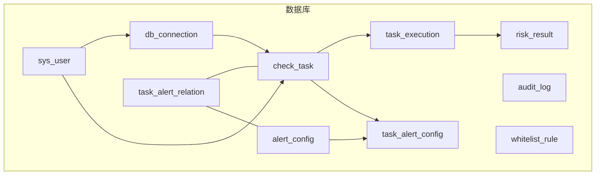
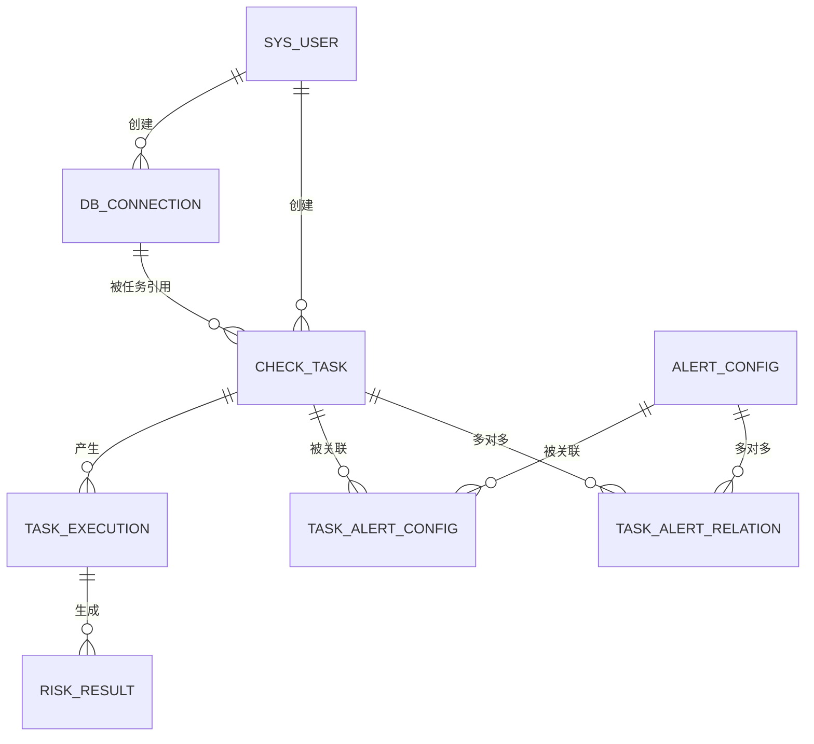
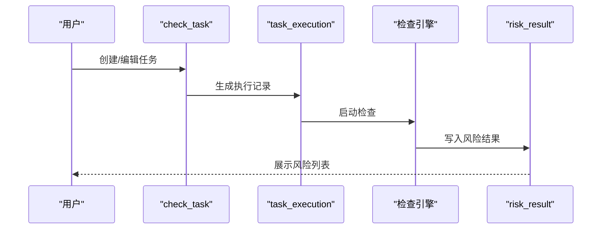

# 表结构详细说明

<cite>
**本文引用的文件**
- [01_init_schema.sql](file://mysql/init/01_init_schema.sql)
- [BaseEntity.java](file://backend/src/main/java/com/fieldcheck/entity/BaseEntity.java)
- [AlertConfig.java](file://backend/src/main/java/com/fieldcheck/entity/AlertConfig.java)
- [AuditLog.java](file://backend/src/main/java/com/fieldcheck/entity/AuditLog.java)
- [CheckTask.java](file://backend/src/main/java/com/fieldcheck/entity/CheckTask.java)
- [DbConnection.java](file://backend/src/main/java/com/fieldcheck/entity/DbConnection.java)
- [RiskResult.java](file://backend/src/main/java/com/fieldcheck/entity/RiskResult.java)
- [SysUser.java](file://backend/src/main/java/com/fieldcheck/entity/SysUser.java)
- [TaskExecution.java](file://backend/src/main/java/com/fieldcheck/entity/TaskExecution.java)
- [WhitelistRule.java](file://backend/src/main/java/com/fieldcheck/entity/WhitelistRule.java)
- [TaskAlertConfig.java](file://backend/src/main/java/com/fieldcheck/entity/TaskAlertConfig.java)
- [AlertType.java](file://backend/src/main/java/com/fieldcheck/entity/AlertType.java)
- [ExecutionStatus.java](file://backend/src/main/java/com/fieldcheck/entity/ExecutionStatus.java)
- [RiskStatus.java](file://backend/src/main/java/com/fieldcheck/entity/RiskStatus.java)
- [RiskType.java](file://backend/src/main/java/com/fieldcheck/entity/RiskType.java)
- [TaskStatus.java](file://backend/src/main/java/com/fieldcheck/entity/TaskStatus.java)
</cite>

## 目录
1. [简介](#简介)
2. [项目结构](#项目结构)
3. [核心组件](#核心组件)
4. [架构总览](#架构总览)
5. [详细组件分析](#详细组件分析)
6. [依赖分析](#依赖分析)
7. [性能考虑](#性能考虑)
8. [故障排查指南](#故障排查指南)
9. [结论](#结论)
10. [附录](#附录)

## 简介
本文件面向数据库设计与开发人员，系统性梳理"MySQL风险字段检查平台"的数据库表结构，逐表说明字段定义、数据类型、约束条件、业务含义与索引策略，并给出表间关联关系、外键约束、示例数据与使用场景。同时提供字段级注释说明、业务逻辑解释、表设计合理性评估及性能影响分析，并总结表结构变更的注意事项与最佳实践。

## 项目结构
后端采用Spring Boot + JPA + MySQL，数据库初始化脚本位于 mysql/init/01_init_schema.sql；实体类位于 backend/src/main/java/com/fieldcheck/entity 下，统一继承 BaseEntity，提供通用审计字段（创建时间、更新时间）与主键。

**图表来源**
- [01_init_schema.sql:10-178](file://mysql/init/01_init_schema.sql#L10-L178)
- [BaseEntity.java:14-27](file://backend/src/main/java/com/fieldcheck/entity/BaseEntity.java#L14-L27)

**章节来源**
- [01_init_schema.sql:1-178](file://mysql/init/01_init_schema.sql#L1-L178)
- [BaseEntity.java:1-28](file://backend/src/main/java/com/fieldcheck/entity/BaseEntity.java#L1-L28)

## 核心组件
- sys_user：系统用户表，存储用户名、角色、状态等信息，唯一索引约束用户名。
- db_connection：数据库连接配置表，保存目标MySQL的主机、端口、账号、密码（加密存储）、启用状态与备注。
- check_task：检查任务表，绑定一个数据库连接，支持数据库/表名正则匹配、抽样大小、大表阈值、风险阈值、白名单策略、Cron调度表达式、任务状态与创建人。
- task_execution：任务执行记录表，记录每次执行的开始/结束时间、状态、统计信息（总表数、已处理表数、风险数量）、日志路径与错误信息、触发方式。
- risk_result：风险结果明细表，记录单个字段的风险类型、当前值、阈值、使用率、建议、备注、状态等，并通过外键关联到一次执行。
- audit_log：审计日志表，记录用户操作、目标对象、IP、UA、是否成功等信息，包含常用查询索引。
- alert_config：告警配置表，定义告警类型（钉钉/邮件）、配置详情（JSON）、启用状态与备注。
- task_alert_config：任务与告警配置的多对多关联表（JPA版本），包含唯一组合索引避免重复关联。
- whitelist_rule：白名单规则表，支持数据库/表/字段三个粒度，启用状态与备注。
- BaseEntity：所有实体的基类，统一提供id、created_at、updated_at审计字段。

**章节来源**
- [SysUser.java:1-57](file://backend/src/main/java/com/fieldcheck/entity/SysUser.java#L1-L57)
- [DbConnection.java:1-47](file://backend/src/main/java/com/fieldcheck/entity/DbConnection.java#L1-L47)
- [CheckTask.java:1-75](file://backend/src/main/java/com/fieldcheck/entity/CheckTask.java#L1-L75)
- [TaskExecution.java:1-58](file://backend/src/main/java/com/fieldcheck/entity/TaskExecution.java#L1-L58)
- [RiskResult.java:1-68](file://backend/src/main/java/com/fieldcheck/entity/RiskResult.java#L1-L68)
- [AuditLog.java:1-54](file://backend/src/main/java/com/fieldcheck/entity/AuditLog.java#L1-L54)
- [AlertConfig.java:1-37](file://backend/src/main/java/com/fieldcheck/entity/AlertConfig.java#L1-L37)
- [TaskAlertConfig.java:1-29](file://backend/src/main/java/com/fieldcheck/entity/TaskAlertConfig.java#L1-L29)
- [WhitelistRule.java:1-34](file://backend/src/main/java/com/fieldcheck/entity/WhitelistRule.java#L1-L34)
- [BaseEntity.java:1-28](file://backend/src/main/java/com/fieldcheck/entity/BaseEntity.java#L1-L28)

## 架构总览
下图展示各表之间的关联关系与外键约束，体现从用户、连接、任务、执行到风险结果的完整链路。

**图表来源**
- [01_init_schema.sql:63-135](file://mysql/init/01_init_schema.sql#L63-L135)
- [TaskAlertConfig.java:21-27](file://backend/src/main/java/com/fieldcheck/entity/TaskAlertConfig.java#L21-L27)

## 详细组件分析

### sys_user（系统用户）
- 字段与约束
  - id：主键，自增
  - created_at/updated_at：审计时间，非空
  - username：唯一、非空、长度限制
  - password：非空
  - nickname/email：可选
  - role：非空，枚举类型（见UserRole）
  - enabled：启用状态
  - last_login_time：最近登录时间
  - auth_type：认证类型（LOCAL/LDAP），默认LOCAL
  - ldap_dn：LDAP DN标识
- 业务含义
  - 平台用户身份与权限载体，用于连接管理、任务创建与审计追踪
- 示例数据
  - admin 用户（密码为BCrypt加密后的值），角色为 ADMIN
- 使用场景
  - 登录鉴权、创建数据库连接、创建检查任务、审计日志关联

**章节来源**
- [01_init_schema.sql:41-53](file://mysql/init/01_init_schema.sql#L41-L53)
- [SysUser.java:19-57](file://backend/src/main/java/com/fieldcheck/entity/SysUser.java#L19-L57)

### db_connection（数据库连接）
- 字段与约束
  - id：主键，自增
  - created_at/updated_at：审计时间
  - name/host/port/username/password：连接参数，非空
  - remark：备注
  - enabled：启用状态
  - created_by：外键，指向 sys_user.id
- 业务含义
  - 目标MySQL实例的连接配置，支持多租户/多实例管理
- 示例数据
  - name='prod-mysql' host='192.168.1.10' port=3306 username='checker' password='加密值'
- 使用场景
  - 被 check_task 引用以确定检查范围

**章节来源**
- [01_init_schema.sql:55-70](file://mysql/init/01_init_schema.sql#L55-L70)
- [DbConnection.java:18-46](file://backend/src/main/java/com/fieldcheck/entity/DbConnection.java#L18-L46)

### check_task（检查任务）
- 字段与约束
  - id：主键，自增
  - created_at/updated_at：审计时间
  - name：非空，任务名称
  - connection_id：非空，外键，指向 db_connection.id
  - db_pattern/table_pattern：正则匹配模式，支持模糊筛选
  - full_scan：强制全表扫描开关
  - sample_size：抽样条数，默认1000
  - max_table_rows：大表阈值，默认100万行
  - threshold_pct：风险阈值百分比，默认90
  - y2038_warning_year：Y2038告警年份，默认2030
  - whitelist_type：白名单策略（NONE/GLOBAL/CUSTOM），默认NONE
  - custom_whitelist：自定义白名单内容（文本）
  - cron_expression：Cron表达式
  - status：任务状态（ENABLED/DISABLED），默认ENABLED
  - created_by：外键，指向 sys_user.id
- 业务含义
  - 定义一次字段风险检查的策略与范围，驱动定时或手动执行
- 示例数据
  - name='生产库字段检查' connection_id=1 db_pattern='^app_' table_pattern='.*' sample_size=1000 threshold_pct=90 whitelist_type='GLOBAL'
- 使用场景
  - 作为任务执行的输入参数，决定扫描范围与阈值

**章节来源**
- [01_init_schema.sql:72-95](file://mysql/init/01_init_schema.sql#L72-L95)
- [CheckTask.java:20-74](file://backend/src/main/java/com/fieldcheck/entity/CheckTask.java#L20-L74)

### task_execution（任务执行记录）
- 字段与约束
  - id：主键，自增
  - created_at/updated_at：审计时间
  - task_id：非空，外键，指向 check_task.id
  - start_time/end_time：执行起止时间
  - status：执行状态（PENDING/RUNNING/SUCCESS/FAILED/STOPPED），默认PENDING
  - total_tables/processed_tables/risk_count：统计指标
  - log_path/error_message：日志路径与错误信息
  - trigger_type：触发方式（MANUAL/SCHEDULED），默认MANUAL
- 业务含义
  - 记录一次任务的实际执行过程与结果，支撑报表与监控
- 示例数据
  - task_id=1 status='RUNNING' total_tables=100 processed_tables=60 risk_count=5 trigger_type='SCHEDULED'
- 使用场景
  - 任务调度器驱动，生成执行记录并写入结果

**章节来源**
- [01_init_schema.sql:97-114](file://mysql/init/01_init_schema.sql#L97-L114)
- [TaskExecution.java:19-57](file://backend/src/main/java/com/fieldcheck/entity/TaskExecution.java#L19-L57)

### risk_result（风险结果明细）
- 字段与约束
  - id：主键，自增
  - created_at/updated_at：审计时间
  - execution_id：非空，外键，指向 task_execution.id
  - database_name/table_name/column_name：所属对象标识
  - column_type：列类型
  - risk_type：风险类型（INT_OVERFLOW/DECIMAL_OVERFLOW/Y2038/STRING_TRUNCATION/DATE_ANOMALY/OTHER）
  - current_value/threshold_value：当前值与阈值
  - usage_percent：使用率（精度5，小数2位）
  - detail/suggestion/remark：详情、建议与备注
  - status：风险状态（PENDING/IGNORED/RESOLVED），默认PENDING
- 业务含义
  - 存储具体字段的风险发现，支持后续处理与跟踪
- 示例数据
  - execution_id=1 database_name='app' table_name='orders' column_name='amount' risk_type='DECIMAL_OVERFLOW' usage_percent=95.50 status='PENDING'
- 使用场景
  - 检查引擎输出，前端展示与导出

**章节来源**
- [01_init_schema.sql:117-139](file://mysql/init/01_init_schema.sql#L117-L139)
- [RiskResult.java:23-67](file://backend/src/main/java/com/fieldcheck/entity/RiskResult.java#L23-L67)

### audit_log（审计日志）
- 字段与约束
  - id：主键，自增
  - created_at/updated_at：审计时间
  - user_id/username：用户标识
  - action：动作类型（如LOGIN、CREATE_CONNECTION、UPDATE_TASK等）
  - target_type/target_id/target_name：目标对象类型、ID与名称
  - detail：详细信息
  - ip_address/user_agent：来源信息
  - success：是否成功
- 业务含义
  - 记录用户关键操作，便于合规与安全审计
- 示例数据
  - user_id=1 username='admin' action='LOGIN' target_type='User' target_id=1 success=true
- 使用场景
  - 运维审计、安全事件回溯

**章节来源**
- [01_init_schema.sql:22-39](file://mysql/init/01_init_schema.sql#L22-L39)
- [AuditLog.java:21-53](file://backend/src/main/java/com/fieldcheck/entity/AuditLog.java#L21-L53)

### alert_config（告警配置）
- 字段与约束
  - id：主键，自增
  - created_at/updated_at：审计时间
  - name/alert_type/config：名称、告警类型（钉钉/邮件）、配置详情（JSON）
  - enabled：启用状态
  - remark：备注
- 业务含义
  - 定义不同渠道的告警模板与参数
- 示例数据
  - name='钉钉群机器人' alert_type='DINGTALK' config='{"webhook":"https://..."}' enabled=true
- 使用场景
  - 与任务绑定后，在风险发生时触发告警

**章节来源**
- [01_init_schema.sql:10-20](file://mysql/init/01_init_schema.sql#L10-L20)
- [AlertConfig.java:18-36](file://backend/src/main/java/com/fieldcheck/entity/AlertConfig.java#L18-L36)

### task_alert_config（任务与告警配置关联）
- 字段与约束
  - id：主键，自增
  - task_id/alert_config_id：联合唯一索引，避免重复关联
  - created_at：审计时间
- 业务含义
  - JPA版本的多对多关联表，支持任务绑定多个告警配置
- 示例数据
  - task_id=1 alert_config_id=1
- 使用场景
  - 任务运行时按配置发送告警

**章节来源**
- [01_init_schema.sql:163-173](file://mysql/init/01_init_schema.sql#L163-L173)
- [TaskAlertConfig.java:19-28](file://backend/src/main/java/com/fieldcheck/entity/TaskAlertConfig.java#L19-L28)

### whitelist_rule（白名单规则）
- 字段与约束
  - id：主键，自增
  - created_at/updated_at：审计时间
  - rule：规则字符串（如 db.*、db.table.*、db.table.field）
  - rule_type：规则粒度（DATABASE/TABLE/FIELD）
  - enabled：启用状态
  - remark：备注
- 业务含义
  - 定义需要跳过检查的对象集合，支持全局与自定义两种策略
- 示例数据
  - rule='test.*' rule_type='DATABASE' enabled=true
- 使用场景
  - 在任务策略中选择白名单类型时生效

**章节来源**
- [01_init_schema.sql:152-161](file://mysql/init/01_init_schema.sql#L152-L161)
- [WhitelistRule.java:18-33](file://backend/src/main/java/com/fieldcheck/entity/WhitelistRule.java#L18-L33)

## 依赖分析
- 外键关系
  - sys_user → db_connection.created_by
  - sys_user → check_task.created_by
  - db_connection.id → check_task.connection_id
  - check_task.id → task_execution.task_id
  - task_execution.id → risk_result.execution_id
  - alert_config.id → task_alert_config.alert_config_id
  - check_task.id → task_alert_config.task_id
  - SQL脚本还创建了名为 task_alert_relation 的中间表，实现 check_task 与 alert_config 的多对多关系
- 索引策略
  - audit_log：对 user_id、action 建有索引，便于审计查询
  - risk_result：对 execution_id、risk_type、status 建有索引，提升风险查询与聚合效率
- 关联复杂度
  - 一对多：用户→连接、用户→任务、任务→执行、执行→结果
  - 多对多：任务↔告警（JPA版本通过 task_alert_config 实现，SQL脚本还提供 task_alert_relation）

**图表来源**
- [CheckTask.java:25-27](file://backend/src/main/java/com/fieldcheck/entity/CheckTask.java#L25-L27)
- [TaskExecution.java:21-23](file://backend/src/main/java/com/fieldcheck/entity/TaskExecution.java#L21-L23)
- [RiskResult.java:25-27](file://backend/src/main/java/com/fieldcheck/entity/RiskResult.java#L25-L27)

**章节来源**
- [01_init_schema.sql:63-135](file://mysql/init/01_init_schema.sql#L63-L135)
- [CheckTask.java:25-74](file://backend/src/main/java/com/fieldcheck/entity/CheckTask.java#L25-L74)
- [TaskExecution.java:21-57](file://backend/src/main/java/com/fieldcheck/entity/TaskExecution.java#L21-L57)
- [RiskResult.java:25-67](file://backend/src/main/java/com/fieldcheck/entity/RiskResult.java#L25-L67)

## 性能考虑
- 索引优化
  - audit_log 的 user_id、action 索引有利于审计检索
  - risk_result 的 execution_id、risk_type、status 索引有利于按执行与状态过滤
- 查询热点
  - 风险结果查询常按 execution_id 与 status 聚合，建议在高并发场景下对 risk_result 增加复合索引以减少排序与回表
- 写入压力
  - 批量写入 risk_result 时建议分批提交，避免长事务锁竞争
- 字段长度
  - TEXT 类字段（如 detail、suggestion、remark）避免在高频过滤列上使用，必要时拆表或增加摘要字段
- 枚举与布尔
  - 使用字符串枚举（如 status、risk_type）便于人类阅读，但需注意索引与比较成本；可考虑在历史表中引入字典表以降低基数膨胀

## 故障排查指南
- 常见问题
  - 外键约束失败：检查被引用的主键是否存在，如 check_task.connection_id 对应 db_connection.id
  - 唯一约束冲突：task_alert_config 的 task_id+alert_config_id 组合唯一，避免重复插入
  - 索引缺失导致慢查询：针对高频过滤字段（execution_id、status、risk_type）确认索引存在
- 排查步骤
  - 确认任务状态与执行状态是否一致
  - 核对风险结果的 execution_id 是否对应有效的 task_execution
  - 检查告警配置是否启用且与任务正确关联
- 日志定位
  - task_execution.error_message 记录执行错误
  - audit_log 记录关键操作与登录行为

**章节来源**
- [01_init_schema.sql:63-135](file://mysql/init/01_init_schema.sql#L63-L135)
- [TaskExecution.java:51-52](file://backend/src/main/java/com/fieldcheck/entity/TaskExecution.java#L51-L52)
- [AuditLog.java:41-48](file://backend/src/main/java/com/fieldcheck/entity/AuditLog.java#L41-L48)

## 结论
该表结构围绕"用户—连接—任务—执行—结果"主线设计，层次清晰、外键约束明确，配合索引与枚举提升了查询与维护效率。建议在高并发场景下进一步完善风险结果表的复合索引，并对TEXT字段的查询进行限流或摘要化改造，以平衡可读性与性能。

## 附录

### 字段级注释与业务规则速览
- sys_user
  - username：唯一，登录凭据
  - role：控制功能访问范围
  - auth_type：支持本地与LDAP认证
- db_connection
  - password：AES加密存储，避免明文泄露
  - enabled：控制连接可用性
- check_task
  - db_pattern/table_pattern：支持正则，灵活筛选
  - sample_size/max_table_rows/threshold_pct：三要素决定检查深度与阈值
  - whitelist_type/custom_whitelist：白名单策略
  - cron_expression：调度能力
- task_execution
  - status：状态机驱动流程
  - trigger_type：区分手动与定时
- risk_result
  - risk_type：风险分类，便于分类治理
  - usage_percent：量化指标
  - status：风险处理闭环
- audit_log
  - action：标准化动作类型
  - success：审计成败
- alert_config
  - alert_type/config：渠道与参数解耦
- task_alert_config
  - 唯一组合：避免重复告警
- whitelist_rule
  - rule_type：粒度控制

### 表设计合理性与性能影响
- 合理性
  - 分层清晰：用户→连接→任务→执行→结果，符合业务流转
  - 外键约束：保证数据一致性
  - 索引覆盖：常见查询路径已建索引
- 性能影响
  - TEXT字段广泛使用，可能增加IO与排序成本；建议在查询路径上做摘要或分表
  - 枚举字符串化便于理解，但会增大索引体积；可结合历史归档表优化

### 表结构变更注意事项与最佳实践
- 变更流程
  - 新增字段：先添加列，再补默认值，最后加索引（如需）
  - 删除字段：先迁移数据，再删除列，最后清理索引
  - 修改字段：评估长度、类型与索引影响，必要时重建索引
- 最佳实践
  - 保持外键约束，避免孤儿数据
  - 对高频过滤列建立复合索引，避免过多单列索引
  - 对TEXT字段的查询做上限与摘要化处理
  - 枚举尽量使用受控值集，避免自由文本污染
  - 变更前做影子表验证与压测，确保兼容性