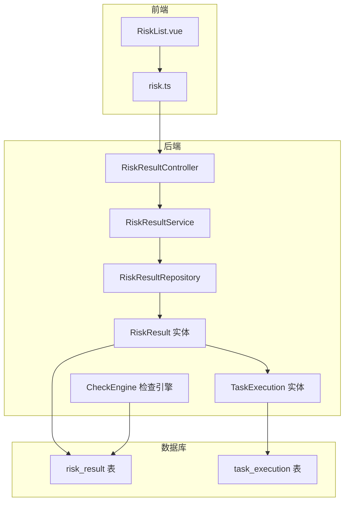
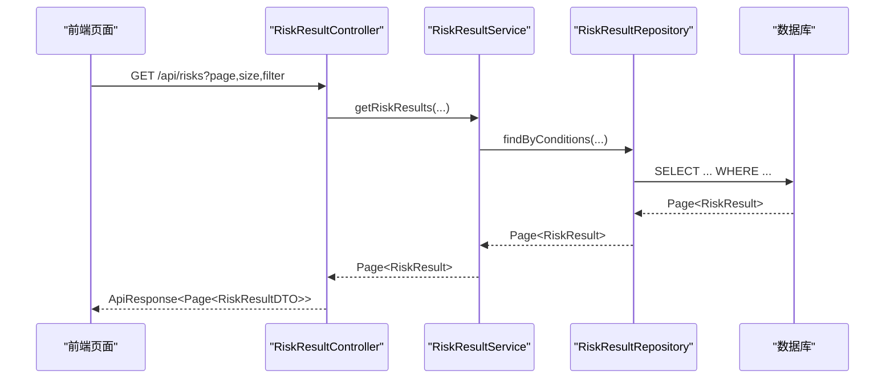
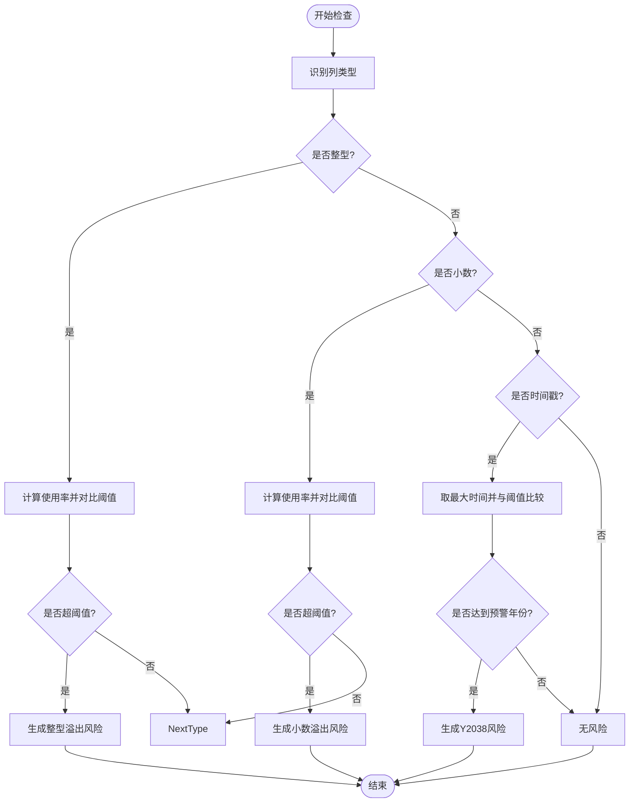
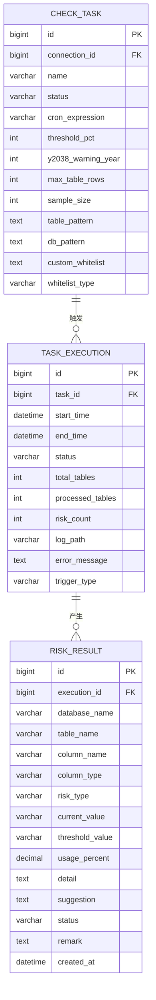
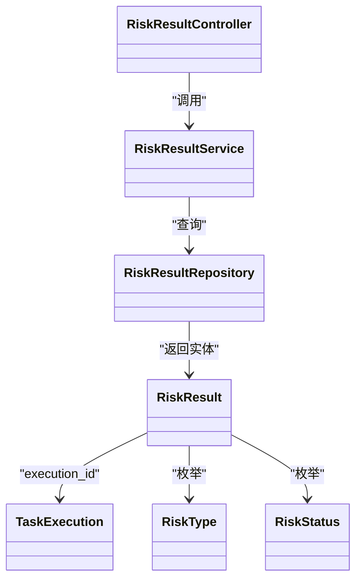

# 风险结果表 (risk_result)

<cite>
**本文引用的文件**
- [RiskResult.java](file://backend/src/main/java/com/fieldcheck/entity/RiskResult.java)
- [RiskResultRepository.java](file://backend/src/main/java/com/fieldcheck/repository/RiskResultRepository.java)
- [RiskResultService.java](file://backend/src/main/java/com/fieldcheck/service/RiskResultService.java)
- [RiskResultController.java](file://backend/src/main/java/com/fieldcheck/controller/RiskResultController.java)
- [RiskResultDTO.java](file://backend/src/main/java/com/fieldcheck/dto/RiskResultDTO.java)
- [RiskType.java](file://backend/src/main/java/com/fieldcheck/entity/RiskType.java)
- [RiskStatus.java](file://backend/src/main/java/com/fieldcheck/entity/RiskStatus.java)
- [TaskExecution.java](file://backend/src/main/java/com/fieldcheck/entity/TaskExecution.java)
- [RiskStatsDTO.java](file://backend/src/main/java/com/fieldcheck/dto/RiskStatsDTO.java)
- [01_init_schema.sql](file://mysql/init/01_init_schema.sql)
- [CheckEngine.java](file://backend/src/main/java/com/fieldcheck/engine/CheckEngine.java)
- [RiskList.vue](file://frontend/src/views/risk/RiskList.vue)
- [risk.ts](file://frontend/src/api/risk.ts)
</cite>

## 目录
1. [简介](#简介)
2. [项目结构](#项目结构)
3. [核心组件](#核心组件)
4. [架构总览](#架构总览)
5. [详细组件分析](#详细组件分析)
6. [依赖关系分析](#依赖关系分析)
7. [性能考量](#性能考量)
8. [故障排查指南](#故障排查指南)
9. [结论](#结论)
10. [附录](#附录)

## 简介
本文件围绕风险结果表（risk_result）进行系统化说明，涵盖字段定义、风险状态与分类体系、风险类型判定逻辑、处理流程与优先级管理、统计分析与报表生成，以及与任务执行表（task_execution）的关联关系与查询优化策略。目标是帮助读者全面理解该表在系统中的作用、数据含义及运维实践。

## 项目结构
风险结果表位于后端实体层、仓储层、服务层与控制层之间，前端通过 API 访问并展示风险结果，同时支持导出与统计分析。

图表来源
- [RiskResultController.java](file://backend/src/main/java/com/fieldcheck/controller/RiskResultController.java#L31-L146)
- [RiskResultService.java](file://backend/src/main/java/com/fieldcheck/service/RiskResultService.java#L20-L124)
- [RiskResultRepository.java](file://backend/src/main/java/com/fieldcheck/repository/RiskResultRepository.java#L16-L70)
- [RiskResult.java](file://backend/src/main/java/com/fieldcheck/entity/RiskResult.java#L23-L67)
- [TaskExecution.java](file://backend/src/main/java/com/fieldcheck/entity/TaskExecution.java#L19-L57)
- [01_init_schema.sql](file://mysql/init/01_init_schema.sql#L87-L110)
- [CheckEngine.java](file://backend/src/main/java/com/fieldcheck/engine/CheckEngine.java#L57-L165)

章节来源
- [RiskResultController.java](file://backend/src/main/java/com/fieldcheck/controller/RiskResultController.java#L31-L146)
- [RiskResultService.java](file://backend/src/main/java/com/fieldcheck/service/RiskResultService.java#L20-L124)
- [RiskResultRepository.java](file://backend/src/main/java/com/fieldcheck/repository/RiskResultRepository.java#L16-L70)
- [RiskResult.java](file://backend/src/main/java/com/fieldcheck/entity/RiskResult.java#L23-L67)
- [TaskExecution.java](file://backend/src/main/java/com/fieldcheck/entity/TaskExecution.java#L19-L57)
- [01_init_schema.sql](file://mysql/init/01_init_schema.sql#L87-L110)

## 核心组件
- 实体层：RiskResult 定义了风险结果的数据模型，包含数据库名、表名、列名、列类型、风险类型、当前值、阈值、使用百分比、详情、建议、状态、备注等字段，并与 TaskExecution 建立多对一关联。
- 仓储层：RiskResultRepository 提供按条件分页查询、按执行记录或任务过滤、按状态计数、趋势统计等查询方法。
- 服务层：RiskResultService 提供风险结果列表查询、单条查询、状态更新、统计聚合（总数、各状态数量、按风险类型分布、近30天趋势）与 DTO 转换。
- 控制层：RiskResultController 提供风险结果列表、详情、统计、状态更新、Excel 导出等接口。
- 枚举：RiskType 定义风险类型；RiskStatus 定义风险状态。
- 前端：RiskList.vue 展示风险列表、搜索、导出与状态变更；risk.ts 提供 API 调用封装。

章节来源
- [RiskResult.java](file://backend/src/main/java/com/fieldcheck/entity/RiskResult.java#L23-L67)
- [RiskResultRepository.java](file://backend/src/main/java/com/fieldcheck/repository/RiskResultRepository.java#L16-L70)
- [RiskResultService.java](file://backend/src/main/java/com/fieldcheck/service/RiskResultService.java#L20-L124)
- [RiskResultController.java](file://backend/src/main/java/com/fieldcheck/controller/RiskResultController.java#L31-L146)
- [RiskType.java](file://backend/src/main/java/com/fieldcheck/entity/RiskType.java#L3-L10)
- [RiskStatus.java](file://backend/src/main/java/com/fieldcheck/entity/RiskStatus.java#L3-L7)
- [RiskList.vue](file://frontend/src/views/risk/RiskList.vue#L1-L257)
- [risk.ts](file://frontend/src/api/risk.ts#L1-L71)

## 架构总览
风险结果表作为风险检测的产物，由检查引擎在任务执行过程中生成并持久化到数据库。前端通过控制器提供的接口访问数据，支持分页、筛选、统计与导出。

图表来源
- [RiskResultController.java](file://backend/src/main/java/com/fieldcheck/controller/RiskResultController.java#L38-L52)
- [RiskResultService.java](file://backend/src/main/java/com/fieldcheck/service/RiskResultService.java#L27-L30)
- [RiskResultRepository.java](file://backend/src/main/java/com/fieldcheck/repository/RiskResultRepository.java#L27-L38)

## 详细组件分析

### 字段定义与业务语义
- 执行记录关联：execution_id 外键关联 task_execution，用于标识风险属于哪次任务执行。
- 对象定位：database_name、table_name、column_name、column_type 组合唯一标识风险对象。
- 风险类型：risk_type 使用枚举，覆盖整型溢出、小数溢出、Y2038 问题、字符串截断、日期异常等。
- 数值与阈值：current_value、threshold_value 记录实际值与阈值；usage_percent 计算使用率。
- 描述与建议：detail 记录检测详情；suggestion 提供修复建议。
- 状态与备注：status 使用枚举（PENDING/IGNORED/RESOLVED），remark 用于人工备注。
- 创建时间：createdAt 用于排序与趋势分析。

章节来源
- [RiskResult.java](file://backend/src/main/java/com/fieldcheck/entity/RiskResult.java#L29-L66)
- [RiskType.java](file://backend/src/main/java/com/fieldcheck/entity/RiskType.java#L3-L10)
- [RiskStatus.java](file://backend/src/main/java/com/fieldcheck/entity/RiskStatus.java#L3-L7)
- [01_init_schema.sql](file://mysql/init/01_init_schema.sql#L87-L110)

### 风险状态管理与分类体系
- 风险状态（RiskStatus）
  - PENDING：待处理，初始状态。
  - IGNORED：已忽略，人工标记为不处理。
  - RESOLVED：已解决，人工标记为已完成处理。
- 风险类型（RiskType）
  - INT_OVERFLOW：整型溢出
  - DECIMAL_OVERFLOW：小数溢出
  - Y2038：Y2038 时间戳问题
  - STRING_TRUNCATION：字符串截断（检查引擎未在此文件体现，但枚举存在）
  - DATE_ANOMALY：日期异常（检查引擎未在此文件体现，但枚举存在）
  - OTHER：其他风险

章节来源
- [RiskStatus.java](file://backend/src/main/java/com/fieldcheck/entity/RiskStatus.java#L3-L7)
- [RiskType.java](file://backend/src/main/java/com/fieldcheck/entity/RiskType.java#L3-L10)

### 风险类型定义与判断逻辑
检查引擎根据列类型与数据特征进行风险识别：
- 整型溢出（INT_OVERFLOW）
  - 判断依据：列数据类型为整型族，计算当前最大值与类型上限的使用率，超过阈值即生成风险。
  - 使用率计算：基于绝对最大值与类型上限的百分比。
- 小数溢出（DECIMAL_OVERFLOW）
  - 判断依据：列数据类型为小数（DECIMAL），根据精度与标度计算允许的最大值，比较当前最大绝对值与阈值。
- Y2038（Y2038）
  - 判断依据：列数据类型为 TIMESTAMP，取最大时间值，若年份达到预警阈值则生成风险。
- 字符串截断（STRING_TRUNCATION）、日期异常（DATE_ANOMALY）
  - 枚举存在，但当前检查逻辑未在该文件体现，后续可扩展。

图表来源
- [CheckEngine.java](file://backend/src/main/java/com/fieldcheck/engine/CheckEngine.java#L242-L411)

章节来源
- [CheckEngine.java](file://backend/src/main/java/com/fieldcheck/engine/CheckEngine.java#L242-L411)

### 风险处理流程与优先级管理
- 处理流程
  - 查询：支持按执行记录、数据库名、表名、风险类型、状态分页查询。
  - 更新：支持将风险状态更新为 IGNORED 或 RESOLVED，并可附带备注。
  - 导出：支持按筛选条件导出 Excel 报表。
- 优先级管理
  - 当前系统未内置自动优先级计算，建议结合使用率、风险类型严重程度与业务影响制定策略（例如：高使用率 + 关键业务字段优先处理）。
  - 前端展示按创建时间倒序，便于快速定位最新风险。

章节来源
- [RiskResultController.java](file://backend/src/main/java/com/fieldcheck/controller/RiskResultController.java#L38-L78)
- [RiskResultService.java](file://backend/src/main/java/com/fieldcheck/service/RiskResultService.java#L42-L50)
- [RiskList.vue](file://frontend/src/views/risk/RiskList.vue#L64-L82)

### 风险统计分析与报表生成
- 统计维度
  - 总数、待处理、已忽略、已解决数量。
  - 按风险类型分布统计。
  - 近30天风险趋势（按日统计）。
- 报表导出
  - 支持按筛选条件导出 Excel，包含关键字段与状态、时间等信息，便于线下分析与归档。

章节来源
- [RiskResultService.java](file://backend/src/main/java/com/fieldcheck/service/RiskResultService.java#L52-L90)
- [RiskResultController.java](file://backend/src/main/java/com/fieldcheck/controller/RiskResultController.java#L80-L144)
- [RiskStatsDTO.java](file://backend/src/main/java/com/fieldcheck/dto/RiskStatsDTO.java#L15-L31)

### 与任务执行表的关联关系与数据关联查询优化
- 关联关系
  - risk_result.execution_id → task_execution.id，表示风险属于某次任务执行。
  - task_execution.task_id → check_task.id，表示执行所属的任务模板。
- 查询优化
  - 数据库层面建立索引：execution_id、risk_type、status，提升按执行记录、类型、状态的查询效率。
  - 仓储层提供按执行记录与任务 ID 的直接查询，避免 N+1。
  - 分页查询与条件过滤，减少一次性加载大量数据。
  - 前端按需请求，避免全量导出导致内存压力。

图表来源
- [01_init_schema.sql](file://mysql/init/01_init_schema.sql#L87-L110)
- [01_init_schema.sql](file://mysql/init/01_init_schema.sql#L137-L155)
- [01_init_schema.sql](file://mysql/init/01_init_schema.sql#L43-L67)

章节来源
- [RiskResult.java](file://backend/src/main/java/com/fieldcheck/entity/RiskResult.java#L25-L27)
- [TaskExecution.java](file://backend/src/main/java/com/fieldcheck/entity/TaskExecution.java#L21-L23)
- [RiskResultRepository.java](file://backend/src/main/java/com/fieldcheck/repository/RiskResultRepository.java#L21-L25)
- [01_init_schema.sql](file://mysql/init/01_init_schema.sql#L87-L110)

## 依赖关系分析
- 控制器依赖服务层，服务层依赖仓储层与实体，仓储层访问数据库。
- 风险结果实体与任务执行实体存在多对一关系，便于按执行记录聚合与统计。
- 前端通过 API 与后端交互，支持分页、筛选、导出与状态更新。

图表来源
- [RiskResultController.java](file://backend/src/main/java/com/fieldcheck/controller/RiskResultController.java#L31-L146)
- [RiskResultService.java](file://backend/src/main/java/com/fieldcheck/service/RiskResultService.java#L20-L124)
- [RiskResultRepository.java](file://backend/src/main/java/com/fieldcheck/repository/RiskResultRepository.java#L16-L70)
- [RiskResult.java](file://backend/src/main/java/com/fieldcheck/entity/RiskResult.java#L23-L67)

章节来源
- [RiskResultController.java](file://backend/src/main/java/com/fieldcheck/controller/RiskResultController.java#L31-L146)
- [RiskResultService.java](file://backend/src/main/java/com/fieldcheck/service/RiskResultService.java#L20-L124)
- [RiskResultRepository.java](file://backend/src/main/java/com/fieldcheck/repository/RiskResultRepository.java#L16-L70)
- [RiskResult.java](file://backend/src/main/java/com/fieldcheck/entity/RiskResult.java#L23-L67)

## 性能考量
- 查询优化
  - 使用索引：execution_id、risk_type、status，避免全表扫描。
  - 条件过滤：按执行记录、数据库名、表名、风险类型、状态组合过滤，缩小结果集。
  - 分页：默认按创建时间倒序分页，避免一次性加载过多数据。
- 写入优化
  - 检查引擎批量保存风险结果，减少事务开销。
  - 任务进度每处理若干张表统一保存一次，降低写入频率。
- 导出优化
  - 后端使用 Apache POI 流式写入，避免大对象占用内存。
  - 前端按筛选条件导出，避免全量导出。

章节来源
- [RiskResultRepository.java](file://backend/src/main/java/com/fieldcheck/repository/RiskResultRepository.java#L17-L68)
- [RiskResultController.java](file://backend/src/main/java/com/fieldcheck/controller/RiskResultController.java#L80-L144)
- [CheckEngine.java](file://backend/src/main/java/com/fieldcheck/engine/CheckEngine.java#L136-L157)

## 故障排查指南
- 风险结果为空
  - 检查是否存在符合条件的执行记录与任务；确认筛选条件是否过于严格。
  - 确认任务执行是否成功，执行记录状态是否正确。
- 风险状态无法更新
  - 确认请求参数包含合法的状态值与可选备注；检查权限是否具备。
- 导出失败
  - 检查后端异常日志；确认导出条件未超出内存限制；尝试缩小导出范围。
- 性能问题
  - 检查数据库索引是否生效；确认分页大小合理；避免全量导出。

章节来源
- [RiskResultController.java](file://backend/src/main/java/com/fieldcheck/controller/RiskResultController.java#L65-L78)
- [RiskResultService.java](file://backend/src/main/java/com/fieldcheck/service/RiskResultService.java#L37-L50)
- [RiskResultRepository.java](file://backend/src/main/java/com/fieldcheck/repository/RiskResultRepository.java#L27-L50)

## 结论
风险结果表（risk_result）是系统风险检测的核心产物，承载了数据库、表、字段级别的风险信息，并通过明确的状态与类型体系支撑后续处理与统计分析。结合检查引擎的自动化检测、仓储层的高效查询与前端的可视化展示，形成了从“发现问题—处理—统计—归档”的完整闭环。建议在现有基础上进一步完善风险优先级策略与告警联动机制，以提升整体运维效率。

## 附录
- 前端交互要点
  - 支持按执行记录、数据库名、风险类型、状态筛选与分页查看。
  - 支持导出 Excel，便于线下复核与归档。
  - 支持将风险标记为已忽略或已解决，并附带备注。

章节来源
- [RiskList.vue](file://frontend/src/views/risk/RiskList.vue#L1-L257)
- [risk.ts](file://frontend/src/api/risk.ts#L1-L71)