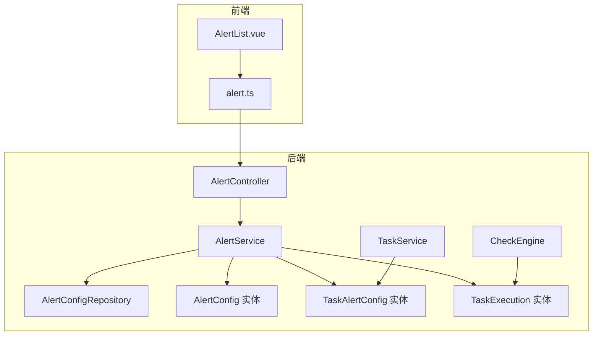
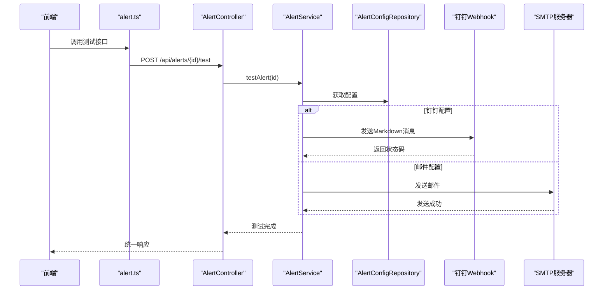
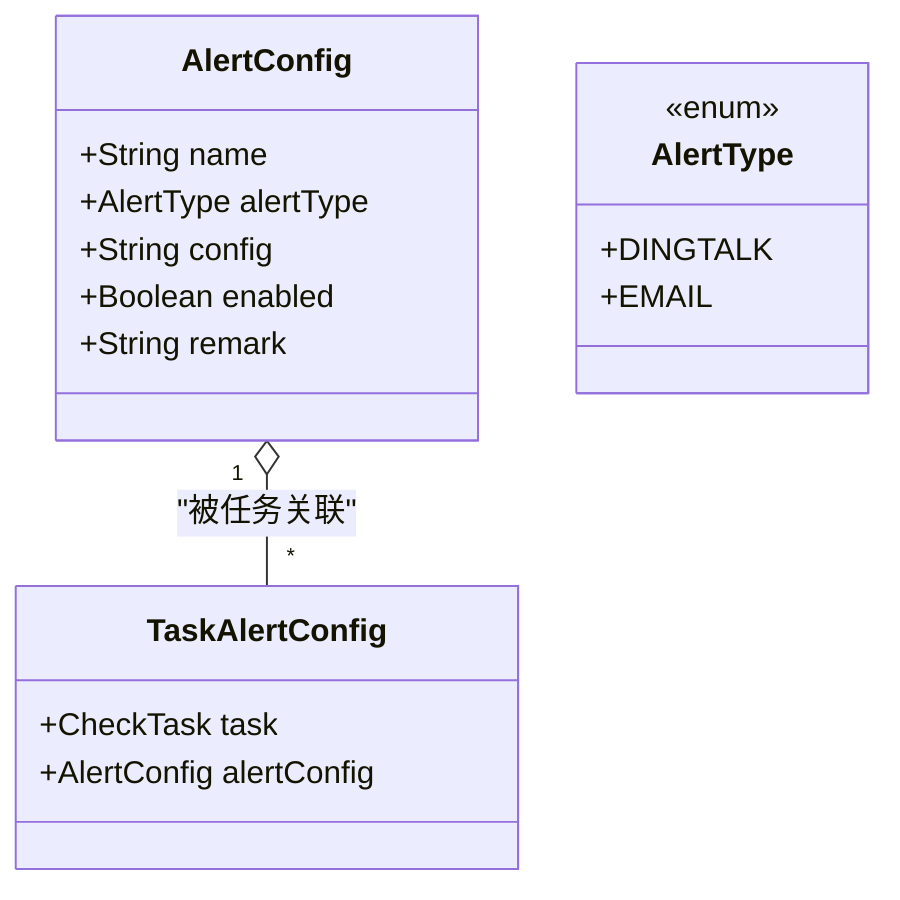
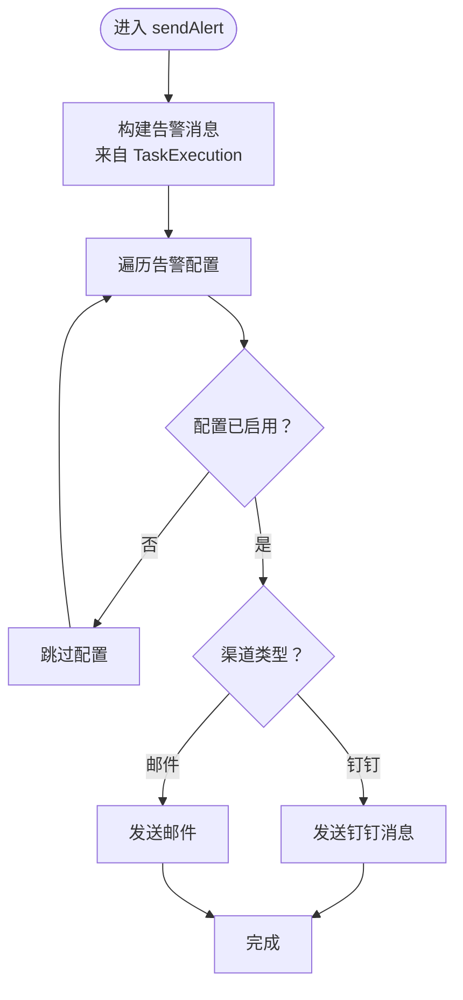
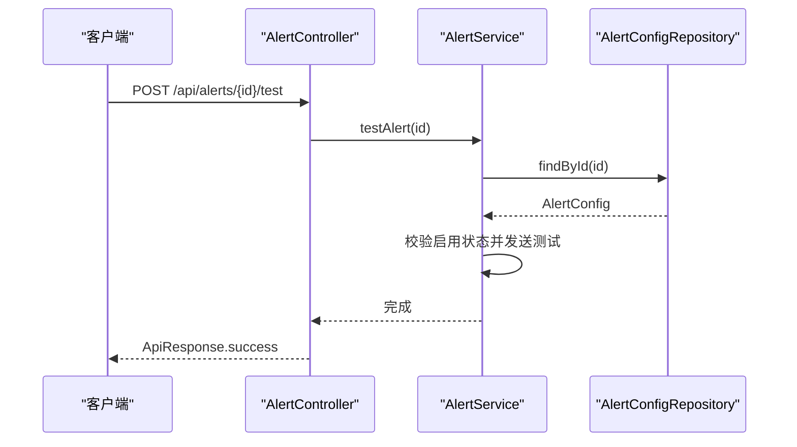
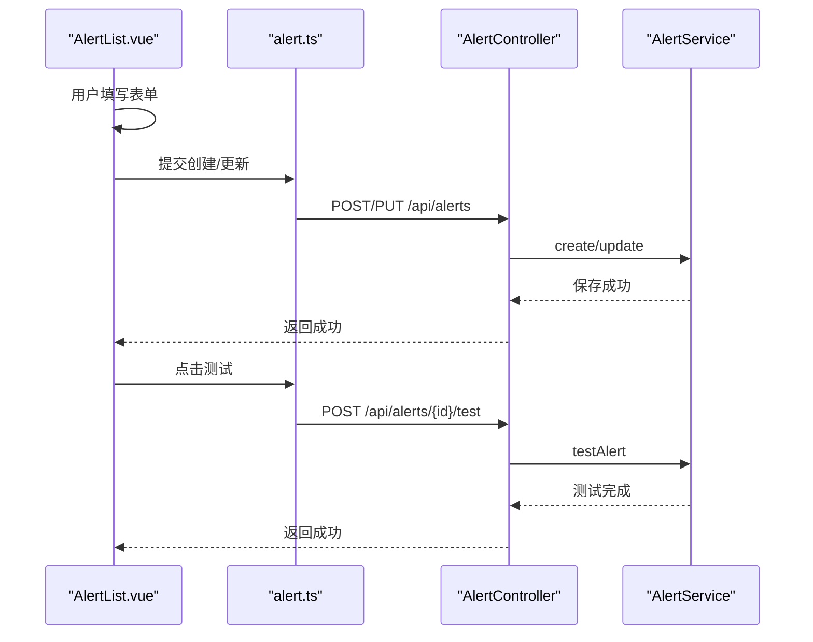
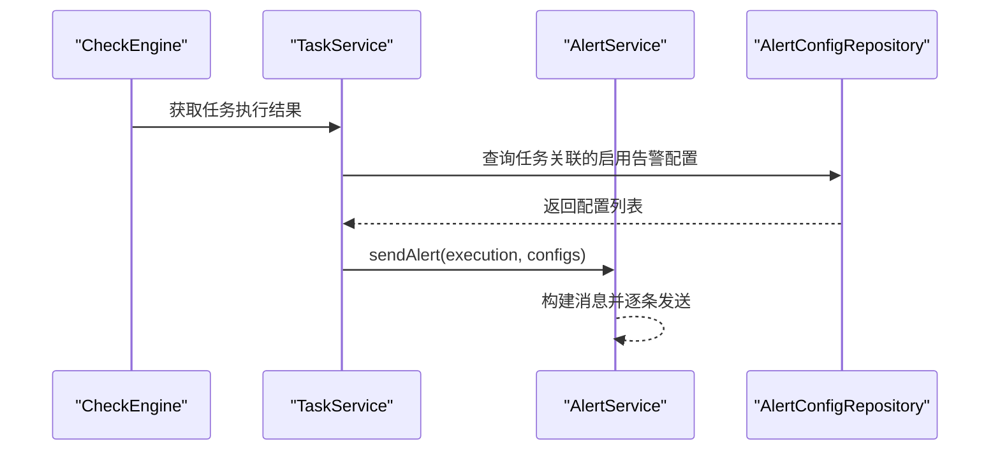
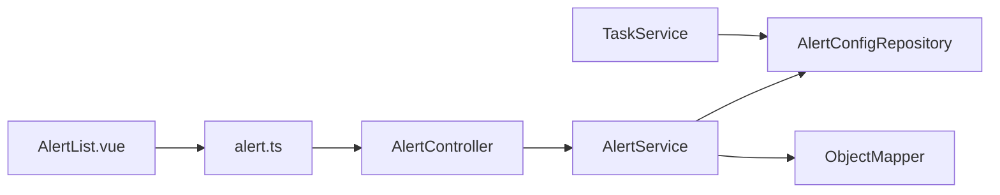

# 告警通知系统

<cite>
**本文引用的文件**
- [AlertConfig.java](file://backend/src/main/java/com/fieldcheck/entity/AlertConfig.java)
- [AlertType.java](file://backend/src/main/java/com/fieldcheck/entity/AlertType.java)
- [TaskAlertConfig.java](file://backend/src/main/java/com/fieldcheck/entity/TaskAlertConfig.java)
- [AlertService.java](file://backend/src/main/java/com/fieldcheck/service/AlertService.java)
- [AlertController.java](file://backend/src/main/java/com/fieldcheck/controller/AlertController.java)
- [AlertConfigRepository.java](file://backend/src/main/java/com/fieldcheck/repository/AlertConfigRepository.java)
- [TaskExecution.java](file://backend/src/main/java/com/fieldcheck/entity/TaskExecution.java)
- [TaskService.java](file://backend/src/main/java/com/fieldcheck/service/TaskService.java)
- [CheckEngine.java](file://backend/src/main/java/com/fieldcheck/engine/CheckEngine.java)
- [AlertList.vue](file://frontend/src/views/alert/AlertList.vue)
- [alert.ts](file://frontend/src/api/alert.ts)
- [application.yml](file://backend/src/main/resources/application.yml)
- [ApiResponse.java](file://backend/src/main/java/com/fieldcheck/dto/ApiResponse.java)
</cite>

## 目录
1. [简介](#简介)
2. [项目结构](#项目结构)
3. [核心组件](#核心组件)
4. [架构总览](#架构总览)
5. [详细组件分析](#详细组件分析)
6. [依赖关系分析](#依赖关系分析)
7. [性能考量](#性能考量)
8. [故障排查指南](#故障排查指南)
9. [结论](#结论)
10. [附录](#附录)

## 简介
本告警通知系统为“MySQL字段容量检查”平台的核心能力之一，负责在任务执行完成后，基于配置的告警规则向指定渠道（邮件、钉钉）推送通知。系统支持多渠道配置、动态测试、按任务关联的告警配置管理，并提供统一的REST API与前端界面进行配置与运维。

## 项目结构
后端采用Spring Boot + JPA架构，前端使用Vue3 + Element Plus。告警相关模块主要分布在以下位置：
- 实体层：AlertConfig、AlertType、TaskAlertConfig、TaskExecution
- 仓储层：AlertConfigRepository
- 服务层：AlertService、TaskService
- 控制器层：AlertController
- 前端：AlertList.vue、alert.ts
- 配置：application.yml

图表来源
- [AlertList.vue](file://frontend/src/views/alert/AlertList.vue#L1-L412)
- [alert.ts](file://frontend/src/api/alert.ts#L1-L28)
- [AlertController.java](file://backend/src/main/java/com/fieldcheck/controller/AlertController.java#L1-L67)
- [AlertService.java](file://backend/src/main/java/com/fieldcheck/service/AlertService.java#L1-L274)
- [AlertConfigRepository.java](file://backend/src/main/java/com/fieldcheck/repository/AlertConfigRepository.java#L1-L19)
- [TaskService.java](file://backend/src/main/java/com/fieldcheck/service/TaskService.java#L142-L176)
- [CheckEngine.java](file://backend/src/main/java/com/fieldcheck/engine/CheckEngine.java#L1-L454)
- [AlertConfig.java](file://backend/src/main/java/com/fieldcheck/entity/AlertConfig.java#L1-L37)
- [TaskAlertConfig.java](file://backend/src/main/java/com/fieldcheck/entity/TaskAlertConfig.java#L1-L29)
- [TaskExecution.java](file://backend/src/main/java/com/fieldcheck/entity/TaskExecution.java#L1-L58)

章节来源
- [AlertController.java](file://backend/src/main/java/com/fieldcheck/controller/AlertController.java#L1-L67)
- [AlertService.java](file://backend/src/main/java/com/fieldcheck/service/AlertService.java#L1-L274)
- [AlertConfigRepository.java](file://backend/src/main/java/com/fieldcheck/repository/AlertConfigRepository.java#L1-L19)
- [AlertConfig.java](file://backend/src/main/java/com/fieldcheck/entity/AlertConfig.java#L1-L37)
- [TaskAlertConfig.java](file://backend/src/main/java/com/fieldcheck/entity/TaskAlertConfig.java#L1-L29)
- [TaskExecution.java](file://backend/src/main/java/com/fieldcheck/entity/TaskExecution.java#L1-L58)
- [TaskService.java](file://backend/src/main/java/com/fieldcheck/service/TaskService.java#L142-L176)
- [CheckEngine.java](file://backend/src/main/java/com/fieldcheck/engine/CheckEngine.java#L1-L454)
- [AlertList.vue](file://frontend/src/views/alert/AlertList.vue#L1-L412)
- [alert.ts](file://frontend/src/api/alert.ts#L1-L28)
- [application.yml](file://backend/src/main/resources/application.yml#L1-L75)

## 核心组件
- AlertConfig：告警配置实体，包含名称、类型、JSON配置、启用状态与备注等字段。
- AlertType：枚举类型，支持DINGTALK与EMAIL两种告警渠道。
- AlertConfigRepository：JPA仓库，提供按启用状态、类型查询与名称唯一性校验。
- AlertService：核心服务，负责配置的CRUD、测试、构建通知消息、发送邮件与钉钉告警。
- AlertController：REST控制器，提供告警配置的查询、创建、更新、删除与测试接口。
- TaskAlertConfig：任务与告警配置的关联表，实现多任务多配置的灵活绑定。
- TaskExecution：任务执行记录，作为告警消息内容的数据来源。
- TaskService：提供任务到告警配置的映射与过滤（仅启用配置）。
- CheckEngine：检查引擎，生成任务执行结果，驱动告警发送流程。

章节来源
- [AlertConfig.java](file://backend/src/main/java/com/fieldcheck/entity/AlertConfig.java#L1-L37)
- [AlertType.java](file://backend/src/main/java/com/fieldcheck/entity/AlertType.java#L1-L7)
- [AlertConfigRepository.java](file://backend/src/main/java/com/fieldcheck/repository/AlertConfigRepository.java#L1-L19)
- [AlertService.java](file://backend/src/main/java/com/fieldcheck/service/AlertService.java#L1-L274)
- [AlertController.java](file://backend/src/main/java/com/fieldcheck/controller/AlertController.java#L1-L67)
- [TaskAlertConfig.java](file://backend/src/main/java/com/fieldcheck/entity/TaskAlertConfig.java#L1-L29)
- [TaskExecution.java](file://backend/src/main/java/com/fieldcheck/entity/TaskExecution.java#L1-L58)
- [TaskService.java](file://backend/src/main/java/com/fieldcheck/service/TaskService.java#L142-L176)
- [CheckEngine.java](file://backend/src/main/java/com/fieldcheck/engine/CheckEngine.java#L1-L454)

## 架构总览
告警系统遵循典型的分层架构：
- 表现层：前端页面与API调用
- 控制器层：接收请求、参数校验、返回统一响应
- 服务层：业务逻辑、渠道适配、异常处理
- 数据访问层：JPA仓库、实体映射
- 外部集成：HTTP客户端（钉钉）、JavaMailSender（邮件）

图表来源
- [alert.ts](file://frontend/src/api/alert.ts#L1-L28)
- [AlertController.java](file://backend/src/main/java/com/fieldcheck/controller/AlertController.java#L60-L66)
- [AlertService.java](file://backend/src/main/java/com/fieldcheck/service/AlertService.java#L99-L122)
- [AlertConfigRepository.java](file://backend/src/main/java/com/fieldcheck/repository/AlertConfigRepository.java#L11-L18)

## 详细组件分析

### AlertConfig 配置管理
- 字段设计
  - 名称：唯一标识，用于区分不同告警渠道配置
  - 类型：枚举，限定DINGTALK或EMAIL
  - 配置：JSON字符串，承载渠道特定参数（如webhook、密钥、SMTP信息、收件人等）
  - 启用状态：布尔值，控制是否参与告警发送
  - 备注：文本描述
- 关联关系
  - 与任务通过TaskAlertConfig建立多对多的可选绑定，实现按任务选择性启用告警

图表来源
- [AlertConfig.java](file://backend/src/main/java/com/fieldcheck/entity/AlertConfig.java#L18-L36)
- [TaskAlertConfig.java](file://backend/src/main/java/com/fieldcheck/entity/TaskAlertConfig.java#L19-L28)
- [AlertType.java](file://backend/src/main/java/com/fieldcheck/entity/AlertType.java#L3-L6)

章节来源
- [AlertConfig.java](file://backend/src/main/java/com/fieldcheck/entity/AlertConfig.java#L1-L37)
- [TaskAlertConfig.java](file://backend/src/main/java/com/fieldcheck/entity/TaskAlertConfig.java#L1-L29)
- [AlertType.java](file://backend/src/main/java/com/fieldcheck/entity/AlertType.java#L1-L7)

### AlertService 服务实现
- 配置管理
  - 查询：支持按名称模糊、类型、启用状态筛选；支持仅获取启用配置
  - 创建/更新/删除：基于仓库进行持久化操作
  - 测试：根据配置类型调用对应渠道发送测试消息
- 通知发送
  - 构建消息：从TaskExecution抽取任务名、状态、表数、风险数、起止时间等
  - 渠道适配：
    - 钉钉：解析webhook与可选签名密钥，构造Markdown消息体并通过HTTP客户端发送
    - 邮件：动态创建JavaMailSender，解析SMTP与收件人配置，发送纯文本邮件
- 错误处理：捕获异常并记录日志，避免影响主流程

图表来源
- [AlertService.java](file://backend/src/main/java/com/fieldcheck/service/AlertService.java#L124-L140)
- [AlertService.java](file://backend/src/main/java/com/fieldcheck/service/AlertService.java#L142-L157)
- [AlertService.java](file://backend/src/main/java/com/fieldcheck/service/AlertService.java#L159-L199)
- [AlertService.java](file://backend/src/main/java/com/fieldcheck/service/AlertService.java#L201-L222)

章节来源
- [AlertService.java](file://backend/src/main/java/com/fieldcheck/service/AlertService.java#L1-L274)

### AlertController API 接口
- GET /api/alerts：分页与筛选查询
- GET /api/alerts/enabled：仅获取启用配置
- GET /api/alerts/{id}：按ID获取配置
- POST /api/alerts：创建配置
- PUT /api/alerts/{id}：更新配置
- DELETE /api/alerts/{id}：删除配置
- POST /api/alerts/{id}/test：测试告警

图表来源
- [AlertController.java](file://backend/src/main/java/com/fieldcheck/controller/AlertController.java#L60-L66)
- [AlertService.java](file://backend/src/main/java/com/fieldcheck/service/AlertService.java#L99-L122)
- [AlertConfigRepository.java](file://backend/src/main/java/com/fieldcheck/repository/AlertConfigRepository.java#L11-L18)

章节来源
- [AlertController.java](file://backend/src/main/java/com/fieldcheck/controller/AlertController.java#L1-L67)
- [ApiResponse.java](file://backend/src/main/java/com/fieldcheck/dto/ApiResponse.java#L1-L44)

### 前端集成与模板定制
- 前端页面支持：
  - 搜索：按名称、类型、启用状态筛选
  - 列表：显示配置名称、类型、配置摘要、启用状态、创建时间
  - 表单：支持钉钉与邮件两种类型的配置项，动态渲染
  - 测试：调用后端测试接口验证配置有效性
- 配置转换：
  - 钉钉：webhook、secret、atMobiles
  - 邮件：smtpHost、smtpPort、senderEmail、senderPassword、emailRecipients、useSsl
- 模板定制：
  - 前端负责将表单数据转换为后端期望的JSON结构存入config字段
  - 后端在发送时使用统一的消息模板（Markdown或纯文本），不支持运行时模板变量替换

图表来源
- [AlertList.vue](file://frontend/src/views/alert/AlertList.vue#L364-L412)
- [alert.ts](file://frontend/src/api/alert.ts#L12-L26)
- [AlertController.java](file://backend/src/main/java/com/fieldcheck/controller/AlertController.java#L41-L66)
- [AlertService.java](file://backend/src/main/java/com/fieldcheck/service/AlertService.java#L99-L122)

章节来源
- [AlertList.vue](file://frontend/src/views/alert/AlertList.vue#L1-L412)
- [alert.ts](file://frontend/src/api/alert.ts#L1-L28)

### 告警规则、触发条件与升级机制
- 触发条件
  - 由任务执行完成事件触发，CheckEngine在执行结束后，TaskService获取该任务关联的启用告警配置，AlertService逐条发送
- 告警规则
  - 基于任务执行结果（TaskExecution）构建消息，包含任务名、状态、表数、风险数、起止时间等
- 升级机制
  - 当前实现未提供多级升级策略（如首次告警、二次提醒、人工介入等），可在现有sendAlert循环基础上扩展
- 重复告警抑制
  - 当前实现未内置去重或静默窗口机制，可在AlertService中引入缓存或状态机以避免重复发送

图表来源
- [CheckEngine.java](file://backend/src/main/java/com/fieldcheck/engine/CheckEngine.java#L1-L454)
- [TaskService.java](file://backend/src/main/java/com/fieldcheck/service/TaskService.java#L169-L175)
- [AlertService.java](file://backend/src/main/java/com/fieldcheck/service/AlertService.java#L124-L140)
- [AlertConfigRepository.java](file://backend/src/main/java/com/fieldcheck/repository/AlertConfigRepository.java#L13-L15)

章节来源
- [CheckEngine.java](file://backend/src/main/java/com/fieldcheck/engine/CheckEngine.java#L1-L454)
- [TaskService.java](file://backend/src/main/java/com/fieldcheck/service/TaskService.java#L142-L176)
- [AlertService.java](file://backend/src/main/java/com/fieldcheck/service/AlertService.java#L124-L140)

### 通知模板管理
- 钉钉：使用Markdown消息体，标题固定为“MySQL字段容量检查报告”，正文包含任务与执行统计信息
- 邮件：主题包含任务名，正文去除Markdown标记，使用纯文本
- 模板定制建议：可在AlertService中引入模板引擎或配置化消息体，但当前版本为硬编码模板

章节来源
- [AlertService.java](file://backend/src/main/java/com/fieldcheck/service/AlertService.java#L142-L157)
- [AlertService.java](file://backend/src/main/java/com/fieldcheck/service/AlertService.java#L176-L182)
- [AlertService.java](file://backend/src/main/java/com/fieldcheck/service/AlertService.java#L214-L218)

### 历史记录与审计
- 执行记录：TaskExecution记录每次任务的开始/结束时间、状态、表数、风险数等，作为告警消息来源
- 审计与日志：系统使用SLF4J输出日志，包含测试与发送成功的提示及错误信息
- 历史查询：前端提供按名称、类型、启用状态筛选的列表页，便于查看与管理

章节来源
- [TaskExecution.java](file://backend/src/main/java/com/fieldcheck/entity/TaskExecution.java#L1-L58)
- [AlertList.vue](file://frontend/src/views/alert/AlertList.vue#L11-L412)
- [AlertService.java](file://backend/src/main/java/com/fieldcheck/service/AlertService.java#L117-L118)

## 依赖关系分析
- 组件耦合
  - AlertController依赖AlertService；AlertService依赖AlertConfigRepository与Jackson对象映射
  - TaskService提供任务到告警配置的映射，降低AlertService与任务模型的耦合
  - 前端通过alert.ts与后端交互，保持前后端解耦
- 外部依赖
  - 钉钉：HTTP客户端发送消息
  - 邮件：JavaMailSender动态配置SMTP参数
- 潜在问题
  - AlertService直接依赖HTTP与SMTP，建议抽象为通知适配器接口，便于扩展新渠道与单元测试

图表来源
- [AlertController.java](file://backend/src/main/java/com/fieldcheck/controller/AlertController.java#L1-L67)
- [AlertService.java](file://backend/src/main/java/com/fieldcheck/service/AlertService.java#L35-L36)
- [AlertConfigRepository.java](file://backend/src/main/java/com/fieldcheck/repository/AlertConfigRepository.java#L1-L19)
- [TaskService.java](file://backend/src/main/java/com/fieldcheck/service/TaskService.java#L169-L175)
- [AlertList.vue](file://frontend/src/views/alert/AlertList.vue#L1-L412)
- [alert.ts](file://frontend/src/api/alert.ts#L1-L28)

章节来源
- [AlertController.java](file://backend/src/main/java/com/fieldcheck/controller/AlertController.java#L1-L67)
- [AlertService.java](file://backend/src/main/java/com/fieldcheck/service/AlertService.java#L1-L274)
- [AlertConfigRepository.java](file://backend/src/main/java/com/fieldcheck/repository/AlertConfigRepository.java#L1-L19)
- [TaskService.java](file://backend/src/main/java/com/fieldcheck/service/TaskService.java#L142-L176)
- [AlertList.vue](file://frontend/src/views/alert/AlertList.vue#L1-L412)
- [alert.ts](file://frontend/src/api/alert.ts#L1-L28)

## 性能考量
- HTTP请求：钉钉发送使用短连接，建议在高并发场景下引入连接池与超时配置优化
- 邮件发送：动态创建JavaMailSender，建议复用或缓存以减少开销
- 日志输出：默认DEBUG级别开启，生产环境建议调整日志级别
- 数据库写入：任务进度保存采用批量策略，告警发送应避免阻塞主事务

## 故障排查指南
- 钉钉告警失败
  - 检查webhook地址与签名密钥配置
  - 查看HTTP状态码与日志输出
- 邮件告警失败
  - 校验SMTP主机、端口、用户名、密码
  - 确认收件人列表格式正确
- 配置不可用
  - 确认配置处于启用状态
  - 使用测试接口验证配置连通性
- 前端无法保存
  - 检查表单必填项与邮箱格式
  - 确认后端返回的错误信息

章节来源
- [AlertService.java](file://backend/src/main/java/com/fieldcheck/service/AlertService.java#L117-L121)
- [AlertService.java](file://backend/src/main/java/com/fieldcheck/service/AlertService.java#L190-L196)
- [AlertService.java](file://backend/src/main/java/com/fieldcheck/service/AlertService.java#L201-L222)
- [AlertList.vue](file://frontend/src/views/alert/AlertList.vue#L261-L273)

## 结论
本告警通知系统提供了简洁可靠的邮件与钉钉告警能力，结合任务执行结果自动推送通知。系统具备良好的扩展性，可通过增加渠道适配器与引入模板引擎进一步增强灵活性。建议后续补充重复告警抑制、告警升级与历史归档能力，以满足更复杂的运维需求。

## 附录

### API定义
- 查询所有配置
  - 方法：GET
  - 路径：/api/alerts
  - 参数：name、type、enabled
- 查询启用配置
  - 方法：GET
  - 路径：/api/alerts/enabled
- 获取单个配置
  - 方法：GET
  - 路径：/api/alerts/{id}
- 创建配置
  - 方法：POST
  - 路径：/api/alerts
  - 权限：ADMIN或USER
- 更新配置
  - 方法：PUT
  - 路径：/api/alerts/{id}
  - 权限：ADMIN或USER
- 删除配置
  - 方法：DELETE
  - 路径：/api/alerts/{id}
  - 权限：ADMIN
- 测试告警
  - 方法：POST
  - 路径：/api/alerts/{id}/test
  - 权限：ADMIN或USER

章节来源
- [AlertController.java](file://backend/src/main/java/com/fieldcheck/controller/AlertController.java#L19-L66)
- [ApiResponse.java](file://backend/src/main/java/com/fieldcheck/dto/ApiResponse.java#L17-L42)

### 配置指南
- 钉钉机器人
  - webhook：机器人的Webhook地址
  - secret：可选的加签密钥
  - atMobiles：可选的@手机号列表
- 邮件
  - smtpHost：SMTP服务器地址
  - smtpPort：SMTP端口
  - senderEmail：发件人邮箱（与smtpUsername二选一）
  - senderPassword：发件人密码（与smtpPassword二选一）
  - emailRecipients：收件人列表（与recipients二选一）
  - useSsl：是否启用SSL/TLS

章节来源
- [AlertList.vue](file://frontend/src/views/alert/AlertList.vue#L138-L161)
- [AlertList.vue](file://frontend/src/views/alert/AlertList.vue#L378-L394)
- [AlertService.java](file://backend/src/main/java/com/fieldcheck/service/AlertService.java#L247-L272)

### 扩展点说明
- 渠道适配器：抽象通知发送接口，便于新增微信企业号、飞书、短信等渠道
- 模板引擎：引入模板渲染，支持变量注入与国际化
- 去重与静默：在AlertService中引入缓存与时间窗口，避免重复告警
- 升级策略：按风险等级或持续时间触发不同级别通知