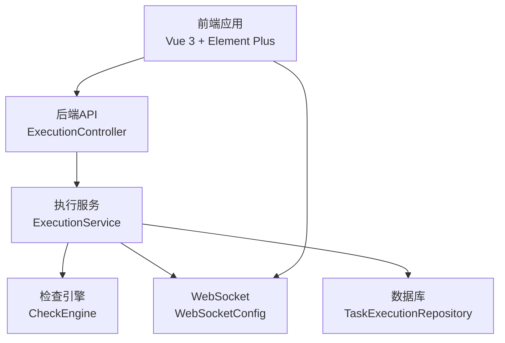
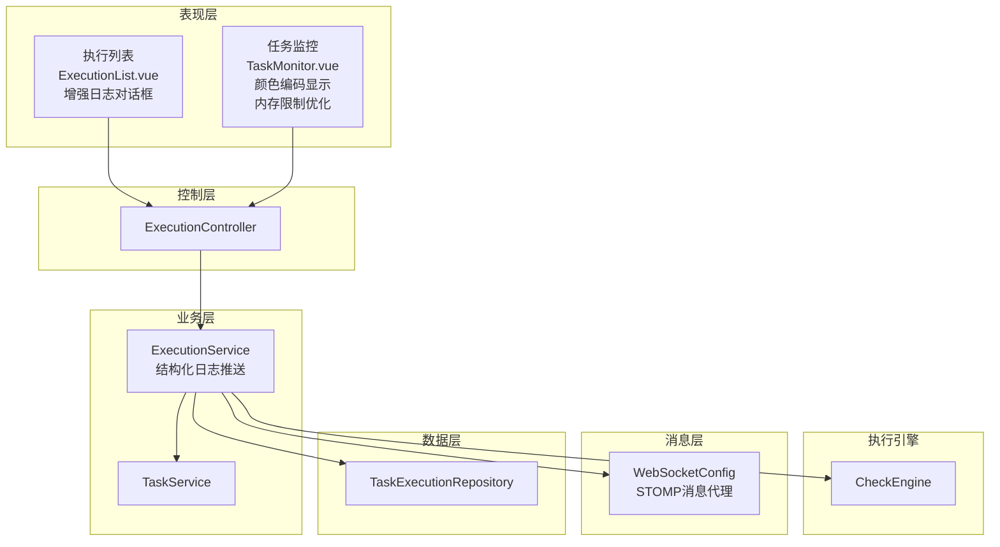
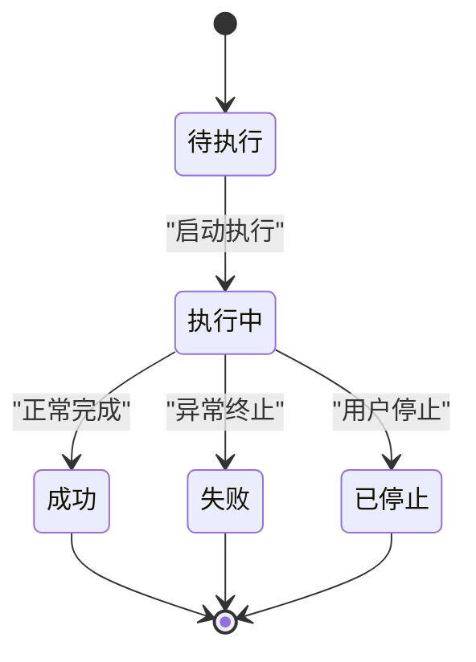
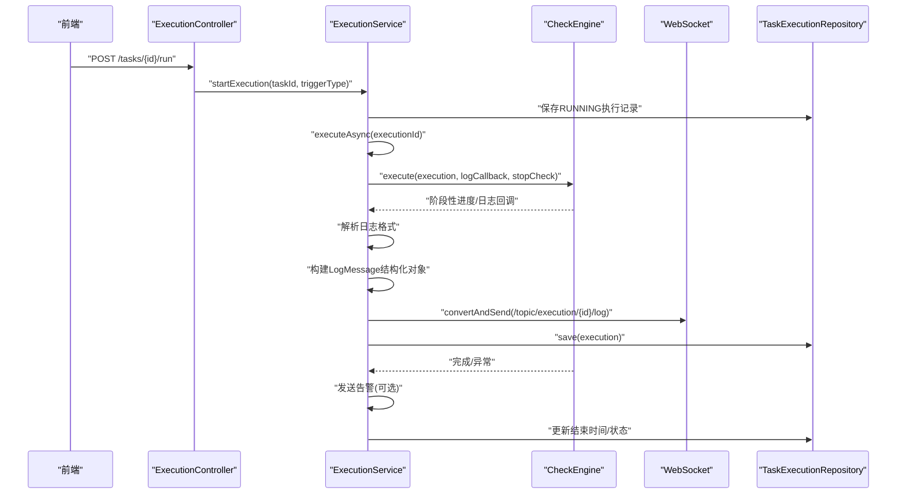
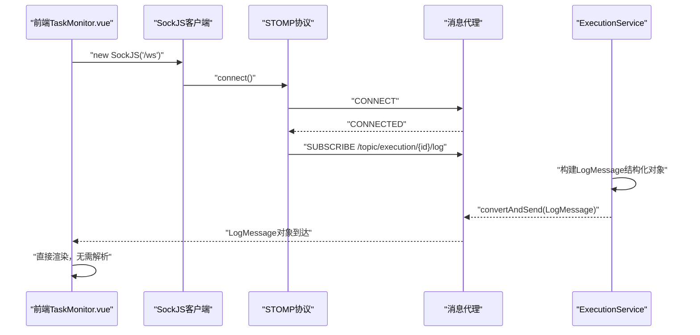
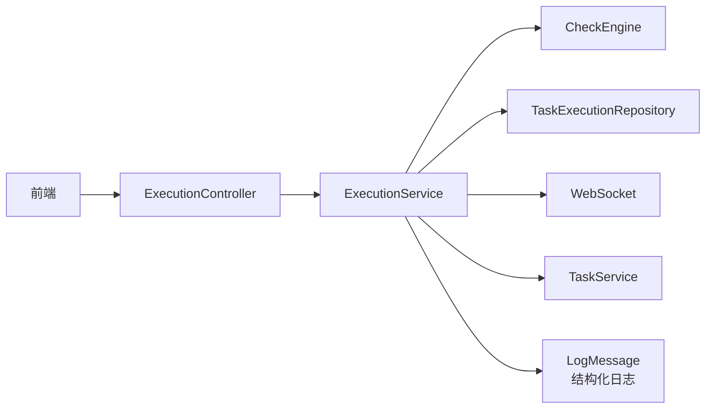

# 执行监控系统

<cite>
**本文引用的文件**
- [TaskExecution.java](file://backend/src/main/java/com/fieldcheck/entity/TaskExecution.java)
- [ExecutionStatus.java](file://backend/src/main/java/com/fieldcheck/entity/ExecutionStatus.java)
- [ExecutionService.java](file://backend/src/main/java/com/fieldcheck/service/ExecutionService.java)
- [ExecutionController.java](file://backend/src/main/java/com/fieldcheck/controller/ExecutionController.java)
- [TaskExecutionRepository.java](file://backend/src/main/java/com/fieldcheck/repository/TaskExecutionRepository.java)
- [WebSocketConfig.java](file://backend/src/main/java/com/fieldcheck/config/WebSocketConfig.java)
- [CheckEngine.java](file://backend/src/main/java/com/fieldcheck/engine/CheckEngine.java)
- [application.yml](file://backend/src/main/resources/application.yml)
- [ExecutionList.vue](file://frontend/src/views/execution/ExecutionList.vue)
- [TaskMonitor.vue](file://frontend/src/views/task/TaskMonitor.vue)
- [task.ts](file://frontend/src/api/task.ts)
- [TaskService.java](file://backend/src/main/java/com/fieldcheck/service/TaskService.java)
- [LogMessage.java](file://backend/src/main/java/com/fieldcheck/dto/LogMessage.java)
- [ExecutionDTO.java](file://backend/src/main/java/com/fieldcheck/dto/ExecutionDTO.java)
- [pom.xml](file://backend/pom.xml)
</cite>

## 更新摘要
**所做更改**
- 更新了前端TaskMonitor.vue性能优化实现，包括内存限制、渲染优化和历史日志加载
- 新增了视觉截断提示和颜色编码显示功能
- 增强了执行历史查询和统计分析功能

## 目录
1. [简介](#简介)
2. [项目结构](#项目结构)
3. [核心组件](#核心组件)
4. [架构总览](#架构总览)
5. [详细组件分析](#详细组件分析)
6. [依赖关系分析](#依赖关系分析)
7. [性能考量](#性能考量)
8. [故障排除指南](#故障排除指南)
9. [结论](#结论)
10. [附录：API与集成示例](#附录api与集成示例)

## 简介
本系统是一个面向MySQL字段容量风险检查的执行监控平台，围绕"任务-执行"模型构建，提供任务调度、实时日志推送、进度跟踪、历史查询与告警联动能力。后端采用Spring Boot + Spring Data JPA + Spring WebSocket，前端基于Vue 3 + Element Plus + SockJS/STOMP，形成从任务管理到执行监控的完整闭环。

**更新** 系统现已实现前端日志可视化增强，包括结构化日志解析、颜色编码显示、内存限制和渲染优化等功能，显著提升了日志可读性和用户体验。

## 项目结构
- 后端模块（Java）
  - entity：领域模型（任务、执行、状态枚举等）
  - service：业务服务（执行、任务、告警等）
  - repository：数据访问层（JPA）
  - controller：REST接口
  - config：WebSocket与安全配置
  - engine：检查引擎（数据库扫描与风险检测）
  - dto：传输对象（新增LogMessage结构化日志消息）
  - websocket：WebSocket相关（本仓库未直接使用，但配置已启用）
- 前端模块（TypeScript/Vue 3）
  - views：页面组件（执行列表、任务监控）
  - api：HTTP请求封装
  - types：类型定义

**图表来源**
- [ExecutionController.java](file://backend/src/main/java/com/fieldcheck/controller/ExecutionController.java#L20-L79)
- [ExecutionService.java](file://backend/src/main/java/com/fieldcheck/service/ExecutionService.java#L34-L67)
- [CheckEngine.java](file://backend/src/main/java/com/fieldcheck/engine/CheckEngine.java#L24-L454)
- [WebSocketConfig.java](file://backend/src/main/java/com/fieldcheck/config/WebSocketConfig.java#L11-L25)
- [TaskExecutionRepository.java](file://backend/src/main/java/com/fieldcheck/repository/TaskExecutionRepository.java#L16-L40)

**章节来源**
- [pom.xml](file://backend/pom.xml#L28-L61)

## 核心组件
- TaskExecution 实体：承载单次任务执行的生命周期信息（开始/结束时间、状态、进度、风险计数、日志路径、触发类型等），并与 CheckTask 多对一关联。
- ExecutionStatus 枚举：统一管理执行状态（待执行、执行中、成功、失败、已停止）。
- ExecutionService：执行服务的核心，负责启动/停止执行、异步执行、进度更新、日志推送、告警发送与持久化。
- ExecutionController：对外暴露执行相关的REST接口（分页查询、详情、进度、日志、下载）。
- CheckEngine：实际执行检查逻辑，遍历数据库/表/列，进行整型溢出、Y2038、小数溢出等风险检测，并回调进度与日志。
- WebSocketConfig：启用STOMP消息代理，订阅/topic前缀主题，支持SockJS回退。
- LogMessage DTO：新增结构化日志消息格式，包含执行ID、时间戳、级别、消息内容等字段。
- 前端组件：ExecutionList.vue（执行记录列表与搜索，增强日志对话框）、TaskMonitor.vue（实时日志与状态面板，颜色编码显示、内存限制和渲染优化）、task.ts（HTTP API封装）。

**更新** 新增LogMessage结构化日志消息类，统一前后端日志格式，提升日志解析效率和显示质量。

**章节来源**
- [TaskExecution.java](file://backend/src/main/java/com/fieldcheck/entity/TaskExecution.java#L19-L57)
- [ExecutionStatus.java](file://backend/src/main/java/com/fieldcheck/entity/ExecutionStatus.java#L3-L9)
- [ExecutionService.java](file://backend/src/main/java/com/fieldcheck/service/ExecutionService.java#L34-L306)
- [ExecutionController.java](file://backend/src/main/java/com/fieldcheck/controller/ExecutionController.java#L20-L79)
- [CheckEngine.java](file://backend/src/main/java/com/fieldcheck/engine/CheckEngine.java#L57-L139)
- [WebSocketConfig.java](file://backend/src/main/java/com/fieldcheck/config/WebSocketConfig.java#L11-L25)
- [LogMessage.java](file://backend/src/main/java/com/fieldcheck/dto/LogMessage.java#L14-L23)
- [ExecutionList.vue](file://frontend/src/views/execution/ExecutionList.vue#L1-L374)
- [TaskMonitor.vue](file://frontend/src/views/task/TaskMonitor.vue#L1-L296)
- [task.ts](file://frontend/src/api/task.ts#L1-L88)

## 架构总览
系统采用分层架构：
- 表现层：前端Vue组件通过HTTP与WebSocket与后端交互，支持结构化日志显示和颜色编码
- 控制层：ExecutionController提供REST接口
- 业务层：ExecutionService协调执行、进度、日志与告警
- 数据访问层：TaskExecutionRepository等JPA仓库
- 消息层：Spring WebSocket + STOMP + SockJS
- 执行引擎：CheckEngine在事务内扫描数据库并写入风险结果

**图表来源**
- [ExecutionController.java](file://backend/src/main/java/com/fieldcheck/controller/ExecutionController.java#L20-L79)
- [ExecutionService.java](file://backend/src/main/java/com/fieldcheck/service/ExecutionService.java#L34-L67)
- [CheckEngine.java](file://backend/src/main/java/com/fieldcheck/engine/CheckEngine.java#L24-L454)
- [WebSocketConfig.java](file://backend/src/main/java/com/fieldcheck/config/WebSocketConfig.java#L11-L25)
- [TaskExecutionRepository.java](file://backend/src/main/java/com/fieldcheck/repository/TaskExecutionRepository.java#L16-L40)
- [TaskService.java](file://backend/src/main/java/com/fieldcheck/service/TaskService.java#L18-L177)

## 详细组件分析

### TaskExecution 实体与状态管理
- 关键字段
  - 任务关联：ManyToOne 到 CheckTask
  - 时间戳：startTime、endTime
  - 状态：ExecutionStatus（默认PENDING）
  - 进度：totalTables、processedTables
  - 风险：riskCount
  - 日志：logPath
  - 错误：errorMessage
  - 触发类型：triggerType（MANUAL/SCHEDULED）
- 状态流转
  - PENDING → RUNNING（启动时设置）
  - RUNNING → SUCCESS/FAILED/STOPPED（执行结束）
- 设计要点
  - 使用JOIN FETCH避免懒加载问题
  - 并发安全：通过内存runningTasks与数据库状态双重校验防止重复执行

**图表来源**
- [ExecutionStatus.java](file://backend/src/main/java/com/fieldcheck/entity/ExecutionStatus.java#L3-L9)
- [TaskExecution.java](file://backend/src/main/java/com/fieldcheck/entity/TaskExecution.java#L31-L34)
- [ExecutionService.java](file://backend/src/main/java/com/fieldcheck/service/ExecutionService.java#L107-L163)

**章节来源**
- [TaskExecution.java](file://backend/src/main/java/com/fieldcheck/entity/TaskExecution.java#L19-L57)
- [ExecutionStatus.java](file://backend/src/main/java/com/fieldcheck/entity/ExecutionStatus.java#L3-L9)

### ExecutionService 服务实现
- 启动执行
  - 校验任务是否存在
  - 清理异常运行中的旧记录
  - 内存runningTasks去重
  - 创建执行记录并立即置为RUNNING
  - 自调用开启异步执行
- 异步执行
  - 使用@Async与自引用代理以启用异步
  - 调用CheckEngine.execute，传入日志回调与停止检查函数
  - 结束后根据结果更新状态、结束时间、风险计数
  - 发送告警（若存在风险或失败）
  - 清理内存runningTasks
- 停止执行
  - 将仍在RUNNING的任务标记为STOPPED并结束
- 进度更新
  - 提供updateProgress接口，原子更新total/processed/risk
- 日志推送
  - **更新** 解析"级别|消息"格式，提取级别和消息内容
  - **更新** 构建LogMessage结构化对象，包含执行ID、时间戳、级别、消息
  - 通过SimpMessagingTemplate向/topic/execution/{id}/log推送
  - 同步写入本地日志文件，格式化为"[时间] [级别] 消息"
- 历史查询与DTO转换
  - 支持按任务、状态、触发类型过滤
  - 计算进度百分比
  - 提供日志内容读取与下载

**图表来源**
- [ExecutionController.java](file://backend/src/main/java/com/fieldcheck/controller/ExecutionController.java#L27-L44)
- [ExecutionService.java](file://backend/src/main/java/com/fieldcheck/service/ExecutionService.java#L107-L210)
- [CheckEngine.java](file://backend/src/main/java/com/fieldcheck/engine/CheckEngine.java#L57-L139)
- [WebSocketConfig.java](file://backend/src/main/java/com/fieldcheck/config/WebSocketConfig.java#L14-L24)

**章节来源**
- [ExecutionService.java](file://backend/src/main/java/com/fieldcheck/service/ExecutionService.java#L69-L306)
- [TaskExecutionRepository.java](file://backend/src/main/java/com/fieldcheck/repository/TaskExecutionRepository.java#L16-L40)
- [ExecutionDTO.java](file://backend/src/main/java/com/fieldcheck/dto/ExecutionDTO.java#L15-L29)
- [LogMessage.java](file://backend/src/main/java/com/fieldcheck/dto/LogMessage.java#L14-L23)

### WebSocket 实时通信机制
- 配置
  - 启用简单消息代理，前缀/topic
  - 应用目的地前缀/app
  - 注册/ws端点，允许跨域，启用SockJS回退
- 客户端连接
  - 前端使用SockJS + STOMP
  - 订阅/topic/execution/{id}/log
  - 断线自动重连（由SockJS/STOMP处理）
- 消息推送
  - **更新** 后端推送LogMessage结构化对象
  - 包含executionId、timestamp、level、message等字段
  - 前端直接渲染，无需额外解析
- 连接管理
  - 组件挂载时建立连接，卸载时断开
  - 运行中每2秒轮询一次执行状态，非RUNNING时停止轮询

**图表来源**
- [WebSocketConfig.java](file://backend/src/main/java/com/fieldcheck/config/WebSocketConfig.java#L11-L25)
- [TaskMonitor.vue](file://frontend/src/views/task/TaskMonitor.vue#L99-L119)
- [ExecutionService.java](file://backend/src/main/java/com/fieldcheck/service/ExecutionService.java#L237-L268)

**章节来源**
- [WebSocketConfig.java](file://backend/src/main/java/com/fieldcheck/config/WebSocketConfig.java#L11-L25)
- [TaskMonitor.vue](file://frontend/src/views/task/TaskMonitor.vue#L99-L119)

### 执行历史查询、统计与性能指标
- 历史查询
  - 分页查询所有执行记录，支持按任务名、状态、触发类型过滤
  - DTO转换包含进度百分比计算
- 性能指标
  - 进度：processed/total
  - 风险：riskCount
  - 时间：startTime/endTime
- 日志与下载
  - **更新** 获取结构化日志文本，支持历史日志解析
  - 下载日志文件（HTTP响应）

**章节来源**
- [ExecutionController.java](file://backend/src/main/java/com/fieldcheck/controller/ExecutionController.java#L27-L77)
- [ExecutionService.java](file://backend/src/main/java/com/fieldcheck/service/ExecutionService.java#L69-L100)
- [ExecutionDTO.java](file://backend/src/main/java/com/fieldcheck/dto/ExecutionDTO.java#L284-L305)

### 监控界面使用指南
- 执行列表
  - 支持按任务名、状态、触发方式筛选
  - 展示状态标签、进度条、风险数、时间范围
  - 可查看风险结果、查看日志、下载日志
  - **更新** 增强日志对话框：900px宽度，支持结构化日志显示
- 任务监控
  - **更新** 实时日志流，按级别着色显示（INFO蓝、WARN黄、ERROR红）
  - 执行状态卡片与进度条
  - 支持停止任务（仅RUNNING时可用）
  - 自动滚动到底部，历史日志先行加载
  - **更新** 支持最多500条日志内存限制，仅渲染最近100条提升性能
  - **更新** 历史日志优化加载，最多加载最后500行
  - **更新** 视觉截断提示，当日志超过限制时显示提示信息

**更新** 前端日志可视化增强功能：

#### 结构化日志解析
- **执行列表日志对话框**：实现完整的日志解析功能
  - 支持标准格式：`[YYYY-MM-DD HH:mm:ss] [级别] 消息内容`
  - 自动识别时间戳、日志级别和消息内容
  - 不匹配格式的消息降级为INFO级别显示
  - 对话框宽度增加到900px，提供更好的阅读体验

#### 颜色编码显示
- **任务监控实时日志**：实现完整的颜色编码系统
  - INFO级别：蓝色主题（#58a6ff）
  - WARN级别：橙黄色主题（#d29922）
  - ERROR级别：红色主题（#f85149）
  - DEBUG级别：青色主题（#17a2b8）
- **执行列表日志对话框**：同步颜色编码样式
  - 统一的颜色方案确保用户体验一致性
  - 深色背景配合适色文字，提升可读性

#### 性能优化
- **内存管理**：最大保留500条日志，避免内存溢出
- **渲染优化**：仅渲染最近100条日志，提升大流量日志场景下的性能
- **历史加载**：最多加载最后500行历史日志，平衡完整性和性能
- **视觉截断提示**：当日志超过500条时显示"仅显示最近500条日志"提示

**章节来源**
- [ExecutionList.vue](file://frontend/src/views/execution/ExecutionList.vue#L1-L374)
- [TaskMonitor.vue](file://frontend/src/views/task/TaskMonitor.vue#L1-L296)
- [task.ts](file://frontend/src/api/task.ts#L58-L87)

## 依赖关系分析
- 后端依赖
  - Web + Data JPA + WebSocket + Security + Validation + AOP + Quartz + Mail
  - MySQL Connector/J
  - Lombok、Apache Commons、POI、HTTP Client、JUnit/H2测试
- 关键耦合
  - ExecutionService依赖CheckEngine、TaskExecutionRepository、SimpMessagingTemplate、AlertService、TaskService
  - CheckEngine依赖ConnectionService、WhitelistService、RiskResultRepository、TransactionTemplate
  - **更新** 新增LogMessage结构化日志消息类
  - 前端通过HTTP与WebSocket与后端交互，支持结构化日志格式

**图表来源**
- [ExecutionService.java](file://backend/src/main/java/com/fieldcheck/service/ExecutionService.java#L37-L67)
- [CheckEngine.java](file://backend/src/main/java/com/fieldcheck/engine/CheckEngine.java#L28-L32)
- [TaskService.java](file://backend/src/main/java/com/fieldcheck/service/TaskService.java#L23-L28)
- [ExecutionController.java](file://backend/src/main/java/com/fieldcheck/controller/ExecutionController.java#L25-L25)
- [LogMessage.java](file://backend/src/main/java/com/fieldcheck/dto/LogMessage.java#L14-L23)

**章节来源**
- [pom.xml](file://backend/pom.xml#L28-L142)

## 性能考量
- 异步执行
  - 使用@Async与自引用代理，避免阻塞主线程
  - 通过runningTasks内存缓存避免重复执行
- 进度持久化优化
  - CheckEngine每N张表或最后一批批量保存，减少数据库写入
  - ExecutionService在finally中统一落库，保证一致性
- 日志写入
  - 后台线程异步写文件，避免阻塞执行
  - **更新** 结构化日志格式化写入，提升解析效率
- WebSocket
  - 仅在RUNNING/PENDING时建立连接，降低带宽占用
  - 前端2秒轮询执行状态，非RUNNING自动停止
  - **更新** 实时日志内存限制和渲染优化，防止性能问题
  - **更新** 历史日志优化加载，最多500行，提升大数据量场景性能

**章节来源**
- [ExecutionService.java](file://backend/src/main/java/com/fieldcheck/service/ExecutionService.java#L165-L210)
- [CheckEngine.java](file://backend/src/main/java/com/fieldcheck/engine/CheckEngine.java#L125-L131)
- [TaskMonitor.vue](file://frontend/src/views/task/TaskMonitor.vue#L208-L216)

## 故障排除指南
- 任务无法启动
  - 检查runningTasks是否已有该任务ID；确认数据库中无RUNNING残留
  - 查看启动日志与异常栈
- 执行卡住或未更新进度
  - 确认CheckEngine回调是否被调用（阶段性保存）
  - 检查事务模板是否生效
- WebSocket不接收日志
  - 确认/ws端点与SockJS配置正确
  - 检查订阅主题是否匹配executionId
  - **更新** 检查LogMessage结构化消息格式是否正确
- 日志文件为空
  - 检查logPath配置与文件权限
  - 确认sendLog是否被调用
  - **更新** 验证日志格式是否符合"[时间] [级别] 消息"模式
- 告警未发送
  - 检查TaskService关联的AlertConfig是否启用
  - 查看ExecutionService告警发送日志
- **新增** 日志显示问题
  - **执行列表**：检查parseLogContent函数是否正确解析日志格式
  - **任务监控**：确认颜色编码CSS类是否正确应用
  - **内存问题**：检查MAX_LOGS和VISIBLE_LOGS限制是否合理
  - **性能问题**：确认历史日志加载是否限制在500行以内
  - **渲染问题**：验证visibleLogs计算逻辑是否正确

**章节来源**
- [ExecutionService.java](file://backend/src/main/java/com/fieldcheck/service/ExecutionService.java#L107-L210)
- [WebSocketConfig.java](file://backend/src/main/java/com/fieldcheck/config/WebSocketConfig.java#L11-L25)
- [TaskService.java](file://backend/src/main/java/com/fieldcheck/service/TaskService.java#L169-L175)

## 结论
本执行监控系统以清晰的分层设计与完善的异步/消息机制实现了从任务调度到实时监控的全链路能力。通过进度与日志的双通道输出、历史查询与告警联动，满足了生产环境对可观测性与可运维性的需求。

**更新** 最新版本增强了前端日志可视化功能，包括结构化日志解析、颜色编码显示、内存限制和渲染优化，显著提升了用户体验和日志可读性。通过MAX_LOGS（500条）和VISIBLE_LOGS（100条）的优化配置，系统能够在大数据量日志场景下保持良好的性能表现。后续可在以下方面持续优化：增加执行统计报表、引入指标采集（Prometheus/Grafana）、增强WebSocket连接稳定性与限流策略、扩展日志分析功能。

## 附录：API与集成示例

### 后端API一览
- GET /api/executions?page=&size=&taskName=&status=&triggerType=
  - 分页查询执行记录（按任务名/状态/触发类型过滤）
- GET /api/executions/{id}
  - 获取执行详情
- GET /api/executions/{id}/progress
  - 获取执行进度（DTO）
- GET /api/executions/{id}/log
  - **更新** 获取结构化日志文本（支持历史日志解析）
- GET /api/executions/{id}/log/download
  - 下载日志文件（HTTP响应）
- POST /tasks/{id}/run
  - 启动任务执行（触发类型：MANUAL）
- POST /tasks/{id}/stop
  - 停止任务执行

**章节来源**
- [ExecutionController.java](file://backend/src/main/java/com/fieldcheck/controller/ExecutionController.java#L27-L77)

### 前端集成要点
- 使用task.ts封装的HTTP方法
- **执行列表**：
  - 通过parseLogContent函数解析日志内容
  - 支持900px宽度的日志对话框
  - 颜色编码显示不同级别的日志
- **任务监控**：
  - 通过SockJS/STOMP订阅实时日志
  - 直接渲染LogMessage结构化对象
  - **更新** 支持最多500条日志内存限制和100条渲染优化
  - **更新** 历史日志优化加载，最多500行
  - **更新** 视觉截断提示，当日志超过限制时显示提示
  - 2秒轮询执行状态，非RUNNING停止轮询
  - 停止按钮仅在RUNNING时可用

**章节来源**
- [task.ts](file://frontend/src/api/task.ts#L58-L87)
- [TaskMonitor.vue](file://frontend/src/views/task/TaskMonitor.vue#L99-L235)

### 配置参考
- 日志路径与并发任务数
  - app.log-path：执行日志目录
  - app.max-concurrent-tasks：并发任务上限（用于业务侧约束）
- 数据源与JPA
  - 数据库连接、HikariCP参数、Hibernate方言与格式化

**章节来源**
- [application.yml](file://backend/src/main/resources/application.yml#L65-L67)
- [application.yml](file://backend/src/main/resources/application.yml#L8-L22)
- [application.yml](file://backend/src/main/resources/application.yml#L24-L31)

### 日志格式规范
**新增** 系统采用统一的结构化日志格式：

- **实时日志推送格式**：LogMessage结构化对象
  - 字段：executionId、timestamp、level、message、currentTable、processedTables、totalTables、progressPercent
  - WebSocket推送：直接发送JSON对象，前端无需解析

- **文件日志格式**：`[YYYY-MM-DD HH:mm:ss] [级别] 消息内容`
  - 示例：`[2026-03-15 20:04:35] [INFO] 开始检查表结构`
  - 支持INFO、WARN、ERROR、DEBUG等级别

- **前端解析规则**：
  - 标准格式：自动解析时间戳、级别和消息
  - 兼容格式：不匹配时降级为INFO级别
  - 对话框显示：900px宽度，颜色编码显示

- **性能优化配置**：
  - MAX_LOGS：500（内存中最大日志条数）
  - VISIBLE_LOGS：100（渲染时可见日志条数）
  - 历史日志加载：最多500行
  - 截断提示：当日志超过500条时显示提示信息

**章节来源**
- [LogMessage.java](file://backend/src/main/java/com/fieldcheck/dto/LogMessage.java#L14-L23)
- [ExecutionService.java](file://backend/src/main/java/com/fieldcheck/service/ExecutionService.java#L240-L268)
- [ExecutionList.vue](file://frontend/src/views/execution/ExecutionList.vue#L243-L267)
- [TaskMonitor.vue](file://frontend/src/views/task/TaskMonitor.vue#L195-L219)