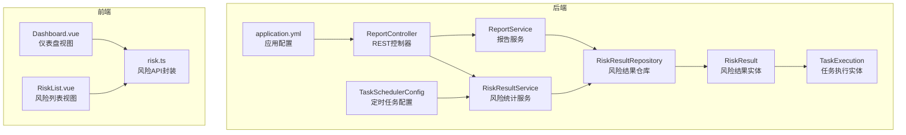
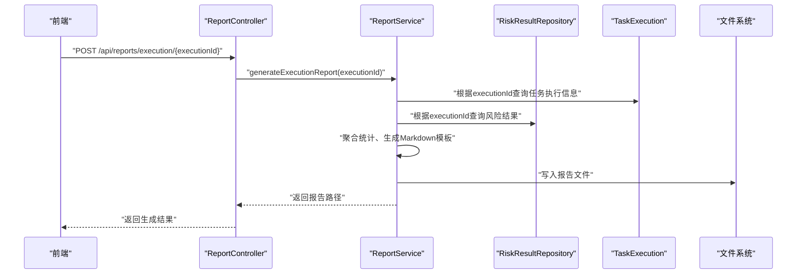
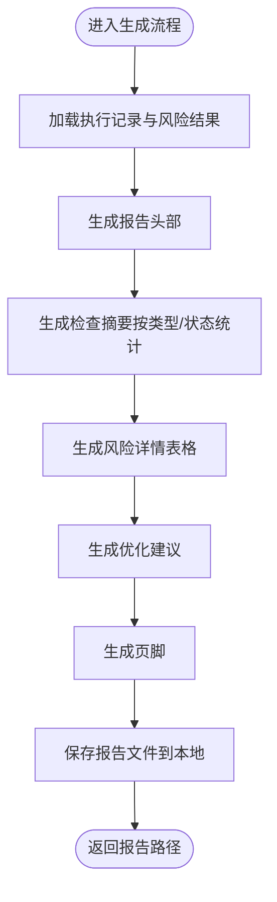
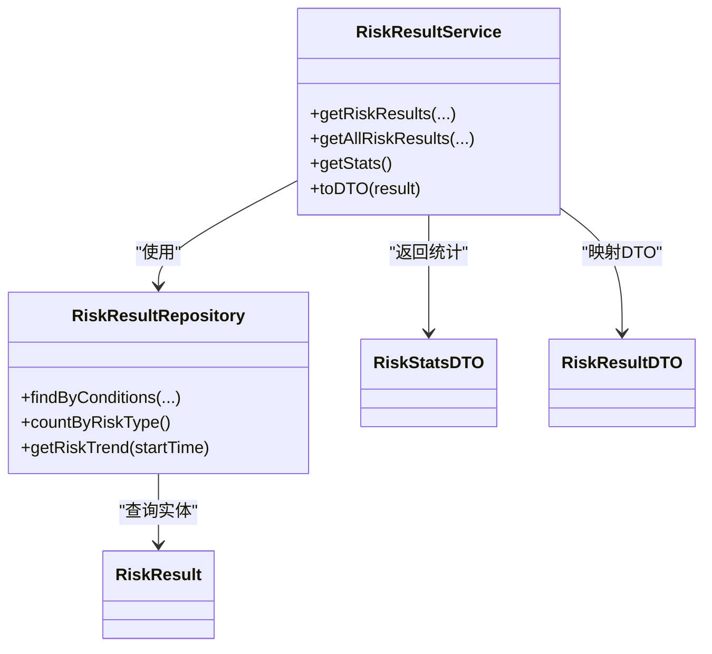
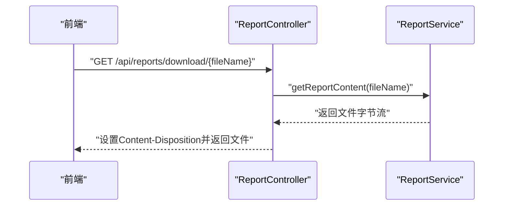
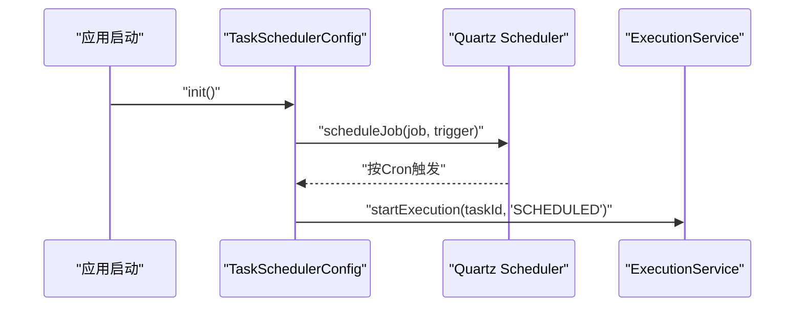
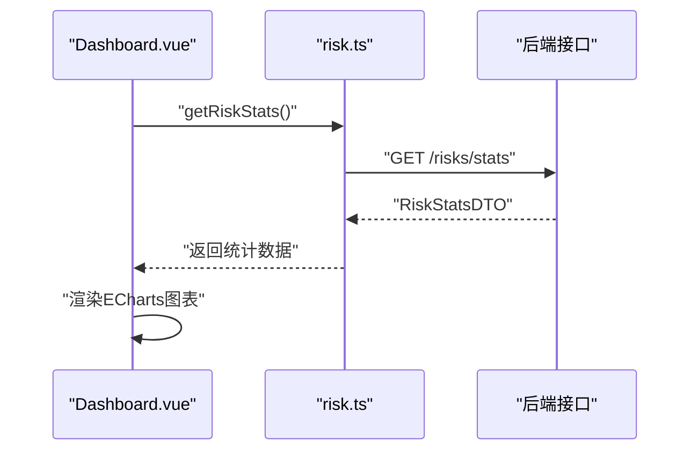
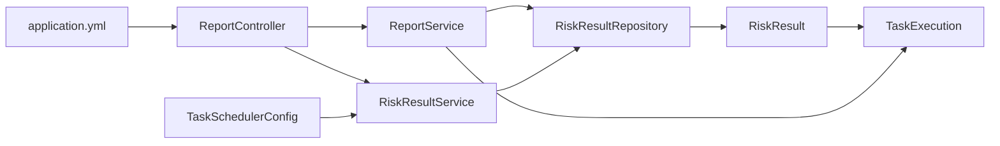

# 报告生成系统

<cite>
**本文引用的文件**
- [ReportService.java](file://backend/src/main/java/com/fieldcheck/service/ReportService.java)
- [ReportController.java](file://backend/src/main/java/com/fieldcheck/controller/ReportController.java)
- [RiskResultService.java](file://backend/src/main/java/com/fieldcheck/service/RiskResultService.java)
- [RiskResultRepository.java](file://backend/src/main/java/com/fieldcheck/repository/RiskResultRepository.java)
- [RiskResult.java](file://backend/src/main/java/com/fieldcheck/entity/RiskResult.java)
- [TaskExecution.java](file://backend/src/main/java/com/fieldcheck/entity/TaskExecution.java)
- [RiskType.java](file://backend/src/main/java/com/fieldcheck/entity/RiskType.java)
- [RiskStatus.java](file://backend/src/main/java/com/fieldcheck/entity/RiskStatus.java)
- [RiskStatsDTO.java](file://backend/src/main/java/com/fieldcheck/dto/RiskStatsDTO.java)
- [RiskResultDTO.java](file://backend/src/main/java/com/fieldcheck/dto/RiskResultDTO.java)
- [TaskSchedulerConfig.java](file://backend/src/main/java/com/fieldcheck/scheduler/TaskSchedulerConfig.java)
- [application.yml](file://backend/src/main/resources/application.yml)
- [Dashboard.vue](file://frontend/src/views/Dashboard.vue)
- [risk.ts](file://frontend/src/api/risk.ts)
- [RiskList.vue](file://frontend/src/views/risk/RiskList.vue)
</cite>

## 目录
1. [简介](#简介)
2. [项目结构](#项目结构)
3. [核心组件](#核心组件)
4. [架构总览](#架构总览)
5. [详细组件分析](#详细组件分析)
6. [依赖关系分析](#依赖关系分析)
7. [性能考虑](#性能考虑)
8. [故障排查指南](#故障排查指南)
9. [结论](#结论)
10. [附录](#附录)

## 简介
本报告生成系统围绕“MySQL字段容量风险检查”场景构建，提供从风险数据采集到报告生成与导出的完整能力。系统支持：
- 风险统计分析：按风险类型、状态、时间趋势等维度进行聚合与可视化
- 报告模板设计：Markdown格式的标准化报告，包含摘要、详情与优化建议
- 图表生成：前端基于ECharts展示风险趋势与类型分布
- PDF导出：通过第三方工具链可将Markdown转换为PDF（系统当前以Markdown输出，PDF导出需外部流程）
- 报告历史管理：本地文件存储、列出、下载、删除
- 定时生成与自动化调度：基于Quartz的计划任务触发执行与报告生成
- API接口与集成：提供REST接口用于报告生成、下载、预览与删除；前端通过Axios对接

## 项目结构
后端采用Spring Boot工程，按领域模块组织：
- controller：对外暴露REST接口
- service：业务逻辑层（报告生成、风险统计、执行调度）
- repository：数据访问层（JPA）
- entity：实体模型
- dto：数据传输对象
- scheduler：定时任务配置
- resources：应用配置（数据库、JPA、Quartz、日志等）

前端采用Vue 3 + TypeScript + Element Plus + ECharts，负责数据展示与交互。

**图表来源**
- [ReportController.java](file://backend/src/main/java/com/fieldcheck/controller/ReportController.java#L15-L122)
- [ReportService.java](file://backend/src/main/java/com/fieldcheck/service/ReportService.java#L22-L369)
- [RiskResultService.java](file://backend/src/main/java/com/fieldcheck/service/RiskResultService.java#L23-L124)
- [RiskResultRepository.java](file://backend/src/main/java/com/fieldcheck/repository/RiskResultRepository.java#L16-L70)
- [RiskResult.java](file://backend/src/main/java/com/fieldcheck/entity/RiskResult.java#L23-L67)
- [TaskExecution.java](file://backend/src/main/java/com/fieldcheck/entity/TaskExecution.java#L19-L57)
- [TaskSchedulerConfig.java](file://backend/src/main/java/com/fieldcheck/scheduler/TaskSchedulerConfig.java#L20-L95)
- [application.yml](file://backend/src/main/resources/application.yml#L1-L75)
- [Dashboard.vue](file://frontend/src/views/Dashboard.vue#L79-L163)
- [risk.ts](file://frontend/src/api/risk.ts#L31-L71)
- [RiskList.vue](file://frontend/src/views/risk/RiskList.vue#L172-L218)

**章节来源**
- [ReportController.java](file://backend/src/main/java/com/fieldcheck/controller/ReportController.java#L15-L122)
- [ReportService.java](file://backend/src/main/java/com/fieldcheck/service/ReportService.java#L22-L369)
- [RiskResultService.java](file://backend/src/main/java/com/fieldcheck/service/RiskResultService.java#L23-L124)
- [RiskResultRepository.java](file://backend/src/main/java/com/fieldcheck/repository/RiskResultRepository.java#L16-L70)
- [RiskResult.java](file://backend/src/main/java/com/fieldcheck/entity/RiskResult.java#L23-L67)
- [TaskExecution.java](file://backend/src/main/java/com/fieldcheck/entity/TaskExecution.java#L19-L57)
- [TaskSchedulerConfig.java](file://backend/src/main/java/com/fieldcheck/scheduler/TaskSchedulerConfig.java#L20-L95)
- [application.yml](file://backend/src/main/resources/application.yml#L1-L75)
- [Dashboard.vue](file://frontend/src/views/Dashboard.vue#L79-L163)
- [risk.ts](file://frontend/src/api/risk.ts#L31-L71)
- [RiskList.vue](file://frontend/src/views/risk/RiskList.vue#L172-L218)

## 核心组件
- 报告服务（ReportService）：负责生成执行报告与任务报告，聚合风险数据，拼装Markdown模板，并持久化到本地目录
- 风险统计服务（RiskResultService）：提供风险统计聚合、趋势分析、状态分布等数据
- 风险结果仓库（RiskResultRepository）：提供按条件查询、分页、统计、趋势查询等数据访问能力
- 报告控制器（ReportController）：对外提供报告生成、列表、下载、预览、删除的REST接口
- 定时任务配置（TaskSchedulerConfig）：基于Quartz加载并调度计划任务，自动触发执行与报告生成
- 前端仪表盘（Dashboard.vue）：展示风险总数、待处理、已解决、已忽略等指标，以及风险趋势与类型分布的图表
- 风险API封装（risk.ts）：封装前端与后端的风险数据交互接口

**章节来源**
- [ReportService.java](file://backend/src/main/java/com/fieldcheck/service/ReportService.java#L22-L369)
- [ReportController.java](file://backend/src/main/java/com/fieldcheck/controller/ReportController.java#L15-L122)
- [RiskResultService.java](file://backend/src/main/java/com/fieldcheck/service/RiskResultService.java#L23-L124)
- [RiskResultRepository.java](file://backend/src/main/java/com/fieldcheck/repository/RiskResultRepository.java#L16-L70)
- [TaskSchedulerConfig.java](file://backend/src/main/java/com/fieldcheck/scheduler/TaskSchedulerConfig.java#L20-L95)
- [Dashboard.vue](file://frontend/src/views/Dashboard.vue#L79-L163)
- [risk.ts](file://frontend/src/api/risk.ts#L31-L71)

## 架构总览
系统采用前后端分离架构，后端提供REST接口，前端通过Axios调用接口并渲染图表。报告生成流程如下：

**图表来源**
- [ReportController.java](file://backend/src/main/java/com/fieldcheck/controller/ReportController.java#L25-L38)
- [ReportService.java](file://backend/src/main/java/com/fieldcheck/service/ReportService.java#L34-L54)
- [RiskResultRepository.java](file://backend/src/main/java/com/fieldcheck/repository/RiskResultRepository.java#L21-L22)
- [TaskExecution.java](file://backend/src/main/java/com/fieldcheck/entity/TaskExecution.java#L19-L57)

**章节来源**
- [ReportController.java](file://backend/src/main/java/com/fieldcheck/controller/ReportController.java#L25-L38)
- [ReportService.java](file://backend/src/main/java/com/fieldcheck/service/ReportService.java#L34-L54)
- [RiskResultRepository.java](file://backend/src/main/java/com/fieldcheck/repository/RiskResultRepository.java#L21-L22)
- [TaskExecution.java](file://backend/src/main/java/com/fieldcheck/entity/TaskExecution.java#L19-L57)

## 详细组件分析

### 报告服务（ReportService）
职责与特性：
- 支持两种报告模式
  - 执行报告：基于单次执行记录生成，包含基本信息、检查摘要、风险详情、优化建议与页脚
  - 任务报告：基于任务ID聚合所有执行记录，包含执行历史、风险汇总、风险详情、优化建议与页脚
- 报告模板设计
  - Markdown格式，结构清晰，便于后续转PDF
  - 摘要部分按风险类型与状态进行统计
  - 风险详情表格包含数据库、表、字段、类型、当前值、阈值、使用率、状态等列
  - 优化建议针对不同风险类型给出SQL改进建议
- 报告持久化
  - 本地文件存储于reports目录，文件名包含执行或任务ID与时间戳
  - 提供列表、下载、预览、删除等管理能力

**图表来源**
- [ReportService.java](file://backend/src/main/java/com/fieldcheck/service/ReportService.java#L34-L101)
- [ReportService.java](file://backend/src/main/java/com/fieldcheck/service/ReportService.java#L150-L327)

**章节来源**
- [ReportService.java](file://backend/src/main/java/com/fieldcheck/service/ReportService.java#L34-L101)
- [ReportService.java](file://backend/src/main/java/com/fieldcheck/service/ReportService.java#L150-L327)

### 风险统计服务（RiskResultService）
职责与特性：
- 提供风险结果的分页查询与条件过滤（执行ID、数据库名、表名、风险类型、状态）
- 统计聚合
  - 总数、待处理、已忽略、已解决数量
  - 风险类型分布（按枚举值初始化默认0，再从数据库查询实际计数）
  - 近30天风险趋势（按日期分组统计）
- DTO映射
  - 将实体映射为前端友好的DTO，包含风险类型描述、使用率、创建时间等

**图表来源**
- [RiskResultService.java](file://backend/src/main/java/com/fieldcheck/service/RiskResultService.java#L23-L124)
- [RiskResultRepository.java](file://backend/src/main/java/com/fieldcheck/repository/RiskResultRepository.java#L16-L70)
- [RiskResult.java](file://backend/src/main/java/com/fieldcheck/entity/RiskResult.java#L23-L67)
- [RiskStatsDTO.java](file://backend/src/main/java/com/fieldcheck/dto/RiskStatsDTO.java#L15-L31)
- [RiskResultDTO.java](file://backend/src/main/java/com/fieldcheck/dto/RiskResultDTO.java#L17-L34)

**章节来源**
- [RiskResultService.java](file://backend/src/main/java/com/fieldcheck/service/RiskResultService.java#L52-L90)
- [RiskResultRepository.java](file://backend/src/main/java/com/fieldcheck/repository/RiskResultRepository.java#L52-L69)
- [RiskStatsDTO.java](file://backend/src/main/java/com/fieldcheck/dto/RiskStatsDTO.java#L15-L31)
- [RiskResultDTO.java](file://backend/src/main/java/com/fieldcheck/dto/RiskResultDTO.java#L17-L34)

### 报告控制器（ReportController）
职责与特性：
- 接口清单
  - 生成执行报告：POST /api/reports/execution/{executionId}
  - 生成任务报告：POST /api/reports/task/{taskId}
  - 列出报告：GET /api/reports
  - 下载报告：GET /api/reports/download/{fileName}
  - 预览报告：GET /api/reports/preview/{fileName}
  - 删除报告：DELETE /api/reports/{fileName}
- 响应处理
  - 成功返回消息与报告路径或二进制内容
  - 失败返回HTTP 500与错误信息

**图表来源**
- [ReportController.java](file://backend/src/main/java/com/fieldcheck/controller/ReportController.java#L74-L93)
- [ReportService.java](file://backend/src/main/java/com/fieldcheck/service/ReportService.java#L106-L112)

**章节来源**
- [ReportController.java](file://backend/src/main/java/com/fieldcheck/controller/ReportController.java#L25-L121)
- [ReportService.java](file://backend/src/main/java/com/fieldcheck/service/ReportService.java#L106-L148)

### 定时任务与自动化调度（TaskSchedulerConfig）
职责与特性：
- 应用启动时加载启用且配置了Cron表达式的任务
- 为每个任务创建Quartz Job与Trigger，按Cron表达式周期执行
- 触发执行服务启动任务执行（触发类型标记为SCHEDULED）

**图表来源**
- [TaskSchedulerConfig.java](file://backend/src/main/java/com/fieldcheck/scheduler/TaskSchedulerConfig.java#L25-L65)
- [TaskSchedulerConfig.java](file://backend/src/main/java/com/fieldcheck/scheduler/TaskSchedulerConfig.java#L82-L92)

**章节来源**
- [TaskSchedulerConfig.java](file://backend/src/main/java/com/fieldcheck/scheduler/TaskSchedulerConfig.java#L25-L73)

### 前端集成与图表展示
- 仪表盘（Dashboard.vue）
  - 展示总风险数、待处理、已解决、已忽略四大指标卡片
  - 风险趋势折线图（近30天）
  - 风险类型分布饼图（按类型枚举中文名映射）
- 风险API封装（risk.ts）
  - 提供获取风险列表、单条风险、风险统计、更新状态、导出Excel等方法
- 风险列表（RiskList.vue）
  - 支持按执行ID、数据库名、表名、风险类型、状态筛选
  - 导出Excel按钮，调用后端导出接口

**图表来源**
- [Dashboard.vue](file://frontend/src/views/Dashboard.vue#L99-L158)
- [risk.ts](file://frontend/src/api/risk.ts#L47-L49)

**章节来源**
- [Dashboard.vue](file://frontend/src/views/Dashboard.vue#L79-L163)
- [risk.ts](file://frontend/src/api/risk.ts#L31-L71)
- [RiskList.vue](file://frontend/src/views/risk/RiskList.vue#L172-L218)

## 依赖关系分析
- 控制器依赖服务：ReportController依赖ReportService与RiskResultService
- 服务依赖仓库：ReportService依赖RiskResultRepository与TaskExecutionRepository；RiskResultService依赖RiskResultRepository
- 实体依赖：RiskResult关联TaskExecution；RiskType与RiskStatus为枚举类型
- 配置依赖：application.yml配置数据库、JPA、Quartz、日志等

**图表来源**
- [ReportController.java](file://backend/src/main/java/com/fieldcheck/controller/ReportController.java#L15-L122)
- [ReportService.java](file://backend/src/main/java/com/fieldcheck/service/ReportService.java#L24-L25)
- [RiskResultService.java](file://backend/src/main/java/com/fieldcheck/service/RiskResultService.java#L25)
- [RiskResultRepository.java](file://backend/src/main/java/com/fieldcheck/repository/RiskResultRepository.java#L16-L70)
- [RiskResult.java](file://backend/src/main/java/com/fieldcheck/entity/RiskResult.java#L25-L27)
- [TaskExecution.java](file://backend/src/main/java/com/fieldcheck/entity/TaskExecution.java#L21-L23)
- [TaskSchedulerConfig.java](file://backend/src/main/java/com/fieldcheck/scheduler/TaskSchedulerConfig.java#L22-L24)
- [application.yml](file://backend/src/main/resources/application.yml#L1-L75)

**章节来源**
- [ReportController.java](file://backend/src/main/java/com/fieldcheck/controller/ReportController.java#L15-L122)
- [ReportService.java](file://backend/src/main/java/com/fieldcheck/service/ReportService.java#L24-L25)
- [RiskResultService.java](file://backend/src/main/java/com/fieldcheck/service/RiskResultService.java#L25)
- [RiskResultRepository.java](file://backend/src/main/java/com/fieldcheck/repository/RiskResultRepository.java#L16-L70)
- [RiskResult.java](file://backend/src/main/java/com/fieldcheck/entity/RiskResult.java#L25-L27)
- [TaskExecution.java](file://backend/src/main/java/com/fieldcheck/entity/TaskExecution.java#L21-L23)
- [TaskSchedulerConfig.java](file://backend/src/main/java/com/fieldcheck/scheduler/TaskSchedulerConfig.java#L22-L24)
- [application.yml](file://backend/src/main/resources/application.yml#L1-L75)

## 性能考虑
- 查询优化
  - 风险结果实体在execution_id、risk_type、status上建立索引，有利于按条件查询与统计
  - 分页查询避免一次性加载大量数据
- 统计聚合
  - 类型分布与趋势查询通过数据库GROUP BY完成，减少Java侧聚合开销
- 文件IO
  - 报告文件本地存储，建议结合NFS或对象存储实现多实例共享与备份
- 并发控制
  - Quartz调度与执行服务并发度受系统线程池与数据库连接池限制，建议合理配置最大并发与超时参数

**章节来源**
- [RiskResult.java](file://backend/src/main/java/com/fieldcheck/entity/RiskResult.java#L17-L21)
- [RiskResultRepository.java](file://backend/src/main/java/com/fieldcheck/repository/RiskResultRepository.java#L19-L69)
- [application.yml](file://backend/src/main/resources/application.yml#L13-L22)

## 故障排查指南
- 报告生成失败
  - 检查执行ID是否存在，确认任务执行记录与风险结果是否完整
  - 查看后端日志定位异常（如文件写入失败、路径权限问题）
- 报告下载失败
  - 确认报告文件是否存在，文件名编码是否正确
  - 检查Content-Disposition头与字符集设置
- 统计数据异常
  - 核对RiskType与RiskStatus枚举值是否与数据库一致
  - 检查时间范围与日期格式，确认趋势统计的起始时间
- 定时任务未执行
  - 检查任务状态与Cron表达式是否正确
  - 查看Quartz调度器日志，确认Job与Trigger创建成功

**章节来源**
- [ReportController.java](file://backend/src/main/java/com/fieldcheck/controller/ReportController.java#L33-L37)
- [ReportController.java](file://backend/src/main/java/com/fieldcheck/controller/ReportController.java#L90-L92)
- [RiskResultService.java](file://backend/src/main/java/com/fieldcheck/service/RiskResultService.java#L52-L90)
- [TaskSchedulerConfig.java](file://backend/src/main/java/com/fieldcheck/scheduler/TaskSchedulerConfig.java#L38-L65)

## 结论
本报告生成系统以清晰的分层架构实现了从风险数据到报告输出的全链路能力。通过标准化的Markdown模板与灵活的筛选统计，满足了日常运维与审计需求。结合前端图表展示与定时调度机制，系统具备良好的可维护性与可扩展性。后续可在报告模板定制、PDF导出流程、报告归档策略等方面进一步增强。

## 附录

### 报告模板设计与自定义指南
- 模板结构
  - 头部：任务名称、执行ID、开始/结束时间、执行状态、检查进度
  - 摘要：按风险类型与状态的统计表格
  - 详情：按风险类型分组的明细表格，包含数据库、表、字段、类型、当前值、阈值、使用率、状态
  - 建议：针对不同类型风险给出SQL改进建议与执行注意事项
  - 页脚：报告生成时间与平台信息
- 自定义建议
  - 可在头部增加公司Logo与联系方式
  - 可扩展摘要部分加入合规性评分或风险等级
  - 可在建议部分增加修复优先级与影响评估
  - 可引入样式模板（如CSS）配合PDF转换工具生成美观的PDF报告

**章节来源**
- [ReportService.java](file://backend/src/main/java/com/fieldcheck/service/ReportService.java#L150-L327)

### 报告历史管理与API接口
- 历史管理
  - 列表：获取reports目录下所有.md文件的基本信息（名称、大小、创建时间）
  - 下载：按文件名返回Markdown内容并设置合适的Content-Type与Content-Disposition
  - 预览：直接返回Markdown文本内容
  - 删除：删除指定报告文件
- 接口清单
  - POST /api/reports/execution/{executionId}
  - POST /api/reports/task/{taskId}
  - GET /api/reports
  - GET /api/reports/download/{fileName}
  - GET /api/reports/preview/{fileName}
  - DELETE /api/reports/{fileName}

**章节来源**
- [ReportController.java](file://backend/src/main/java/com/fieldcheck/controller/ReportController.java#L25-L121)
- [ReportService.java](file://backend/src/main/java/com/fieldcheck/service/ReportService.java#L117-L148)

### 风险统计分析与图表生成
- 统计维度
  - 总数、待处理、已忽略、已解决
  - 风险类型分布（按枚举值映射中文名）
  - 近30天风险趋势（按日期分组）
- 前端图表
  - 折线图：展示风险趋势
  - 饼图：展示风险类型分布
- 数据来源
  - 后端提供RiskStatsDTO，前端通过risk.ts的getRiskStats接口获取

**章节来源**
- [RiskResultService.java](file://backend/src/main/java/com/fieldcheck/service/RiskResultService.java#L52-L90)
- [RiskStatsDTO.java](file://backend/src/main/java/com/fieldcheck/dto/RiskStatsDTO.java#L15-L31)
- [Dashboard.vue](file://frontend/src/views/Dashboard.vue#L111-L158)
- [risk.ts](file://frontend/src/api/risk.ts#L47-L49)

### 定期生成与自动化调度
- 调度配置
  - 应用启动时加载启用且配置了Cron表达式的任务
  - 为每个任务创建Quartz Job与Trigger
  - 触发执行服务启动任务执行（触发类型为SCHEDULED）
- 建议
  - 合理设置Cron表达式与并发度
  - 对高风险任务可增加告警通知

**章节来源**
- [TaskSchedulerConfig.java](file://backend/src/main/java/com/fieldcheck/scheduler/TaskSchedulerConfig.java#L25-L73)
- [application.yml](file://backend/src/main/resources/application.yml#L33-L37)

### 报告数据聚合、筛选条件与格式定制
- 聚合与筛选
  - 风险结果按执行ID、数据库名、表名、风险类型、状态进行条件查询与分页
  - 统计接口提供总数、状态分布、类型分布与趋势
- 格式定制
  - Markdown模板可按需扩展表格列与内容
  - 建议增加国际化与主题切换能力

**章节来源**
- [RiskResultRepository.java](file://backend/src/main/java/com/fieldcheck/repository/RiskResultRepository.java#L27-L50)
- [RiskResultService.java](file://backend/src/main/java/com/fieldcheck/service/RiskResultService.java#L27-L35)
- [RiskResultService.java](file://backend/src/main/java/com/fieldcheck/service/RiskResultService.java#L52-L90)

### 报告系统的API接口与集成示例
- 报告接口
  - 生成执行报告：POST /api/reports/execution/{executionId}
  - 生成任务报告：POST /api/reports/task/{taskId}
  - 列出报告：GET /api/reports
  - 下载报告：GET /api/reports/download/{fileName}
  - 预览报告：GET /api/reports/preview/{fileName}
  - 删除报告：DELETE /api/reports/{fileName}
- 风险接口
  - 获取风险列表：GET /api/risks
  - 获取风险统计：GET /api/risks/stats
  - 更新风险状态：PUT /api/risks/{id}/status
  - 导出风险：GET /api/risks/export
- 前端集成要点
  - 使用Axios封装请求，统一处理鉴权与错误
  - 风险导出通过GET /api/risks/export携带筛选参数
  - 报告下载通过浏览器下载响应的Blob并设置文件名

**章节来源**
- [ReportController.java](file://backend/src/main/java/com/fieldcheck/controller/ReportController.java#L25-L121)
- [risk.ts](file://frontend/src/api/risk.ts#L31-L71)
- [RiskList.vue](file://frontend/src/views/risk/RiskList.vue#L172-L218)