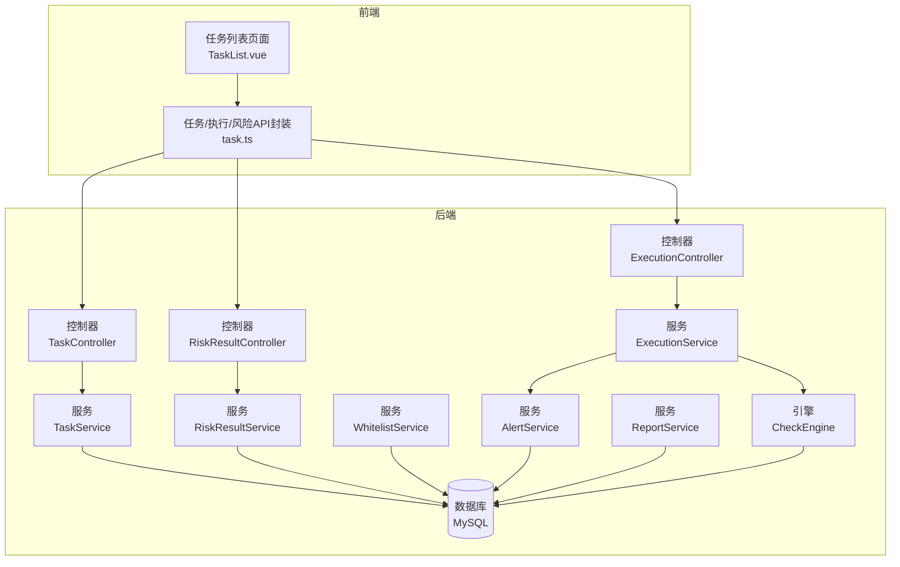
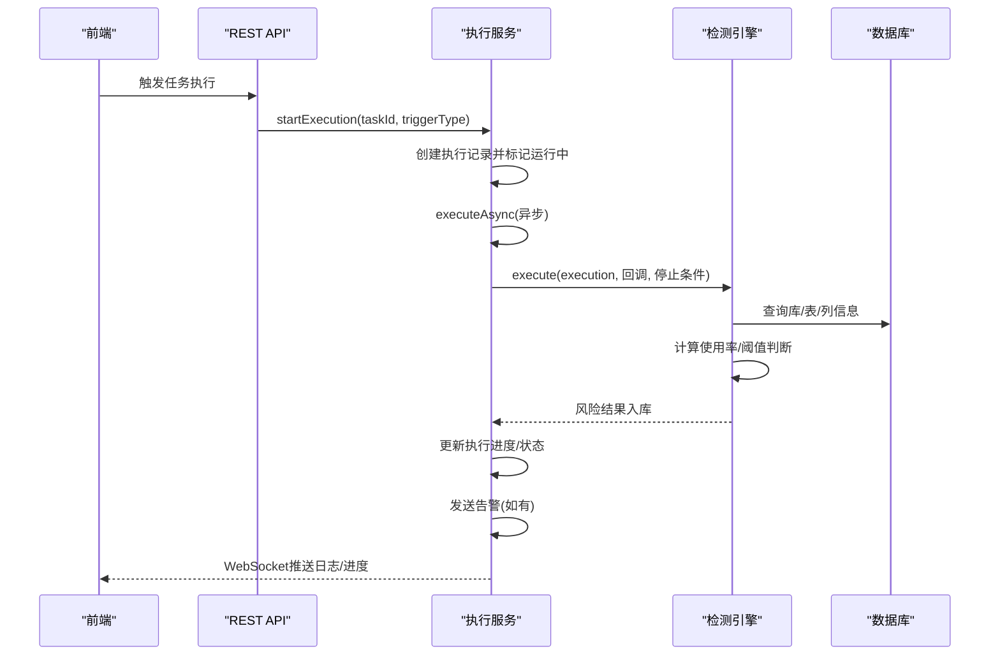
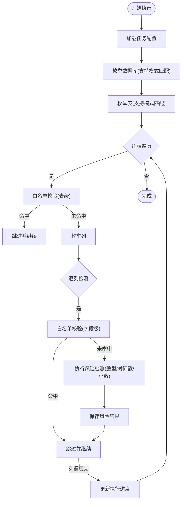
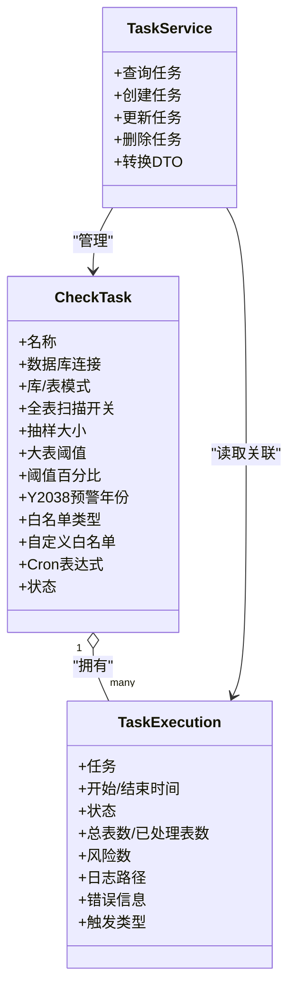
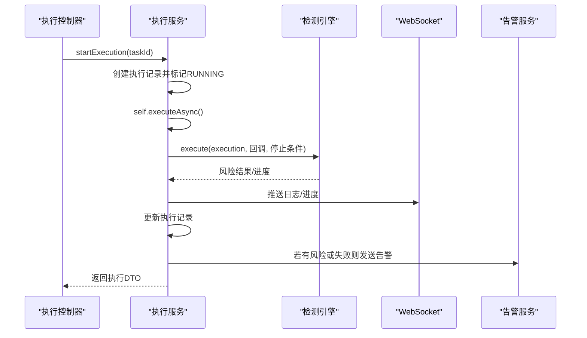
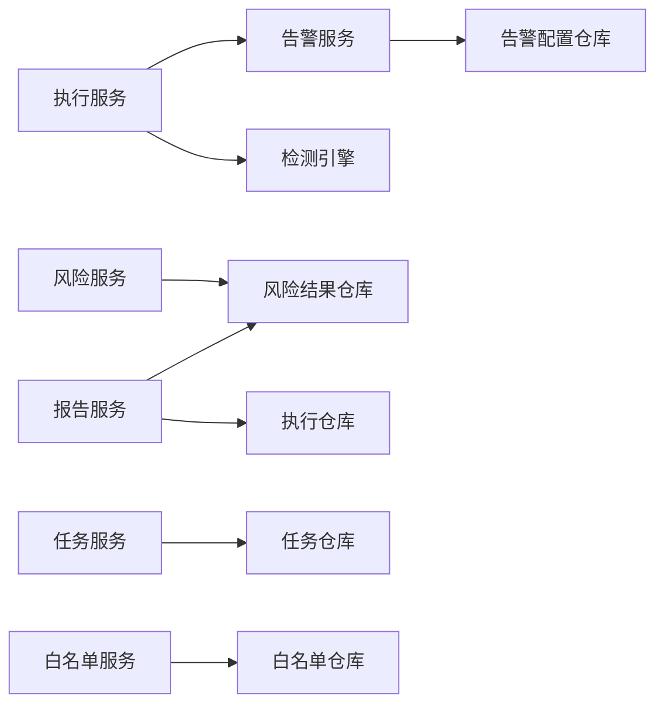

# 核心功能模块

<cite>
**本文引用的文件**
- [CheckEngine.java](file://backend/src/main/java/com/fieldcheck/engine/CheckEngine.java)
- [TaskService.java](file://backend/src/main/java/com/fieldcheck/service/TaskService.java)
- [ExecutionService.java](file://backend/src/main/java/com/fieldcheck/service/ExecutionService.java)
- [RiskResultService.java](file://backend/src/main/java/com/fieldcheck/service/RiskResultService.java)
- [WhitelistService.java](file://backend/src/main/java/com/fieldcheck/service/WhitelistService.java)
- [AlertService.java](file://backend/src/main/java/com/fieldcheck/service/AlertService.java)
- [ReportService.java](file://backend/src/main/java/com/fieldcheck/service/ReportService.java)
- [TaskController.java](file://backend/src/main/java/com/fieldcheck/controller/TaskController.java)
- [ExecutionController.java](file://backend/src/main/java/com/fieldcheck/controller/ExecutionController.java)
- [RiskResultController.java](file://backend/src/main/java/com/fieldcheck/controller/RiskResultController.java)
- [CheckTask.java](file://backend/src/main/java/com/fieldcheck/entity/CheckTask.java)
- [TaskExecution.java](file://backend/src/main/java/com/fieldcheck/entity/TaskExecution.java)
- [application.yml](file://backend/src/main/resources/application.yml)
- [pom.xml](file://backend/pom.xml)
- [TaskList.vue](file://frontend/src/views/task/TaskList.vue)
- [task.ts](file://frontend/src/api/task.ts)
- [docker-compose.yml](file://docker-compose.yml)
</cite>

## 目录
1. [简介](#简介)
2. [项目结构](#项目结构)
3. [核心组件](#核心组件)
4. [架构总览](#架构总览)
5. [详细组件分析](#详细组件分析)
6. [依赖分析](#依赖分析)
7. [性能考量](#性能考量)
8. [故障排查指南](#故障排查指南)
9. [结论](#结论)
10. [附录](#附录)

## 简介
本文件面向MySQL风险字段检查平台的核心功能模块，系统化梳理风险检测引擎、任务管理系统、执行监控系统、白名单管理、告警通知与报告生成等模块的职责、实现原理、交互流程、配置与扩展点、性能特征、错误处理与最佳实践。文档旨在帮助开发者与运维人员快速理解平台架构与使用方法。

## 项目结构
后端采用Spring Boot + JPA + Quartz + WebSocket；前端基于Vue 3 + Element Plus；通过REST接口与WebSocket进行前后端交互；Docker Compose编排MySQL、后端与前端服务。

图表来源
- [TaskList.vue](file://frontend/src/views/task/TaskList.vue#L1-L137)
- [task.ts](file://frontend/src/api/task.ts#L1-L88)
- [TaskController.java](file://backend/src/main/java/com/fieldcheck/controller/TaskController.java#L1-L99)
- [ExecutionController.java](file://backend/src/main/java/com/fieldcheck/controller/ExecutionController.java#L1-L79)
- [RiskResultController.java](file://backend/src/main/java/com/fieldcheck/controller/RiskResultController.java#L1-L146)
- [TaskService.java](file://backend/src/main/java/com/fieldcheck/service/TaskService.java#L1-L177)
- [ExecutionService.java](file://backend/src/main/java/com/fieldcheck/service/ExecutionService.java#L1-L307)
- [RiskResultService.java](file://backend/src/main/java/com/fieldcheck/service/RiskResultService.java#L1-L124)
- [WhitelistService.java](file://backend/src/main/java/com/fieldcheck/service/WhitelistService.java#L1-L153)
- [AlertService.java](file://backend/src/main/java/com/fieldcheck/service/AlertService.java#L1-L274)
- [ReportService.java](file://backend/src/main/java/com/fieldcheck/service/ReportService.java#L1-L369)
- [CheckEngine.java](file://backend/src/main/java/com/fieldcheck/engine/CheckEngine.java#L1-L454)

章节来源
- [application.yml](file://backend/src/main/resources/application.yml#L1-L75)
- [pom.xml](file://backend/pom.xml#L1-L161)
- [docker-compose.yml](file://docker-compose.yml#L1-L91)

## 核心组件
- 风险检测引擎：负责对目标数据库的表与字段进行风险扫描，识别整型溢出、Y2038、小数溢出等风险，并产出风险结果。
- 任务管理系统：提供任务的创建、更新、删除、查询与调度配置，关联告警配置。
- 执行监控系统：负责任务执行的异步调度、进度上报、日志推送、停止控制与告警触发。
- 白名单管理：支持全局/自定义白名单规则，按库/表/字段粒度匹配，避免误报。
- 告警通知：支持钉钉与邮件两种渠道，支持测试发送与动态配置。
- 报告生成：生成单次执行与任务维度的Markdown报告，并提供Excel导出与文件管理。

章节来源
- [CheckEngine.java](file://backend/src/main/java/com/fieldcheck/engine/CheckEngine.java#L1-L454)
- [TaskService.java](file://backend/src/main/java/com/fieldcheck/service/TaskService.java#L1-L177)
- [ExecutionService.java](file://backend/src/main/java/com/fieldcheck/service/ExecutionService.java#L1-L307)
- [WhitelistService.java](file://backend/src/main/java/com/fieldcheck/service/WhitelistService.java#L1-L153)
- [AlertService.java](file://backend/src/main/java/com/fieldcheck/service/AlertService.java#L1-L274)
- [ReportService.java](file://backend/src/main/java/com/fieldcheck/service/ReportService.java#L1-L369)

## 架构总览
平台采用“控制器-服务-引擎-仓库-数据库”的分层架构，结合WebSocket实现实时日志推送，使用Quartz实现任务调度，JPA负责数据持久化。

图表来源
- [ExecutionController.java](file://backend/src/main/java/com/fieldcheck/controller/ExecutionController.java#L1-L79)
- [ExecutionService.java](file://backend/src/main/java/com/fieldcheck/service/ExecutionService.java#L1-L307)
- [CheckEngine.java](file://backend/src/main/java/com/fieldcheck/engine/CheckEngine.java#L1-L454)

## 详细组件分析

### 风险检测引擎（CheckEngine）
- 职责
  - 解析任务配置，连接目标数据库，枚举库、表、列。
  - 对整型、时间戳、小数三类风险进行检测，计算使用率并对比阈值。
  - 支持大表抽样与全表扫描策略，降低资源消耗。
  - 与白名单服务协作，跳过白名单对象。
- 关键算法
  - 整型溢出：基于列类型最大值与实际最大/最小值计算使用率。
  - Y2038：检测TIMESTAMP最大值是否接近2038年边界。
  - 小数溢出：基于精度与标度计算允许的最大绝对值。
- 性能优化
  - 大表阈值与抽样大小可配置，默认抽样1000条以平衡准确性与性能。
  - 进度与风险计数批量落库，减少写放大。
- 错误处理
  - 数据库异常包装为运行时异常并回滚事务。
  - 支持任务中途停止，及时退出循环并记录日志。

图表来源
- [CheckEngine.java](file://backend/src/main/java/com/fieldcheck/engine/CheckEngine.java#L1-L454)

章节来源
- [CheckEngine.java](file://backend/src/main/java/com/fieldcheck/engine/CheckEngine.java#L57-L139)
- [CheckEngine.java](file://backend/src/main/java/com/fieldcheck/engine/CheckEngine.java#L216-L385)

### 任务管理系统（TaskService）
- 职责
  - 提供任务的分页查询、详情、创建、更新、删除与关联告警配置。
  - 维护任务与告警配置的多对多关联（通过中间表）。
- 关键点
  - 创建/更新时对连接、告警配置的存在性进行校验。
  - 删除任务前检查是否存在运行中的执行记录，避免破坏一致性。

图表来源
- [CheckTask.java](file://backend/src/main/java/com/fieldcheck/entity/CheckTask.java#L1-L75)
- [TaskExecution.java](file://backend/src/main/java/com/fieldcheck/entity/TaskExecution.java#L1-L58)
- [TaskService.java](file://backend/src/main/java/com/fieldcheck/service/TaskService.java#L1-L177)

章节来源
- [TaskService.java](file://backend/src/main/java/com/fieldcheck/service/TaskService.java#L30-L84)
- [TaskService.java](file://backend/src/main/java/com/fieldcheck/service/TaskService.java#L86-L129)
- [TaskService.java](file://backend/src/main/java/com/fieldcheck/service/TaskService.java#L131-L140)
- [TaskService.java](file://backend/src/main/java/com/fieldcheck/service/TaskService.java#L142-L176)

### 执行监控系统（ExecutionService）
- 职责
  - 异步执行任务，实时更新执行进度与风险计数。
  - 通过WebSocket向前端推送日志与进度。
  - 支持手动停止任务，清理内存运行状态。
  - 任务完成后根据风险数或失败状态触发告警。
- 关键机制
  - 使用ConcurrentHashMap维护“任务ID-运行中”状态，避免重复执行。
  - 通过自注入@EnableAsync代理绕过同进程调用导致的AOP失效。
  - 日志同时写入文件与WebSocket通道，便于离线审计与实时查看。

图表来源
- [ExecutionController.java](file://backend/src/main/java/com/fieldcheck/controller/ExecutionController.java#L1-L79)
- [ExecutionService.java](file://backend/src/main/java/com/fieldcheck/service/ExecutionService.java#L107-L210)
- [AlertService.java](file://backend/src/main/java/com/fieldcheck/service/AlertService.java#L124-L140)

章节来源
- [ExecutionService.java](file://backend/src/main/java/com/fieldcheck/service/ExecutionService.java#L107-L163)
- [ExecutionService.java](file://backend/src/main/java/com/fieldcheck/service/ExecutionService.java#L165-L210)
- [ExecutionService.java](file://backend/src/main/java/com/fieldcheck/service/ExecutionService.java#L212-L224)
- [ExecutionService.java](file://backend/src/main/java/com/fieldcheck/service/ExecutionService.java#L226-L235)
- [ExecutionService.java](file://backend/src/main/java/com/fieldcheck/service/ExecutionService.java#L237-L268)
- [ExecutionService.java](file://backend/src/main/java/com/fieldcheck/service/ExecutionService.java#L270-L282)
- [ExecutionService.java](file://backend/src/main/java/com/fieldcheck/service/ExecutionService.java#L284-L305)

### 白名单管理（WhitelistService）
- 职责
  - 维护全局白名单规则，支持数据库/表/字段三个层级。
  - 支持任务级白名单类型（全局/自定义），自定义白名单以文本块形式解析。
  - 规则匹配支持通配符与正则，自动推断规则类型。
- 使用建议
  - 先全局后自定义，避免重复规则。
  - 字段级规则优先于表级，表级优先于库级。

章节来源
- [WhitelistService.java](file://backend/src/main/java/com/fieldcheck/service/WhitelistService.java#L66-L89)
- [WhitelistService.java](file://backend/src/main/java/com/fieldcheck/service/WhitelistService.java#L91-L104)
- [WhitelistService.java](file://backend/src/main/java/com/fieldcheck/service/WhitelistService.java#L106-L140)

### 告警通知（AlertService）
- 职责
  - 管理告警配置（名称、类型、启用状态、配置JSON）。
  - 支持钉钉Webhook（带签名）、邮件（SMTP动态配置）。
  - 提供测试发送能力，便于配置验证。
- 配置要点
  - 钉钉：webhook地址与可选密钥（HMAC-SHA256签名）。
  - 邮件：SMTP主机、端口、用户名、密码、收件人等。

章节来源
- [AlertService.java](file://backend/src/main/java/com/fieldcheck/service/AlertService.java#L38-L64)
- [AlertService.java](file://backend/src/main/java/com/fieldcheck/service/AlertService.java#L75-L97)
- [AlertService.java](file://backend/src/main/java/com/fieldcheck/service/AlertService.java#L99-L122)
- [AlertService.java](file://backend/src/main/java/com/fieldcheck/service/AlertService.java#L124-L140)
- [AlertService.java](file://backend/src/main/java/com/fieldcheck/service/AlertService.java#L159-L199)
- [AlertService.java](file://backend/src/main/java/com/fieldcheck/service/AlertService.java#L201-L245)
- [AlertService.java](file://backend/src/main/java/com/fieldcheck/service/AlertService.java#L247-L272)

### 报告生成（ReportService）
- 职责
  - 生成单次执行与任务维度的Markdown报告，包含摘要、明细与优化建议。
  - 提供Excel导出与报告文件列表、删除能力。
- 输出示例
  - 执行报告：包含基本信息、检查摘要、风险详情、优化建议与时间戳。
  - 任务报告：包含执行历史、风险汇总、风险详情与建议。

章节来源
- [ReportService.java](file://backend/src/main/java/com/fieldcheck/service/ReportService.java#L34-L54)
- [ReportService.java](file://backend/src/main/java/com/fieldcheck/service/ReportService.java#L59-L101)
- [ReportService.java](file://backend/src/main/java/com/fieldcheck/service/ReportService.java#L106-L148)
- [ReportService.java](file://backend/src/main/java/com/fieldcheck/service/ReportService.java#L150-L205)
- [ReportService.java](file://backend/src/main/java/com/fieldcheck/service/ReportService.java#L207-L225)
- [ReportService.java](file://backend/src/main/java/com/fieldcheck/service/ReportService.java#L227-L262)
- [ReportService.java](file://backend/src/main/java/com/fieldcheck/service/ReportService.java#L264-L322)
- [ReportService.java](file://backend/src/main/java/com/fieldcheck/service/ReportService.java#L329-L339)

### 控制器与前端交互
- 控制器
  - 任务控制器：提供任务的CRUD、手动执行、停止与执行记录查询。
  - 执行控制器：提供执行记录查询、进度、日志与下载。
  - 风险控制器：提供风险结果查询、状态更新、统计与Excel导出。
- 前端
  - 任务列表页面支持查询、执行、监控、编辑与删除。
  - API封装统一了后端接口调用，便于复用。

章节来源
- [TaskController.java](file://backend/src/main/java/com/fieldcheck/controller/TaskController.java#L30-L41)
- [TaskController.java](file://backend/src/main/java/com/fieldcheck/controller/TaskController.java#L49-L79)
- [ExecutionController.java](file://backend/src/main/java/com/fieldcheck/controller/ExecutionController.java#L27-L38)
- [ExecutionController.java](file://backend/src/main/java/com/fieldcheck/controller/ExecutionController.java#L46-L56)
- [RiskResultController.java](file://backend/src/main/java/com/fieldcheck/controller/RiskResultController.java#L38-L52)
- [RiskResultController.java](file://backend/src/main/java/com/fieldcheck/controller/RiskResultController.java#L65-L72)
- [TaskList.vue](file://frontend/src/views/task/TaskList.vue#L75-L124)
- [task.ts](file://frontend/src/api/task.ts#L38-L87)

## 依赖分析
- 外部依赖
  - Spring Boot生态：Web、Data JPA、Security、WebSocket、Validation、AOP、Quartz、Mail。
  - MySQL驱动：mysql-connector-j。
  - JSON处理：Jackson。
  - HTTP客户端：Apache HttpClient。
  - Excel导出：Apache POI。
  - JWT：jjwt。
- 内部模块耦合
  - 执行服务依赖引擎与告警服务，受任务服务影响（任务告警配置）。
  - 风险服务依赖风险结果仓库，提供统计与导出。
  - 白名单服务独立，被引擎与任务服务间接使用。

图表来源
- [pom.xml](file://backend/pom.xml#L28-L134)
- [ExecutionService.java](file://backend/src/main/java/com/fieldcheck/service/ExecutionService.java#L37-L67)
- [AlertService.java](file://backend/src/main/java/com/fieldcheck/service/AlertService.java#L35-L36)
- [ReportService.java](file://backend/src/main/java/com/fieldcheck/service/ReportService.java#L24-L25)

章节来源
- [pom.xml](file://backend/pom.xml#L1-L161)

## 性能考量
- 并发与限流
  - 应用配置最大并发任务数，避免同时过多任务造成数据库压力。
- 扫描策略
  - 大表默认抽样，抽样大小与阈值可调；必要时开启全表扫描。
- 写入优化
  - 执行进度与风险计数批量落库，减少事务开销。
- 数据库连接池
  - HikariCP参数合理设置，保证连接复用与健康检查。
- 前端交互
  - 分页查询与增量日志推送，避免一次性传输大量数据。

章节来源
- [application.yml](file://backend/src/main/resources/application.yml#L64-L68)
- [CheckEngine.java](file://backend/src/main/java/com/fieldcheck/engine/CheckEngine.java#L274-L277)
- [ExecutionService.java](file://backend/src/main/java/com/fieldcheck/service/ExecutionService.java#L226-L235)

## 故障排查指南
- 任务无法启动
  - 检查是否存在运行中的执行记录；确认任务状态与告警配置有效。
- 执行卡住或无日志
  - 查看执行记录状态与错误信息；确认WebSocket连接正常。
- 告警未送达
  - 测试告警配置；核对钉钉Webhook与签名、邮件SMTP参数。
- 报告为空或缺失
  - 确认执行记录存在且包含风险；检查报告目录权限与磁盘空间。
- 数据库连接失败
  - 核对连接串、凭据与网络连通性；确认加密密钥配置正确。

章节来源
- [TaskService.java](file://backend/src/main/java/com/fieldcheck/service/TaskService.java#L131-L140)
- [ExecutionService.java](file://backend/src/main/java/com/fieldcheck/service/ExecutionService.java#L107-L131)
- [AlertService.java](file://backend/src/main/java/com/fieldcheck/service/AlertService.java#L99-L122)
- [ReportService.java](file://backend/src/main/java/com/fieldcheck/service/ReportService.java#L106-L112)

## 结论
平台通过清晰的模块划分与稳健的工程实践，实现了对MySQL字段容量风险的自动化检测、可视化监控与闭环告警。建议在生产环境中结合业务场景调整抽样策略与阈值，完善白名单规则，并定期生成报告进行趋势分析与治理。

## 附录

### 配置选项与扩展点
- 应用配置（application.yml）
  - 数据源与连接池参数、JPA方言与格式化、Quartz持久化、邮件默认配置、JWT密钥与过期、日志路径与并发限制。
- 任务配置（CheckTask）
  - 模式匹配、全表扫描开关、抽样大小、大表阈值、阈值百分比、Y2038预警年份、白名单类型与自定义内容、Cron表达式、状态。
- 告警配置（AlertConfig）
  - 名称、类型（钉钉/邮件）、启用状态、配置JSON（webhook/签名、SMTP参数、收件人）。
- 扩展点
  - 新增风险类型：在引擎中添加检测逻辑并在风险枚举中注册。
  - 新增告警渠道：在告警服务中新增分支并扩展配置结构。
  - 新增报告模板：在报告服务中扩展生成逻辑与导出格式。

章节来源
- [application.yml](file://backend/src/main/resources/application.yml#L8-L68)
- [CheckTask.java](file://backend/src/main/java/com/fieldcheck/entity/CheckTask.java#L29-L69)
- [AlertService.java](file://backend/src/main/java/com/fieldcheck/service/AlertService.java#L75-L92)