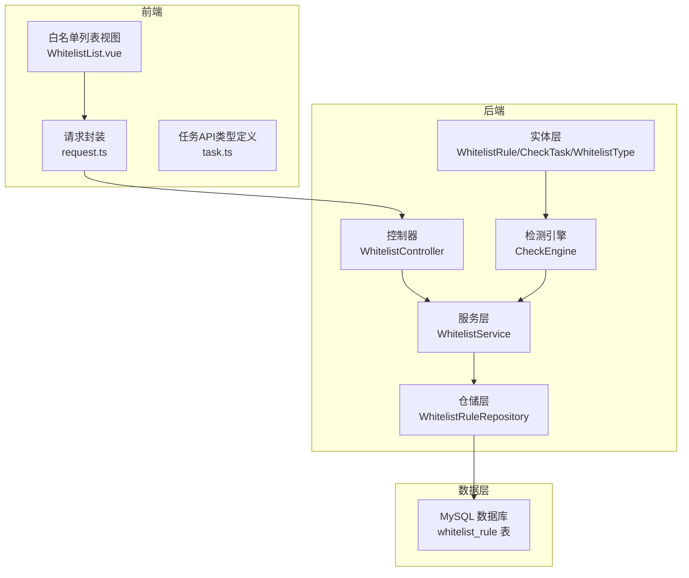
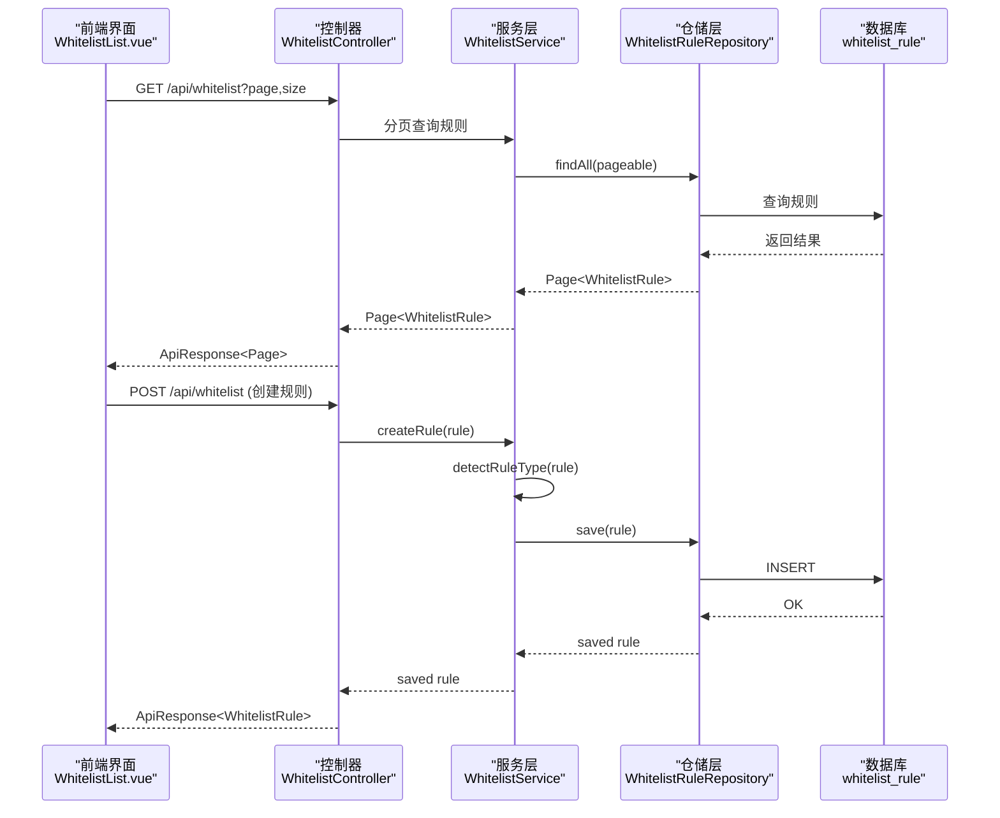
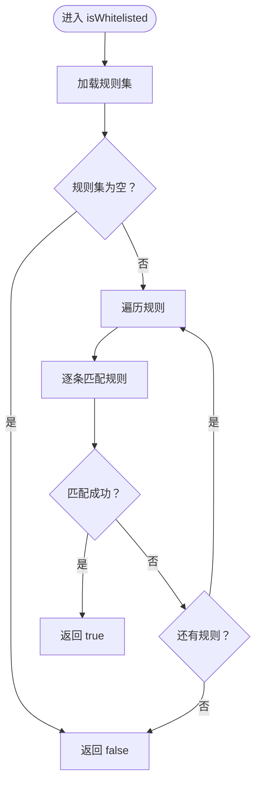
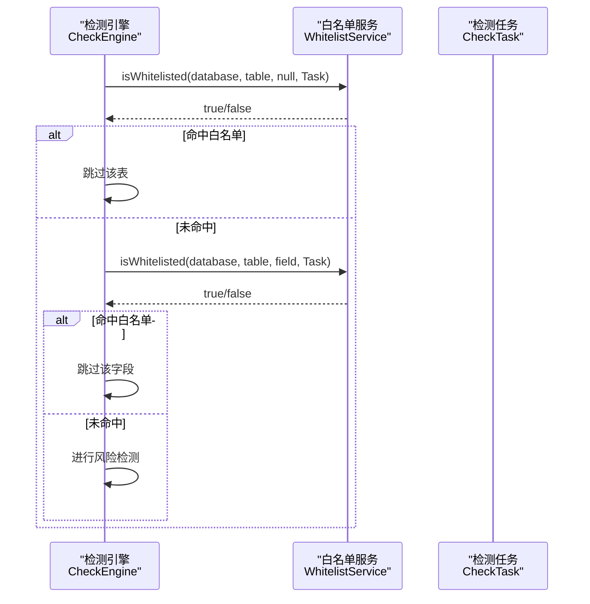
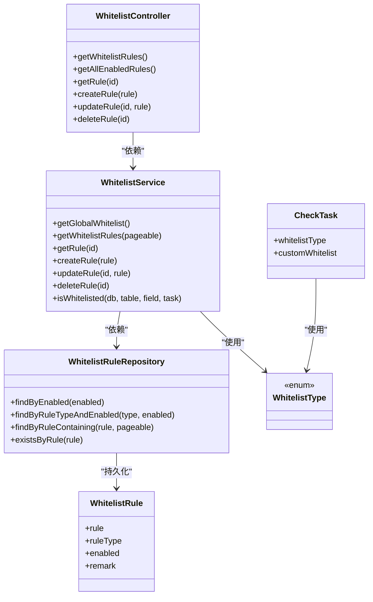

# 白名单管理系统

<cite>
**本文档引用的文件**
- [WhitelistRule.java](file://backend/src/main/java/com/fieldcheck/entity/WhitelistRule.java)
- [WhitelistService.java](file://backend/src/main/java/com/fieldcheck/service/WhitelistService.java)
- [WhitelistController.java](file://backend/src/main/java/com/fieldcheck/controller/WhitelistController.java)
- [WhitelistRuleRepository.java](file://backend/src/main/java/com/fieldcheck/repository/WhitelistRuleRepository.java)
- [WhitelistRuleType.java](file://backend/src/main/java/com/fieldcheck/entity/WhitelistRuleType.java)
- [WhitelistType.java](file://backend/src/main/java/com/fieldcheck/entity/WhitelistType.java)
- [BaseEntity.java](file://backend/src/main/java/com/fieldcheck/entity/BaseEntity.java)
- [CheckEngine.java](file://backend/src/main/java/com/fieldcheck/engine/CheckEngine.java)
- [CheckTask.java](file://backend/src/main/java/com/fieldcheck/entity/CheckTask.java)
- [01_init_schema.sql](file://mysql/init/01_init_schema.sql)
- [WhitelistList.vue](file://frontend/src/views/whitelist/WhitelistList.vue)
- [task.ts](file://frontend/src/api/task.ts)
- [request.ts](file://frontend/src/utils/request.ts)
</cite>

## 目录
1. [简介](#简介)
2. [项目结构](#项目结构)
3. [核心组件](#核心组件)
4. [架构总览](#架构总览)
5. [详细组件分析](#详细组件分析)
6. [依赖关系分析](#依赖关系分析)
7. [性能考量](#性能考量)
8. [故障排查指南](#故障排查指南)
9. [结论](#结论)
10. [附录](#附录)

## 简介
本系统围绕“白名单管理”展开，目标是通过可配置的规则集合，对数据库、表、字段进行白名单过滤，从而在风险检测流程中跳过受信任的对象，提升检测效率与准确性。系统提供三层白名单层级：数据库级、表级、字段级；支持全局白名单与自定义白名单两种来源；内置规则匹配算法与优先级处理逻辑，并提供完整的增删改查、分页查询、规则导入导出等能力。

## 项目结构
后端采用Spring Boot + JPA架构，白名单相关的核心代码集中在entity、service、repository、controller四个包内；前端Vue3 + Element Plus提供白名单规则的可视化管理界面。数据库初始化脚本包含白名单规则表结构及索引。

图表来源
- [WhitelistController.java](file://backend/src/main/java/com/fieldcheck/controller/WhitelistController.java#L1-L59)
- [WhitelistService.java](file://backend/src/main/java/com/fieldcheck/service/WhitelistService.java#L1-L153)
- [WhitelistRuleRepository.java](file://backend/src/main/java/com/fieldcheck/repository/WhitelistRuleRepository.java#L1-L23)
- [WhitelistRule.java](file://backend/src/main/java/com/fieldcheck/entity/WhitelistRule.java#L1-L34)
- [CheckEngine.java](file://backend/src/main/java/com/fieldcheck/engine/CheckEngine.java#L1-L454)
- [01_init_schema.sql](file://mysql/init/01_init_schema.sql#L157-L167)

章节来源
- [WhitelistController.java](file://backend/src/main/java/com/fieldcheck/controller/WhitelistController.java#L1-L59)
- [WhitelistService.java](file://backend/src/main/java/com/fieldcheck/service/WhitelistService.java#L1-L153)
- [WhitelistRuleRepository.java](file://backend/src/main/java/com/fieldcheck/repository/WhitelistRuleRepository.java#L1-L23)
- [WhitelistRule.java](file://backend/src/main/java/com/fieldcheck/entity/WhitelistRule.java#L1-L34)
- [CheckEngine.java](file://backend/src/main/java/com/fieldcheck/engine/CheckEngine.java#L1-L454)
- [01_init_schema.sql](file://mysql/init/01_init_schema.sql#L157-L167)

## 核心组件
- 实体模型
  - WhitelistRule：白名单规则实体，包含规则字符串、规则类型、启用状态、备注等字段。
  - WhitelistRuleType：规则类型枚举（DATABASE/TABLE/FIELD）。
  - WhitelistType：任务白名单来源类型（NONE/GLOBAL/CUSTOM）。
  - CheckTask：检测任务实体，包含白名单来源类型与自定义白名单文本。
  - BaseEntity：审计字段基类（创建时间、更新时间）。
- 服务层
  - WhitelistService：提供规则的增删改查、分页查询、全局白名单获取、白名单匹配判断、规则类型自动识别、自定义白名单解析等。
- 控制器层
  - WhitelistController：提供REST接口，支持分页查询、获取全部启用规则、按ID查询、创建、更新、删除。
- 仓储层
  - WhitelistRuleRepository：基于JPA的规则数据访问接口，提供按启用状态、规则类型、规则内容模糊查询等方法。
- 前端
  - WhitelistList.vue：白名单规则的增删改查界面。
  - request.ts：统一HTTP请求封装。
  - task.ts：任务相关API类型定义（用于任务侧白名单配置）。

章节来源
- [WhitelistRule.java](file://backend/src/main/java/com/fieldcheck/entity/WhitelistRule.java#L1-L34)
- [WhitelistRuleType.java](file://backend/src/main/java/com/fieldcheck/entity/WhitelistRuleType.java#L1-L8)
- [WhitelistType.java](file://backend/src/main/java/com/fieldcheck/entity/WhitelistType.java#L1-L8)
- [CheckTask.java](file://backend/src/main/java/com/fieldcheck/entity/CheckTask.java#L13-L74)
- [BaseEntity.java](file://backend/src/main/java/com/fieldcheck/entity/BaseEntity.java#L1-L28)
- [WhitelistService.java](file://backend/src/main/java/com/fieldcheck/service/WhitelistService.java#L1-L153)
- [WhitelistController.java](file://backend/src/main/java/com/fieldcheck/controller/WhitelistController.java#L1-L59)
- [WhitelistRuleRepository.java](file://backend/src/main/java/com/fieldcheck/repository/WhitelistRuleRepository.java#L1-L23)
- [WhitelistList.vue](file://frontend/src/views/whitelist/WhitelistList.vue#L1-L105)
- [request.ts](file://frontend/src/utils/request.ts#L1-L47)
- [task.ts](file://frontend/src/api/task.ts#L1-L88)

## 架构总览
白名单管理贯穿“前端界面—控制器—服务—仓储—数据库”的完整链路，并与检测引擎协作，在执行阶段对数据库、表、字段进行快速匹配与跳过。

图表来源
- [WhitelistController.java](file://backend/src/main/java/com/fieldcheck/controller/WhitelistController.java#L22-L57)
- [WhitelistService.java](file://backend/src/main/java/com/fieldcheck/service/WhitelistService.java#L30-L49)
- [WhitelistRuleRepository.java](file://backend/src/main/java/com/fieldcheck/repository/WhitelistRuleRepository.java#L13-L22)
- [01_init_schema.sql](file://mysql/init/01_init_schema.sql#L157-L167)

## 详细组件分析

### 实体设计：WhitelistRule
- 字段说明
  - rule：规则字符串，支持“数据库.*”、“数据库.表.*”、“数据库.表.字段”的形式，其中“*”为通配符，“?”为单字符通配。
  - ruleType：规则类型，由点号数量自动识别（0个点=数据库级，1个点=表级，2个点及以上=字段级）。
  - enabled：是否启用，默认true。
  - remark：备注信息。
  - 继承BaseEntity：自动维护创建时间与更新时间。
- 设计要点
  - 规则字符串采用“.”分段，便于后续按层级匹配。
  - 通过枚举限定规则类型，保证数据一致性。
  - TEXT字段支持较长的备注描述。

章节来源
- [WhitelistRule.java](file://backend/src/main/java/com/fieldcheck/entity/WhitelistRule.java#L18-L33)
- [BaseEntity.java](file://backend/src/main/java/com/fieldcheck/entity/BaseEntity.java#L14-L27)

### 服务实现：WhitelistService
- 核心功能
  - 规则管理：分页查询、按ID查询、创建、更新、删除。
  - 全局白名单：仅返回启用的规则。
  - 白名单匹配：根据任务的白名单来源（全局/自定义），收集规则集合并逐条匹配。
  - 规则类型识别：根据点号数量自动推断规则类型。
  - 自定义白名单解析：支持以换行分隔的多行自定义规则，忽略空行与注释行（以#开头）。
- 匹配算法与优先级
  - 优先级顺序：任务白名单来源 > 规则集 > 规则逐条匹配。
  - 匹配策略：按层级拆分规则，分别与数据库、表、字段进行匹配；若任一层级不匹配则整体不匹配。
  - 通配符处理：将规则转换为正则表达式进行大小写不敏感匹配，异常时回退到大小写不敏感比较。
- 事务与错误处理
  - 创建与更新使用事务，确保规则完整性。
  - 重复规则校验，避免冲突。
  - 规则不存在时抛出异常，便于上层处理。

图表来源
- [WhitelistService.java](file://backend/src/main/java/com/fieldcheck/service/WhitelistService.java#L66-L89)

章节来源
- [WhitelistService.java](file://backend/src/main/java/com/fieldcheck/service/WhitelistService.java#L26-L151)

### 控制器：WhitelistController
- 接口定义
  - GET /api/whitelist：分页查询所有规则（按创建时间倒序）。
  - GET /api/whitelist/all：获取全部启用规则。
  - GET /api/whitelist/{id}：按ID查询规则。
  - POST /api/whitelist：创建规则（需要特定角色）。
  - PUT /api/whitelist/{id}：更新规则（需要特定角色）。
  - DELETE /api/whitelist/{id}：删除规则（需要管理员角色）。
- 安全控制
  - 使用基于角色的访问控制注解，限制创建/更新/删除权限。

章节来源
- [WhitelistController.java](file://backend/src/main/java/com/fieldcheck/controller/WhitelistController.java#L22-L57)

### 仓储层：WhitelistRuleRepository
- 方法概览
  - findByEnabled：按启用状态查询。
  - findByRuleTypeAndEnabled：按规则类型与启用状态查询。
  - findByRuleContaining：按规则内容模糊查询。
  - existsByRule：检查规则是否存在。
- 设计意义
  - 支持全局白名单快速筛选与规则去重。
  - 提供规则内容检索能力，便于管理与审计。

章节来源
- [WhitelistRuleRepository.java](file://backend/src/main/java/com/fieldcheck/repository/WhitelistRuleRepository.java#L13-L22)

### 多级白名单机制与规则继承
- 层级定义
  - 数据库级：如“db.*”，匹配任意表。
  - 表级：如“db.table.*”，匹配该表下任意字段。
  - 字段级：如“db.table.field”，精确匹配字段。
- 规则继承关系
  - 字段级规则覆盖表级规则；表级规则覆盖数据库级规则。
  - 若某层级未指定，则视为“不限制”。
- 任务白名单来源
  - NONE：不使用白名单。
  - GLOBAL：使用全局启用规则。
  - CUSTOM：使用任务自定义白名单文本（多行规则，支持注释与空行）。

章节来源
- [WhitelistType.java](file://backend/src/main/java/com/fieldcheck/entity/WhitelistType.java#L1-L8)
- [CheckTask.java](file://backend/src/main/java/com/fieldcheck/entity/CheckTask.java#L54-L60)
- [WhitelistService.java](file://backend/src/main/java/com/fieldcheck/service/WhitelistService.java#L66-L104)

### 与检测引擎的集成
- 执行阶段调用
  - 在遍历表与字段前，先对表名进行白名单检查；命中则跳过该表。
  - 对字段进行白名单检查；命中则跳过该字段的风险检测。
- 性能优化
  - 白名单匹配在内存中进行，避免额外数据库查询。
  - 自定义白名单按任务加载，减少全局扫描成本。

图表来源
- [CheckEngine.java](file://backend/src/main/java/com/fieldcheck/engine/CheckEngine.java#L94-L114)
- [WhitelistService.java](file://backend/src/main/java/com/fieldcheck/service/WhitelistService.java#L66-L89)

章节来源
- [CheckEngine.java](file://backend/src/main/java/com/fieldcheck/engine/CheckEngine.java#L57-L139)

### 前端交互与API
- 白名单管理界面
  - 支持分页查看、新增/编辑/删除规则。
  - 规则类型显示为中文标签（数据库/表/字段）。
- 请求封装
  - request.ts统一设置基础URL与认证头，拦截401/403等错误。
- 任务侧白名单配置
  - 任务API类型定义包含白名单来源类型与自定义白名单文本字段，便于在任务层面启用白名单。

章节来源
- [WhitelistList.vue](file://frontend/src/views/whitelist/WhitelistList.vue#L10-L105)
- [request.ts](file://frontend/src/utils/request.ts#L4-L47)
- [task.ts](file://frontend/src/api/task.ts#L3-L20)

## 依赖关系分析
- 组件耦合
  - WhitelistController依赖WhitelistService；WhitelistService依赖WhitelistRuleRepository；WhitelistRuleRepository依赖数据库。
  - 检测引擎直接依赖WhitelistService，形成清晰的职责边界。
- 外部依赖
  - Spring Data JPA提供ORM与分页能力。
  - 正则表达式用于规则匹配与模式转换。
- 可能的循环依赖
  - 当前模块间无循环依赖，层次清晰。

图表来源
- [WhitelistController.java](file://backend/src/main/java/com/fieldcheck/controller/WhitelistController.java#L1-L59)
- [WhitelistService.java](file://backend/src/main/java/com/fieldcheck/service/WhitelistService.java#L1-L153)
- [WhitelistRuleRepository.java](file://backend/src/main/java/com/fieldcheck/repository/WhitelistRuleRepository.java#L1-L23)
- [WhitelistRule.java](file://backend/src/main/java/com/fieldcheck/entity/WhitelistRule.java#L1-L34)
- [WhitelistType.java](file://backend/src/main/java/com/fieldcheck/entity/WhitelistType.java#L1-L8)
- [CheckTask.java](file://backend/src/main/java/com/fieldcheck/entity/CheckTask.java#L54-L60)

## 性能考量
- 匹配复杂度
  - 单次匹配为O(n_rules)，n_rules通常较小，整体开销可控。
  - 规则解析与正则编译在服务启动时或首次使用时发生，后续复用。
- 数据库访问
  - 规则读取采用分页与条件查询，避免全表扫描。
  - 自定义白名单按任务加载，减少全局查询压力。
- 扫描优化
  - 检测引擎对命中白名单的表/字段直接跳过，显著降低IO与计算开销。
- 建议
  - 合理控制规则数量，避免过多规则导致匹配耗时增加。
  - 将高频匹配规则置于前面，提高命中概率。

[本节为通用性能讨论，无需列出具体文件来源]

## 故障排查指南
- 规则创建失败
  - 可能原因：规则已存在；规则格式不符合规范。
  - 处理建议：检查规则唯一性与层级结构。
- 匹配不生效
  - 可能原因：规则层级不匹配；通配符转义问题；大小写差异。
  - 处理建议：确认规则层级与目标对象层级一致；检查通配符使用；验证大小写不敏感匹配逻辑。
- 权限不足
  - 可能原因：未登录或角色不足。
  - 处理建议：确保携带有效Token并具备相应角色。
- 自定义白名单未生效
  - 可能原因：任务未选择CUSTOM来源；自定义白名单为空或注释行过多。
  - 处理建议：确认任务白名单来源类型；检查自定义白名单格式。

章节来源
- [WhitelistService.java](file://backend/src/main/java/com/fieldcheck/service/WhitelistService.java#L39-L64)
- [WhitelistController.java](file://backend/src/main/java/com/fieldcheck/controller/WhitelistController.java#L41-L57)
- [WhitelistService.java](file://backend/src/main/java/com/fieldcheck/service/WhitelistService.java#L91-L104)

## 结论
本白名单管理系统通过简洁的规则模型与高效的匹配算法，实现了数据库、表、字段三级白名单控制，并与检测引擎无缝集成，显著提升了大规模数据库检查的效率。系统提供完善的增删改查与分页能力，支持全局与自定义两种来源，满足不同场景下的灵活配置需求。建议在生产环境中结合业务实际，合理规划规则层级与数量，确保白名单既能发挥跳过作用，又不过度放宽风险检测范围。

[本节为总结性内容，无需列出具体文件来源]

## 附录

### 数据库表结构（白名单规则）
- 表名：whitelist_rule
- 关键列
  - id：主键
  - rule：规则字符串（非空）
  - rule_type：规则类型（DATABASE/TABLE/FIELD）
  - enabled：启用状态（bit）
  - remark：备注（text）
  - created_at/updated_at：审计字段

章节来源
- [01_init_schema.sql](file://mysql/init/01_init_schema.sql#L157-L167)

### API接口清单（白名单）
- GET /api/whitelist
  - 功能：分页查询所有规则（按创建时间倒序）
  - 参数：page（默认0）、size（默认20）
- GET /api/whitelist/all
  - 功能：获取全部启用规则
- GET /api/whitelist/{id}
  - 功能：按ID查询规则
- POST /api/whitelist
  - 功能：创建规则（需要特定角色）
- PUT /api/whitelist/{id}
  - 功能：更新规则（需要特定角色）
- DELETE /api/whitelist/{id}
  - 功能：删除规则（需要管理员角色）

章节来源
- [WhitelistController.java](file://backend/src/main/java/com/fieldcheck/controller/WhitelistController.java#L22-L57)

### 规则示例与最佳实践
- 示例
  - 数据库级：db_prod.*
  - 表级：finance.user_orders.*
  - 字段级：hr.employees.salary
- 最佳实践
  - 优先使用字段级规则以最小化影响面。
  - 将高频且稳定的规则置于前面，提升匹配效率。
  - 自定义白名单应避免冗余注释，保持简洁。
  - 定期清理失效规则，防止规则膨胀。

[本节为概念性内容，无需列出具体文件来源]